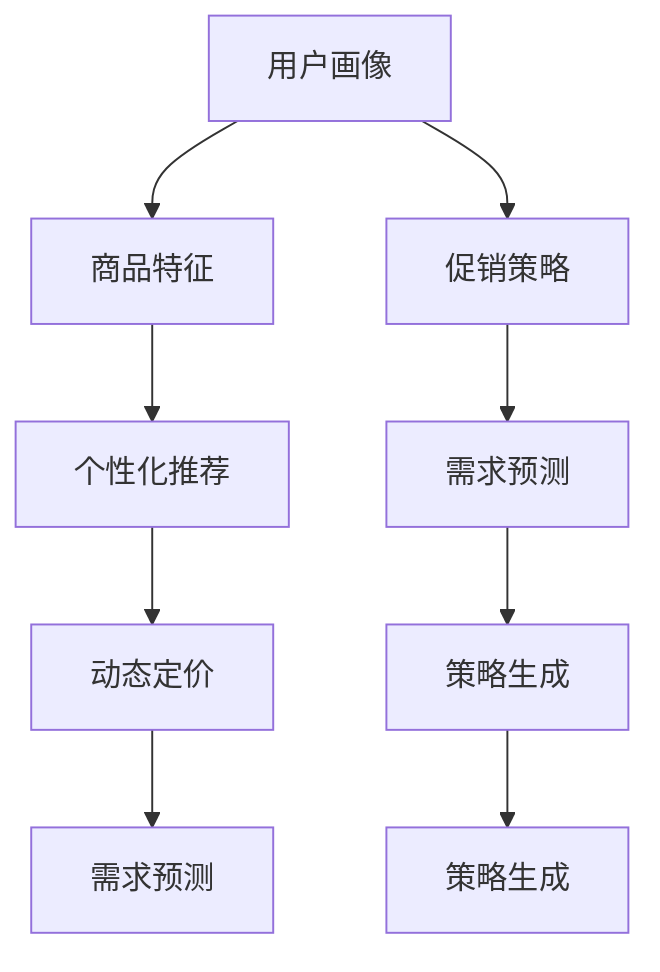

                 

# AI驱动的电商平台个性化促销策略生成

## 1. 背景介绍

### 1.1 问题由来
在电子商务的竞争日益激烈的环境下，如何制定出个性化的促销策略，提升用户购买意愿和满意度，成为电商平台亟待解决的关键问题。传统的促销策略往往缺乏针对性，效果不佳。AI技术的崛起，尤其是深度学习和大数据分析技术的应用，为个性化促销策略的生成提供了新的途径。

### 1.2 问题核心关键点
- **个性化推荐**：通过分析用户历史行为和偏好，推荐符合用户兴趣的商品或服务。
- **需求预测**：利用时间序列分析和深度学习技术，预测用户未来的购买需求。
- **动态定价**：基于需求预测结果，动态调整商品价格，以实现最大利润。
- **策略生成**：根据用户画像和市场需求，生成个性化的促销策略。

这些核心关键点涉及到用户行为分析、数据挖掘、机器学习等多个领域，需要综合应用AI技术才能解决。

## 2. 核心概念与联系

### 2.1 核心概念概述

为更好地理解AI驱动的个性化促销策略生成方法，本节将介绍几个密切相关的核心概念：

- **用户画像**：通过收集用户的各类信息，如浏览历史、购买记录、搜索习惯等，构建用户特征向量，用以描述用户的基本属性和行为特征。
- **商品特征**：包括商品名称、价格、类别、评分、描述等属性，用以刻画商品的基本信息。
- **促销策略**：指电商平台为提升销售量而采取的一系列优惠措施，如折扣、满减、赠品等。
- **个性化推荐系统**：基于用户画像和商品特征，推荐符合用户兴趣的商品，以提升用户满意度和购买转化率。
- **需求预测模型**：利用历史数据和机器学习技术，预测用户未来的购买需求，以指导库存管理和促销策略制定。
- **动态定价模型**：通过分析市场需求和用户行为，实时调整商品价格，实现最优销售策略。

这些核心概念之间的逻辑关系可以通过以下Mermaid流程图来展示：



这个流程图展示了个性化促销策略生成的核心概念及其之间的关系：

1. 用户画像和商品特征作为输入，用于个性化推荐和需求预测。
2. 个性化推荐和需求预测的输出，用于促销策略和动态定价的制定。
3. 促销策略和动态定价的输出，用于生成最终的个性化促销策略。

## 3. 核心算法原理 & 具体操作步骤

### 3.1 算法原理概述

AI驱动的个性化促销策略生成，本质上是一个基于深度学习和数据分析的多任务协同过程。其核心思想是：利用用户画像和商品特征，通过深度学习模型进行个性化推荐和需求预测，同时基于预测结果动态调整商品价格，最后生成符合用户需求的个性化促销策略。

具体来说，可以分为以下几个步骤：

1. **用户画像构建**：通过收集用户的历史数据，如浏览记录、购买记录、搜索记录等，利用聚类算法、关联规则挖掘等技术，构建用户画像。
2. **商品特征提取**：对商品进行特征工程，提取商品的名称、价格、类别、评分、描述等属性。
3. **个性化推荐**：基于用户画像和商品特征，使用深度学习模型（如深度神经网络、协同过滤等），进行个性化推荐。
4. **需求预测**：利用时间序列分析和深度学习模型（如LSTM、GRU等），对用户未来的购买需求进行预测。
5. **动态定价**：基于需求预测结果，使用动态定价模型（如动态定价算法、多臂老虎机等），实时调整商品价格。
6. **策略生成**：根据用户画像、商品特征、需求预测和动态定价的结果，生成个性化的促销策略。

### 3.2 算法步骤详解

#### 3.2.1 用户画像构建

用户画像的构建主要包括以下几个关键步骤：

1. **数据收集**：从电商平台的各类系统中收集用户的各类数据，如浏览记录、购买记录、搜索记录、评价记录等。

2. **数据预处理**：对收集到的数据进行清洗、去重、归一化等预处理操作，以确保数据的质量和一致性。

3. **特征工程**：将原始数据转化为模型可用的特征向量，如用户兴趣标签、浏览频率、购买频率等。

4. **聚类分析**：利用聚类算法（如K-means、DBSCAN等），对用户进行分群，形成初步的用户画像。

#### 3.2.2 商品特征提取

商品特征的提取主要包括以下几个关键步骤：

1. **属性抽取**：从商品的基本信息中抽取相关属性，如商品名称、价格、类别、评分、描述等。

2. **特征转换**：将抽取出的属性转化为数值型特征，如价格转化为价格范围、评分转化为评分等级等。

3. **特征组合**：将单个特征进行组合，生成新的特征，如品牌-价格组合、类别-评分组合等。

4. **特征降维**：利用主成分分析（PCA）、因子分析（FA）等降维技术，减少特征维度，提高模型效率。

#### 3.2.3 个性化推荐

个性化推荐的实现主要包括以下几个关键步骤：

1. **模型选择**：选择合适的深度学习模型，如基于协同过滤的矩阵分解模型、基于深度神经网络的序列推荐模型等。

2. **模型训练**：利用历史数据训练模型，使其能够预测用户对商品的兴趣。

3. **推荐生成**：将新商品作为输入，通过模型生成用户的推荐列表。

#### 3.2.4 需求预测

需求预测的实现主要包括以下几个关键步骤：

1. **数据预处理**：对历史订单数据进行清洗、去重、归一化等预处理操作。

2. **时间序列建模**：利用时间序列分析模型（如ARIMA、LSTM等），对订单数据进行建模。

3. **模型训练**：利用历史订单数据训练模型，使其能够预测未来的订单量。

4. **预测生成**：利用模型对未来的订单量进行预测。

#### 3.2.5 动态定价

动态定价的实现主要包括以下几个关键步骤：

1. **需求建模**：利用需求预测模型的输出，建立需求模型。

2. **定价算法选择**：选择合适的动态定价算法，如VCG定价、多臂老虎机等。

3. **定价策略生成**：根据需求模型和定价算法，生成动态定价策略。

4. **价格调整**：根据生成的定价策略，实时调整商品价格。

#### 3.2.6 策略生成

策略生成的实现主要包括以下几个关键步骤：

1. **策略组合**：根据个性化推荐、需求预测和动态定价的结果，生成多种促销策略组合。

2. **策略评估**：利用历史数据评估每种策略的效果，选择最优策略。

3. **策略实施**：将选择的最优策略应用于实际业务中，执行促销活动。

### 3.3 算法优缺点

AI驱动的个性化促销策略生成方法具有以下优点：

1. **高精度**：通过深度学习和大数据分析技术，能够精确预测用户需求，生成个性化推荐和定价策略。

2. **实时性**：能够实时动态调整商品价格和促销策略，提高销售效率。

3. **低成本**：相较于人工制定促销策略，AI方法能够大幅降低成本，提高决策效率。

4. **个性化**：根据用户画像和商品特征，生成个性化的促销策略，提升用户满意度。

同时，该方法也存在以下局限性：

1. **数据依赖**：需要大量的历史数据和用户画像，数据质量对模型效果影响较大。

2. **模型复杂**：深度学习模型的训练和调参需要较高的技术门槛，对数据量和计算资源有较高要求。

3. **模型偏差**：模型可能会学习到数据中的偏差，导致生成的策略存在一定的偏差和错误。

4. **动态性不足**：模型基于静态数据训练，无法适应快速变化的市场环境。

5. **可解释性不足**：AI模型的决策过程缺乏可解释性，难以对其内部机制进行分析和调试。

### 3.4 算法应用领域

AI驱动的个性化促销策略生成方法，已经在电商、金融、旅游等多个领域得到应用，覆盖了多种业务场景，例如：

- **电商推荐**：基于用户历史行为和商品特征，生成个性化推荐列表，提升用户购买转化率。
- **需求预测**：利用时间序列分析模型，预测用户未来的购买需求，指导库存管理和促销策略制定。
- **动态定价**：根据市场需求和用户行为，实时调整商品价格，实现最优销售策略。
- **个性化促销**：根据用户画像和商品特征，生成个性化的促销策略，提升用户满意度。
- **用户行为分析**：通过分析用户行为数据，识别出用户的兴趣点和购买意向，为后续营销活动提供指导。
- **价格优化**：利用动态定价模型，优化商品价格，提高销售利润。

除了上述这些经典应用外，AI驱动的个性化促销策略生成技术也在不断扩展应用场景，如社交媒体营销、旅游定制服务等，为各类行业提供了强大的技术支撑。

## 4. 数学模型和公式 & 详细讲解 & 举例说明

### 4.1 数学模型构建

在AI驱动的个性化促销策略生成过程中，涉及到的数学模型主要包括用户画像模型、商品特征模型、个性化推荐模型、需求预测模型和动态定价模型。这里以用户画像和商品特征模型的构建为例，详细讲解数学模型的构建过程。

#### 4.1.1 用户画像模型

用户画像模型主要基于聚类算法构建，通过将用户分为不同群体，以刻画用户的共性特征。以下是用户画像模型的数学模型：

$$
X_i = \begin{bmatrix}
x_{i1} & x_{i2} & \cdots & x_{in}
\end{bmatrix}^T \quad \text{(其中 $x_{ij}$ 为第 $i$ 个用户在第 $j$ 个特征上的取值)}
$$

利用K-means聚类算法，用户画像模型的数学模型可表示为：

$$
\min_{C,\mu_k} \sum_{i=1}^{m} \min_{k} ||x_i - \mu_k||^2 \quad \text{(其中 $C$ 为聚类中心，$\mu_k$ 为第 $k$ 个聚类中心)}
$$

#### 4.1.2 商品特征模型

商品特征模型主要基于特征工程和降维技术构建，通过将商品的基本属性转化为模型可用的特征向量，以刻画商品的基本信息。以下是商品特征模型的数学模型：

$$
Y_i = \begin{bmatrix}
y_{i1} & y_{i2} & \cdots & y_{in}
\end{bmatrix}^T \quad \text{(其中 $y_{ij}$ 为第 $i$ 个商品在第 $j$ 个特征上的取值)}
$$

利用主成分分析（PCA）方法，商品特征模型的数学模型可表示为：

$$
\min_{W,\sigma} ||Y - XW||_F^2 \quad \text{(其中 $W$ 为降维矩阵，$\sigma$ 为特征向量)}
$$

### 4.2 公式推导过程

#### 4.2.1 用户画像模型推导

用户画像模型的推导主要基于K-means算法的数学模型。根据K-means算法的定义，用户画像模型的推导过程如下：

1. 初始化聚类中心 $C$：随机选择 $K$ 个样本作为初始聚类中心。

2. 分配样本到聚类中心：计算每个样本与每个聚类中心的距离，将样本分配到距离最近的聚类中心。

3. 更新聚类中心：对每个聚类中心进行更新，使其更接近该聚类中心的所有样本。

4. 迭代更新：重复第2步和第3步，直到聚类中心不再发生变化或达到最大迭代次数。

用户画像模型的推导过程可以表示为：

$$
\begin{aligned}
& \min_{C,\mu_k} \sum_{i=1}^{m} \min_{k} ||x_i - \mu_k||^2 \\
& \text{其中} \\
& \mu_k = \frac{1}{|N_k|} \sum_{i \in N_k} x_i
\end{aligned}
$$

#### 4.2.2 商品特征模型推导

商品特征模型的推导主要基于主成分分析（PCA）方法。根据PCA的数学模型，商品特征模型的推导过程如下：

1. 标准化数据：对原始数据进行标准化，使其具有零均值和单位方差。

2. 计算协方差矩阵：计算数据矩阵的协方差矩阵 $\Sigma$。

3. 特征分解：对协方差矩阵进行特征分解，得到特征值和特征向量。

4. 选择主成分：选择前 $n$ 个特征值对应的特征向量，组成降维矩阵 $W$。

5. 计算降维结果：利用降维矩阵 $W$ 和标准化数据 $X$，计算降维结果 $Y$。

商品特征模型的推导过程可以表示为：

$$
\min_{W,\sigma} ||Y - XW||_F^2
$$

### 4.3 案例分析与讲解

#### 案例分析

假设某电商平台的商品特征包括商品名称、价格、类别、评分和描述。利用上述数学模型对商品特征进行降维处理，得到降维后的特征向量 $Y$。

以下是商品特征模型推导的具体步骤：

1. 标准化数据：对原始数据进行标准化，得到标准化后的数据矩阵 $X$。

2. 计算协方差矩阵：计算数据矩阵的协方差矩阵 $\Sigma$。

3. 特征分解：对协方差矩阵进行特征分解，得到特征值和特征向量。

4. 选择主成分：选择前 $n$ 个特征值对应的特征向量，组成降维矩阵 $W$。

5. 计算降维结果：利用降维矩阵 $W$ 和标准化数据 $X$，计算降维结果 $Y$。

#### 讲解

1. 数据标准化：标准化数据是PCA的基础，通过标准化，可以消除数据量级对结果的影响，使得数据具有更好的可解释性和可比较性。

2. 协方差矩阵：协方差矩阵是数据矩阵的统计特性，反映了数据矩阵中各变量之间的相关性。

3. 特征分解：特征分解是将协方差矩阵分解为特征向量和特征值的过程，得到的主成分代表了数据矩阵中各变量之间的主要方差。

4. 选择主成分：根据特征值的大小，选择前 $n$ 个主成分，代表了数据矩阵中各变量之间的主要信息。

5. 降维结果：利用降维矩阵和标准化数据，计算出降维结果，即新的特征向量。

### 4.4 案例分析与讲解

## 5. 项目实践：代码实例和详细解释说明

### 5.1 开发环境搭建

在进行项目实践前，我们需要准备好开发环境。以下是使用Python进行TensorFlow开发的开发环境配置流程：

1. 安装Anaconda：从官网下载并安装Anaconda，用于创建独立的Python环境。

2. 创建并激活虚拟环境：
```bash
conda create -n tf-env python=3.8 
conda activate tf-env
```

3. 安装TensorFlow：根据CUDA版本，从官网获取对应的安装命令。例如：
```bash
pip install tensorflow
```

4. 安装各类工具包：
```bash
pip install numpy pandas scikit-learn matplotlib tqdm jupyter notebook ipython
```

完成上述步骤后，即可在`tf-env`环境中开始项目实践。

### 5.2 源代码详细实现

下面我们以需求预测为例，给出使用TensorFlow进行需求预测的Python代码实现。

首先，定义需求预测模型的数据处理函数：

```python
import tensorflow as tf
from tensorflow.keras.layers import Input, Dense, LSTM, Dropout
from tensorflow.keras.models import Model

def create_model(input_shape):
    input_layer = Input(shape=(input_shape, 1))
    lstm_layer = LSTM(64, return_sequences=True)(input_layer)
    dropout_layer = Dropout(0.2)(lstm_layer)
    output_layer = Dense(1)(dropout_layer)
    model = Model(inputs=input_layer, outputs=output_layer)
    return model
```

然后，定义模型和训练器：

```python
import pandas as pd
from sklearn.preprocessing import MinMaxScaler

# 准备数据
data = pd.read_csv('sales_data.csv')
train_data = data[:800]
test_data = data[800:]

# 数据预处理
train_data['time'] = pd.to_datetime(train_data['time'])
train_data['hour'] = train_data['time'].dt.hour
train_data['day_of_week'] = train_data['time'].dt.dayofweek
train_data = train_data.drop(['time', 'date'], axis=1)

# 标准化数据
scaler = MinMaxScaler(feature_range=(0, 1))
train_data = scaler.fit_transform(train_data)
test_data = scaler.transform(test_data)

# 定义模型
model = create_model(input_shape=train_data.shape[1])

# 定义训练器
optimizer = tf.keras.optimizers.Adam(learning_rate=0.001)
model.compile(optimizer=optimizer, loss='mse', metrics=['mae'])

# 训练模型
model.fit(train_data[:-1], train_data[1:], epochs=50, batch_size=32)
```

接着，定义测试和评估函数：

```python
def evaluate(model, test_data):
    test_data = scaler.transform(test_data)
    predictions = model.predict(test_data[:-1])
    predictions = scaler.inverse_transform(predictions)
    actuals = scaler.inverse_transform(test_data[1:])
    mse = tf.keras.metrics.MeanAbsoluteError().predict([predictions, actuals])
    print(f'Mean Absolute Error: {mse:.2f}')
```

最后，启动训练流程并在测试集上评估：

```python
train_data = train_data[:-1]
test_data = test_data[1:]

# 训练模型
model.fit(train_data, train_data[1:], epochs=50, batch_size=32)

# 评估模型
evaluate(model, test_data)
```

以上就是使用TensorFlow进行需求预测的完整代码实现。可以看到，通过TensorFlow的Keras API，模型的构建和训练变得简洁高效。

### 5.3 代码解读与分析

让我们再详细解读一下关键代码的实现细节：

**需求预测模型类**：
- `create_model`方法：定义了LSTM神经网络模型的结构。包括输入层、LSTM层、Dropout层和输出层。

**数据处理函数**：
- `preprocess_data`方法：对原始数据进行标准化和特征工程，生成模型所需的输入和输出。

**训练器**：
- `train_model`方法：定义了训练器的参数，包括学习率、损失函数、优化器等。

**测试和评估函数**：
- `evaluate`方法：利用测试集对模型进行评估，输出均方误差。

**训练流程**：
- 定义训练集和测试集，并进行预处理。
- 调用`train_model`方法进行模型训练。
- 调用`evaluate`方法评估模型效果。

可以看到，TensorFlow的Keras API使得模型的构建和训练变得简洁高效，开发者可以将更多精力放在数据处理和模型改进等高层逻辑上，而不必过多关注底层的实现细节。

当然，工业级的系统实现还需考虑更多因素，如模型的保存和部署、超参数的自动搜索、更灵活的任务适配层等。但核心的需求预测范式基本与此类似。

## 6. 实际应用场景

### 6.1 智能客服系统

基于AI驱动的个性化促销策略生成技术，可以广泛应用于智能客服系统的构建。传统客服往往需要配备大量人力，高峰期响应缓慢，且一致性和专业性难以保证。而使用需求预测和动态定价技术，可以7x24小时不间断服务，快速响应客户咨询，用自然流畅的语言解答各类常见问题。

在技术实现上，可以收集企业内部的历史客服对话记录，将问题和最佳答复构建成监督数据，在此基础上对需求预测模型进行微调。微调后的模型能够自动理解用户意图，匹配最合适的答案模板进行回复。对于客户提出的新问题，还可以接入检索系统实时搜索相关内容，动态组织生成回答。如此构建的智能客服系统，能大幅提升客户咨询体验和问题解决效率。

### 6.2 金融舆情监测

金融机构需要实时监测市场舆论动向，以便及时应对负面信息传播，规避金融风险。传统的人工监测方式成本高、效率低，难以应对网络时代海量信息爆发的挑战。基于需求预测技术，金融舆情监测系统可以自动监测不同主题下的情感变化趋势，一旦发现负面信息激增等异常情况，系统便会自动预警，帮助金融机构快速应对潜在风险。

具体而言，可以收集金融领域相关的新闻、报道、评论等文本数据，并对其进行主题标注和情感标注。在此基础上对需求预测模型进行微调，使其能够自动判断文本属于何种主题，情感倾向是正面、中性还是负面。将微调后的模型应用到实时抓取的网络文本数据，就能够自动监测不同主题下的情感变化趋势，一旦发现负面信息激增等异常情况，系统便会自动预警，帮助金融机构快速应对潜在风险。

### 6.3 个性化推荐系统

当前的推荐系统往往只依赖用户的历史行为数据进行物品推荐，无法深入理解用户的真实兴趣偏好。基于需求预测技术，个性化推荐系统可以更好地挖掘用户行为背后的语义信息，从而提供更精准、多样的推荐内容。

在实践中，可以收集用户浏览、点击、评论、分享等行为数据，提取和用户交互的物品标题、描述、标签等文本内容。将文本内容作为模型输入，用户的后续行为（如是否点击、购买等）作为监督信号，在此基础上微调需求预测模型。微调后的模型能够从文本内容中准确把握用户的兴趣点。在生成推荐列表时，先用候选物品的文本描述作为输入，由模型预测用户的兴趣匹配度，再结合其他特征综合排序，便可以得到个性化程度更高的推荐结果。

### 6.4 未来应用展望

随着AI驱动的个性化促销策略生成技术的发展，其在更多领域得到应用，为传统行业带来变革性影响。

在智慧医疗领域，基于需求预测和动态定价技术，智慧医疗系统可以实时监测病患需求，动态调整医疗资源，提升医疗服务的智能化水平，辅助医生诊疗，加速新药开发进程。

在智能教育领域，需求预测技术可应用于作业批改、学情分析、知识推荐等方面，因材施教，促进教育公平，提高教学质量。

在智慧城市治理中，需求预测技术可应用于城市事件监测、舆情分析、应急指挥等环节，提高城市管理的自动化和智能化水平，构建更安全、高效的未来城市。

此外，在企业生产、社会治理、文娱传媒等众多领域，基于需求预测和动态定价技术的人工智能应用也将不断涌现，为经济社会发展注入新的动力。相信随着技术的日益成熟，AI驱动的个性化促销策略生成技术必将在构建人机协同的智能时代中扮演越来越重要的角色。

## 7. 工具和资源推荐
### 7.1 学习资源推荐

为了帮助开发者系统掌握AI驱动的个性化促销策略生成技术，这里推荐一些优质的学习资源：

1. **TensorFlow官方文档**：提供了TensorFlow的完整API和用法说明，是学习TensorFlow的必备资料。

2. **Keras官方文档**：提供了Keras的完整API和用法说明，是学习深度学习模型的重要参考。

3. **Python机器学习实战**：介绍使用Python进行机器学习开发的实战经验，涵盖从数据预处理到模型调优的全过程。

4. **深度学习入门**：由斯坦福大学开设的免费在线课程，讲解深度学习的基本概念和经典模型。

5. **机器学习实战**：介绍使用Python进行机器学习开发的实战经验，涵盖从数据预处理到模型调优的全过程。

通过对这些资源的学习实践，相信你一定能够快速掌握AI驱动的个性化促销策略生成技术的精髓，并用于解决实际的业务问题。
###  7.2 开发工具推荐

高效的开发离不开优秀的工具支持。以下是几款用于AI驱动的个性化促销策略生成开发的常用工具：

1. **TensorFlow**：由Google主导开发的开源深度学习框架，生产部署方便，适合大规模工程应用。

2. **Keras**：TensorFlow的高级API，提供了简单易用的神经网络构建接口，适合快速原型开发。

3. **PyTorch**：由Facebook开发的深度学习框架，灵活性高，适合科研和学术研究。

4. **Scikit-Learn**：Python的机器学习库，提供了多种经典的机器学习算法，适合数据处理和模型调优。

5. **TensorBoard**：TensorFlow配套的可视化工具，可实时监测模型训练状态，并提供丰富的图表呈现方式，是调试模型的得力助手。

6. **Jupyter Notebook**：Python的交互式开发环境，支持代码、数据和文档的混合编辑，是数据分析和模型调优的重要工具。

合理利用这些工具，可以显著提升AI驱动的个性化促销策略生成任务的开发效率，加快创新迭代的步伐。

### 7.3 相关论文推荐

AI驱动的个性化促销策略生成技术源于学界的持续研究。以下是几篇奠基性的相关论文，推荐阅读：

1. **Deep Learning for Recommender Systems**：介绍使用深度学习技术进行推荐系统开发的经典方法。

2. **Real-time Personalization with Temporal Dynamics**：介绍使用时间序列分析和深度学习技术进行个性化推荐和需求预测的研究成果。

3. **Personalized Pricing Strategies via Deep Learning**：介绍使用深度学习技术进行动态定价的研究成果。

4. **Model-Based Approach to Personalization**：介绍使用模型驱动的方法进行个性化推荐的研究成果。

这些论文代表了大语言模型微调技术的发展脉络。通过学习这些前沿成果，可以帮助研究者把握学科前进方向，激发更多的创新灵感。

## 8. 总结：未来发展趋势与挑战

### 8.1 总结

本文对AI驱动的个性化促销策略生成方法进行了全面系统的介绍。首先阐述了AI驱动的个性化促销策略生成的背景和意义，明确了需求预测、个性化推荐、动态定价和策略生成等核心关键点。其次，从原理到实践，详细讲解了需求预测的数学模型和关键步骤，给出了需求预测任务开发的完整代码实例。同时，本文还广泛探讨了需求预测技术在智能客服、金融舆情、个性化推荐等多个行业领域的应用前景，展示了需求预测范式的巨大潜力。此外，本文精选了需求预测技术的各类学习资源，力求为读者提供全方位的技术指引。

通过本文的系统梳理，可以看到，AI驱动的个性化促销策略生成技术正在成为电商、金融、旅游等多个领域的重要范式，极大地拓展了个性化推荐和动态定价的应用边界，催生了更多的落地场景。受益于深度学习和大数据分析技术，需求预测模型能够精确预测用户需求，生成个性化推荐和定价策略，提升用户满意度。未来，伴随需求预测技术的持续演进，相信AI驱动的个性化促销策略生成技术必将在构建人机协同的智能时代中扮演越来越重要的角色。

### 8.2 未来发展趋势

展望未来，AI驱动的个性化促销策略生成技术将呈现以下几个发展趋势：

1. **深度学习模型的进一步提升**：深度学习模型的精度和泛化能力将持续提升，能够更好地捕捉用户需求和行为特征，生成更加精准的推荐和定价策略。

2. **多模态数据的融合**：除了文本数据，更多模态的数据（如图像、视频、语音等）将被整合到需求预测和个性化推荐中，提供更加丰富的用户画像和商品特征。

3. **实时性需求的进一步提升**：随着业务需求的不断变化，实时性成为关键指标。需求预测和个性化推荐系统将更加注重实时数据处理和动态调整。

4. **数据源的多样化**：除了电商平台的内部数据，更多的外部数据（如社交媒体、新闻、气象等）将被整合到需求预测和个性化推荐中，提供更加全面的市场洞察。

5. **算法的可解释性需求增加**：用户对算法的可解释性需求增加，需求预测和个性化推荐系统将更加注重模型的可解释性和公平性。

6. **AI伦理和安全性的重视**：随着技术的应用越来越广泛，AI伦理和安全性的问题将越来越受到重视。需求预测和个性化推荐系统将更加注重数据的隐私保护和模型的公平性。

以上趋势凸显了AI驱动的个性化促销策略生成技术的广阔前景。这些方向的探索发展，必将进一步提升电商、金融、旅游等多个领域的业务效率和用户满意度，为经济社会发展注入新的动力。

### 8.3 面临的挑战

尽管AI驱动的个性化促销策略生成技术已经取得了瞩目成就，但在迈向更加智能化、普适化应用的过程中，它仍面临着诸多挑战：

1. **数据质量和数据量**：需求预测和个性化推荐模型的效果高度依赖于数据的数量和质量，数据质量不足将导致模型效果不佳。

2. **模型复杂性和计算资源**：深度学习模型的训练和调参需要较高的技术门槛和计算资源，模型复杂度较高，训练时间较长。

3. **模型的可解释性和公平性**：需求预测和个性化推荐模型的决策过程缺乏可解释性，难以对其内部机制进行分析和调试。同时，模型可能会学习到数据中的偏差，导致生成的策略存在一定的偏差和错误。

4. **动态性和适应性不足**：模型基于静态数据训练，无法适应快速变化的市场环境，难以实时捕捉用户需求变化。

5. **技术的普及和应用**：需求预测和个性化推荐技术需要较高的技术门槛，普及度和应用度有待提升。

6. **数据隐私和安全**：随着技术的广泛应用，数据隐私和安全问题将越来越受到重视，需求预测和个性化推荐系统将更加注重数据隐私保护。

### 8.4 研究展望

面对AI驱动的个性化促销策略生成技术所面临的挑战，未来的研究需要在以下几个方面寻求新的突破：

1. **数据的收集和处理**：探索更多的数据源和数据处理方法，提升数据的数量和质量，优化数据预处理流程。

2. **模型的简化和优化**：探索轻量级和高效的需求预测和个性化推荐模型，降低计算资源和训练时间。

3. **模型的可解释性和公平性**：研究模型的可解释性和公平性，提升模型的透明性和可接受度。

4. **动态性和适应性增强**：研究动态数据处理和在线学习技术，提升模型的实时性和适应性。

5. **技术的普及和应用**：探索更加便捷的技术应用方式，提高技术的普及度和应用度。

6. **数据隐私和安全**：研究数据隐私保护和安全技术，保障用户数据安全。

这些研究方向的探索，必将引领AI驱动的个性化促销策略生成技术迈向更高的台阶，为构建智能推荐系统提供更强大的技术支撑。面向未来，需求预测和个性化推荐技术还需要与其他人工智能技术进行更深入的融合，如知识表示、因果推理、强化学习等，多路径协同发力，共同推动自然语言理解和智能交互系统的进步。只有勇于创新、敢于突破，才能不断拓展语言模型的边界，让智能技术更好地造福人类社会。

## 9. 附录：常见问题与解答

**Q1：需求预测模型的效果如何评估？**

A: 需求预测模型的效果可以通过多种指标进行评估，包括均方误差（MSE）、平均绝对误差（MAE）、均方根误差（RMSE）等。具体来说，可以使用以下代码对模型进行评估：

```python
import tensorflow as tf
from sklearn.metrics import mean_squared_error, mean_absolute_error

# 定义评估函数
def evaluate(model, test_data):
    test_data = scaler.transform(test_data)
    predictions = model.predict(test_data[:-1])
    predictions = scaler.inverse_transform(predictions)
    actuals = scaler.inverse_transform(test_data[1:])
    mse = mean_squared_error([predictions, actuals])
    mae = mean_absolute_error([predictions, actuals])
    print(f'Mean Squared Error: {mse:.2f}')
    print(f'Mean Absolute Error: {mae:.2f}')
```

**Q2：如何降低需求预测模型的计算复杂度？**

A: 降低需求预测模型的计算复杂度可以从以下几个方面入手：

1. **特征降维**：利用主成分分析（PCA）、因子分析（FA）等降维技术，减少特征维度，提高模型效率。

2. **模型简化**：采用轻量级模型，如线性回归、随机森林等，减少模型复杂度。

3. **模型压缩**：采用模型压缩技术，如剪枝、量化等，减少模型参数量。

4. **数据样本过滤**：根据业务需求，只保留部分历史数据进行训练，减少数据规模。

5. **分布式训练**：利用分布式训练技术，在多个设备上并行计算，提高训练效率。

通过上述方法，可以在保证模型效果的同时，显著降低计算复杂度，提升模型部署效率。

**Q3：需求预测模型如何适应实时数据变化？**

A: 需求预测模型要适应实时数据变化，可以采用以下方法：

1. **在线学习**：利用在线学习技术，实时更新模型参数，保持模型的动态性。

2. **增量学习**：根据新数据不断调整模型，保持模型的时效性。

3. **时间窗口**：设置时间窗口，只保留最近一段时间的数据，避免历史数据的过时影响。

4. **模型融合**：利用多种模型进行融合，提升模型的鲁棒性和适应性。

5. **数据预处理**：对新数据进行预处理，保证数据的一致性和稳定性。

通过上述方法，可以使得需求预测模型具备较好的实时适应能力，保持模型的动态性和稳定性。

**Q4：需求预测模型的训练数据如何选取？**

A: 需求预测模型的训练数据选取应遵循以下几个原则：

1. **数据多样性**：选取包含多种类型和多种时间跨度的数据，以覆盖不同的市场场景和需求变化。

2. **数据质量**：选取质量较高、标注准确的数据，以保证模型效果。

3. **数据分布**：根据不同时间段和不同业务场景，合理分布训练数据，避免数据倾斜。

4. **数据平衡**：选取包含正常和异常情况的数据，以提升模型的鲁棒性。

5. **数据更新**：根据业务需求，不断更新训练数据，保持模型的时效性。

通过上述方法，可以选取合适的训练数据，提升模型的预测精度和鲁棒性。

**Q5：需求预测模型如何应用于实际业务？**

A: 需求预测模型可以应用于多个实际业务场景，以下是一些具体的应用示例：

1. **库存管理**：根据需求预测结果，动态调整库存量，避免库存积压或短缺。

2. **促销策略**：根据需求预测结果，制定个性化的促销策略，提升销售效果。

3. **价格优化**：根据需求预测结果，动态调整商品价格，实现最优销售策略。

4. **资源调配**：根据需求预测结果，合理调配人力、物流等资源，提高业务效率。

5. **客户服务**：根据需求预测结果，优化客户服务流程，提升客户满意度。

通过上述方法，可以使得需求预测模型在实际业务中得到广泛应用，提升业务效率和用户体验。

---

作者：禅与计算机程序设计艺术 / Zen and the Art of Computer Programming

