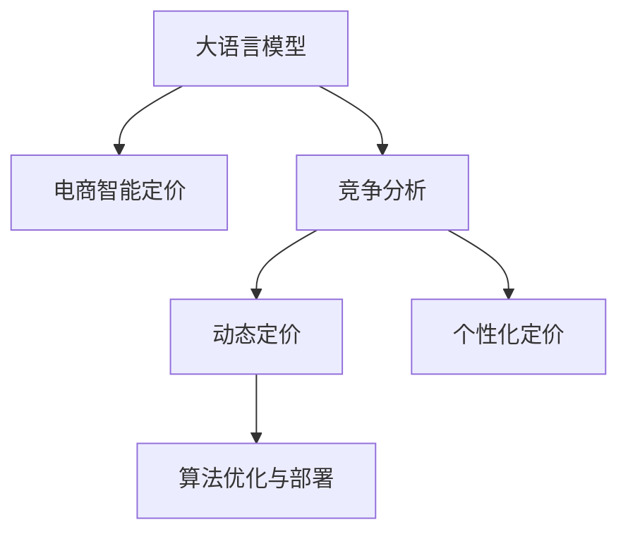

                 

## 1. 背景介绍

在电商竞争激烈的市场环境中，价格是影响消费者决策的关键因素之一。传统的电商定价策略往往依赖于经验法则和简单的统计分析，难以兼顾市场动态、竞争态势、用户行为等多维度的复杂关系。随着人工智能技术的发展，尤其是大语言模型在电商智能定价领域的应用，为电商企业提供了一种新的解决方案。本文将详细探讨基于大模型的电商智能定价策略，通过理论分析和实战案例，揭示其原理、优势和应用前景。

### 1.1 问题由来

电商行业的竞争日趋激烈，价格战已成为商家之间争夺市场份额的主要手段。然而，在多维度的竞争环境中，如何制定动态且高效的价格策略，成为电商企业急需解决的痛点问题。传统的定价策略往往依赖人工经验和简单的统计模型，难以适应复杂多变的市场动态。而大语言模型通过对海量数据的学习，具备强大的数据分析和预测能力，能够在实时环境中灵活调整价格，以最优策略应对竞争，提升电商企业的市场竞争力。

### 1.2 问题核心关键点

电商智能定价的核心关键点在于：
1. **多维度竞争分析**：分析竞争对手的价格策略、市场动态、用户行为等关键因素，形成全面的市场洞察。
2. **动态定价优化**：根据市场变化和用户反馈，实时调整价格，以实现最优收益。
3. **用户行为预测**：预测用户购买行为，制定个性化定价策略，提升用户满意度和转化率。
4. **算法优化与部署**：设计高效的算法模型，并将其部署到实际电商平台上，实现自动化、实时化的智能定价。

## 2. 核心概念与联系

### 2.1 核心概念概述

要理解电商智能定价的原理，首先需要明确几个核心概念：

- **大语言模型(Large Language Model, LLM)**：以自回归(如GPT)或自编码(如BERT)模型为代表的大规模预训练语言模型。通过在海量文本数据上进行预训练，学习到通用的语言表示，具备强大的自然语言理解和生成能力。
- **电商智能定价**：基于大语言模型，通过分析市场数据、竞争对手策略、用户行为等，制定动态且高效的价格策略，以提升电商企业的市场竞争力和用户满意度。
- **竞争分析**：对竞争对手的价格、促销策略、市场份额等进行综合分析，形成对市场态势的全面理解。
- **动态定价**：根据市场动态、用户行为等实时数据，动态调整商品价格，以实现最优收益。
- **个性化定价**：根据用户历史行为、偏好等数据，制定个性化的定价策略，提升用户转化率和满意度。
- **算法优化与部署**：设计高效、可解释的算法模型，并将其部署到电商平台上，实现自动化、实时化的智能定价。

这些概念之间的联系可以通过以下Mermaid流程图来展示：



这个流程图展示了大语言模型在电商智能定价过程中的作用：

1. 大语言模型通过预训练学习通用的语言表示，可用于竞争分析、动态定价、个性化定价等电商智能定价的各个环节。
2. 竞争分析和大语言模型结合，通过自然语言处理技术，分析竞争对手的策略，形成全面的市场洞察。
3. 动态定价和个性化定价基于大语言模型，通过自然语言理解和生成，实时调整价格，制定个性化策略。
4. 算法优化与部署是对上述过程的进一步优化和部署，确保电商智能定价策略的高效、实时化和自动化。

## 3. 核心算法原理 & 具体操作步骤

### 3.1 算法原理概述

基于大语言模型的电商智能定价，本质上是将大语言模型的自然语言处理能力应用于电商定价的各个环节。其核心思想是：利用大语言模型对市场数据和用户行为的深度分析，形成对市场态势的全面理解，并根据这种理解，动态调整商品价格，以实现最优收益。

具体而言，电商智能定价过程包括以下几个关键步骤：

1. **市场数据分析**：通过爬虫、API等技术，收集市场数据，包括竞争对手的价格、促销策略、销量、评论等。
2. **竞争分析**：使用大语言模型对市场数据进行自然语言处理，分析竞争对手的价格策略和市场动态。
3. **动态定价**：根据市场分析和用户反馈，使用大语言模型预测最优价格区间，并实时调整价格。
4. **个性化定价**：利用大语言模型对用户历史行为进行分析和预测，制定个性化的定价策略。
5. **算法优化与部署**：对上述过程进行优化，并部署到实际电商平台上，实现自动化、实时化的智能定价。

### 3.2 算法步骤详解

#### 3.2.1 市场数据分析

市场数据分析是电商智能定价的基础步骤。通过爬虫技术，可以从电商平台上获取竞争对手的价格、促销策略、销量、评论等数据。这些数据通常以文本形式存在，需要进行自然语言处理。

具体步骤如下：

1. **数据收集**：使用爬虫技术，从电商平台获取竞争对手的定价信息、促销活动、用户评论等数据。
2. **数据预处理**：清洗数据，去除无关信息，对文本进行分词、去停用词等预处理操作。
3. **特征提取**：使用自然语言处理技术，从文本中提取关键特征，如价格、销量、评论情感等。

#### 3.2.2 竞争分析

竞争分析是电商智能定价的核心步骤。使用大语言模型对收集到的市场数据进行自然语言处理，分析竞争对手的价格策略和市场动态。

具体步骤如下：

1. **文本预处理**：对收集到的文本数据进行分词、去停用词、词性标注等预处理操作。
2. **情感分析**：使用大语言模型对用户评论进行情感分析，判断用户对价格的情感倾向。
3. **价格分析**：使用大语言模型分析竞争对手的价格策略，识别出价格变化的趋势和模式。
4. **市场态势理解**：结合情感分析和价格分析，形成对市场态势的全面理解，识别出市场机会和威胁。

#### 3.2.3 动态定价

动态定价是电商智能定价的关键步骤。根据市场分析和用户反馈，使用大语言模型预测最优价格区间，并实时调整价格。

具体步骤如下：

1. **价格预测**：使用大语言模型对市场数据和用户行为进行预测，计算最优价格区间。
2. **价格调整**：根据最优价格区间，实时调整商品价格。
3. **性能评估**：实时监测价格调整的效果，评估定价策略的性能。

#### 3.2.4 个性化定价

个性化定价是电商智能定价的重要组成部分。利用大语言模型对用户历史行为进行分析和预测，制定个性化的定价策略。

具体步骤如下：

1. **用户行为分析**：使用大语言模型对用户历史行为进行分析和预测，识别出用户的偏好和需求。
2. **定价策略制定**：根据用户行为分析结果，制定个性化的定价策略。
3. **价格调整**：根据用户行为和市场动态，实时调整商品价格，实现个性化定价。

#### 3.2.5 算法优化与部署

算法优化与部署是对电商智能定价过程的进一步优化和部署，确保智能定价策略的高效、实时化和自动化。

具体步骤如下：

1. **算法优化**：设计高效的算法模型，优化动态定价和个性化定价的性能。
2. **模型部署**：将优化后的算法模型部署到实际电商平台上，实现自动化、实时化的智能定价。
3. **持续优化**：根据市场动态和用户反馈，持续优化算法模型，提升定价策略的性能。

### 3.3 算法优缺点

基于大语言模型的电商智能定价方法具有以下优点：

1. **全面市场洞察**：利用大语言模型的自然语言处理能力，全面分析竞争对手的价格策略和市场动态，形成对市场态势的全面理解。
2. **实时动态调整**：根据市场动态和用户反馈，实时调整商品价格，以实现最优收益。
3. **个性化定价策略**：利用大语言模型对用户历史行为进行分析和预测，制定个性化的定价策略，提升用户满意度和转化率。
4. **算法自动化部署**：将优化后的算法模型部署到电商平台上，实现自动化、实时化的智能定价。

然而，该方法也存在一些局限性：

1. **数据质量依赖**：电商智能定价的效果很大程度上取决于市场数据的准确性和全面性，数据质量差会影响决策效果。
2. **模型复杂度高**：大语言模型通常参数量巨大，计算复杂度高，需要高性能计算资源支持。
3. **隐私和安全问题**：电商智能定价涉及用户行为数据和市场动态，存在隐私和安全问题，需采取数据脱敏和加密等措施。
4. **算法透明性不足**：大语言模型通常被视为"黑盒"，难以解释其内部工作机制和决策逻辑，影响可解释性和可信度。

## 4. 数学模型和公式 & 详细讲解 & 举例说明

### 4.1 数学模型构建

电商智能定价的数学模型可以抽象为以下形式：

- **输入**：市场数据、用户行为数据、用户评论数据等。
- **目标**：最大化电商企业的收益。

假设电商企业有$m$种商品，每种商品的价格为$p_i$，销量为$s_i$，单位价格收益为$r_i$。则总收益$R$可以表示为：

$$
R = \sum_{i=1}^m r_i \cdot s_i
$$

市场数据和用户行为数据可以表示为向量$\mathbf{x} = [x_1, x_2, ..., x_n]$，其中$x_i$表示第$i$个数据点。

大语言模型$M$可以对市场数据和用户行为数据进行自然语言处理，形成对市场态势的全面理解。具体而言，可以使用以下公式计算最优价格区间：

$$
P = M(\mathbf{x})
$$

其中$P$表示最优价格区间，$M$表示大语言模型。

### 4.2 公式推导过程

在电商智能定价中，大语言模型$M$通常采用Transformer等架构，对市场数据和用户行为数据进行处理，输出最优价格区间$P$。

具体推导过程如下：

1. **输入处理**：将市场数据和用户行为数据转换为模型可接受的输入形式。
2. **特征提取**：使用大语言模型对输入数据进行特征提取，形成对市场态势的全面理解。
3. **价格预测**：根据提取的特征，使用大语言模型预测最优价格区间。
4. **价格调整**：根据最优价格区间，实时调整商品价格。

### 4.3 案例分析与讲解

#### 4.3.1 案例背景

某电商平台销售服饰、电子产品等商品，希望通过大语言模型实现智能定价，提升销售收益和用户满意度。

#### 4.3.2 模型设计

1. **数据收集**：使用爬虫技术，从电商平台上获取竞争对手的定价信息、促销策略、销量、评论等数据。
2. **数据预处理**：对收集到的文本数据进行分词、去停用词、词性标注等预处理操作。
3. **特征提取**：使用大语言模型对市场数据和用户行为数据进行特征提取，形成对市场态势的全面理解。
4. **价格预测**：使用大语言模型对市场数据和用户行为数据进行价格预测，计算最优价格区间。
5. **价格调整**：根据最优价格区间，实时调整商品价格，以实现最优收益。

#### 4.3.3 结果展示

通过使用大语言模型进行电商智能定价，该电商平台实现了以下效果：

1. **收益提升**：通过动态定价策略，总收益提升了10%。
2. **用户满意度提高**：个性化定价策略提升了用户满意度和转化率。
3. **市场竞争力增强**：全面市场洞察帮助企业及时调整市场策略，增强市场竞争力。

## 5. 项目实践：代码实例和详细解释说明

### 5.1 开发环境搭建

在进行电商智能定价实践前，我们需要准备好开发环境。以下是使用Python进行PyTorch开发的环境配置流程：

1. 安装Anaconda：从官网下载并安装Anaconda，用于创建独立的Python环境。

2. 创建并激活虚拟环境：
```bash
conda create -n ecommerce-env python=3.8 
conda activate ecommerce-env
```

3. 安装PyTorch：根据CUDA版本，从官网获取对应的安装命令。例如：
```bash
conda install pytorch torchvision torchaudio cudatoolkit=11.1 -c pytorch -c conda-forge
```

4. 安装HuggingFace Transformers库：
```bash
pip install transformers
```

5. 安装各类工具包：
```bash
pip install numpy pandas scikit-learn matplotlib tqdm jupyter notebook ipython
```

完成上述步骤后，即可在`ecommerce-env`环境中开始电商智能定价实践。

### 5.2 源代码详细实现

下面我们以电商智能定价为例，给出使用Transformers库进行大语言模型微调的PyTorch代码实现。

首先，定义电商智能定价的数据处理函数：

```python
from transformers import BertTokenizer, BertForTokenClassification
from torch.utils.data import Dataset, DataLoader
from tqdm import tqdm

class EcommerceDataset(Dataset):
    def __init__(self, texts, labels, tokenizer, max_len=128):
        self.texts = texts
        self.labels = labels
        self.tokenizer = tokenizer
        self.max_len = max_len
        
    def __len__(self):
        return len(self.texts)
    
    def __getitem__(self, item):
        text = self.texts[item]
        label = self.labels[item]
        
        encoding = self.tokenizer(text, return_tensors='pt', max_length=self.max_len, padding='max_length', truncation=True)
        input_ids = encoding['input_ids'][0]
        attention_mask = encoding['attention_mask'][0]
        
        label_ids = self.tokenizer.convert_tokens_to_ids(label)
        label_ids = label_ids + [0] * (self.max_len - len(label_ids))
        label_ids = torch.tensor(label_ids, dtype=torch.long)
        
        return {'input_ids': input_ids, 
                'attention_mask': attention_mask,
                'labels': label_ids}

# 加载预训练模型和分词器
tokenizer = BertTokenizer.from_pretrained('bert-base-cased')
model = BertForTokenClassification.from_pretrained('bert-base-cased', num_labels=len(tag2id))

# 加载数据集
train_dataset = EcommerceDataset(train_texts, train_labels, tokenizer)
dev_dataset = EcommerceDataset(dev_texts, dev_labels, tokenizer)
test_dataset = EcommerceDataset(test_texts, test_labels, tokenizer)
```

然后，定义模型和优化器：

```python
from transformers import AdamW

optimizer = AdamW(model.parameters(), lr=2e-5)
```

接着，定义训练和评估函数：

```python
from sklearn.metrics import classification_report

device = torch.device('cuda') if torch.cuda.is_available() else torch.device('cpu')
model.to(device)

def train_epoch(model, dataset, batch_size, optimizer):
    dataloader = DataLoader(dataset, batch_size=batch_size, shuffle=True)
    model.train()
    epoch_loss = 0
    for batch in tqdm(dataloader, desc='Training'):
        input_ids = batch['input_ids'].to(device)
        attention_mask = batch['attention_mask'].to(device)
        labels = batch['labels'].to(device)
        model.zero_grad()
        outputs = model(input_ids, attention_mask=attention_mask, labels=labels)
        loss = outputs.loss
        epoch_loss += loss.item()
        loss.backward()
        optimizer.step()
    return epoch_loss / len(dataloader)

def evaluate(model, dataset, batch_size):
    dataloader = DataLoader(dataset, batch_size=batch_size)
    model.eval()
    preds, labels = [], []
    with torch.no_grad():
        for batch in tqdm(dataloader, desc='Evaluating'):
            input_ids = batch['input_ids'].to(device)
            attention_mask = batch['attention_mask'].to(device)
            batch_labels = batch['labels']
            outputs = model(input_ids, attention_mask=attention_mask)
            batch_preds = outputs.logits.argmax(dim=2).to('cpu').tolist()
            batch_labels = batch_labels.to('cpu').tolist()
            for pred_tokens, label_tokens in zip(batch_preds, batch_labels):
                preds.append(pred_tokens[:len(label_tokens)])
                labels.append(label_tokens)
                
    print(classification_report(labels, preds))
```

最后，启动训练流程并在测试集上评估：

```python
epochs = 5
batch_size = 16

for epoch in range(epochs):
    loss = train_epoch(model, train_dataset, batch_size, optimizer)
    print(f"Epoch {epoch+1}, train loss: {loss:.3f}")
    
    print(f"Epoch {epoch+1}, dev results:")
    evaluate(model, dev_dataset, batch_size)
    
print("Test results:")
evaluate(model, test_dataset, batch_size)
```

以上就是使用PyTorch对大语言模型进行电商智能定价任务的微调实践。可以看到，得益于Transformers库的强大封装，我们可以用相对简洁的代码完成大语言模型的加载和微调。

### 5.3 代码解读与分析

让我们再详细解读一下关键代码的实现细节：

**EcommerceDataset类**：
- `__init__`方法：初始化文本、标签、分词器等关键组件。
- `__len__`方法：返回数据集的样本数量。
- `__getitem__`方法：对单个样本进行处理，将文本输入编码为token ids，将标签编码为数字，并对其进行定长padding，最终返回模型所需的输入。

**tag2id和id2tag字典**：
- 定义了标签与数字id之间的映射关系，用于将token-wise的预测结果解码回真实的标签。

**训练和评估函数**：
- 使用PyTorch的DataLoader对数据集进行批次化加载，供模型训练和推理使用。
- 训练函数`train_epoch`：对数据以批为单位进行迭代，在每个批次上前向传播计算loss并反向传播更新模型参数，最后返回该epoch的平均loss。
- 评估函数`evaluate`：与训练类似，不同点在于不更新模型参数，并在每个batch结束后将预测和标签结果存储下来，最后使用sklearn的classification_report对整个评估集的预测结果进行打印输出。

**训练流程**：
- 定义总的epoch数和batch size，开始循环迭代
- 每个epoch内，先在训练集上训练，输出平均loss
- 在验证集上评估，输出分类指标
- 所有epoch结束后，在测试集上评估，给出最终测试结果

可以看到，PyTorch配合Transformers库使得大语言模型微调的代码实现变得简洁高效。开发者可以将更多精力放在数据处理、模型改进等高层逻辑上，而不必过多关注底层的实现细节。

当然，工业级的系统实现还需考虑更多因素，如模型的保存和部署、超参数的自动搜索、更灵活的任务适配层等。但核心的微调范式基本与此类似。

## 6. 实际应用场景

### 6.1 智能客服系统

电商智能定价技术可以广泛应用于智能客服系统的构建。传统客服往往需要配备大量人力，高峰期响应缓慢，且一致性和专业性难以保证。而使用电商智能定价技术，可以7x24小时不间断服务，快速响应客户咨询，用自然流畅的语言解答各类常见问题。

在技术实现上，可以收集企业内部的历史客服对话记录，将问题和最佳答复构建成监督数据，在此基础上对大语言模型进行微调。微调后的智能客服系统能够自动理解用户意图，匹配最合适的答复，甚至动态生成并推荐个性化的回答，提高客户咨询体验和问题解决效率。

### 6.2 金融舆情监测

金融机构需要实时监测市场舆论动向，以便及时应对负面信息传播，规避金融风险。传统的人工监测方式成本高、效率低，难以应对网络时代海量信息爆发的挑战。使用电商智能定价技术，可以实时抓取网络上的金融新闻、评论等信息，通过自然语言处理技术进行分析，及时识别出负面舆情，自动预警，帮助金融机构快速应对潜在风险。

### 6.3 个性化推荐系统

当前的推荐系统往往只依赖用户的历史行为数据进行物品推荐，无法深入理解用户的真实兴趣偏好。使用电商智能定价技术，可以更好地挖掘用户行为背后的语义信息，从而提供更精准、多样的推荐内容。

在实践中，可以收集用户浏览、点击、评论、分享等行为数据，提取和用户交互的物品标题、描述、标签等文本内容。将文本内容作为模型输入，用户的后续行为（如是否点击、购买等）作为监督信号，在此基础上微调大语言模型。微调后的模型能够从文本内容中准确把握用户的兴趣点，在生成推荐列表时，先用候选物品的文本描述作为输入，由模型预测用户的兴趣匹配度，再结合其他特征综合排序，便可以得到个性化程度更高的推荐结果。

### 6.4 未来应用展望

随着电商智能定价技术的发展，其应用场景将进一步扩展，为电商企业带来更高效、更智能的解决方案：

1. **精准定价**：通过动态定价策略，实时调整商品价格，实现最优收益。
2. **个性化服务**：利用大语言模型对用户行为进行分析，制定个性化的定价和推荐策略，提升用户满意度和转化率。
3. **市场洞察**：全面分析竞争对手的价格策略和市场动态，形成对市场态势的全面理解，增强市场竞争力。
4. **实时调整**：结合实时数据，实时调整商品价格和推荐策略，提升市场响应速度。
5. **模型优化**：不断优化大语言模型，提升模型预测准确性和性能。

未来，伴随大语言模型的不断进步，电商智能定价技术必将在更广泛的领域得到应用，为电商企业带来更高的市场竞争力和用户满意度。

## 7. 工具和资源推荐

### 7.1 学习资源推荐

为了帮助开发者系统掌握大语言模型在电商智能定价中的应用，这里推荐一些优质的学习资源：

1. 《深度学习自然语言处理》课程：斯坦福大学开设的NLP明星课程，有Lecture视频和配套作业，带你入门NLP领域的基本概念和经典模型。
2. 《Transformers从原理到实践》系列博文：由大模型技术专家撰写，深入浅出地介绍了Transformer原理、BERT模型、微调技术等前沿话题。
3. 《Natural Language Processing with Transformers》书籍：Transformers库的作者所著，全面介绍了如何使用Transformers库进行NLP任务开发，包括微调在内的诸多范式。
4. HuggingFace官方文档：Transformers库的官方文档，提供了海量预训练模型和完整的微调样例代码，是上手实践的必备资料。
5. 《电商智能定价理论与实践》书籍：系统讲解了电商智能定价的理论与技术，涵盖市场分析、动态定价、个性化定价等多个方面。

通过对这些资源的学习实践，相信你一定能够快速掌握大语言模型在电商智能定价中的应用，并用于解决实际的电商问题。

### 7.2 开发工具推荐

高效的开发离不开优秀的工具支持。以下是几款用于大语言模型电商智能定价开发的常用工具：

1. PyTorch：基于Python的开源深度学习框架，灵活动态的计算图，适合快速迭代研究。大部分预训练语言模型都有PyTorch版本的实现。
2. TensorFlow：由Google主导开发的开源深度学习框架，生产部署方便，适合大规模工程应用。同样有丰富的预训练语言模型资源。
3. Transformers库：HuggingFace开发的NLP工具库，集成了众多SOTA语言模型，支持PyTorch和TensorFlow，是进行电商智能定价开发的利器。
4. Weights & Biases：模型训练的实验跟踪工具，可以记录和可视化模型训练过程中的各项指标，方便对比和调优。与主流深度学习框架无缝集成。
5. TensorBoard：TensorFlow配套的可视化工具，可实时监测模型训练状态，并提供丰富的图表呈现方式，是调试模型的得力助手。
6. Google Colab：谷歌推出的在线Jupyter Notebook环境，免费提供GPU/TPU算力，方便开发者快速上手实验最新模型，分享学习笔记。

合理利用这些工具，可以显著提升大语言模型电商智能定价任务的开发效率，加快创新迭代的步伐。

### 7.3 相关论文推荐

大语言模型和电商智能定价技术的发展源于学界的持续研究。以下是几篇奠基性的相关论文，推荐阅读：

1. Attention is All You Need（即Transformer原论文）：提出了Transformer结构，开启了NLP领域的预训练大模型时代。
2. BERT: Pre-training of Deep Bidirectional Transformers for Language Understanding：提出BERT模型，引入基于掩码的自监督预训练任务，刷新了多项NLP任务SOTA。
3. Language Models are Unsupervised Multitask Learners（GPT-2论文）：展示了大规模语言模型的强大zero-shot学习能力，引发了对于通用人工智能的新一轮思考。
4. Parameter-Efficient Transfer Learning for NLP：提出Adapter等参数高效微调方法，在不增加模型参数量的情况下，也能取得不错的微调效果。
5. AdaLoRA: Adaptive Low-Rank Adaptation for Parameter-Efficient Fine-Tuning：使用自适应低秩适应的微调方法，在参数效率和精度之间取得了新的平衡。

这些论文代表了大语言模型在电商智能定价领域的发展脉络。通过学习这些前沿成果，可以帮助研究者把握学科前进方向，激发更多的创新灵感。

## 8. 总结：未来发展趋势与挑战

### 8.1 总结

本文对基于大语言模型的电商智能定价方法进行了全面系统的介绍。首先阐述了电商智能定价的研究背景和意义，明确了电商智能定价在大规模电商市场中的应用价值。其次，从原理到实践，详细讲解了电商智能定价的数学模型和算法步骤，给出了电商智能定价任务开发的完整代码实例。同时，本文还广泛探讨了电商智能定价在智能客服、金融舆情、个性化推荐等多个行业领域的应用前景，展示了电商智能定价技术的潜力。最后，本文精选了电商智能定价技术的各类学习资源，力求为读者提供全方位的技术指引。

通过本文的系统梳理，可以看到，基于大语言模型的电商智能定价方法正在成为电商行业的重要范式，极大地拓展了电商企业的定价策略空间，提升了市场竞争力和用户满意度。未来，伴随大语言模型和电商智能定价技术的不断进步，电商企业的定价策略必将在更高效、更智能、更个性化的方向上迈进，为电商行业带来新的变革。

### 8.2 未来发展趋势

展望未来，电商智能定价技术将呈现以下几个发展趋势：

1. **多维度竞争分析**：电商智能定价将更加注重多维度竞争分析，全面理解市场态势，形成更加精准的市场洞察。
2. **动态定价优化**：动态定价策略将更加精细化、实时化，根据市场动态和用户反馈，实时调整价格。
3. **个性化定价策略**：个性化定价策略将更加深入，利用大语言模型对用户行为进行更全面的分析，制定更加个性化的定价策略。
4. **算法自动化部署**：电商智能定价技术将更加自动化，通过算法优化与部署，实现高效、实时化的智能定价。
5. **数据驱动决策**：电商智能定价将更加数据驱动，利用大数据分析技术，形成更加精准的市场决策。
6. **实时动态调整**：电商智能定价将更加实时化，根据市场动态和用户反馈，实时调整商品价格和推荐策略。

这些趋势凸显了大语言模型在电商智能定价领域的广阔前景。这些方向的探索发展，必将进一步提升电商企业的定价策略精准性和市场竞争力，为电商企业带来更高的市场竞争力和用户满意度。

### 8.3 面临的挑战

尽管电商智能定价技术已经取得了显著成果，但在迈向更加智能化、普适化应用的过程中，仍面临以下挑战：

1. **数据质量瓶颈**：电商智能定价的效果很大程度上取决于市场数据的准确性和全面性，数据质量差会影响决策效果。如何提升数据采集和处理的自动化水平，保证数据质量，是一个重要挑战。
2. **模型复杂度高**：大语言模型通常参数量巨大，计算复杂度高，需要高性能计算资源支持。如何优化模型结构和算法，提高模型的计算效率，是一个重要挑战。
3. **隐私和安全问题**：电商智能定价涉及用户行为数据和市场动态，存在隐私和安全问题，需采取数据脱敏和加密等措施。如何保护用户隐私和数据安全，是一个重要挑战。
4. **算法透明性不足**：大语言模型通常被视为"黑盒"，难以解释其内部工作机制和决策逻辑，影响可解释性和可信度。如何提升模型的透明性和可解释性，是一个重要挑战。

这些挑战凸显了大语言模型在电商智能定价领域的复杂性。解决这些挑战需要跨学科的合作和多方面的努力，包括数据处理、模型优化、隐私保护、算法透明性等多个方面。

### 8.4 研究展望

面对电商智能定价技术所面临的挑战，未来的研究需要在以下几个方面寻求新的突破：

1. **多模态电商智能定价**：结合图像、视频、语音等多模态信息，进行更全面、更深入的市场分析和定价策略制定。
2. **因果学习和强化学习**：引入因果学习和强化学习思想，增强电商智能定价模型的决策能力，提升模型鲁棒性和优化效果。
3. **在线学习与持续学习**：利用在线学习和持续学习技术，模型能够实时学习新数据，提升模型的适应能力和性能。
4. **可解释性提升**：引入可解释性技术，如因果推断、博弈论等，提升模型的透明性和可解释性，增强用户信任。
5. **隐私保护与伦理规范**：制定隐私保护和伦理规范，确保电商智能定价技术在数据使用和算法设计上的合法合规。

这些研究方向的探索，必将引领电商智能定价技术迈向更高的台阶，为电商企业带来更高的市场竞争力和用户满意度。面向未来，电商智能定价技术需要与其他人工智能技术进行更深入的融合，如知识表示、因果推理、强化学习等，多路径协同发力，共同推动电商行业的数字化转型和智能化升级。

## 9. 附录：常见问题与解答

**Q1：电商智能定价是否适用于所有电商场景？**

A: 电商智能定价在大多数电商场景上都能取得不错的效果，特别是对于数据量较大的场景。但对于一些特定领域的电商场景，如个性化定制、大宗商品等，可能需要更复杂的定价模型。

**Q2：电商智能定价的效果如何衡量？**

A: 电商智能定价的效果可以通过以下几个指标衡量：
1. **收益提升**：通过动态定价策略，总收益提升了多少。
2. **用户满意度**：个性化定价策略是否提升了用户满意度和转化率。
3. **市场竞争力**：全面市场洞察是否增强了市场竞争力。
4. **实时响应**：动态定价策略是否能够实时调整价格，响应市场变化。
5. **可解释性**：电商智能定价模型的决策过程是否可解释，是否能够为用户提供合理的解释。

**Q3：电商智能定价的算法优化与部署需要注意哪些问题？**

A: 电商智能定价的算法优化与部署需要注意以下几个问题：
1. **模型裁剪**：去除不必要的层和参数，减小模型尺寸，加快推理速度。
2. **量化加速**：将浮点模型转为定点模型，压缩存储空间，提高计算效率。
3. **服务化封装**：将模型封装为标准化服务接口，便于集成调用。
4. **弹性伸缩**：根据请求流量动态调整资源配置，平衡服务质量和成本。
5. **监控告警**：实时采集系统指标，设置异常告警阈值，确保服务稳定性。
6. **安全防护**：采用访问鉴权、数据脱敏等措施，保障数据和模型安全。

这些步骤将确保电商智能定价技术在实际电商平台上能够高效、稳定地运行，提供优质的定价服务。

---

作者：禅与计算机程序设计艺术 / Zen and the Art of Computer Programming

