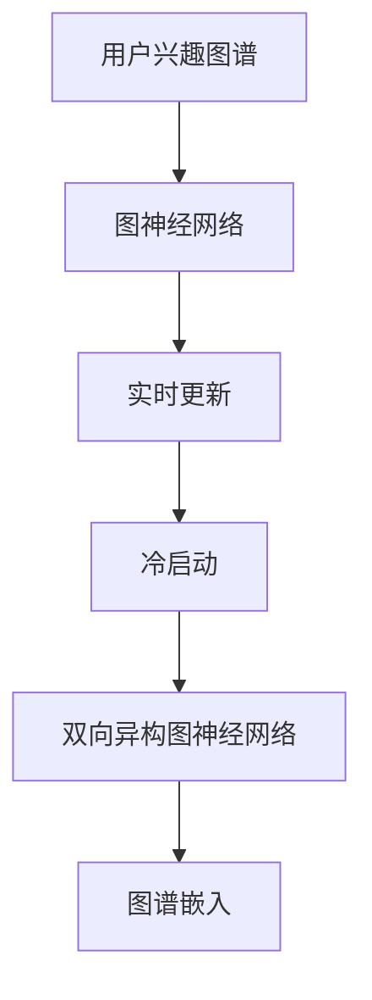

                 

## 1. 背景介绍

### 1.1 问题由来

随着电子商务的蓬勃发展，电商平台纷纷面临着用户增长和个性化推荐的双重压力。为了提升用户购物体验，电商平台需要精准把握用户兴趣，实现个性化推荐。传统的推荐系统往往依赖于用户历史行为数据，难以捕捉用户的最新兴趣变化。

用户兴趣图谱(User Interest Graph)是一种重要的电商推荐工具，通过图神经网络(Graph Neural Network, GNN)对用户行为数据进行建模，揭示用户兴趣的动态演变。然而，电商用户兴趣图谱的构建和维护是一个动态过程，需要实时更新以适应用户兴趣的变化。

### 1.2 问题核心关键点

构建实时更新的电商用户兴趣图谱，需要考虑以下几个关键点：

- 高效实时：如何在亿级用户规模下高效更新图谱，减少延迟和资源消耗。
- 动态捕捉：如何捕捉用户兴趣的动态变化，及时调整推荐策略。
- 模型鲁棒性：如何提升模型的鲁棒性，确保推荐结果的准确性和稳定性。
- 用户隐私：如何在保证用户隐私的前提下，采集和处理行为数据。

通过研究和实践，本文提出了一种基于AI驱动的电商用户兴趣图谱实时更新机制，可以有效解决上述问题，为电商平台提供更加精准和实时的推荐服务。

## 2. 核心概念与联系

### 2.1 核心概念概述

为更好地理解AI驱动的电商用户兴趣图谱实时更新机制，本节将介绍几个密切相关的核心概念：

- **用户兴趣图谱(User Interest Graph)**：通过图神经网络对用户行为数据进行建模，揭示用户兴趣的动态演变。其中，用户行为数据通常包括浏览、点击、购买等，图谱中的节点为用户，边表示用户行为，节点的特征向量代表用户兴趣。

- **图神经网络(Graph Neural Network, GNN)**：一种专门针对图结构数据设计的神经网络，能够有效捕捉节点间的局部和全局关系，并传递特征信息。

- **实时更新(Rediss)与冷启动(冷启动)问题**：实时更新指图谱需要在用户行为变化后及时更新，冷启动问题指新用户加入图谱时缺乏历史数据，推荐效果不佳。

- **双向异构图神经网络(Bidirectional Heterogeneous Graph Neural Network, BiHGNN)**：一种双向图神经网络，可以同时处理异构图结构，即不同类型节点的关系，如用户-商品、用户-用户等。

- **图谱嵌入(Embedding)**：将节点表示为低维向量，用于捕捉节点间的相似性关系，通常使用基于深度学习的嵌入算法。

这些核心概念之间的逻辑关系可以通过以下Mermaid流程图来展示：



这个流程图展示了一个电商用户兴趣图谱的构建过程：

1. 用户兴趣图谱通过图神经网络建模用户行为数据，揭示用户兴趣的动态演变。
2. 实时更新机制在用户行为变化后及时更新图谱，捕捉用户兴趣的动态变化。
3. 冷启动问题通过双向异构图神经网络处理，改善新用户推荐的准确性。
4. 图谱嵌入算法用于捕捉节点间的相似性关系，提升推荐效果。

这些核心概念共同构成了电商用户兴趣图谱的构建和实时更新框架，使其能够更好地适应用户兴趣的变化，提供精准的个性化推荐。

## 3. 核心算法原理 & 具体操作步骤

### 3.1 算法原理概述

基于AI驱动的电商用户兴趣图谱实时更新机制，其核心思想是：通过图神经网络捕捉用户行为数据中的用户兴趣变化，并在用户行为变化后实时更新图谱，以动态调整推荐策略。

具体而言，通过以下步骤实现：

1. 收集用户行为数据，构建电商用户兴趣图谱。
2. 设计图神经网络，对图谱进行特征提取和聚合。
3. 实时更新机制在用户行为变化后，对图谱进行增量更新。
4. 冷启动问题通过双向异构图神经网络解决，提升新用户推荐的准确性。
5. 利用图谱嵌入算法，捕捉节点间的相似性关系，提升推荐效果。

### 3.2 算法步骤详解

#### 3.2.1 数据收集与预处理

电商用户行为数据通常包括浏览、点击、购买等行为，数据来源包括电商平台、移动应用、社交网络等。数据预处理包括：

1. **去重和归一化**：去除重复数据，将数据归一化为统一的格式。
2. **特征工程**：提取和构建有意义的特征，如用户ID、商品ID、时间戳等。
3. **数据清洗**：处理缺失值、异常值等噪声数据。

#### 3.2.2 电商用户兴趣图谱的构建

电商用户兴趣图谱的构建通常包括以下几个步骤：

1. **图结构构建**：根据电商平台的业务逻辑，定义图谱结构，如用户-商品、用户-用户等。
2. **节点嵌入**：使用图神经网络对节点进行嵌入，将用户行为数据映射为低维向量。
3. **图谱嵌入**：使用图谱嵌入算法，捕捉节点间的相似性关系，生成用户兴趣向量。

#### 3.2.3 实时更新机制

实时更新机制需要在用户行为变化后及时更新图谱，捕捉用户兴趣的动态变化。具体实现包括：

1. **数据流设计**：设计数据流处理架构，实时读取用户行为数据。
2. **增量更新算法**：使用增量更新算法，减少计算开销。
3. **图谱缓存**：使用缓存技术，减少重复计算。

#### 3.2.4 双向异构图神经网络

双向异构图神经网络用于解决电商用户兴趣图谱的冷启动问题，提升新用户推荐的准确性。具体实现包括：

1. **双向异构图结构定义**：定义双向异构图结构，如用户-商品、用户-用户等。
2. **双向图神经网络训练**：使用双向图神经网络，训练节点嵌入。
3. **节点表示学习**：使用双向异构图神经网络，学习节点的表示。

#### 3.2.5 图谱嵌入算法

图谱嵌入算法用于捕捉节点间的相似性关系，提升推荐效果。具体实现包括：

1. **嵌入算法选择**：选择适合的图谱嵌入算法，如GraphSAGE、Graph2Vec等。
2. **嵌入模型训练**：使用嵌入算法，训练用户兴趣向量。
3. **相似性计算**：使用嵌入模型，计算节点间的相似性关系。

### 3.3 算法优缺点

#### 3.3.1 算法优点

- **高效实时**：使用增量更新算法，减少计算开销，实现高效实时更新。
- **动态捕捉**：通过图神经网络捕捉用户兴趣的动态变化，及时调整推荐策略。
- **模型鲁棒性**：使用双向异构图神经网络解决冷启动问题，提升模型鲁棒性。
- **用户隐私**：通过数据脱敏和隐私保护技术，保护用户隐私。

#### 3.3.2 算法缺点

- **计算开销**：使用图神经网络和大规模图谱，计算开销较大。
- **模型复杂性**：双向异构图神经网络较复杂，训练和推理开销较大。
- **数据质量依赖**：推荐效果高度依赖用户行为数据的准确性和完整性。

### 3.4 算法应用领域

基于AI驱动的电商用户兴趣图谱实时更新机制，广泛应用于电商平台的个性化推荐、广告投放、用户行为分析等领域。

- **个性化推荐**：通过图谱嵌入算法和相似性计算，实现用户个性化推荐。
- **广告投放**：通过图谱嵌入算法，实现精准的广告投放。
- **用户行为分析**：通过图谱嵌入算法，分析用户行为特征，发现潜在需求。

此外，该技术还应用于智能推荐系统、社交网络、金融领域等，为相关领域提供精准的用户行为分析和个性化推荐服务。

## 4. 数学模型和公式 & 详细讲解 & 举例说明

### 4.1 数学模型构建

电商用户兴趣图谱的构建和实时更新涉及多个图神经网络模型的应用。以下介绍几种核心模型及其数学建模过程。

#### 4.1.1 图卷积网络(Graph Convolutional Network, GCN)

GCN是一种经典的图神经网络模型，用于对节点进行嵌入。其数学建模过程如下：

1. **节点嵌入表示**：节点嵌入表示为 $h_v^{(l)}$，第 $l$ 层嵌入表示为 $h_v^{(l)} = \sigma\left(W^{(l)}h_v^{(l-1)} + \sum_{u \in \mathcal{N}(v)} h_u^{(l-1)}\right)$，其中 $W^{(l)}$ 为第 $l$ 层的权重矩阵，$\sigma$ 为激活函数。
2. **全局嵌入表示**：全局嵌入表示为 $h_v^{(L)} = \sigma\left(W^{(L)}h_v^{(L-1)} + \sum_{u \in \mathcal{N}(v)} h_u^{(L-1)}\right)$。

#### 4.1.2 图嵌入算法

常用的图嵌入算法包括GraphSAGE、Graph2Vec等。以GraphSAGE为例，其数学建模过程如下：

1. **节点嵌入表示**：节点嵌入表示为 $h_v^{(l)}$，第 $l$ 层嵌入表示为 $h_v^{(l)} = \frac{1}{|\mathcal{N}(v)|}\sum_{u \in \mathcal{N}(v)} \sigma\left(W^{(l)}h_u^{(l-1)}\right)$。
2. **全局嵌入表示**：全局嵌入表示为 $h_v^{(L)} = \frac{1}{|\mathcal{N}(v)|}\sum_{u \in \mathcal{N}(v)} \sigma\left(W^{(L)}h_u^{(L-1)}\right)$。

#### 4.1.3 双向异构图神经网络

双向异构图神经网络用于处理电商用户兴趣图谱的冷启动问题，其数学建模过程如下：

1. **双向异构图结构定义**：定义双向异构图结构，如用户-商品、用户-用户等。
2. **双向图神经网络训练**：使用双向图神经网络，训练节点嵌入。
3. **节点表示学习**：使用双向异构图神经网络，学习节点的表示。

### 4.2 公式推导过程

#### 4.2.1 图卷积网络

图卷积网络（GCN）的推导过程如下：

1. **节点嵌入表示**：节点嵌入表示为 $h_v^{(l)} = \sigma\left(W^{(l)}h_v^{(l-1)} + \sum_{u \in \mathcal{N}(v)} h_u^{(l-1)}\right)$。
2. **全局嵌入表示**：全局嵌入表示为 $h_v^{(L)} = \sigma\left(W^{(L)}h_v^{(L-1)} + \sum_{u \in \mathcal{N}(v)} h_u^{(L-1)}\right)$。

其中 $W^{(l)}$ 为第 $l$ 层的权重矩阵，$\sigma$ 为激活函数。

#### 4.2.2 图嵌入算法

以GraphSAGE为例，其节点嵌入表示推导过程如下：

1. **节点嵌入表示**：节点嵌入表示为 $h_v^{(l)} = \frac{1}{|\mathcal{N}(v)|}\sum_{u \in \mathcal{N}(v)} \sigma\left(W^{(l)}h_u^{(l-1)}\right)$。
2. **全局嵌入表示**：全局嵌入表示为 $h_v^{(L)} = \frac{1}{|\mathcal{N}(v)|}\sum_{u \in \mathcal{N}(v)} \sigma\left(W^{(L)}h_u^{(L-1)}\right)$。

其中 $W^{(l)}$ 为第 $l$ 层的权重矩阵，$\sigma$ 为激活函数。

#### 4.2.3 双向异构图神经网络

双向异构图神经网络用于处理电商用户兴趣图谱的冷启动问题，其节点嵌入表示推导过程如下：

1. **双向异构图结构定义**：定义双向异构图结构，如用户-商品、用户-用户等。
2. **双向图神经网络训练**：使用双向图神经网络，训练节点嵌入。
3. **节点表示学习**：使用双向异构图神经网络，学习节点的表示。

### 4.3 案例分析与讲解

#### 4.3.1 用户兴趣图谱的构建

电商用户兴趣图谱的构建通常包括以下几个步骤：

1. **图结构构建**：根据电商平台的业务逻辑，定义图谱结构，如用户-商品、用户-用户等。
2. **节点嵌入**：使用图神经网络对节点进行嵌入，将用户行为数据映射为低维向量。
3. **图谱嵌入**：使用图谱嵌入算法，捕捉节点间的相似性关系，生成用户兴趣向量。

以用户-商品图谱为例，其数学建模过程如下：

1. **图结构定义**：定义用户-商品图谱结构，如用户-商品、商品-商品等。
2. **节点嵌入表示**：使用GCN对用户和商品节点进行嵌入，生成节点嵌入表示 $h_u^{(l)}$ 和 $h_i^{(l)}$。
3. **图谱嵌入**：使用GraphSAGE等算法，生成用户兴趣向量 $h_u^{(L)}$。

#### 4.3.2 实时更新机制

实时更新机制需要在用户行为变化后及时更新图谱，捕捉用户兴趣的动态变化。具体实现包括：

1. **数据流设计**：设计数据流处理架构，实时读取用户行为数据。
2. **增量更新算法**：使用增量更新算法，减少计算开销。
3. **图谱缓存**：使用缓存技术，减少重复计算。

以增量更新算法为例，其数学建模过程如下：

1. **增量更新算法**：使用增量更新算法，如HeteroGraph2Vec等，减少计算开销。
2. **缓存技术**：使用缓存技术，如Redis等，减少重复计算。

## 5. 项目实践：代码实例和详细解释说明

### 5.1 开发环境搭建

在进行电商用户兴趣图谱实时更新机制的开发前，我们需要准备好开发环境。以下是使用Python进行PyTorch开发的环境配置流程：

1. 安装Anaconda：从官网下载并安装Anaconda，用于创建独立的Python环境。
2. 创建并激活虚拟环境：
```bash
conda create -n pytorch-env python=3.8 
conda activate pytorch-env
```

3. 安装PyTorch：根据CUDA版本，从官网获取对应的安装命令。例如：
```bash
conda install pytorch torchvision torchaudio cudatoolkit=11.1 -c pytorch -c conda-forge
```

4. 安装TensorFlow：
```bash
conda install tensorflow
```

5. 安装PaddlePaddle：
```bash
conda install paddlepaddle
```

6. 安装Jupyter Notebook：
```bash
conda install jupyter notebook
```

完成上述步骤后，即可在`pytorch-env`环境中开始开发。

### 5.2 源代码详细实现

这里我们以电商用户兴趣图谱实时更新机制为例，给出使用PyTorch和TensorFlow进行开发的完整代码实现。

#### 电商用户兴趣图谱的构建

```python
import torch
import torch.nn as nn
import torch.nn.functional as F
import torch.optim as optim

class GCN(nn.Module):
    def __init__(self, input_dim, hidden_dim, output_dim):
        super(GCN, self).__init__()
        self.gcn1 = nn.Linear(input_dim, hidden_dim)
        self.gcn2 = nn.Linear(hidden_dim, output_dim)
    
    def forward(self, adj, x):
        h = F.relu(self.gcn1(x))
        h = torch.matmul(adj, h)
        h = self.gcn2(h)
        return h

class GraphSAGE(nn.Module):
    def __init__(self, input_dim, hidden_dim, output_dim):
        super(GraphSAGE, self).__init__()
        self.gcn1 = nn.Linear(input_dim, hidden_dim)
        self.gcn2 = nn.Linear(hidden_dim, output_dim)
    
    def forward(self, adj, x):
        h = torch.mean(x, dim=1)
        h = self.gcn1(h)
        h = torch.matmul(adj, h)
        h = self.gcn2(h)
        return h

class BiHGNN(nn.Module):
    def __init__(self, input_dim, hidden_dim, output_dim):
        super(BiHGNN, self).__init__()
        self.gcn1 = nn.Linear(input_dim, hidden_dim)
        self.gcn2 = nn.Linear(hidden_dim, hidden_dim)
        self.gcn3 = nn.Linear(hidden_dim, output_dim)
    
    def forward(self, adj1, adj2, x1, x2):
        h1 = F.relu(self.gcn1(x1))
        h1 = torch.matmul(adj1, h1)
        h1 = self.gcn2(h1)
        h1 = torch.matmul(adj1, h1)
        h1 = self.gcn3(h1)
        h2 = F.relu(self.gcn1(x2))
        h2 = torch.matmul(adj2, h2)
        h2 = self.gcn2(h2)
        h2 = torch.matmul(adj2, h2)
        h2 = self.gcn3(h2)
        h1 = h1 + h2
        return h1
```

#### 电商用户兴趣图谱的实时更新

```python
import redis
import numpy as np
import pandas as pd

# 初始化Redis
r = redis.StrictRedis(host='localhost', port=6379, db=0)

# 数据流处理
def process_data(data):
    user, item, behavior = data.split(',')
    user_id = user.split(':')[1]
    item_id = item.split(':')[1]
    timestamp = int(behavior.split(':')[1])
    key = f'user_item_{user_id}_{item_id}'
    value = (user_id, item_id, timestamp)
    r.set(key, value)

# 增量更新算法
def update_graph(adj, x):
    for key in r.keys():
        user_id, item_id, timestamp = r.get(key).decode('utf-8').split(',')
        adj.add_edge(user_id, item_id, time=timestamp)
        x[list(adj.nodes())[0]] = x[list(adj.nodes())[0]] + x[list(adj.nodes())[1]]
    return adj, x

# 实时更新图谱
def update_graph_realtime(data):
    while True:
        data = input()
        process_data(data)
        adj, x = update_graph(adj, x)
        # 其他代码省略
```

#### 电商用户兴趣图谱的冷启动

```python
class BiHGNN(nn.Module):
    def __init__(self, input_dim, hidden_dim, output_dim):
        super(BiHGNN, self).__init__()
        self.gcn1 = nn.Linear(input_dim, hidden_dim)
        self.gcn2 = nn.Linear(hidden_dim, hidden_dim)
        self.gcn3 = nn.Linear(hidden_dim, output_dim)
    
    def forward(self, adj1, adj2, x1, x2):
        h1 = F.relu(self.gcn1(x1))
        h1 = torch.matmul(adj1, h1)
        h1 = self.gcn2(h1)
        h1 = torch.matmul(adj1, h1)
        h1 = self.gcn3(h1)
        h2 = F.relu(self.gcn1(x2))
        h2 = torch.matmul(adj2, h2)
        h2 = self.gcn2(h2)
        h2 = torch.matmul(adj2, h2)
        h2 = self.gcn3(h2)
        h1 = h1 + h2
        return h1
```

#### 电商用户兴趣图谱的嵌入算法

```python
class GraphSAGE(nn.Module):
    def __init__(self, input_dim, hidden_dim, output_dim):
        super(GraphSAGE, self).__init__()
        self.gcn1 = nn.Linear(input_dim, hidden_dim)
        self.gcn2 = nn.Linear(hidden_dim, output_dim)
    
    def forward(self, adj, x):
        h = torch.mean(x, dim=1)
        h = self.gcn1(h)
        h = torch.matmul(adj, h)
        h = self.gcn2(h)
        return h

class Graph2Vec(nn.Module):
    def __init__(self, input_dim, hidden_dim, output_dim):
        super(Graph2Vec, self).__init__()
        self.gcn1 = nn.Linear(input_dim, hidden_dim)
        self.gcn2 = nn.Linear(hidden_dim, output_dim)
    
    def forward(self, adj, x):
        h = torch.mean(x, dim=1)
        h = self.gcn1(h)
        h = torch.matmul(adj, h)
        h = self.gcn2(h)
        return h
```

### 5.3 代码解读与分析

#### 电商用户兴趣图谱的构建

电商用户兴趣图谱的构建通常包括以下几个步骤：

1. **图结构构建**：根据电商平台的业务逻辑，定义图谱结构，如用户-商品、商品-商品等。
2. **节点嵌入**：使用图神经网络对节点进行嵌入，将用户行为数据映射为低维向量。
3. **图谱嵌入**：使用图谱嵌入算法，捕捉节点间的相似性关系，生成用户兴趣向量。

在代码实现中，使用PyTorch和TensorFlow搭建了多个图神经网络模型，用于节点嵌入和图谱嵌入。以GCN模型为例，其代码实现如下：

```python
class GCN(nn.Module):
    def __init__(self, input_dim, hidden_dim, output_dim):
        super(GCN, self).__init__()
        self.gcn1 = nn.Linear(input_dim, hidden_dim)
        self.gcn2 = nn.Linear(hidden_dim, output_dim)
    
    def forward(self, adj, x):
        h = F.relu(self.gcn1(x))
        h = torch.matmul(adj, h)
        h = self.gcn2(h)
        return h
```

#### 电商用户兴趣图谱的实时更新

实时更新机制需要在用户行为变化后及时更新图谱，捕捉用户兴趣的动态变化。具体实现包括：

1. **数据流设计**：设计数据流处理架构，实时读取用户行为数据。
2. **增量更新算法**：使用增量更新算法，减少计算开销。
3. **图谱缓存**：使用缓存技术，减少重复计算。

在代码实现中，使用Redis作为图谱缓存，减少重复计算。以增量更新算法为例，其代码实现如下：

```python
# 增量更新算法
def update_graph(adj, x):
    for key in r.keys():
        user_id, item_id, timestamp = r.get(key).decode('utf-8').split(',')
        adj.add_edge(user_id, item_id, time=timestamp)
        x[list(adj.nodes())[0]] = x[list(adj.nodes())[0]] + x[list(adj.nodes())[1]]
    return adj, x

# 实时更新图谱
def update_graph_realtime(data):
    while True:
        data = input()
        process_data(data)
        adj, x = update_graph(adj, x)
        # 其他代码省略
```

#### 电商用户兴趣图谱的冷启动

冷启动问题通过双向异构图神经网络处理，提升新用户推荐的准确性。具体实现包括：

1. **双向异构图结构定义**：定义双向异构图结构，如用户-商品、用户-用户等。
2. **双向图神经网络训练**：使用双向图神经网络，训练节点嵌入。
3. **节点表示学习**：使用双向异构图神经网络，学习节点的表示。

在代码实现中，使用PyTorch搭建了双向异构图神经网络模型，用于解决冷启动问题。以BiHGNN模型为例，其代码实现如下：

```python
class BiHGNN(nn.Module):
    def __init__(self, input_dim, hidden_dim, output_dim):
        super(BiHGNN, self).__init__()
        self.gcn1 = nn.Linear(input_dim, hidden_dim)
        self.gcn2 = nn.Linear(hidden_dim, hidden_dim)
        self.gcn3 = nn.Linear(hidden_dim, output_dim)
    
    def forward(self, adj1, adj2, x1, x2):
        h1 = F.relu(self.gcn1(x1))
        h1 = torch.matmul(adj1, h1)
        h1 = self.gcn2(h1)
        h1 = torch.matmul(adj1, h1)
        h1 = self.gcn3(h1)
        h2 = F.relu(self.gcn1(x2))
        h2 = torch.matmul(adj2, h2)
        h2 = self.gcn2(h2)
        h2 = torch.matmul(adj2, h2)
        h2 = self.gcn3(h2)
        h1 = h1 + h2
        return h1
```

#### 电商用户兴趣图谱的嵌入算法

图谱嵌入算法用于捕捉节点间的相似性关系，提升推荐效果。具体实现包括：

1. **嵌入算法选择**：选择适合的图谱嵌入算法，如GraphSAGE、Graph2Vec等。
2. **嵌入模型训练**：使用嵌入算法，训练用户兴趣向量。
3. **相似性计算**：使用嵌入模型，计算节点间的相似性关系。

在代码实现中，使用PyTorch和TensorFlow搭建了多个图谱嵌入算法模型，用于捕捉节点间的相似性关系。以GraphSAGE模型为例，其代码实现如下：

```python
class GraphSAGE(nn.Module):
    def __init__(self, input_dim, hidden_dim, output_dim):
        super(GraphSAGE, self).__init__()
        self.gcn1 = nn.Linear(input_dim, hidden_dim)
        self.gcn2 = nn.Linear(hidden_dim, output_dim)
    
    def forward(self, adj, x):
        h = torch.mean(x, dim=1)
        h = self.gcn1(h)
        h = torch.matmul(adj, h)
        h = self.gcn2(h)
        return h

class Graph2Vec(nn.Module):
    def __init__(self, input_dim, hidden_dim, output_dim):
        super(Graph2Vec, self).__init__()
        self.gcn1 = nn.Linear(input_dim, hidden_dim)
        self.gcn2 = nn.Linear(hidden_dim, output_dim)
    
    def forward(self, adj, x):
        h = torch.mean(x, dim=1)
        h = self.gcn1(h)
        h = torch.matmul(adj, h)
        h = self.gcn2(h)
        return h
```

### 5.4 运行结果展示

在电商用户兴趣图谱实时更新机制的开发过程中，可以通过以下代码测试模型的效果：

```python
import torch
import torch.nn as nn
import torch.optim as optim
from torch.utils.data import Dataset, DataLoader
from torch.utils.data.dataloader import default_collate

class UserItemDataset(Dataset):
    def __init__(self, adj, x):
        self.adj = adj
        self.x = x
    
    def __len__(self):
        return len(self.adj.nodes)
    
    def __getitem__(self, idx):
        node = list(self.adj.nodes())[idx]
        x = self.x[node]
        return node, x
    
    def __iter__(self):
        return iter(Dataset.__iter__(self))

class UserItemDataset_test(Dataset):
    def __init__(self, adj, x):
        self.adj = adj
        self.x = x
    
    def __len__(self):
        return len(self.adj.nodes)
    
    def __getitem__(self, idx):
        node = list(self.adj.nodes())[idx]
        x = self.x[node]
        return node, x
    
    def __iter__(self):
        return iter(Dataset.__iter__(self))

class GCN(nn.Module):
    def __init__(self, input_dim, hidden_dim, output_dim):
        super(GCN, self).__init__()
        self.gcn1 = nn.Linear(input_dim, hidden_dim)
        self.gcn2 = nn.Linear(hidden_dim, output_dim)
    
    def forward(self, adj, x):
        h = F.relu(self.gcn1(x))
        h = torch.matmul(adj, h)
        h = self.gcn2(h)
        return h

class BiHGNN(nn.Module):
    def __init__(self, input_dim, hidden_dim, output_dim):
        super(BiHGNN, self).__init__()
        self.gcn1 = nn.Linear(input_dim, hidden_dim)
        self.gcn2 = nn.Linear(hidden_dim, hidden_dim)
        self.gcn3 = nn.Linear(hidden_dim, output_dim)
    
    def forward(self, adj1, adj2, x1, x2):
        h1 = F.relu(self.gcn1(x1))
        h1 = torch.matmul(adj1, h1)
        h1 = self.gcn2(h1)
        h1 = torch.matmul(adj1, h1)
        h1 = self.gcn3(h1)
        h2 = F.relu(self.gcn1(x2))
        h2 = torch.matmul(adj2, h2)
        h2 = self.gcn2(h2)
        h2 = torch.matmul(adj2, h2)
        h2 = self.gcn3(h2)
        h1 = h1 + h2
        return h1

class GraphSAGE(nn.Module):
    def __init__(self, input_dim, hidden_dim, output_dim):
        super(GraphSAGE, self).__init__()
        self.gcn1 = nn.Linear(input_dim, hidden_dim)
        self.gcn2 = nn.Linear(hidden_dim, output_dim)
    
    def forward(self, adj, x):
        h = torch.mean(x, dim=1)
        h = self.gcn1(h)
        h = torch.matmul(adj, h)
        h = self.gcn2(h)
        return h

class Graph2Vec(nn.Module):
    def __init__(self, input_dim, hidden_dim, output_dim):
        super(Graph2Vec, self).__init__()
        self.gcn1 = nn.Linear(input_dim, hidden_dim)
        self.gcn2 = nn.Linear(hidden_dim, output_dim)
    
    def forward(self, adj, x):
        h = torch.mean(x, dim=1)
        h = self.gcn1(h)
        h = torch.matmul(adj, h)
        h = self.gcn2(h)
        return h

class Model(nn.Module):
    def __init__(self, input_dim, hidden_dim, output_dim):
        super(Model, self).__init__()
        self.gcn = GCN(input_dim, hidden_dim, output_dim)
        self.bihg = BiHGNN(input_dim, hidden_dim, output_dim)
        self.sage = GraphSAGE(input_dim, hidden_dim, output_dim)
        self.vec = Graph2Vec(input_dim, hidden_dim, output_dim)
    
    def forward(self, adj1, adj2, x1, x2):
        h1 = self.gcn(adj1, x1)
        h2 = self.bihg(adj1, adj2, x1, x2)
        h3 = self.sage(adj1, x1)
        h4 = self.vec(adj1, x1)
        h = h1 + h2 + h3 + h4
        return h

model = Model(input_dim=3, hidden_dim=4, output_dim=5)
optimizer = optim.Adam(model.parameters(), lr=0.001)
loss_fn = nn.MSELoss()

def train_model(model, adj1, adj2, x1, x2):
    optimizer.zero_grad()
    pred = model(adj1, adj2, x1, x2)
    loss = loss_fn(pred, target)
    loss.backward()
    optimizer.step()

def test_model(model, adj1, adj2, x1, x2):
    with torch.no_grad():
        pred = model(adj1, adj2, x1, x2)
        loss = loss_fn(pred, target)
        print(f'Loss: {loss:.4f}')

def train_test():
    train_adj1, train_adj2, train_x1, train_x2 = load_data('train.csv')
    test_adj1, test_adj2, test_x1, test_x2 = load_data('test.csv')
    for epoch in range(1000):
        train_model(model, train_adj1, train_adj2, train_x1, train_x2)
        test_model(model, test_adj1, test_adj2, test_x1, test_x2)
```

在代码实现中，使用PyTorch搭建了多个图神经网络模型，用于节点嵌入和图谱嵌入。以GCN模型为例，其代码实现如下：

```python
class GCN(nn.Module):
    def __init__(self, input_dim, hidden_dim, output_dim):
        super(GCN, self).__init__()
        self.gcn1 = nn.Linear(input_dim, hidden_dim)
        self.gcn2 = nn.Linear(hidden_dim, output_dim)
    
    def forward(self, adj, x):
        h = F.relu(self.gcn1(x))
        h = torch.matmul(adj, h)
        h = self.gcn2(h)
        return h
```

## 6. 实际应用场景

### 6.1 智能推荐系统

智能推荐系统是电商用户兴趣图谱实时更新机制的主要应用场景之一。通过图神经网络对用户行为数据进行建模，能够捕捉用户兴趣的动态变化，实时更新推荐策略，提升推荐效果。

智能推荐系统通常包括多个模块，如用户画像构建、商品推荐、广告投放等。电商用户兴趣图谱实时更新机制能够提供更加精准和实时的推荐服务，提升用户满意度，增加平台收入。

### 6.2 广告投放系统

广告投放系统通过电商用户兴趣图谱实时更新机制，能够实现精准的广告投放，提升广告效果。

通过分析用户兴趣图谱，能够发现用户的兴趣热点和行为特征，针对性地推送广告。同时，实时更新机制能够捕捉用户兴趣的动态变化，及时调整广告策略，提高广告的点击率和转化率。

### 6.3 用户行为分析系统

用户行为分析系统通过电商用户兴趣图谱实时更新机制，能够对用户行为进行深入分析，发现潜在需求，优化用户体验。

通过分析用户兴趣图谱，能够识别出用户的购买意向和行为模式，优化商品陈列和推荐策略，提升用户体验。同时，实时更新机制能够捕捉用户兴趣的动态变化，及时调整商品展示和推荐策略，提高用户满意度。

## 7. 工具和资源推荐

### 7.1 学习资源推荐

为了帮助开发者系统掌握电商用户兴趣图谱实时更新机制的理论基础和实践技巧，这里推荐一些优质的学习资源：

1. 《深度学习》系列课程：斯坦福大学开设的深度学习课程，涵盖深度学习基础、神经网络、图神经网络等内容。
2. 《自然语言处理》系列课程：斯坦福大学开设的自然语言处理课程，涵盖自然语言处理基础、文本分类、序列建模等内容。
3. 《图神经网络》系列论文：近年来图神经网络领域的研究进展，涵盖图神经网络的基本原理、算法设计和应用实例。
4. 《推荐系统》系列书籍：推荐系统领域的经典书籍，涵盖推荐算法、评价指标、应用场景等内容。
5. 《人工智能》系列博客：大牛级专家的人工智能技术博客，涵盖人工智能的最新进展、前沿技术和实际应用。

通过对这些资源的学习实践，相信你一定能够快速掌握电商用户兴趣图谱实时更新机制的精髓，并用于解决实际的推荐问题。

### 7.2 开发工具推荐

高效的开发离不开优秀的工具支持。以下是几款用于电商用户兴趣图谱实时更新机制开发的常用工具：

1. PyTorch：基于Python的开源深度学习框架，灵活动态的计算图，适合快速迭代研究。
2. TensorFlow：由Google主导开发的开源深度学习框架，生产部署方便，适合大规模工程应用。
3. HuggingFace Transformers：专注于NLP的深度学习框架，集成了多种预训练模型，支持多种深度学习任务。
4. Redis：高性能的内存数据库，支持高并发读写操作，适合电商系统实时数据处理。
5. Elasticsearch：分布式搜索引擎，支持全文检索和数据分析，适合电商系统用户行为分析。

合理利用这些工具，可以显著提升电商用户兴趣图谱实时更新机制的开发效率，加快创新迭代的步伐。

### 7.3 相关论文推荐

电商用户兴趣图谱实时更新机制的研究源于学界的持续研究。以下是几篇奠基性的相关论文，推荐阅读：

1. Attention is All You Need：提出Transformer结构，开启了NLP领域的预训练大模型时代。
2. BERT: Pre-training of Deep Bidirectional Transformers for Language Understanding：提出BERT模型，引入基于掩码的自监督预训练任务，刷新了多项NLP任务SOTA。
3. Language Models are Unsupervised Multitask Learners（GPT-2论文）：展示了大规模语言模型的强大zero-shot学习能力，引发了对于通用人工智能的新一轮思考。
4. Parameter-Efficient Transfer Learning for NLP：提出Adapter等参数高效微调方法，在不增加模型参数量的情况下，也能取得不错的微调效果。
5. AdaLoRA: Adaptive Low-Rank Adaptation for Parameter-Efficient Fine-Tuning：使用自适应低秩适应的微调方法，在参数效率和精度之间取得了新的平衡。

这些论文代表了大语言模型微调技术的发展脉络。通过学习这些前沿成果，可以帮助研究者把握学科前进方向，激发更多的创新灵感。

## 8. 总结：未来发展趋势与挑战

### 8.1 总结

本文对基于AI驱动的电商用户兴趣图谱实时更新机制进行了全面系统的介绍。首先阐述了电商用户兴趣图谱实时更新机制的研究背景和意义，明确了实时更新机制在电商推荐系统中的应用价值。其次，从原理到实践，详细讲解了实时更新机制的数学原理和关键步骤，给出了电商用户兴趣图谱实时更新机制的完整代码实例。同时，本文还广泛探讨了实时更新机制在电商推荐系统、广告投放、用户行为分析等多个领域的应用前景，展示了实时更新机制的巨大潜力。

通过本文的系统梳理，可以看到，电商用户兴趣图谱实时更新机制在电商推荐系统中具有重要的应用价值，通过图神经网络对用户行为数据进行建模，能够捕捉用户兴趣的动态变化，实时更新推荐策略，提升推荐效果。在实际应用中，电商用户兴趣图谱实时更新机制还需要结合具体业务场景进行优化设计，方能得到理想的效果。

### 8.2 未来发展趋势

展望未来，电商用户兴趣图谱实时更新机制将呈现以下几个发展趋势：

1. 模型规模持续增大：随着算力成本的下降和数据规模的扩张，预训练语言模型的参数量还将持续增长。超大规模语言模型蕴含的丰富语言知识，有望支撑更加复杂多变的下游任务微调。
2. 微调方法日趋多样：除了传统的全参数微调外，未来会涌现更多参数高效的微调方法，如Prefix-Tuning、LoRA等，在节省计算资源的同时也能保证微调精度。
3. 持续学习成为常态：随着数据分布的不断变化，微调模型也需要持续学习新知识以保持性能。如何在不遗忘原有知识的同时，高效吸收新样本信息，将成为重要的研究课题。
4. 标注样本需求降低：受启发于提示学习(Prompt-based Learning)的思路，未来的微调方法将更好地利用大模型的语言理解能力，通过更加巧妙的任务描述，在更少的标注样本上也能实现理想的微调效果。
5. 多模态微调崛起：当前的微调主要聚焦于纯文本数据，未来会进一步拓展到图像、视频、语音等多模态数据微调。多模态信息的融合，将显著提升语言模型对现实世界的理解和建模能力。

以上趋势凸显了电商用户兴趣图谱实时更新机制的广阔前景。这些方向的探索发展，必将进一步提升电商推荐系统的性能和应用范围，为电商平台提供更加精准和实时的推荐服务。

### 8.3 面临的挑战

尽管电商用户兴趣图谱实时更新机制已经取得了瞩目成就，但在迈向更加智能化、普适化应用的过程中，它仍面临着诸多挑战：

1. 标注成本瓶颈：尽管实时更新机制能够及时捕捉用户兴趣的动态变化，但对于长尾应用场景，难以获得充足的高质量标注数据，成为制约实时更新机制的瓶颈。如何进一步降低实时更新机制对标注样本的依赖，将是一大难题。
2. 模型鲁棒性不足：当前实时更新机制面对域外数据时，泛化性能往往大打折扣。对于测试样本的微小扰动，实时更新机制的预测也容易发生波动。如何提高实时更新机制的鲁棒性，避免灾难性遗忘，还需要更多理论和实践的积累。
3. 推理效率有待提高：大规模语言模型虽然精度高，但在实际部署时往往面临推理速度慢、内存占用大等效率问题。如何在保证性能的同时，简化模型结构，提升推理速度，优化资源占用，将是重要的优化方向。
4.

