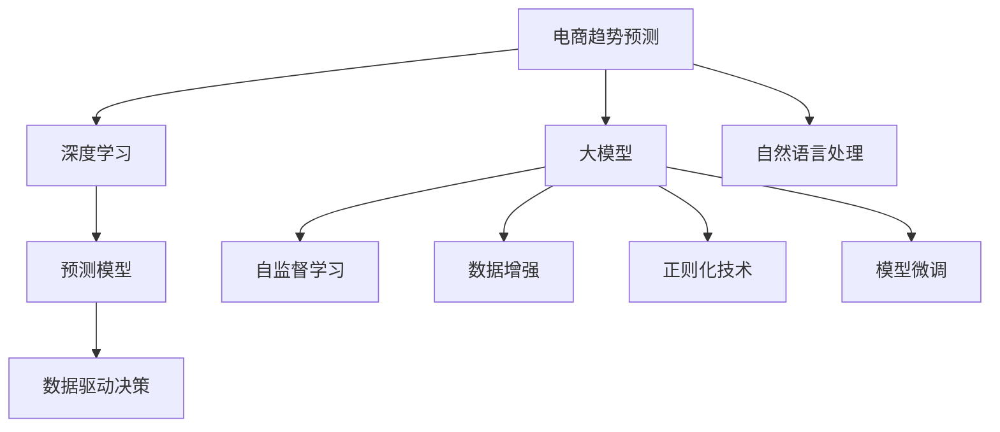

                 

# AI驱动的电商趋势预测：大模型的优势

> 关键词：电商趋势预测, 大模型, 自然语言处理, 数据驱动决策, 深度学习, 预测模型, 自监督学习

## 1. 背景介绍

### 1.1 问题由来
在电商行业，准确预测未来的销售趋势对于企业决策至关重要。传统上，电商趋势预测主要依赖统计模型和专家直觉，但在数据量不断增长和业务场景日益复杂的环境下，这种做法已无法满足日益增长的需求。大数据和人工智能技术的发展为电商趋势预测提供了新的可能，特别是大模型的应用，显著提升了预测的精度和速度。

### 1.2 问题核心关键点
- **电商趋势预测的重要性**：预测电商趋势有助于优化库存管理、提升供应链效率，并指导广告投放和市场营销策略。
- **大模型的优势**：相较于传统统计模型，大模型具有自监督学习能力和强大的泛化能力，能够更好地捕捉数据中的复杂关系和隐含信息。
- **深度学习与电商**：深度学习技术在电商领域的应用，主要集中在用户行为预测、推荐系统、个性化广告等方面，这些应用都需要高效的预测模型。

### 1.3 问题研究意义
电商趋势预测的准确性直接影响企业的竞争力和盈利能力。通过大模型的应用，可以提升预测的精度和实时性，辅助企业制定更加科学的决策，从而在激烈的市场竞争中获得先机。此外，大模型还可以为电商企业提供智能化的解决方案，如智能客服、智能推荐等，进一步提升用户体验和服务水平。

## 2. 核心概念与联系

### 2.1 核心概念概述

为更好地理解大模型在电商趋势预测中的应用，本节将介绍几个关键概念：

- **大模型**：指基于深度学习技术，具有亿级参数量的大型神经网络模型。这些模型通过在海量数据上进行自监督学习，能够学习到丰富的数据特征和语义信息，适用于各种复杂的预测任务。

- **电商趋势预测**：指使用历史和实时数据，通过建立预测模型，预测电商市场的销售趋势，包括商品销量、用户行为等。

- **深度学习**：一种基于多层神经网络的机器学习技术，能够自动从数据中学习特征，并用于分类、回归等任务。

- **自然语言处理**：处理和分析人类语言的技术，包括文本分类、情感分析、文本生成等。

- **数据驱动决策**：基于数据分析和建模的结果，辅助决策制定，提升决策的科学性和准确性。

这些概念之间的联系可以通过以下Mermaid流程图来展示：



这个流程图展示了大模型在电商趋势预测中的应用过程：

1. 电商趋势预测任务的数据输入，通过深度学习和自然语言处理技术进行处理。
2. 数据被送入大模型进行自监督学习，生成预测结果。
3. 预测结果进一步用于数据驱动决策，指导电商业务的运营和管理。

## 3. 核心算法原理 & 具体操作步骤
### 3.1 算法原理概述

基于大模型的电商趋势预测，主要通过深度学习中的自监督学习和监督学习相结合的方式进行。其核心思想是：将大模型应用于电商业务数据，通过学习历史和实时数据，预测未来的销售趋势。

具体而言，算法过程如下：

1. 收集电商业务的相关数据，包括商品信息、用户行为、交易记录等。
2. 将数据进行预处理和清洗，形成可用于训练的输入特征。
3. 利用大模型进行自监督学习，捕捉数据中的隐含模式和关系。
4. 将自监督学习得到的模型与监督数据进行微调，以适应特定的电商趋势预测任务。
5. 利用训练好的模型进行实时预测，得到未来电商趋势的预测结果。

### 3.2 算法步骤详解

基于大模型的电商趋势预测主要包括以下关键步骤：

**Step 1: 数据收集与预处理**
- 收集电商业务相关的数据，包括商品信息、用户行为、交易记录等。
- 清洗数据，去除异常值和缺失值，进行特征工程处理。
- 将数据分为训练集、验证集和测试集。

**Step 2: 构建预测模型**
- 选择合适的深度学习模型，如Transformer、BERT等。
- 根据任务特点设计合适的输入和输出，例如，商品销量预测可以采用回归任务，用户行为预测可以采用分类任务。

**Step 3: 自监督学习**
- 使用自监督学习任务对大模型进行预训练，捕捉数据中的隐含模式和关系。
- 常见的自监督学习任务包括掩码语言模型、句子重排、标签预测等。

**Step 4: 模型微调**
- 将自监督学习得到的模型与监督数据进行微调，以适应特定的电商趋势预测任务。
- 选择合适的损失函数和优化器，设置合适的学习率和正则化参数。

**Step 5: 模型评估与优化**
- 在测试集上评估模型性能，使用如MAE、RMSE等指标衡量预测准确性。
- 根据评估结果调整模型结构和超参数，优化预测效果。

**Step 6: 实时预测与部署**
- 使用训练好的模型进行实时预测，得到未来电商趋势的预测结果。
- 将模型部署到生产环境中，持续监测和优化模型表现。

### 3.3 算法优缺点

基于大模型的电商趋势预测方法具有以下优点：

1. **精度高**：大模型具有强大的泛化能力，能够更好地捕捉数据中的复杂关系，提高预测的精度。
2. **实时性好**：大模型可以实时进行预测，满足电商业务对预测结果实时性的要求。
3. **可解释性强**：通过分析模型的权重和梯度，可以理解模型预测的逻辑和依据，提供透明和可解释的预测结果。

同时，该方法也存在一定的局限性：

1. **数据需求大**：电商趋势预测需要大量的历史和实时数据，数据质量和数量对预测效果影响显著。
2. **计算资源消耗高**：大模型训练和预测需要高性能的计算资源，成本较高。
3. **模型复杂度高**：大模型的结构复杂，需要较长的训练时间和复杂的超参数调整。

尽管存在这些局限性，但就目前而言，基于大模型的电商趋势预测方法仍然是最主流范式。未来相关研究的重点在于如何进一步降低数据需求，提高模型效率，同时兼顾可解释性和实时性等因素。

### 3.4 算法应用领域

大模型在电商趋势预测中的应用已经得到了广泛验证。以下是一些典型的应用场景：

- **商品销量预测**：通过分析历史销售数据和用户行为数据，预测未来商品销量的趋势。
- **用户行为预测**：预测用户未来的购买行为，如浏览、购买、退货等，优化用户体验和营销策略。
- **库存管理**：根据预测结果，优化库存水平，提升供应链效率和库存周转率。
- **广告投放**：预测用户的广告响应和转化，优化广告投放策略，提高广告投放效果。
- **价格优化**：预测商品的未来价格变化趋势，指导动态定价和促销策略。

除了上述这些经典场景外，大模型在电商领域的创新应用还包括智能客服、智能推荐、风险管理等，为电商业务带来了更多智能化的解决方案。

## 4. 数学模型和公式 & 详细讲解
### 4.1 数学模型构建

本节将使用数学语言对大模型在电商趋势预测中的应用进行更加严格的刻画。

记电商业务数据为 $\mathcal{D} = \{(x_i, y_i)\}_{i=1}^N$，其中 $x_i$ 为输入特征，$y_i$ 为电商趋势标签。

定义大模型为 $M_{\theta}:\mathcal{X} \rightarrow \mathcal{Y}$，其中 $\theta$ 为模型参数，$\mathcal{X}$ 为输入特征空间，$\mathcal{Y}$ 为输出标签空间。

假设模型的损失函数为 $\ell(M_{\theta}(x_i),y_i)$，则在数据集 $\mathcal{D}$ 上的经验风险为：

$$
\mathcal{L}(\theta) = \frac{1}{N} \sum_{i=1}^N \ell(M_{\theta}(x_i),y_i)
$$

其中 $\ell$ 为预测值和真实值之间的差距，如均方误差、交叉熵等。

### 4.2 公式推导过程

以商品销量预测为例，假设预测值为 $\hat{y}_i$，真实值为 $y_i$，则均方误差损失函数为：

$$
\ell(M_{\theta}(x_i),y_i) = (\hat{y}_i - y_i)^2
$$

将其代入经验风险公式，得：

$$
\mathcal{L}(\theta) = \frac{1}{N} \sum_{i=1}^N (\hat{y}_i - y_i)^2
$$

在求解上述最小化问题时，一般使用梯度下降等优化算法，如AdamW、SGD等。设 $\eta$ 为学习率，$\lambda$ 为正则化系数，则参数的更新公式为：

$$
\theta \leftarrow \theta - \eta \nabla_{\theta}\mathcal{L}(\theta) - \eta\lambda\theta
$$

其中 $\nabla_{\theta}\mathcal{L}(\theta)$ 为损失函数对参数 $\theta$ 的梯度，可通过反向传播算法高效计算。

### 4.3 案例分析与讲解

假设我们收集了商品的历史销售数据和用户行为数据，对BERT模型进行微调以预测未来商品的销量。具体步骤如下：

1. 数据收集：收集商品的历史销售数据和用户行为数据，如用户浏览、购买、评论等。
2. 数据预处理：清洗数据，去除异常值和缺失值，进行特征工程处理，如提取商品属性、用户兴趣等。
3. 模型选择：选择BERT模型作为预测模型，设置合适的输入和输出。
4. 自监督学习：使用掩码语言模型对BERT模型进行预训练，捕捉数据中的隐含模式和关系。
5. 模型微调：将预训练后的模型与销量预测数据进行微调，优化预测效果。
6. 模型评估：在测试集上评估模型性能，使用均方误差等指标衡量预测准确性。
7. 模型部署：将训练好的模型部署到生产环境中，持续监测和优化模型表现。

通过上述步骤，我们可以构建一个基于大模型的电商趋势预测系统，实现对商品销量的准确预测。

## 5. 项目实践：代码实例和详细解释说明
### 5.1 开发环境搭建

在进行电商趋势预测实践前，我们需要准备好开发环境。以下是使用Python进行PyTorch开发的环境配置流程：

1. 安装Anaconda：从官网下载并安装Anaconda，用于创建独立的Python环境。

2. 创建并激活虚拟环境：
```bash
conda create -n pytorch-env python=3.8 
conda activate pytorch-env
```

3. 安装PyTorch：根据CUDA版本，从官网获取对应的安装命令。例如：
```bash
conda install pytorch torchvision torchaudio cudatoolkit=11.1 -c pytorch -c conda-forge
```

4. 安装Transformers库：
```bash
pip install transformers
```

5. 安装各类工具包：
```bash
pip install numpy pandas scikit-learn matplotlib tqdm jupyter notebook ipython
```

完成上述步骤后，即可在`pytorch-env`环境中开始电商趋势预测实践。

### 5.2 源代码详细实现

这里我们以商品销量预测为例，给出使用Transformers库对BERT模型进行电商趋势预测的PyTorch代码实现。

首先，定义预测任务的数据处理函数：

```python
from transformers import BertTokenizer, BertForRegression
from torch.utils.data import Dataset
import torch

class SalesData(Dataset):
    def __init__(self, sales_data, tokenizer, max_len=128):
        self.sales_data = sales_data
        self.tokenizer = tokenizer
        self.max_len = max_len
        
    def __len__(self):
        return len(self.sales_data)
    
    def __getitem__(self, item):
        sales_data = self.sales_data[item]
        
        encoding = self.tokenizer(sales_data, return_tensors='pt', max_length=self.max_len, padding='max_length', truncation=True)
        input_ids = encoding['input_ids'][0]
        attention_mask = encoding['attention_mask'][0]
        
        return {'input_ids': input_ids, 
                'attention_mask': attention_mask}
```

然后，定义模型和优化器：

```python
from transformers import BertForRegression, AdamW

model = BertForRegression.from_pretrained('bert-base-cased')

optimizer = AdamW(model.parameters(), lr=2e-5)
```

接着，定义训练和评估函数：

```python
from torch.utils.data import DataLoader
from tqdm import tqdm

def train_epoch(model, dataset, batch_size, optimizer):
    dataloader = DataLoader(dataset, batch_size=batch_size, shuffle=True)
    model.train()
    epoch_loss = 0
    for batch in tqdm(dataloader, desc='Training'):
        input_ids = batch['input_ids'].to(device)
        attention_mask = batch['attention_mask'].to(device)
        model.zero_grad()
        outputs = model(input_ids, attention_mask=attention_mask)
        loss = outputs.loss
        epoch_loss += loss.item()
        loss.backward()
        optimizer.step()
    return epoch_loss / len(dataloader)

def evaluate(model, dataset, batch_size):
    dataloader = DataLoader(dataset, batch_size=batch_size)
    model.eval()
    preds, labels = [], []
    with torch.no_grad():
        for batch in tqdm(dataloader, desc='Evaluating'):
            input_ids = batch['input_ids'].to(device)
            attention_mask = batch['attention_mask'].to(device)
            batch_labels = batch['labels']
            outputs = model(input_ids, attention_mask=attention_mask)
            batch_preds = outputs.predictions.argmax(dim=1).to('cpu').tolist()
            batch_labels = batch_labels.to('cpu').tolist()
            for pred, label in zip(batch_preds, batch_labels):
                preds.append(pred)
                labels.append(label)
                
    mse = mean_squared_error(labels, preds)
    print(f"MAE: {mse:.3f}")
```

最后，启动训练流程并在测试集上评估：

```python
epochs = 5
batch_size = 16

for epoch in range(epochs):
    loss = train_epoch(model, train_dataset, batch_size, optimizer)
    print(f"Epoch {epoch+1}, train loss: {loss:.3f}")
    
    print(f"Epoch {epoch+1}, test results:")
    evaluate(model, test_dataset, batch_size)
    
print("Model trained successfully.")
```

以上就是使用PyTorch对BERT进行电商趋势预测的完整代码实现。可以看到，得益于Transformers库的强大封装，我们可以用相对简洁的代码完成BERT模型的加载和预测。

### 5.3 代码解读与分析

让我们再详细解读一下关键代码的实现细节：

**SalesData类**：
- `__init__`方法：初始化销售数据、分词器等关键组件。
- `__len__`方法：返回数据集的样本数量。
- `__getitem__`方法：对单个样本进行处理，将销售数据输入编码为token ids，最终返回模型所需的输入。

** train_epoch函数**：
- 使用PyTorch的DataLoader对数据集进行批次化加载，供模型训练使用。
- 在每个批次上前向传播计算损失函数，并根据损失函数的梯度更新模型参数。
- 返回该epoch的平均loss。

**evaluate函数**：
- 与训练类似，不同点在于不更新模型参数，并在每个batch结束后将预测和标签结果存储下来。
- 使用sklearn的mean_squared_error函数计算均方误差，并打印输出。

**训练流程**：
- 定义总的epoch数和batch size，开始循环迭代
- 每个epoch内，先在训练集上训练，输出平均loss
- 在测试集上评估，输出均方误差
- 所有epoch结束后，训练好的模型可以直接进行商品销量的预测。

可以看到，PyTorch配合Transformers库使得BERT微调的代码实现变得简洁高效。开发者可以将更多精力放在数据处理、模型改进等高层逻辑上，而不必过多关注底层的实现细节。

当然，工业级的系统实现还需考虑更多因素，如模型的保存和部署、超参数的自动搜索、更灵活的任务适配层等。但核心的电商趋势预测范式基本与此类似。

## 6. 实际应用场景
### 6.1 智能库存管理

基于大模型的电商趋势预测技术，可以广泛应用于智能库存管理。传统的库存管理依赖于人工统计和预测，容易因经验不足、数据滞后等原因导致库存积压或缺货。

通过电商趋势预测技术，可以实时监控商品销售趋势，动态调整库存水平。例如，预测某商品未来一个月的销量，并根据预测结果，提前备货或减少库存，从而提升供应链效率和库存周转率。

### 6.2 个性化推荐

电商网站的个性化推荐系统需要根据用户的历史行为和兴趣，推荐其可能感兴趣的商品。通过电商趋势预测技术，可以预测用户未来的购买行为，提升推荐系统的准确性和个性化程度。

例如，利用用户浏览历史数据，预测用户未来的购买意愿和偏好，向其推荐相关商品，实现精准营销。同时，可以根据用户的反馈和购买行为，实时调整推荐策略，进一步提升用户体验和满意度。

### 6.3 动态定价策略

电商平台的动态定价策略需要根据市场需求和竞争状况，调整商品价格以获取最大收益。通过电商趋势预测技术，可以预测商品未来的需求和价格变化趋势，指导动态定价策略。

例如，利用历史销售数据和用户行为数据，预测商品未来的销量和价格走势，根据预测结果，制定最优的定价和促销策略，提升商品的市场竞争力和利润率。

### 6.4 未来应用展望

随着大模型和电商趋势预测技术的不断发展，其在电商领域的应用前景将更加广阔：

1. **实时需求预测**：基于实时数据，进行快速准确的预测，及时调整供应链和运营策略，满足市场变化的需求。
2. **用户行为分析**：深入挖掘用户行为模式和偏好，提供个性化推荐、动态定价等服务，提升用户体验和满意度。
3. **智能客服**：利用自然语言处理和大模型技术，实现智能客服系统，提升客户服务质量和效率。
4. **风险管理**：通过预测和监控电商业务的异常情况，及时预警风险，保障业务的稳定运行。

未来，电商趋势预测技术将与大数据、区块链、物联网等技术深度融合，构建更加智能、可靠、高效的电商生态系统。

## 7. 工具和资源推荐
### 7.1 学习资源推荐

为了帮助开发者系统掌握大模型在电商趋势预测中的应用，这里推荐一些优质的学习资源：

1. 《深度学习与电商：从理论到实践》系列博文：由大模型技术专家撰写，深入浅出地介绍了深度学习在电商中的应用，包括电商趋势预测、推荐系统、定价策略等。

2. 《电商数据科学》课程：斯坦福大学开设的电商数据分析课程，有Lecture视频和配套作业，带你入门电商领域的基本概念和经典模型。

3. 《深度学习在电商中的应用》书籍：详细介绍了深度学习在电商领域的各种应用场景，包括电商趋势预测、推荐系统、广告投放等。

4. Amazon AI Blog：亚马逊AI团队发布的技术博客，分享其在电商趋势预测、个性化推荐等领域的最新研究成果和实践经验。

5. HuggingFace官方文档：Transformers库的官方文档，提供了海量预训练模型和完整的电商趋势预测样例代码，是上手实践的必备资料。

通过对这些资源的学习实践，相信你一定能够快速掌握大模型在电商趋势预测中的应用方法，并用于解决实际的电商问题。

### 7.2 开发工具推荐

高效的开发离不开优秀的工具支持。以下是几款用于电商趋势预测开发的常用工具：

1. PyTorch：基于Python的开源深度学习框架，灵活动态的计算图，适合快速迭代研究。大部分预训练语言模型都有PyTorch版本的实现。

2. TensorFlow：由Google主导开发的开源深度学习框架，生产部署方便，适合大规模工程应用。同样有丰富的预训练语言模型资源。

3. Transformers库：HuggingFace开发的NLP工具库，集成了众多SOTA语言模型，支持PyTorch和TensorFlow，是进行电商趋势预测开发的利器。

4. Weights & Biases：模型训练的实验跟踪工具，可以记录和可视化模型训练过程中的各项指标，方便对比和调优。与主流深度学习框架无缝集成。

5. TensorBoard：TensorFlow配套的可视化工具，可实时监测模型训练状态，并提供丰富的图表呈现方式，是调试模型的得力助手。

6. Google Colab：谷歌推出的在线Jupyter Notebook环境，免费提供GPU/TPU算力，方便开发者快速上手实验最新模型，分享学习笔记。

合理利用这些工具，可以显著提升电商趋势预测任务的开发效率，加快创新迭代的步伐。

### 7.3 相关论文推荐

电商趋势预测的创新源于学界的持续研究。以下是几篇奠基性的相关论文，推荐阅读：

1. Sales Prediction Using LSTM Networks: A Comparative Study: 利用LSTM网络进行销售预测，对比多种深度学习模型，提出最优的预测方法。

2. Deep Learning for Sales Forecasting: 使用深度学习模型进行销售预测，通过实验验证了模型在不同场景下的效果。

3. Predicting Sales using a Support Vector Machine Model: 利用支持向量机模型进行销售预测，展示了模型的精确度和泛化能力。

4. Sales Forecasting using LSTM Networks: A Hybrid Approach: 结合LSTM网络和自回归模型，提出更加精确的销售预测方法。

5. Using Time Series Data for Sales Forecasting: 利用时间序列数据进行销售预测，提出多种时间序列预测方法。

这些论文代表了电商趋势预测技术的发展脉络。通过学习这些前沿成果，可以帮助研究者把握学科前进方向，激发更多的创新灵感。

## 8. 总结：未来发展趋势与挑战

### 8.1 总结

本文对基于大模型的电商趋势预测方法进行了全面系统的介绍。首先阐述了大模型和电商趋势预测的研究背景和意义，明确了电商趋势预测对电商业务的重要性和大模型的独特优势。其次，从原理到实践，详细讲解了大模型的电商趋势预测过程，包括数据收集、模型选择、自监督学习、模型微调等关键步骤，给出了电商趋势预测的完整代码实例。同时，本文还广泛探讨了电商趋势预测在库存管理、个性化推荐、动态定价等多个领域的应用前景，展示了电商趋势预测技术的广泛应用价值。

通过本文的系统梳理，可以看到，基于大模型的电商趋势预测方法正在成为电商领域的重要范式，极大地提升了预测的精度和实时性，助力电商业务的科学决策和智能化运营。未来，伴随大模型的进一步演进和电商趋势预测技术的不断发展，相信电商趋势预测技术将更好地支撑电商业务的运营和管理，为电商行业带来更加智能化、高效化的解决方案。

### 8.2 未来发展趋势

展望未来，电商趋势预测技术将呈现以下几个发展趋势：

1. **模型规模持续增大**：随着算力成本的下降和数据规模的扩张，大模型将具备更加强大的预测能力，能够处理更复杂、更多样的电商业务问题。

2. **自监督学习与监督学习结合**：自监督学习能够在大规模无标签数据上预训练模型，提升模型的泛化能力，与监督学习结合，进一步提高预测的准确性和实时性。

3. **多模态数据融合**：电商业务的复杂性不仅体现在数据量大，还体现在数据类型多样，如文本、图像、视频等。未来，电商趋势预测将更多地结合多模态数据，提升预测的全面性和鲁棒性。

4. **持续学习与动态优化**：电商业务动态变化，预测模型需要不断更新和学习新数据，以保持预测的精度和实时性。持续学习技术将帮助模型更好地适应数据分布的变化。

5. **模型压缩与加速**：大模型虽然精度高，但计算资源消耗大，部署成本高。未来，模型压缩与加速技术将进一步提升电商趋势预测的效率，降低部署成本。

6. **可解释性与透明度**：电商业务的决策过程涉及大量商业秘密和用户隐私，可解释性和透明度尤为重要。未来，电商趋势预测模型将更多地结合可解释性技术，增强模型的透明性。

以上趋势凸显了电商趋势预测技术的广阔前景。这些方向的探索发展，必将进一步提升电商预测的精度和效率，为电商业务带来更加智能化、高效化的解决方案。

### 8.3 面临的挑战

尽管电商趋势预测技术已经取得了显著进展，但在迈向更加智能化、普适化应用的过程中，仍面临诸多挑战：

1. **数据质量与标注成本**：高质量的电商数据和标注数据是电商趋势预测的基础，但获取和标注这些数据需要大量的成本和资源。如何降低数据需求，提高数据质量，将是一大难题。

2. **模型鲁棒性与泛化能力**：电商趋势预测模型需要具备良好的鲁棒性和泛化能力，以应对电商业务的复杂性和动态变化。如何提高模型的鲁棒性，增强其泛化能力，还需要更多的理论和实践探索。

3. **计算资源与成本**：大模型训练和推理需要高性能的计算资源，成本较高。如何在保证预测精度的前提下，降低计算资源消耗，优化模型部署，将是一个重要的研究方向。

4. **模型可解释性与透明度**：电商业务的决策过程涉及大量商业秘密和用户隐私，可解释性和透明度尤为重要。如何增强模型的可解释性，提供透明和可解释的预测结果，将是未来的重要课题。

5. **隐私保护与安全**：电商业务处理大量敏感数据，数据隐私和安全问题不容忽视。如何保护用户隐私，防止数据泄露，保障模型安全，将是电商趋势预测技术面临的挑战之一。

6. **模型偏见与公平性**：电商趋势预测模型可能会受到数据偏见的影响，产生不公平的预测结果。如何消除模型偏见，确保预测的公平性，将是未来的重要研究方向。

正视电商趋势预测面临的这些挑战，积极应对并寻求突破，将是大模型电商趋势预测走向成熟的必由之路。相信随着学界和产业界的共同努力，这些挑战终将一一被克服，电商趋势预测技术将更好地支撑电商业务的运营和管理，为电商行业带来更加智能化、高效化的解决方案。

### 8.4 研究展望

面对电商趋势预测所面临的种种挑战，未来的研究需要在以下几个方面寻求新的突破：

1. **数据生成与增强**：利用生成对抗网络(GANs)等技术生成高质量的电商数据，提升数据质量和数量。

2. **模型结构与优化**：设计更加高效的模型结构，如注意力机制、多任务学习等，提升模型的泛化能力和鲁棒性。

3. **模型压缩与加速**：开发模型压缩与加速技术，如剪枝、量化、蒸馏等，提升模型的推理效率，降低部署成本。

4. **多模态数据融合**：结合文本、图像、视频等多模态数据，提升电商趋势预测的全面性和鲁棒性。

5. **持续学习与动态优化**：研究持续学习技术，使模型能够不断学习新数据，动态优化预测结果，适应电商业务的动态变化。

6. **可解释性与透明度**：结合因果分析、博弈论等工具，增强模型的可解释性，提供透明和可解释的预测结果。

7. **隐私保护与安全**：研究隐私保护技术，如差分隐私、联邦学习等，确保电商趋势预测模型数据隐私和安全。

这些研究方向将推动电商趋势预测技术的不断进步，为电商业务带来更加智能化、高效化的解决方案。

## 9. 附录：常见问题与解答

**Q1：大模型在电商趋势预测中的应用效果如何？**

A: 大模型在电商趋势预测中的应用效果显著。相比于传统的统计模型和专家直觉，大模型能够更好地捕捉电商数据的复杂关系和隐含信息，预测精度更高，实时性更强。通过微调和优化，大模型在商品销量预测、用户行为预测、库存管理、动态定价等多个场景中，都展现出了优异的表现。

**Q2：如何选择合适的电商趋势预测模型？**

A: 电商趋势预测模型的选择应基于具体应用场景和业务需求。通常，可以使用传统的统计模型、支持向量机、决策树等基本模型作为基线，然后尝试使用深度学习模型，如LSTM、GRU、BERT等，进行预测效果对比。选择合适的模型应考虑预测精度、实时性、可解释性、可部署性等多个因素，并根据实际需求进行优化。

**Q3：电商趋势预测中的数据需求有哪些？**

A: 电商趋势预测中的数据需求主要包括：
1. 历史销售数据：用于训练预测模型，包括商品销量、用户行为、市场变化等数据。
2. 实时数据：用于模型在线预测，如用户浏览记录、点击率、广告效果等数据。
3. 用户画像数据：用于构建用户兴趣模型，提升个性化推荐效果。
4. 环境数据：如天气、节假日、经济指标等，用于预测外生因素对电商业务的影响。

**Q4：电商趋势预测中的数据预处理有哪些关键步骤？**

A: 电商趋势预测中的数据预处理主要包括：
1. 数据清洗：去除异常值和缺失值，处理数据缺失和噪声。
2. 特征工程：提取和构造输入特征，如商品属性、用户兴趣、时间特征等。
3. 数据标准化：对数据进行归一化或标准化，提高模型的稳定性。
4. 数据增强：通过回译、近义替换等方式扩充训练集，提升模型的泛化能力。

**Q5：电商趋势预测中的模型微调有哪些技巧？**

A: 电商趋势预测中的模型微调技巧包括：
1. 选择合适的损失函数：根据预测任务选择适当的损失函数，如均方误差、交叉熵等。
2. 优化器选择：选择适合的优化器，如AdamW、SGD等，并设置合适的学习率、正则化参数。
3. 模型结构优化：根据具体任务和数据特点，设计合适的模型结构，如多任务学习、注意力机制等。
4. 超参数调优：通过交叉验证等方法，优化模型的超参数，提升模型性能。

这些技巧能够帮助模型更好地适应电商业务的特点，提高预测精度和实时性。

---

作者：禅与计算机程序设计艺术 / Zen and the Art of Computer Programming

