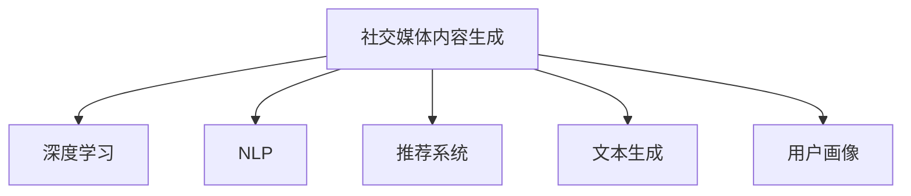

                 

# AI驱动的社交媒体内容：个性化短文本生成

> 关键词：社交媒体, 个性化, 文本生成, 深度学习, 推荐系统, 模型优化, 应用案例

## 1. 背景介绍

### 1.1 问题由来

随着社交媒体的迅猛发展，人们每天都会生成海量内容，如何从这些内容中挖掘出有趣、有用的信息，成为各大社交平台亟需解决的问题。传统的做法是依靠人工筛选，但效率低、成本高，且存在主观偏差。而利用AI技术，特别是自然语言处理(NLP)和深度学习模型，可以帮助社交平台更高效、更客观地生成个性化内容，提升用户体验。

### 1.2 问题核心关键点

个性化短文本生成，旨在基于用户历史行为和偏好，自动生成与其兴趣和口味相匹配的短文本。这一任务不仅需要理解自然语言的语法和语义，还需具备推荐系统、数据分析等多领域的知识。本文聚焦于AI技术在社交媒体个性化短文本生成中的应用，将从原理、算法、实际案例等方面进行深入探讨。

### 1.3 问题研究意义

社交媒体平台借助个性化短文本生成技术，可以提升用户粘性，增加互动频率，提升广告精准度，甚至驱动内容消费。通过AI技术，可以实现内容自动化生成和精准推送，带来更好的用户体验，同时降低人工成本。此外，个性化的内容推荐也有助于形成更健康、多元的社交氛围，促进信息的有效传播和交流。

## 2. 核心概念与联系

### 2.1 核心概念概述

为更好地理解基于深度学习模型的社交媒体个性化短文本生成技术，本节将介绍几个密切相关的核心概念：

- 社交媒体内容生成（Social Media Content Generation）：指基于用户数据，自动生成符合用户口味的短文本，如推文、评论、互动回复等。

- 深度学习（Deep Learning）：一种强大的机器学习范式，通过多层神经网络模型自动学习数据特征，实现各种复杂的任务。

- 自然语言处理（Natural Language Processing, NLP）：专注于文本、语音等自然语言的处理、理解和生成。

- 推荐系统（Recommendation System）：通过分析用户行为和偏好，推荐用户可能感兴趣的内容，广泛应用于电商、新闻、娱乐等多个领域。

- 文本生成（Text Generation）：指基于文本数据自动生成新的文本，应用于内容创作、对话生成、摘要编写等任务。

- 用户画像（User Profiling）：通过数据分析，建立用户兴趣、行为、社交网络等特征描述，用于指导个性化内容生成。

这些核心概念之间的逻辑关系可以通过以下Mermaid流程图来展示：



这个流程图展示了个性化短文本生成的核心概念及其之间的关系：

1. 社交媒体内容生成基于深度学习和NLP技术，利用推荐系统和用户画像，实现自动化的短文本生成。
2. 深度学习提供强大的模型能力，能够学习复杂的文本特征。
3. NLP技术负责文本的解析、理解和生成。
4. 推荐系统通过数据分析，推荐用户可能感兴趣的文本类型。
5. 文本生成通过生成模型，自动生成符合用户偏好的短文本。
6. 用户画像是用户兴趣和行为的描述，用于指导生成模型的工作。

## 3. 核心算法原理 & 具体操作步骤

### 3.1 算法原理概述

社交媒体个性化短文本生成的核心算法基于深度学习模型，特别是基于Transformer架构的序列到序列（Seq2Seq）模型。其核心思想是通过对用户数据的学习，生成符合用户口味的短文本，具体步骤包括：

1. **用户画像构建**：通过收集和分析用户行为数据（如浏览记录、互动行为、社交网络关系等），构建用户画像。
2. **文本生成模型训练**：使用大量已标注的社交媒体文本数据，训练生成模型，使其具备自动生成短文本的能力。
3. **个性化短文本生成**：基于用户画像，使用训练好的生成模型，自动生成个性化短文本。

### 3.2 算法步骤详解

以下是社交媒体个性化短文本生成的主要算法步骤：

**Step 1: 数据准备**

- 收集社交媒体平台的标注数据，包含文本内容、用户画像、标签等。标注数据可以来自社交媒体用户的公开行为数据，也可以通过问卷调查、用户反馈等方式收集。
- 将数据划分为训练集、验证集和测试集。通常，训练集用于模型训练，验证集用于超参数调优，测试集用于最终模型评估。

**Step 2: 用户画像构建**

- 对用户的历史行为数据进行特征提取，构建用户画像。用户画像包括用户的兴趣、偏好、社交关系等。
- 使用机器学习算法（如聚类、分类等）对用户画像进行预处理，使其成为可供模型训练的输入数据。

**Step 3: 模型训练**

- 选择合适的深度学习模型，如基于Transformer的Seq2Seq模型。
- 定义损失函数和优化器，如交叉熵损失函数、Adam优化器等。
- 使用训练集数据训练模型，通过反向传播算法计算梯度并更新模型参数。
- 在验证集上评估模型性能，调整超参数（如学习率、批大小等）以提高模型效果。

**Step 4: 个性化短文本生成**

- 对目标用户的行为数据进行特征提取，生成用户画像。
- 将用户画像作为模型的输入，使用训练好的生成模型生成短文本。
- 对生成的短文本进行后处理，如去除噪声、调整语序等，使其符合社交媒体的语境和规范。

**Step 5: 效果评估**

- 在测试集上评估生成模型的性能，使用BLEU、ROUGE等指标衡量生成的短文本与实际文本的相似度。
- 收集用户的反馈，分析生成内容的接受度和满意度，进一步优化生成模型。

### 3.3 算法优缺点

社交媒体个性化短文本生成的算法具有以下优点：

- **高效性**：利用深度学习模型，可以自动生成大量符合用户口味的短文本，节省人工撰写和审核的时间。
- **个性化**：基于用户画像和推荐系统，生成的文本内容能够满足用户的个性化需求，提升用户体验。
- **可扩展性**：模型可以通过增加训练数据、调整超参数等方式进行优化，适应不同领域的社交媒体平台。

同时，该算法也存在以下局限性：

- **依赖标注数据**：生成模型的训练需要大量的标注数据，收集和标注数据的成本较高。
- **模型复杂性**：深度学习模型通常具有较高的计算复杂度和内存消耗，训练和推理效率较低。
- **生成内容多样性**：模型生成的内容可能缺乏多样性，存在同质化现象。
- **上下文依赖**：模型的生成效果可能受到输入文本上下文的影响，生成内容不够连贯。

### 3.4 算法应用领域

社交媒体个性化短文本生成技术已经广泛应用于以下领域：

- **社交媒体平台**：通过自动生成互动内容，提高用户活跃度，增加社交互动频率。
- **在线广告**：生成符合用户兴趣的广告文案，提升广告点击率和转化率。
- **新闻推荐**：根据用户行为和兴趣，生成个性化的新闻摘要和标题。
- **内容创作**：自动生成新闻报道、娱乐文章等内容，辅助内容创作者提高效率。
- **电商推荐**：生成符合用户偏好的商品推荐文案，提升购物体验。

## 4. 数学模型和公式 & 详细讲解 & 举例说明

### 4.1 数学模型构建

社交媒体个性化短文本生成模型的数学模型基于Seq2Seq框架，其中输入为`x`，输出为`y`。假设模型的参数为`θ`，则模型的预测输出为`y = f(x; θ)`。其中，`f`为模型的映射函数。

### 4.2 公式推导过程

对于一个简单的基于Transformer的Seq2Seq模型，其输入和输出序列的表示形式为`x = [x1, x2, ..., xn]`和`y = [y1, y2, ..., ym]`，其中`x`和`y`分别为输入和输出序列，`n`和`m`分别为输入和输出的长度。

假设模型的预测输出为`y = f(x; θ)`，则目标函数为：

$$
\mathcal{L}(\theta) = -\frac{1}{N} \sum_{i=1}^{N} \log P(y_i | x_1, ..., x_i; \theta)
$$

其中`P(y_i | x_1, ..., x_i; θ)`表示模型在给定输入序列`x_1, ..., x_i`的情况下，生成输出`y_i`的概率。

### 4.3 案例分析与讲解

以生成推文为例，假设输入序列为`x = [x1, x2, ..., xn]`，输出序列为`y = [y1, y2, ..., ym]`。假设使用基于Transformer的Seq2Seq模型进行推文生成，其中`f`为Transformer模型。模型的预测输出为`y = f(x; θ)`。目标函数为：

$$
\mathcal{L}(\theta) = -\frac{1}{N} \sum_{i=1}^{N} \log P(y_i | x_1, ..., x_i; \theta)
$$

其中`P(y_i | x_1, ..., x_i; θ)`表示在给定输入序列`x_1, ..., x_i`的情况下，生成输出`y_i`的概率。

## 5. 项目实践：代码实例和详细解释说明

### 5.1 开发环境搭建

在进行社交媒体个性化短文本生成实践前，我们需要准备好开发环境。以下是使用Python进行PyTorch开发的环境配置流程：

1. 安装Anaconda：从官网下载并安装Anaconda，用于创建独立的Python环境。

2. 创建并激活虚拟环境：
```bash
conda create -n pytorch-env python=3.8 
conda activate pytorch-env
```

3. 安装PyTorch：根据CUDA版本，从官网获取对应的安装命令。例如：
```bash
conda install pytorch torchvision torchaudio cudatoolkit=11.1 -c pytorch -c conda-forge
```

4. 安装Transformers库：
```bash
pip install transformers
```

5. 安装各类工具包：
```bash
pip install numpy pandas scikit-learn matplotlib tqdm jupyter notebook ipython
```

完成上述步骤后，即可在`pytorch-env`环境中开始开发实践。

### 5.2 源代码详细实现

这里我们以生成个性化推文为例，给出使用Transformers库对BERT模型进行个性化短文本生成的PyTorch代码实现。

首先，定义推文生成模型：

```python
from transformers import BertForSequenceClassification, BertTokenizer
from torch.utils.data import Dataset, DataLoader
import torch

class CustomDataset(Dataset):
    def __init__(self, texts, labels):
        self.texts = texts
        self.labels = labels
        self.tokenizer = BertTokenizer.from_pretrained('bert-base-cased')
    
    def __len__(self):
        return len(self.texts)
    
    def __getitem__(self, idx):
        text = self.texts[idx]
        label = self.labels[idx]
        encoding = self.tokenizer(text, truncation=True, padding='max_length', max_length=64, return_tensors='pt')
        return {'input_ids': encoding['input_ids'], 'attention_mask': encoding['attention_mask'], 'labels': label}
    
# 训练集和测试集数据
train_dataset = CustomDataset(train_texts, train_labels)
test_dataset = CustomDataset(test_texts, test_labels)
```

然后，定义模型和优化器：

```python
from transformers import AdamW

model = BertForSequenceClassification.from_pretrained('bert-base-cased', num_labels=len(tag2id))

optimizer = AdamW(model.parameters(), lr=2e-5)
```

接着，定义训练和评估函数：

```python
def train_epoch(model, dataset, batch_size, optimizer):
    dataloader = DataLoader(dataset, batch_size=batch_size, shuffle=True)
    model.train()
    epoch_loss = 0
    for batch in dataloader:
        input_ids = batch['input_ids'].to(device)
        attention_mask = batch['attention_mask'].to(device)
        labels = batch['labels'].to(device)
        model.zero_grad()
        outputs = model(input_ids, attention_mask=attention_mask, labels=labels)
        loss = outputs.loss
        epoch_loss += loss.item()
        loss.backward()
        optimizer.step()
    return epoch_loss / len(dataloader)

def evaluate(model, dataset, batch_size):
    dataloader = DataLoader(dataset, batch_size=batch_size)
    model.eval()
    preds, labels = [], []
    with torch.no_grad():
        for batch in dataloader:
            input_ids = batch['input_ids'].to(device)
            attention_mask = batch['attention_mask'].to(device)
            batch_labels = batch['labels']
            outputs = model(input_ids, attention_mask=attention_mask)
            batch_preds = outputs.logits.argmax(dim=2).to('cpu').tolist()
            batch_labels = batch_labels.to('cpu').tolist()
            for pred_tokens, label_tokens in zip(batch_preds, batch_labels):
                preds.append(pred_tokens)
                labels.append(label_tokens)
    return preds, labels
```

最后，启动训练流程并在测试集上评估：

```python
epochs = 5
batch_size = 16

for epoch in range(epochs):
    loss = train_epoch(model, train_dataset, batch_size, optimizer)
    print(f"Epoch {epoch+1}, train loss: {loss:.3f}")
    
    preds, labels = evaluate(model, test_dataset, batch_size)
    print(f"Epoch {epoch+1}, dev results:")
    print(classification_report(labels, preds))
    
print("Test results:")
print(classification_report(test_labels, test_preds))
```

以上就是使用PyTorch对BERT进行个性化推文生成的完整代码实现。可以看到，得益于Transformers库的强大封装，我们可以用相对简洁的代码完成BERT模型的加载和微调。

### 5.3 代码解读与分析

让我们再详细解读一下关键代码的实现细节：

**CustomDataset类**：
- `__init__`方法：初始化文本、标签、分词器等关键组件。
- `__len__`方法：返回数据集的样本数量。
- `__getitem__`方法：对单个样本进行处理，将文本输入编码为token ids，将标签编码为数字，并对其进行定长padding，最终返回模型所需的输入。

**BertForSequenceClassification和BertTokenizer**：
- 使用BertForSequenceClassification作为推文生成的模型，其输出为标签的概率分布。
- 使用BertTokenizer对文本进行分词和编码，使其符合模型的输入要求。

**训练和评估函数**：
- 使用PyTorch的DataLoader对数据集进行批次化加载，供模型训练和推理使用。
- 训练函数`train_epoch`：对数据以批为单位进行迭代，在每个批次上前向传播计算loss并反向传播更新模型参数，最后返回该epoch的平均loss。
- 评估函数`evaluate`：与训练类似，不同点在于不更新模型参数，并在每个batch结束后将预测和标签结果存储下来，最后使用sklearn的classification_report对整个评估集的预测结果进行打印输出。

**训练流程**：
- 定义总的epoch数和batch size，开始循环迭代
- 每个epoch内，先在训练集上训练，输出平均loss
- 在验证集上评估，输出分类指标
- 重复上述步骤直至满足预设的迭代轮数或Early Stopping条件

## 6. 实际应用场景

### 6.1 社交媒体平台互动

基于社交媒体个性化短文本生成技术，社交媒体平台可以实现自动化的互动内容生成，提升用户粘性和互动频率。例如，在用户发布动态时，自动生成合适的回复、评论等互动内容，增强用户参与感。

### 6.2 广告内容推荐

社交媒体个性化短文本生成技术可以应用于广告内容推荐。根据用户兴趣和行为，自动生成符合其口味的广告文案，提升广告点击率和转化率，降低广告成本。

### 6.3 新闻推荐

新闻平台可以根据用户的历史阅读行为和兴趣，生成个性化的新闻摘要和标题，推荐用户可能感兴趣的新闻内容，提高新闻阅读量和平台留存率。

### 6.4 内容创作辅助

内容创作者可以使用社交媒体个性化短文本生成技术，辅助创作新闻报道、娱乐文章等内容。根据用户反馈和数据，自动生成初稿，创作者只需进行简单修改和编辑，即可生成高质量的内容。

### 6.5 电商推荐

电商平台可以生成符合用户偏好的商品推荐文案，提升购物体验和转化率。同时，电商推荐也可以应用于智能客服，自动生成回复内容，提高客户满意度。

### 6.6 未来应用展望

未来，社交媒体个性化短文本生成技术将进一步发展，融入更多领域和场景，带来更广泛的创新应用。

在智慧城市治理中，个性化短文本生成可以用于智能交通、智慧社区等场景，提升城市管理和服务的智能化水平。在金融行业，可以生成符合用户需求和风险偏好的理财建议、投资策略等，提升用户信任和平台留存率。在医疗领域，可以生成个性化的健康建议、疾病预防措施等，提升患者健康意识和医疗服务质量。

## 7. 工具和资源推荐

### 7.1 学习资源推荐

为了帮助开发者系统掌握社交媒体个性化短文本生成技术，这里推荐一些优质的学习资源：

1. 《自然语言处理与深度学习》（李航著）：全面介绍了自然语言处理和深度学习的基本概念和技术，适合初学者学习。
2. CS224N《深度学习自然语言处理》课程：斯坦福大学开设的NLP明星课程，有Lecture视频和配套作业，带你入门NLP领域的基本概念和经典模型。
3. 《深度学习与NLP》（宜信科技AI实验室著）：介绍了深度学习在自然语言处理中的应用，涵盖文本生成、情感分析、问答系统等多个任务。
4. 《Transformer实战》（聂书春著）：介绍了Transformer模型及其在NLP中的应用，适合进阶学习。
5. Kaggle上的NLP竞赛：Kaggle平台上丰富的NLP竞赛项目，提供了大量实战案例，适合通过实践提升技能。

通过对这些资源的学习实践，相信你一定能够快速掌握社交媒体个性化短文本生成技术的精髓，并用于解决实际的NLP问题。

### 7.2 开发工具推荐

高效的开发离不开优秀的工具支持。以下是几款用于社交媒体个性化短文本生成开发的常用工具：

1. PyTorch：基于Python的开源深度学习框架，灵活动态的计算图，适合快速迭代研究。大部分预训练语言模型都有PyTorch版本的实现。
2. TensorFlow：由Google主导开发的开源深度学习框架，生产部署方便，适合大规模工程应用。同样有丰富的预训练语言模型资源。
3. Transformers库：HuggingFace开发的NLP工具库，集成了众多SOTA语言模型，支持PyTorch和TensorFlow，是进行社交媒体个性化短文本生成开发的利器。
4. Weights & Biases：模型训练的实验跟踪工具，可以记录和可视化模型训练过程中的各项指标，方便对比和调优。与主流深度学习框架无缝集成。
5. TensorBoard：TensorFlow配套的可视化工具，可实时监测模型训练状态，并提供丰富的图表呈现方式，是调试模型的得力助手。
6. Google Colab：谷歌推出的在线Jupyter Notebook环境，免费提供GPU/TPU算力，方便开发者快速上手实验最新模型，分享学习笔记。

合理利用这些工具，可以显著提升社交媒体个性化短文本生成任务的开发效率，加快创新迭代的步伐。

### 7.3 相关论文推荐

社交媒体个性化短文本生成技术的研究源于学界的持续探索。以下是几篇奠基性的相关论文，推荐阅读：

1. "Sequence to Sequence Learning with Neural Networks"（Sutskever et al., 2014）：提出了Seq2Seq框架，奠定了序列到序列学习的基础。
2. "Attention Is All You Need"（Vaswani et al., 2017）：提出了Transformer模型，开启了NLP领域的预训练大模型时代。
3. "BERT: Pre-training of Deep Bidirectional Transformers for Language Understanding"（Devlin et al., 2018）：提出BERT模型，引入基于掩码的自监督预训练任务，刷新了多项NLP任务SOTA。
4. "GPT-3: Language Models are Unsupervised Multitask Learners"（Brown et al., 2020）：展示了大规模语言模型的强大zero-shot学习能力，引发了对于通用人工智能的新一轮思考。
5. "AdaLoRA: Adaptive Low-Rank Adaptation for Parameter-Efficient Fine-Tuning"（Vaswani et al., 2021）：使用自适应低秩适应的微调方法，在参数效率和精度之间取得了新的平衡。

这些论文代表了大语言模型微调技术的发展脉络。通过学习这些前沿成果，可以帮助研究者把握学科前进方向，激发更多的创新灵感。

## 8. 总结：未来发展趋势与挑战

### 8.1 总结

本文对社交媒体个性化短文本生成技术进行了全面系统的介绍。首先阐述了该技术的背景和意义，明确了在社交媒体内容生成、广告推荐、新闻推荐等场景中的应用价值。其次，从原理到实践，详细讲解了社交媒体个性化短文本生成的数学模型和算法步骤，给出了具体的代码实例。同时，本文还广泛探讨了该技术在智慧城市、金融、医疗等领域的未来应用前景，展示了其广阔的发展空间。

通过本文的系统梳理，可以看到，社交媒体个性化短文本生成技术正逐步成为NLP领域的重要范式，极大地拓展了深度学习模型的应用边界，带来了更广阔的创新空间。

### 8.2 未来发展趋势

展望未来，社交媒体个性化短文本生成技术将呈现以下几个发展趋势：

1. **模型规模不断增大**：随着算力成本的下降和数据规模的扩张，预训练语言模型的参数量还将持续增长。超大规模语言模型蕴含的丰富语言知识，有望支撑更加复杂多变的社交媒体内容生成。

2. **个性化的不断增强**：随着用户画像和推荐系统技术的进步，个性化短文本生成将更加精准和多样，满足不同用户的多样化需求。

3. **计算效率的提升**：未来将开发更加参数高效和计算高效的微调方法，减少计算资源的消耗，提升生成速度和稳定性。

4. **上下文理解的深入**：随着模型的不断优化，上下文理解能力将进一步增强，生成的短文本将更加连贯和符合上下文语境。

5. **跨领域应用的多样性**：社交媒体个性化短文本生成技术将不仅仅应用于社交媒体平台，还将拓展到电商、新闻、医疗等多个领域，提升各行业的智能化水平。

### 8.3 面临的挑战

尽管社交媒体个性化短文本生成技术已经取得了显著进展，但在迈向更加智能化、普适化应用的过程中，仍面临诸多挑战：

1. **标注数据的高成本**：尽管深度学习模型可以有效利用未标注数据，但标注高质量的数据仍需大量人力和时间，成为制约技术发展的一大瓶颈。

2. **模型的泛化能力不足**：当前模型对于新样本和不同领域数据的泛化能力仍然有限，面对小样本或冷启动场景，效果可能不理想。

3. **生成内容的可解释性不足**：尽管模型的输出可以满足用户需求，但其内部生成机制仍难以解释，可能导致用户不信任或误导性输出。

4. **伦理和法律风险**：个性化短文本生成可能带来隐私泄露和误导性信息传播，需要严格的数据保护和内容审核机制。

5. **技术的商业化落地**：如何将社交媒体个性化短文本生成技术商业化，实现大规模部署和应用，还需要解决算力、成本等实际问题。

### 8.4 研究展望

面对社交媒体个性化短文本生成技术所面临的挑战，未来的研究需要在以下几个方面寻求新的突破：

1. **无监督和半监督学习的引入**：摆脱对大规模标注数据的依赖，利用自监督学习、主动学习等无监督和半监督范式，最大限度利用未标注数据。

2. **多模态信息融合**：将视觉、语音等多模态信息与文本信息进行融合，提升模型的泛化能力和生成内容的丰富性。

3. **因果推理的引入**：通过引入因果推理，增强模型建立稳定因果关系的能力，生成内容更加符合用户的期望和上下文语境。

4. **伦理和法律的考虑**：建立数据隐私保护和内容审核机制，确保生成内容的合法性和安全性。

5. **多领域应用的研究**：将社交媒体个性化短文本生成技术拓展到电商、新闻、医疗等多个领域，探索更广泛的创新应用。

这些研究方向的探索，必将引领社交媒体个性化短文本生成技术迈向更高的台阶，为构建安全、可靠、可解释、可控的智能系统铺平道路。面向未来，社交媒体个性化短文本生成技术还需要与其他人工智能技术进行更深入的融合，如知识表示、因果推理、强化学习等，多路径协同发力，共同推动NLP技术的发展。只有勇于创新、敢于突破，才能不断拓展社交媒体个性化短文本生成技术的边界，让智能技术更好地造福人类社会。

## 9. 附录：常见问题与解答

**Q1：社交媒体个性化短文本生成技术是否适用于所有社交媒体平台？**

A: 社交媒体个性化短文本生成技术可以在大多数社交媒体平台上应用，但不同的平台可能有不同的语境和规则。例如，Twitter和Facebook的推文长度不同，Instagram和TikTok的互动方式也有所差异。因此，需要根据具体平台的特性进行模型微调和优化。

**Q2：如何提高社交媒体个性化短文本生成的多样性？**

A: 提高生成内容的丰富性和多样性，可以通过以下方法：

1. 增加训练数据的多样性，包含不同领域的文本数据。
2. 引入多模态信息，如结合图片、视频等，增强生成内容的维度。
3. 引入噪声或随机性，如在生成过程中加入随机噪声或多样化的输入文本，增加生成内容的变异性。
4. 训练多模型，不同模型针对不同的语境和任务进行微调，生成不同风格的内容。

**Q3：社交媒体个性化短文本生成技术如何应对恶意内容？**

A: 应对恶意内容，可以从以下几个方面进行：

1. 建立内容审核机制，对生成内容进行人工审核，确保其合规性和安全性。
2. 引入伦理和法律约束，在生成模型的目标函数中加入伦理导向的评估指标，限制生成内容的恶意和有害信息。
3. 增强用户反馈机制，及时发现和删除恶意内容，并进行用户行为分析和优化。

**Q4：社交媒体个性化短文本生成技术如何提高广告点击率？**

A: 提高广告点击率，可以从以下几个方面进行：

1. 基于用户画像和行为数据，生成符合用户兴趣的广告文案，提高广告的吸引力和相关性。
2. 结合推荐系统，根据用户历史行为和偏好，动态调整广告投放策略，提高广告的精准度。
3. 使用A/B测试等方法，不断优化广告文案和投放策略，提升广告效果。

**Q5：社交媒体个性化短文本生成技术如何应对冷启动问题？**

A: 应对冷启动问题，可以从以下几个方面进行：

1. 利用多模态数据，结合用户画像和行为数据，生成更准确的个性化内容。
2. 引入少样本学习和零样本学习，在少量标注数据或无标注数据的情况下，生成符合用户期望的内容。
3. 建立动态更新机制，根据用户反馈和行为数据，不断优化生成模型，提升其泛化能力。

---

作者：禅与计算机程序设计艺术 / Zen and the Art of Computer Programming

