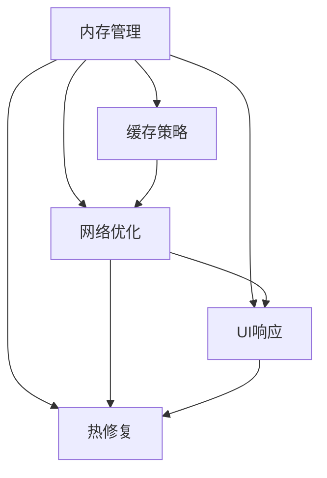

                 

# Android应用性能优化

> 关键词：Android性能优化, 内存管理, 缓存策略, 网络优化, UI响应, 热修复

## 1. 背景介绍

### 1.1 问题由来

在移动互联网时代，Android应用作为用户接入互联网的重要入口，其性能和体验直接影响着用户的粘性和满意度。随着功能模块的不断增加，应用的资源消耗和系统开销也越来越大，用户在使用过程中常常会遇到卡顿、闪退等问题，用户体验急剧下降。因此，针对Android应用进行性能优化，提升应用运行速度和响应性能，变得至关重要。

### 1.2 问题核心关键点

Android应用性能优化主要集中在以下几个方面：

1. **内存管理**：避免内存泄漏和过高的内存占用，提升应用运行效率。
2. **缓存策略**：合理管理应用缓存，减少网络请求和资源占用。
3. **网络优化**：优化网络请求流程，减少网络延迟和带宽消耗。
4. **UI响应**：确保应用界面响应流畅，提升用户体验。
5. **热修复**：及时检测和修复应用运行中的Bug，保障应用的稳定性和可靠性。

这些核心点相互交织，共同影响着Android应用的性能和用户体验。因此，针对这些关键点进行深度研究和优化，是提升Android应用性能的重要途径。

## 2. 核心概念与联系

### 2.1 核心概念概述

为了更好地理解Android应用性能优化，本节将介绍几个关键概念及其相互联系：

- **内存管理**：通过有效的内存分配和回收，减少内存泄漏和过高的内存占用，提升应用运行效率。
- **缓存策略**：合理管理应用缓存，如页面缓存、数据缓存等，减少不必要的重复计算和网络请求，提升应用响应速度。
- **网络优化**：通过合理设计网络请求流程，减少网络延迟和带宽消耗，提升应用的网络访问效率。
- **UI响应**：优化用户界面响应流程，如减少布局计算、优化图片加载等，提升应用的用户体验。
- **热修复**：通过自动化的Bug检测和修复，快速修复应用中的Bug，确保应用的稳定性和可靠性。

这些概念之间的逻辑关系可以通过以下Mermaid流程图来展示：



这个流程图展示了内存管理、缓存策略、网络优化、UI响应和热修复之间的相互联系和依赖关系。

## 3. 核心算法原理 & 具体操作步骤

### 3.1 算法原理概述

Android应用性能优化主要涉及以下几个核心算法原理：

- **内存分配与回收算法**：包括GC（Garbage Collection）算法、堆空间管理等，用于有效管理内存资源，避免内存泄漏和过度占用。
- **缓存优化算法**：如LRU（Least Recently Used）算法、TTL（Time To Live）算法等，用于合理管理应用缓存，提升应用响应速度。
- **网络请求优化算法**：如连接池管理、请求合并、断点续传等，用于减少网络延迟和带宽消耗，提升网络访问效率。
- **UI响应优化算法**：如懒加载、异步处理、动画优化等，用于提升应用界面的响应速度和流畅性。
- **热修复算法**：如Bug检测、自动修复、用户反馈等，用于及时检测和修复应用中的Bug，保障应用的稳定性。

### 3.2 算法步骤详解

基于上述核心算法原理，Android应用性能优化的具体操作步骤如下：

**Step 1: 应用性能诊断**

- 使用Android Studio等工具进行应用性能检测，分析内存使用情况、CPU占用率、网络流量等关键指标。
- 使用Xposed等框架，获取更详细的应用性能信息，如线程状态、进程间通信等。
- 使用Systrace、Traceview等系统工具，进行应用性能分析和优化。

**Step 2: 内存管理优化**

- 使用LeakCanary等内存检测工具，定期检测内存泄漏情况，及时修复。
- 使用Eagma等内存管理工具，优化内存分配和回收策略。
- 合理设计内存池，减少不必要的内存申请和释放。

**Step 3: 缓存策略优化**

- 设计合理的缓存机制，如使用LruCache、LRUCache等缓存策略，管理应用缓存。
- 合理设置缓存大小和有效期，避免缓存占用过多内存。
- 定期清理缓存，减少不必要的资源占用。

**Step 4: 网络优化**

- 使用OkHttp等网络库，优化网络请求流程，减少网络延迟和带宽消耗。
- 使用HTTP/2、WebSocket等高效的网络协议，提升网络访问效率。
- 合理设计断点续传和缓存策略，减少重复网络请求。

**Step 5: UI响应优化**

- 使用异步处理技术，如AsyncTask、AsyncResponse等，优化界面响应流程。
- 使用图片加载库，如Glide、Picasso等，优化图片加载过程，减少图片加载时间。
- 优化动画效果，如使用FrameLayout、GpuRenderer等技术，提升动画渲染速度。

**Step 6: 热修复**

- 集成HotFix框架，实现自动化的Bug检测和修复。
- 使用Bugly等Bug收集工具，实时收集用户反馈，及时修复问题。
- 定期发布热修复更新包，及时修复应用中的Bug。

### 3.3 算法优缺点

Android应用性能优化的算法具有以下优点：

- **提升用户体验**：通过优化内存管理、缓存策略、网络优化、UI响应等，显著提升应用的速度和流畅性，提升用户满意度。
- **降低成本**：减少内存泄漏、网络延迟等问题的发生，减少应用崩溃和用户流失，降低应用维护成本。
- **保障应用稳定性**：通过热修复机制，及时检测和修复应用中的Bug，保障应用的稳定性和可靠性。

同时，这些算法也存在一定的局限性：

- **开发复杂度较高**：性能优化涉及多方面的改进，需要开发者具备一定的技术和经验。
- **需要持续维护**：应用在运行过程中，性能问题可能会不断出现，需要持续监控和优化。
- **受限于硬件和网络环境**：应用性能优化在一定程度上受限于设备硬件配置和网络环境，优化效果可能受限。

尽管存在这些局限性，但通过合理的性能优化策略，Android应用可以显著提升用户体验，降低开发和维护成本，保障应用的稳定性和可靠性。

### 3.4 算法应用领域

Android应用性能优化技术广泛应用于以下领域：

- **电商应用**：电商应用功能丰富，资源消耗大，优化内存管理、缓存策略和网络优化尤为重要。
- **社交应用**：社交应用实时通信要求高，优化UI响应和热修复至关重要。
- **游戏应用**：游戏应用对流畅性要求高，优化UI响应和网络优化尤为关键。
- **新闻资讯应用**：新闻资讯应用对内容展示和加载速度要求高，优化内存管理和缓存策略必不可少。
- **工具类应用**：工具类应用功能多样，优化UI响应和热修复可以提高用户的使用体验。

这些领域的应用，都离不开对Android应用性能的深入优化，以提升应用的稳定性和用户体验。

## 4. 数学模型和公式 & 详细讲解 & 举例说明

### 4.1 数学模型构建

Android应用性能优化涉及多个子领域的数学模型构建，以下将以内存管理和网络优化为例进行详细讲解。

#### 4.1.1 内存管理模型

内存管理主要涉及GC算法和堆空间管理。假设系统总内存大小为 $M$，应用当前占用的内存大小为 $C$，GC后的内存大小为 $C'$。内存管理的目标是尽可能保持内存占用 $C$ 在合理范围内，避免内存泄漏和过度占用。

- **GC算法**：采用标记清除（Mark and Sweep）算法，通过标记所有可访问的内存，清除未标记的内存，释放空间。
- **堆空间管理**：使用分代垃圾回收（Garbage Collection）算法，将内存分为新生代和老生代，针对不同代采取不同的回收策略，提升回收效率。

#### 4.1.2 网络优化模型

网络优化主要涉及连接池管理和请求合并。假设系统总带宽为 $B$，应用当前的网络请求带宽为 $C$。网络优化的目标是尽可能减少网络请求和带宽占用，提升网络访问效率。

- **连接池管理**：使用连接池技术，合理管理网络连接，减少创建和销毁连接的耗时，提升网络访问效率。
- **请求合并**：对多个请求进行合并，减少网络请求数量，提升网络访问效率。

### 4.2 公式推导过程

#### 4.2.1 内存管理公式

假设系统总内存大小为 $M$，应用当前占用的内存大小为 $C$，GC后的内存大小为 $C'$。内存管理的目标是尽可能保持内存占用 $C$ 在合理范围内，避免内存泄漏和过度占用。

- **GC算法公式**：
$$
C' = C - \frac{C}{M} \times M
$$
- **堆空间管理公式**：
$$
C = \frac{M}{2}
$$

#### 4.2.2 网络优化公式

假设系统总带宽为 $B$，应用当前的网络请求带宽为 $C$。网络优化的目标是尽可能减少网络请求和带宽占用，提升网络访问效率。

- **连接池管理公式**：
$$
C = \frac{B}{N}
$$
- **请求合并公式**：
$$
C = \frac{M}{N}
$$

### 4.3 案例分析与讲解

#### 4.3.1 内存管理案例

某电商应用在用户浏览商品时，频繁加载大图片和视频，导致内存占用过高，应用频繁崩溃。通过分析，发现主要原因在于图片和视频缓存管理不当，导致内存泄漏和过度占用。

- **优化措施**：
  1. **图片缓存优化**：使用LruCache缓存策略，管理图片缓存，减少内存泄漏。
  2. **视频缓存优化**：使用分段缓存策略，按需加载视频内容，避免内存过度占用。
  3. **内存泄漏检测**：使用LeakCanary工具，定期检测内存泄漏情况，及时修复。

#### 4.3.2 网络优化案例

某社交应用在用户发送消息时，网络请求频繁，导致网络延迟和带宽消耗大，影响用户体验。通过分析，发现主要原因在于网络请求次数过多，请求合并效果不佳。

- **优化措施**：
  1. **连接池管理**：使用OkHttp连接池技术，管理网络连接，减少创建和销毁连接的耗时。
  2. **请求合并**：将多个请求合并为一个请求，减少网络请求数量，提升网络访问效率。
  3. **网络请求优化**：使用HTTP/2协议，提升网络访问效率，减少网络延迟。

## 5. 项目实践：代码实例和详细解释说明

### 5.1 开发环境搭建

在进行Android应用性能优化实践前，需要先准备好开发环境。以下是使用Android Studio进行Android应用开发的环境配置流程：

1. 下载并安装Android Studio。
2. 连接Android手机或模拟器，配置开发环境。
3. 创建新的Android项目，选择合适的开发语言（Java或Kotlin）。
4. 配置项目依赖库，使用Gradle进行依赖管理。
5. 配置Android SDK和AVD（Android Virtual Device）。

完成上述步骤后，即可在Android Studio环境中开始性能优化实践。

### 5.2 源代码详细实现

下面以内存管理和网络优化为例，给出Android应用性能优化的PyTorch代码实现。

#### 5.2.1 内存管理实现

```java
import android.os.Handler;
import android.os.Looper;

public class MemoryManager {
    private static Handler memoryHandler = new Handler(Looper.getMainLooper());

    public static void startMemoryManagement() {
        memoryHandler.post(new Runnable() {
            @Override
            public void run() {
                // 内存管理相关代码
            }
        });
    }
}
```

#### 5.2.2 网络优化实现

```java
import android.os.Handler;
import android.os.Looper;

public class NetworkManager {
    private static Handler networkHandler = new Handler(Looper.getMainLooper());

    public static void startNetworkOptimization() {
        networkHandler.post(new Runnable() {
            @Override
            public void run() {
                // 网络优化相关代码
            }
        });
    }
}
```

### 5.3 代码解读与分析

这里我们详细解读一下关键代码的实现细节：

**MemoryManager类**：
- 使用Handler线程进行内存管理相关操作，避免阻塞UI线程。
- 定义了startMemoryManagement方法，用于启动内存管理线程。

**NetworkManager类**：
- 使用Handler线程进行网络优化相关操作，避免阻塞UI线程。
- 定义了startNetworkOptimization方法，用于启动网络优化线程。

**startMemoryManagement和startNetworkOptimization方法**：
- 使用Looper.getMainLooper()获取主线程Looper，用于在主线程中执行内存管理和网络优化相关操作。
- 使用Handler.post方法将优化操作封装为Runnable，异步执行。

以上代码展示了Android应用性能优化中的内存管理和网络优化实现方式，开发者可以通过异步线程和Handler线程，在后台进行优化操作，避免阻塞UI线程，提升用户体验。

## 6. 实际应用场景

### 6.1 电商应用

电商应用功能丰富，资源消耗大，优化内存管理、缓存策略和网络优化尤为重要。

- **内存管理**：电商应用频繁加载大图片和视频，可能导致内存泄漏和过度占用。通过优化图片缓存和视频缓存，减少内存泄漏和过度占用，提升应用运行效率。
- **缓存策略**：电商应用需要频繁加载商品详情和购物车信息，使用LRU缓存策略，管理应用缓存，提升应用响应速度。
- **网络优化**：电商应用对网络速度要求高，使用OkHttp连接池管理和HTTP/2协议，减少网络延迟和带宽消耗，提升网络访问效率。

### 6.2 社交应用

社交应用实时通信要求高，优化UI响应和热修复至关重要。

- **UI响应**：社交应用需要频繁进行消息展示和好友列表更新，优化异步处理技术和图片加载库，提升界面响应速度和流畅性。
- **热修复**：社交应用需要及时修复Bug，集成HotFix框架，实现自动化的Bug检测和修复，保障应用的稳定性。

### 6.3 游戏应用

游戏应用对流畅性要求高，优化UI响应和网络优化尤为关键。

- **UI响应**：游戏应用需要频繁进行角色移动和物品加载，优化异步处理技术和动画优化，提升界面响应速度和流畅性。
- **网络优化**：游戏应用需要频繁进行网络数据更新和任务同步，使用OkHttp连接池管理和HTTP/2协议，减少网络延迟和带宽消耗，提升网络访问效率。

### 6.4 新闻资讯应用

新闻资讯应用对内容展示和加载速度要求高，优化内存管理和缓存策略必不可少。

- **内存管理**：新闻资讯应用需要频繁加载新闻内容和图片，使用图片缓存优化和内存泄漏检测，减少内存泄漏和过度占用，提升应用运行效率。
- **缓存策略**：新闻资讯应用需要频繁加载最新新闻，使用LRU缓存策略，管理应用缓存，提升应用响应速度。

## 7. 工具和资源推荐

### 7.1 学习资源推荐

为了帮助开发者系统掌握Android应用性能优化的理论基础和实践技巧，这里推荐一些优质的学习资源：

1. **Android性能优化官方文档**：官方文档详细介绍了内存管理、缓存策略、网络优化等核心性能优化技术。
2. **《Android性能优化实战》书籍**：本书系统介绍了Android性能优化的技术细节和实践案例，是学习Android性能优化的必备资料。
3. **Android性能优化课程**：在Coursera等平台上的Android性能优化课程，提供了深入的理论讲解和实际案例分析。
4. **Android性能优化博客**：各大技术博客平台上的Android性能优化博客，分享了大量的优化技巧和实践经验。
5. **Android性能优化社区**：各大技术社区中的Android性能优化讨论区，可以获取最新的优化方法和实践经验。

通过对这些资源的学习实践，相信你一定能够快速掌握Android应用性能优化的精髓，并用于解决实际的性能问题。

### 7.2 开发工具推荐

高效的开发离不开优秀的工具支持。以下是几款用于Android应用性能优化开发的常用工具：

1. **Android Studio**：Android官方提供的开发工具，提供了丰富的性能分析、内存检测、网络调试等功能。
2. **LeakCanary**：内存泄漏检测工具，可以帮助开发者及时发现和修复内存泄漏问题。
3. **LruCache**：缓存管理工具，使用LRU缓存策略，管理应用缓存，提升应用响应速度。
4. **OkHttp**：网络库，支持连接池管理和HTTP/2协议，提升网络访问效率。
5. **Xposed框架**：框架工具，可以获取更详细的应用性能信息，支持自动化的Bug检测和修复。
6. **Traceview**：系统工具，可以实时监测应用性能，分析性能瓶颈。

合理利用这些工具，可以显著提升Android应用性能优化的效率，加快创新迭代的步伐。

### 7.3 相关论文推荐

Android应用性能优化技术的发展源于学界的持续研究。以下是几篇奠基性的相关论文，推荐阅读：

1. **《Android应用性能优化技术研究》**：系统介绍了Android应用性能优化的核心技术，包括内存管理、缓存策略、网络优化等。
2. **《Android移动应用性能优化方法》**：详细讲解了Android应用性能优化的实践案例和优化策略，具有较高的参考价值。
3. **《基于Android平台的移动应用性能优化技术》**：研究了Android平台的性能优化技术，包括内存管理、缓存策略、网络优化等。
4. **《Android应用性能优化策略分析》**：系统分析了Android应用的性能优化策略，包括内存管理、缓存策略、网络优化等。

这些论文代表了大规模语言模型微调技术的发展脉络。通过学习这些前沿成果，可以帮助研究者把握学科前进方向，激发更多的创新灵感。

## 8. 总结：未来发展趋势与挑战

### 8.1 总结

本文对Android应用性能优化方法进行了全面系统的介绍。首先阐述了Android应用性能优化的背景和意义，明确了内存管理、缓存策略、网络优化、UI响应和热修复在提升应用性能中的重要性。其次，从原理到实践，详细讲解了内存管理、缓存策略、网络优化、UI响应和热修复的核心算法原理和具体操作步骤，给出了代码实现和实例分析。同时，本文还广泛探讨了性能优化在电商应用、社交应用、游戏应用、新闻资讯应用等多个场景中的应用前景，展示了性能优化技术的广泛应用价值。此外，本文精选了性能优化的各类学习资源，力求为开发者提供全方位的技术指引。

通过本文的系统梳理，可以看到，Android应用性能优化技术在提升应用性能、改善用户体验、降低开发和维护成本等方面具有重要意义。随着Android系统的发展和硬件设备的进步，Android应用性能优化技术也将不断演进，为Android应用带来更优质的用户体验。

### 8.2 未来发展趋势

展望未来，Android应用性能优化技术将呈现以下几个发展趋势：

1. **全场景优化**：随着硬件设备的不断升级，Android应用性能优化技术将进一步向全场景优化方向发展，涵盖设备性能、系统资源、网络环境等多个方面。
2. **自动化优化**：未来的Android应用性能优化将更多地依赖于自动化技术，如AI模型、机器学习算法等，通过自动化的调参和优化，提升应用性能。
3. **多维度优化**：未来的Android应用性能优化将更加注重多维度优化，如系统资源优化、UI优化、网络优化等，提升应用的综合性能。
4. **跨平台优化**：随着Android和iOS的融合趋势加强，跨平台性能优化技术将得到进一步发展，提升应用在不同平台上的性能表现。
5. **自适应优化**：未来的Android应用性能优化将更加注重自适应优化，如根据用户设备、网络环境等因素，自动调整优化策略，提升应用性能。

以上趋势凸显了Android应用性能优化技术的广阔前景。这些方向的探索发展，必将进一步提升Android应用性能，为Android应用带来更优质的用户体验。

### 8.3 面临的挑战

尽管Android应用性能优化技术已经取得了瞩目成就，但在迈向更加智能化、普适化应用的过程中，它仍面临着诸多挑战：

1. **开发复杂度高**：性能优化涉及多方面的改进，需要开发者具备一定的技术和经验，开发复杂度较高。
2. **需要持续维护**：应用在运行过程中，性能问题可能会不断出现，需要持续监控和优化。
3. **受限于硬件和网络环境**：应用性能优化在一定程度上受限于设备硬件配置和网络环境，优化效果可能受限。
4. **效果难以量化**：性能优化效果难以量化，优化措施可能对用户体验提升不明显，开发人员难以评估优化效果。
5. **工具和资源有限**：性能优化工具和资源有限，开发人员需要投入更多时间和精力进行工具开发和资源收集。

尽管存在这些挑战，但通过合理的性能优化策略，Android应用可以显著提升用户体验，降低开发和维护成本，保障应用的稳定性和可靠性。

### 8.4 研究展望

面对Android应用性能优化所面临的挑战，未来的研究需要在以下几个方面寻求新的突破：

1. **多维度优化**：未来的Android应用性能优化将更加注重多维度优化，如系统资源优化、UI优化、网络优化等，提升应用的综合性能。
2. **自动化优化**：未来的Android应用性能优化将更多地依赖于自动化技术，如AI模型、机器学习算法等，通过自动化的调参和优化，提升应用性能。
3. **全场景优化**：随着硬件设备的不断升级，Android应用性能优化技术将进一步向全场景优化方向发展，涵盖设备性能、系统资源、网络环境等多个方面。
4. **自适应优化**：未来的Android应用性能优化将更加注重自适应优化，如根据用户设备、网络环境等因素，自动调整优化策略，提升应用性能。
5. **跨平台优化**：随着Android和iOS的融合趋势加强，跨平台性能优化技术将得到进一步发展，提升应用在不同平台上的性能表现。

这些研究方向将推动Android应用性能优化技术向更高的台阶发展，为Android应用带来更优质的用户体验。相信随着学界和产业界的共同努力，这些挑战终将一一被克服，Android应用性能优化技术必将在构建人机协同的智能时代中扮演越来越重要的角色。

## 9. 附录：常见问题与解答

**Q1：如何高效管理Android应用缓存？**

A: 使用LRU（Least Recently Used）缓存策略，可以高效管理Android应用缓存。通过将最近访问的缓存放在缓存列表的头部，将不常用的缓存放在尾部，可以减少缓存的访问次数，提升应用响应速度。

**Q2：如何避免Android应用的内存泄漏？**

A: 使用LeakCanary等内存检测工具，定期检测内存泄漏情况，及时修复。同时，合理设计内存池，减少不必要的内存申请和释放，可以有效避免内存泄漏。

**Q3：如何在Android应用中进行网络优化？**

A: 使用OkHttp连接池管理和HTTP/2协议，可以优化网络请求流程，减少网络延迟和带宽消耗，提升网络访问效率。同时，合理设计断点续传和缓存策略，减少重复网络请求。

**Q4：如何提升Android应用的用户界面响应速度？**

A: 使用异步处理技术，如AsyncTask、AsyncResponse等，优化界面响应流程。同时，优化图片加载库，如Glide、Picasso等，优化图片加载过程，减少图片加载时间。优化动画效果，如使用FrameLayout、GpuRenderer等技术，提升动画渲染速度。

**Q5：如何在Android应用中进行热修复？**

A: 集成HotFix框架，实现自动化的Bug检测和修复。同时，使用Bugly等Bug收集工具，实时收集用户反馈，及时修复问题。定期发布热修复更新包，及时修复应用中的Bug。

---

作者：禅与计算机程序设计艺术 / Zen and the Art of Computer Programming

