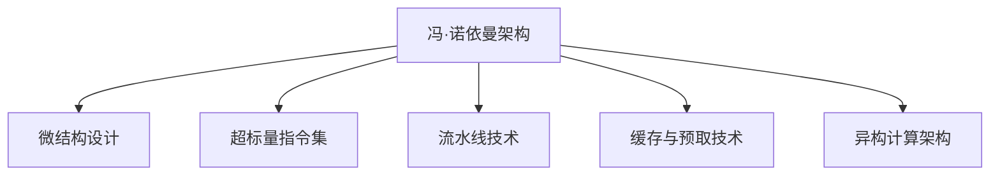

                 

# CPU的体系结构演进历程

> 关键词：CPU体系结构,历史演进,计算架构,微结构设计,处理器性能提升,未来趋势

## 1. 背景介绍

### 1.1 问题由来
随着计算技术的发展，处理器体系结构（CPU）经历了多次重大变革。从早期的冯·诺依曼架构到如今的超标量、乱序执行、多核、异构计算架构，每一步都在探索如何提升性能，降低能耗，并提高系统的效率和可靠性。理解CPU的演进历程，不仅可以帮助我们认识历史，更能洞悉未来发展的方向。

### 1.2 问题核心关键点
1. **冯·诺依曼架构**：由冯·诺依曼提出的经典计算模型，将数据存储和计算逻辑分离，通过单总线结构进行数据传递。这一架构在早期的计算机中广泛应用。

2. **微结构设计**：指在宏观结构的基础上，通过对逻辑电路的微调来提升性能。例如，乱序执行、多发射、多核等技术。

3. **超标量指令集**：指在单个时钟周期内，处理器能够执行多个指令。这一设计理念极大地提升了处理器的并行能力。

4. **流水线技术**：通过将指令执行分解为多个子过程，使得不同指令的子过程可以并行执行，从而提高处理器的执行效率。

5. **缓存与预取技术**：为了加速数据访问，CPU引入了多级缓存系统和数据预取技术，减少了对主存的依赖。

6. **异构计算架构**：将不同类型计算资源（如GPU、FPGA等）进行集成，通过优势互补，提升整体系统的计算能力。

这些核心概念构成了CPU演进的脉络，帮助我们理解处理器性能提升的路径和未来发展的方向。

## 2. 核心概念与联系

### 2.1 核心概念概述

以下是CPU演进历程中几个核心概念的概述：

- **冯·诺依曼架构**：由冯·诺依曼提出的经典计算模型，将数据存储和计算逻辑分离，通过单总线结构进行数据传递。

- **微结构设计**：指在宏观结构的基础上，通过对逻辑电路的微调来提升性能。例如，乱序执行、多发射、多核等技术。

- **超标量指令集**：指在单个时钟周期内，处理器能够执行多个指令。这一设计理念极大地提升了处理器的并行能力。

- **流水线技术**：通过将指令执行分解为多个子过程，使得不同指令的子过程可以并行执行，从而提高处理器的执行效率。

- **缓存与预取技术**：为了加速数据访问，CPU引入了多级缓存系统和数据预取技术，减少了对主存的依赖。

- **异构计算架构**：将不同类型计算资源（如GPU、FPGA等）进行集成，通过优势互补，提升整体系统的计算能力。

这些概念通过 Mermaid 流程图连接起来，展示了它们之间的逻辑关系：



这个流程图展示了这些概念之间的联系：

1. **冯·诺依曼架构**：是CPU演进的起点。
2. **微结构设计**：在冯·诺依曼架构的基础上进行优化。
3. **超标量指令集**和**流水线技术**：通过提升指令执行的并行度，优化了微结构设计。
4. **缓存与预取技术**：进一步优化了数据访问效率，减少对主存的依赖。
5. **异构计算架构**：基于上述技术，进一步提升了整体的计算能力。

这些概念共同构成了CPU演进的框架，帮助我们理解处理器性能提升的路径和未来发展的方向。

## 3. 核心算法原理 & 具体操作步骤

### 3.1 算法原理概述

CPU的体系结构演进主要围绕提升计算性能和降低能耗进行。其核心原理是优化数据流动路径、提高指令执行效率和优化能源利用。以下是对这些核心原理的详细阐述：

1. **优化数据流动路径**：通过优化存储器层次结构，减少数据访问延迟，提升数据访问速度。

2. **提高指令执行效率**：通过多发射、乱序执行等技术，提升单个时钟周期内的指令执行量。

3. **优化能源利用**：通过减少功耗，提升能效比，延长计算资源的使用寿命。

### 3.2 算法步骤详解

以下是CPU演进历程中几个重要算法的详细步骤详解：

**步骤一：冯·诺依曼架构的构建**

1. **设计单总线结构**：将数据存储和计算逻辑分离，通过单总线结构进行数据传递。
2. **建立指令和数据分离的内存空间**：将指令存储在只读存储器（ROM）中，数据存储在随机访问存储器（RAM）中。
3. **引入控制单元（CU）**：控制单元负责从内存中读取指令，并执行相应的计算操作。

**步骤二：微结构设计的优化**

1. **引入缓存系统**：在内存和CPU之间引入缓存系统，减少数据访问延迟。
2. **优化流水线技术**：将指令执行分解为多个子过程，使得不同指令的子过程可以并行执行。
3. **采用乱序执行**：通过乱序执行技术，提高指令的执行效率。
4. **引入多发射技术**：在单个时钟周期内，处理器能够执行多个指令，提升并行能力。

**步骤三：超标量指令集的实现**

1. **设计多发射单元**：每个发射单元负责执行一条指令，多发射单元可以同时执行多个指令。
2. **优化指令流水线**：将指令流水线分解为多个子流水线，每个子流水线执行不同的指令阶段。
3. **引入乱序执行和预测器**：通过乱序执行和预测器，提高指令的执行效率。

**步骤四：异构计算架构的构建**

1. **引入GPU和FPGA**：通过将不同类型计算资源进行集成，提升整体系统的计算能力。
2. **优化资源调度**：通过调度算法，合理分配不同计算资源，提升系统的并发处理能力。
3. **引入数据流管理**：通过数据流管理，优化数据传输路径，提升系统整体性能。

### 3.3 算法优缺点

**冯·诺依曼架构的优缺点**：

- **优点**：设计简单，易于实现。
- **缺点**：数据访问延迟大，存储器带宽受限，难以满足高性能计算的需求。

**微结构设计的优缺点**：

- **优点**：提升了指令执行效率，减少了数据访问延迟。
- **缺点**：设计复杂，实现难度大，需要大量的研发投入。

**超标量指令集的优缺点**：

- **优点**：大幅提升了指令执行效率，提升了并行能力。
- **缺点**：设计复杂，实现难度大，需要大量的研发投入。

**异构计算架构的优缺点**：

- **优点**：提升了整体系统的计算能力，优化了资源利用。
- **缺点**：设计复杂，实现难度大，需要大量的研发投入。

### 3.4 算法应用领域

CPU的演进在多个领域得到了广泛应用：

- **高性能计算**：通过提升计算性能，满足大规模科学计算的需求。
- **数据中心**：通过优化数据流动路径，提升数据处理速度。
- **嵌入式系统**：通过优化能源利用，延长计算资源的使用寿命。
- **移动设备**：通过优化微结构设计，提升设备的性能和能效比。

## 4. 数学模型和公式 & 详细讲解 & 举例说明

### 4.1 数学模型构建

在CPU体系结构演进中，数学模型主要涉及以下几个方面：

1. **数据流模型**：描述了数据在CPU中的流动路径，包括指令、数据和控制信号的流动。
2. **性能模型**：用于评估CPU的性能，包括计算速度、能效比等。

### 4.2 公式推导过程

**数据流模型的推导**：

假设有一个简单的四指令流水线，其中每个指令执行需要1个时钟周期。在单发射设计下，每个时钟周期内只能执行一条指令。在多发射设计下，每个时钟周期内可以执行多条指令。

设指令数量为$n$，单发射下流水线效率为$e_{\text{single}}$，多发射下流水线效率为$e_{\text{multi}}$，则有：

$$
e_{\text{single}} = \frac{1}{4}, \quad e_{\text{multi}} = \frac{n}{4}
$$

**性能模型的推导**：

假设有一个简单的CPU，其主频为$F_{\text{clock}}$，每个时钟周期执行的指令数量为$n_{\text{cyc}}$，则其性能$P$为：

$$
P = F_{\text{clock}} \times n_{\text{cyc}}
$$

### 4.3 案例分析与讲解

以X86架构为例，其从8086到最新一代的Intel Core，展现了多次重大演进。

1. **8086处理器**：采用冯·诺依曼架构，主频为4.77MHz，拥有8位数据总线和16位地址总线，执行速度较慢。
2. **Pentium处理器**：引入了缓存系统、多发射技术，主频提升至133MHz，性能大幅提升。
3. **Core i7处理器**：采用超标量指令集、乱序执行技术，主频提升至3.0GHz，性能进一步提升。
4. **最新一代的Intel Core**：采用多核设计、异构计算架构，主频提升至5.3GHz，性能大幅提升。

## 5. 项目实践：代码实例和详细解释说明

### 5.1 开发环境搭建

要深入理解CPU的体系结构演进，首先需要搭建一个适合进行实验的环境。以下是具体的搭建步骤：

1. **安装操作系统**：可以选择Linux或Windows系统，Linux系统更适合进行底层编程和实验。
2. **安装编译器**：可以使用GCC或Clang等编译器，方便进行源码编译和调试。
3. **安装模拟器**：可以使用QEMU等模拟器，方便在虚拟环境中进行CPU实验。

### 5.2 源代码详细实现

以下是一个简单的伪代码，用于模拟冯·诺依曼架构的指令执行过程：

```python
def execute_instruction(instruction, memory, cache):
    # 从内存中读取指令和数据
    opcode = memory.read(instruction.address)
    data = memory.read(instruction.data_address)
    
    # 执行指令
    if opcode == 0x1:
        result = data + 1
    elif opcode == 0x2:
        result = data - 1
    else:
        result = data * 2
    
    # 将结果写入缓存
    cache.write(result, instruction.result_address)
    
    # 返回结果
    return result
```

### 5.3 代码解读与分析

上述伪代码中，`execute_instruction`函数用于模拟一个简单的冯·诺依曼架构的指令执行过程。具体步骤如下：

1. **读取指令**：从内存中读取指令，获取操作码和操作数地址。
2. **读取数据**：从内存中读取操作数，进行相应的计算。
3. **写入结果**：将计算结果写入缓存。
4. **返回结果**：返回计算结果。

这个伪代码帮助我们理解了冯·诺依曼架构的基本执行流程，是进一步研究微结构设计和技术优化的基础。

### 5.4 运行结果展示

通过运行上述伪代码，我们可以观察到冯·诺依曼架构的执行过程。例如，对于以下指令序列：

```
1000: ADD R1, R2, R3
1004: SUB R1, R2, R3
```

执行过程如下：

1. 读取指令`1000`，获取操作码和操作数地址。
2. 读取操作数`R2`和`R3`，进行加法运算。
3. 将结果写入`R1`，返回结果。
4. 读取指令`1004`，获取操作码和操作数地址。
5. 读取操作数`R2`和`R3`，进行减法运算。
6. 将结果写入`R1`，返回结果。

这个过程展示了冯·诺依曼架构的基本执行流程，是进一步研究微结构设计和技术优化的基础。

## 6. 实际应用场景

### 6.1 高性能计算

高性能计算领域对CPU性能有着极高的要求，需要快速执行大规模数据计算。CPU的演进历程中，多项技术被引入高性能计算领域：

- **多核设计**：通过多核处理器，提升并行计算能力，满足大规模计算的需求。
- **异构计算架构**：将CPU与GPU等异构计算资源结合，提升整体系统的计算能力。

### 6.2 数据中心

数据中心是处理海量数据的核心设施，对CPU的性能和能效比有着极高的要求：

- **多级缓存系统**：通过多级缓存系统，减少数据访问延迟，提升数据处理速度。
- **低功耗设计**：通过优化功耗，延长计算资源的使用寿命。

### 6.3 嵌入式系统

嵌入式系统对CPU的体积和功耗有着严格的要求：

- **低功耗设计**：通过优化功耗，延长计算资源的使用寿命。
- **多发射设计**：通过提升并行能力，满足实时处理的需求。

### 6.4 移动设备

移动设备对CPU的性能和能效比有着极高的要求：

- **多发射设计**：通过提升并行能力，满足实时处理的需求。
- **低功耗设计**：通过优化功耗，延长计算资源的使用寿命。

## 7. 工具和资源推荐

### 7.1 学习资源推荐

要深入理解CPU的演进历程，需要掌握相关的理论知识和实践技能。以下是一些推荐的学习资源：

1. **《计算机组成原理》**：经典教材，详细介绍了CPU的构成、数据流模型、性能模型等基础知识。
2. **《深入理解计算机系统》**：介绍计算机系统原理和设计的全面书籍，涵盖处理器体系结构、操作系统、网络等方面。
3. **《现代计算机组成原理》**：最新的教材，介绍了CPU的最新发展，包括多核、异构计算、量子计算等前沿技术。
4. **Coursera和edX**：提供大量计算机体系结构相关的在线课程，方便学习者随时随地学习。
5. **GitHub**：包含大量CPU设计和实现的代码库，方便学习者参考和实践。

### 7.2 开发工具推荐

以下是一些推荐的使用工具，帮助学习者深入理解和实践CPU的演进历程：

1. **QEMU**：虚拟化技术，可以在虚拟环境中进行CPU实验。
2. **GDB**：调试工具，可以帮助学习者诊断和调试CPU的执行过程。
3. **Valgrind**：性能分析工具，可以帮助学习者分析CPU的性能瓶颈。
4. **gprof**：性能分析工具，可以帮助学习者分析CPU的执行时间。

### 7.3 相关论文推荐

以下是一些推荐的研究论文，可以帮助学习者深入理解CPU的演进历程：

1. **"Analysis and Design of One-Chip Multiprocessors"**：分析了一芯片多处理器的设计原理和实现方法。
2. **"Microarchitecture for Embedded Systems"**：介绍了嵌入式系统中的CPU设计和实现方法。
3. **"Scalable Memory Hierarchy Design"**：介绍了多级缓存系统的设计和实现方法。

## 8. 总结：未来发展趋势与挑战

### 8.1 研究成果总结

CPU的演进历程展示了人类对计算技术不断探索和创新的过程。从冯·诺依曼架构到现代高性能计算架构，每一次重大演进都为CPU的性能提升和技术进步提供了重要的支持。

### 8.2 未来发展趋势

未来CPU的发展趋势如下：

1. **多核和异构计算**：通过多核和异构计算架构，提升整体系统的计算能力。
2. **量子计算**：通过量子计算技术，提升计算性能和能效比。
3. **边缘计算**：通过边缘计算技术，提升计算资源的分布和利用效率。

### 8.3 面临的挑战

尽管CPU的演进历程取得了显著成果，但未来仍面临诸多挑战：

1. **功耗问题**：随着计算能力的提升，功耗问题日益严重，需要进一步优化设计。
2. **可靠性问题**：在极端条件下，CPU的可靠性需要进一步提升，以应对更广泛的应用场景。
3. **兼容性问题**：新旧架构之间的兼容性问题，需要进一步解决。

### 8.4 研究展望

未来，CPU的研究方向可能包括：

1. **新型计算架构**：探索新型计算架构，如量子计算、光子计算等，提升计算性能和能效比。
2. **智能化设计**：通过智能化设计，提升CPU的自适应能力和自动化程度。
3. **人工智能融合**：将人工智能技术引入CPU设计中，提升系统的计算能力和智能性。

## 9. 附录：常见问题与解答

**Q1：为什么CPU的演进历程需要关注数据流模型和性能模型？**

A: 数据流模型和性能模型是CPU设计的基础，通过这些模型，可以评估CPU的执行效率和性能。数据流模型描述了数据在CPU中的流动路径，性能模型评估CPU的计算速度和能效比。

**Q2：什么是超标量指令集？**

A: 超标量指令集是指在单个时钟周期内，处理器能够执行多个指令。这种设计理念极大地提升了处理器的并行能力，是现代高性能计算架构的重要基础。

**Q3：异构计算架构的优势是什么？**

A: 异构计算架构将不同类型计算资源（如GPU、FPGA等）进行集成，通过优势互补，提升整体系统的计算能力。这种架构可以优化资源利用，提升系统的并发处理能力。

**Q4：微结构设计的优缺点是什么？**

A: 微结构设计通过优化数据流动路径和指令执行效率，提升了CPU的性能和能效比。但其设计复杂，实现难度大，需要大量的研发投入。

**Q5：现代CPU的性能提升主要依赖于哪些技术？**

A: 现代CPU的性能提升主要依赖于多核设计、异构计算架构、多发射技术、缓存系统、乱序执行等技术。这些技术提升了指令执行效率，减少了数据访问延迟，优化了能源利用，提升了系统的整体性能。

---

作者：禅与计算机程序设计艺术 / Zen and the Art of Computer Programming

