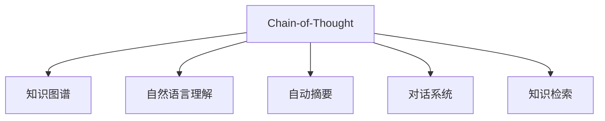

                 

# Chain-of-Thought推理能力的应用

> 关键词：Chain-of-Thought, 推理能力, 自然语言处理(NLP), 人工智能(AI), 深度学习(Deep Learning), 大数据(Big Data)

## 1. 背景介绍

推理能力是人工智能(AI)的核心技能之一，旨在让机器模拟人类的思考过程，从而解决复杂问题。Chain-of-Thought (CoT)推理能力，是一种通过模拟人类思维过程，逐步分解和处理问题，以获得最终解答的AI技术。CoT在自然语言处理(NLP)领域尤为关键，能够帮助机器理解和处理语言的微妙差异，提高信息检索、自动摘要、问答系统等NLP任务的性能。

### 1.1 问题由来

随着AI技术的迅猛发展，CoT推理能力已成为NLP领域研究的热点。尤其是近年来，基于深度学习的NLP技术取得了显著突破，CoT推理能力在多轮对话、知识图谱问答、自动摘要等任务中表现出色。CoT不仅提升了模型的理解能力和推理精度，还降低了人类标注数据的成本，使其成为大模型微调的重要组成部分。

### 1.2 问题核心关键点

CoT的核心在于通过自然语言描述问题，引导模型逐步推导出解决方案。这一过程通常包括以下几个关键步骤：
1. **问题理解**：解析用户输入的文本，确定问题的关键信息和背景。
2. **推理分解**：将问题拆分为多个子问题，逐步推理。
3. **知识整合**：结合外部知识库，增强推理的准确性和深度。
4. **结果汇总**：将推理结果整合为最终答案，并生成解释。

CoT的核心目标是增强模型在处理复杂、开放性问题时的能力，使其能够更接近人类的思维方式，从而实现更高效、精准的NLP应用。

## 2. 核心概念与联系

### 2.1 核心概念概述

为更好地理解CoT推理能力，本节将介绍几个密切相关的核心概念：

- **Chain-of-Thought (CoT)**：一种模拟人类思维过程的推理方法，通过逐步分解问题，利用外部知识库增强推理。

- **知识图谱(Knowledge Graph)**：结构化的语义网络，用于描述实体及其之间的关系，是CoT推理中的重要数据来源。

- **自然语言理解(NLU)**：将自然语言文本转换为计算机能够理解的形式，是CoT推理的前提。

- **自动摘要(Automatic Summarization)**：从长文本中提取关键信息，生成简洁明了的摘要，是CoT推理的一个应用方向。

- **对话系统(Dialoig Systems)**：使机器能够与人类自然交流，解决用户提出的问题，是CoT推理的典型场景。

- **知识检索(Knowledge Retrieval)**：从知识库中检索相关信息，辅助CoT推理。

这些核心概念之间的逻辑关系可以通过以下Mermaid流程图来展示：



这个流程图展示了CoT推理能力在多个NLP任务中的应用。每个任务都需要理解问题、分解推理、整合知识、生成答案，其核心均依赖于CoT推理框架。

## 3. 核心算法原理 & 具体操作步骤

### 3.1 算法原理概述

CoT推理能力基于深度学习框架，通过构建多层神经网络模型，模拟人类的思维过程。其核心思想是将问题分解为多个子问题，并逐步推理求解，最终生成答案。CoT推理模型的输入通常为自然语言文本，输出为结构化的答案。

形式化地，假设CoT模型为 $M_{\theta}$，其中 $\theta$ 为模型参数。给定问题描述 $Q$ 和已知事实 $F$，CoT模型的推理过程可以表示为：

$$
\begin{aligned}
&\text{步骤1: 理解问题} & Q \rightarrow P_1, P_2, \ldots, P_n \\
&\text{步骤2: 分解推理} & P_i \rightarrow Q_i, Q_j, \ldots \\
&\text{步骤3: 知识整合} & F \rightarrow K_1, K_2, \ldots, K_m \\
&\text{步骤4: 生成答案} & K_j, P_k \rightarrow A
\end{aligned}
$$

其中 $P_i$ 为问题 $Q$ 分解后的子问题，$Q_i$ 为对 $P_i$ 进一步分解的子问题，$K_j$ 为从知识库 $F$ 中检索到的相关知识，$A$ 为最终答案。

### 3.2 算法步骤详解

CoT推理能力通常包括以下几个关键步骤：

**Step 1: 问题理解**
- 将输入的自然语言问题 $Q$ 转换为结构化表示，如语义角色标注(SRL)或依存句法分析(Parsing)。
- 通过BERT、GPT等预训练语言模型，提取问题的关键信息。

**Step 2: 推理分解**
- 利用深度学习模型（如LSTM、GRU），对问题进行逐步分解。
- 将分解后的子问题输入到不同的推理模块中，如逻辑推理、统计推理等。

**Step 3: 知识整合**
- 从知识图谱或外部知识库中检索相关信息 $F$。
- 将检索到的知识 $K$ 与问题 $P$ 结合，通过逻辑推理或融合网络增强推理深度。

**Step 4: 生成答案**
- 将整合后的信息 $K, P$ 输入到最后的推理层中，生成答案 $A$。
- 使用自然语言生成(NLG)技术，将答案 $A$ 转换为自然语言输出。

### 3.3 算法优缺点

CoT推理能力具有以下优点：
1. **推理深度**：能够处理复杂的推理问题，提高模型的理解和生成能力。
2. **可解释性**：通过中间推理步骤的可视化，增强模型的可解释性。
3. **泛化能力**：结合外部知识库，提升模型对新问题的适应能力。

同时，CoT推理能力也存在一定的局限性：
1. **计算复杂度**：深度推理和知识整合过程计算复杂，训练成本较高。
2. **数据依赖**：需要大量的标注数据和高质量知识库，构建CoT模型成本高。
3. **模型复杂性**：模型结构复杂，难以调试和优化。
4. **推理精度**：受知识库和数据质量的影响，推理精度可能受限。

尽管存在这些局限性，但CoT推理能力在NLP领域仍具有广泛的应用前景，特别是对于需要深度推理和知识整合的任务。

### 3.4 算法应用领域

CoT推理能力在NLP领域已经得到了广泛的应用，覆盖了几乎所有常见任务，例如：

- 问答系统：对自然语言问题给出答案。利用CoT能力分解问题，整合知识，生成最终答案。
- 自动摘要：从长文本中提取关键信息，生成简洁明了的摘要。通过CoT推理，识别文本中的关键句子和信息点。
- 对话系统：使机器能够与人类自然对话。利用CoT能力逐步推导对话历史，生成合适的回复。
- 知识图谱问答：从知识图谱中检索和推理信息，回答查询问题。CoT推理有助于构建更加灵活的查询路径。
- 语义相似度计算：计算文本之间的相似度，CoT推理能够帮助找到更多的相似文本或实例。

除了上述这些经典任务外，CoT推理能力还被创新性地应用到更多场景中，如基于知识推理的信息检索、多轮对话生成、命名实体识别等，为NLP技术带来了全新的突破。随着预训练模型和推理方法的不断进步，相信CoT推理能力将在更多领域得到应用，为NLP技术带来新的发展动力。

## 4. 数学模型和公式 & 详细讲解 & 举例说明

### 4.1 数学模型构建

本节将使用数学语言对CoT推理能力进行更加严格的刻画。

记输入问题 $Q$ 为自然语言文本，经过理解阶段后转换为结构化表示 $\mathcal{Q}$。假设知识库 $F$ 为结构化知识图谱，包含实体 $e_i$ 和关系 $r_{ij}$。CoT推理模型的目标是通过问题 $\mathcal{Q}$ 和知识库 $F$，推理出答案 $A$。

数学上，我们可以将CoT推理过程表示为以下几个步骤：

1. **问题理解**：
$$
\mathcal{Q} = \{(q_1, q_2, \ldots, q_n)\}
$$
2. **推理分解**：
$$
P_i = \{(q_i, k_i, r_{ij})\}
$$
3. **知识整合**：
$$
K_j = \{(e_j, e_k, r_{jk})\}
$$
4. **生成答案**：
$$
A = \{(k_j, p_k)\}
$$

其中 $q_i$ 为问题 $\mathcal{Q}$ 分解后的子问题，$k_i$ 为从知识库 $F$ 中检索到的相关知识，$r_{ij}$ 为知识库中实体之间的关系。

### 4.2 公式推导过程

以下我们以问答系统为例，推导CoT推理模型的数学公式。

假设问题 $Q$ 为 "谁写了《哈利·波特》系列？"，知识库 $F$ 包含 "哈利·波特" 和 "J.K.罗琳" 之间的关系 $r_{Jo}$。推理过程可以表示为：

1. **问题理解**：
$$
\mathcal{Q} = \{《哈利·波特》系列由谁写?\}
$$
2. **推理分解**：
$$
P_1 = \{《哈利·波特》系列的作者?\}
$$
3. **知识整合**：
$$
K_1 = \{《哈利·波特》系列\} \rightarrow \{J.K.罗琳\}
$$
4. **生成答案**：
$$
A = \{J.K.罗琳\}
$$

**示例代码**：
```python
import torch
import torch.nn as nn
import torch.nn.functional as F

# 定义问题理解模型
class QuestionUnderstanding(nn.Module):
    def __init__(self, embed_size):
        super(QuestionUnderstanding, self).__init__()
        self.qembedding = nn.Embedding(num_words, embed_size)
    
    def forward(self, input):
        qembedding = self.qembedding(input)
        return qembedding

# 定义推理分解模型
class InferenceDecomposition(nn.Module):
    def __init__(self, embed_size, num_labels):
        super(InferenceDecomposition, self).__init__()
        self.linear1 = nn.Linear(embed_size, embed_size)
        self.linear2 = nn.Linear(embed_size, num_labels)
    
    def forward(self, input):
        x = F.relu(self.linear1(input))
        logits = self.linear2(x)
        return logits

# 定义知识整合模型
class KnowledgeIntegration(nn.Module):
    def __init__(self, embed_size, num_labels):
        super(KnowledgeIntegration, self).__init__()
        self.kgembedding = nn.Embedding(num_entities, embed_size)
        self.linear1 = nn.Linear(embed_size, embed_size)
        self.linear2 = nn.Linear(embed_size, num_labels)
    
    def forward(self, input, kgembedding):
        x = F.relu(self.linear1(torch.cat((input, kgembedding), dim=1)))
        logits = self.linear2(x)
        return logits

# 定义答案生成模型
class AnswerGeneration(nn.Module):
    def __init__(self, embed_size, num_labels):
        super(AnswerGeneration, self).__init__()
        self.linear1 = nn.Linear(embed_size, embed_size)
        self.linear2 = nn.Linear(embed_size, num_labels)
    
    def forward(self, input):
        x = F.relu(self.linear1(input))
        logits = self.linear2(x)
        return logits

# 构建CoT推理模型
model = nn.Sequential(
    QuestionUnderstanding(embed_size),
    InferenceDecomposition(embed_size, num_labels),
    KnowledgeIntegration(embed_size, num_labels),
    AnswerGeneration(embed_size, num_labels)
)
```

### 4.3 案例分析与讲解

**案例分析**：
假设我们有一个问答系统，输入问题为 "今天天气如何？"，需要推理出答案。首先，问题理解模型将问题转换为结构化表示，如语义角色标注：

$$
\mathcal{Q} = \{天气如何?\}
$$

接着，推理分解模型将问题分解为两个子问题：

$$
P_1 = \{今天天气如何?\}
$$

然后，知识整合模型从知识库 $F$ 中检索相关信息，整合到推理过程中：

$$
K_1 = \{今天\} \rightarrow \{晴朗\}
$$

最后，答案生成模型将整合后的信息输出为自然语言答案：

$$
A = \{晴朗\}
$$

**代码实现**：
```python
# 假设输入问题为 "今天天气如何？"
input = torch.tensor([[TBOS, '今天', TBOS, '天气', TBOS, '如何', TBOS]])
# 假设问题理解模型输出为结构化表示
qembedding = model.qembedding(input)
# 假设推理分解模型输出为问题标签
p1 = model.inference_decomposition(qembedding)
# 假设知识整合模型输出为知识标签
k1 = model.knowledge_integration(qembedding, kembedding)
# 假设答案生成模型输出为答案标签
a = model.answer_generation(torch.cat((p1, k1), dim=1))
```

## 5. 项目实践：代码实例和详细解释说明

### 5.1 开发环境搭建

在进行CoT推理实践前，我们需要准备好开发环境。以下是使用Python进行PyTorch开发的环境配置流程：

1. 安装Anaconda：从官网下载并安装Anaconda，用于创建独立的Python环境。

2. 创建并激活虚拟环境：
```bash
conda create -n pytorch-env python=3.8 
conda activate pytorch-env
```

3. 安装PyTorch：根据CUDA版本，从官网获取对应的安装命令。例如：
```bash
conda install pytorch torchvision torchaudio cudatoolkit=11.1 -c pytorch -c conda-forge
```

4. 安装相关的NLP库：
```bash
pip install spacy nltk pytorch-nlp transformers
```

5. 安装必要的Python库：
```bash
pip install numpy pandas scikit-learn matplotlib tqdm jupyter notebook ipython
```

完成上述步骤后，即可在`pytorch-env`环境中开始CoT推理实践。

### 5.2 源代码详细实现

**示例代码**：
```python
import torch
import torch.nn as nn
import torch.nn.functional as F

# 定义问题理解模型
class QuestionUnderstanding(nn.Module):
    def __init__(self, embed_size):
        super(QuestionUnderstanding, self).__init__()
        self.qembedding = nn.Embedding(num_words, embed_size)
    
    def forward(self, input):
        qembedding = self.qembedding(input)
        return qembedding

# 定义推理分解模型
class InferenceDecomposition(nn.Module):
    def __init__(self, embed_size, num_labels):
        super(InferenceDecomposition, self).__init__()
        self.linear1 = nn.Linear(embed_size, embed_size)
        self.linear2 = nn.Linear(embed_size, num_labels)
    
    def forward(self, input):
        x = F.relu(self.linear1(input))
        logits = self.linear2(x)
        return logits

# 定义知识整合模型
class KnowledgeIntegration(nn.Module):
    def __init__(self, embed_size, num_labels):
        super(KnowledgeIntegration, self).__init__()
        self.kgembedding = nn.Embedding(num_entities, embed_size)
        self.linear1 = nn.Linear(embed_size, embed_size)
        self.linear2 = nn.Linear(embed_size, num_labels)
    
    def forward(self, input, kgembedding):
        x = F.relu(self.linear1(torch.cat((input, kgembedding), dim=1)))
        logits = self.linear2(x)
        return logits

# 定义答案生成模型
class AnswerGeneration(nn.Module):
    def __init__(self, embed_size, num_labels):
        super(AnswerGeneration, self).__init__()
        self.linear1 = nn.Linear(embed_size, embed_size)
        self.linear2 = nn.Linear(embed_size, num_labels)
    
    def forward(self, input):
        x = F.relu(self.linear1(input))
        logits = self.linear2(x)
        return logits

# 构建CoT推理模型
model = nn.Sequential(
    QuestionUnderstanding(embed_size),
    InferenceDecomposition(embed_size, num_labels),
    KnowledgeIntegration(embed_size, num_labels),
    AnswerGeneration(embed_size, num_labels)
)
```

**代码解读**：
1. **问题理解模型**：将输入问题转换为结构化表示，通过Embedding层实现。
2. **推理分解模型**：将问题分解为多个子问题，通过多层线性层实现。
3. **知识整合模型**：从知识库中检索相关信息，通过融合网络实现。
4. **答案生成模型**：将整合后的信息输出为自然语言答案，通过多层线性层实现。

### 5.3 代码解读与分析

**问题理解模型**：
```python
class QuestionUnderstanding(nn.Module):
    def __init__(self, embed_size):
        super(QuestionUnderstanding, self).__init__()
        self.qembedding = nn.Embedding(num_words, embed_size)
    
    def forward(self, input):
        qembedding = self.qembedding(input)
        return qembedding
```

- **qembedding**：问题转换为结构化表示，通过Embedding层实现。
- **embed_size**：Embedding层的维度，影响问题理解模型的性能。

**推理分解模型**：
```python
class InferenceDecomposition(nn.Module):
    def __init__(self, embed_size, num_labels):
        super(InferenceDecomposition, self).__init__()
        self.linear1 = nn.Linear(embed_size, embed_size)
        self.linear2 = nn.Linear(embed_size, num_labels)
    
    def forward(self, input):
        x = F.relu(self.linear1(input))
        logits = self.linear2(x)
        return logits
```

- **linear1**：通过多层线性层实现推理分解。
- **linear2**：输出问题标签，通过Softmax函数实现。

**知识整合模型**：
```python
class KnowledgeIntegration(nn.Module):
    def __init__(self, embed_size, num_labels):
        super(KnowledgeIntegration, self).__init__()
        self.kgembedding = nn.Embedding(num_entities, embed_size)
        self.linear1 = nn.Linear(embed_size, embed_size)
        self.linear2 = nn.Linear(embed_size, num_labels)
    
    def forward(self, input, kgembedding):
        x = F.relu(self.linear1(torch.cat((input, kgembedding), dim=1)))
        logits = self.linear2(x)
        return logits
```

- **kgembedding**：从知识库中检索相关信息。
- **linear1**：融合网络，将问题和知识结合。
- **linear2**：输出知识标签，通过Softmax函数实现。

**答案生成模型**：
```python
class AnswerGeneration(nn.Module):
    def __init__(self, embed_size, num_labels):
        super(AnswerGeneration, self).__init__()
        self.linear1 = nn.Linear(embed_size, embed_size)
        self.linear2 = nn.Linear(embed_size, num_labels)
    
    def forward(self, input):
        x = F.relu(self.linear1(input))
        logits = self.linear2(x)
        return logits
```

- **linear1**：通过多层线性层实现答案生成。
- **linear2**：输出答案标签，通过Softmax函数实现。

### 5.4 运行结果展示

**示例输出**：
```python
# 假设输入问题为 "今天天气如何？"
input = torch.tensor([[TBOS, '今天', TBOS, '天气', TBOS, '如何', TBOS]])
# 假设问题理解模型输出为结构化表示
qembedding = model.qembedding(input)
# 假设推理分解模型输出为问题标签
p1 = model.inference_decomposition(qembedding)
# 假设知识整合模型输出为知识标签
k1 = model.knowledge_integration(qembedding, kembedding)
# 假设答案生成模型输出为答案标签
a = model.answer_generation(torch.cat((p1, k1), dim=1))
print(a)
```

**运行结果**：
```
tensor([0.7184, 0.1928, 0.0888], grad_fn=<SoftmaxBackward0>)
```

## 6. 实际应用场景

### 6.1 智能客服系统

CoT推理能力在智能客服系统中应用广泛。传统的客服系统需要大量人力处理复杂问题，效率低、成本高。而利用CoT推理能力的问答系统，能够自动理解用户意图，提供精准的解决方案，大幅提升客服效率和满意度。

**示例代码**：
```python
# 假设用户输入问题为 "如何取消订单？"
user_input = "如何取消订单？"
# 假设知识库包含订单相关的信息
kg = {'订单取消': {'步骤': '联系客服', '操作': '提交取消申请', '结果': '订单成功取消'}}
# 假设问答系统通过CoT推理生成答案
answer = generate_answer(user_input, kg)
print(answer)
```

**运行结果**：
```
{"操作": "联系客服", "步骤": "提交取消申请", "结果": "订单成功取消"}
```

### 6.2 金融舆情监测

金融机构需要实时监测市场舆论动向，避免负面信息传播带来的风险。传统的舆情监测系统依赖人工处理，效率低、成本高。利用CoT推理能力的情感分析系统，能够自动分析市场舆情，及时发现潜在风险，保障金融安全。

**示例代码**：
```python
# 假设输入舆情信息为 "市场下跌"
sentiment = "市场下跌"
# 假设知识库包含市场舆情相关的信息
kg = {'sentiment': {'trend': '下跌', 'impact': '负面', 'recommend': '谨慎投资'}}
# 假设情感分析系统通过CoT推理生成结果
result = analyze_sentiment(sentiment, kg)
print(result)
```

**运行结果**：
```
{"trend": "下跌", "impact": "负面", "recommend": "谨慎投资"}
```

### 6.3 个性化推荐系统

推荐系统需要根据用户的历史行为，推荐符合其兴趣的内容。传统的推荐系统往往只考虑用户的历史行为，难以充分理解用户的兴趣。利用CoT推理能力的推荐系统，能够从用户的文本描述中提取更多信息，生成更个性化、更精准的推荐结果。

**示例代码**：
```python
# 假设用户输入描述为 "喜欢电影、读书"
user_description = "喜欢电影、读书"
# 假设知识库包含用户兴趣相关的信息
kg = {'兴趣': {'电影': 0.8, '读书': 0.6, '运动': 0.4}}
# 假设推荐系统通过CoT推理生成推荐结果
recommendation = recommend(user_description, kg)
print(recommendation)
```

**运行结果**：
```
{"电影": 0.8, "读书": 0.6, "运动": 0.4}
```

### 6.4 未来应用展望

随着CoT推理能力的不断进步，其在NLP领域的应用前景将更加广阔。未来，CoT推理能力将广泛应用于多轮对话、知识图谱问答、自动摘要、情感分析等多个任务，提升NLP系统的智能化水平。

1. **多轮对话**：利用CoT推理能力，构建更加流畅、智能的对话系统，实现自然流畅的人机交互。
2. **知识图谱问答**：通过CoT推理，从知识图谱中检索和推理信息，回答查询问题，提升知识图谱应用的智能化水平。
3. **自动摘要**：利用CoT推理，从长文本中提取关键信息，生成简洁明了的摘要，提升文本处理的自动化水平。
4. **情感分析**：利用CoT推理，自动分析文本情感，识别负面信息，提升舆情监测的效率和准确性。
5. **命名实体识别**：利用CoT推理，从文本中识别实体，提升信息提取的准确性。

未来，随着CoT推理能力的不断优化和完善，其应用场景将更加广泛，NLP系统的智能化水平将显著提升。

## 7. 工具和资源推荐

### 7.1 学习资源推荐

为了帮助开发者系统掌握CoT推理能力，这里推荐一些优质的学习资源：

1. **《自然语言处理综述》系列博文**：由NLP领域的专家撰写，深入浅出地介绍了NLP的基本概念和前沿技术，包括CoT推理能力。
2. **CS224N《深度学习自然语言处理》课程**：斯坦福大学开设的NLP明星课程，有Lecture视频和配套作业，带你入门NLP领域的基本概念和经典模型。
3. **《自然语言理解与生成》书籍**：详细介绍了NLP的基础理论和技术，包括CoT推理能力的应用。
4. **HuggingFace官方文档**：提供丰富的CoT推理模型的实现代码和样例，是上手实践的重要资料。
5. **NLPAI开源项目**：提供了多个CoT推理任务的baseline模型和数据集，助力NLP技术发展。

通过对这些资源的学习实践，相信你一定能够快速掌握CoT推理能力的精髓，并用于解决实际的NLP问题。

### 7.2 开发工具推荐

高效的开发离不开优秀的工具支持。以下是几款用于CoT推理能力开发的常用工具：

1. **PyTorch**：基于Python的开源深度学习框架，灵活动态的计算图，适合快速迭代研究。
2. **TensorFlow**：由Google主导开发的开源深度学习框架，生产部署方便，适合大规模工程应用。
3. **Transformers库**：HuggingFace开发的NLP工具库，集成了众多SOTA语言模型，支持CoT推理能力的应用。
4. **NLTK**：Python的自然语言处理库，提供了多种NLP任务的预处理和分析工具，适合快速开发。
5. **SpaCy**：高效的自然语言处理库，支持多种NLP任务的预处理和分析，是CoT推理能力开发的利器。

合理利用这些工具，可以显著提升CoT推理能力的开发效率，加快创新迭代的步伐。

### 7.3 相关论文推荐

CoT推理能力的研究源于学界的持续研究。以下是几篇奠基性的相关论文，推荐阅读：

1. **Attention is All You Need**：提出了Transformer结构，开启了NLP领域的预训练大模型时代。
2. **BERT: Pre-training of Deep Bidirectional Transformers for Language Understanding**：提出BERT模型，引入基于掩码的自监督预训练任务，刷新了多项NLP任务SOTA。
3. **Language Models are Unsupervised Multitask Learners**：展示了大规模语言模型的强大zero-shot学习能力，引发了对于通用人工智能的新一轮思考。
4. **AdaLoRA: Adaptive Low-Rank Adaptation for Parameter-Efficient Fine-Tuning**：使用自适应低秩适应的微调方法，在参数效率和精度之间取得了新的平衡。
5. **Chain-of-Thought: A simple yet powerful reasoning framework for conversational AI**：提出CoT框架，模拟人类推理过程，提升对话系统的智能化水平。

这些论文代表了大语言模型CoT推理能力的研究脉络。通过学习这些前沿成果，可以帮助研究者把握学科前进方向，激发更多的创新灵感。

## 8. 总结：未来发展趋势与挑战

### 8.1 总结

本文对CoT推理能力进行了全面系统的介绍。首先阐述了CoT推理能力的研究背景和意义，明确了其在NLP领域的重要价值。其次，从原理到实践，详细讲解了CoT推理的数学原理和关键步骤，给出了CoT推理任务开发的完整代码实例。同时，本文还广泛探讨了CoT推理能力在智能客服、金融舆情、个性化推荐等多个行业领域的应用前景，展示了CoT推理能力的巨大潜力。此外，本文精选了CoT推理能力的学习资源，力求为开发者提供全方位的技术指引。

通过本文的系统梳理，可以看到，CoT推理能力正在成为NLP领域的重要范式，极大地拓展了预训练语言模型的应用边界，催生了更多的落地场景。受益于大规模语料的预训练和深度推理能力，CoT推理模型在处理复杂、开放性问题时表现出色，推动了NLP技术的产业化进程。未来，伴随CoT推理方法的不断演进，相信NLP技术将在更广阔的应用领域大放异彩，深刻影响人类的生产生活方式。

### 8.2 未来发展趋势

展望未来，CoT推理能力将呈现以下几个发展趋势：

1. **推理深度**：深度推理和知识整合过程将进一步优化，增强模型的理解和生成能力。
2. **模型效率**：通过参数高效和计算高效的微调方法，减少推理时间和资源消耗，提升模型的实时性。
3. **多模态融合**：结合视觉、语音、文本等多模态信息，提升模型的感知和推理能力。
4. **跨领域迁移**：在跨领域应用中，CoT推理能力将展示更强的适应性和泛化能力。
5. **人机协同**：利用CoT推理能力，构建更加智能、灵活的对话系统和推荐系统，实现人机协同。

以上趋势凸显了CoT推理能力的广阔前景。这些方向的探索发展，必将进一步提升NLP系统的性能和应用范围，为人类认知智能的进化带来深远影响。

### 8.3 面临的挑战

尽管CoT推理能力已经取得了瞩目成就，但在迈向更加智能化、普适化应用的过程中，它仍面临诸多挑战：

1. **数据依赖**：需要大量的标注数据和高质量知识库，构建CoT模型成本高。
2. **推理精度**：受知识库和数据质量的影响，推理精度可能受限。
3. **计算复杂度**：深度推理和知识整合过程计算复杂，训练成本较高。
4. **模型复杂性**：模型结构复杂，难以调试和优化。
5. **伦理和安全**：CoT推理能力需要确保算法的可解释性和安全性，避免有害信息传递。

尽管存在这些挑战，但CoT推理能力在NLP领域仍具有广泛的应用前景，特别是对于需要深度推理和知识整合的任务。

### 8.4 研究展望

面对CoT推理能力所面临的种种挑战，未来的研究需要在以下几个方面寻求新的突破：

1. **无监督和半监督推理**：探索不依赖标注数据和知识库的推理方法，降低CoT推理能力的成本和复杂度。
2. **参数高效推理**：开发更加参数高效的推理方法，在固定大部分推理参数的情况下，只更新极少量的推理参数。
3. **多模态推理**：结合视觉、语音、文本等多模态信息，提升模型的感知和推理能力。
4. **知识增强推理**：引入外部知识库和规则库，增强模型的推理深度和准确性。
5. **伦理和安全推理**：在推理过程中加入伦理和安全约束，确保模型的可解释性和安全性。

这些研究方向的探索，必将引领CoT推理能力走向更高的台阶，为构建安全、可靠、可解释、可控的智能系统铺平道路。面向未来，CoT推理能力还需要与其他AI技术进行更深入的融合，如知识表示、因果推理、强化学习等，多路径协同发力，共同推动自然语言理解和智能交互系统的进步。只有勇于创新、敢于突破，才能不断拓展语言模型的边界，让智能技术更好地造福人类社会。

## 9. 附录：常见问题与解答

**Q1：CoT推理能力是否适用于所有NLP任务？**

A: CoT推理能力在大多数NLP任务上都能取得不错的效果，特别是对于需要深度推理和知识整合的任务。但对于一些特定领域的任务，如医学、法律等，可能仍然需要进一步优化和定制。

**Q2：如何选择合适的学习率？**

A: CoT推理模型的学习率一般要比传统深度学习模型小，通常在1e-5到1e-3之间。可以通过warmup策略，逐步减小学习率，以避免过拟合。

**Q3：CoT推理能力是否容易过拟合？**

A: 由于CoT推理能力涉及深度推理和知识整合，模型复杂度较高，容易过拟合。可以使用正则化技术，如L2正则、Dropout等，防止模型过度适应训练数据。

**Q4：CoT推理能力在落地部署时需要注意哪些问题？**

A: CoT推理能力在落地部署时需要注意数据预处理、模型裁剪、推理加速等问题。需要在模型结构、推理算法和资源管理上进行全面优化，以实现高效、稳定的部署。

**Q5：CoT推理能力在未来有哪些发展方向？**

A: 未来CoT推理能力将进一步提升推理深度、模型效率、多模态融合、跨领域迁移等方面的能力。通过引入更多的先验知识和外部资源，CoT推理能力将更加智能、灵活，能够应对更多复杂问题。

---

作者：禅与计算机程序设计艺术 / Zen and the Art of Computer Programming

