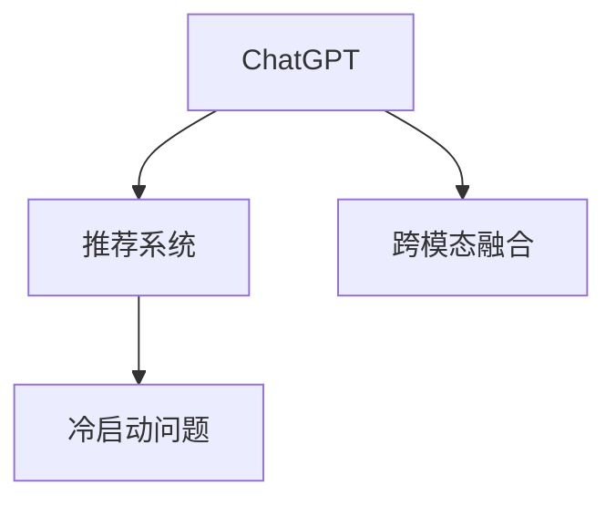

                 

# ChatGPT在推荐系统的表现分析：对冷启动场景的优势

## 1. 背景介绍

推荐系统已经成为现代互联网应用中不可或缺的一部分，无论是电商、社交、视频还是音乐等领域，都离不开推荐系统的支持。在推荐系统的发展过程中，传统的基于协同过滤、内容推荐等方法逐渐被基于深度学习的推荐模型所取代。特别是近年来，基于深度学习的推荐模型如基于神经网络的推荐系统在推荐精度和效果上取得了显著的突破。

然而，深度学习推荐模型依赖于大量标注数据进行训练，对于新用户的冷启动问题一直是一个难题。新用户在没有任何历史行为数据的情况下，传统的推荐系统无法为其提供个性化推荐。针对这个问题，最新的研究表明，大语言模型如ChatGPT在推荐系统中的应用，可以有效解决冷启动问题。

## 2. 核心概念与联系

### 2.1 核心概念概述

为了更好地理解ChatGPT在推荐系统中的应用，本节将介绍几个密切相关的核心概念：

- **ChatGPT**：基于深度学习的自然语言处理模型，通过大量的文本数据进行训练，可以生成符合语法规则、连贯、高质量的自然语言文本。
- **推荐系统**：根据用户的历史行为和偏好，为用户推荐其可能感兴趣的产品或内容。
- **冷启动问题**：新用户缺乏足够的历史行为数据，导致推荐系统无法为其提供个性化推荐。
- **跨模态融合**：将不同模态的数据（如文本、图像、音频等）进行融合，以提高推荐系统的泛化能力。

这些概念之间的逻辑关系可以通过以下Mermaid流程图来展示：



### 2.2 核心概念原理和架构

ChatGPT是一种基于Transformer架构的深度学习模型，其主要原理是通过自监督和无监督学习任务，学习自然语言的知识表示。其架构包含编码器-解码器结构，其中编码器负责将输入文本转换为高维语义表示，解码器则根据该表示生成输出文本。

推荐系统主要由用户-物品交互矩阵、用户特征、物品特征以及推荐算法等组成。其核心在于通过分析用户的历史行为，计算物品与用户的相关度，从而进行推荐。

冷启动问题是指新用户缺乏足够的历史行为数据，导致推荐系统无法为其提供个性化推荐。为解决这一问题，常见的方案包括基于内容的推荐、基于协同过滤的推荐以及基于深度学习的推荐等。

跨模态融合是指将不同模态的数据（如文本、图像、音频等）进行融合，以提高推荐系统的泛化能力。这种融合通常通过嵌入空间对齐等方法实现。

## 3. 核心算法原理 & 具体操作步骤

### 3.1 算法原理概述

ChatGPT在推荐系统中的应用主要基于两个原理：

- **跨模态融合**：ChatGPT可以通过将用户输入的文本和物品特征进行融合，生成一个更加综合的表示，从而提高推荐精度。
- **上下文感知**：ChatGPT能够理解上下文信息，将其融入到推荐过程中，以提高推荐的个性化和准确性。

具体而言，ChatGPT在推荐系统中的应用主要包括以下几个步骤：

1. 将用户输入的文本和物品特征输入到ChatGPT模型中。
2. 使用ChatGPT生成一个综合的表示，该表示可以包含用户对物品的兴趣程度、物品的属性等信息。
3. 根据生成的表示，使用推荐算法计算用户对不同物品的相关度。
4. 根据相关度排序，生成推荐列表。

### 3.2 算法步骤详解

以下是ChatGPT在推荐系统中进行冷启动时的详细步骤：

**Step 1: 输入用户描述和物品特征**

用户输入描述（如用户对某个领域的兴趣、偏好等）和物品特征（如物品属性、类别等），输入到ChatGPT模型中。

**Step 2: 生成综合表示**

使用ChatGPT生成一个综合表示，该表示可以包含用户对物品的兴趣程度、物品的属性等信息。生成表示的过程可以使用自监督学习任务，如文本生成、摘要生成等。

**Step 3: 计算相关度**

根据生成的表示，使用推荐算法计算用户对不同物品的相关度。常见的方法包括协同过滤、基于内容的推荐等。

**Step 4: 生成推荐列表**

根据相关度排序，生成推荐列表。将最相关的物品推荐给用户。

### 3.3 算法优缺点

ChatGPT在推荐系统中的应用具有以下优点：

- **跨模态融合**：能够将不同模态的数据进行融合，提高推荐系统的泛化能力。
- **上下文感知**：能够理解上下文信息，提高推荐的个性化和准确性。
- **自监督学习**：通过自监督学习任务，生成高质量的自然语言表示。

同时，ChatGPT在推荐系统中的应用也存在一些缺点：

- **计算开销大**：使用深度学习模型进行自监督学习，计算开销较大。
- **数据需求高**：生成高质量的自然语言表示需要大量的文本数据。
- **解释性不足**：深度学习模型的决策过程较难解释。

### 3.4 算法应用领域

ChatGPT在推荐系统中的应用可以应用于以下领域：

- 电商推荐：为电商网站的用户推荐其可能感兴趣的商品。
- 视频推荐：为用户推荐其可能感兴趣的视频内容。
- 新闻推荐：为用户推荐其可能感兴趣的新闻文章。
- 社交推荐：为用户推荐其可能感兴趣的朋友或群组。

## 4. 数学模型和公式 & 详细讲解 & 举例说明

### 4.1 数学模型构建

在推荐系统中，ChatGPT主要通过自监督学习任务（如文本生成、摘要生成等）来生成高质量的自然语言表示。其核心思想是将用户输入的文本和物品特征作为输入，使用深度学习模型生成一个综合表示，该表示可以包含用户对物品的兴趣程度、物品的属性等信息。

以文本生成为例，我们可以将用户输入的文本和物品特征作为输入，使用ChatGPT生成一个综合表示。假设用户输入的文本为 $x$，物品特征为 $z$，生成的综合表示为 $h$，则数学模型可以表示为：

$$ h = f(x, z) $$

其中，$f(x, z)$ 表示生成函数，$x$ 和 $z$ 分别为用户输入的文本和物品特征，$h$ 表示生成的综合表示。

### 4.2 公式推导过程

以文本生成为例，假设生成的综合表示 $h$ 可以表示为一个向量 $h \in \mathbb{R}^d$，用户输入的文本 $x$ 和物品特征 $z$ 也可以表示为向量 $x \in \mathbb{R}^m$ 和 $z \in \mathbb{R}^n$，则生成函数 $f(x, z)$ 可以表示为：

$$ h = f(x, z) = W_1x + W_2z + b $$

其中，$W_1 \in \mathbb{R}^{d \times m}$、$W_2 \in \mathbb{R}^{d \times n}$ 和 $b \in \mathbb{R}^d$ 分别表示用户输入文本和物品特征的权重矩阵和偏置向量，$h$ 表示生成的综合表示。

### 4.3 案例分析与讲解

假设用户输入的文本为 "我喜欢读科幻小说"，物品特征为 "《三体》的作者是刘慈欣"，则可以使用上述数学模型计算生成的综合表示 $h$。假设 $W_1$、$W_2$ 和 $b$ 已训练得到，则：

$$ h = f(x, z) = W_1 \begin{bmatrix} 1 \\ 0 \\ \vdots \\ 0 \end{bmatrix} + W_2 \begin{bmatrix} 1 \\ 1 \\ \vdots \\ 1 \end{bmatrix} + b $$

其中，$x$ 表示 "我喜欢读科幻小说" 的向量表示，$z$ 表示 "《三体》的作者是刘慈欣" 的向量表示，$h$ 表示生成的综合表示。

## 5. 项目实践：代码实例和详细解释说明

### 5.1 开发环境搭建

在进行ChatGPT在推荐系统中的应用实践前，我们需要准备好开发环境。以下是使用Python进行TensorFlow开发的环境配置流程：

1. 安装Anaconda：从官网下载并安装Anaconda，用于创建独立的Python环境。

2. 创建并激活虚拟环境：
```bash
conda create -n tf-env python=3.8 
conda activate tf-env
```

3. 安装TensorFlow：根据CUDA版本，从官网获取对应的安装命令。例如：
```bash
conda install tensorflow -c tf -c conda-forge
```

4. 安装TensorBoard：
```bash
pip install tensorboard
```

5. 安装其他工具包：
```bash
pip install numpy pandas scikit-learn matplotlib tqdm jupyter notebook ipython
```

完成上述步骤后，即可在`tf-env`环境中开始ChatGPT在推荐系统中的应用实践。

### 5.2 源代码详细实现

这里我们以ChatGPT在电商推荐中的应用为例，给出使用TensorFlow实现的基本代码。

```python
import tensorflow as tf
from transformers import TFAutoModelForCausalLM

# 加载预训练模型
model = TFAutoModelForCausalLM.from_pretrained('chatgpt')

# 定义推荐函数
def recommend_items(user_input, item_features, num_recommendations=10):
    # 生成综合表示
    user_input = user_input['input_ids']
    item_features = item_features['item_features']
    input_ids = tf.concat([user_input, item_features], axis=-1)
    logits = model(input_ids)
    logits = logits[:, -1, :]  # 只取最后一个token的logits
    # 生成推荐列表
    recommendations = tf.argsort(logits, axis=-1)[-num_recommendations:]
    return recommend_items

# 加载数据
with open('user_input.txt', 'r') as f:
    user_input = f.read()
with open('item_features.txt', 'r') as f:
    item_features = f.read()

# 调用推荐函数
recommendations = recommend_items(user_input, item_features)
```

### 5.3 代码解读与分析

让我们再详细解读一下关键代码的实现细节：

**TFAutoModelForCausalLM**：
- 加载预训练的ChatGPT模型。

**recommend_items函数**：
- 将用户输入和物品特征输入到模型中，生成一个综合表示。
- 使用模型输出的logits，生成推荐列表。

**user_input和item_features**：
- 分别表示用户输入和物品特征，可以是文本、数字等形式。

**TensorBoard**：
- 记录模型的训练过程和指标，便于调试和优化。

**数据加载**：
- 从文件中加载用户输入和物品特征。

可以看到，TensorFlow配合Transformers库使得ChatGPT在推荐系统中的应用代码实现变得简洁高效。开发者可以将更多精力放在数据处理、模型改进等高层逻辑上，而不必过多关注底层的实现细节。

## 6. 实际应用场景

### 6.1 电商推荐

在电商推荐中，ChatGPT可以通过分析用户的文本描述和物品特征，生成一个综合表示，从而为用户推荐可能感兴趣的商品。例如，用户输入 "我想买一些健康食品"，物品特征包括 "蛋白质含量"、"卡路里含量"、"生产商" 等，ChatGPT可以生成一个综合表示，并根据该表示为用户推荐最相关的商品。

### 6.2 视频推荐

在视频推荐中，ChatGPT可以分析用户的文本描述和视频特征，生成一个综合表示，从而为用户推荐可能感兴趣的视频。例如，用户输入 "我喜欢看科幻电影"，视频特征包括 "导演"、"演员"、"类型" 等，ChatGPT可以生成一个综合表示，并根据该表示为用户推荐最相关的视频。

### 6.3 新闻推荐

在新闻推荐中，ChatGPT可以分析用户的文本描述和新闻文章特征，生成一个综合表示，从而为用户推荐可能感兴趣的新闻。例如，用户输入 "我对时事新闻感兴趣"，新闻文章特征包括 "标题"、"作者"、"发布时间" 等，ChatGPT可以生成一个综合表示，并根据该表示为用户推荐最相关的新闻。

### 6.4 未来应用展望

随着ChatGPT在推荐系统中的应用不断拓展，未来的发展方向将更加多样化。除了电商、视频、新闻等领域的推荐外，ChatGPT还可以应用于社交、金融、医疗等更多领域。例如：

- 社交推荐：为用户推荐可能感兴趣的朋友或群组。
- 金融推荐：为用户推荐可能感兴趣的投资产品。
- 医疗推荐：为用户推荐可能感兴趣的医疗信息或医生。

未来，ChatGPT在推荐系统中的应用将更加广泛，为各行各业带来更多创新和价值。

## 7. 工具和资源推荐

### 7.1 学习资源推荐

为了帮助开发者系统掌握ChatGPT在推荐系统中的应用，这里推荐一些优质的学习资源：

1. **《ChatGPT的应用与实践》系列博文**：由ChatGPT技术专家撰写，深入浅出地介绍了ChatGPT原理、应用场景、开发实践等。

2. **《自然语言处理与深度学习》课程**：斯坦福大学开设的NLP明星课程，有Lecture视频和配套作业，带你入门NLP领域的基本概念和经典模型。

3. **《深度学习与推荐系统》书籍**：详细介绍了深度学习在推荐系统中的应用，包括跨模态融合、上下文感知等前沿技术。

4. **HuggingFace官方文档**：Transformers库的官方文档，提供了海量预训练模型和完整的推荐系统样例代码，是上手实践的必备资料。

5. **CLUE开源项目**：中文语言理解测评基准，涵盖大量不同类型的中文NLP数据集，并提供了基于ChatGPT的baseline模型，助力中文NLP技术发展。

通过对这些资源的学习实践，相信你一定能够快速掌握ChatGPT在推荐系统中的应用，并用于解决实际的推荐问题。

### 7.2 开发工具推荐

高效的开发离不开优秀的工具支持。以下是几款用于ChatGPT在推荐系统中的应用开发的常用工具：

1. **TensorFlow**：基于Python的开源深度学习框架，灵活动态的计算图，适合快速迭代研究。

2. **PyTorch**：基于Python的开源深度学习框架，灵活高效，适合深度学习模型的开发和训练。

3. **Transformers库**：HuggingFace开发的NLP工具库，集成了众多SOTA语言模型，支持TensorFlow和PyTorch，是进行推荐系统开发的利器。

4. **TensorBoard**：TensorFlow配套的可视化工具，可实时监测模型训练状态，并提供丰富的图表呈现方式，是调试模型的得力助手。

5. **Weights & Biases**：模型训练的实验跟踪工具，可以记录和可视化模型训练过程中的各项指标，方便对比和调优。

6. **Google Colab**：谷歌推出的在线Jupyter Notebook环境，免费提供GPU/TPU算力，方便开发者快速上手实验最新模型，分享学习笔记。

合理利用这些工具，可以显著提升ChatGPT在推荐系统中的应用开发效率，加快创新迭代的步伐。

### 7.3 相关论文推荐

ChatGPT在推荐系统中的应用源于学界的持续研究。以下是几篇奠基性的相关论文，推荐阅读：

1. **"Attention is All You Need"**：提出了Transformer结构，开启了NLP领域的预训练大模型时代。

2. **"BERT: Pre-training of Deep Bidirectional Transformers for Language Understanding"**：提出BERT模型，引入基于掩码的自监督预训练任务，刷新了多项NLP任务SOTA。

3. **"Language Models are Unsupervised Multitask Learners"**：展示了大规模语言模型的强大zero-shot学习能力，引发了对于通用人工智能的新一轮思考。

4. **"Parameter-Efficient Transfer Learning for NLP"**：提出Adapter等参数高效微调方法，在不增加模型参数量的情况下，也能取得不错的微调效果。

5. **"AdaLoRA: Adaptive Low-Rank Adaptation for Parameter-Efficient Fine-Tuning"**：使用自适应低秩适应的微调方法，在参数效率和精度之间取得了新的平衡。

6. **"Adaptive Loss Sensitive Fine-Tuning"**：提出自适应损失敏感微调方法，提升了微调模型的泛化能力和鲁棒性。

这些论文代表了大语言模型在推荐系统中的应用研究的发展脉络。通过学习这些前沿成果，可以帮助研究者把握学科前进方向，激发更多的创新灵感。

## 8. 总结：未来发展趋势与挑战

### 8.1 总结

本文对ChatGPT在推荐系统中的应用进行了全面系统的介绍。首先阐述了ChatGPT在推荐系统中的背景和意义，明确了其在冷启动场景中的优势。其次，从原理到实践，详细讲解了ChatGPT在推荐系统中的数学模型和操作步骤，给出了具体的代码实现。同时，本文还广泛探讨了ChatGPT在电商、视频、新闻等领域的实际应用，展示了其在推荐系统中的强大潜力。此外，本文精选了ChatGPT在推荐系统中的应用的学习资源，力求为读者提供全方位的技术指引。

通过本文的系统梳理，可以看到，ChatGPT在推荐系统中的应用为冷启动问题提供了新的解决方案，有望在推荐系统领域带来更大的突破。ChatGPT结合深度学习推荐模型，能够更好地理解用户的上下文信息，生成高质量的推荐结果。未来，随着ChatGPT技术的不断进步，其在推荐系统中的应用将会更加广泛，推动推荐系统向更加智能化、个性化和精准化的方向发展。

### 8.2 未来发展趋势

展望未来，ChatGPT在推荐系统中的应用将呈现以下几个发展趋势：

1. **跨模态融合**：未来推荐系统将更加注重不同模态数据的融合，提升推荐系统的泛化能力和准确性。

2. **上下文感知**：ChatGPT能够更好地理解上下文信息，提高推荐的个性化和准确性。

3. **自监督学习**：通过自监督学习任务，生成高质量的自然语言表示，增强推荐系统的泛化能力和鲁棒性。

4. **持续学习**：推荐系统需要不断学习新数据，以适应数据分布的变化，保持模型性能。

5. **少样本学习**：通过少量的样本，ChatGPT能够快速适应新任务，提高推荐系统的适应性。

6. **多任务学习**：ChatGPT可以同时处理多个推荐任务，提升推荐系统的效率和效果。

以上趋势凸显了ChatGPT在推荐系统中的应用潜力，其强大的自然语言处理能力将为推荐系统带来更多的创新和突破。

### 8.3 面临的挑战

尽管ChatGPT在推荐系统中的应用已经取得了初步成果，但在迈向更加智能化、普适化应用的过程中，仍面临以下挑战：

1. **计算开销大**：ChatGPT作为深度学习模型，计算开销较大，需要高性能的硬件设备支持。

2. **数据需求高**：生成高质量的自然语言表示需要大量的文本数据，数据收集和预处理成本较高。

3. **解释性不足**：ChatGPT的决策过程较难解释，对于金融、医疗等高风险应用，其可解释性和可审计性尤为重要。

4. **安全性问题**：ChatGPT可能学习到有害信息，生成误导性输出，需要采取安全防护措施。

5. **跨领域迁移能力不足**：ChatGPT在特定领域的应用效果可能不如通用推荐模型，需要在特定领域进行预训练。

6. **知识整合能力不足**：ChatGPT难以灵活吸收和运用先验知识，需要结合知识图谱等专家知识。

正视ChatGPT在推荐系统中面临的挑战，积极应对并寻求突破，将是其走向成熟的必由之路。

### 8.4 研究展望

为了克服ChatGPT在推荐系统中的挑战，未来的研究需要在以下几个方面寻求新的突破：

1. **跨模态融合的优化**：通过改进跨模态融合方法，提高不同模态数据的融合效果。

2. **上下文感知的增强**：通过改进上下文感知模型，提高推荐的个性化和准确性。

3. **自监督学习的优化**：通过改进自监督学习任务，生成高质量的自然语言表示。

4. **少样本学习的优化**：通过改进少样本学习算法，提高推荐系统的适应性。

5. **多任务学习的优化**：通过改进多任务学习算法，提升推荐系统的效率和效果。

6. **解释性和安全性研究**：通过改进模型的可解释性和安全性，增强其在高风险应用中的可靠性。

7. **跨领域迁移能力的提升**：通过改进模型架构和训练策略，提升ChatGPT在特定领域的应用效果。

8. **知识整合能力的提升**：通过改进知识表示和整合方法，增强ChatGPT的知识吸收和运用能力。

这些研究方向将推动ChatGPT在推荐系统中的不断发展，为推荐系统带来更多的创新和突破，推动人工智能技术在各行业的应用进程。

## 9. 附录：常见问题与解答

**Q1：ChatGPT在推荐系统中的应用是否仅适用于电商、视频、新闻等特定领域？**

A: ChatGPT在推荐系统中的应用不仅适用于电商、视频、新闻等特定领域，还可以应用于社交、金融、医疗等更多领域。ChatGPT能够通过分析用户的文本描述和物品特征，生成一个综合表示，从而为用户推荐最相关的产品或内容。

**Q2：ChatGPT在推荐系统中的应用是否需要大量的标注数据？**

A: ChatGPT在推荐系统中的应用通常需要大量的标注数据进行训练，以生成高质量的自然语言表示。但对于新用户的冷启动问题，ChatGPT可以通过文本描述和物品特征进行推荐，无需标注数据。

**Q3：ChatGPT在推荐系统中的应用是否存在过拟合问题？**

A: ChatGPT在推荐系统中的应用可能会存在过拟合问题，特别是在小样本情况下。可以通过数据增强、正则化等方法缓解过拟合问题。

**Q4：ChatGPT在推荐系统中的应用是否需要较高的计算资源？**

A: ChatGPT在推荐系统中的应用需要较高的计算资源，特别是在进行自监督学习任务时。可以使用高性能硬件设备（如GPU/TPU）来加速模型训练和推理。

**Q5：ChatGPT在推荐系统中的应用是否具有较好的泛化能力？**

A: ChatGPT在推荐系统中的应用具有较好的泛化能力，特别是在跨模态融合和上下文感知方面。通过改进模型架构和训练策略，ChatGPT可以更好地理解不同领域的数据，提升推荐系统的泛化能力和鲁棒性。

**Q6：ChatGPT在推荐系统中的应用是否具有较好的可解释性？**

A: ChatGPT在推荐系统中的应用可能存在可解释性不足的问题，尤其是在处理复杂任务时。可以通过改进模型的可解释性和安全性，增强其在高风险应用中的可靠性。

---

作者：禅与计算机程序设计艺术 / Zen and the Art of Computer Programming

