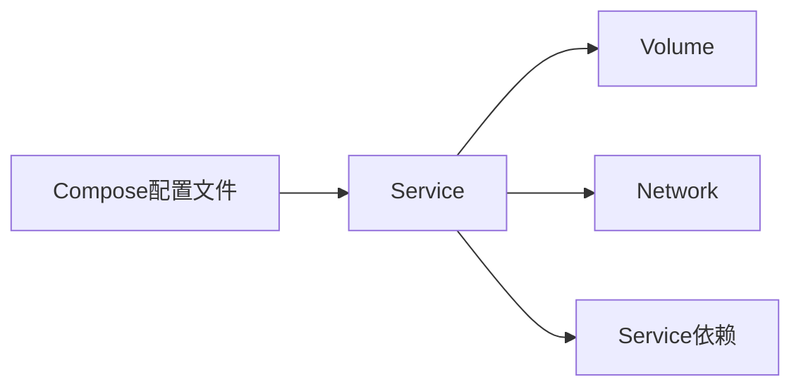

                 

## 1. 背景介绍

在当今的分布式系统环境中，实现高可用、高性能和易于维护的应用架构是每个开发者的首要任务。随着容器化技术的普及和成熟，Docker容器成为现代应用架构的基础设施。然而，在Docker容器化环境中，管理多个服务之间的依赖关系和配置变得复杂。Docker Compose成为一种解决方案，通过一个简单的配置文件，轻松地管理多个容器服务之间的依赖关系。

### 1.1 问题由来

在传统的单体应用架构中，所有组件都在同一台机器上运行，依赖关系明确，部署和维护相对简单。但随着应用规模的扩大，单体应用难以支撑，必须将应用拆分成多个微服务。

微服务架构带来了许多优点，如高可扩展性、高可用性和独立的团队协作，但也带来了新的挑战。例如：

- 微服务之间的依赖关系变得复杂，配置管理变得困难。
- 每个微服务需要独立部署，增加了部署复杂性。
- 服务之间的通信和数据共享变得更加困难。

为了解决这些问题，Docker Compose应运而生，通过一个配置文件，轻松管理多个容器服务的依赖关系和配置。

### 1.2 问题核心关键点

Docker Compose的核心关键点包括：

- **Docker容器化**：将应用服务封装为容器，提供轻量级的运行环境。
- **多服务编排**：通过配置文件管理多个容器服务的启动、停止和依赖关系。
- **服务发现和负载均衡**：自动发现和管理容器服务，并提供负载均衡功能。
- **自动部署和回滚**：支持自动部署和回滚，简化部署流程。

Docker Compose使得微服务架构的部署和维护更加高效和可控。

## 2. 核心概念与联系

### 2.1 核心概念概述

Docker Compose的核心概念包括：

- **Docker容器**：将应用服务打包为容器，提供一致的运行环境。
- **Compose配置文件**：一个YAML文件，定义多个Docker容器服务及其依赖关系。
- **Service**：一个Docker容器服务的定义，包含容器镜像、端口映射、环境变量等配置。
- **Volume**：持久化的存储卷，用于共享数据和持久化存储。
- **Network**：自定义的Docker网络，用于容器服务的通信。

Docker Compose通过一个配置文件，定义多个Docker容器服务的启动、停止和依赖关系，使得容器服务的部署和管理更加简单和高效。

### 2.2 核心概念原理和架构的 Mermaid 流程图



### 2.3 核心概念原理和架构的 Mermaid 流程图解释

- **Compose配置文件**：通过一个YAML文件定义多个Docker容器服务，包括容器镜像、端口映射、环境变量等配置。
- **Service**：定义单个Docker容器服务，包含容器镜像、端口映射、环境变量等配置。
- **Volume**：用于持久化存储，共享数据和持久化存储。
- **Network**：自定义的Docker网络，用于容器服务的通信。

这些概念共同构成了Docker Compose的架构，使得容器服务的部署和管理更加高效和可控。

## 3. 核心算法原理 & 具体操作步骤

### 3.1 算法原理概述

Docker Compose的核心算法原理是通过配置文件定义多个Docker容器服务，并管理这些服务的启动、停止和依赖关系。

- **容器编排**：根据配置文件启动和停止容器服务，管理容器服务的生命周期。
- **依赖关系**：通过配置文件定义容器服务之间的依赖关系，确保服务的正常启动和运行。
- **自动部署**：支持自动部署和回滚，简化部署流程。
- **服务发现**：自动发现和管理容器服务，提供负载均衡功能。

### 3.2 算法步骤详解

Docker Compose的核心操作步骤包括：

1. **编写配置文件**：编写一个包含多个Docker容器服务的配置文件，定义容器镜像、端口映射、环境变量等配置。
2. **启动容器服务**：运行`docker-compose up`命令，启动所有容器服务。
3. **管理容器服务**：通过`docker-compose up`、`docker-compose down`、`docker-compose restart`等命令，管理容器服务的生命周期。
4. **服务发现和负载均衡**：通过配置文件定义自定义的Docker网络，自动发现和管理容器服务，并提供负载均衡功能。
5. **自动部署和回滚**：通过配置文件定义自动部署和回滚策略，简化部署流程。

### 3.3 算法优缺点

Docker Compose具有以下优点：

- **简单易用**：通过一个配置文件，轻松管理多个Docker容器服务，简化部署流程。
- **高效可靠**：自动发现和管理容器服务，提供负载均衡功能，确保高可用性和高性能。
- **灵活可扩展**：支持自定义的Docker网络和服务依赖关系，灵活管理容器服务。

但Docker Compose也存在以下缺点：

- **配置复杂**：需要编写复杂的配置文件，尤其是服务依赖关系和管理规则。
- **容器管理**：需要手动管理Docker容器服务，不能完全自动化。
- **依赖管理**：需要手动管理容器服务之间的依赖关系，容易出错。

### 3.4 算法应用领域

Docker Compose广泛应用于微服务架构和分布式系统环境中，主要应用领域包括：

- **Web应用**：管理Web应用服务之间的依赖关系和配置。
- **数据库服务**：管理数据库服务的启动、停止和配置。
- **消息队列服务**：管理消息队列服务的启动、停止和配置。
- **缓存服务**：管理缓存服务的启动、停止和配置。
- **日志服务**：管理日志服务的启动、停止和配置。

## 4. 数学模型和公式 & 详细讲解 & 举例说明

### 4.1 数学模型构建

Docker Compose的数学模型主要涉及容器的启动、停止和依赖关系管理。

- **容器启动模型**：定义容器服务的启动条件和参数。
- **容器停止模型**：定义容器服务的停止条件和参数。
- **依赖关系模型**：定义容器服务之间的依赖关系，确保服务的正常启动和运行。

### 4.2 公式推导过程

**容器启动模型**：

$$
\begin{cases}
StartCondition = Condition_1, Condition_2, \ldots, Condition_n\\
StartParameters = Parameters_1, Parameters_2, \ldots, Parameters_n
\end{cases}
$$

**容器停止模型**：

$$
\begin{cases}
StopCondition = Condition_1, Condition_2, \ldots, Condition_n\\
StopParameters = Parameters_1, Parameters_2, \ldots, Parameters_n
\end{cases}
$$

**依赖关系模型**：

$$
\begin{cases}
Dependency_1 = Service_1 \rightarrow Service_2\\
Dependency_2 = Service_3 \rightarrow Service_4\\
\vdots
\end{cases}
$$

### 4.3 案例分析与讲解

假设有一个包含Web应用、数据库和消息队列的微服务架构，配置文件如下：

```yaml
version: '3'
services:
  web:
    image: nginx
    ports:
      - "80:80"
    depends_on:
      - db
      - queue
  db:
    image: mysql
    environment:
      MYSQL_ROOT_PASSWORD: password
  queue:
    image: redis
    environment:
      REDIS_PASSWORD: password
```

通过这个配置文件，启动Web应用、数据库和消息队列三个容器服务，并确保它们的依赖关系得到满足。

## 5. 项目实践：代码实例和详细解释说明

### 5.1 开发环境搭建

**环境配置**：

1. **安装Docker**：从官网下载并安装Docker。
2. **安装Docker Compose**：通过`brew`、`apt`、`yum`等命令安装Docker Compose。

**Docker Compose配置文件编写**：

```yaml
version: '3'
services:
  web:
    image: nginx
    ports:
      - "80:80"
    depends_on:
      - db
      - queue
  db:
    image: mysql
    environment:
      MYSQL_ROOT_PASSWORD: password
  queue:
    image: redis
    environment:
      REDIS_PASSWORD: password
```

### 5.2 源代码详细实现

**Docker Compose启动**：

```bash
docker-compose up
```

**Docker Compose停止**：

```bash
docker-compose down
```

**Docker Compose重启**：

```bash
docker-compose restart
```

### 5.3 代码解读与分析

**Compose配置文件解释**：

- `version: '3'`：Docker Compose版本。
- `services`：定义多个Docker容器服务。
- `image`：定义容器服务的镜像。
- `ports`：定义容器的端口映射。
- `depends_on`：定义容器服务之间的依赖关系。
- `environment`：定义环境变量。

**Docker Compose命令解释**：

- `docker-compose up`：启动所有容器服务。
- `docker-compose down`：停止并删除所有容器服务。
- `docker-compose restart`：重启所有容器服务。

## 6. 实际应用场景

### 6.1 微服务架构

Docker Compose广泛应用于微服务架构中，管理多个微服务的启动、停止和依赖关系。

**Web应用服务**：通过Docker Compose，轻松管理Web应用服务的启动、停止和配置。

**数据库服务**：通过Docker Compose，轻松管理数据库服务的启动、停止和配置。

**消息队列服务**：通过Docker Compose，轻松管理消息队列服务的启动、停止和配置。

**缓存服务**：通过Docker Compose，轻松管理缓存服务的启动、停止和配置。

**日志服务**：通过Docker Compose，轻松管理日志服务的启动、停止和配置。

### 6.2 分布式系统环境

Docker Compose广泛应用于分布式系统环境中，管理多个容器服务的启动、停止和依赖关系。

**负载均衡**：通过自定义的Docker网络，自动发现和管理容器服务，提供负载均衡功能。

**高可用性**：自动发现和管理容器服务，确保高可用性和高性能。

**自动化部署**：通过配置文件定义自动部署和回滚策略，简化部署流程。

## 7. 工具和资源推荐

### 7.1 学习资源推荐

1. **Docker官方文档**：Docker Compose的官方文档，提供详细的教程和示例。
2. **Kubernetes官方文档**：Docker Compose的进阶学习资源，提供Docker Swarm、Kubernetes等相关知识。
3. **Docker Compose实战教程**：动手实践Docker Compose的教程，提供丰富的案例和实战经验。
4. **Docker Compose书籍**：深入学习Docker Compose的书籍，提供系统的理论知识和实践经验。

### 7.2 开发工具推荐

1. **Visual Studio Code**：支持Docker Compose的开发工具，提供丰富的插件和扩展。
2. **Jenkins**：支持Docker Compose的自动化部署工具，提供持续集成和持续部署功能。
3. **Ansible**：支持Docker Compose的自动化配置工具，提供自动化管理和部署功能。
4. **Kubernetes**：支持Docker Compose的容器编排工具，提供高可用性和高扩展性。

### 7.3 相关论文推荐

1. **Docker Compose论文**：Docker Compose的设计理念和实现原理。
2. **Kubernetes论文**：Docker Compose的进阶技术，提供更高级的容器编排功能。
3. **Docker Swarm论文**：Docker Swarm的设计理念和实现原理。

## 8. 总结：未来发展趋势与挑战

### 8.1 研究成果总结

Docker Compose已成为微服务架构和分布式系统环境中的重要工具，提供了简洁、高效和可靠的服务编排和管理方式。

### 8.2 未来发展趋势

Docker Compose未来将呈现以下几个发展趋势：

- **更丰富的功能**：提供更丰富的功能，如自动扩缩容、健康检查、环境变量加密等。
- **更灵活的配置**：提供更灵活的配置方式，如多节点集群、多环境配置等。
- **更高效的管理**：提供更高效的管理工具，如可视化界面、自动化管理等。

### 8.3 面临的挑战

Docker Compose未来面临以下挑战：

- **配置复杂**：配置文件仍然复杂，需要更多的自动化和配置管理工具。
- **性能瓶颈**：需要优化性能瓶颈，提高容器启动和停止的效率。
- **安全性问题**：需要解决安全性问题，确保容器服务的安全性。

### 8.4 研究展望

未来，Docker Compose将继续发展和完善，提供更丰富的功能和更灵活的配置方式，支持更高效的管理和更强大的安全性保障。

## 9. 附录：常见问题与解答

**Q1: Docker Compose与Docker Swarm的区别是什么？**

A: Docker Compose主要用于本地开发环境中的容器编排，适合中小规模应用。而Docker Swarm是Docker官方提供的集群编排工具，适合大规模分布式应用。

**Q2: Docker Compose如何管理容器服务的依赖关系？**

A: 通过`depends_on`字段定义容器服务的依赖关系，确保服务的正常启动和运行。

**Q3: Docker Compose如何实现负载均衡？**

A: 通过自定义的Docker网络，自动发现和管理容器服务，并提供负载均衡功能。

**Q4: Docker Compose的配置文件有哪些字段？**

A: Docker Compose的配置文件包含`version`、`services`、`networks`、`volumes`等多个字段，用于定义容器服务、网络和存储卷。

**Q5: Docker Compose如何实现自动化部署和回滚？**

A: 通过配置文件定义自动化部署和回滚策略，简化部署流程。

---

作者：禅与计算机程序设计艺术 / Zen and the Art of Computer Programming

