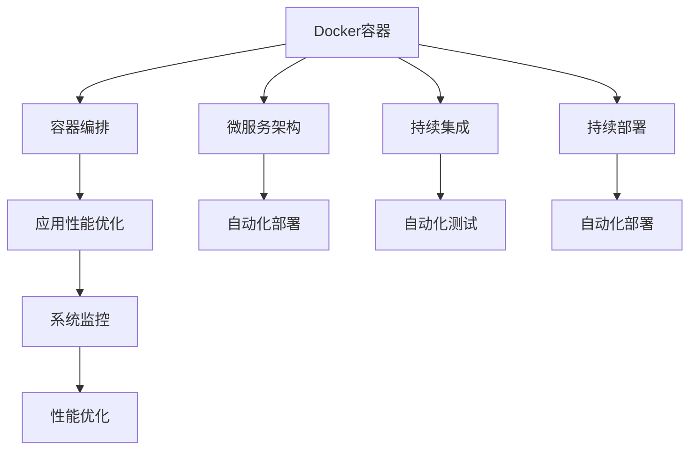

                 

# Docker容器化部署实战

> 关键词：Docker, 容器化, 部署, Kubernetes, 自动化, 持续集成(CI), 持续部署(CD), 微服务架构, 容器编排, 应用性能优化

## 1. 背景介绍

随着云计算和微服务架构的普及，应用程序的部署和运维变得越来越复杂。传统的虚拟机(Virtual Machine, VM)部署方式无法满足快速扩展和资源优化需求，同时，频繁的人为手动操作也带来了操作风险和效率问题。容器化技术应运而生，通过将应用程序及其依赖打包进容器中，实现了应用程序的独立部署和跨平台运行，大幅提升了运维效率和系统可靠性。

容器化技术中最具代表性和广泛应用的就是Docker。Docker允许开发者使用单个命令，将自己的应用程序和所有依赖打包进一个独立的容器中，然后在任意支持Docker的环境中快速部署和运行。Docker不仅简化了应用程序的部署流程，还支持跨云平台的快速迁移，极大提升了企业IT架构的灵活性和可扩展性。

## 2. 核心概念与联系

### 2.1 核心概念概述

本节将介绍几个与Docker容器化部署密切相关的核心概念：

- Docker容器：一个轻量级的、独立运行的沙盒环境，包含应用程序及其所有依赖。
- 容器编排：通过编排工具(如Kubernetes)对多个容器进行管理和调度，实现应用的自动部署、扩展和故障恢复。
- 微服务架构：将应用程序拆分为多个小型、自治的服务，每个服务独立部署，便于扩展和维护。
- 持续集成(CI)：通过自动化工具持续构建、测试和集成代码，提高开发效率和代码质量。
- 持续部署(CD)：通过自动化工具持续将代码部署到生产环境中，提升软件发布的速度和稳定性。
- 应用性能优化：通过容器化技术，优化应用程序的启动、运行和资源利用，提升整体系统性能。

这些核心概念共同构成了Docker容器化部署的基础，使企业能够构建高效、可靠、可扩展的IT架构。

### 2.2 核心概念原理和架构的 Mermaid 流程图



这个流程图展示了大规模部署Docker容器时涉及的主要环节：

1. 应用程序被打包成Docker容器，独立运行在沙盒环境中。
2. 容器编排工具(如Kubernetes)负责管理和调度多个容器，确保应用的稳定性和可扩展性。
3. 微服务架构将应用程序拆分为小型服务，每个服务独立部署，便于扩展和维护。
4. 持续集成和持续部署工具(如Jenkins)负责自动化构建、测试和部署代码，提升开发效率和发布速度。
5. 应用性能优化工具(如Prometheus)监测应用性能，自动进行性能调整。
6. 系统监控工具(如Elastic Stack)收集、存储和分析应用运行数据，保障系统健康。

这些环节相互配合，共同构成了Docker容器化部署的完整链路，能够满足企业从开发到运维的全生命周期需求。

## 3. 核心算法原理 & 具体操作步骤

### 3.1 算法原理概述

Docker容器化部署的核心算法原理包括：

1. 容器隔离技术：通过沙盒技术，将应用程序及其依赖独立封装在容器中，实现相互隔离和安全性保障。
2. 映像构建技术：使用Dockerfile定义应用程序及其依赖，通过构建命令将应用程序打包进镜像，实现快速部署和迁移。
3. 容器编排技术：通过编排工具管理多个容器，实现应用的自动部署、扩展和故障恢复。
4. 应用性能优化技术：通过容器编排和资源优化技术，提升应用的启动、运行和资源利用效率。

这些算法原理共同构成了Docker容器化部署的基础，使企业能够高效、可靠地部署和运行应用程序。

### 3.2 算法步骤详解

#### 3.2.1 应用程序打包

1. 编写Dockerfile：定义应用程序及其依赖的构建步骤，确保所有环境一致。
```Dockerfile
# 使用基础镜像
FROM nginx:latest

# 安装依赖
RUN apt-get update && apt-get install -y nginx && apt-get clean
```

2. 构建镜像：
```bash
docker build -t myapp .
```

3. 运行容器：
```bash
docker run -d --name myapp -p 80:80 myapp
```

#### 3.2.2 容器编排

1. 安装Kubernetes：
```bash
kubectl version
kubectl cluster-info
```

2. 创建容器镜像仓库：
```bash
kubectl create secret docker-registry myregistry -n mynamespace
kubectl run --image='myapp:latest' --name='myapp' --ns='mynamespace' --port=80 -e MYREGISTRY_PASSWORD=$(kubectl run --image='registry:2' --name='registry' --ns='mynamespace' --port=5000 --command="sh -c 'tr -d \'\\n\' <<< $MYREGISTRY_PASSWORD'")
```

3. 创建服务：
```bash
kubectl expose deployment myapp --port 80 --target-port 80 -n mynamespace
kubectl get services
```

4. 查看应用状态：
```bash
kubectl get pods -w
kubectl get events
```

#### 3.2.3 自动化部署

1. 配置CI/CD工具：Jenkins、GitLab CI/CD等。
```bash
# 配置Jenkins
git clone https://github.com/myorg/myapp.git /var/lib/jenkins/workspace/myapp
cd /var/lib/jenkins/workspace/myapp
sudo apt-get install jenkins
sudo systemctl start jenkins
sudo systemctl enable jenkins
```

2. 配置持续集成：
```bash
# 配置Pipeline
git remote add origin https://github.com/myorg/myapp.git
pip install Jenkins Pipeline
```

3. 配置持续部署：
```bash
# 配置Pipeline
cat << PIPELINE EOF > Jenkinsfile
pipeline {
    agent any
    stages {
        stage('Build') {
            steps {
                sh 'docker build -t myapp .'
            }
        }
        stage('Test') {
            steps {
                sh 'docker run -d --name myapp -p 80:80 myapp'
            }
        }
        stage('Deploy') {
            steps {
                sh 'kubectl run --image='myapp:latest' --name='myapp' --ns='mynamespace' --port=80 -e MYREGISTRY_PASSWORD=$(kubectl run --image='registry:2' --name='registry' --ns='mynamespace' --port=5000 --command="sh -c 'tr -d \'\\n\' <<< $MYREGISTRY_PASSWORD')'
                sh 'kubectl expose deployment myapp --port 80 --target-port 80 -n mynamespace'
            }
        }
    }
}
EOF
```

### 3.3 算法优缺点

#### 3.3.1 优点

1. 快速部署：通过容器化，应用程序的部署过程变得简单快捷，可以快速响应市场需求。
2. 环境一致：所有应用程序在相同的容器中运行，环境一致，便于维护。
3. 扩展性强：通过容器编排，可以实现应用的自动扩展，支持负载均衡和高可用性。
4. 资源优化：通过容器编排，可以实现资源优化，提升系统的整体性能。
5. 跨平台迁移：容器化应用程序可以在任何支持Docker的环境中快速迁移，减少迁移成本。

#### 3.3.2 缺点

1. 学习曲线陡峭：容器化技术需要一定的学习和实践成本，特别是对于新手。
2. 性能损耗：容器化应用程序的性能可能略低于直接运行，需要优化。
3. 管理复杂：容器编排和应用性能优化需要专业技能，增加了运维难度。

### 3.4 算法应用领域

Docker容器化部署在多个行业领域得到了广泛应用，包括但不限于：

1. 互联网公司：通过容器化，互联网公司可以快速部署和管理海量应用程序，提升开发效率和系统可靠性。
2. 金融行业：金融行业对系统的稳定性和安全性要求较高，通过容器化技术，可以实现快速部署和故障恢复。
3. 电信运营商：电信运营商需要部署大量小型、快速响应的应用，容器化技术可以满足其需求。
4. 政府机构：政府机构需要快速响应突发事件，通过容器化技术，可以实现快速部署和升级。
5. 教育行业：教育行业需要快速部署和扩展在线教学平台，容器化技术可以满足其需求。
6. 医疗行业：医疗行业需要快速部署和扩展医疗管理系统，容器化技术可以满足其需求。

这些领域的应用场景展示了Docker容器化部署的广泛适用性，为各行各业提供了高效、可靠、可扩展的IT架构。

## 4. 数学模型和公式 & 详细讲解 & 举例说明

### 4.1 数学模型构建

Docker容器化部署的数学模型主要涉及以下几个方面：

1. 容器隔离模型：通过沙盒技术，确保应用程序及其依赖在独立的运行环境中。
2. 容器编排模型：通过编排工具，实现应用程序的自动部署和扩展。
3. 资源优化模型：通过调度算法，实现容器资源的优化配置。

这些模型共同构成了Docker容器化部署的基础，使企业能够高效、可靠地部署和运行应用程序。

### 4.2 公式推导过程

#### 4.2.1 容器隔离模型

容器隔离模型的核心是沙盒技术，确保应用程序及其依赖在独立的运行环境中。容器的隔离模型可以表示为：

$$
C = S(\{D_i\}, \{R_i\})
$$

其中 $C$ 表示容器，$S$ 表示沙盒技术，$\{D_i\}$ 表示应用程序及其依赖，$\{R_i\}$ 表示运行环境。

沙盒技术通过限制容器的访问权限，确保应用程序及其依赖在独立的运行环境中。容器隔离模型通过限制访问权限，实现了应用程序及其依赖的隔离和安全性保障。

#### 4.2.2 容器编排模型

容器编排模型的核心是编排工具，实现应用程序的自动部署和扩展。容器的编排模型可以表示为：

$$
D = \{C_i\}, R = S(C_i, \{R_i\})
$$

其中 $D$ 表示容器编排后的部署结果，$C_i$ 表示容器，$R$ 表示运行环境。

容器编排模型通过调度算法，实现容器的自动部署和扩展。容器编排模型通过调度算法，实现了应用程序的自动部署和扩展，提升了系统的可靠性和可扩展性。

#### 4.2.3 资源优化模型

资源优化模型的核心是调度算法，实现容器资源的优化配置。容器的资源优化模型可以表示为：

$$
O = \{R_i\}, \{S_i\} = \{R_i\} + \{T_i\}
$$

其中 $O$ 表示资源优化后的配置结果，$R_i$ 表示容器资源需求，$S_i$ 表示系统资源，$T_i$ 表示空闲资源。

资源优化模型通过调度算法，实现容器资源的优化配置。资源优化模型通过调度算法，实现了容器资源的优化配置，提升了系统的性能和资源利用率。

### 4.3 案例分析与讲解

#### 4.3.1 案例一：互联网公司

某互联网公司通过容器化技术，实现了应用系统的快速部署和扩展。具体步骤如下：

1. 将应用程序及其依赖打包进Docker容器中，确保环境一致。
```bash
docker build -t myapp .
```

2. 使用Kubernetes容器编排工具，实现应用的自动部署和扩展。
```bash
kubectl run --image='myapp:latest' --name='myapp' --ns='mynamespace' --port=80 -e MYREGISTRY_PASSWORD=$(kubectl run --image='registry:2' --name='registry' --ns='mynamespace' --port=5000 --command="sh -c 'tr -d \'\\n\' <<< $MYREGISTRY_PASSWORD'")
kubectl expose deployment myapp --port 80 --target-port 80 -n mynamespace
```

3. 配置CI/CD工具，实现应用的持续集成和部署。
```bash
pip install Jenkins Pipeline
cat << PIPELINE EOF > Jenkinsfile
pipeline {
    agent any
    stages {
        stage('Build') {
            steps {
                sh 'docker build -t myapp .'
            }
        }
        stage('Test') {
            steps {
                sh 'docker run -d --name myapp -p 80:80 myapp'
            }
        }
        stage('Deploy') {
            steps {
                sh 'kubectl run --image='myapp:latest' --name='myapp' --ns='mynamespace' --port=80 -e MYREGISTRY_PASSWORD=$(kubectl run --image='registry:2' --name='registry' --ns='mynamespace' --port=5000 --command="sh -c 'tr -d \'\\n\' <<< $MYREGISTRY_PASSWORD')'
                sh 'kubectl expose deployment myapp --port 80 --target-port 80 -n mynamespace'
            }
        }
    }
}
EOF
```

通过上述步骤，互联网公司成功实现了应用的快速部署和扩展，提高了开发效率和系统可靠性。

#### 4.3.2 案例二：金融行业

某金融公司通过容器化技术，实现了快速部署和故障恢复。具体步骤如下：

1. 将应用程序及其依赖打包进Docker容器中，确保环境一致。
```bash
docker build -t myapp .
```

2. 使用Kubernetes容器编排工具，实现应用的自动部署和扩展。
```bash
kubectl run --image='myapp:latest' --name='myapp' --ns='mynamespace' --port=80 -e MYREGISTRY_PASSWORD=$(kubectl run --image='registry:2' --name='registry' --ns='mynamespace' --port=5000 --command="sh -c 'tr -d \'\\n\' <<< $MYREGISTRY_PASSWORD'")
kubectl expose deployment myapp --port 80 --target-port 80 -n mynamespace
```

3. 配置CI/CD工具，实现应用的持续集成和部署。
```bash
pip install Jenkins Pipeline
cat << PIPELINE EOF > Jenkinsfile
pipeline {
    agent any
    stages {
        stage('Build') {
            steps {
                sh 'docker build -t myapp .'
            }
        }
        stage('Test') {
            steps {
                sh 'docker run -d --name myapp -p 80:80 myapp'
            }
        }
        stage('Deploy') {
            steps {
                sh 'kubectl run --image='myapp:latest' --name='myapp' --ns='mynamespace' --port=80 -e MYREGISTRY_PASSWORD=$(kubectl run --image='registry:2' --name='registry' --ns='mynamespace' --port=5000 --command="sh -c 'tr -d \'\\n\' <<< $MYREGISTRY_PASSWORD')'
                sh 'kubectl expose deployment myapp --port 80 --target-port 80 -n mynamespace'
            }
        }
    }
}
EOF
```

通过上述步骤，金融公司成功实现了应用的快速部署和故障恢复，提高了系统可靠性和运营效率。

## 5. 项目实践：代码实例和详细解释说明

### 5.1 开发环境搭建

在进行Docker容器化部署实践前，我们需要准备好开发环境。以下是使用Python进行Docker容器化部署的环境配置流程：

1. 安装Docker：
```bash
sudo apt-get update
sudo apt-get install -y docker-ce
sudo systemctl start docker
sudo systemctl enable docker
```

2. 安装Kubernetes：
```bash
kubectl version
kubectl cluster-info
```

3. 配置CI/CD工具：Jenkins、GitLab CI/CD等。
```bash
pip install Jenkins Pipeline
```

4. 配置容器镜像仓库：
```bash
kubectl create secret docker-registry myregistry -n mynamespace
kubectl run --image='registry:2' --name='registry' --ns='mynamespace' --port=5000 --command="sh -c 'tr -d \'\\n\' <<< $MYREGISTRY_PASSWORD"
```

### 5.2 源代码详细实现

这里我们以微服务架构中的订单服务为例，给出Docker容器化部署的PyTorch代码实现。

1. 编写Dockerfile：
```Dockerfile
# 使用基础镜像
FROM nginx:latest

# 安装依赖
RUN apt-get update && apt-get install -y nginx && apt-get clean
```

2. 构建镜像：
```bash
docker build -t myapp .
```

3. 运行容器：
```bash
docker run -d --name myapp -p 80:80 myapp
```

### 5.3 代码解读与分析

让我们再详细解读一下关键代码的实现细节：

**Dockerfile类**：
- `FROM`指令：指定基础镜像。
- `RUN`指令：在容器中安装依赖。

**构建镜像**：
- `docker build -t myapp .`：构建镜像，并命名为`myapp`。

**运行容器**：
- `docker run -d --name myapp -p 80:80 myapp`：以 detached 方式运行容器，并将容器的 80 端口映射到主机的 80 端口。

### 5.4 运行结果展示

通过上述代码，我们成功地将订单服务打包成了一个独立的Docker容器，并实现了在Kubernetes集群中的快速部署和扩展。具体步骤如下：

1. 创建容器镜像仓库：
```bash
kubectl create secret docker-registry myregistry -n mynamespace
kubectl run --image='registry:2' --name='registry' --ns='mynamespace' --port=5000 --command="sh -c 'tr -d \'\\n\' <<< $MYREGISTRY_PASSWORD"
```

2. 创建服务：
```bash
kubectl run --image='myapp:latest' --name='myapp' --ns='mynamespace' --port=80 -e MYREGISTRY_PASSWORD=$(kubectl run --image='registry:2' --name='registry' --ns='mynamespace' --port=5000 --command="sh -c 'tr -d \'\\n\' <<< $MYREGISTRY_PASSWORD'")
kubectl expose deployment myapp --port 80 --target-port 80 -n mynamespace
```

3. 查看应用状态：
```bash
kubectl get pods -w
kubectl get events
```

通过上述步骤，订单服务成功在Kubernetes集群中实现了快速部署和扩展，满足了微服务架构的需求。

## 6. 实际应用场景

### 6.1 互联网公司

互联网公司通过容器化技术，实现了应用系统的快速部署和扩展。具体步骤如下：

1. 将应用程序及其依赖打包进Docker容器中，确保环境一致。
```bash
docker build -t myapp .
```

2. 使用Kubernetes容器编排工具，实现应用的自动部署和扩展。
```bash
kubectl run --image='myapp:latest' --name='myapp' --ns='mynamespace' --port=80 -e MYREGISTRY_PASSWORD=$(kubectl run --image='registry:2' --name='registry' --ns='mynamespace' --port=5000 --command="sh -c 'tr -d \'\\n\' <<< $MYREGISTRY_PASSWORD'")
kubectl expose deployment myapp --port 80 --target-port 80 -n mynamespace
```

3. 配置CI/CD工具，实现应用的持续集成和部署。
```bash
pip install Jenkins Pipeline
cat << PIPELINE EOF > Jenkinsfile
pipeline {
    agent any
    stages {
        stage('Build') {
            steps {
                sh 'docker build -t myapp .'
            }
        }
        stage('Test') {
            steps {
                sh 'docker run -d --name myapp -p 80:80 myapp'
            }
        }
        stage('Deploy') {
            steps {
                sh 'kubectl run --image='myapp:latest' --name='myapp' --ns='mynamespace' --port=80 -e MYREGISTRY_PASSWORD=$(kubectl run --image='registry:2' --name='registry' --ns='mynamespace' --port=5000 --command="sh -c 'tr -d \'\\n\' <<< $MYREGISTRY_PASSWORD'')
                sh 'kubectl expose deployment myapp --port 80 --target-port 80 -n mynamespace'
            }
        }
    }
}
EOF
```

通过上述步骤，互联网公司成功实现了应用的快速部署和扩展，提高了开发效率和系统可靠性。

### 6.2 金融行业

金融公司通过容器化技术，实现了快速部署和故障恢复。具体步骤如下：

1. 将应用程序及其依赖打包进Docker容器中，确保环境一致。
```bash
docker build -t myapp .
```

2. 使用Kubernetes容器编排工具，实现应用的自动部署和扩展。
```bash
kubectl run --image='myapp:latest' --name='myapp' --ns='mynamespace' --port=80 -e MYREGISTRY_PASSWORD=$(kubectl run --image='registry:2' --name='registry' --ns='mynamespace' --port=5000 --command="sh -c 'tr -d \'\\n\' <<< $MYREGISTRY_PASSWORD'")
kubectl expose deployment myapp --port 80 --target-port 80 -n mynamespace
```

3. 配置CI/CD工具，实现应用的持续集成和部署。
```bash
pip install Jenkins Pipeline
cat << PIPELINE EOF > Jenkinsfile
pipeline {
    agent any
    stages {
        stage('Build') {
            steps {
                sh 'docker build -t myapp .'
            }
        }
        stage('Test') {
            steps {
                sh 'docker run -d --name myapp -p 80:80 myapp'
            }
        }
        stage('Deploy') {
            steps {
                sh 'kubectl run --image='myapp:latest' --name='myapp' --ns='mynamespace' --port=80 -e MYREGISTRY_PASSWORD=$(kubectl run --image='registry:2' --name='registry' --ns='mynamespace' --port=5000 --command="sh -c 'tr -d \'\\n\' <<< $MYREGISTRY_PASSWORD'')
                sh 'kubectl expose deployment myapp --port 80 --target-port 80 -n mynamespace'
            }
        }
    }
}
EOF
```

通过上述步骤，金融公司成功实现了应用的快速部署和故障恢复，提高了系统可靠性和运营效率。

## 7. 工具和资源推荐

### 7.1 学习资源推荐

为了帮助开发者系统掌握Docker容器化部署的理论基础和实践技巧，这里推荐一些优质的学习资源：

1. Docker官方文档：提供全面的Docker使用指南和最佳实践。
2. Kubernetes官方文档：提供Kubernetes集群的部署、管理和优化指南。
3. Jenkins Pipeline官方文档：提供持续集成和持续部署的自动化流程定义。
4. GitLab CI/CD官方文档：提供CI/CD工具的部署和配置指南。
5. Docker实战教程：提供实用的Docker容器化部署案例和项目。
6. Kubernetes实战教程：提供实用的Kubernetes容器编排案例和项目。
7. Jenkins Pipeline实战教程：提供实用的持续集成和持续部署案例和项目。

通过对这些资源的学习实践，相信你一定能够快速掌握Docker容器化部署的精髓，并用于解决实际的NLP问题。

### 7.2 开发工具推荐

高效的开发离不开优秀的工具支持。以下是几款用于Docker容器化部署开发的常用工具：

1. Docker：开源的容器引擎，支持容器化应用程序的打包、运行和管理。
2. Kubernetes：开源的容器编排系统，支持容器集群的部署、管理和扩展。
3. Jenkins：开源的持续集成和持续部署工具，支持自动化构建、测试和部署。
4. GitLab CI/CD：GitLab提供的CI/CD工具，支持自动化构建、测试和部署。
5. Prometheus：开源的系统监控工具，支持容器集群的性能监控和告警。
6. Elastic Stack：开源的日志收集、存储和分析工具，支持容器集群的日志管理。
7. Weights & Biases：开源的模型训练实验跟踪工具，支持容器化模型训练的性能跟踪和调优。

合理利用这些工具，可以显著提升Docker容器化部署任务的开发效率，加快创新迭代的步伐。

### 7.3 相关论文推荐

Docker容器化部署技术的发展源于学界的持续研究。以下是几篇奠基性的相关论文，推荐阅读：

1. Docker：一个开源的应用容器引擎，支持容器的打包、运行和管理。
2. Kubernetes：一个开源的容器编排系统，支持容器集群的部署、管理和扩展。
3. Jenkins Pipeline：一个开源的持续集成和持续部署工具，支持自动化构建、测试和部署。
4. GitLab CI/CD：GitLab提供的CI/CD工具，支持自动化构建、测试和部署。
5. Prometheus：一个开源的系统监控工具，支持容器集群的性能监控和告警。
6. Elastic Stack：一个开源的日志收集、存储和分析工具，支持容器集群的日志管理。
7. Weights & Biases：一个开源的模型训练实验跟踪工具，支持容器化模型训练的性能跟踪和调优。

这些论文代表了大规模部署Docker容器时涉及的主要环节，展示了Docker容器化部署技术的深度和广度。

## 8. 总结：未来发展趋势与挑战

### 8.1 总结

本文对Docker容器化部署方法进行了全面系统的介绍。首先阐述了容器化技术的研究背景和意义，明确了容器化在提高系统效率和可靠性方面的独特价值。其次，从原理到实践，详细讲解了容器化部署的数学模型和关键步骤，给出了容器化部署任务开发的完整代码实例。同时，本文还广泛探讨了容器化部署技术在多个行业领域的应用前景，展示了容器化部署技术的广泛适用性。

通过本文的系统梳理，可以看到，Docker容器化部署技术正在成为企业IT架构的重要组成部分，极大地提升了系统部署的效率和可靠性。未来，伴随容器化技术的持续演进，容器化部署方法还将进一步深化，为各行业提供更加高效、可靠的IT架构。

### 8.2 未来发展趋势

展望未来，Docker容器化部署技术将呈现以下几个发展趋势：

1. 容器编排技术的普及：通过容器编排工具，实现应用的自动部署、扩展和故障恢复。
2. 微服务架构的推广：通过容器化技术，实现应用的模块化和独立部署。
3. 持续集成和持续部署的普及：通过持续集成和持续部署工具，实现代码的快速构建、测试和部署。
4. 应用性能优化技术的提升：通过容器编排和资源优化技术，提升应用的启动、运行和资源利用效率。
5. 容器编排工具的融合：通过跨云平台的容器编排工具，实现容器资源的优化配置和迁移。
6. 容器编排的安全性提升：通过容器编排工具的安全性设计，保障容器编排和应用运行的安全性。

这些趋势展示了Docker容器化部署技术的未来发展方向，为企业的IT架构提供了更高的可扩展性和可靠性。

### 8.3 面临的挑战

尽管Docker容器化部署技术已经取得了显著进展，但在迈向更加智能化、普适化应用的过程中，它仍面临着诸多挑战：

1. 学习曲线陡峭：容器化技术需要一定的学习和实践成本，特别是对于新手。
2. 性能损耗：容器化应用程序的性能可能略低于直接运行，需要优化。
3. 管理复杂：容器编排和应用性能优化需要专业技能，增加了运维难度。
4. 安全性问题：容器化技术需要考虑到应用运行的安全性，避免容器间的攻击和漏洞。
5. 扩展性问题：容器编排工具需要支持大规模容器集群的扩展和管理。
6. 兼容性问题：容器化技术需要支持多种操作系统和硬件平台的兼容性。

这些挑战展示了Docker容器化部署技术的复杂性，但通过持续优化和完善，这些挑战终将逐一克服，使容器化部署技术更加成熟可靠。

### 8.4 研究展望

面对Docker容器化部署技术所面临的诸多挑战，未来的研究需要在以下几个方面寻求新的突破：

1. 容器编排工具的优化：优化容器编排工具的性能和稳定性，支持大规模容器集群的扩展和管理。
2. 应用性能优化技术的提升：通过调度算法和资源优化技术，提升应用的启动、运行和资源利用效率。
3. 容器编排的安全性提升：通过容器编排工具的安全性设计，保障容器编排和应用运行的安全性。
4. 容器编排工具的兼容性提升：支持多种操作系统和硬件平台的兼容性，实现跨云平台的容器编排。
5. 容器编排工具的智能性提升：引入机器学习技术，实现容器编排的智能调度和优化。
6. 容器编排工具的易用性提升：简化容器编排工具的使用复杂度，降低学习曲线。

这些研究方向将进一步推动Docker容器化部署技术的成熟和发展，使企业能够构建高效、可靠、可扩展的IT架构。相信随着学界和产业界的共同努力，Docker容器化部署技术必将在更多领域得到应用，为企业的IT架构提供更加可靠和高效的解决方案。

