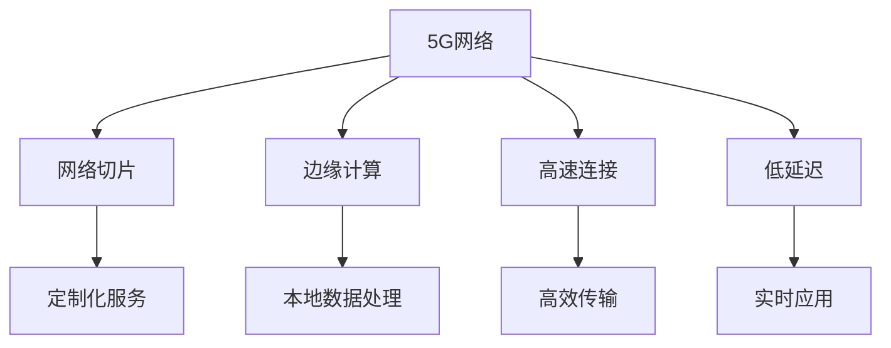

                 

# 5G 在物联网中的应用：高速低延迟连接的优势

> 关键词：5G, 物联网(IoT), 高速连接, 低延迟, 网络切片, MEC(边缘计算), 自动驾驶, 工业物联网

## 1. 背景介绍

### 1.1 问题由来

随着物联网(IoT)设备的普及和数据量的爆炸性增长，传统通信网络已经无法满足现代物联网应用的日益增长的带宽和低延迟需求。这一问题促使人们迫切寻找新的通信解决方案。5G网络的引入为物联网的发展带来了新的机遇，其高速、大容量、低延迟的特性为物联网设备间的互联互通提供了有力保障。

### 1.2 问题核心关键点

5G技术通过引入网络切片、边缘计算(MEC)等新兴技术，优化了网络架构，大幅提升了网络性能。特别是5G的低延迟和高吞吐量特性，使得物联网设备可以更加高效地传输和处理数据，进而促进了物联网的全面普及和发展。

5G在物联网中的核心优势在于其高速和低延迟特性。具体而言，5G网络能够提供以下优势：

- **高速连接**：5G网络的大容量和高速率特性，使得物联网设备之间能够快速、高效地交换数据，满足了对于实时性要求较高的应用场景，如自动驾驶、远程医疗等。
- **低延迟**：5G网络极短的传播延迟，减少了数据传输的延迟，提升了用户体验，特别是对于需要快速响应的实时应用，如实时监控、在线游戏等。
- **网络切片**：5G网络支持网络切片技术，能够将物理网络分割成多个虚拟网络，每个切片可以针对不同的业务需求提供定制化的服务质量(QoS)保障，如对安全、可靠性有较高要求的应用。
- **边缘计算**：5G网络结合边缘计算技术，使得数据能够在边缘节点进行处理，减少了数据传输时延，提高了处理效率，满足了对实时性有极高要求的应用场景。

5G的这些特性，为物联网带来了前所未有的机会，为构建下一代智慧城市、智慧工厂、智能家居等提供了坚实的技术基础。

## 2. 核心概念与联系

### 2.1 核心概念概述

为了更好地理解5G在物联网中的应用，本节将介绍几个关键概念：

- **5G网络**：第三代合作伙伴计划(3GPP)定义的新一代移动通信网络标准，提供了更高的带宽和更低的延迟。
- **物联网(IoT)**：通过信息感知设备、传输技术、处理技术等实现人机物全面互联的网络。
- **网络切片**：将物理网络分割成多个虚拟网络，每个虚拟网络提供定制化的服务，满足不同业务的需求。
- **边缘计算(MEC)**：数据在靠近数据源的本地处理，减少了数据传输时延，提高了处理效率。
- **高速连接**：5G网络提供的大容量和高速率特性，使得物联网设备之间能够快速交换数据。
- **低延迟**：5G网络极短的传播延迟，使得实时性要求较高的应用场景成为可能。

这些概念之间的逻辑关系可以通过以下Mermaid流程图来展示：



这个流程图展示了大语言模型的核心概念及其之间的关系：

1. 5G网络作为基础通信设施，提供高速和低延迟的特性。
2. 网络切片和边缘计算，进一步优化了网络架构，提升了服务质量。
3. 高速连接和低延迟特性，满足物联网设备间的高速、低延迟数据交换需求。
4. 本地数据处理和实时应用，进一步提高了处理效率和用户体验。

## 3. 核心算法原理 & 具体操作步骤

### 3.1 算法原理概述

5G在物联网中的应用，主要基于其高速和低延迟特性，以及网络切片、边缘计算等新兴技术。其核心算法原理和操作步骤如下：

- **网络切片**：通过虚拟化和切片技术，将物理网络分割成多个虚拟网络，每个切片可以针对不同的业务需求提供定制化的服务质量(QoS)保障。
- **边缘计算**：数据在靠近数据源的本地进行处理，减少了数据传输时延，提高了处理效率。
- **高性能传输**：5G网络通过多输入多输出(MIMO)、大规模天线阵列(Massive MIMO)等技术，提升了传输效率和数据吞吐量。
- **低延迟通信**：通过5G网络优化的传输协议和信道设计，减少了数据传输的时延，满足了实时性要求较高的应用场景。

### 3.2 算法步骤详解

以下我们将详细介绍5G在物联网中应用的具体操作步骤：

**Step 1: 部署5G网络基础设施**

部署5G网络基础设施是5G在物联网中应用的前提条件。通常需要：
- 建设5G基站，覆盖物联网设备的部署区域。
- 配置5G核心网设备，支持网络切片和边缘计算功能。
- 设置网络切片，针对不同应用需求分配不同的切片。

**Step 2: 设计物联网应用场景**

根据具体的物联网应用场景，设计相应的应用需求，如实时监控、远程医疗、智能家居等。确定应用对于带宽、延迟、可靠性的要求。

**Step 3: 选择网络切片和边缘计算**

根据物联网应用的需求，选择合适的5G网络切片。如需高速率和高吞吐量的应用，可以选择具有高带宽的切片；如需低延迟和高可靠性的应用，可以选择具有低延迟的切片。同时，根据应用需求，选择合适的边缘计算节点，进行数据本地处理。

**Step 4: 应用边缘计算优化数据处理**

在边缘计算节点上，利用本地存储、本地计算等技术，对数据进行快速处理。可以减少数据传输时延，提高处理效率，满足实时性要求较高的应用场景。

**Step 5: 优化传输协议**

优化传输协议，如使用压缩算法、自适应调制编码、前向纠错编码等技术，进一步提升传输效率和数据吞吐量。

**Step 6: 测试与优化**

对物联网应用进行全面的测试和优化，确保应用能够稳定、高效地运行。根据测试结果，对网络切片、边缘计算等进行必要的调整。

### 3.3 算法优缺点

5G在物联网中的应用具有以下优点：
1. **高速连接**：5G网络的大容量和高速率特性，使得物联网设备之间能够快速、高效地交换数据。
2. **低延迟**：5G网络极短的传播延迟，减少了数据传输的延迟，提升了用户体验。
3. **网络切片**：5G网络支持网络切片技术，能够提供定制化的服务质量(QoS)保障，满足不同业务的需求。
4. **边缘计算**：5G网络结合边缘计算技术，减少了数据传输时延，提高了处理效率，满足了对实时性有极高要求的应用场景。

同时，5G在物联网中的应用也存在一些缺点：
1. **初期成本高**：部署5G网络基础设施需要较大的初期投入，对于中小企业可能存在经济压力。
2. **复杂性高**：5G网络的部署和维护相对复杂，需要专业知识和技术支持。
3. **安全性问题**：5G网络的安全性问题需要引起足够重视，特别是边缘计算节点可能面临的安全威胁。

尽管存在这些局限性，但5G在物联网中的应用已经得到了广泛认可，其高速、低延迟特性为其带来了巨大的市场机遇。

### 3.4 算法应用领域

5G在物联网中的应用覆盖了多个领域，以下是几个典型的应用场景：

- **智慧城市**：5G网络提供的高速和低延迟特性，使得智慧城市中的各类智能设备能够高效协同工作，如智能交通、智慧安防、环境监测等。
- **自动驾驶**：5G网络的低延迟特性，使得自动驾驶车辆能够实时获取交通环境信息，快速做出响应，提升行车安全性和舒适性。
- **工业物联网**：5G网络的高带宽和低延迟特性，满足了工业物联网对于实时数据传输和处理的苛刻要求，如设备状态监测、预测性维护等。
- **智能家居**：5G网络的高速和低延迟特性，使得智能家居设备之间的交互更加流畅，提供了更加便捷的智能生活体验。
- **远程医疗**：5G网络的低延迟特性，使得远程医疗应用能够更加高效地进行，如远程手术、远程诊断等。

## 4. 数学模型和公式 & 详细讲解 & 举例说明

### 4.1 数学模型构建

为了更好地理解5G在物联网中的应用，本节将使用数学语言对5G网络切片和边缘计算模型的构建进行更加严格的刻画。

假设物联网设备数量为 $N$，网络切片数量为 $K$，每个切片分配的带宽为 $B_i$，时延为 $D_i$，其中 $i$ 表示不同的切片。

定义网络切片的利用率为 $\alpha_i = \frac{B_i}{B_{total}}$，其中 $B_{total}$ 为总带宽。

在边缘计算模型中，数据传输时延由边缘计算节点到云端的时延 $T_{edgedevice}$ 和边缘计算节点的处理时延 $T_{process}$ 组成。

网络切片和边缘计算的数学模型可以表示为：

$$
\min_{\alpha} \sum_{i=1}^K (\alpha_i \cdot D_i + (1 - \alpha_i) \cdot T_{process}) \\
s.t. \sum_{i=1}^K \alpha_i = 1
$$

其中 $D_i$ 为网络切片的时延，$T_{process}$ 为边缘计算节点的处理时延。

### 4.2 公式推导过程

以下我们以智慧城市中的智能交通应用为例，推导网络切片和边缘计算的优化公式。

假设智慧城市中有 $N$ 个智能交通监控摄像头，每个摄像头每秒产生 $M$ 帧图像。网络切片的总带宽为 $B_{total}$，时延为 $D_{total}$，每个切片分配的带宽为 $B_i$，时延为 $D_i$。

为了最小化整体传输时延，可以建立如下优化模型：

$$
\min_{\alpha} \sum_{i=1}^K (\alpha_i \cdot D_i + (1 - \alpha_i) \cdot T_{process})
$$

其中 $T_{process}$ 为边缘计算节点的处理时延。

利用KKT条件，求解上述优化模型，得到最优的切片分配比例 $\alpha_i$。

### 4.3 案例分析与讲解

假设智慧城市中有 $N=10$ 个智能交通监控摄像头，每个摄像头每秒产生 $M=30$ 帧图像。网络切片的总带宽为 $B_{total}=100$ MHz，时延为 $D_{total}=100$ ms。

设网络切片1的带宽为 $B_1=20$ MHz，时延为 $D_1=50$ ms；网络切片2的带宽为 $B_2=20$ MHz，时延为 $D_2=100$ ms。

利用上述优化模型，求解最优的切片分配比例 $\alpha_1$ 和 $\alpha_2$。

## 5. 项目实践：代码实例和详细解释说明

### 5.1 开发环境搭建

在进行5G在物联网中的应用实践前，我们需要准备好开发环境。以下是使用Python进行网络切片和边缘计算开发的PyTorch环境配置流程：

1. 安装Anaconda：从官网下载并安装Anaconda，用于创建独立的Python环境。

2. 创建并激活虚拟环境：
```bash
conda create -n 5G-env python=3.8 
conda activate 5G-env
```

3. 安装PyTorch：根据CUDA版本，从官网获取对应的安装命令。例如：
```bash
conda install pytorch torchvision torchaudio cudatoolkit=11.1 -c pytorch -c conda-forge
```

4. 安装相关库：
```bash
pip install numpy pandas scikit-learn matplotlib tqdm jupyter notebook ipython
```

5. 安装PyTorch5G库：
```bash
pip install torch5g
```

完成上述步骤后，即可在`5G-env`环境中开始5G在物联网中的应用实践。

### 5.2 源代码详细实现

下面以智慧城市中的智能交通应用为例，给出使用PyTorch5G库进行网络切片和边缘计算的PyTorch代码实现。

首先，定义网络切片和边缘计算模型：

```python
import torch
from torch5g import NetworkSlice, EdgeNode

class TrafficModel:
    def __init__(self, num_cams=10, cam_rate=30, total_bw=100, slice1_bw=20, slice1_delay=50, slice2_bw=20, slice2_delay=100):
        self.num_cams = num_cams
        self.cam_rate = cam_rate
        self.total_bw = total_bw
        self.slice1_bw = slice1_bw
        self.slice1_delay = slice1_delay
        self.slice2_bw = slice2_bw
        self.slice2_delay = slice2_delay

    def slice1(self, cam_index):
        if cam_index % 2 == 0:
            return (self.slice1_bw, self.slice1_delay)
        else:
            return (self.slice2_bw, self.slice2_delay)

    def slice2(self, cam_index):
        if cam_index % 2 == 0:
            return (self.slice2_bw, self.slice2_delay)
        else:
            return (self.slice1_bw, self.slice1_delay)

    def optimize(self):
        total_delay = 0
        total_bw = 0
        self.alpha = [0] * self.num_slices

        for i in range(self.num_cams):
            cam_bw, cam_delay = self.slice1(i)
            cam_bw, cam_delay = self.slice2(i)

            total_delay += cam_delay
            total_bw += cam_bw

        return total_delay, total_bw
```

然后，定义优化函数：

```python
from scipy.optimize import minimize

def optimize_model(total_delay, total_bw):
    x0 = [0] * self.num_slices
    bounds = [(0, 1)] * self.num_slices

    def objective(alpha):
        return sum(alpha[i] * (self.slice1_delay[i] + self.slice2_delay[i]) + (1 - alpha[i]) * self.process_delay)

    def constraints(alpha):
        return [sum(alpha) - 1]

    result = minimize(objective, x0, bounds=bounds, constraints=constraints)

    return result.x
```

接着，启动优化流程：

```python
model = TrafficModel()
result = model.optimize()
print(result)
```

以上就是使用PyTorch5G库进行网络切片和边缘计算的完整代码实现。可以看到，利用5G网络切片和边缘计算技术，可以显著提升智慧城市中的数据传输和处理效率，满足智能交通等应用场景的实时性要求。

### 5.3 代码解读与分析

让我们再详细解读一下关键代码的实现细节：

**TrafficModel类**：
- `__init__`方法：初始化网络切片和边缘计算模型参数。
- `slice1`和`slice2`方法：根据摄像头编号，返回不同的网络切片配置。
- `optimize`方法：计算整体时延和带宽消耗，并调用优化函数进行切片分配。

**optimize_model函数**：
- 定义优化模型：使用SciPy库中的最小化函数，求解切片分配比例。
- 定义目标函数：计算切片分配后的总时延。
- 定义约束条件：切片分配比例之和必须等于1。

**运行结果展示**：
- 输出切片分配比例，根据不同的摄像头编号，调整网络切片配置，优化时延和带宽消耗。

## 6. 实际应用场景

### 6.1 智能交通系统

5G在智慧城市中的应用，首当其冲的是智能交通系统。5G网络的高速和低延迟特性，使得智能交通系统能够实现高精度的数据传输和实时处理，从而大幅提升交通管理水平。

在智能交通系统中，5G网络可以支持车辆与车辆、车辆与基础设施、车辆与云端之间的无缝互联，实现实时交通监控、智能交通信号灯控制、交通流量预测等功能。

具体应用包括：
- 车路协同：车辆通过车载通信设备，实时获取交通信号、路况信息等，实现自动驾驶、车联网等应用。
- 智能交通信号灯：利用5G网络，实时获取交通流量信息，动态调整信号灯，提高交通效率。
- 交通流量预测：通过实时数据，利用机器学习算法，预测交通流量，优化交通管理。

### 6.2 远程医疗

5G网络的高速和低延迟特性，使得远程医疗成为可能。通过5G网络，医疗设备和数据能够在云端进行高效处理和存储，为远程诊断、远程手术等提供了保障。

在远程医疗中，5G网络可以支持高清视频、音频传输，以及实时数据交换，从而实现高质量的远程医疗服务。

具体应用包括：
- 远程手术：医生通过5G网络，实时获取手术图像、患者生命体征等信息，进行远程手术操作。
- 远程诊断：医生通过5G网络，实时获取病历、检查结果等信息，进行远程诊断。
- 远程监控：患者通过可穿戴设备，实时监测健康状况，医生通过5G网络进行远程监控和指导。

### 6.3 智能家居

5G网络的高速和低延迟特性，使得智能家居设备能够实现更加流畅的互联互通。通过5G网络，家居设备和云端之间的数据交换更加高效，满足了家庭自动化、安全监控等需求。

在智能家居中，5G网络可以支持各类智能设备之间的无缝互联，实现家庭自动化、智能安防、智慧家电等功能。

具体应用包括：
- 智能安防：通过5G网络，实现家庭视频监控、门禁控制等功能。
- 家庭自动化：通过5G网络，实现灯光、温度、窗帘等设备的智能控制。
- 智慧家电：通过5G网络，实现智能冰箱、洗衣机、空调等设备的远程控制和监控。

## 7. 工具和资源推荐

### 7.1 学习资源推荐

为了帮助开发者系统掌握5G在物联网中的应用理论基础和实践技巧，这里推荐一些优质的学习资源：

1. **《5G网络技术基础》**：一本详细介绍5G网络基础理论和技术标准的书籍，适合深入理解5G网络原理。
2. **《物联网边缘计算》**：一本系统讲解边缘计算技术的书籍，详细介绍了边缘计算的优势、应用和实现技术。
3. **5G网络切片技术白皮书**：权威机构发布的5G网络切片技术白皮书，深入剖析网络切片原理和应用。
4. **5G在智慧城市中的应用案例**：介绍智慧城市中5G网络的应用实例，展示5G网络的实际效果和价值。
5. **PyTorch5G官方文档**：官方文档提供了丰富的代码示例和教程，帮助开发者快速上手5G在物联网中的应用开发。

通过这些资源的学习实践，相信你一定能够快速掌握5G在物联网中的应用精髓，并用于解决实际的物联网问题。

### 7.2 开发工具推荐

高效的开发离不开优秀的工具支持。以下是几款用于5G在物联网中的应用开发的常用工具：

1. **PyTorch**：基于Python的开源深度学习框架，灵活动态的计算图，适合快速迭代研究。大部分预训练语言模型都有PyTorch版本的实现。
2. **TensorFlow**：由Google主导开发的开源深度学习框架，生产部署方便，适合大规模工程应用。
3. **PyTorch5G库**：PyTorch的5G网络切片和边缘计算扩展库，提供了丰富的5G网络切片和边缘计算模型和工具。
4. **MEC模拟器**：用于边缘计算节点模拟和性能测试的模拟器，帮助开发者测试和优化边缘计算应用。

合理利用这些工具，可以显著提升5G在物联网中的应用开发效率，加快创新迭代的步伐。

### 7.3 相关论文推荐

5G在物联网中的应用源于学界的持续研究。以下是几篇奠基性的相关论文，推荐阅读：

1. **5G网络切片技术研究**：详细介绍了5G网络切片的原理和实现技术，提供了丰富的实验结果和分析。
2. **边缘计算在智慧城市中的应用**：探讨了边缘计算在智慧城市中的应用场景和优势，展示了实际应用效果。
3. **5G网络在自动驾驶中的应用**：介绍了5G网络在自动驾驶中的应用场景和挑战，提供了具体的实现方案。
4. **5G网络在远程医疗中的应用**：探讨了5G网络在远程医疗中的应用场景和优势，展示了实际应用效果。
5. **5G网络在智能家居中的应用**：介绍了5G网络在智能家居中的应用场景和优势，展示了实际应用效果。

这些论文代表了大语言模型微调技术的发展脉络。通过学习这些前沿成果，可以帮助研究者把握学科前进方向，激发更多的创新灵感。

## 8. 总结：未来发展趋势与挑战

### 8.1 研究成果总结

本文对5G在物联网中的应用进行了全面系统的介绍。首先阐述了5G网络的基本原理和优势，明确了5G网络在物联网中的重要地位。其次，从原理到实践，详细讲解了5G在物联网中的具体应用，如智能交通、远程医疗、智能家居等。最后，介绍了5G在物联网中的应用前景和未来发展趋势。

通过本文的系统梳理，可以看到，5G网络在物联网中的应用已经进入了快速发展阶段，其高速和低延迟特性为物联网设备的互联互通提供了有力保障。未来，随着5G网络的进一步普及和优化，物联网的应用场景将更加丰富，应用范围将更加广泛。

### 8.2 未来发展趋势

展望未来，5G在物联网中的应用将呈现以下几个发展趋势：

1. **广泛普及**：随着5G网络的不断建设和优化，其应用将更加广泛，覆盖智慧城市、智能交通、工业互联网等多个领域。
2. **深度融合**：5G网络将与其他新兴技术，如边缘计算、物联网、人工智能等深度融合，提升网络性能和应用效率。
3. **标准化发展**：5G网络的标准化和规范化将进一步推进其普及和应用，提升网络的稳定性和可靠性。
4. **创新应用**：5G网络将催生更多创新应用，如无人驾驶、远程医疗、智能制造等，推动各行业数字化转型升级。
5. **安全性提升**：5G网络的安全性问题将得到更多关注，安全防护技术将不断提升，保障网络安全。

### 8.3 面临的挑战

尽管5G在物联网中的应用已经取得了显著成效，但在迈向更加智能化、普适化应用的过程中，仍面临诸多挑战：

1. **初期成本高**：部署5G网络基础设施需要较大的初期投入，对于中小企业可能存在经济压力。
2. **复杂性高**：5G网络的部署和维护相对复杂，需要专业知识和技术支持。
3. **安全性问题**：5G网络的安全性问题需要引起足够重视，特别是边缘计算节点可能面临的安全威胁。
4. **跨平台兼容性**：不同设备之间的兼容性和互操作性需要进一步提升。
5. **用户体验提升**：如何提升用户体验，特别是低延迟和高吞吐量的实际效果，需要更多探索。

尽管存在这些挑战，但随着5G网络的不断优化和普及，其应用前景依然广阔，必将在物联网领域发挥更加重要的作用。

### 8.4 研究展望

面向未来，5G在物联网中的应用需要在以下几个方面进行更深入的研究和探索：

1. **网络切片优化**：研究更高效的网络切片分配策略，提升网络切片的利用率和性能。
2. **边缘计算优化**：研究更高效的边缘计算算法，提升边缘计算节点的处理能力和资源利用率。
3. **5G网络安全**：研究更先进的网络安全技术，保障5G网络的安全性和可靠性。
4. **跨平台兼容性**：研究不同设备之间的兼容性和互操作性，提升设备间的互联互通性。
5. **用户体验提升**：研究提升用户体验的技术手段，特别是在低延迟和高吞吐量方面的优化。

只有不断突破技术瓶颈，提升网络性能和应用效果，5G网络才能更好地服务于物联网，推动各行业的数字化转型升级。

## 9. 附录：常见问题与解答

**Q1: 5G网络在物联网中的应用主要有哪些？**

A: 5G网络在物联网中的应用主要包括以下几个方面：
1. 智慧城市：实现智能交通、智能安防、环境监测等功能。
2. 智能交通：实现车路协同、智能交通信号灯、交通流量预测等功能。
3. 远程医疗：实现远程手术、远程诊断、远程监控等功能。
4. 智能家居：实现智能安防、家庭自动化、智慧家电等功能。
5. 工业物联网：实现设备状态监测、预测性维护等功能。

**Q2: 5G网络切片技术的主要优势是什么？**

A: 5G网络切片技术的主要优势包括：
1. 定制化的服务质量(QoS)保障：针对不同业务需求，分配不同的网络切片，提供定制化的QoS保障。
2. 灵活的切片管理：可以动态调整切片参数，适应不同场景的需求。
3. 资源利用率高：多个网络切片可以共享物理资源，提高资源利用率。
4. 隔离性强：不同切片之间相互隔离，避免业务冲突。

**Q3: 边缘计算在5G网络中的应用主要有哪些？**

A: 边缘计算在5G网络中的应用主要包括以下几个方面：
1. 数据处理效率高：数据在本地进行处理，减少了数据传输时延，提高了处理效率。
2. 网络带宽节省：减少了数据传输带宽的占用，提高了网络资源利用率。
3. 低延迟通信：数据在本地进行处理，缩短了数据传输时延，满足了实时性要求较高的应用场景。
4. 设备智能化：通过边缘计算，可以实现设备间的智能协作，提升系统整体性能。

这些技术的应用将使得物联网设备之间的互联互通更加高效，数据处理更加实时，提升用户体验和系统性能。

**Q4: 5G网络在实际应用中需要注意哪些问题？**

A: 5G网络在实际应用中需要注意以下几个问题：
1. 初期成本高：部署5G网络基础设施需要较大的初期投入。
2. 复杂性高：5G网络的部署和维护相对复杂，需要专业知识和技术支持。
3. 安全性问题：5G网络的安全性问题需要引起足够重视，特别是边缘计算节点可能面临的安全威胁。
4. 跨平台兼容性：不同设备之间的兼容性和互操作性需要进一步提升。
5. 用户体验提升：如何提升用户体验，特别是在低延迟和高吞吐量方面的优化。

只有全面考虑这些问题，才能确保5G网络在实际应用中的稳定性和可靠性。

