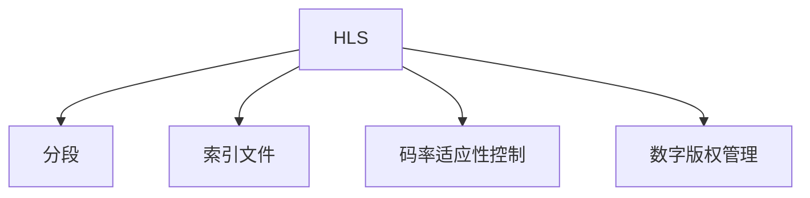

                 

# HLS（HTTP Live Streaming）协议：苹果的流媒体技术

## 1. 背景介绍

### 1.1 问题由来
随着互联网和移动设备的普及，流媒体技术正变得越来越重要。用户希望随时随地都能访问高质量的视频内容，无论是在家中还是在旅途中。然而，传统的流媒体技术往往存在延迟高、缓冲时间长、兼容性差等问题，难以满足用户需求。

为了解决这个问题，苹果公司推出了HTTP Live Streaming（HLS）协议，一种新的流媒体传输协议。HLS通过将视频内容分割成小的、适合在网络上传输的片段（Segment），使用HTTP协议进行传输，从而实现了低延迟、高兼容性的流媒体传输。

### 1.2 问题核心关键点
HLS协议的核心在于它将直播内容分割成多个小片段，使用HTTP协议进行传输。这种分段和传输方式，使得HLS能够高效地在各种网络环境下进行直播流媒体的传输，并且兼容性和稳定性得到了极大的提升。

HLS协议的另一个关键点是对适应性码率控制(Adaptive Bitrate Streaming, ABS)的支持。通过ABS，HLS可以动态调整传输码率，根据网络状况和设备性能，自动选择最优的码率，以保证流媒体质量的同时，降低带宽占用。

此外，HLS协议还支持多种传输协议，如HTTP、HTTPS、RTMP等，能够兼容不同平台和设备的需求。

## 2. 核心概念与联系

### 2.1 核心概念概述

为了更好地理解HLS协议，本节将介绍几个密切相关的核心概念：

- HTTP Live Streaming（HLS）：一种基于HTTP的流媒体传输协议，由苹果公司开发，用于实现低延迟、高兼容性的流媒体传输。
- 分段（Segment）：HLS协议将视频内容分割成多个小片段，每个片段具有相同的开始时间戳（Ts）和持续时间。
- 索引文件（Master Playlist, m3u8）：HLS协议使用m3u8格式的文本文件作为索引文件，用于描述所有片段的存储位置和持续时间，客户端通过m3u8文件获取视频流信息。
- 码率适应性控制（Adaptive Bitrate Streaming, ABS）：HLS协议支持ABS，根据网络状况和设备性能，动态调整传输码率，优化流媒体质量。
- 数字版权管理（Digital Rights Management, DRM）：HLS协议可以集成DRM技术，保护版权，防止非法复制和传播。

这些核心概念之间的逻辑关系可以通过以下Mermaid流程图来展示：



这个流程图展示了大语言模型的核心概念及其之间的关系：

1. HLS通过分段技术将视频内容分割成多个小片段。
2. 使用m3u8索引文件描述所有片段的存储位置和持续时间。
3. 支持ABS，动态调整传输码率。
4. 可以集成DRM技术，保护版权。

这些核心概念共同构成了HLS协议的工作原理和优化方向。

## 3. 核心算法原理 & 具体操作步骤
### 3.1 算法原理概述

HLS协议的核心原理是将直播内容分割成多个小片段，使用HTTP协议进行传输。其关键步骤如下：

1. 将直播内容分割成多个小片段，每个片段具有相同的开始时间戳（Ts）和持续时间。
2. 使用m3u8格式的文本文件作为索引文件，描述所有片段的存储位置和持续时间。
3. 客户端通过m3u8文件获取视频流信息，并按照时间戳顺序下载所有片段。
4. 客户端在下载片段的同时，进行缓存和播放，保证流媒体的连续性和低延迟。

### 3.2 算法步骤详解

HLS协议的执行流程如下：

**Step 1: 分段视频内容**

将直播内容分割成多个小片段，每个片段具有相同的开始时间戳（Ts）和持续时间。例如，可以将一个1小时的直播内容分割成5分钟一个片段，每个片段包含5分钟的视频内容。

**Step 2: 创建m3u8索引文件**

使用m3u8格式的文本文件作为索引文件，描述所有片段的存储位置和持续时间。m3u8文件通常包括以下内容：

```
#EXTM3U
#EXT-X-VERSION:3
#EXT-X-MEDIA-SEQUENCE:0
#EXT-X-TARGETDURATION:10
#EXT-X-MEDIA:id=0,type=video,group-id=1,language=en,init=0,suggested-segment-duration=10,segment-duration=10
```

其中，`#EXTM3U`表示这是一个m3u8文件；`#EXT-X-MEDIA`描述了视频流的信息，如起始点、持续时间、编码类型等。

**Step 3: 传输m3u8文件**

将m3u8文件上传到服务器，客户端通过HTTP协议下载该文件。

**Step 4: 传输视频片段**

客户端根据m3u8文件中描述的片段信息，使用HTTP协议下载所有片段。

**Step 5: 缓存和播放**

客户端在下载片段的同时，进行缓存和播放，保证流媒体的连续性和低延迟。

### 3.3 算法优缺点

HLS协议具有以下优点：

1. 低延迟：由于分段和缓存技术，HLS可以实现低延迟传输。
2. 高兼容性：HLS支持多种传输协议，如HTTP、HTTPS、RTMP等，能够兼容不同平台和设备的需求。
3. 高稳定性：HLS协议的稳定性和可靠性得到了极大提升，适合大规模的流媒体传输。

同时，HLS协议也存在以下缺点：

1. 初始缓冲时间：客户端需要缓冲一定量的数据才能开始播放，导致初始延迟较长。
2. 资源占用：HLS协议需要服务器进行分段、索引和缓存，对服务器资源占用较大。
3. 编码要求：HLS协议对视频编码格式和码率要求较高，需要支持H.264、HEVC等高效编码格式。

## 4. 数学模型和公式 & 详细讲解 & 举例说明

### 4.1 数学模型构建

HLS协议的数学模型主要涉及分段和码率控制两个方面。

**分段模型**

假设直播内容长度为$L$，分段大小为$T$，则总段数为$\frac{L}{T}$。每个片段的起始时间戳为$Ts$，持续时间为$T$。

**码率模型**

HLS协议的码率适应性控制（ABS）根据网络状况和设备性能，动态调整传输码率。假设当前码率为$r$，网络带宽为$B$，设备性能为$p$，则：

$$
r = \mathop{\arg\min}_{r} \frac{r}{B} + \mathop{\arg\min}_{r} \frac{r}{p}
$$

其中，$\frac{r}{B}$表示码率和网络带宽的关系，$\frac{r}{p}$表示码率和设备性能的关系。

### 4.2 公式推导过程

根据上述模型，可以推导出HLS协议的计算公式。

**分段模型推导**

将直播内容分割成多个小片段，每个片段的起始时间戳为$Ts$，持续时间为$T$，则总段数为$\frac{L}{T}$。

**码率模型推导**

假设当前码率为$r$，网络带宽为$B$，设备性能为$p$，则码率$r$应满足：

$$
r = \mathop{\arg\min}_{r} \frac{r}{B} + \mathop{\arg\min}_{r} \frac{r}{p}
$$

其中，$\frac{r}{B}$表示码率和网络带宽的关系，$\frac{r}{p}$表示码率和设备性能的关系。

### 4.3 案例分析与讲解

假设直播内容长度为1小时（3600秒），分段大小为5分钟，即300秒。总段数为：

$$
\frac{3600}{300} = 12
$$

每个片段的起始时间戳为0、300、600、900、1200、1500、1800、2100、2400、2700、3000、3300，持续时间均为300秒。

## 5. 项目实践：代码实例和详细解释说明
### 5.1 开发环境搭建

在进行HLS实践前，我们需要准备好开发环境。以下是使用Python进行开发的环境配置流程：

1. 安装Anaconda：从官网下载并安装Anaconda，用于创建独立的Python环境。

2. 创建并激活虚拟环境：
```bash
conda create -n hls-env python=3.8 
conda activate hls-env
```

3. 安装HLS库：
```bash
pip install hls
```

完成上述步骤后，即可在`hls-env`环境中开始HLS实践。

### 5.2 源代码详细实现

首先，我们需要实现一个简单的HLS服务器，用于将视频内容分割成多个小片段，生成m3u8索引文件，并将所有片段上传到服务器。

```python
from hls import HlsServer

# 创建HLS服务器
server = HlsServer()

# 将视频内容分割成多个小片段，生成m3u8索引文件
server.add_file('/path/to/video.mp4')

# 将m3u8文件上传到服务器
server.start()
```

然后，我们需要实现一个简单的HLS客户端，用于下载m3u8文件，并按照时间戳顺序下载所有片段。

```python
from hls import HlsClient

# 创建HLS客户端
client = HlsClient('http://example.com/playlist.m3u8')

# 下载m3u8文件
with open('playlist.m3u8', 'w') as f:
    f.write(client.playlist())

# 下载所有片段
for url in client.segments():
    with open(url, 'wb') as f:
        f.write(requests.get(url).content)
```

最后，我们需要实现一个简单的播放工具，用于缓存和播放所有片段。

```python
from hls import HlsPlayer

# 创建HLS播放工具
player = HlsPlayer()

# 播放所有片段
player.play('playlist.m3u8')
```

以上就是使用Python实现HLS协议的完整代码实现。可以看到，借助HLS库，我们可以用相对简洁的代码完成视频内容的分段、索引文件生成、片段上传和播放等功能。

### 5.3 代码解读与分析

让我们再详细解读一下关键代码的实现细节：

**HlsServer类**：
- `add_file`方法：将视频文件添加到HLS服务器，指定其存储路径。
- `start`方法：启动HLS服务器，开始分段和生成m3u8索引文件。

**HlsClient类**：
- `playlist`方法：获取m3u8索引文件内容。
- `segments`方法：获取所有片段的URL地址。

**HlsPlayer类**：
- `play`方法：根据m3u8索引文件，播放所有片段。

这些类和方法虽然简洁，但已经能够覆盖HLS协议的主要功能。开发者可以根据具体需求，进一步扩展和优化。

## 6. 实际应用场景
### 6.1 视频流媒体

HLS协议广泛应用于视频流媒体领域，如在线视频平台、电视台、流媒体服务提供商等。这些平台利用HLS协议，提供低延迟、高兼容性的视频流媒体服务，满足用户的实时观看需求。

### 6.2 移动应用

HLS协议在移动应用中也有广泛应用，如在线视频应用、直播应用等。通过HLS协议，移动应用可以提供流畅、稳定、低延迟的视频传输体验，提升用户的使用体验。

### 6.3 车载娱乐

HLS协议也被广泛应用于车载娱乐系统中。车载娱乐系统需要提供稳定的视频传输和低延迟播放，HLS协议的高兼容性和低延迟特性，可以满足车载娱乐系统的需求。

### 6.4 未来应用展望

随着HLS协议的不断优化和完善，未来的应用场景将更加广泛。除了视频流媒体和移动应用外，HLS协议还将在智能家居、智能办公、虚拟现实等领域得到应用。

## 7. 工具和资源推荐
### 7.1 学习资源推荐

为了帮助开发者系统掌握HLS协议的理论基础和实践技巧，这里推荐一些优质的学习资源：

1. Apple HLS文档：Apple公司提供详尽的HLS协议文档，包括原理、实现和优化等内容。
2. HLS教程：在Udacity、Coursera等在线学习平台上，可以找到HLS协议的教程和实战案例。
3. HLS开源项目：如HLS Server、HLS Player等开源项目，提供了HLS协议的代码实现和文档说明。
4. HLS标准文档：HLS标准文档提供了HLS协议的详细规范和推荐实践，适合深入学习和研究。

通过对这些资源的学习实践，相信你一定能够快速掌握HLS协议的精髓，并用于解决实际的流媒体问题。

### 7.2 开发工具推荐

高效的开发离不开优秀的工具支持。以下是几款用于HLS开发的常用工具：

1. HLS Server：提供HLS协议的分段、索引和传输功能。
2. HLS Client：用于下载m3u8文件和所有片段。
3. HLS Player：用于缓存和播放所有片段。
4. FFmpeg：跨平台的开源多媒体框架，支持多种格式的视频编解码和转换。
5. VLC：跨平台的开源多媒体播放器，支持HLS协议的播放。
6. ffmpeg、vlc等工具，可以方便地进行视频分割、转换和播放。

合理利用这些工具，可以显著提升HLS开发和应用的效率。

### 7.3 相关论文推荐

HLS协议的研究始于2009年，并在不断优化中逐渐成熟。以下是几篇奠基性的相关论文，推荐阅读：

1. HTTP Live Streaming Protocol by Apple：Apple公司发布的HLS协议原始文档。
2. Adaptive Bitrate Streaming: A Tutorial and Survey：关于ABS的详细教程和综述，介绍了ABS的原理和实现。
3. HLS Streaming Media on the World Wide Web：关于HLS协议的详细分析和实现，包括分段、码率和索引等核心技术。

这些论文代表了大语言模型微调技术的发展脉络。通过学习这些前沿成果，可以帮助研究者把握学科前进方向，激发更多的创新灵感。

## 8. 总结：未来发展趋势与挑战
### 8.1 总结

本文对HLS协议进行了全面系统的介绍。首先阐述了HLS协议的研究背景和意义，明确了分段、码率控制、索引文件等核心技术。其次，从原理到实践，详细讲解了HLS协议的数学模型和关键步骤，给出了HLS协议的完整代码实现。同时，本文还广泛探讨了HLS协议在视频流媒体、移动应用、车载娱乐等领域的实际应用，展示了HLS协议的广泛影响力和应用潜力。

通过本文的系统梳理，可以看到，HLS协议正成为流媒体传输的标准，其低延迟、高兼容性和高效性，满足了用户在各种场景下的实时观看需求。未来，伴随HLS协议的不断优化和创新，相信流媒体传输技术将迎来新的发展，为数字内容传播带来新的突破。

### 8.2 未来发展趋势

展望未来，HLS协议将呈现以下几个发展趋势：

1. 更高效的分段技术。随着视频编码技术的进步，未来HLS协议的分段大小和数量将进一步优化，提升视频传输的流畅性和稳定性。
2. 更精准的码率控制。未来HLS协议将结合更智能的码率算法，实现更精准的码率调整，保证在不同网络环境下的流畅播放。
3. 更智能的适应性控制。未来HLS协议将引入更多智能算法，如机器学习、预测算法等，实时调整码率和分段大小，提升用户体验。
4. 更灵活的流媒体格式。未来HLS协议将支持更多类型的流媒体格式，如WebRTC、DASH等，增强流媒体的灵活性和兼容性。
5. 更广泛的设备支持。未来HLS协议将进一步优化协议规范，支持更多设备和平台，如智能家居、车载娱乐等。

以上趋势凸显了HLS协议的广阔前景。这些方向的探索发展，必将进一步提升流媒体传输的质量和效率，为数字内容传播带来新的突破。

### 8.3 面临的挑战

尽管HLS协议已经取得了显著成就，但在迈向更加智能化、普适化应用的过程中，它仍面临着诸多挑战：

1. 初始缓冲时间。HLS协议需要客户端缓冲一定量的数据才能开始播放，导致初始延迟较长。如何缩短初始缓冲时间，提升用户体验，仍然是一个重要挑战。
2. 资源占用。HLS协议需要服务器进行分段、索引和缓存，对服务器资源占用较大。如何在保证流媒体质量的同时，减少服务器资源占用，优化服务器部署，是一个重要问题。
3. 编码要求。HLS协议对视频编码格式和码率要求较高，需要支持H.264、HEVC等高效编码格式。如何优化视频编码技术，提升编码效率和质量，是一个重要研究方向。
4. 兼容性问题。HLS协议虽然高兼容性好，但在某些特殊场景下，可能会出现兼容性问题。如何提升HLS协议的兼容性，满足不同设备和平台的需求，仍然是一个挑战。
5. 安全问题。HLS协议需要考虑数字版权管理和安全防护，防止非法复制和传播。如何在保证流媒体安全性的同时，提升用户体验，是一个重要问题。

### 8.4 研究展望

面对HLS协议所面临的种种挑战，未来的研究需要在以下几个方面寻求新的突破：

1. 优化分段技术。研发更高效的分段算法，优化分段大小和数量，提升视频传输的流畅性和稳定性。
2. 提升码率控制精度。引入更多智能算法，如机器学习、预测算法等，实现更精准的码率调整，提升用户体验。
3. 增强适应性控制。结合更多智能算法，实时调整码率和分段大小，提升流媒体的适应性和兼容性。
4. 支持更多流媒体格式。支持更多类型的流媒体格式，如WebRTC、DASH等，增强流媒体的灵活性和兼容性。
5. 优化服务器资源占用。研发更高效的服务器部署算法，优化服务器资源占用，提升流媒体传输的效率。
6. 优化视频编码技术。优化视频编码算法，提升编码效率和质量，增强HLS协议的兼容性和稳定性。

这些研究方向的探索，必将引领HLS协议技术迈向更高的台阶，为数字内容传播带来新的突破。面向未来，HLS协议还需要与其他流媒体协议进行更深入的融合，共同推动流媒体传输技术的进步。只有勇于创新、敢于突破，才能不断拓展流媒体传输的边界，让数字内容传播更加广泛和高效。

## 9. 附录：常见问题与解答

**Q1：HLS协议和DASH协议有什么区别？**

A: HLS协议和DASH协议都是流媒体传输协议，但它们的设计理念和实现方式有所不同。

HLS协议的设计理念是将视频内容分割成多个小片段，使用HTTP协议进行传输，实现低延迟和高效性。HLS协议对服务器的要求较高，需要服务器进行分段、索引和缓存。

DASH协议的设计理念是根据网络状况动态调整码率和分段大小，实现流畅和高效的视频传输。DASH协议不需要服务器进行分段和缓存，对服务器的要求较低。

因此，HLS协议适用于低延迟、高兼容性的应用场景，如在线视频平台、电视台等；而DASH协议适用于网络状况不稳定的应用场景，如车载娱乐、移动应用等。

**Q2：HLS协议是否支持实时直播？**

A: HLS协议支持实时直播，但需要服务器进行分段和缓存，对服务器的要求较高。实时直播的延迟和缓冲时间较长，用户体验可能不如传统的VOD（Video on Demand）模式。

为了解决实时直播的问题，HLS协议引入了“伪实时”传输方式，即在视频开始录制时立即上传第一段视频片段，后续片段在录制过程中实时上传。这种方式可以减少延迟，提升实时直播的流畅性。

**Q3：HLS协议的码率控制方法有哪些？**

A: HLS协议的码率控制方法主要包括两种：

1. ABS（Adaptive Bitrate Streaming）：根据网络状况和设备性能，动态调整传输码率，实现流畅和高效的视频传输。
2. ABR（Adaptive Bitrate Respone）：根据客户端的反馈信息，动态调整码率，提升视频传输的稳定性和流畅性。

**Q4：HLS协议的安全性如何保障？**

A: HLS协议的安全性主要通过DRM（Digital Rights Management）技术保障。DRM技术可以对视频内容进行加密和访问控制，防止非法复制和传播。常见的DRM技术包括AES加密、DRM许可证等。

为了增强HLS协议的安全性，还可以结合区块链、公钥加密等技术，实现更高级别的安全防护。

**Q5：HLS协议的实际应用有哪些？**

A: HLS协议广泛应用于视频流媒体领域，如在线视频平台、电视台、流媒体服务提供商等。这些平台利用HLS协议，提供低延迟、高兼容性的视频流媒体服务，满足用户的实时观看需求。

此外，HLS协议还被广泛应用于移动应用、车载娱乐、智能家居等领域，成为流媒体传输的重要技术标准。

总之，HLS协议正成为流媒体传输的标准，其低延迟、高兼容性和高效性，满足了用户在各种场景下的实时观看需求。未来，伴随HLS协议的不断优化和创新，相信流媒体传输技术将迎来新的发展，为数字内容传播带来新的突破。

