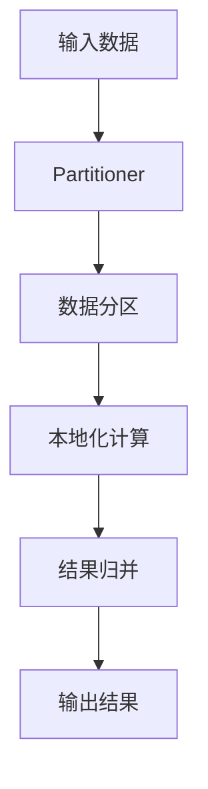

# Spark Partitioner原理与代码实例讲解

## 1. 背景介绍

### 1.1 问题的由来

在大数据处理领域,Spark作为一种快速、通用的计算引擎,已经广泛应用于各种场景。然而,随着数据量的不断增长,如何高效地处理海量数据成为了一个关键挑战。在Spark中,Partitioner(分区器)扮演着至关重要的角色,它决定了数据如何在集群中进行分区和分布,直接影响着数据处理的效率和性能。

### 1.2 研究现状

目前,Spark提供了多种内置的Partitioner,如HashPartitioner、RangePartitioner等。这些分区器在不同场景下具有不同的优缺点。例如,HashPartitioner适用于键值对数据的分区,但可能会导致数据倾斜;而RangePartitioner则更适合于排序数据的分区,但对于高基数的数据可能会产生过多的小文件。因此,选择合适的Partitioner对于优化Spark作业的性能至关重要。

### 1.3 研究意义

深入理解Spark Partitioner的原理和实现,对于开发人员来说具有重要意义。它不仅有助于更好地利用Spark的分区机制,提高数据处理的效率,还可以根据特定的业务场景和数据特征,设计和实现自定义的Partitioner,进一步优化Spark作业的性能。

### 1.4 本文结构

本文将从以下几个方面深入探讨Spark Partitioner:

1. 核心概念与联系
2. 核心算法原理与具体操作步骤
3. 数学模型和公式详细讲解与举例说明
4. 项目实践:代码实例和详细解释说明
5. 实际应用场景
6. 工具和资源推荐
7. 总结:未来发展趋势与挑战
8. 附录:常见问题与解答

## 2. 核心概念与联系

在深入探讨Spark Partitioner之前,我们需要先了解一些核心概念及它们之间的关系。

### 2.1 Partition(分区)

Partition是Spark中最小的数据单元,它是一个逻辑上的概念,表示数据集被分割成多个部分。每个Partition都包含一部分数据,并且可以独立地进行计算和存储。

### 2.2 Partitioner(分区器)

Partitioner是Spark中用于确定数据如何进行分区的组件。它定义了一个函数,将给定的键(Key)映射到一个分区ID(Partition ID)。通过Partitioner,Spark可以将具有相同键的数据分配到同一个分区中,从而实现数据的本地化计算和高效处理。

### 2.3 Shuffle

Shuffle是Spark中一个重要的概念,它指的是在某些转换操作(如reduceByKey、join等)中,需要根据Partitioner对数据进行重新分区和洗牌的过程。Shuffle过程通常涉及大量的数据移动和网络传输,因此会对作业性能产生显著影响。

### 2.4 关系总结

这些核心概念之间的关系可以总结如下:

1. Partition是Spark中最小的数据单元,数据集被划分为多个Partition。
2. Partitioner决定了数据如何被分区,即将键映射到特定的Partition ID。
3. 在Shuffle过程中,Spark根据Partitioner对数据进行重新分区和洗牌,以实现高效的数据处理。

了解这些核心概念及其关系,有助于我们更好地理解Spark Partitioner的作用和原理。

## 3. 核心算法原理与具体操作步骤

### 3.1 算法原理概述

Spark Partitioner的核心算法原理可以概括为以下几个步骤:

1. **键映射**: Partitioner定义了一个函数,将给定的键(Key)映射到一个分区ID(Partition ID)。
2. **数据分区**: 根据键映射的结果,Spark将具有相同键的数据分配到同一个分区中。
3. **本地化计算**: 由于相同键的数据被分配到同一个分区,因此可以在该分区所在的节点上进行本地化计算,避免了不必要的数据移动和网络传输。
4. **结果归并**: 在完成本地化计算后,Spark会将各个分区的结果进行归并,得到最终的计算结果。

这个过程可以用一个简单的示意图来表示:

### 3.2 算法步骤详解

接下来,我们将详细解释Spark Partitioner算法的具体步骤。

#### 步骤1: 键映射

Partitioner定义了一个`getPartition`函数,用于将给定的键(Key)映射到一个分区ID(Partition ID)。这个函数的实现方式因不同的Partitioner而有所不同,但通常会涉及到哈希函数或范围划分等技术。

例如,HashPartitioner使用了`murmur3_x86_32`哈希函数,将键哈希到一个整数值,然后对分区数量取模,得到分区ID。而RangePartitioner则根据键的范围将其映射到对应的分区ID。

#### 步骤2: 数据分区

在完成键映射后,Spark会根据映射结果将具有相同键的数据分配到同一个分区中。这个过程通常发生在Shuffle阶段,Spark会对数据进行重新分区和洗牌。

具体来说,Spark会将每个键值对发送到对应的分区ID所在的节点,并在该节点上进行本地化计算。这样可以避免不必要的数据移动和网络传输,提高计算效率。

#### 步骤3: 本地化计算

由于相同键的数据被分配到同一个分区,因此可以在该分区所在的节点上进行本地化计算。这种计算方式可以充分利用数据本地性,避免了大量的数据移动和网络传输,从而提高了计算效率。

在本地化计算过程中,Spark会对每个分区中的数据进行相应的转换操作,如reduceByKey、join等。这些操作可以并行执行,充分利用集群的计算资源。

#### 步骤4: 结果归并

在完成本地化计算后,Spark会将各个分区的结果进行归并,得到最终的计算结果。这个过程通常涉及到网络传输和数据移动,但由于数据量已经大幅减小,因此对性能影响较小。

### 3.3 算法优缺点

Spark Partitioner算法具有以下优点:

1. **数据本地性**: 通过将相同键的数据分配到同一个分区,可以实现本地化计算,避免不必要的数据移动和网络传输,提高计算效率。
2. **并行计算**: 由于每个分区可以独立进行计算,因此可以充分利用集群的计算资源,实现并行计算。
3. **灵活性**: Spark提供了多种内置的Partitioner,并支持自定义Partitioner,可以根据具体的业务场景和数据特征进行优化。

但同时,Spark Partitioner算法也存在一些缺点:

1. **数据倾斜**: 如果数据分布不均匀,可能会导致某些分区的数据量过大,而其他分区的数据量较小,从而影响计算效率。
2. **Shuffle开销**: Shuffle过程涉及大量的数据移动和网络传输,可能会成为性能瓶颈,尤其是在处理大数据集时。
3. **内存消耗**: 在Shuffle过程中,Spark需要将中间结果存储在内存中,对内存的消耗较大,可能会导致内存不足的问题。

### 3.4 算法应用领域

Spark Partitioner算法广泛应用于各种大数据处理场景,包括但不限于:

1. **数据分析**: 在数据分析领域,Partitioner可以用于对海量数据进行高效的聚合、过滤和转换操作。
2. **机器学习**: 在机器学习领域,Partitioner可以用于对训练数据进行分区,实现并行化的模型训练和预测。
3. **图计算**: 在图计算领域,Partitioner可以用于对图数据进行分区,实现高效的图遍历和图分析算法。
4. **流式计算**: 在流式计算领域,Partitioner可以用于对实时数据流进行分区,实现低延迟的数据处理和分析。

总的来说,Spark Partitioner算法为大数据处理提供了一种高效、灵活的分区机制,在各种场景下都有广泛的应用。

## 4. 数学模型和公式详细讲解与举例说明

在探讨Spark Partitioner的算法原理时,我们需要涉及一些数学模型和公式。本节将详细介绍这些模型和公式,并通过具体案例进行讲解和说明。

### 4.1 数学模型构建

在Spark Partitioner中,我们需要构建一个数学模型来描述键到分区ID的映射关系。这个模型通常基于哈希函数或范围划分等技术。

#### 4.1.1 哈希分区模型

对于基于哈希的Partitioner,如HashPartitioner,我们可以构建如下数学模型:

$$
partition(key) = hashFunction(key) \bmod numPartitions
$$

其中:

- $key$表示输入的键
- $hashFunction$表示用于计算哈希值的哈希函数,如`murmur3_x86_32`
- $numPartitions$表示分区的总数量

通过这个模型,我们可以将键映射到一个介于`[0, numPartitions-1]`之间的分区ID。

#### 4.1.2 范围分区模型

对于基于范围划分的Partitioner,如RangePartitioner,我们可以构建如下数学模型:

$$
partition(key) = \begin{cases}
0, & \text{if } key < lowerBound_0\
i, & \text{if } lowerBound_i \leq key < upperBound_i\
numPartitions-1, & \text{if } key \geq upperBound_{numPartitions-1}
\end{cases}
$$

其中:

- $key$表示输入的键
- $lowerBound_i$和$upperBound_i$分别表示第$i$个分区的下界和上界
- $numPartitions$表示分区的总数量

通过这个模型,我们可以将键映射到一个介于`[0, numPartitions-1]`之间的分区ID,并且具有相同范围的键会被映射到同一个分区。

### 4.2 公式推导过程

接下来,我们将详细推导上述数学模型中涉及的公式,以加深对它们的理解。

#### 4.2.1 哈希分区公式推导

对于哈希分区模型,我们需要推导出如何将键映射到分区ID的公式。

首先,我们使用哈希函数`hashFunction`计算键的哈希值:

$$
hashValue = hashFunction(key)
$$

然后,我们将哈希值对分区数量`numPartitions`取模,得到分区ID:

$$
partitionId = hashValue \bmod numPartitions
$$

将上述两个步骤合并,我们可以得到最终的公式:

$$
partition(key) = hashFunction(key) \bmod numPartitions
$$

这个公式保证了具有相同键的数据将被映射到同一个分区ID,从而实现了数据的本地化计算。

#### 4.2.2 范围分区公式推导

对于范围分区模型,我们需要推导出如何将键映射到分区ID的公式。

首先,我们定义了每个分区的下界和上界:

$$
lowerBound_0, upperBound_0, lowerBound_1, upperBound_1, \ldots, lowerBound_{numPartitions-1}, upperBound_{numPartitions-1}
$$

其中,下界和上界满足以下关系:

$$
lowerBound_0 < upperBound_0 \leq lowerBound_1 < upperBound_1 \leq \ldots \leq lowerBound_{numPartitions-1} < upperBound_{numPartitions-1}
$$

然后,我们根据键的值判断它属于哪个范围,从而确定其对应的分区ID:

$$
partition(key) = \begin{cases}
0, & \text{if } key < lowerBound_0\
i, & \text{if } lowerBound_i \leq key < upperBound_i\
numPartitions-1, & \text{if } key \geq upperBound_{numPartitions-1}
\end{cases}
$$

这个公式保证了具有相同范围的键将被映射到同一个分区ID,从而实现了数据的本地化计算。

### 4.3 案例分析与讲解

为了更好地理解上述数学模型和公式,我们将通过一些具体案例进行分析和讲解。

#### 4.3.1 