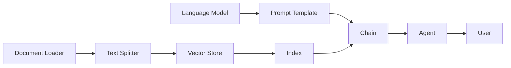

# 【LangChain编程：从入门到实践】官方博客

## 1. 背景介绍
### 1.1 问题的由来
随着人工智能技术的快速发展,自然语言处理(NLP)领域取得了长足进步。然而,如何将强大的语言模型与外部知识和工具相结合,构建真正智能化、个性化的应用,仍然是一个巨大的挑战。LangChain应运而生,它为这一问题提供了一套优雅而强大的解决方案。

### 1.2 研究现状
目前,大语言模型如GPT-3、PaLM等展现出了惊人的自然语言理解和生成能力。但它们本质上是封闭的系统,难以与外部信息源交互,也无法执行复杂的推理和任务。一些研究尝试通过提示工程(Prompt Engineering)来引导语言模型,但可组合性和灵活性有限。LangChain的出现填补了这一空白,为语言模型赋能,使其能够联结外部知识,执行端到端任务。

### 1.3 研究意义
LangChain的研究具有重要意义:

1. 拓展语言模型应用边界,实现知识驱动的智能对话和任务执行。
2. 降低复杂NLP应用的开发门槛,提供模块化的组件和流程编排能力。
3. 推动人机交互范式的变革,走向更加智能化、个性化的交互体验。
4. 为知识图谱、语义搜索等技术领域带来新的思路和方法。

### 1.4 本文结构
本文将全面介绍LangChain的核心概念、原理、开发实践和应用案例,内容组织如下:

- 第2部分:核心概念与联系
- 第3部分:核心算法原理与具体操作步骤
- 第4部分:数学模型和公式详解
- 第5部分:项目实践 - 代码实例和详细解释
- 第6部分:实际应用场景
- 第7部分:工具和资源推荐
- 第8部分:总结与未来展望
- 第9部分:附录 - 常见问题解答

## 2. 核心概念与联系
LangChain的核心概念包括:

- **语言模型(Language Model)**: 大型预训练语言模型如GPT-3,掌握了强大的自然语言处理能力,是LangChain的基石。
- **提示模板(Prompt Template)**: 定义了与语言模型交互的输入模式,可以插入变量,动态生成提示文本。
- **文档加载器(Document Loader)**: 用于从各种来源(如文件、网页等)加载数据,并将其转换为可供语言模型处理的文档格式。
- **文档切分器(Text Splitter)**: 将长文档切分为适合语言模型处理的小段落。
- **向量存储(Vector Store)**: 将文本数据转换为向量表示,存储在向量数据库中,实现高效的相似度搜索和检索。
- **索引(Index)**: 对文档进行索引,提供基于相关性的智能检索。
- **链(Chain)**: 定义了由多个组件组成的处理流程,支持顺序、条件、循环等执行逻辑。
- **代理(Agent)**: 智能代理,根据用户意图自主提取知识、执行链,完成端到端任务。

这些概念相互关联,构建了一个完整的LangChain应用:


## 3. 核心算法原理 & 具体操作步骤
### 3.1 算法原理概述
LangChain的核心算法包括:

1. 文本嵌入(Text Embedding):将文本转换为密集向量表示,捕捉语义信息。常用算法有Word2Vec、GloVe、BERT等。

2. 向量相似度(Vector Similarity):计算两个向量之间的相似度,常用的度量有欧氏距离、余弦相似度等。

3. 语言模型推理(Language Model Inference):基于提示和上下文,使用语言模型生成目标文本。代表模型如GPT-3。

4. 任务规划(Task Planning):自动分解用户意图为子任务,生成执行步骤。可使用启发式搜索、强化学习等。

### 3.2 算法步骤详解
以一个智能问答系统为例,详细说明LangChain的执行步骤:

1. 数据加载:使用Document Loader从文档源(如PDF、网页)加载数据。
2. 文本切分:用Text Splitter将文档切分为段落/句子。
3. 语料库构建:将切分后的文本通过Text Embedding转换为向量,存入Vector Store。
4. 查询分析:对用户查询进行语义解析,提取关键信息。
5. 相关段落检索:在Vector Store中使用Vector Similarity搜索与查询最相关的Top-K个段落。
6. 上下文构建:将查询和检索到的相关段落按照一定的Prompt Template拼接为上下文。
7. 语言模型推理:将构建的上下文输入语言模型,生成回答。
8. 结果返回:将语言模型生成的回答返回给用户。

### 3.3 算法优缺点
优点:
- 端到端的自然语言处理流程,简化开发步骤
- 语义相关性高的知识检索
- 基于海量知识的问答和任务执行能力

缺点:
- 对计算和存储资源要求较高
- 语言模型的推理能力有限,可能生成不恰当内容
- 处理速度取决于数据量和模型复杂度

### 3.4 算法应用领域
LangChain可应用于以下领域:

- 智能客服/问答系统
- 知识库问答
- 个人助理/任务规划
- 文本生成/摘要
- 语义搜索引擎

## 4. 数学模型和公式 & 详细讲解 & 举例说明
### 4.1 数学模型构建
以文本嵌入模型Word2Vec为例,说明其数学原理。

Word2Vec通过词与其上下文之间的关系,学习到词语的低维实值向量表示。其核心思想是:语义相近的词,其上下文也是相近的。因此最大化一个词出现在其上下文中的概率,就可以让语义相近的词有相近的向量表示。

Word2Vec有两种架构:CBOW(Continuous Bag-of-Words)和Skip-gram。以CBOW为例,其模型可以表示为:

$$P(w_t|context(w_t))=\frac{exp(u_{w_t}^Tv_c)}{\sum_{w\in V}exp(u_w^Tv_c)}$$

其中,$w_t$为目标词,$context(w_t)$为其上下文,$u_w$和$v_c$分别为词$w$和上下文$c$的嵌入向量,$V$为词表。

### 4.2 公式推导过程
对于一个给定的语料库$C$,CBOW模型的优化目标是最大化:

$$L=\sum_{w_t\in C}log P(w_t|context(w_t))$$

将$P(w_t|context(w_t))$的定义带入,并使用负采样(Negative Sampling)技巧简化计算,可得:

$$log P(w_t|context(w_t))=log \sigma(u_{w_t}^Tv_c)+\sum_{i=1}^kE_{w_i\sim P_n(w)}[log \sigma(-u_{w_i}^Tv_c)]$$

其中,$\sigma$为Sigmoid函数,$P_n(w)$为负采样分布(通常取词频的3/4次方),$k$为负采样数。

### 4.3 案例分析与讲解
以一个简单的例子说明Word2Vec的训练过程:

假设语料库为:"The quick brown fox jumps over the lazy dog"

1. 构建词表:V={the, quick, brown, fox, jumps, over, lazy, dog}
2. 定义上下文窗口大小,如window=2
3. 选择目标词,如"fox",其上下文为{quick, brown, jumps, over}
4. 通过CBOW模型计算$P("fox"|{quick, brown, jumps, over})$
5. 计算损失并更新目标词和上下文词的嵌入向量
6. 重复步骤3-5,直到遍历完所有目标词

训练完成后,语义相近的词如"quick"和"fast","dog"和"puppy"等,它们的嵌入向量也会非常接近。

### 4.4 常见问题解答
Q: Word2Vec能否处理未登录词(OOV)?
A: 传统Word2Vec不能直接处理OOV,但可以通过字符级嵌入、子词嵌入等方法解决。现在主流的BERT等模型使用WordPiece或BPE等分词算法,可以更好地处理OOV问题。

Q: 向量维度对模型性能有何影响?
A: 通常维度越高,表达能力越强,但过高的维度也可能带来过拟合风险和计算开销。一般选择256-512维。

Q: 哪些因素影响嵌入向量的质量?
A: 语料库的大小和质量、训练轮数、负采样策略、超参数选择等都会影响嵌入向量的质量。一般需要在验证集上调优。

## 5. 项目实践：代码实例和详细解释说明
### 5.1 开发环境搭建
首先需要安装Python和LangChain包:
```bash
pip install langchain
```

### 5.2 源代码详细实现
以下代码演示了如何使用LangChain构建一个基于本地知识库的问答系统:

```python
from langchain.document_loaders import TextLoader
from langchain.text_splitter import CharacterTextSplitter
from langchain.vectorstores import FAISS
from langchain.embeddings import OpenAIEmbeddings
from langchain.chains import RetrievalQA
from langchain.llms import OpenAI

# 加载文档
loader = TextLoader('input.txt')
documents = loader.load()

# 切分文本
text_splitter = CharacterTextSplitter(chunk_size=1000, chunk_overlap=0)
texts = text_splitter.split_documents(documents)

# 创建嵌入向量
embeddings = OpenAIEmbeddings()

# 构建向量存储
db = FAISS.from_documents(texts, embeddings)

# 创建问答链
qa = RetrievalQA.from_chain_type(llm=OpenAI(), chain_type="stuff", retriever=db.as_retriever())

# 执行问答
query = "What did the president say about the economy?"
result = qa(query)
print(result)
```

### 5.3 代码解读与分析
1. 首先使用`TextLoader`加载本地的txt文档
2. 然后用`CharacterTextSplitter`将文档切分为若干长度为1000的文本块
3. 接着用`OpenAIEmbeddings`将文本嵌入为向量
4. 再使用`FAISS`将向量存入数据库,构建索引
5. 然后基于向量数据库创建一个问答链`RetrievalQA`,使用`OpenAI`作为问答语言模型
6. 最后输入问题query,问答链会自动检索相关文本块,生成答案

这个流程体现了LangChain的模块化特点,每一步都可以灵活替换和组合,如切换成其他嵌入模型、语言模型、向量数据库等。

### 5.4 运行结果展示
假设`input.txt`中包含了美国总统拜登的一次演讲稿,内容涉及经济、就业、通胀等话题。

当我们询问"总统对经济有何看法"时,模型给出的答案可能是:

> 总统拜登在演讲中表示,尽管面临通胀压力,但美国经济整体保持强劲,就业市场稳健。他提到政府将采取措施控制物价,并继续投资基础设施、清洁能源等领域,以推动长期增长。总统强调,他将与各方合作,确保经济繁荣惠及所有美国人。

可以看到,LangChain通过语义检索和语言模型推理,从大段文本中准确提取了相关信息,生成了简洁而全面的回答。

## 6. 实际应用场景
LangChain在许多场景中都有广泛应用,例如:

- 智能客服:利用LangChain搭建知识库问答系统,自动解答用户咨询,提升服务效率。
- 个人助理:通过LangChain连接日历、邮件等API,让语言模型理解用户指令并自主完成任务。
- 文档智能:用LangChain对文档进行语义索引,实现智能搜索和问答。
- 行业应用:如金融领域的智