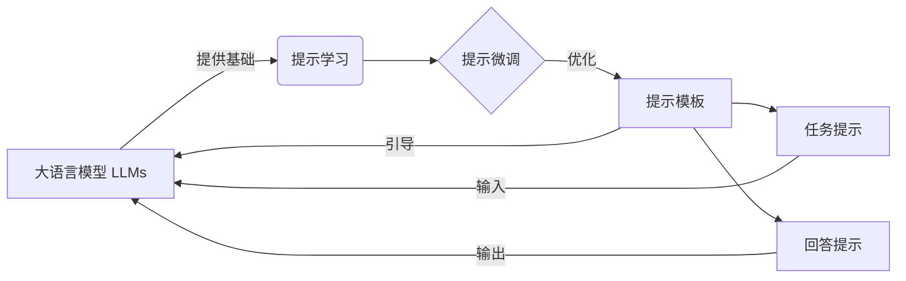

# 大语言模型原理与工程实践：提示微调

## 1. 背景介绍
### 1.1 问题的由来
近年来，随着深度学习技术的飞速发展，大规模语言模型(Large Language Models, LLMs)在自然语言处理领域取得了令人瞩目的成就。从GPT-3到ChatGPT，LLMs展现出了惊人的语言理解和生成能力，引发了学术界和工业界的广泛关注。然而，如何有效地利用和改进LLMs，使其更好地适应特定任务，仍然是一个亟待解决的问题。

### 1.2 研究现状
目前，针对LLMs的研究主要集中在模型架构优化、训练数据扩充、知识融合等方面。其中，提示微调(Prompt Tuning)作为一种新兴的LLMs应用范式，通过设计合适的提示模板和少量训练数据，可以在不改变原始模型参数的情况下，快速适应新任务，取得了优异的性能表现。但提示微调仍面临诸多挑战，如提示工程的复杂性、任务转移能力有限等。

### 1.3 研究意义
深入研究大语言模型的提示微调技术，对于拓展LLMs的应用范围、提升模型性能、降低训练成本等方面具有重要意义。通过探索提示微调的理论基础和实践经验，可以为构建更加智能、高效、灵活的自然语言处理系统提供关键技术支撑，推动人工智能在教育、医疗、金融等领域的应用发展。

### 1.4 本文结构
本文将围绕大语言模型提示微调的原理和实践展开深入探讨。第2部分介绍相关核心概念；第3部分阐述提示微调的算法原理和操作步骤；第4部分建立数学模型并推导相关公式；第5部分给出代码实例和详细解释；第6部分分析实际应用场景；第7部分推荐相关工具和资源；第8部分总结全文并展望未来研究方向；第9部分为常见问题解答的附录。

## 2. 核心概念与联系
- 大语言模型(Large Language Models, LLMs)：指基于海量文本数据训练的大规模神经网络模型，如GPT-3、PaLM等，具有强大的语言理解和生成能力。
- 提示学习(Prompt Learning)：通过设计适当的提示模板，引导LLMs执行特定任务的学习范式。可分为提示设计和提示优化两个阶段。
- 提示微调(Prompt Tuning)：fixing预训练LLMs的参数，只微调输入提示的连续嵌入向量，使LLMs适应下游任务的一种轻量级参数高效微调方法。
- 提示模板(Prompt Template)：由离散词语和连续嵌入向量构成的模板化输入序列，用于引导LLMs执行特定任务。
- 任务提示(Task Prompt)：针对特定任务设计的提示模板，通常包含任务描述、输入输出格式等信息。
- 回答提示(Answer Prompt)：对应任务提示中的答案部分，由LLMs根据输入和指令生成。

下图展示了这些核心概念之间的关系：



## 3. 核心算法原理 & 具体操作步骤
### 3.1 算法原理概述
提示微调的核心思想是通过设计合适的提示模板，在固定预训练LLMs参数的情况下，只微调输入提示中的连续嵌入向量，使得模型能够快速适应新任务。具体而言，将任务描述和示例等信息编码为提示模板，然后将其转化为连续嵌入向量，与原始输入拼接后喂入LLMs。通过反向传播优化提示嵌入向量，使LLMs在新任务上达到最优性能。

### 3.2 算法步骤详解
1. 设计提示模板：根据任务特点，设计包含任务描述、输入输出格式等信息的提示模板。
2. 初始化提示嵌入：将提示模板转化为连续嵌入向量，初始化为随机值或从预训练词嵌入中获取。
3. 拼接输入序列：将提示嵌入与原始输入拼接，构成完整的输入序列。
4. 前向传播：将输入序列喂入固定参数的LLMs，计算输出概率分布。
5. 计算损失：基于输出概率分布和真实标签，计算交叉熵损失函数。
6. 反向传播：固定LLMs参数，根据损失函数计算提示嵌入的梯度，并用优化器更新提示嵌入。
7. 迭代优化：重复步骤3-6，直到提示嵌入收敛或达到预设的迭代次数。
8. 测试评估：使用优化后的提示嵌入和固定的LLMs在测试集上进行推理，评估模型性能。

### 3.3 算法优缺点
优点：
- 参数高效：只需优化少量提示嵌入参数，无需微调LLMs的海量参数，大大降低了计算开销。
- 快速适应：通过设计合适的提示，可以在少量训练数据上快速适应新任务，实现样本高效学习。
- 灵活多样：提示模板的设计具有很大的灵活性，可以引入领域知识、常识等外部信息，增强模型的泛化能力。

缺点：
- 提示工程复杂：设计高质量的提示模板需要一定的经验和技巧，对提示工程师的要求较高。
- 任务转移能力有限：针对特定任务优化的提示嵌入可能难以迁移到其他任务，泛化能力有待提高。
- 对模型架构依赖：提示微调的有效性依赖于LLMs的架构，不同模型之间的提示可能不通用。

### 3.4 算法应用领域
提示微调可广泛应用于各种自然语言处理任务，如：
- 文本分类：情感分析、主题分类、意图识别等。
- 信息抽取：命名实体识别、关系抽取、事件抽取等。
- 问答系统：开放域问答、阅读理解、对话系统等。
- 文本生成：摘要生成、机器翻译、对联生成等。

## 4. 数学模型和公式 & 详细讲解 & 举例说明
### 4.1 数学模型构建
给定预训练的LLMs $M$，其参数为 $\theta$。对于特定任务 $\mathcal{T}$，设计提示模板 $\mathcal{P}$，将其转化为 $d$ 维连续嵌入向量 $e \in \mathbb{R}^{d}$。对于任务中的输入文本 $x$，构造提示后的输入序列 $\tilde{x} = [e; x]$，其中 $[\cdot;\cdot]$ 表示拼接操作。目标是优化提示嵌入 $e$，最小化任务损失函数 $\mathcal{L}_{\mathcal{T}}$：

$$
\min_{e} \mathcal{L}_{\mathcal{T}}(M_{\theta}(\tilde{x}), y)
$$

其中 $y$ 为真实标签，$M_{\theta}(\cdot)$ 表示固定参数 $\theta$ 的LLMs的前向计算。

### 4.2 公式推导过程
对于分类任务，损失函数可选用交叉熵损失：

$$
\mathcal{L}_{\mathcal{T}}(M_{\theta}(\tilde{x}), y) = -\sum_{i=1}^{C} y_i \log p(y_i|\tilde{x};\theta)
$$

其中 $C$ 为类别数，$y_i$ 为真实标签的one-hot向量表示，$p(y_i|\tilde{x};\theta)$ 为LLMs输出的第 $i$ 类的概率。

根据链式法则，提示嵌入 $e$ 的梯度为：

$$
\frac{\partial \mathcal{L}_{\mathcal{T}}}{\partial e} = \frac{\partial \mathcal{L}_{\mathcal{T}}}{\partial p(y|\tilde{x};\theta)} \cdot \frac{\partial p(y|\tilde{x};\theta)}{\partial \tilde{x}} \cdot \frac{\partial \tilde{x}}{\partial e}
$$

其中 $\frac{\partial \mathcal{L}_{\mathcal{T}}}{\partial p(y|\tilde{x};\theta)}$ 可通过自动微分求得，$\frac{\partial p(y|\tilde{x};\theta)}{\partial \tilde{x}}$ 由LLMs的前向传播过程决定，$\frac{\partial \tilde{x}}{\partial e}$ 为常数1。

利用梯度下降法更新提示嵌入：

$$
e \leftarrow e - \alpha \cdot \frac{\partial \mathcal{L}_{\mathcal{T}}}{\partial e}
$$

其中 $\alpha$ 为学习率。重复更新直至收敛或达到最大迭代次数。

### 4.3 案例分析与讲解
以情感分类任务为例，假设输入文本 $x$ 为"This movie is amazing!"，真实标签 $y$ 为"positive"。设计提示模板 $\mathcal{P}$ 为"Classify the sentiment of the following text: "，并将其转化为提示嵌入 $e$。

构造提示后的输入序列 $\tilde{x}$ 为"Classify the sentiment of the following text: This movie is amazing!"，喂入LLMs $M_{\theta}$ 进行前向计算，得到输出概率分布 $p(y|\tilde{x};\theta)$。

计算损失函数 $\mathcal{L}_{\mathcal{T}}$，并通过反向传播计算提示嵌入 $e$ 的梯度 $\frac{\partial \mathcal{L}_{\mathcal{T}}}{\partial e}$。利用梯度下降法更新 $e$，不断迭代优化直至收敛。

最终得到优化后的提示嵌入 $e^*$，在测试集上使用 $e^*$ 构造输入序列，并用固定参数的LLMs进行推理，评估模型在情感分类任务上的性能。

### 4.4 常见问题解答
Q1: 提示嵌入的维度 $d$ 如何选取？
A1: 提示嵌入的维度通常与LLMs的词嵌入维度一致，如768或1024。也可以通过实验比较不同维度的性能来选择最优值。

Q2: 提示模板应该包含哪些内容？
A2: 提示模板应包含任务描述、输入输出格式、示例等信息，以明确告知LLMs要执行的任务。具体内容可根据任务特点和LLMs的特性进行设计。

Q3: 提示嵌入的初始化策略有哪些？
A3: 提示嵌入可以随机初始化，也可以从预训练词嵌入中获取与提示模板相关的词向量作为初始值。合适的初始化有助于加速收敛和提高性能。

Q4: 提示微调对训练数据的要求是什么？
A4: 与传统的微调方法相比，提示微调通常只需要较少的训练数据即可达到较好的性能。但数据质量对提示微调的效果影响较大，需要选择有代表性、覆盖全面的高质量数据。

## 5. 项目实践：代码实例和详细解释说明
### 5.1 开发环境搭建
- Python 3.8+
- PyTorch 1.10+
- Transformers 4.20+
- CUDA 11.3+

安装依赖库：
```bash
pip install torch transformers
```

### 5.2 源代码详细实现
下面给出了提示微调的PyTorch实现代码，以情感分类任务为例：

```python
import torch
from transformers import AutoTokenizer, AutoModelForSequenceClassification

# 加载预训练LLMs和分词器
model_name = "bert-base-uncased"
tokenizer = AutoTokenizer.from_pretrained(model_name)
model = AutoModelForSequenceClassification.from_pretrained(model_name)

# 设计提示模板
prompt_template = "Classify the sentiment of the following text: "

# 定义优化器和损失函数
optimizer = torch.optim.AdamW(model.parameters(), lr=1e-5)
loss_fn = torch.nn.CrossEntropyLoss()

# 训练循环
for epoch in range(num_epochs):
    for batch in train_dataloader:
        # 构造输入序列
        inputs = tokenizer(prompt_template + batch["text"],