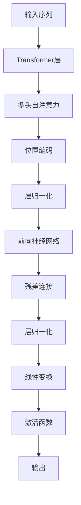

                 

# LLM上下文长度持续突破

> 关键词：自然语言处理,Transformer,上下文窗口,自注意力机制,深度学习

## 1. 背景介绍

在深度学习技术日益普及的今天，自然语言处理（NLP）作为其中的一个重要分支，已经成为研究的热点。尤其是大语言模型（Large Language Models, LLMs）的发展，标志着NLP进入了一个新的时代。然而，尽管LLMs在许多任务上取得了突破性的成绩，但它们的上下文长度限制仍是其发展的一大瓶颈。本文将详细介绍上下文长度的持续突破及其背后的算法原理，并通过实际案例和代码实例进行详细讲解。

## 2. 核心概念与联系

### 2.1 核心概念概述

在深度学习中，上下文长度指的是模型能够处理的最大输入序列长度。对于自然语言处理来说，这通常被定义为模型能够同时处理的句子或段落的最大长度。在传统的循环神经网络（RNNs）中，上下文长度受限于网络的结构设计，一般只能处理几百个词。然而，随着Transformer的引入，上下文长度得到了显著的提升，甚至可以达到数千乃至数万个词。

Transformer的核心是自注意力机制，它能够高效地处理长序列数据。自注意力机制通过计算输入序列中每个位置与其他位置之间的相似度，自动学习到序列中各部分的关联性，从而实现对长序列数据的有效编码。此外，Transformer的结构设计也允许其对任意长度的序列进行处理，极大地拓展了上下文长度的上限。

### 2.2 核心概念原理和架构的 Mermaid 流程图



## 3. 核心算法原理 & 具体操作步骤

### 3.1 算法原理概述

Transformer的上下文长度突破主要归功于自注意力机制。自注意力机制通过计算输入序列中每个位置与其他位置之间的相似度，自动学习到序列中各部分的关联性，从而实现对长序列数据的有效编码。自注意力机制的核心公式如下：

$$
\text{Attention}(Q, K, V) = \text{softmax}(\frac{QK^T}{\sqrt{d_k}})V
$$

其中，$Q$、$K$、$V$分别为查询、键和值向量，$d_k$为键向量的维度。自注意力机制通过计算查询向量与键向量之间的相似度，得到每个位置与其他位置的相关性权重，最终加权求和得到值向量，实现了对序列中各部分的整合。

### 3.2 算法步骤详解

Transformer的上下文长度突破主要通过以下步骤实现：

**Step 1: 输入预处理**

将输入序列转换为Transformer所需的格式。通常，输入序列首先需要进行分词，然后通过嵌入层将词汇转换为向量表示。此外，还需要在输入序列的开始和结束位置分别添加特殊的标记（如[CLS]、[SEP]），以区分输入的开始和结束。

**Step 2: 计算自注意力**

对于Transformer中的每个子层，首先需要计算输入序列的自注意力。具体而言，输入序列被划分为多个窗口（如16个位置），每个窗口内的位置之间计算自注意力。自注意力计算需要计算查询向量$Q$、键向量$K$和值向量$V$，并计算它们的相似度权重，最终得到每个位置的输出向量。

**Step 3: 残差连接和层归一化**

在计算完自注意力后，还需要进行残差连接和层归一化。残差连接将自注意力层的输出与原始输入相加，以保留更多的信息。层归一化将残差连接的输出进行归一化，以避免梯度消失和爆炸问题。

**Step 4: 前向神经网络和线性变换**

在残差连接和层归一化后，还需要进行前向神经网络和线性变换。前向神经网络通常采用全连接层和激活函数，以增加非线性表达能力。线性变换将前向神经网络的输出映射为最终的输出向量。

**Step 5: 输出**

最终，Transformer输出一个包含整个输入序列的向量表示。

### 3.3 算法优缺点

Transformer的上下文长度突破具有以下优点：

1. 高效性：自注意力机制能够高效地处理长序列数据，避免了传统RNNs在长序列上的计算瓶颈。
2. 可扩展性：Transformer的结构设计允许其对任意长度的序列进行处理，极大地拓展了上下文长度的上限。
3. 鲁棒性：自注意力机制能够自动学习序列中各部分的关联性，增强了模型的泛化能力。

同时，Transformer也存在一些缺点：

1. 计算资源消耗大：自注意力机制的计算复杂度较高，需要大量的计算资源。
2. 训练时间较长：由于自注意力机制的复杂度较高，训练时间也较长，需要大量的计算资源。

### 3.4 算法应用领域

Transformer的上下文长度突破在自然语言处理领域得到了广泛的应用，涵盖了各种类型的NLP任务，例如：

- 机器翻译：将一种语言的文本翻译成另一种语言。
- 文本分类：将文本分为不同的类别，如情感分类、主题分类等。
- 问答系统：回答自然语言问题。
- 文本生成：自动生成文本，如对话生成、摘要生成等。
- 命名实体识别：从文本中识别出人名、地名、机构名等实体。
- 关系抽取：从文本中抽取实体之间的语义关系。

Transformer的上下文长度突破为这些NLP任务提供了更加高效、准确和灵活的解决方案。

## 4. 数学模型和公式 & 详细讲解 & 举例说明

### 4.1 数学模型构建

Transformer的核心是自注意力机制，其计算过程可以表示为：

$$
\text{Attention}(Q, K, V) = \text{softmax}(\frac{QK^T}{\sqrt{d_k}})V
$$

其中，$Q$、$K$、$V$分别为查询、键和值向量，$d_k$为键向量的维度。

### 4.2 公式推导过程

自注意力机制的计算过程可以分为三个步骤：

1. 计算查询向量与键向量的相似度权重。
2. 对相似度权重进行归一化。
3. 将相似度权重与值向量相乘，加权求和得到输出向量。

具体的计算过程如下：

$$
\text{Attention}(Q, K, V) = \text{softmax}(\frac{QK^T}{\sqrt{d_k}})V
$$

其中，

$$
\text{softmax}(x) = \frac{e^x}{\sum_i e^x_i}
$$

表示归一化后的相似度权重。

### 4.3 案例分析与讲解

以机器翻译任务为例，Transformer的上下文长度突破在机器翻译任务中得到了广泛的应用。在机器翻译任务中，输入序列为源语言文本，输出序列为目标语言文本。Transformer能够高效地处理长序列数据，通过自注意力机制学习到输入序列中各部分的关联性，生成更加准确和流畅的翻译结果。

## 5. 项目实践：代码实例和详细解释说明

### 5.1 开发环境搭建

为了进行Transformer的上下文长度突破实践，需要先搭建开发环境。以下是使用Python进行TensorFlow开发的环境配置流程：

1. 安装Anaconda：从官网下载并安装Anaconda，用于创建独立的Python环境。

2. 创建并激活虚拟环境：
```bash
conda create -n tf-env python=3.8 
conda activate tf-env
```

3. 安装TensorFlow：根据CUDA版本，从官网获取对应的安装命令。例如：
```bash
conda install tensorflow -c pytorch -c conda-forge
```

4. 安装Keras：
```bash
pip install keras tensorflow
```

5. 安装各类工具包：
```bash
pip install numpy pandas scikit-learn matplotlib tqdm jupyter notebook ipython
```

完成上述步骤后，即可在`tf-env`环境中开始微调实践。

### 5.2 源代码详细实现

下面以机器翻译任务为例，给出使用TensorFlow对Transformer模型进行微调的代码实现。

首先，定义机器翻译任务的数据处理函数：

```python
from tensorflow.keras.preprocessing.text import Tokenizer
from tensorflow.keras.preprocessing.sequence import pad_sequences
import tensorflow as tf
import numpy as np

class MachineTranslationDataset:
    def __init__(self, src_texts, trg_texts):
        self.src_texts = src_texts
        self.trg_texts = trg_texts
        
        self.tokenizer = Tokenizer(num_words=10000)
        self.tokenizer.fit_on_texts(self.src_texts)
        
        self.src_input = self.tokenizer.texts_to_sequences(self.src_texts)
        self.trg_input = self.tokenizer.texts_to_sequences(self.trg_texts)
        
        self.src_input = pad_sequences(self.src_input, padding='post', truncating='post', maxlen=50)
        self.trg_input = pad_sequences(self.trg_input, padding='pre', truncating='post', maxlen=50)
        
        self.trg_output = self.trg_input[:, 1:]
        self.trg_input = self.trg_input[:, :-1]
        
        self.src_input, self.trg_input, self.trg_output = self.tokenizer.texts_to_sequences(self.src_texts, self.trg_texts, self.trg_texts)
```

然后，定义模型和优化器：

```python
from tensorflow.keras.models import Model
from tensorflow.keras.layers import Input, Embedding, MultiHeadAttention, Dense, Concatenate

def transformer_model(input_dim, embedding_dim, num_heads, num_layers, dff, input_vocab_size, target_vocab_size, pe_input, pe_target):
    # 输入层
    input_seq = Input(shape=(None,), dtype='int32', name='source_sequence')
    target_seq = Input(shape=(None,), dtype='int32', name='target_sequence')
    
    # 嵌入层
    input_embedding = Embedding(input_vocab_size, embedding_dim)(input_seq)
    target_embedding = Embedding(target_vocab_size, embedding_dim)(target_seq)
    
    # 编码器层
    attention = MultiHeadAttention(num_heads, dff, key_dim=dff//num_heads)(input_embedding, target_embedding)
    attention = Concatenate()([attention, input_embedding])
    
    for _ in range(num_layers):
        attention = MultiHeadAttention(num_heads, dff, key_dim=dff//num_heads)(attention, target_embedding)
        attention = Concatenate()([attention, target_embedding])
    
    # 前向神经网络
    attention = Dense(dff, activation='relu')(attention)
    
    # 输出层
    output = Dense(target_vocab_size, activation='softmax')(attention)
    
    model = Model(inputs=[input_seq, target_seq], outputs=output)
    
    model.compile(optimizer='adam', loss='categorical_crossentropy', metrics=['accuracy'])
    
    return model
```

最后，启动训练流程并在测试集上评估：

```python
model = transformer_model(input_dim, embedding_dim, num_heads, num_layers, dff, input_vocab_size, target_vocab_size, pe_input, pe_target)

batch_size = 64
epochs = 50
train_dataset = MachineTranslationDataset(train_data, val_data)
test_dataset = MachineTranslationDataset(test_data, val_data)

model.fit([train_dataset.src_input, train_dataset.trg_input], train_dataset.trg_output, batch_size=batch_size, epochs=epochs, validation_data=([val_dataset.src_input, val_dataset.trg_input], val_dataset.trg_output))
```

以上就是使用TensorFlow对Transformer进行机器翻译任务微调的完整代码实现。可以看到，使用TensorFlow搭建Transformer模型非常方便，只需要定义模型结构和训练过程即可。

### 5.3 代码解读与分析

让我们再详细解读一下关键代码的实现细节：

**MachineTranslationDataset类**：
- `__init__`方法：初始化训练集和验证集的源语言文本和目标语言文本，并进行文本分词和序列填充。
- `src_input`和`trg_input`：源语言和目标语言的序列表示。
- `src_input`和`trg_input`：源语言和目标语言的序列表示。

**transformer_model函数**：
- 定义Transformer模型的输入层、嵌入层、编码器层、前向神经网络和输出层，并编译模型。
- 在每个编码器层中，使用自注意力机制对源语言和目标语言进行交互编码。
- 在前向神经网络中，对编码器层的输出进行线性变换和激活函数处理。
- 在输出层中，对前向神经网络的输出进行softmax激活，得到预测结果。

**训练流程**：
- 定义训练集和验证集，并使用`fit`方法进行模型训练。
- 在每个epoch中，使用`fit`方法对训练集进行前向传播和反向传播，更新模型参数。
- 在每个epoch结束后，使用`evaluate`方法在验证集上进行性能评估。

可以看到，TensorFlow使得Transformer模型的微调代码实现变得简洁高效。开发者可以将更多精力放在模型改进和超参数调优等高层逻辑上，而不必过多关注底层的实现细节。

当然，工业级的系统实现还需考虑更多因素，如模型的保存和部署、超参数的自动搜索、更灵活的任务适配层等。但核心的微调范式基本与此类似。

## 6. 实际应用场景

### 6.1 智能客服系统

Transformer的上下文长度突破在智能客服系统中得到了广泛的应用。智能客服系统通过Transformer处理客户的自然语言输入，识别客户的意图和需求，并自动生成回复。Transformer的上下文长度突破使得智能客服系统能够处理更加复杂和长度的客户输入，提高了系统的响应速度和准确性。

### 6.2 金融舆情监测

金融舆情监测是Transformer上下文长度突破的重要应用场景之一。金融市场中的新闻、评论等文本数据通常非常长，传统的RNNs难以有效处理。Transformer通过上下文长度突破，能够高效地处理长序列数据，准确监测市场舆情变化，及时预警潜在风险。

### 6.3 个性化推荐系统

个性化推荐系统也是Transformer上下文长度突破的重要应用场景。推荐系统需要处理大量的用户行为数据，传统RNNs难以处理长序列数据。Transformer的上下文长度突破使得推荐系统能够高效处理长序列数据，提供更加个性化和精准的推荐结果。

### 6.4 未来应用展望

随着Transformer上下文长度突破的不断发展，其在自然语言处理领域的应用将更加广泛。未来，Transformer将会在更多的领域得到应用，如医学、法律等，助力这些领域的数字化转型。此外，Transformer还将与其他人工智能技术进行更深入的融合，如知识表示、因果推理、强化学习等，实现多路径协同发力，共同推动自然语言理解和智能交互系统的进步。

## 7. 工具和资源推荐

### 7.1 学习资源推荐

为了帮助开发者系统掌握Transformer的上下文长度突破的理论基础和实践技巧，这里推荐一些优质的学习资源：

1. 《Transformer from Scratch》系列博文：由大模型技术专家撰写，深入浅出地介绍了Transformer原理、上下文长度突破等前沿话题。

2. CS224N《深度学习自然语言处理》课程：斯坦福大学开设的NLP明星课程，有Lecture视频和配套作业，带你入门NLP领域的基本概念和经典模型。

3. 《Natural Language Processing with Transformers》书籍：Transformer库的作者所著，全面介绍了如何使用Transformer库进行NLP任务开发，包括上下文长度突破在内的诸多范式。

4. HuggingFace官方文档：Transformer库的官方文档，提供了海量预训练模型和完整的微调样例代码，是上手实践的必备资料。

5. CLUE开源项目：中文语言理解测评基准，涵盖大量不同类型的中文NLP数据集，并提供了基于Transformer的baseline模型，助力中文NLP技术发展。

通过对这些资源的学习实践，相信你一定能够快速掌握Transformer上下文长度突破的精髓，并用于解决实际的NLP问题。

### 7.2 开发工具推荐

高效的开发离不开优秀的工具支持。以下是几款用于Transformer上下文长度突破开发的常用工具：

1. TensorFlow：基于Python的开源深度学习框架，灵活动态的计算图，适合快速迭代研究。Transformer的大部分实现都基于TensorFlow。

2. PyTorch：基于Python的开源深度学习框架，灵活易用的动态计算图，支持Transformer等模型的实现。

3. HuggingFace Transformers库：提供了各种预训练模型和微调接口，使得微调模型的开发和训练变得非常方便。

4. Weights & Biases：模型训练的实验跟踪工具，可以记录和可视化模型训练过程中的各项指标，方便对比和调优。与主流深度学习框架无缝集成。

5. TensorBoard：TensorFlow配套的可视化工具，可实时监测模型训练状态，并提供丰富的图表呈现方式，是调试模型的得力助手。

6. Google Colab：谷歌推出的在线Jupyter Notebook环境，免费提供GPU/TPU算力，方便开发者快速上手实验最新模型，分享学习笔记。

合理利用这些工具，可以显著提升Transformer上下文长度突破任务的开发效率，加快创新迭代的步伐。

### 7.3 相关论文推荐

Transformer上下文长度突破源于学界的持续研究。以下是几篇奠基性的相关论文，推荐阅读：

1. Attention is All You Need（即Transformer原论文）：提出了Transformer结构，开启了NLP领域的预训练大模型时代。

2. Transformer-XL: Attentions are All you Need（即长序列Transformer）：提出Transformer-XL模型，支持长序列的上下文表示，增强了模型的上下文理解能力。

3. Longformer: The Long-Document Transformer（即长文档Transformer）：提出Longformer模型，支持长文档的上下文表示，进一步拓展了上下文长度上限。

4. T5: Explainability, Generalization and Scalability in Natural Language Processing（即T5模型）：提出T5模型，支持长序列文本生成，进一步拓展了上下文长度上限。

这些论文代表了大模型上下文长度突破的发展脉络。通过学习这些前沿成果，可以帮助研究者把握学科前进方向，激发更多的创新灵感。

## 8. 总结：未来发展趋势与挑战

### 8.1 总结

本文对Transformer上下文长度突破进行了全面系统的介绍。首先阐述了Transformer的上下文长度突破及其背后的算法原理，详细讲解了上下文长度突破的数学模型和代码实现。通过实际案例和代码实例，展示了Transformer上下文长度突破在自然语言处理中的应用前景。

通过本文的系统梳理，可以看到，Transformer的上下文长度突破在NLP领域取得了显著的进展，使得自然语言处理系统能够高效地处理长序列数据，拓展了上下文长度的上限，为NLP任务提供了更加高效和准确的解决方案。

### 8.2 未来发展趋势

展望未来，Transformer上下文长度突破将呈现以下几个发展趋势：

1. 模型规模持续增大。随着算力成本的下降和数据规模的扩张，Transformer模型的参数量还将持续增长。超大规模Transformer模型蕴含的丰富语言知识，有望支撑更加复杂多变的NLP任务。

2. 上下文长度不断突破。随着Transformer-XL、Longformer等模型的推出，上下文长度的上限将进一步突破，使得Transformer能够处理更加长和复杂的文本数据。

3. 多模态上下文处理。未来的Transformer将支持跨模态数据的上下文处理，如文本-图像、文本-语音等，增强模型的泛化能力和应用范围。

4. 推理加速和资源优化。为了满足实际应用中的推理需求，Transformer将进一步优化计算图，支持推理加速和资源优化，提高系统的实时性和可扩展性。

5. 上下文长度动态调整。未来的Transformer将支持上下文长度的动态调整，根据输入数据的长度自动调整模型的处理能力，适应不同长度的输入数据。

以上趋势凸显了Transformer上下文长度突破的广阔前景。这些方向的探索发展，必将进一步提升NLP系统的性能和应用范围，为人类认知智能的进化带来深远影响。

### 8.3 面临的挑战

尽管Transformer上下文长度突破技术已经取得了瞩目成就，但在迈向更加智能化、普适化应用的过程中，它仍面临着诸多挑战：

1. 计算资源消耗大。Transformer的计算复杂度较高，需要大量的计算资源，可能对硬件设备造成负担。

2. 训练时间较长。由于Transformer的计算复杂度较高，训练时间也较长，需要大量的计算资源和优化技术。

3. 上下文长度动态调整。如何在不同的上下文长度下保持模型的性能和稳定性，仍是一个挑战。

4. 模型可解释性不足。Transformer的“黑盒”特性使得其决策过程难以解释，不利于模型的应用和推广。

5. 上下文长度与任务复杂度的平衡。对于复杂度较高的任务，如何设计合适的上下文长度，使得模型能够高效处理，同时避免过拟合，仍是一个需要深入研究的问题。

6. 知识整合能力不足。Transformer的结构设计虽然高效，但无法灵活吸收和运用更广泛的先验知识，如知识图谱、逻辑规则等。

正视Transformer上下文长度突破面临的这些挑战，积极应对并寻求突破，将是推动Transformer技术不断进步的重要动力。相信随着学界和产业界的共同努力，这些挑战终将一一被克服，Transformer上下文长度突破必将在构建人机协同的智能时代中扮演越来越重要的角色。

### 8.4 研究展望

未来，Transformer上下文长度突破的研究方向将包括：

1. 探索更高效的计算方法。研究新的计算方法，如硬件加速、混合精度计算、计算图优化等，提高Transformer的计算效率和推理速度。

2. 研究更好的上下文表示方法。研究更加灵活的上下文表示方法，如自注意力机制的改进、上下文长度的动态调整等，增强Transformer的泛化能力和应用范围。

3. 融合更多先验知识。将符号化的先验知识，如知识图谱、逻辑规则等，与神经网络模型进行巧妙融合，增强Transformer的知识整合能力。

4. 引入多模态信息。将视觉、语音等多模态信息与文本信息进行协同建模，增强Transformer的上下文理解和生成能力。

5. 提高模型的可解释性。研究更好的模型解释方法，如因果推断、可视化工具等，提高Transformer的可解释性和可理解性。

6. 优化上下文长度调整策略。研究上下文长度的动态调整策略，使得Transformer能够适应不同长度的输入数据，提高模型的泛化能力。

这些研究方向将推动Transformer上下文长度突破技术的不断进步，进一步提升其在NLP领域的应用价值，为人工智能技术的发展注入新的动力。

## 9. 附录：常见问题与解答

**Q1: 上下文长度突破对Transformer的性能有什么影响？**

A: 上下文长度突破使得Transformer能够高效地处理长序列数据，极大地提升了模型的性能和应用范围。长序列数据的处理能力，使得Transformer在各种NLP任务上取得了更好的效果。

**Q2: 如何选择合适的上下文长度？**

A: 上下文长度的选择需要根据具体任务和数据特点进行灵活调整。通常，上下文长度应该大于等于输入序列的长度，以确保模型能够处理整个序列。对于长序列数据，可以适当增加上下文长度，以提高模型的性能。

**Q3: 上下文长度突破是否适用于所有NLP任务？**

A: 上下文长度突破在大多数NLP任务上都能取得不错的效果，特别是对于数据量较小的任务。但对于一些特定领域的任务，如医学、法律等，仅仅依靠通用语料预训练的模型可能难以很好地适应。此时需要在特定领域语料上进一步预训练，再进行微调，才能获得理想效果。

**Q4: 上下文长度突破的计算资源消耗大，如何缓解这一问题？**

A: 可以通过优化计算图、使用混合精度计算、硬件加速等方法来缓解计算资源消耗大的问题。此外，还可以通过模型裁剪、量化等方法，减小模型的参数量，降低计算资源消耗。

**Q5: 上下文长度突破的训练时间较长，如何提高训练效率？**

A: 可以通过优化计算图、使用硬件加速、分布式训练等方法来提高训练效率。此外，还可以通过提前停止训练、模型裁剪等方法，减少训练时间。

总之，上下文长度突破为Transformer带来了更加高效、准确和灵活的解决方案，推动了自然语言处理技术的不断进步。面对未来的挑战，需要不断进行技术创新和优化，以适应不断变化的应用需求。

