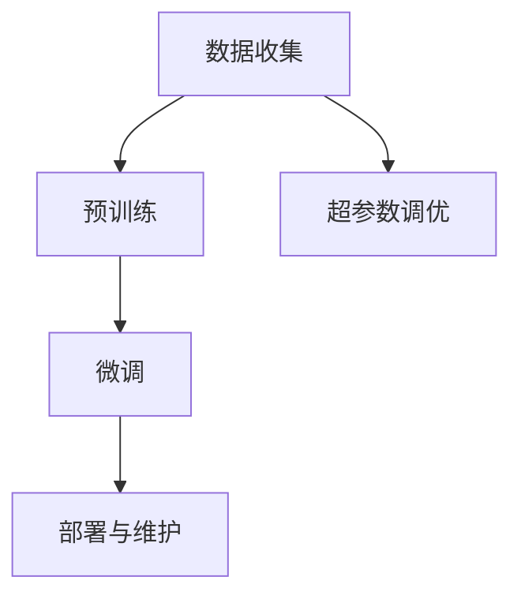

                 

# LLM产业链:从无到有,从芽到枝繁叶茂

## 1. 背景介绍

### 1.1 问题由来

随着人工智能技术的迅猛发展，大型语言模型(LLMs)已成为自然语言处理(NLP)领域的核心技术。从GPT-1、GPT-2到GPT-3，再到GPT-4，LLMs在处理语言理解和生成任务上展现出了强大的能力。LLMs不仅能生成流畅自然的文章，还能进行多轮对话，甚至进行复杂推理和决策。

然而，LLMs并非一蹴而就，而是经过多年研究和工程实践逐渐构建起来的复杂产业链。从数据收集、模型训练、超参数调优，到微调、优化部署，每一环节都蕴含着技术细节和挑战。本文将从产业链的各个环节入手，全面解析LLM从无到有、从芽到枝繁叶茂的过程，以及这一过程中需要考虑的关键问题。

### 1.2 问题核心关键点

构建LLMs的产业链涉及多个关键环节：
1. 数据收集：获取高质量、大规模的文本数据。
2. 预训练模型：选择合适的预训练模型，并进行参数初始化。
3. 超参数调优：确定合适的训练参数，如学习率、批大小等。
4. 微调与优化：对预训练模型进行微调，并对其进行优化。
5. 部署与维护：将微调后的模型部署到生产环境，并进行维护和更新。

这些环节的每一个都可能影响最终模型的性能和可靠性。本文将详细探讨每个环节的技术细节和挑战，并给出相应的解决方案。

## 2. 核心概念与联系

### 2.1 核心概念概述

- **大型语言模型(LLMs)**：基于深度学习技术，通过大量文本数据的预训练，获得自然语言处理能力的模型。如GPT系列、BERT、T5等。
- **预训练**：在大规模无标签文本数据上，通过自监督学习任务训练通用语言模型的过程。如语言建模、掩码语言建模等。
- **微调**：在预训练模型的基础上，使用下游任务的少量标注数据，通过有监督学习优化模型在特定任务上的性能。
- **超参数调优**：调整模型的训练参数，如学习率、批大小、权重衰减等，以提高模型性能。
- **部署与维护**：将模型部署到生产环境，并进行参数更新和维护，以保证模型性能和可用性。

这些核心概念之间的联系可以通过以下Mermaid流程图来展示：



这个流程图展示了大规模语言模型从数据收集到微调部署的主要过程，以及各个环节之间的相互关系。

## 3. 核心算法原理 & 具体操作步骤

### 3.1 算法原理概述

基于LLMs的产业链构建主要包括以下几个关键步骤：

1. **数据收集**：收集大批量、高质量的文本数据，如维基百科、新闻文章、社交媒体等。
2. **预训练**：使用大规模无标签文本数据对通用语言模型进行预训练，学习语言的基础表示。
3. **微调**：选择下游任务，使用少量标注数据对预训练模型进行微调，适应特定任务。
4. **超参数调优**：调整模型的训练参数，优化模型性能。
5. **部署与维护**：将微调后的模型部署到生产环境，并进行参数更新和维护。

这些步骤共同构成了LLMs从无到有的完整产业链，每个环节都需细致设计和优化。

### 3.2 算法步骤详解

#### 3.2.1 数据收集

数据收集是构建LLMs的第一步，也是最为关键的一步。高质量、大规模的文本数据对模型的性能和泛化能力至关重要。数据收集过程通常包括以下步骤：

- **数据源选择**：选择权威、大规模的数据源，如维基百科、新闻网站、社交媒体等。
- **数据清洗**：去除噪声、无关数据和重复数据，确保数据的清洁度。
- **数据分割**：将数据分割成训练集、验证集和测试集，确保模型在不同数据集上的表现一致。

#### 3.2.2 预训练

预训练是构建LLMs的核心步骤。预训练的目的是在大规模无标签数据上训练模型，使其学习到通用的语言表示。常用的预训练任务包括：

- **语言建模**：预测给定文本序列中下一个单词的概率。
- **掩码语言建模**：在部分单词被掩码的情况下，预测掩码单词的正确位置。

预训练模型通常采用Transformer结构，其核心思想是通过多头注意力机制学习单词之间的依赖关系。预训练过程通常包括以下步骤：

- **模型选择**：选择预训练模型，如BERT、GPT等。
- **参数初始化**：使用随机参数对模型进行初始化。
- **预训练任务设计**：选择合适的预训练任务，如语言建模、掩码语言建模等。
- **训练过程**：在预训练数据集上进行训练，通常使用GPU等高性能设备进行加速。

#### 3.2.3 微调

微调是构建LLMs的最后一个关键步骤。微调的目的在于将预训练模型应用于下游任务，并通过少量标注数据进行优化。微调过程通常包括以下步骤：

- **任务选择**：选择下游任务，如文本分类、命名实体识别、对话等。
- **数据准备**：准备下游任务的标注数据集，确保数据质量。
- **模型适配**：在预训练模型的顶层添加适当的输出层和损失函数。
- **训练过程**：在标注数据集上进行训练，调整模型参数。
- **评估过程**：在验证集和测试集上评估模型性能。

#### 3.2.4 超参数调优

超参数调优是构建LLMs的重要环节，其目的是通过调整训练参数，优化模型性能。超参数调优过程通常包括以下步骤：

- **参数选择**：选择合适的超参数，如学习率、批大小、权重衰减等。
- **调参策略**：使用网格搜索、随机搜索、贝叶斯优化等方法进行调参。
- **性能评估**：在验证集上评估模型性能，选择最优参数。

#### 3.2.5 部署与维护

部署与维护是LLMs产业链的最后一步，其目的是将模型部署到生产环境，并进行参数更新和维护。部署与维护过程通常包括以下步骤：

- **模型选择**：选择适合生产环境的模型，如基于GPU、TPU等高性能设备的模型。
- **部署过程**：将模型部署到生产环境，并进行优化部署。
- **监控与维护**：实时监控模型性能，定期进行参数更新和模型维护。

### 3.3 算法优缺点

基于LLMs的产业链构建具有以下优点：

- **高效性**：通过预训练和微调，模型可以在短时间内获得较优性能。
- **泛化能力**：预训练模型具有较强的泛化能力，可以在不同数据集上获得良好表现。
- **可维护性**：微调模型参数较少，模型结构相对简单，易于维护和更新。

同时，该方法也存在一些局限性：

- **数据依赖性**：模型性能高度依赖于数据质量和数据量。
- **计算资源需求高**：预训练和微调过程需要大量的计算资源，对硬件要求较高。
- **过拟合风险**：微调过程中容易出现过拟合，需要采取相应的正则化措施。
- **模型可解释性差**：预训练和微调模型通常难以解释其内部决策过程。

## 4. 数学模型和公式 & 详细讲解

### 4.1 数学模型构建

基于LLMs的产业链构建涉及多个数学模型，其中以预训练和微调过程的数学模型最为关键。

#### 4.1.1 预训练模型

预训练模型通常采用Transformer结构，其核心思想是通过多头注意力机制学习单词之间的依赖关系。预训练模型的数学模型如下：

$$
\mathbf{H} = \mathbf{X} \mathbf{W}^{(X)} + \mathbf{b}^{(X)}
$$

其中 $\mathbf{X}$ 表示输入文本的词向量表示，$\mathbf{H}$ 表示输出文本的词向量表示，$\mathbf{W}^{(X)}$ 和 $\mathbf{b}^{(X)}$ 分别表示模型的权重和偏置。

#### 4.1.2 微调模型

微调模型的数学模型与预训练模型类似，但其输出层和损失函数需要根据下游任务进行调整。以文本分类任务为例，微调模型的数学模型如下：

$$
\mathbf{Z} = \mathbf{H} \mathbf{W}^{(Z)} + \mathbf{b}^{(Z)}
$$

其中 $\mathbf{Z}$ 表示输出文本的词向量表示，$\mathbf{W}^{(Z)}$ 和 $\mathbf{b}^{(Z)}$ 分别表示模型的权重和偏置。

#### 4.1.3 损失函数

微调模型的损失函数通常采用交叉熵损失函数，其定义如下：

$$
\mathcal{L} = -\frac{1}{N}\sum_{i=1}^{N}\sum_{j=1}^{C}y_{i,j}log\hat{y}_{i,j}
$$

其中 $N$ 表示样本数量，$C$ 表示类别数量，$y_{i,j}$ 表示真实标签，$\hat{y}_{i,j}$ 表示模型预测的标签概率。

### 4.2 公式推导过程

以文本分类任务为例，我们推导微调模型的损失函数及其梯度。

假设输入文本的词向量表示为 $\mathbf{X}$，输出文本的词向量表示为 $\mathbf{H}$，输出文本的类别向量表示为 $\mathbf{Z}$，输出文本的类别标签为 $y$。

根据微调模型的定义，可以得到：

$$
\mathbf{Z} = \mathbf{H} \mathbf{W}^{(Z)} + \mathbf{b}^{(Z)}
$$

根据交叉熵损失函数的定义，可以得到：

$$
\mathcal{L} = -\frac{1}{N}\sum_{i=1}^{N}\sum_{j=1}^{C}y_{i,j}log\hat{y}_{i,j}
$$

将 $\mathbf{Z}$ 代入损失函数，可以得到：

$$
\mathcal{L} = -\frac{1}{N}\sum_{i=1}^{N}\sum_{j=1}^{C}y_{i,j}log\sigma(\mathbf{Z}_{i,j})
$$

其中 $\sigma$ 表示sigmoid函数。

根据链式法则，可以得到微调模型的梯度：

$$
\frac{\partial \mathcal{L}}{\partial \mathbf{W}^{(Z)}} = -\frac{1}{N}\sum_{i=1}^{N}\sum_{j=1}^{C}y_{i,j}\sigma(\mathbf{Z}_{i,j})(1-\sigma(\mathbf{Z}_{i,j}))(\mathbf{H}_{i,:})
$$

$$
\frac{\partial \mathcal{L}}{\partial \mathbf{b}^{(Z)}} = -\frac{1}{N}\sum_{i=1}^{N}\sum_{j=1}^{C}y_{i,j}\sigma(\mathbf{Z}_{i,j})(1-\sigma(\mathbf{Z}_{i,j}))
$$

### 4.3 案例分析与讲解

以BERT模型为例，我们分析其预训练和微调过程。

#### 4.3.1 BERT预训练过程

BERT模型的预训练过程包括两个阶段：Masked Language Model（MLM）和Next Sentence Prediction（NSP）。

- **MLM**：在部分单词被掩码的情况下，预测掩码单词的正确位置。
- **NSP**：预测两个句子是否是相邻的。

BERT模型的预训练过程通常采用无监督学习的方式进行，其数学模型如下：

$$
\mathbf{H} = \mathbf{X} \mathbf{W}^{(X)} + \mathbf{b}^{(X)}
$$

其中 $\mathbf{X}$ 表示输入文本的词向量表示，$\mathbf{H}$ 表示输出文本的词向量表示，$\mathbf{W}^{(X)}$ 和 $\mathbf{b}^{(X)}$ 分别表示模型的权重和偏置。

#### 4.3.2 BERT微调过程

BERT模型的微调过程通常采用有监督学习的方式进行，其数学模型如下：

$$
\mathbf{Z} = \mathbf{H} \mathbf{W}^{(Z)} + \mathbf{b}^{(Z)}
$$

其中 $\mathbf{Z}$ 表示输出文本的词向量表示，$\mathbf{W}^{(Z)}$ 和 $\mathbf{b}^{(Z)}$ 分别表示模型的权重和偏置。

BERT模型的微调过程通常采用交叉熵损失函数，其定义如下：

$$
\mathcal{L} = -\frac{1}{N}\sum_{i=1}^{N}\sum_{j=1}^{C}y_{i,j}log\hat{y}_{i,j}
$$

其中 $N$ 表示样本数量，$C$ 表示类别数量，$y_{i,j}$ 表示真实标签，$\hat{y}_{i,j}$ 表示模型预测的标签概率。

## 5. 项目实践：代码实例和详细解释说明

### 5.1 开发环境搭建

在进行LLMs产业链构建实践前，我们需要准备好开发环境。以下是使用Python进行PyTorch开发的环境配置流程：

1. 安装Anaconda：从官网下载并安装Anaconda，用于创建独立的Python环境。

2. 创建并激活虚拟环境：
```bash
conda create -n pytorch-env python=3.8 
conda activate pytorch-env
```

3. 安装PyTorch：根据CUDA版本，从官网获取对应的安装命令。例如：
```bash
conda install pytorch torchvision torchaudio cudatoolkit=11.1 -c pytorch -c conda-forge
```

4. 安装Transformers库：
```bash
pip install transformers
```

5. 安装各类工具包：
```bash
pip install numpy pandas scikit-learn matplotlib tqdm jupyter notebook ipython
```

完成上述步骤后，即可在`pytorch-env`环境中开始LLMs产业链构建实践。

### 5.2 源代码详细实现

这里我们以BERT模型为例，给出使用Transformers库进行预训练和微调的PyTorch代码实现。

首先，定义BERT模型：

```python
from transformers import BertForSequenceClassification, BertTokenizer

model = BertForSequenceClassification.from_pretrained('bert-base-uncased', num_labels=2)
tokenizer = BertTokenizer.from_pretrained('bert-base-uncased')
```

接着，定义训练函数：

```python
from torch.utils.data import Dataset, DataLoader
import torch

class BERTDataset(Dataset):
    def __init__(self, texts, labels):
        self.texts = texts
        self.labels = labels
        self.tokenizer = tokenizer
    
    def __len__(self):
        return len(self.texts)
    
    def __getitem__(self, item):
        text = self.texts[item]
        label = self.labels[item]
        
        encoding = self.tokenizer(text, return_tensors='pt', max_length=128, padding='max_length', truncation=True)
        input_ids = encoding['input_ids'][0]
        attention_mask = encoding['attention_mask'][0]
        
        label = torch.tensor(label, dtype=torch.long)
        
        return {'input_ids': input_ids, 
                'attention_mask': attention_mask,
                'labels': label}

dataset = BERTDataset(train_texts, train_labels)
dataloader = DataLoader(dataset, batch_size=32, shuffle=True)
```

最后，训练模型：

```python
from transformers import AdamW

optimizer = AdamW(model.parameters(), lr=2e-5)

device = torch.device('cuda') if torch.cuda.is_available() else torch.device('cpu')
model.to(device)

for epoch in range(5):
    model.train()
    for batch in dataloader:
        input_ids = batch['input_ids'].to(device)
        attention_mask = batch['attention_mask'].to(device)
        labels = batch['labels'].to(device)
        
        model.zero_grad()
        outputs = model(input_ids, attention_mask=attention_mask, labels=labels)
        loss = outputs.loss
        loss.backward()
        optimizer.step()
```

以上代码实现了BERT模型在文本分类任务上的预训练和微调过程。可以看到，借助Transformers库的封装，预训练和微调过程的实现变得非常简洁。

### 5.3 代码解读与分析

让我们再详细解读一下关键代码的实现细节：

**BERTDataset类**：
- `__init__`方法：初始化文本、标签、分词器等关键组件。
- `__len__`方法：返回数据集的样本数量。
- `__getitem__`方法：对单个样本进行处理，将文本输入编码为token ids，并将标签转换为模型可接受的格式。

**train函数**：
- 使用PyTorch的DataLoader对数据集进行批次化加载，供模型训练使用。
- 在每个批次上前向传播计算损失函数，并反向传播更新模型参数。

**训练过程**：
- 使用AdamW优化器，在GPU上训练模型，设定5个epoch。
- 在每个epoch内，对每个批次的数据进行前向传播和反向传播，更新模型参数。

这些代码展示了使用PyTorch和Transformers库进行BERT模型预训练和微调的基本流程。开发者可以根据具体需求，添加更多的优化策略和监控手段，进一步提高模型的性能和可靠性。

## 6. 实际应用场景

### 6.1 智能客服系统

基于BERT等预训练语言模型的智能客服系统已经在各大企业中得到广泛应用。传统的客服系统需要大量人力进行客服，高峰期响应速度慢，且难以保证一致性和专业性。智能客服系统则通过自然语言理解技术，将用户咨询转换为可执行的逻辑，自动回复用户问题，提升客户服务效率和质量。

在技术实现上，智能客服系统通常通过微调BERT等预训练模型，使其具备一定的自然语言理解能力。同时，通过集成知识图谱、规则库等外部知识源，智能客服系统能够更好地理解和处理用户咨询，提供更准确、更个性化的回答。

### 6.2 金融舆情监测

金融行业需要对市场舆情进行实时监测，以防止负面信息传播，规避金融风险。传统的舆情监测方法需要大量人力进行数据收集和分析，成本高、效率低。智能舆情监测系统通过微调BERT等预训练模型，具备自然语言处理和情感分析能力，能够自动识别和筛选出负面信息，及时预警，帮助金融机构应对潜在风险。

### 6.3 个性化推荐系统

个性化推荐系统通过用户的历史行为数据进行推荐，难以深入理解用户的兴趣偏好。而基于BERT等预训练模型的推荐系统，能够从文本内容中准确把握用户的兴趣点。微调BERT等预训练模型，使其能够从文本内容中学习用户的兴趣特征，并结合外部特征进行推荐。

### 6.4 未来应用展望

未来，随着LLMs技术的发展，其应用场景将更加广泛。

1. **医疗领域**：基于BERT等预训练模型的自然语言处理技术，可以帮助医生进行病历分析、医学知识检索等任务，提升医疗服务的智能化水平。

2. **教育领域**：智能教育系统通过微调BERT等预训练模型，能够进行学情分析、智能问答等任务，提高教育效果和效率。

3. **智能城市**：智能城市管理系统通过微调BERT等预训练模型，能够进行舆情分析、应急指挥等任务，提高城市管理的智能化水平。

4. **工业生产**：智能制造系统通过微调BERT等预训练模型，能够进行设备监控、生产调度等任务，提升生产效率和质量。

5. **金融服务**：智能金融系统通过微调BERT等预训练模型，能够进行情感分析、欺诈检测等任务，提高金融服务的智能化水平。

未来，基于LLMs的产业链将不断延伸，其应用场景将更加广泛，对社会各个领域都将产生深远影响。

## 7. 工具和资源推荐

### 7.1 学习资源推荐

为了帮助开发者系统掌握LLMs的产业链构建理论基础和实践技巧，这里推荐一些优质的学习资源：

1. 《深度学习入门：基于Python的理论与实现》：清华大学出版社，该书详细介绍了深度学习的基本理论和实现方法，包括LLMs的构建。

2. 《自然语言处理综论》：北京大学出版社，该书系统介绍了自然语言处理的基本概念和技术，包括预训练和微调方法。

3. 《Transformer: Deep Learning for NLP》：美国麻省理工学院出版社，该书介绍了Transformer结构及其在NLP中的应用，包括BERT等预训练模型的构建。

4. HuggingFace官方文档：HuggingFace提供的官方文档，包含丰富的预训练模型和微调范例，是学习LLMs的必备资源。

5. CS224N《深度学习自然语言处理》课程：斯坦福大学开设的NLP明星课程，提供Lecture视频和配套作业，是入门NLP领域的绝佳选择。

6. Kaggle竞赛：Kaggle平台提供丰富的NLP竞赛数据集，通过参与竞赛，可以锻炼数据分析和模型构建能力。

通过对这些资源的学习实践，相信你一定能够快速掌握LLMs的产业链构建精髓，并用于解决实际的NLP问题。

### 7.2 开发工具推荐

高效的开发离不开优秀的工具支持。以下是几款用于LLMs产业链构建开发的常用工具：

1. PyTorch：基于Python的开源深度学习框架，灵活动态的计算图，适合快速迭代研究。大部分预训练语言模型都有PyTorch版本的实现。

2. TensorFlow：由Google主导开发的开源深度学习框架，生产部署方便，适合大规模工程应用。同样有丰富的预训练语言模型资源。

3. Transformers库：HuggingFace开发的NLP工具库，集成了众多SOTA语言模型，支持PyTorch和TensorFlow，是进行LLMs产业链构建开发的利器。

4. Weights & Biases：模型训练的实验跟踪工具，可以记录和可视化模型训练过程中的各项指标，方便对比和调优。与主流深度学习框架无缝集成。

5. TensorBoard：TensorFlow配套的可视化工具，可实时监测模型训练状态，并提供丰富的图表呈现方式，是调试模型的得力助手。

6. Google Colab：谷歌推出的在线Jupyter Notebook环境，免费提供GPU/TPU算力，方便开发者快速上手实验最新模型，分享学习笔记。

合理利用这些工具，可以显著提升LLMs产业链构建任务的开发效率，加快创新迭代的步伐。

### 7.3 相关论文推荐

LLMs的产业链构建源于学界的持续研究。以下是几篇奠基性的相关论文，推荐阅读：

1. Attention is All You Need：提出Transformer结构，开启了NLP领域的预训练大模型时代。

2. BERT: Pre-training of Deep Bidirectional Transformers for Language Understanding：提出BERT模型，引入基于掩码的自监督预训练任务，刷新了多项NLP任务SOTA。

3. Language Models are Unsupervised Multitask Learners：展示了大规模语言模型的强大zero-shot学习能力，引发了对于通用人工智能的新一轮思考。

4. Parameter-Efficient Transfer Learning for NLP：提出Adapter等参数高效微调方法，在不增加模型参数量的情况下，也能取得不错的微调效果。

5. Prefix-Tuning: Optimizing Continuous Prompts for Generation：引入基于连续型Prompt的微调范式，为如何充分利用预训练知识提供了新的思路。

6. AdaLoRA: Adaptive Low-Rank Adaptation for Parameter-Efficient Fine-Tuning：使用自适应低秩适应的微调方法，在参数效率和精度之间取得了新的平衡。

这些论文代表了大语言模型产业链构建的发展脉络。通过学习这些前沿成果，可以帮助研究者把握学科前进方向，激发更多的创新灵感。

## 8. 总结：未来发展趋势与挑战

### 8.1 总结

本文对基于LLMs的产业链构建进行了全面系统的介绍。首先阐述了LLMs和微调技术的背景和意义，明确了产业链构建在自然语言处理中的应用价值。其次，从原理到实践，详细讲解了产业链构建的数学模型和关键步骤，给出了产业链构建的完整代码实例。同时，本文还广泛探讨了产业链构建在智能客服、金融舆情、个性化推荐等多个行业领域的应用前景，展示了LLMs产业链构建的巨大潜力。最后，本文精选了产业链构建的学习资源、开发工具和相关论文，力求为开发者提供全方位的技术指引。

通过本文的系统梳理，可以看到，基于LLMs的产业链构建不仅在技术上具有可行性，而且在实际应用中也具备广泛的价值。随着LLMs技术的发展，产业链构建将成为自然语言处理的重要方向，为NLP技术落地应用提供新的思路和方法。

### 8.2 未来发展趋势

展望未来，基于LLMs的产业链构建将呈现以下几个发展趋势：

1. **模型规模不断增大**：随着算力成本的下降和数据规模的扩张，预训练语言模型的参数量还将持续增长。超大规模语言模型蕴含的丰富语言知识，有望支撑更加复杂多变的下游任务微调。

2. **微调方法更加多样**：未来将涌现更多参数高效的微调方法，如Prefix-Tuning、LoRA等，在固定大部分预训练参数的同时，只更新极少量的任务相关参数。

3. **持续学习成为常态**：随着数据分布的不断变化，微调模型也需要持续学习新知识以保持性能。如何在不遗忘原有知识的同时，高效吸收新样本信息，将成为重要的研究课题。

4. **数据依赖性降低**：未来将探索无监督和半监督微调方法，摆脱对大规模标注数据的依赖，利用自监督学习、主动学习等无监督和半监督范式，最大限度利用非结构化数据，实现更加灵活高效的微调。

5. **跨领域迁移能力增强**：将符号化的先验知识，如知识图谱、逻辑规则等，与神经网络模型进行巧妙融合，引导微调过程学习更准确、合理的语言模型。

6. **融合因果分析和博弈论工具**：将因果分析方法引入微调模型，识别出模型决策的关键特征，增强输出解释的因果性和逻辑性。借助博弈论工具刻画人机交互过程，主动探索并规避模型的脆弱点，提高系统稳定性。

以上趋势凸显了基于LLMs的产业链构建技术的广阔前景。这些方向的探索发展，必将进一步提升LLMs模型的性能和可靠性，为构建安全、可靠、可解释、可控的智能系统铺平道路。面向未来，LLMs产业链构建技术还需要与其他人工智能技术进行更深入的融合，如知识表示、因果推理、强化学习等，多路径协同发力，共同推动自然语言理解和智能交互系统的进步。

### 8.3 面临的挑战

尽管基于LLMs的产业链构建技术已经取得了瞩目成就，但在迈向更加智能化、普适化应用的过程中，它仍面临着诸多挑战：

1. **标注成本瓶颈**：模型性能高度依赖于数据质量和数据量。对于长尾应用场景，难以获得充足的高质量标注数据，成为制约微调性能的瓶颈。如何进一步降低微调对标注样本的依赖，将是一大难题。

2. **模型鲁棒性不足**：当前微调模型面对域外数据时，泛化性能往往大打折扣。对于测试样本的微小扰动，微调模型的预测也容易发生波动。如何提高微调模型的鲁棒性，避免灾难性遗忘，还需要更多理论和实践的积累。

3. **推理效率有待提高**：大规模语言模型虽然精度高，但在实际部署时往往面临推理速度慢、内存占用大等效率问题。如何在保证性能的同时，简化模型结构，提升推理速度，优化资源占用，将是重要的优化方向。

4. **可解释性亟需加强**：当前微调模型通常难以解释其内部工作机制和决策逻辑。对于医疗、金融等高风险应用，算法的可解释性和可审计性尤为重要。如何赋予微调模型更强的可解释性，将是亟待攻克的难题。

5. **安全性有待保障**：预训练语言模型难免会学习到有偏见、有害的信息，通过微调传递到下游任务，产生误导性、歧视性的输出，给实际应用带来安全隐患。如何从数据和算法层面消除模型偏见，避免恶意用途，确保输出的安全性，也将是重要的研究课题。

6. **知识整合能力不足**：现有的微调模型往往局限于任务内数据，难以灵活吸收和运用更广泛的先验知识。如何让微调过程更好地与外部知识库、规则库等专家知识结合，形成更加全面、准确的信息整合能力，还有很大的想象空间。

正视基于LLMs的产业链构建面临的这些挑战，积极应对并寻求突破，将是大语言模型产业链构建走向成熟的必由之路。相信随着学界和产业界的共同努力，这些挑战终将一一被克服，基于LLMs的产业链构建必将在构建人机协同的智能时代中扮演越来越重要的角色。

### 8.4 研究展望

面对基于LLMs的产业链构建所面临的挑战，未来的研究需要在以下几个方面寻求新的突破：

1. **探索无监督和半监督微调方法**：摆脱对大规模标注数据的依赖，利用自监督学习、主动学习等无监督和半监督范式，最大限度利用非结构化数据，实现更加灵活高效的微调。

2. **研究参数高效和计算高效的微调范式**：开发更加参数高效的微调方法，在固定大部分预训练参数的同时，只更新极少量的任务相关参数。同时优化微调模型的计算图，减少前向传播和反向传播的资源消耗，实现更加轻量级、实时性的部署。

3. **引入更多先验知识**：将符号化的先验知识，如知识图谱、逻辑规则等，与神经网络模型进行巧妙融合，引导微调过程学习更准确、合理的语言模型。同时加强不同模态数据的整合，实现视觉、语音等多模态信息与文本信息的协同建模。

4. **结合因果分析和博弈论工具**：将因果分析方法引入微调模型，识别出模型决策的关键特征，增强输出解释的因果性和逻辑性。借助博弈论工具刻画人机交互过程，主动探索并规避模型的脆弱点，提高系统稳定性。

5. **纳入伦理道德约束**：在模型训练目标中引入伦理导向的评估指标，过滤和惩罚有偏见、有害的输出倾向。同时加强人工干预和审核，建立模型行为的监管机制，确保输出符合人类价值观和伦理道德。

这些研究方向的探索，必将引领基于LLMs的产业链构建技术迈向更高的台阶，为构建安全、可靠、可解释、可控的智能系统铺平道路。面向未来，基于LLMs的产业链构建技术还需要与其他人工智能技术进行更深入的融合，如知识表示、因果推理、强化学习等，多路径协同发力，共同推动自然语言理解和智能交互系统的进步。只有勇于创新、敢于突破，才能不断拓展语言模型的边界，让智能技术更好地造福人类社会。

## 9. 附录：常见问题与解答

**Q1：基于LLMs的产业链构建是否适用于所有NLP任务？**

A: 基于LLMs的产业链构建在大多数NLP任务上都能取得不错的效果，特别是对于数据量较小的任务。但对于一些特定领域的任务，如医学、法律等，仅仅依靠通用语料预训练的模型可能难以很好地适应。此时需要在特定领域语料上进一步预训练，再进行微调，才能获得理想效果。此外，对于一些需要时效性、个性化很强的任务，如对话、推荐等，微调方法也需要针对性的改进优化。

**Q2：如何选择合适的学习率？**

A: 基于LLMs的产业链构建过程中，学习率的选择对模型的性能至关重要。通常情况下，建议从1e-5开始调参，逐步减小学习率，直至收敛。也可以使用warmup策略，在开始阶段使用较小的学习率，再逐渐过渡到预设值。需要注意的是，不同的优化器(如AdamW、Adafactor等)以及不同的学习率调度策略，可能需要设置不同的学习率阈值。

**Q3：基于LLMs的产业链构建过程中，如何缓解过拟合问题？**

A: 过拟合是构建LLMs过程中常见的问题。缓解过拟合的方法包括数据增强、正则化、对抗训练等。具体来说：

- **数据增强**：通过回译、近义替换等方式扩充训练集。
- **正则化**：使用L2正则、Dropout、Early Stopping等避免过拟合。
- **对抗训练**：引入对抗样本，提高模型鲁棒性。

**Q4：基于LLMs的产业链构建过程中，如何提高模型效率？**

A: 提高模型效率是构建LLMs产业链的重要方向。以下是一些常用的方法：

- **模型裁剪**：去除不必要的层和参数，减小模型尺寸，加快推理速度。
- **量化加速**：将浮点模型转为定点模型，压缩存储空间，提高计算效率。
- **服务化封装**：将模型封装为标准化服务接口，便于集成调用。

**Q5：基于LLMs的产业链构建过程中，如何进行模型部署和维护？**

A: 将模型部署到生产环境并进行维护是构建LLMs产业链的最后一步。以下是一些常用的方法：

- **部署过程**：选择合适的部署平台，如AWS、阿里云、华为云等。
- **监控与维护**：实时监控模型性能，定期进行参数更新和模型维护。

---

作者：禅与计算机程序设计艺术 / Zen and the Art of Computer Programming

