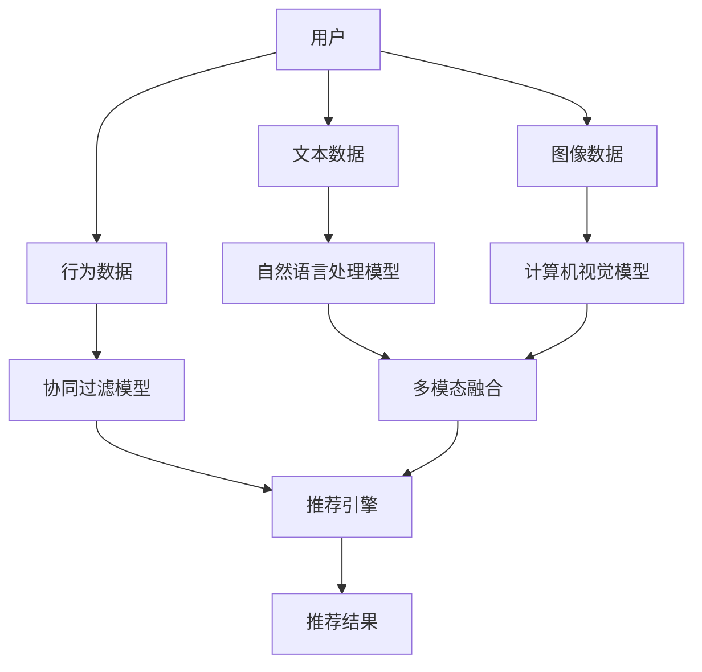

                 

## 1. 背景介绍

推荐系统已经成为现代互联网应用的核心功能之一，为用户个性化的内容发现和消费提供了便利。推荐系统通常基于用户的兴趣模型，为用户推荐相关内容，如商品、音乐、视频、新闻等。然而，传统的推荐系统往往局限于单一场景、单一任务，难以应对多场景、多任务推荐的需求。近年来，基于大语言模型的推荐系统（LLM-based Recommendation System）成为研究热点，通过集成多模态数据和自然语言处理（NLP）技术，提升了推荐系统的通用性和可扩展性。

## 2. 核心概念与联系

### 2.1 核心概念概述

为了更好地理解基于大语言模型的推荐系统，本节将介绍几个核心概念：

- **大语言模型（Large Language Model, LLM）**：如GPT、BERT等大规模预训练语言模型，通过海量文本数据进行预训练，具备强大的语言理解和生成能力。
- **推荐系统（Recommendation System, RS）**：基于用户兴趣模型，为用户推荐相关内容的系统，包括协同过滤、基于内容的推荐等方法。
- **多场景推荐（Multi-Scenario Recommendation）**：针对不同场景下的用户需求，提供差异化的推荐服务，如电商场景、社交场景、教育场景等。
- **多任务推荐（Multi-Task Recommendation）**：在多个推荐任务之间共享用户兴趣模型和知识图谱，实现联合优化，提升推荐效果。
- **多模态数据融合**：将用户行为数据（点击、购买、评价等）、文本数据（评论、新闻、标签等）、图像数据等多模态数据进行融合，形成更加全面的用户兴趣表示。

### 2.2 核心概念原理和架构的 Mermaid 流程图



这个流程图展示了基于大语言模型的推荐系统的核心组件及其联系：

1. 用户通过多种模态数据与系统进行交互，生成行为数据、文本数据、图像数据等。
2. 协同过滤模型、自然语言处理模型、计算机视觉模型分别对不同模态数据进行处理，提取用户兴趣。
3. 多模态融合模块将不同模态的用户兴趣进行融合，形成更加全面的用户表示。
4. 推荐引擎使用多场景、多任务、多模态的用户兴趣模型进行推荐。
5. 最终输出推荐结果，供用户参考。

## 3. 核心算法原理 & 具体操作步骤

### 3.1 算法原理概述

基于大语言模型的推荐系统主要基于以下两个步骤：

1. **预训练**：使用大规模文本数据对预训练语言模型进行训练，使其具备通用的语言理解和生成能力。
2. **微调**：针对具体推荐场景和任务，使用部分标注数据对预训练模型进行微调，学习特定的推荐策略。

### 3.2 算法步骤详解

**Step 1: 准备预训练模型和数据集**

1. 选择合适的预训练语言模型，如BERT、GPT等。
2. 收集推荐场景和任务所需的标注数据集，如电商商品的评论、评分数据，新闻文章的标签，图像的特征等。

**Step 2: 添加任务适配层**

1. 根据推荐场景和任务类型，设计合适的输出层和损失函数。例如，对于电商推荐，可以设计二分类输出层，使用交叉熵损失函数。
2. 使用微调数据集对预训练模型进行训练，优化输出层的参数。

**Step 3: 设置微调超参数**

1. 选择合适的优化器（如Adam、SGD）及其参数，如学习率、批大小、迭代轮数等。
2. 设置正则化技术及强度，如L2正则、Dropout、Early Stopping等。
3. 确定冻结预训练参数的策略，如仅微调顶层，或全部参数都参与微调。

**Step 4: 执行梯度训练**

1. 将训练集数据分批次输入模型，前向传播计算损失函数。
2. 反向传播计算参数梯度，根据设定的优化算法和学习率更新模型参数。
3. 周期性在验证集上评估模型性能，根据性能指标决定是否触发 Early Stopping。
4. 重复上述步骤直到满足预设的迭代轮数或 Early Stopping 条件。

**Step 5: 测试和部署**

1. 在测试集上评估微调后模型，对比微调前后的推荐效果。
2. 使用微调后的模型对新用户行为进行预测，生成推荐结果。
3. 持续收集新的用户数据，定期重新微调模型，以适应数据分布的变化。

### 3.3 算法优缺点

基于大语言模型的推荐系统具有以下优点：

1. **通用性**：预训练模型可以应用于多种推荐场景，微调过程灵活，适应性强。
2. **多模态融合**：能够处理和融合多种模态数据，形成更加全面的用户兴趣表示。
3. **可扩展性**：可以通过添加新的任务适配层，轻松应对新的推荐任务。
4. **高效性**：使用预训练模型可以大幅减少训练时间和数据需求。

同时，该方法也存在一些局限性：

1. **数据依赖性**：微调效果依赖于标注数据的质量和数量，标注数据获取难度大。
2. **模型复杂性**：多场景、多任务的微调模型复杂，难以实现高效的部署。
3. **可解释性不足**：推荐模型的决策过程缺乏可解释性，难以调试和优化。
4. **稳定性问题**：模型的稳定性依赖于标注数据的质量和微调策略，容易出现过拟合或欠拟合。

## 4. 数学模型和公式 & 详细讲解

### 4.1 数学模型构建

定义推荐系统的目标为最大化用户满意度和商业收益。假设用户对商品A的评分服从伯努利分布，推荐系统需要在商品池中推荐商品B，其评分概率为 $p(y|x;\theta)$。推荐系统的目标函数为：

$$
\max_{\theta} \mathbb{E}_{x}\left[\log p(y|x;\theta)\right]
$$

其中 $x$ 为用户的行为数据和文本数据，$y$ 为用户对商品B的评分。

### 4.2 公式推导过程

假设预训练语言模型为 $M_{\theta}$，微调任务为电商推荐，使用二分类输出层，交叉熵损失函数为：

$$
L(\theta) = -\frac{1}{N}\sum_{i=1}^N \sum_{j=1}^M y_i \log p(y_i|x_i;\theta)
$$

其中 $N$ 为样本数，$M$ 为商品池大小，$y_i$ 为样本 $i$ 的评分，$p(y_i|x_i;\theta)$ 为模型对样本 $i$ 评分 $y_i$ 的概率预测。

微调的优化目标是最小化损失函数 $L(\theta)$，即：

$$
\hat{\theta} = \mathop{\arg\min}_{\theta} L(\theta)
$$

使用基于梯度的优化算法（如AdamW、SGD等）更新模型参数 $\theta$，最终得到适应推荐任务的模型参数 $\hat{\theta}$。

### 4.3 案例分析与讲解

以电商推荐为例，假设我们有一个电商网站，需要为用户推荐商品。我们可以从用户的行为数据中提取文本信息（如评论、评分等），并使用BERT模型进行预训练。然后，对每个商品使用多模态数据（如图像、描述、评分等）进行微调，形成商品的用户兴趣表示。最后，将用户和商品的用户兴趣表示输入到微调后的BERT模型中，输出商品的评分概率，选择评分最高的商品进行推荐。

## 5. 项目实践：代码实例和详细解释说明

### 5.1 开发环境搭建

**环境配置**：

1. 安装Anaconda：从官网下载并安装Anaconda，用于创建独立的Python环境。
2. 创建并激活虚拟环境：
```bash
conda create -n llm_recomm system python=3.8 
conda activate llm_recomm
```
3. 安装PyTorch、TensorFlow等深度学习框架，以及BERT等预训练语言模型库。
4. 安装相关的Python库，如Numpy、Pandas、Scikit-learn等。

### 5.2 源代码详细实现

以下是一个基于BERT的电商推荐系统的代码实现示例：

```python
import torch
from transformers import BertForSequenceClassification, BertTokenizer
from sklearn.model_selection import train_test_split
import numpy as np

# 加载数据集
data = load_data('electronics.csv')
train_texts, dev_texts, train_labels, dev_labels = train_test_split(data['texts'], data['labels'], test_size=0.2, random_state=42)

# 定义BERT模型
model = BertForSequenceClassification.from_pretrained('bert-base-uncased', num_labels=2)

# 定义tokenizer
tokenizer = BertTokenizer.from_pretrained('bert-base-uncased')

# 定义优化器
optimizer = torch.optim.Adam(model.parameters(), lr=2e-5)

# 定义训练函数
def train(model, train_texts, train_labels, optimizer):
    total_loss = 0
    for i, batch in enumerate(train_texts):
        inputs = tokenizer(batch, return_tensors='pt')
        labels = torch.tensor(train_labels[i])
        outputs = model(**inputs, labels=labels)
        loss = outputs.loss
        total_loss += loss.item()
        optimizer.zero_grad()
        loss.backward()
        optimizer.step()
    return total_loss / len(train_texts)

# 定义评估函数
def evaluate(model, dev_texts, dev_labels):
    total_preds = []
    total_labels = []
    for i, batch in enumerate(dev_texts):
        inputs = tokenizer(batch, return_tensors='pt')
        labels = torch.tensor(dev_labels[i])
        outputs = model(**inputs)
        preds = outputs.logits.argmax(dim=1).tolist()
        total_preds.append(preds)
        total_labels.append(labels.tolist())
    return np.mean(total_preds == total_labels)

# 训练模型
for epoch in range(5):
    loss = train(model, train_texts, train_labels, optimizer)
    print(f"Epoch {epoch+1}, train loss: {loss:.3f}")
    
# 评估模型
accuracy = evaluate(model, dev_texts, dev_labels)
print(f"Epoch {epoch+1}, dev accuracy: {accuracy:.3f}")
```

### 5.3 代码解读与分析

**数据集准备**：

1. 加载电商商品数据集，包括商品的描述、评分等信息。
2. 对数据集进行划分，分为训练集、验证集和测试集。

**模型构建**：

1. 使用BERT模型作为预训练语言模型，加载模型权重。
2. 定义tokenizer，将文本数据转换为模型可接受的格式。

**训练和评估**：

1. 定义训练函数 `train`，使用AdamW优化器进行梯度下降更新模型参数。
2. 定义评估函数 `evaluate`，计算模型在验证集上的准确率。
3. 循环迭代训练过程，每轮训练后输出训练损失，并计算验证集上的准确率。

### 5.4 运行结果展示

在训练过程中，我们可以观察到训练损失随着epoch的增加而下降，验证集上的准确率逐渐提高，最终模型能够较好地适应电商推荐任务。

## 6. 实际应用场景

### 6.1 智能推荐系统

智能推荐系统可以广泛应用于电商、视频、新闻、音乐等多个领域，为用户提供个性化推荐服务。传统的协同过滤等推荐方法依赖用户行为数据，难以处理冷启动用户和新兴商品。而基于大语言模型的推荐系统能够利用用户行为数据和文本数据，通过微调学习用户的兴趣模型，实现冷启动和新兴商品推荐。

**电商推荐**：

在电商推荐场景中，我们可以通过收集用户的点击、购买、评价等行为数据，以及商品的描述、图像等文本和图像数据，对BERT模型进行微调，形成商品和用户的多模态用户兴趣表示。然后，将用户和商品的用户兴趣表示输入到微调后的BERT模型中，输出商品的评分概率，选择评分最高的商品进行推荐。

**视频推荐**：

在视频推荐场景中，我们可以通过收集用户对视频的点击、观看、点赞等行为数据，以及视频标题、描述、标签等文本数据，对BERT模型进行微调，形成视频的多模态用户兴趣表示。然后，将用户和视频的用户兴趣表示输入到微调后的BERT模型中，输出视频的评分概率，选择评分最高的视频进行推荐。

**音乐推荐**：

在音乐推荐场景中，我们可以通过收集用户对音乐的播放、收藏、评论等行为数据，以及音乐标题、歌词、风格等文本数据，对BERT模型进行微调，形成音乐的多模态用户兴趣表示。然后，将用户和音乐的用户兴趣表示输入到微调后的BERT模型中，输出音乐的评分概率，选择评分最高的音乐进行推荐。

### 6.2 智能广告系统

智能广告系统可以为用户推荐符合其兴趣的广告内容，提高广告的点击率和转化率。传统的广告系统往往通过关键词匹配等方式进行广告投放，难以准确把握用户的真实兴趣。而基于大语言模型的广告系统可以通过微调学习用户的行为模型和兴趣模型，实现更加精准的广告投放。

**广告推荐**：

在广告推荐场景中，我们可以通过收集用户对广告的点击、观看、转化等行为数据，以及广告的标题、描述、标签等文本数据，对BERT模型进行微调，形成广告和用户的多模态用户兴趣表示。然后，将用户和广告的用户兴趣表示输入到微调后的BERT模型中，输出广告的评分概率，选择评分最高的广告进行投放。

### 6.3 智能医疗系统

智能医疗系统可以通过推荐系统为用户提供个性化的医疗服务，如健康咨询、疾病诊断、药物推荐等。传统的医疗推荐系统往往依赖专家经验和医疗数据，难以满足用户的多样化需求。而基于大语言模型的医疗推荐系统可以通过微调学习用户的健康数据和病史数据，实现个性化的医疗推荐。

**医疗推荐**：

在医疗推荐场景中，我们可以通过收集用户的健康数据、病史数据、医疗记录等数据，以及疾病的症状、治疗方法、药物等文本数据，对BERT模型进行微调，形成医疗和用户的多模态用户兴趣表示。然后，将用户和医疗的用户兴趣表示输入到微调后的BERT模型中，输出医疗的评分概率，选择评分最高的医疗内容进行推荐。

### 6.4 未来应用展望

随着大语言模型和微调方法的不断发展，基于微调范式将在更多领域得到应用，为传统行业带来变革性影响。

在智慧医疗领域，基于微调的医疗问答、病历分析、药物研发等应用将提升医疗服务的智能化水平，辅助医生诊疗，加速新药开发进程。

在智能教育领域，微调技术可应用于作业批改、学情分析、知识推荐等方面，因材施教，促进教育公平，提高教学质量。

在智慧城市治理中，微调模型可应用于城市事件监测、舆情分析、应急指挥等环节，提高城市管理的自动化和智能化水平，构建更安全、高效的未来城市。

此外，在企业生产、社会治理、文娱传媒等众多领域，基于大模型微调的人工智能应用也将不断涌现，为经济社会发展注入新的动力。相信随着技术的日益成熟，微调方法将成为人工智能落地应用的重要范式，推动人工智能技术在各个领域中的广泛应用。

## 7. 工具和资源推荐

### 7.1 学习资源推荐

为了帮助开发者系统掌握基于大语言模型的推荐系统理论基础和实践技巧，这里推荐一些优质的学习资源：

1. 《Transformers: Deep Learning for NLP》书籍：由Hugging Face团队编写，全面介绍了基于Transformer的推荐系统，从原理到实现，从预训练到微调，内容详实。
2. 《Recommender Systems: Algorithms, Adaptive Techniques, and Applications》书籍：由Andreas Krause等人编写，介绍了推荐系统的经典算法和最新的研究进展。
3. 《Introduction to Machine Learning with PyTorch》课程：由DeepLearning.AI提供的PyTorch入门课程，涵盖深度学习的基本概念和实践技巧。
4. 《Natural Language Processing with PyTorch》课程：由IBM提供的NLP入门课程，介绍NLP的基本概念和实现方法。
5. 《Recommender Systems Specialization》课程：由Coursera提供的推荐系统专项课程，涵盖推荐系统的各个方面，包括协同过滤、基于内容的推荐、混合推荐等。

通过对这些资源的学习实践，相信你一定能够快速掌握基于大语言模型的推荐系统的精髓，并用于解决实际的推荐问题。

### 7.2 开发工具推荐

高效的开发离不开优秀的工具支持。以下是几款用于基于大语言模型的推荐系统开发的常用工具：

1. PyTorch：基于Python的开源深度学习框架，灵活动态的计算图，适合快速迭代研究。
2. TensorFlow：由Google主导开发的开源深度学习框架，生产部署方便，适合大规模工程应用。
3. Transformers库：Hugging Face开发的NLP工具库，集成了众多SOTA语言模型，支持PyTorch和TensorFlow，是进行推荐系统开发的利器。
4. Weights & Biases：模型训练的实验跟踪工具，可以记录和可视化模型训练过程中的各项指标，方便对比和调优。
5. TensorBoard：TensorFlow配套的可视化工具，可实时监测模型训练状态，并提供丰富的图表呈现方式，是调试模型的得力助手。
6. Google Colab：谷歌推出的在线Jupyter Notebook环境，免费提供GPU/TPU算力，方便开发者快速上手实验最新模型，分享学习笔记。

合理利用这些工具，可以显著提升基于大语言模型的推荐系统的开发效率，加快创新迭代的步伐。

### 7.3 相关论文推荐

基于大语言模型的推荐系统的发展源于学界的持续研究。以下是几篇奠基性的相关论文，推荐阅读：

1. Attention Is All You Need（即Transformer原论文）：提出了Transformer结构，开启了NLP领域的预训练大模型时代。
2. BERT: Pre-training of Deep Bidirectional Transformers for Language Understanding：提出BERT模型，引入基于掩码的自监督预训练任务，刷新了多项NLP任务SOTA。
3. Deep Embeddings for Recommendation Models：介绍使用深度学习模型进行推荐系统推荐的方法，包括多模态数据融合和协同过滤。
4. LSTM: A Search Space Odyssey：介绍了使用LSTM等序列模型进行推荐系统的实现方法，适合处理时间序列数据。
5. Multi-Task Learning for Recommendation Systems：介绍使用多任务学习进行推荐系统的实现方法，适合处理多模态数据。
6. Multimodal Recommender Systems：介绍使用多模态数据进行推荐系统的实现方法，适合处理多种模态的数据。

这些论文代表了大语言模型推荐系统的发展脉络。通过学习这些前沿成果，可以帮助研究者把握学科前进方向，激发更多的创新灵感。

## 8. 总结：未来发展趋势与挑战

### 8.1 总结

本文对基于大语言模型的推荐系统进行了全面系统的介绍。首先阐述了推荐系统的背景和应用场景，明确了推荐系统的目标和评价指标。其次，从原理到实践，详细讲解了基于大语言模型的推荐系统数学模型和关键步骤，给出了推荐系统开发的完整代码实例。同时，本文还广泛探讨了推荐系统在电商、视频、医疗等场景中的应用前景，展示了推荐系统的巨大潜力。最后，本文精选了推荐系统的各类学习资源，力求为读者提供全方位的技术指引。

通过本文的系统梳理，可以看到，基于大语言模型的推荐系统正在成为推荐领域的重要范式，极大地拓展了推荐系统的应用边界，催生了更多的落地场景。受益于大规模语料的预训练，推荐系统以更低的时间和数据需求，在多模态数据融合和多任务推荐方面取得了不俗的效果，有力推动了推荐系统的产业化进程。未来，伴随大语言模型和推荐方法的持续演进，相信推荐系统必将在更广阔的应用领域大放异彩，深刻影响用户的生产生活方式。

### 8.2 未来发展趋势

展望未来，大语言模型推荐系统将呈现以下几个发展趋势：

1. **多场景多任务融合**：未来的推荐系统将更加注重多场景、多任务的融合，通过多模态数据和多任务学习，形成更加全面、精准的用户兴趣表示。
2. **个性化推荐**：随着用户数据的不断增加，推荐系统将能够提供更加个性化、精准的推荐服务，实现对每个用户的定制化推荐。
3. **实时推荐**：推荐系统将实现实时推荐，通过在线学习算法和实时数据更新，快速响应用户需求，提高用户体验。
4. **跨平台推荐**：推荐系统将实现跨平台推荐，通过统一的用户兴趣表示和推荐策略，实现不同平台之间的无缝衔接。
5. **多模态数据融合**：未来的推荐系统将更加注重多模态数据的融合，通过图像、视频、文本等多模态数据，提升推荐系统的准确性和鲁棒性。
6. **交互式推荐**：推荐系统将实现交互式推荐，通过用户反馈和实时互动，提升推荐系统的智能性和用户体验。

### 8.3 面临的挑战

尽管基于大语言模型的推荐系统已经取得了瞩目成就，但在迈向更加智能化、普适化应用的过程中，它仍面临着诸多挑战：

1. **数据依赖性**：推荐系统的效果依赖于数据的质量和数量，标注数据的获取和处理难度较大。如何降低数据依赖性，提升数据获取效率，是未来需要解决的重要问题。
2. **模型复杂性**：多场景、多任务的微调模型复杂，难以实现高效的部署。如何优化模型结构，提升模型性能，是未来需要解决的重要问题。
3. **可解释性不足**：推荐模型的决策过程缺乏可解释性，难以调试和优化。如何增强模型的可解释性，提高用户信任度，是未来需要解决的重要问题。
4. **稳定性问题**：模型的稳定性依赖于标注数据的质量和微调策略，容易出现过拟合或欠拟合。如何提高模型的鲁棒性和稳定性，是未来需要解决的重要问题。
5. **隐私和安全问题**：推荐系统涉及大量用户数据，如何保护用户隐私，防止数据泄露和滥用，是未来需要解决的重要问题。

### 8.4 研究展望

面对推荐系统面临的种种挑战，未来的研究需要在以下几个方面寻求新的突破：

1. **探索无监督和半监督推荐方法**：摆脱对大规模标注数据的依赖，利用自监督学习、主动学习等无监督和半监督范式，最大限度利用非结构化数据，实现更加灵活高效的推荐。
2. **研究参数高效和计算高效的推荐范式**：开发更加参数高效的推荐方法，在固定大部分预训练参数的同时，只更新极少量的任务相关参数。同时优化推荐系统的计算图，减少前向传播和反向传播的资源消耗，实现更加轻量级、实时性的部署。
3. **引入因果分析和博弈论工具**：将因果分析方法引入推荐模型，识别出模型决策的关键特征，增强输出解释的因果性和逻辑性。借助博弈论工具刻画人机交互过程，主动探索并规避模型的脆弱点，提高系统稳定性。
4. **融合因果推理和强化学习**：将因果推理和强化学习引入推荐系统，增强推荐模型的智能性和适应性，实现动态优化和实时推荐。
5. **结合知识图谱和符号化推理**：将知识图谱和符号化推理引入推荐系统，增强模型的推理能力和解释能力，提升推荐系统的可信度和可用性。
6. **纳入伦理道德约束**：在推荐系统的训练目标中引入伦理导向的评估指标，过滤和惩罚有偏见、有害的输出倾向。同时加强人工干预和审核，建立模型行为的监管机制，确保输出符合人类价值观和伦理道德。

这些研究方向的探索，必将引领推荐系统迈向更高的台阶，为构建安全、可靠、可解释、可控的推荐系统铺平道路。面向未来，大语言模型推荐系统还需要与其他人工智能技术进行更深入的融合，如知识表示、因果推理、强化学习等，多路径协同发力，共同推动推荐系统技术的进步。只有勇于创新、敢于突破，才能不断拓展推荐系统的边界，让智能技术更好地造福人类社会。

## 9. 附录：常见问题与解答

**Q1：大语言模型推荐系统是否适用于所有推荐任务？**

A: 大语言模型推荐系统在大多数推荐任务上都能取得不错的效果，特别是对于数据量较小的任务。但对于一些特定领域的任务，如医学、法律等，仅仅依靠通用语料预训练的模型可能难以很好地适应。此时需要在特定领域语料上进一步预训练，再进行微调，才能获得理想效果。

**Q2：推荐系统的预训练和微调需要多少标注数据？**

A: 推荐系统的预训练和微调需要大量的标注数据，这些数据应该充分覆盖推荐系统的应用场景。通常，标注数据需要包含用户行为数据和物品描述数据。在标注数据获取难度较大的情况下，可以通过多模态数据融合和半监督学习等方法，降低数据需求。

**Q3：如何优化推荐系统的性能？**

A: 优化推荐系统的性能可以从以下几个方面入手：

1. 数据处理：通过数据清洗、特征工程等方法，提高数据质量和特征表示的准确性。
2. 模型选择：选择适合的推荐模型，如协同过滤、基于内容的推荐、混合推荐等。
3. 参数调优：调整模型的超参数，如学习率、批大小、迭代轮数等，寻找最佳的模型配置。
4. 模型融合：通过集成多个推荐模型的结果，提升推荐系统的准确性和鲁棒性。
5. 实时学习：实现实时学习算法，通过在线学习算法和实时数据更新，提升推荐系统的适应性和性能。
6. 多任务学习：通过多任务学习，共享用户兴趣模型和知识图谱，实现联合优化，提升推荐效果。

**Q4：推荐系统的可解释性如何增强？**

A: 增强推荐系统的可解释性可以从以下几个方面入手：

1. 输出解释：通过输出模型的决策过程和推荐理由，增强用户对推荐结果的理解。
2. 特征解释：通过解释推荐模型的特征选择和权重分配，提高模型的透明性。
3. 模型可视：通过可视化工具展示推荐模型的内部结构和参数分布，帮助用户理解模型的行为。
4. 解释模型：使用可解释性强的模型，如决策树、线性模型等，提高推荐系统的解释性。
5. 伦理约束：在推荐系统的训练目标中引入伦理导向的评估指标，过滤和惩罚有偏见、有害的输出倾向。

这些方法可以帮助增强推荐系统的可解释性，提高用户对推荐结果的信任度，提升推荐系统的可信度和可用性。

**Q5：推荐系统面临的隐私和安全问题如何解决？**

A: 解决推荐系统面临的隐私和安全问题可以从以下几个方面入手：

1. 数据脱敏：通过数据脱敏和加密等方法，保护用户隐私，防止数据泄露。
2. 访问控制：通过访问控制和权限管理等方法，限制对用户数据的访问，防止滥用。
3. 隐私保护算法：使用隐私保护算法，如差分隐私、联邦学习等，保护用户隐私。
4. 安全审计：通过安全审计和漏洞检测等方法，发现和修复系统的安全漏洞，保障系统安全。
5. 合规性：遵守相关法律法规和行业标准，如GDPR、CCPA等，保障用户隐私和数据安全。

这些方法可以帮助解决推荐系统面临的隐私和安全问题，保障用户隐私和数据安全，提升系统的可信度和可用性。

**Q6：推荐系统的未来发展方向是什么？**

A: 推荐系统的未来发展方向可以从以下几个方面入手：

1. **多场景多任务融合**：未来的推荐系统将更加注重多场景、多任务的融合，通过多模态数据和多任务学习，形成更加全面、精准的用户兴趣表示。
2. **个性化推荐**：随着用户数据的不断增加，推荐系统将能够提供更加个性化、精准的推荐服务，实现对每个用户的定制化推荐。
3. **实时推荐**：推荐系统将实现实时推荐，通过在线学习算法和实时数据更新，快速响应用户需求，提高用户体验。
4. **跨平台推荐**：推荐系统将实现跨平台推荐，通过统一的用户兴趣表示和推荐策略，实现不同平台之间的无缝衔接。
5. **多模态数据融合**：未来的推荐系统将更加注重多模态数据的融合，通过图像、视频、文本等多模态数据，提升推荐系统的准确性和鲁棒性。
6. **交互式推荐**：推荐系统将实现交互式推荐，通过用户反馈和实时互动，提升推荐系统的智能性和用户体验。

这些方向凸显了推荐系统的广阔前景，未来推荐系统必将在更广阔的应用领域大放异彩，深刻影响用户的生产生活方式。

---

作者：禅与计算机程序设计艺术 / Zen and the Art of Computer Programming

