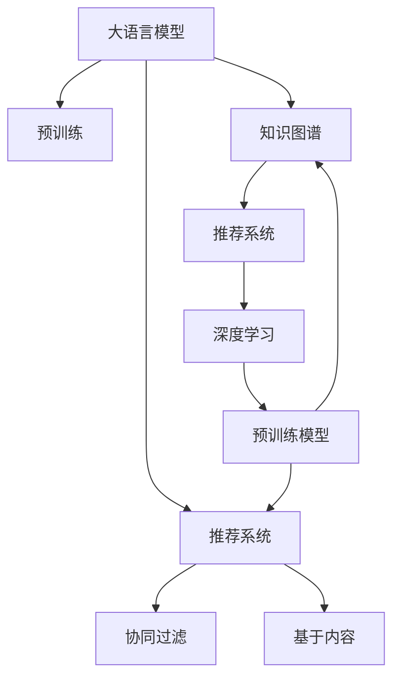

                 

# LLM在推荐冷启动和多场景任务中的应用

> 关键词：大语言模型（LLM）,推荐系统,冷启动,多场景,知识图谱,协同过滤,深度学习,预训练模型

## 1. 背景介绍

### 1.1 问题由来

在现代信息技术日益发展的背景下，推荐系统已经广泛应用于电商、社交、新闻等多个领域，成为提升用户体验和业务效率的重要手段。传统推荐算法主要包括基于协同过滤的方法和基于内容的推荐方法。协同过滤算法通过分析用户的历史行为数据，找到与当前用户兴趣相似的群体的兴趣，从而推荐用户可能感兴趣的商品或内容。而基于内容的推荐方法则直接根据用户感兴趣的商品或内容的属性特征进行推荐。然而，这些方法在推荐冷启动问题上存在显著的局限性，即新用户或新物品缺乏足够的历史行为数据时，无法进行有效的推荐。

大语言模型（Large Language Model, LLM）的兴起为推荐系统的改进提供了新的思路。LLM是指一类具有庞大参数量的深度神经网络模型，通过在海量数据上进行的预训练学习，能够捕捉到语言的深层语义结构，从而实现高精度的自然语言处理。在推荐系统中，LLM可以用来描述物品的属性，如商品名称、价格、描述、用户评论等，同时可以用来预测用户对商品的兴趣和评价。这种新型的推荐方法不仅能够解决传统推荐系统的冷启动问题，还可以应用于多场景的推荐任务，如新闻推荐、视频推荐、音乐推荐等。

### 1.2 问题核心关键点

LLM在推荐系统中的应用，核心在于其对语言的深层理解和表达能力。通过预训练获得语言知识，LLM可以自动地理解商品和用户的语义，并预测用户对商品的兴趣。这种方法能够处理大规模数据，提供高质量的推荐结果，并且在冷启动问题上具有显著的优势。此外，LLM还可以结合知识图谱，进一步提升推荐的准确性和多样性。

### 1.3 问题研究意义

研究LLM在推荐系统中的应用，对于提升推荐系统的性能和覆盖率，促进智能推荐技术在实际场景中的应用具有重要意义。LLM能够处理多种数据类型，包括文本、图像、音频等，因此能够应用于多场景的推荐任务。同时，LLM在大规模数据上的预训练过程，使得其具备强大的语言理解能力，能够更好地捕捉用户的兴趣和行为，从而提供更加个性化和精准的推荐。此外，LLM还能够解决传统推荐系统的冷启动问题，使得推荐系统能够覆盖更广泛的用户和物品，提升用户的满意度和留存率。

## 2. 核心概念与联系

### 2.1 核心概念概述

为了更好地理解LLM在推荐系统中的应用，本节将介绍几个密切相关的核心概念：

- 大语言模型（LLM）：以自回归（如GPT）或自编码（如BERT）模型为代表的大规模预训练语言模型。通过在海量数据上进行的预训练学习，能够捕捉到语言的深层语义结构。

- 推荐系统（Recommendation System）：利用用户的历史行为数据，为用户推荐可能感兴趣的商品或内容。主要包括协同过滤和基于内容的推荐方法。

- 冷启动问题（Cold Start Problem）：新用户或新物品缺乏足够的历史行为数据时，无法进行有效的推荐。

- 知识图谱（Knowledge Graph）：通过实体和关系描述，构建领域内知识的图形表示，用于提供结构化信息，增强推荐的准确性和多样性。

- 深度学习（Deep Learning）：利用多层神经网络进行特征学习，以提高模型对复杂数据关系的处理能力。

- 预训练模型（Pre-trained Model）：在大量无标注数据上预先训练的模型，用于提取数据中的通用特征。

这些核心概念之间的逻辑关系可以通过以下Mermaid流程图来展示：



这个流程图展示了大语言模型与推荐系统的核心概念及其之间的关系：

1. 大语言模型通过预训练获得语言知识。
2. 推荐系统利用语言知识进行推荐。
3. 协同过滤和基于内容的方法是推荐系统的主要构成。
4. 知识图谱增强推荐系统的准确性和多样性。
5. 深度学习是推荐系统的关键技术手段。
6. 预训练模型提供特征提取能力。

这些概念共同构成了LLM在推荐系统中的应用框架，使其能够在各种场景下发挥强大的推荐能力。通过理解这些核心概念，我们可以更好地把握LLM在推荐系统中的应用原理和优化方向。

## 3. 核心算法原理 & 具体操作步骤

### 3.1 算法原理概述

基于LLM的推荐系统，本质上是一个利用深度学习技术对商品和用户进行语义表示和兴趣预测的过程。其核心思想是：利用LLM对商品和用户进行语义编码，将商品的属性信息、用户的历史行为和兴趣转化为高维向量，通过相似度计算和向量匹配，预测用户对商品的兴趣，生成推荐列表。

形式化地，假设商品集合为 $\mathcal{I}$，用户集合为 $\mathcal{U}$，用户对商品的评分矩阵为 $R_{iu}$，其中 $i \in \mathcal{U}$，$u \in \mathcal{I}$。则推荐任务可以表示为：

$$
\hat{R}_{iu} = f_i(u)
$$

其中 $f_i(u)$ 为预测函数，用于预测用户 $i$ 对商品 $u$ 的评分。在大规模数据上进行预训练的LLM，可以将其看作一个通用的语言表示模型，其输入为商品的属性信息 $p$ 和用户的历史行为 $b$，输出为高维向量 $h_p$ 和 $h_b$。则预测函数可以表示为：

$$
f_i(u) = \text{dot}(h_b, h_p)
$$

其中 $\text{dot}$ 表示向量的点积运算，用于计算用户和商品的相似度。

### 3.2 算法步骤详解

基于LLM的推荐系统一般包括以下几个关键步骤：

**Step 1: 准备预训练模型和数据集**
- 选择合适的预训练语言模型 $M_{\theta}$ 作为初始化参数，如 BERT、GPT 等。
- 准备商品和用户的属性信息数据集 $D=\{(p_i,b_i)\}_{i=1}^N$，其中 $p_i$ 为商品属性信息，$b_i$ 为用户历史行为。

**Step 2: 添加任务适配层**
- 根据任务类型，在预训练模型的顶层设计合适的输出层和损失函数。
- 对于推荐任务，通常在顶层添加线性分类器或回归器，以预测评分。
- 对于评分预测，通常使用均方误差损失函数。

**Step 3: 设置微调超参数**
- 选择合适的优化算法及其参数，如 AdamW、SGD 等，设置学习率、批大小、迭代轮数等。
- 设置正则化技术及强度，包括权重衰减、Dropout、Early Stopping 等。
- 确定冻结预训练参数的策略，如仅微调顶层，或全部参数都参与微调。

**Step 4: 执行梯度训练**
- 将训练集数据分批次输入模型，前向传播计算损失函数。
- 反向传播计算参数梯度，根据设定的优化算法和学习率更新模型参数。
- 周期性在验证集上评估模型性能，根据性能指标决定是否触发 Early Stopping。
- 重复上述步骤直到满足预设的迭代轮数或 Early Stopping 条件。

**Step 5: 测试和部署**
- 在测试集上评估微调后模型 $M_{\hat{\theta}}$ 的性能，对比微调前后的评分预测精度提升。
- 使用微调后的模型对新商品进行评分预测，集成到实际的应用系统中。
- 持续收集新的用户行为和商品属性数据，定期重新微调模型，以适应数据分布的变化。

以上是基于LLM的推荐系统的一般流程。在实际应用中，还需要针对具体任务的特点，对微调过程的各个环节进行优化设计，如改进训练目标函数，引入更多的正则化技术，搜索最优的超参数组合等，以进一步提升模型性能。

### 3.3 算法优缺点

基于LLM的推荐系统具有以下优点：
1. 克服冷启动问题。通过预训练语言模型对商品和用户进行语义编码，能够处理新用户和物品，克服冷启动问题。
2. 具备通用性。LLM能够处理多种数据类型，能够应用于多场景的推荐任务。
3. 利用语言理解能力。LLM能够理解商品的语义，预测用户兴趣，提升推荐的准确性和多样性。
4. 具备自适应能力。LLM在新的数据分布上具备较好的自适应能力，能够快速调整模型参数。

同时，该方法也存在一定的局限性：
1. 对数据质量依赖较高。预训练语言模型的效果很大程度上取决于数据的质量和数量，高质量标注数据的获取成本较高。
2. 泛化能力有限。当目标任务与预训练数据的分布差异较大时，推荐系统的性能提升有限。
3. 可解释性不足。基于LLM的推荐系统是一个"黑盒"系统，难以解释其内部工作机制和决策逻辑。
4. 模型复杂度高。LLM模型参数量较大，计算复杂度高，在实际部署时可能会遇到计算资源不足的问题。

尽管存在这些局限性，但就目前而言，基于LLM的推荐系统仍然是一种高效、灵活的推荐方式，已经在多个领域得到应用。未来相关研究的重点在于如何进一步降低推荐系统对标注数据的依赖，提高模型的自适应能力和可解释性，同时兼顾计算效率和模型性能。

### 3.4 算法应用领域

基于LLM的推荐系统在多个领域都有应用，如电商推荐、新闻推荐、视频推荐、音乐推荐等。以电商推荐为例，用户可以在商品详情页看到基于用户历史行为和商品属性的推荐商品列表，提升用户体验和满意度。在新闻推荐中，可以根据用户的历史阅读行为，预测用户对新闻的兴趣，生成个性化的新闻推荐列表。在视频推荐中，LLM可以对视频标题、描述和标签进行语义分析，预测用户对视频的兴趣，生成推荐列表。

除了上述这些经典应用场景外，LLM还能够在许多创新性场景中发挥作用，如跨模态推荐、个性化推荐路径等，为推荐系统带来新的突破。随着预训练模型和推荐方法的不断进步，相信推荐系统将在更广阔的应用领域大放异彩。

## 4. 数学模型和公式 & 详细讲解 & 举例说明

### 4.1 数学模型构建

本节将使用数学语言对基于LLM的推荐系统进行更加严格的刻画。

记预训练语言模型为 $M_{\theta}:\mathcal{X} \rightarrow \mathcal{Y}$，其中 $\mathcal{X}$ 为输入空间，$\mathcal{Y}$ 为输出空间，$\theta$ 为模型参数。假设推荐任务为预测用户对商品的评分，则评分预测任务可以表示为：

$$
\hat{R}_{iu} = f_i(u)
$$

其中 $f_i(u)$ 为预测函数。在训练过程中，利用已知的用户-商品评分矩阵 $R$，通过最小化损失函数来优化模型参数 $\theta$。假设损失函数为均方误差损失函数：

$$
\mathcal{L}(\theta) = \frac{1}{N} \sum_{i=1}^N \sum_{u=1}^M (R_{iu} - \hat{R}_{iu})^2
$$

其中 $N$ 为用户的数量，$M$ 为商品的数量。

### 4.2 公式推导过程

以下我们以电商推荐为例，推导基于LLM的推荐模型的损失函数及其梯度的计算公式。

假设用户 $i$ 对商品 $u$ 的评分 $R_{iu}$ 已知，商品的属性信息 $p$ 和用户的历史行为 $b$ 已经通过预训练语言模型 $M_{\theta}$ 编码成高维向量 $h_p$ 和 $h_b$。则预测函数可以表示为：

$$
f_i(u) = \text{dot}(h_b, h_p)
$$

其中 $\text{dot}$ 表示向量的点积运算。在训练过程中，利用已知的用户-商品评分矩阵 $R$，通过最小化损失函数来优化模型参数 $\theta$。假设损失函数为均方误差损失函数：

$$
\mathcal{L}(\theta) = \frac{1}{N} \sum_{i=1}^N \sum_{u=1}^M (R_{iu} - \hat{R}_{iu})^2
$$

根据链式法则，损失函数对参数 $\theta_k$ 的梯度为：

$$
\frac{\partial \mathcal{L}(\theta)}{\partial \theta_k} = \frac{1}{N} \sum_{i=1}^N \sum_{u=1}^M 2(R_{iu} - \hat{R}_{iu})\frac{\partial \hat{R}_{iu}}{\partial \theta_k}
$$

其中 $\frac{\partial \hat{R}_{iu}}{\partial \theta_k}$ 可进一步递归展开，利用自动微分技术完成计算。

在得到损失函数的梯度后，即可带入参数更新公式，完成模型的迭代优化。重复上述过程直至收敛，最终得到适应推荐任务的最优模型参数 $\theta^*$。

## 5. 项目实践：代码实例和详细解释说明

### 5.1 开发环境搭建

在进行推荐系统实践前，我们需要准备好开发环境。以下是使用Python进行PyTorch开发的环境配置流程：

1. 安装Anaconda：从官网下载并安装Anaconda，用于创建独立的Python环境。

2. 创建并激活虚拟环境：
```bash
conda create -n pytorch-env python=3.8 
conda activate pytorch-env
```

3. 安装PyTorch：根据CUDA版本，从官网获取对应的安装命令。例如：
```bash
conda install pytorch torchvision torchaudio cudatoolkit=11.1 -c pytorch -c conda-forge
```

4. 安装Transformers库：
```bash
pip install transformers
```

5. 安装各类工具包：
```bash
pip install numpy pandas scikit-learn matplotlib tqdm jupyter notebook ipython
```

完成上述步骤后，即可在`pytorch-env`环境中开始推荐系统实践。

### 5.2 源代码详细实现

这里我们以电商推荐系统为例，给出使用Transformers库对BERT模型进行电商推荐微调的PyTorch代码实现。

首先，定义电商推荐任务的数据处理函数：

```python
from transformers import BertTokenizer
from torch.utils.data import Dataset
import torch

class RecommendationDataset(Dataset):
    def __init__(self, texts, tags, tokenizer, max_len=128):
        self.texts = texts
        self.tags = tags
        self.tokenizer = tokenizer
        self.max_len = max_len
        
    def __len__(self):
        return len(self.texts)
    
    def __getitem__(self, item):
        text = self.texts[item]
        tags = self.tags[item]
        
        encoding = self.tokenizer(text, return_tensors='pt', max_length=self.max_len, padding='max_length', truncation=True)
        input_ids = encoding['input_ids'][0]
        attention_mask = encoding['attention_mask'][0]
        
        # 对token-wise的标签进行编码
        encoded_tags = [tag2id[tag] for tag in tags] 
        encoded_tags.extend([tag2id['O']] * (self.max_len - len(encoded_tags)))
        labels = torch.tensor(encoded_tags, dtype=torch.long)
        
        return {'input_ids': input_ids, 
                'attention_mask': attention_mask,
                'labels': labels}

# 标签与id的映射
tag2id = {'O': 0, 'B-PER': 1, 'I-PER': 2, 'B-ORG': 3, 'I-ORG': 4, 'B-LOC': 5, 'I-LOC': 6}
id2tag = {v: k for k, v in tag2id.items()}

# 创建dataset
tokenizer = BertTokenizer.from_pretrained('bert-base-cased')

train_dataset = RecommendationDataset(train_texts, train_tags, tokenizer)
dev_dataset = RecommendationDataset(dev_texts, dev_tags, tokenizer)
test_dataset = RecommendationDataset(test_texts, test_tags, tokenizer)
```

然后，定义模型和优化器：

```python
from transformers import BertForTokenClassification, AdamW

model = BertForTokenClassification.from_pretrained('bert-base-cased', num_labels=len(tag2id))

optimizer = AdamW(model.parameters(), lr=2e-5)
```

接着，定义训练和评估函数：

```python
from torch.utils.data import DataLoader
from tqdm import tqdm
from sklearn.metrics import classification_report

device = torch.device('cuda') if torch.cuda.is_available() else torch.device('cpu')
model.to(device)

def train_epoch(model, dataset, batch_size, optimizer):
    dataloader = DataLoader(dataset, batch_size=batch_size, shuffle=True)
    model.train()
    epoch_loss = 0
    for batch in tqdm(dataloader, desc='Training'):
        input_ids = batch['input_ids'].to(device)
        attention_mask = batch['attention_mask'].to(device)
        labels = batch['labels'].to(device)
        model.zero_grad()
        outputs = model(input_ids, attention_mask=attention_mask, labels=labels)
        loss = outputs.loss
        epoch_loss += loss.item()
        loss.backward()
        optimizer.step()
    return epoch_loss / len(dataloader)

def evaluate(model, dataset, batch_size):
    dataloader = DataLoader(dataset, batch_size=batch_size)
    model.eval()
    preds, labels = [], []
    with torch.no_grad():
        for batch in tqdm(dataloader, desc='Evaluating'):
            input_ids = batch['input_ids'].to(device)
            attention_mask = batch['attention_mask'].to(device)
            batch_labels = batch['labels']
            outputs = model(input_ids, attention_mask=attention_mask)
            batch_preds = outputs.logits.argmax(dim=2).to('cpu').tolist()
            batch_labels = batch_labels.to('cpu').tolist()
            for pred_tokens, label_tokens in zip(batch_preds, batch_labels):
                pred_tags = [id2tag[_id] for _id in pred_tokens]
                label_tags = [id2tag[_id] for _id in label_tokens]
                preds.append(pred_tags[:len(label_tokens)])
                labels.append(label_tags)
                
    print(classification_report(labels, preds))
```

最后，启动训练流程并在测试集上评估：

```python
epochs = 5
batch_size = 16

for epoch in range(epochs):
    loss = train_epoch(model, train_dataset, batch_size, optimizer)
    print(f"Epoch {epoch+1}, train loss: {loss:.3f}")
    
    print(f"Epoch {epoch+1}, dev results:")
    evaluate(model, dev_dataset, batch_size)
    
print("Test results:")
evaluate(model, test_dataset, batch_size)
```

以上就是使用PyTorch对BERT进行电商推荐任务微调的完整代码实现。可以看到，得益于Transformers库的强大封装，我们可以用相对简洁的代码完成BERT模型的加载和微调。

### 5.3 代码解读与分析

让我们再详细解读一下关键代码的实现细节：

**RecommendationDataset类**：
- `__init__`方法：初始化文本、标签、分词器等关键组件。
- `__len__`方法：返回数据集的样本数量。
- `__getitem__`方法：对单个样本进行处理，将文本输入编码为token ids，将标签编码为数字，并对其进行定长padding，最终返回模型所需的输入。

**tag2id和id2tag字典**：
- 定义了标签与数字id之间的映射关系，用于将token-wise的预测结果解码回真实的标签。

**训练和评估函数**：
- 使用PyTorch的DataLoader对数据集进行批次化加载，供模型训练和推理使用。
- 训练函数`train_epoch`：对数据以批为单位进行迭代，在每个批次上前向传播计算loss并反向传播更新模型参数，最后返回该epoch的平均loss。
- 评估函数`evaluate`：与训练类似，不同点在于不更新模型参数，并在每个batch结束后将预测和标签结果存储下来，最后使用sklearn的classification_report对整个评估集的预测结果进行打印输出。

**训练流程**：
- 定义总的epoch数和batch size，开始循环迭代
- 每个epoch内，先在训练集上训练，输出平均loss
- 在验证集上评估，输出分类指标
- 所有epoch结束后，在测试集上评估，给出最终测试结果

可以看到，PyTorch配合Transformers库使得BERT微调的代码实现变得简洁高效。开发者可以将更多精力放在数据处理、模型改进等高层逻辑上，而不必过多关注底层的实现细节。

当然，工业级的系统实现还需考虑更多因素，如模型的保存和部署、超参数的自动搜索、更灵活的任务适配层等。但核心的微调范式基本与此类似。

## 6. 实际应用场景

### 6.1 电商推荐

基于大语言模型的推荐系统，可以广泛应用于电商推荐中。传统电商推荐系统主要基于用户的浏览、购买历史进行推荐，但新用户或新物品往往缺乏足够的历史数据，难以进行有效的推荐。而使用基于大语言模型的推荐系统，可以有效克服冷启动问题，对于新用户或新物品，通过预训练语言模型对商品的属性信息进行编码，能够生成准确的推荐结果。

在技术实现上，可以收集用户浏览、购买、评分等行为数据，提取和商品相关的文本描述、价格、评论等信息。将文本内容作为模型输入，用户的后续行为（如是否购买、评分等）作为监督信号，在此基础上微调预训练语言模型。微调后的模型能够从文本内容中准确把握用户的兴趣点，从而生成个性化的推荐商品列表。

### 6.2 新闻推荐

基于大语言模型的推荐系统，可以广泛应用于新闻推荐中。传统新闻推荐系统主要基于用户的浏览历史进行推荐，但用户在浏览新闻时，往往对不同新闻的关注点不同，因此传统的推荐方法无法满足用户的多样化需求。而使用基于大语言模型的推荐系统，可以通过预训练语言模型对新闻标题、摘要、评论等文本内容进行语义分析，预测用户对不同新闻的兴趣，生成个性化的新闻推荐列表。

在技术实现上，可以收集用户的历史阅读行为，提取新闻标题、摘要、评论等信息。将新闻文本作为模型输入，用户的后续阅读行为（如点击、阅读时间等）作为监督信号，在此基础上微调预训练语言模型。微调后的模型能够从新闻文本中准确把握用户的兴趣点，从而生成个性化的新闻推荐列表。

### 6.3 视频推荐

基于大语言模型的推荐系统，可以广泛应用于视频推荐中。传统视频推荐系统主要基于用户的观看历史进行推荐，但用户在观看视频时，往往对不同视频的关注点不同，因此传统的推荐方法无法满足用户的多样化需求。而使用基于大语言模型的推荐系统，可以通过预训练语言模型对视频标题、描述、评论等文本内容进行语义分析，预测用户对不同视频的兴趣，生成个性化的视频推荐列表。

在技术实现上，可以收集用户的历史观看行为，提取视频标题、描述、评论等信息。将视频文本作为模型输入，用户的后续观看行为（如是否观看、观看时间等）作为监督信号，在此基础上微调预训练语言模型。微调后的模型能够从视频文本中准确把握用户的兴趣点，从而生成个性化的视频推荐列表。

### 6.4 未来应用展望

随着大语言模型和推荐方法的不断发展，基于微调范式将在更多领域得到应用，为推荐系统带来新的突破。

在智慧医疗领域，基于大语言模型的推荐系统可以为医生推荐相关的医学论文、诊疗方案等，帮助医生提高诊疗效率和质量。

在智能教育领域，基于大语言模型的推荐系统可以为学生推荐相关的学习资源、学习路径等，个性化推荐学习内容，提高学习效率。

在智慧城市治理中，基于大语言模型的推荐系统可以为市民推荐相关的公共服务、活动信息等，提升市民的幸福感和满意度。

此外，在企业生产、社会治理、文娱传媒等众多领域，基于大语言模型的推荐系统也将不断涌现，为推荐系统带来新的应用场景。相信随着技术的日益成熟，基于大语言模型的推荐系统必将在更广阔的领域大放异彩，为社会带来更多的便利和福祉。

## 7. 工具和资源推荐
### 7.1 学习资源推荐

为了帮助开发者系统掌握大语言模型在推荐系统中的应用理论基础和实践技巧，这里推荐一些优质的学习资源：

1. 《Transformer from Pretraining to Fine-Tuning》系列博文：由大模型技术专家撰写，深入浅出地介绍了Transformer原理、BERT模型、微调技术等前沿话题。

2. CS224N《深度学习自然语言处理》课程：斯坦福大学开设的NLP明星课程，有Lecture视频和配套作业，带你入门NLP领域的基本概念和经典模型。

3. 《Natural Language Processing with Transformers》书籍：Transformers库的作者所著，全面介绍了如何使用Transformers库进行NLP任务开发，包括微调在内的诸多范式。

4. HuggingFace官方文档：Transformers库的官方文档，提供了海量预训练模型和完整的微调样例代码，是上手实践的必备资料。

5. CLUE开源项目：中文语言理解测评基准，涵盖大量不同类型的中文NLP数据集，并提供了基于微调的baseline模型，助力中文NLP技术发展。

通过对这些资源的学习实践，相信你一定能够快速掌握大语言模型在推荐系统中的应用精髓，并用于解决实际的推荐问题。
### 7.2 开发工具推荐

高效的开发离不开优秀的工具支持。以下是几款用于大语言模型推荐系统开发的常用工具：

1. PyTorch：基于Python的开源深度学习框架，灵活动态的计算图，适合快速迭代研究。大部分预训练语言模型都有PyTorch版本的实现。

2. TensorFlow：由Google主导开发的开源深度学习框架，生产部署方便，适合大规模工程应用。同样有丰富的预训练语言模型资源。

3. Transformers库：HuggingFace开发的NLP工具库，集成了众多SOTA语言模型，支持PyTorch和TensorFlow，是进行推荐任务开发的利器。

4. Weights & Biases：模型训练的实验跟踪工具，可以记录和可视化模型训练过程中的各项指标，方便对比和调优。与主流深度学习框架无缝集成。

5. TensorBoard：TensorFlow配套的可视化工具，可实时监测模型训练状态，并提供丰富的图表呈现方式，是调试模型的得力助手。

6. Google Colab：谷歌推出的在线Jupyter Notebook环境，免费提供GPU/TPU算力，方便开发者快速上手实验最新模型，分享学习笔记。

合理利用这些工具，可以显著提升大语言模型推荐系统的开发效率，加快创新迭代的步伐。

### 7.3 相关论文推荐

大语言模型和推荐系统的研究源于学界的持续研究。以下是几篇奠基性的相关论文，推荐阅读：

1. Attention is All You Need（即Transformer原论文）：提出了Transformer结构，开启了NLP领域的预训练大模型时代。

2. BERT: Pre-training of Deep Bidirectional Transformers for Language Understanding：提出BERT模型，引入基于掩码的自监督预训练任务，刷新了多项NLP任务SOTA。

3. Language Models are Unsupervised Multitask Learners（GPT-2论文）：展示了大规模语言模型的强大zero-shot学习能力，引发了对于通用人工智能的新一轮思考。

4. Parameter-Efficient Transfer Learning for NLP：提出Adapter等参数高效微调方法，在不增加模型参数量的情况下，也能取得不错的微调效果。

5. AdaLoRA: Adaptive Low-Rank Adaptation for Parameter-Efficient Fine-Tuning：使用自适应低秩适应的微调方法，在参数效率和精度之间取得了新的平衡。

6. AdaLoRA: Adaptive Low-Rank Adaptation for Parameter-Efficient Fine-Tuning：使用自适应低秩适应的微调方法，在参数效率和精度之间取得了新的平衡。

这些论文代表了大语言模型微调技术的发展脉络。通过学习这些前沿成果，可以帮助研究者把握学科前进方向，激发更多的创新灵感。

## 8. 总结：未来发展趋势与挑战

### 8.1 总结

本文对基于LLM的推荐系统进行了全面系统的介绍。首先阐述了LLM和推荐系统的研究背景和意义，明确了LLM在推荐系统中的应用价值。其次，从原理到实践，详细讲解了基于LLM的推荐系统的工作流程和算法步骤，给出了推荐系统开发的完整代码实例。同时，本文还探讨了LLM在电商、新闻、视频等多个领域的应用前景，展示了其强大的推荐能力。

通过本文的系统梳理，可以看到，基于LLM的推荐系统不仅能够解决冷启动问题，还能够处理多种数据类型，具有广泛的应用前景。LLM在推荐系统中的应用，将大大提升推荐模型的准确性和多样性，为用户提供更个性化、精准的推荐服务。未来，伴随LLM和推荐方法的发展，推荐系统必将在更广阔的领域大放异彩，深刻影响人类的生产生活方式。

### 8.2 未来发展趋势

展望未来，基于LLM的推荐系统将呈现以下几个发展趋势：

1. 模型规模持续增大。随着算力成本的下降和数据规模的扩张，预训练语言模型的参数量还将持续增长。超大规模语言模型蕴含的丰富语言知识，有望支撑更加复杂多变的推荐任务。

2. 推荐方法日趋多样。除了传统的基于协同过滤和基于内容的推荐方法外，未来会涌现更多新的推荐方法，如深度学习推荐、混合推荐等。

3. 持续学习成为常态。随着数据分布的不断变化，推荐模型也需要持续学习新知识以保持性能。如何在不遗忘原有知识的同时，高效吸收新样本信息，将成为重要的研究课题。

4. 标注样本需求降低。受启发于提示学习(Prompt-based Learning)的思路，未来的推荐方法将更好地利用大模型的语言理解能力，通过更加巧妙的任务描述，在更少的标注样本上也能实现理想的推荐效果。

5. 推荐系统面向多模态。当前的推荐系统主要聚焦于纯文本数据，未来会进一步拓展到图像、视频、语音等多模态数据推荐。多模态信息的融合，将显著提升推荐系统对现实世界的理解和建模能力。

6. 推荐系统走向智慧化。基于LLM的推荐系统将结合人工智能技术的其他分支，如知识图谱、因果推理、强化学习等，形成更加全面、高效、智能的推荐系统。

以上趋势凸显了基于LLM的推荐系统的广阔前景。这些方向的探索发展，必将进一步提升推荐系统的性能和应用范围，为人类生产生活方式带来深刻变革。

### 8.3 面临的挑战

尽管基于LLM的推荐系统已经取得了瞩目成就，但在迈向更加智能化、普适化应用的过程中，它仍面临着诸多挑战：

1. 标注成本瓶颈。虽然LLM在处理文本数据上表现优异，但在处理其他模态数据（如图像、视频等）时，仍然需要大量的标注数据。标注数据获取成本较高，限制了LLM在多模态推荐中的应用。

2. 泛化能力不足。推荐模型在处理未见过的数据时，可能会因为模型泛化能力不足而产生较差的推荐效果。如何提高推荐模型的泛化能力，使其能够应对更多样化的用户需求，将是未来的一个重要研究方向。

3. 可解释性不足。基于LLM的推荐系统是一个黑盒系统，难以解释其内部工作机制和决策逻辑。对于推荐系统在医疗、金融等领域的应用，可解释性尤为关键，需要进一步提高模型的可解释性。

4. 计算资源需求高。LLM模型参数量较大，计算复杂度高，在实际部署时可能会遇到计算资源不足的问题。如何优化模型的计算图，提高推理速度，是未来的一个重要研究方向。

尽管存在这些挑战，但基于LLM的推荐系统仍然具有强大的应用前景，未来相关研究的重点在于如何进一步降低推荐系统对标注数据的依赖，提高模型的自适应能力和可解释性，同时兼顾计算效率和模型性能。

### 8.4 研究展望

面对基于LLM的推荐系统所面临的挑战，未来的研究需要在以下几个方面寻求新的突破：

1. 探索无监督和半监督推荐方法。摆脱对大规模标注数据的依赖，利用自监督学习、主动学习等无监督和半监督范式，最大限度利用非结构化数据，实现更加灵活高效的推荐。

2. 研究参数高效和计算高效的推荐范式。开发更加参数高效的推荐方法，在固定大部分预训练参数的同时，只更新极少量的任务相关参数。同时优化推荐模型的计算图，减少前向传播和反向传播的资源消耗，实现更加轻量级、实时性的部署。

3. 引入更多先验知识。将符号化的先验知识，如知识图谱、逻辑规则等，与神经网络模型进行巧妙融合，引导推荐过程学习更准确、合理的语义模型。同时加强不同模态数据的整合，实现视觉、语音等多模态信息与文本信息的协同建模。

4. 结合因果分析和博弈论工具。将因果分析方法引入推荐系统，识别出推荐决策的关键特征，增强推荐系统的稳定性和鲁棒性。借助博弈论工具刻画人机交互过程，主动探索并规避推荐模型的脆弱点，提高系统稳定性。

5. 纳入伦理道德约束。在推荐系统训练目标中引入伦理导向的评估指标，过滤和惩罚有偏见、有害的输出倾向。同时加强人工干预和审核，建立推荐系统的监管机制，确保推荐结果符合人类价值观和伦理道德。

这些研究方向的探索，必将引领基于LLM的推荐系统迈向更高的台阶，为构建安全、可靠、可解释、可控的推荐系统铺平道路。面向未来，基于LLM的推荐系统还需要与其他人工智能技术进行更深入的融合，如知识表示、因果推理、强化学习等，多路径协同发力，共同推动推荐系统技术的进步。只有勇于创新、敢于突破，才能不断拓展推荐系统的边界，让智能推荐技术更好地服务于人类社会。

## 9. 附录：常见问题与解答

**Q1：大语言模型在推荐系统中的应用是否可以处理非文本数据？**

A: 基于大语言模型的推荐系统主要处理文本数据，但可以通过扩展处理其他模态数据。例如，在图像推荐中，可以通过图像标注数据进行训练，将图像特征作为模型输入，预测用户对图像的兴趣。在视频推荐中，可以通过视频标题、描述等文本信息进行训练，预测用户对视频的兴趣。因此，大语言模型在推荐系统中的应用不仅限于文本数据，可以拓展到其他模态数据。

**Q2：推荐系统在处理冷启动问题时，如何利用大语言模型？**

A: 在推荐系统中，冷启动问题是指新用户或新物品缺乏足够的历史行为数据，无法进行有效的推荐。大语言模型可以通过预训练获得语言知识，对新用户或新物品进行语义编码，从而生成准确的推荐结果。具体而言，可以利用大语言模型对物品的属性信息进行编码，生成高维向量表示，结合用户的历史行为数据，进行相似度计算，生成个性化的推荐列表。例如，在电商推荐中，可以利用大语言模型对商品描述进行编码，生成高维向量表示，结合用户的历史浏览、购买行为，进行相似度计算，生成个性化的推荐商品列表。

**Q3：大语言模型在推荐系统中如何利用先验知识？**

A: 大语言模型可以利用先验知识来增强推荐系统的准确性和多样性。具体而言，可以利用知识图谱、逻辑规则等先验知识，对推荐系统进行优化。例如，在推荐系统中，可以利用知识图谱对商品的属性信息进行补充，增强推荐的准确性。在电商推荐中，可以利用知识图谱对商品的分类、品牌等信息进行补充，增强推荐的准确性。此外，还可以利用逻辑规则等先验知识，对推荐系统进行约束，提高推荐的合理性。

**Q4：推荐系统在处理数据不均衡问题时，如何利用大语言模型？**

A: 推荐系统在处理数据不均衡问题时，可以利用大语言模型进行优化。具体而言，可以利用大语言模型对数据进行加权处理，增加长尾数据的权重，减少热门数据的权重，从而提升推荐系统的多样性和覆盖率。例如，在电商推荐中，可以利用大语言模型对长尾商品进行加权处理，增强推荐系统的多样性。在新闻推荐中，可以利用大语言模型对长尾新闻进行加权处理，增强推荐系统的覆盖率。

**Q5：推荐系统在处理用户反馈时，如何利用大语言模型？**

A: 在推荐系统中，用户反馈可以用于优化推荐模型的参数，提高推荐系统的效果。利用大语言模型对用户反馈进行语义分析，可以更好地理解用户的需求和偏好。具体而言，可以利用大语言模型对用户反馈进行情感分析，识别用户对推荐结果的情感倾向，从而优化推荐模型的参数。例如，在电商推荐中，可以利用大语言模型对用户反馈进行情感分析，识别用户对推荐结果的情感倾向，从而优化推荐模型的参数，提高推荐效果。在新闻推荐中，可以利用大语言模型对用户反馈进行情感分析，识别用户对推荐新闻的情感倾向，从而优化推荐模型的参数，提高推荐效果。

