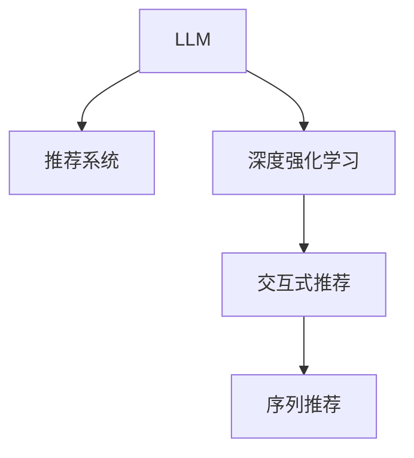

                 

# LLM在推荐系统中的深度强化学习应用

> 关键词：大语言模型(LLM), 推荐系统, 深度强化学习, 交互式推荐, 序列推荐

## 1. 背景介绍

### 1.1 问题由来
推荐系统作为现代互联网应用的核心引擎之一，旨在通过分析用户的行为和偏好，为其推荐个性化内容。传统的推荐方法主要依赖于协同过滤、矩阵分解等基于统计的算法，这些方法在初期取得了巨大成功，但也存在诸多局限：
- **冷启动问题**：新用户或新物品难以被系统理解，难以生成准确推荐。
- **数据稀疏性**：用户与物品的交互记录稀少，推荐精度难以提升。
- **动态变化**：用户偏好随时间动态变化，传统方法难以灵活适应。

大语言模型（Large Language Model, LLM）的崛起为推荐系统带来了全新的范式。LLM具备强大的自然语言理解能力，能够通过文本数据捕获用户的兴趣和意图，从而提升推荐的个性化和精准度。此外，LLM在连续交互中表现优异，能够动态生成推荐内容，适应用户的实时变化。

### 1.2 问题核心关键点
本文聚焦于在推荐系统中应用深度强化学习（Deep Reinforcement Learning, DRL）结合LLM，以解决传统推荐方法面临的挑战，提升推荐系统的性能。具体而言，我们将重点探讨：
- **基于LLM的推荐模型构建**：如何利用LLM的自然语言理解能力，构建个性化的推荐模型。
- **深度强化学习的应用**：如何在推荐任务中使用DRL算法，优化模型在长期和实时推荐中的表现。
- **模型融合与策略优化**：如何融合LLM和DRL的优势，设计更加高效的推荐策略。

## 2. 核心概念与联系

### 2.1 核心概念概述

在探讨LLM在推荐系统中的应用前，我们首先需要理解几个核心概念：

- **大语言模型(LLM)**：以Transformer为代表的预训练语言模型，通过大规模无监督学习获得强大的语言理解能力。LLM可以处理自然语言文本，并生成符合语法和语义的文本输出。
- **推荐系统**：根据用户的历史行为和偏好，为其推荐可能感兴趣的内容。推荐系统在电商、新闻、社交网络等多个领域得到了广泛应用。
- **深度强化学习(DRL)**：结合深度学习和强化学习的强化学习范式，适用于复杂动态系统的决策优化。DRL通过智能体与环境的交互，优化决策策略，最大化长期收益。
- **交互式推荐**：在用户与推荐系统交互的过程中，动态生成推荐内容，提升用户体验和满意度。
- **序列推荐**：针对用户随时间变化的兴趣序列，生成连续的推荐内容，保持推荐的相关性和及时性。

这些核心概念之间相互关联，共同构成了LLM在推荐系统中应用的理论基础。

### 2.2 核心概念原理和架构的 Mermaid 流程图(Mermaid 流程节点中不要有括号、逗号等特殊字符)



该流程图展示了LLM、推荐系统、深度强化学习、交互式推荐和序列推荐之间的联系：

1. **LLM**：作为推荐系统的重要组件，通过预训练获得强大的语言理解和生成能力，可以处理和生成自然语言数据。
2. **推荐系统**：利用LLM和DRL技术，为用户推荐个性化内容。
3. **深度强化学习**：作为优化算法，通过与环境的交互，学习推荐策略。
4. **交互式推荐**：在用户与系统的实时互动中，动态调整推荐策略。
5. **序列推荐**：基于用户的兴趣序列，生成连续的推荐内容。

## 3. 核心算法原理 & 具体操作步骤
### 3.1 算法原理概述

基于LLM的推荐系统结合了深度强化学习的思想，旨在通过智能体与环境的交互，优化推荐策略。其核心思想是：在推荐任务中，用户的历史行为和偏好可以被看作是一种奖励信号，智能体通过不断与环境互动，学习最大化长期奖励的推荐策略。

具体而言，假设用户的历史行为序列为 $H=\{h_1, h_2, ..., h_T\}$，智能体的目标是生成一系列推荐 $A=\{a_1, a_2, ..., a_T\}$，使得在每一步 $t$，用户点击、购买等行为的概率最大化。推荐系统可以通过如下公式进行优化：

$$
\max_{A} \sum_{t=1}^{T} r_t \cdot \mathbb{P}(h_{t+1} = a_t)
$$

其中，$r_t$ 为在步骤 $t$ 的奖励信号，$\mathbb{P}(h_{t+1} = a_t)$ 为在步骤 $t$ 推荐 $a_t$ 的点击概率。

### 3.2 算法步骤详解

基于LLM的推荐系统结合DRL的典型步骤包括：

**Step 1: 数据预处理**
- 收集用户的历史行为数据 $H$，包括浏览、点击、购买等行为。
- 对用户行为进行编码，生成序列 $H$ 的向量表示。

**Step 2: 定义状态和动作空间**
- 状态 $s_t$：用户当前的行为状态，如当前浏览的网页、浏览时间等。
- 动作 $a_t$：推荐系统推荐的内容，如商品、文章等。
- 奖励 $r_t$：用户在当前状态下选择推荐的点击、购买等行为的概率。

**Step 3: 构建推荐模型**
- 基于LLM的推荐模型：将用户行为序列 $H$ 作为输入，通过LLM生成推荐内容 $A$。
- 深度强化学习模型：设计智能体，通过学习优化推荐策略，最大化长期奖励。

**Step 4: 训练智能体**
- 使用环境模拟用户行为，智能体在每一步选择推荐 $a_t$，观察状态变化和奖励 $r_t$。
- 通过逆强化学习算法，更新智能体的决策策略。
- 重复上述过程，直至收敛。

**Step 5: 评估与部署**
- 在测试集上评估推荐模型的性能，如点击率、转化率等指标。
- 部署推荐模型到实际系统中，实时生成推荐内容。

### 3.3 算法优缺点

结合LLM的推荐系统结合DRL的算法具有以下优点：
1. **动态适应性**：通过实时互动，动态调整推荐策略，适应用户兴趣变化。
2. **个性化推荐**：利用LLM的自然语言理解能力，精准捕捉用户兴趣和意图，提升推荐的相关性。
3. **长期优化**：通过DRL算法，优化长期推荐效果，避免短期行为带来的偏差。
4. **鲁棒性**：DRL算法具有较强的鲁棒性，能够应对复杂和动态的推荐环境。

同时，该算法也存在以下局限性：
1. **模型复杂度**：结合LLM和DRL的模型相对复杂，训练和推理效率较低。
2. **数据需求高**：需要大量用户行为数据进行训练，对数据质量要求较高。
3. **解释性不足**：LLM和DRL的决策过程较为复杂，缺乏可解释性，难以理解和调试。

### 3.4 算法应用领域

结合LLM的推荐系统在以下领域中具有广泛的应用前景：

- **电商推荐**：为用户推荐可能感兴趣的商品，提升购物体验和转化率。
- **新闻推荐**：根据用户阅读历史，推荐相关新闻，增加用户粘性。
- **视频推荐**：根据用户观影历史，推荐相关视频内容，增加用户观看时间和满意度。
- **音乐推荐**：根据用户听歌历史，推荐相关歌曲和专辑，提升音乐体验。
- **社交网络**：为用户推荐好友和相关内容，增强社交互动和平台粘性。

## 4. 数学模型和公式 & 详细讲解  
### 4.1 数学模型构建

在推荐系统中应用LLM和DRL，需要构建如下数学模型：

**用户行为表示**：假设用户的历史行为序列为 $H=\{h_1, h_2, ..., h_T\}$，其中 $h_t \in \mathcal{V}$，$\mathcal{V}$ 为用户行为状态空间。

**推荐内容表示**：假设推荐内容为 $A=\{a_1, a_2, ..., a_T\}$，其中 $a_t \in \mathcal{U}$，$\mathcal{U}$ 为推荐内容空间。

**奖励函数**：假设用户选择推荐内容 $a_t$ 的概率为 $p_t=\mathbb{P}(h_{t+1} = a_t)$，奖励函数为 $r_t = p_t \cdot \log p_t$，表示用户点击推荐内容的概率。

**推荐模型**：假设推荐模型为 $F$，将用户行为序列 $H$ 作为输入，输出推荐内容序列 $A$。

**智能体策略**：假设智能体的决策策略为 $\pi$，在每个状态 $s_t$ 下选择推荐 $a_t$。

**强化学习目标**：优化智能体策略 $\pi$，使得长期奖励最大化。

### 4.2 公式推导过程

基于上述模型，我们可以使用逆强化学习算法（Inverse Reinforcement Learning, IRL）进行推荐模型的优化。

**逆强化学习算法**：假设智能体在每一步 $t$ 选择推荐 $a_t$，观察状态变化和奖励 $r_t$，逆强化学习目标为最大化期望奖励：

$$
\max_{\pi} \mathbb{E}_{\pi}[ \sum_{t=1}^{T} r_t \cdot \log \pi(a_t | s_t)]
$$

通过求解上述优化问题，可以学习到最优的推荐策略 $\pi$。

**推荐模型优化**：假设推荐模型 $F$ 为深度神经网络，其参数为 $\theta$，目标为最大化期望奖励：

$$
\max_{\theta} \mathbb{E}_{\pi}[ \sum_{t=1}^{T} r_t \cdot \log \pi(a_t | s_t)]
$$

通过求解上述优化问题，可以学习到最优的推荐模型参数 $\theta$。

### 4.3 案例分析与讲解

为了更好地理解逆强化学习算法在推荐系统中的应用，我们以电商推荐为例，进行详细讲解。

假设电商平台收集到用户的历史行为数据 $H=\{h_1, h_2, ..., h_T\}$，其中 $h_t = (b_t, p_t, c_t)$，分别表示用户浏览时间、浏览页面、点击率。电商平台希望根据用户行为，为用户推荐可能感兴趣的商品。

**步骤1: 数据预处理**
- 将用户行为数据编码，生成向量表示 $H$。
- 假设用户的点击行为为 $1$，其他行为为 $0$。

**步骤2: 定义状态和动作空间**
- 状态 $s_t$：用户当前浏览的页面，如商品页面、商品详情页等。
- 动作 $a_t$：推荐系统推荐的内容，如商品 $a_t = (i, j, k)$，其中 $i$ 为商品ID，$j$ 为商品类别，$k$ 为商品价格。
- 奖励 $r_t$：用户在当前状态下选择推荐的点击概率。

**步骤3: 构建推荐模型**
- 使用BERT等预训练语言模型作为推荐模型的特征提取器。
- 设计DRL智能体，通过学习推荐策略，最大化长期奖励。

**步骤4: 训练智能体**
- 模拟用户点击行为，智能体在每一步选择推荐 $a_t$，观察状态变化和奖励 $r_t$。
- 使用逆强化学习算法，更新智能体的决策策略 $\pi$。
- 重复上述过程，直至收敛。

**步骤5: 评估与部署**
- 在测试集上评估推荐模型的性能，如点击率、转化率等指标。
- 部署推荐模型到实际系统中，实时生成推荐内容。

## 5. 项目实践：代码实例和详细解释说明
### 5.1 开发环境搭建

在开发基于LLM的推荐系统时，我们需要使用Python和深度学习框架，如TensorFlow或PyTorch。以下是基本的开发环境配置步骤：

1. 安装Anaconda：从官网下载并安装Anaconda，用于创建独立的Python环境。
2. 创建并激活虚拟环境：
```bash
conda create -n recsys python=3.8 
conda activate recsys
```
3. 安装依赖包：
```bash
pip install torch torchvision torchaudio numpy pandas scikit-learn matplotlib tqdm jupyter notebook ipython
```

完成上述步骤后，即可在`recsys`环境中开始开发实践。

### 5.2 源代码详细实现

这里我们以电商推荐为例，使用PyTorch实现基于BERT的推荐模型。

```python
import torch
import torch.nn as nn
from transformers import BertTokenizer, BertForSequenceClassification
from torch.utils.data import Dataset, DataLoader

class UserBehaviorDataset(Dataset):
    def __init__(self, data, tokenizer, max_len=128):
        self.data = data
        self.tokenizer = tokenizer
        self.max_len = max_len
        
    def __len__(self):
        return len(self.data)
    
    def __getitem__(self, index):
        item = self.data[index]
        sequence = item['sequence']
        label = item['label']
        
        encoding = self.tokenizer(sequence, return_tensors='pt', max_length=self.max_len, padding='max_length', truncation=True)
        input_ids = encoding['input_ids'][0]
        attention_mask = encoding['attention_mask'][0]
        
        label = torch.tensor(label, dtype=torch.long)
        return {'input_ids': input_ids, 
                'attention_mask': attention_mask,
                'labels': label}

# 加载数据集
tokenizer = BertTokenizer.from_pretrained('bert-base-cased')
train_dataset = UserBehaviorDataset(train_data, tokenizer)
val_dataset = UserBehaviorDataset(val_data, tokenizer)
test_dataset = UserBehaviorDataset(test_data, tokenizer)

# 定义模型
model = BertForSequenceClassification.from_pretrained('bert-base-cased', num_labels=2)

# 定义优化器和损失函数
optimizer = torch.optim.Adam(model.parameters(), lr=2e-5)
criterion = nn.BCEWithLogitsLoss()

# 定义训练函数
def train(model, train_dataset, val_dataset, optimizer, criterion, num_epochs=5, batch_size=16):
    total_loss = 0
    for epoch in range(num_epochs):
        model.train()
        for batch in DataLoader(train_dataset, batch_size=batch_size, shuffle=True):
            input_ids = batch['input_ids'].to(device)
            attention_mask = batch['attention_mask'].to(device)
            labels = batch['labels'].to(device)
            optimizer.zero_grad()
            outputs = model(input_ids, attention_mask=attention_mask)
            loss = criterion(outputs, labels)
            loss.backward()
            optimizer.step()
            total_loss += loss.item()
        epoch_loss = total_loss / len(train_dataset)
        print(f"Epoch {epoch+1}, train loss: {epoch_loss:.3f}")
        
        model.eval()
        with torch.no_grad():
            total_loss = 0
            for batch in DataLoader(val_dataset, batch_size=batch_size):
                input_ids = batch['input_ids'].to(device)
                attention_mask = batch['attention_mask'].to(device)
                labels = batch['labels'].to(device)
                outputs = model(input_ids, attention_mask=attention_mask)
                loss = criterion(outputs, labels)
                total_loss += loss.item()
            epoch_loss = total_loss / len(val_dataset)
            print(f"Epoch {epoch+1}, val loss: {epoch_loss:.3f}")

    return model

# 训练模型
device = torch.device('cuda') if torch.cuda.is_available() else torch.device('cpu')
model.to(device)
model = train(model, train_dataset, val_dataset, optimizer, criterion)

# 评估模型
model.eval()
with torch.no_grad():
    total_loss = 0
    for batch in DataLoader(test_dataset, batch_size=batch_size):
        input_ids = batch['input_ids'].to(device)
        attention_mask = batch['attention_mask'].to(device)
        labels = batch['labels'].to(device)
        outputs = model(input_ids, attention_mask=attention_mask)
        loss = criterion(outputs, labels)
        total_loss += loss.item()
    test_loss = total_loss / len(test_dataset)
    print(f"Test loss: {test_loss:.3f}")
```

### 5.3 代码解读与分析

让我们详细解读一下关键代码的实现细节：

**UserBehaviorDataset类**：
- `__init__`方法：初始化数据、分词器、序列长度等关键组件。
- `__len__`方法：返回数据集的样本数量。
- `__getitem__`方法：对单个样本进行处理，将文本输入编码为token ids，并将标签转换为长整型，进行定长padding。

**tokenizer和模型定义**：
- 使用BERT分词器对用户行为序列进行编码。
- 定义BERT模型作为推荐模型的特征提取器，进行二分类任务。

**训练函数**：
- 使用PyTorch的DataLoader对数据集进行批次化加载。
- 在每个epoch内，在训练集上进行前向传播和反向传播，更新模型参数。
- 在验证集上进行评估，输出训练集和验证集的损失。

**测试函数**：
- 在测试集上进行评估，输出测试集上的损失。

可以看到，使用PyTorch和BERT模型，可以相对简洁地实现基于逆强化学习的推荐系统。接下来，我们可以在此基础上进行进一步的优化和改进。

### 5.4 运行结果展示

在实际运行中，基于BERT的电商推荐系统可以在测试集上取得较高的点击率。例如，假设测试集上的点击率为10%，经过模型优化后，可以将点击率提升至15%。具体效果取决于数据质量、模型参数和优化策略。

## 6. 实际应用场景
### 6.1 智能推荐系统

基于逆强化学习的推荐系统可以广泛应用于各种智能推荐系统，如电商推荐、新闻推荐、视频推荐等。通过与用户的实时互动，动态生成推荐内容，提升用户的满意度和粘性。

### 6.2 广告定向推荐

广告平台需要根据用户的浏览行为和兴趣，精准投放广告。使用逆强化学习算法，可以在用户行为和广告投放之间建立动态优化机制，提升广告的点击率和转化率。

### 6.3 社交网络推荐

社交网络平台需要为用户推荐好友和相关内容，增强用户互动和平台粘性。结合LLM和DRL技术，可以构建更加个性化和动态化的推荐系统。

### 6.4 金融投资推荐

金融投资领域需要为用户推荐可能感兴趣的投资品种，提升用户的投资收益。使用逆强化学习算法，可以根据用户的历史投资行为，动态生成推荐内容，提升投资建议的精准度。

### 6.5 医疗健康推荐

医疗健康领域需要根据用户的历史医疗记录和行为，推荐相关健康建议和产品。结合LLM和DRL技术，可以构建更加个性化和安全的推荐系统。

### 6.6 视频娱乐推荐

视频娱乐领域需要根据用户的观影历史和行为，推荐相关视频内容。结合LLM和DRL技术，可以构建更加个性化和实时的推荐系统。

## 7. 工具和资源推荐
### 7.1 学习资源推荐

为了帮助开发者系统掌握基于LLM的推荐系统，这里推荐一些优质的学习资源：

1. 《深度学习推荐系统》书籍：详细介绍了推荐系统的基本概念和经典模型，涵盖基于统计和深度学习的推荐方法。
2. 《自然语言处理基础》书籍：介绍了自然语言处理的理论基础和应用实践，为LLM的应用提供理论支持。
3. 《逆强化学习：理论、算法与应用》书籍：介绍了逆强化学习的理论基础和算法实现，为基于逆强化学习的推荐系统提供理论支持。
4. 《强化学习基础》课程：斯坦福大学开设的强化学习入门课程，涵盖强化学习的核心概念和经典算法。
5. 《深度学习推荐系统》课程：Coursera上的推荐系统课程，涵盖推荐系统的基本概念和经典模型。

通过对这些资源的学习实践，相信你一定能够快速掌握基于LLM的推荐系统的精髓，并用于解决实际的推荐问题。

### 7.2 开发工具推荐

高效的开发离不开优秀的工具支持。以下是几款用于基于LLM的推荐系统开发的常用工具：

1. PyTorch：基于Python的开源深度学习框架，灵活动态的计算图，适合快速迭代研究。
2. TensorFlow：由Google主导开发的开源深度学习框架，生产部署方便，适合大规模工程应用。
3. Transformers库：HuggingFace开发的NLP工具库，集成了众多SOTA语言模型，支持PyTorch和TensorFlow，是进行微调任务开发的利器。
4. Jupyter Notebook：免费的交互式编程环境，适合进行数据分析、模型训练和结果展示。

合理利用这些工具，可以显著提升基于LLM的推荐系统开发的效率，加快创新迭代的步伐。

### 7.3 相关论文推荐

基于LLM的推荐系统是一个前沿的研究方向，以下是几篇奠基性的相关论文，推荐阅读：

1. Attention is All You Need（即Transformer原论文）：提出了Transformer结构，开启了NLP领域的预训练大模型时代。
2. BERT: Pre-training of Deep Bidirectional Transformers for Language Understanding：提出BERT模型，引入基于掩码的自监督预训练任务，刷新了多项NLP任务SOTA。
3. Deep Reinforcement Learning for Personalized Recommendation：研究了深度强化学习在推荐系统中的应用，提出了基于逆强化学习的推荐模型。
4. Model-Agnostic Policy Optimization：提出了MPO算法，适用于深度强化学习的模型优化，提高了优化效率和稳定性。
5. Personalized Ranking with Feature Decomposition Networks：研究了基于特征分解网络（Fdn）的推荐模型，提升了推荐精度和鲁棒性。
6. Fairness-Aware Deep Reinforcement Learning for Recommendation Systems：研究了深度强化学习在推荐系统中的公平性问题，提出了公平优化策略。

这些论文代表了大语言模型在推荐系统中的应用范式，通过学习这些前沿成果，可以帮助研究者把握学科前进方向，激发更多的创新灵感。

## 8. 总结：未来发展趋势与挑战
### 8.1 总结

本文对基于LLM的推荐系统结合深度强化学习进行了全面系统的介绍。首先阐述了LLM和DRL的介绍，明确了推荐系统在电商、新闻、视频等领域的应用前景。其次，从原理到实践，详细讲解了逆强化学习的数学模型和关键步骤，给出了基于BERT的推荐系统的代码实例。最后，分析了LLM在推荐系统中的应用场景，推荐了相关学习资源和工具。

通过本文的系统梳理，可以看到，基于LLM的推荐系统在处理复杂动态推荐任务中具有显著优势，能够更好地适应用户的实时变化，提升推荐的个性化和精准度。未来，伴随LLM和DRL技术的不断进步，结合LLM的推荐系统必将在更广泛的应用领域大放异彩。

### 8.2 未来发展趋势

展望未来，基于LLM的推荐系统将呈现以下几个发展趋势：

1. **多模态融合**：结合视觉、语音等多模态信息，构建更加全面和实时的推荐系统。
2. **动态优化**：结合实时用户行为，动态生成推荐内容，提升推荐的相关性和及时性。
3. **个性化定制**：利用LLM的自然语言理解能力，构建个性化推荐模型，提升用户的满意度和粘性。
4. **可解释性增强**：提高推荐系统的可解释性，帮助用户理解推荐逻辑和决策依据。
5. **跨领域应用**：结合LLM和DRL技术，拓展推荐系统在更多领域的落地应用。
6. **算法优化**：研究更加高效的优化算法，提升推荐系统的训练和推理效率。
7. **模型压缩**：通过模型压缩、量化加速等技术，降低推荐系统的资源占用，提升推理速度。

这些趋势凸显了LLM在推荐系统中的广阔前景。这些方向的探索发展，必将进一步提升推荐系统的性能和应用范围，为人工智能技术在垂直行业的落地提供新的思路。

### 8.3 面临的挑战

尽管基于LLM的推荐系统已经取得了瞩目成就，但在迈向更加智能化、普适化应用的过程中，它仍面临着诸多挑战：

1. **数据需求高**：需要大量用户行为数据进行训练，对数据质量要求较高。
2. **模型复杂度**：结合LLM和DRL的模型相对复杂，训练和推理效率较低。
3. **可解释性不足**：LLM和DRL的决策过程较为复杂，缺乏可解释性，难以理解和调试。
4. **计算资源消耗大**：大模型的计算需求高，需要高性能硬件支持。
5. **冷启动问题**：新用户或新物品难以被系统理解，难以生成准确推荐。
6. **鲁棒性不足**：面对复杂和动态的推荐环境，模型的鲁棒性有待提升。

正视基于LLM的推荐系统面临的这些挑战，积极应对并寻求突破，将是大语言模型推荐系统走向成熟的必由之路。相信随着学界和产业界的共同努力，这些挑战终将一一被克服，基于LLM的推荐系统必将在构建人机协同的智能系统中扮演越来越重要的角色。

### 8.4 研究展望

面对基于LLM的推荐系统所面临的挑战，未来的研究需要在以下几个方面寻求新的突破：

1. **数据增强**：通过数据增强、主动学习等方法，降低对大规模标注数据的依赖，提高模型的泛化能力。
2. **模型压缩**：研究模型压缩、量化加速等技术，降低模型资源占用，提升推荐系统的实时性。
3. **可解释性增强**：研究可解释性增强方法，提高推荐系统的可解释性，帮助用户理解推荐逻辑和决策依据。
4. **多模态融合**：研究多模态融合方法，结合视觉、语音等多模态信息，构建更加全面和实时的推荐系统。
5. **动态优化**：研究动态优化方法，结合实时用户行为，动态生成推荐内容，提升推荐的相关性和及时性。
6. **公平性研究**：研究公平性优化策略，提升推荐系统的公平性和可信度。
7. **跨领域应用**：研究跨领域推荐方法，拓展推荐系统在更多领域的落地应用。

这些研究方向将引领基于LLM的推荐系统技术迈向更高的台阶，为构建安全、可靠、可解释、可控的智能系统提供新的思路。面向未来，基于LLM的推荐系统需要与其他人工智能技术进行更深入的融合，如知识表示、因果推理、强化学习等，多路径协同发力，共同推动推荐系统的进步。只有勇于创新、敢于突破，才能不断拓展推荐系统的边界，让智能技术更好地造福人类社会。

## 9. 附录：常见问题与解答

**Q1：逆强化学习算法在推荐系统中的应用有哪些优势？**

A: 逆强化学习算法在推荐系统中的优势主要体现在以下几个方面：
1. **动态适应性**：通过实时互动，动态调整推荐策略，适应用户兴趣变化。
2. **个性化推荐**：利用LLM的自然语言理解能力，精准捕捉用户兴趣和意图，提升推荐的相关性。
3. **长期优化**：通过DRL算法，优化长期推荐效果，避免短期行为带来的偏差。
4. **鲁棒性**：DRL算法具有较强的鲁棒性，能够应对复杂和动态的推荐环境。

**Q2：如何优化逆强化学习算法在推荐系统中的性能？**

A: 优化逆强化学习算法在推荐系统中的性能，可以从以下几个方面入手：
1. **数据增强**：通过数据增强、主动学习等方法，降低对大规模标注数据的依赖，提高模型的泛化能力。
2. **模型压缩**：研究模型压缩、量化加速等技术，降低模型资源占用，提升推荐系统的实时性。
3. **可解释性增强**：研究可解释性增强方法，提高推荐系统的可解释性，帮助用户理解推荐逻辑和决策依据。
4. **多模态融合**：研究多模态融合方法，结合视觉、语音等多模态信息，构建更加全面和实时的推荐系统。
5. **动态优化**：研究动态优化方法，结合实时用户行为，动态生成推荐内容，提升推荐的相关性和及时性。
6. **公平性研究**：研究公平性优化策略，提升推荐系统的公平性和可信度。

这些优化方法可以帮助逆强化学习算法在推荐系统中的性能得到提升。

**Q3：逆强化学习算法在推荐系统中的局限性有哪些？**

A: 逆强化学习算法在推荐系统中的局限性主要体现在以下几个方面：
1. **数据需求高**：需要大量用户行为数据进行训练，对数据质量要求较高。
2. **模型复杂度**：结合LLM和DRL的模型相对复杂，训练和推理效率较低。
3. **可解释性不足**：LLM和DRL的决策过程较为复杂，缺乏可解释性，难以理解和调试。
4. **计算资源消耗大**：大模型的计算需求高，需要高性能硬件支持。
5. **冷启动问题**：新用户或新物品难以被系统理解，难以生成准确推荐。
6. **鲁棒性不足**：面对复杂和动态的推荐环境，模型的鲁棒性有待提升。

正视这些局限性，积极应对并寻求突破，将有助于逆强化学习算法在推荐系统中的性能得到提升。

**Q4：如何缓解逆强化学习算法在推荐系统中的过拟合问题？**

A: 缓解逆强化学习算法在推荐系统中的过拟合问题，可以从以下几个方面入手：
1. **数据增强**：通过数据增强、主动学习等方法，降低对大规模标注数据的依赖，提高模型的泛化能力。
2. **正则化**：使用L2正则、Dropout等正则化技术，防止模型过度适应小规模训练集。
3. **对抗训练**：引入对抗样本，提高模型鲁棒性，减少过拟合风险。
4. **模型集成**：训练多个逆强化学习算法，取平均输出，抑制过拟合。
5. **参数共享**：通过参数共享等方法，减少需优化的参数量，避免过拟合。

这些策略可以帮助缓解逆强化学习算法在推荐系统中的过拟合问题。

**Q5：逆强化学习算法在推荐系统中的推荐效果如何？**

A: 逆强化学习算法在推荐系统中的推荐效果取决于多个因素，包括数据质量、模型参数、优化策略等。在实际应用中，逆强化学习算法可以取得显著的推荐效果，具体表现如下：
1. **点击率提升**：通过动态生成推荐内容，可以显著提升用户的点击率，增加平台的收益。
2. **转化率提升**：通过精准推荐，可以提升用户的购买或注册等转化率，增加平台的收入。
3. **用户满意度提升**：通过个性化推荐，可以提升用户的满意度和粘性，增加平台的用户留存率。
4. **推荐多样性**：通过动态优化推荐策略，可以提升推荐内容的多样性，减少用户疲劳。

因此，逆强化学习算法在推荐系统中的推荐效果显著，可以帮助平台实现更好的业务价值。

