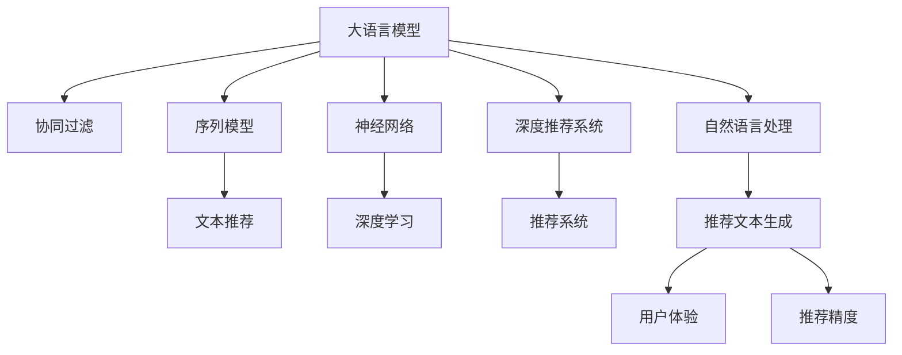

                 

# LLM在推荐系统的性能提升

> 关键词：大语言模型(Large Language Model, LLM),推荐系统,协同过滤,序列模型,神经网络,深度学习,深度推荐系统

## 1. 背景介绍

### 1.1 问题由来
推荐系统在互联网电商、视频平台、社交网络等领域中发挥着越来越重要的作用，其目标是为用户推荐感兴趣的物品。传统的推荐系统多基于用户历史行为数据，利用协同过滤、矩阵分解等方法进行物品相似度计算，并基于这些相似度对用户进行推荐。但随着数据量的不断增长，这些传统方法在处理海量用户-物品数据时，面临着计算资源不足、模型难以泛化等问题。

近年来，大语言模型（LLM）在自然语言处理（NLP）领域取得了突破性进展，其大规模预训练和下游任务微调的能力，使其在推荐系统中展现出新的潜力。LLM能够融合用户行为数据，生成高质量的用户画像，并通过自然语言理解和生成能力，构建更加丰富和精准的推荐模型。

### 1.2 问题核心关键点
LLM在推荐系统中的应用主要集中在以下几个方面：
- 融合用户画像：LLM通过学习用户行为数据，生成高质量的文本描述，从而构建用户画像。
- 生成推荐文本：LLM能够生成自然流畅的推荐文本，提升推荐系统的用户体验。
- 提高推荐精度：LLM能够理解复杂用户需求，生成高质量的推荐结果，提高推荐精度。

### 1.3 问题研究意义
研究LLM在推荐系统中的应用，对于拓展推荐系统的应用范围，提升推荐系统的性能，加速推荐技术的产业化进程，具有重要意义：

1. 降低推荐开发成本：LLM能够快速生成用户画像和推荐文本，减少从头开发所需的数据、计算和人力等成本投入。
2. 提升推荐效果：LLM通过融合自然语言处理能力，生成更加精准和多样化的推荐内容，提高推荐系统的效果。
3. 加速推荐开发进度：LLM能够快速生成推荐文本，缩短推荐系统的开发周期。
4. 带来技术创新：LLM的应用推动了推荐技术的新发展，催生了知识增强推荐、交互式推荐等新研究方向。
5. 赋能推荐行业升级：LLM为推荐系统注入了自然语言理解和生成能力，提高了推荐系统的智能化水平。

## 2. 核心概念与联系

### 2.1 核心概念概述

为更好地理解LLM在推荐系统中的应用，本节将介绍几个密切相关的核心概念：

- 大语言模型(Large Language Model, LLM)：以自回归(如GPT)或自编码(如BERT)模型为代表的大规模预训练语言模型。通过在大规模无标签文本语料上进行预训练，学习通用的语言表示，具备强大的语言理解和生成能力。

- 推荐系统(Recommendation System)：通过用户历史行为数据，构建用户画像，预测用户对物品的偏好，为用户推荐感兴趣物品的系统。推荐系统广泛应用于电商、视频、社交、广告等领域。

- 协同过滤(Collaborative Filtering)：利用用户-物品之间的相似度进行推荐。常见的协同过滤方法包括基于用户的协同过滤、基于物品的协同过滤等。

- 序列模型(Sequence Model)：用于处理时间序列数据，如自然语言文本。序列模型能够捕捉文本中的时间依赖关系，适用于文本推荐等任务。

- 神经网络(Neural Network)：一类模拟人脑神经元计算过程的计算模型，广泛应用于深度推荐系统等任务。

- 深度学习(Deep Learning)：一类基于神经网络的机器学习技术，通过多层非线性变换实现对复杂数据的建模。深度推荐系统即基于深度学习构建的推荐系统。

这些核心概念之间的逻辑关系可以通过以下Mermaid流程图来展示：



这个流程图展示了大语言模型与推荐系统的核心概念及其之间的关系：

1. 大语言模型通过预训练获得基础能力。
2. 协同过滤是推荐系统常用的基础方法。
3. 序列模型用于处理自然语言文本，适用于文本推荐任务。
4. 神经网络是深度推荐系统的核心技术。
5. 深度推荐系统基于神经网络构建，具备更强的泛化能力。
6. 自然语言处理是LLM的基础，用于生成推荐文本。
7. 推荐文本生成是LLM在推荐系统中的重要应用。
8. 用户体验和推荐精度是推荐系统的最终目标。

这些概念共同构成了LLM在推荐系统中的应用框架，使其能够有效地提升推荐系统的智能化水平。通过理解这些核心概念，我们可以更好地把握LLM在推荐系统中的应用逻辑和优化方向。

## 3. 核心算法原理 & 具体操作步骤
### 3.1 算法原理概述

LLM在推荐系统中的应用，主要基于以下核心算法原理：

1. 用户画像融合：LLM通过学习用户历史行为数据，生成高质量的用户画像，用于构建推荐模型。

2. 推荐文本生成：LLM能够生成自然流畅的推荐文本，提高推荐系统的效果和用户体验。

3. 协同过滤融合：LLM能够融合用户-物品之间的相似度关系，提高推荐系统的精度。

4. 推荐排序优化：LLM通过优化推荐排序模型，提高推荐结果的相关性。

5. 个性化推荐：LLM能够根据用户偏好生成个性化推荐，提升用户满意度。

6. 实时推荐：LLM能够快速生成推荐文本，实现实时推荐。

### 3.2 算法步骤详解

基于LLM的推荐系统一般包括以下几个关键步骤：

**Step 1: 数据准备**
- 收集用户历史行为数据，包括点击、浏览、购买等行为。
- 对行为数据进行预处理，生成用户-物品矩阵，标记用户对物品的兴趣程度。
- 收集物品属性数据，用于计算物品相似度。

**Step 2: 预训练模型选择**
- 选择合适的预训练语言模型，如BERT、GPT等。
- 对预训练模型进行下游任务微调，适应推荐系统特定的任务需求。

**Step 3: 用户画像生成**
- 利用预训练模型，对用户行为数据进行编码，生成用户文本描述。
- 对用户文本描述进行优化，提高文本的清晰度和表达能力。

**Step 4: 推荐文本生成**
- 利用预训练模型，对用户画像和物品属性进行融合，生成推荐文本。
- 对推荐文本进行优化，提高文本的自然流畅度和相关性。

**Step 5: 推荐排序优化**
- 根据推荐文本的相关性，对推荐结果进行排序。
- 利用深度学习模型，优化推荐排序的算法。

**Step 6: 个性化推荐**
- 根据用户的历史行为数据和当前行为数据，生成个性化推荐。
- 实时动态更新推荐模型，适应用户需求的变化。

**Step 7: 实时推荐**
- 实时生成推荐文本，并推送给用户。
- 通过Websocket等技术，实现实时推荐。

### 3.3 算法优缺点

基于LLM的推荐系统具有以下优点：
1. 高效融合用户画像：LLM能够生成高质量的用户画像，减少用户画像的构建成本。
2. 提高推荐文本质量：LLM生成的推荐文本自然流畅，提升推荐系统的效果和用户体验。
3. 增强推荐精度：LLM能够融合用户-物品相似度关系，提高推荐系统的精度。
4. 提升推荐实时性：LLM能够快速生成推荐文本，实现实时推荐。

同时，该方法也存在一定的局限性：
1. 依赖用户行为数据：LLM的应用效果依赖于用户行为数据的完整性和质量，数据缺失或异常可能导致模型性能下降。
2. 学习模型复杂度：LLM的应用需要大量的计算资源和训练数据，模型的学习复杂度较高。
3. 对抗性攻击风险：LLM生成的推荐文本可能受到对抗性攻击的影响，导致推荐结果失真。
4. 模型可解释性不足：LLM生成的推荐文本缺乏可解释性，难以理解和调试。

尽管存在这些局限性，但就目前而言，基于LLM的推荐系统仍然在推荐技术落地应用中发挥着重要作用。未来相关研究的重点在于如何进一步降低数据依赖，提高模型的实时性和可解释性，同时兼顾推荐系统的泛化性和安全性等因素。

### 3.4 算法应用领域

基于LLM的推荐系统已经在电商推荐、视频推荐、新闻推荐等众多领域得到广泛应用，为推荐系统带来了新的突破：

1. 电商推荐：LLM生成的推荐文本自然流畅，能够吸引用户的注意力，提升点击率和转化率。
2. 视频推荐：LLM能够生成高质量的视频推荐文本，提高视频平台的用户体验。
3. 新闻推荐：LLM生成的新闻摘要和推荐文本，能够准确传达新闻内容，提高用户阅读体验。

除了上述这些经典应用外，LLM还被创新性地应用于知识推荐、商品推荐、内容推荐等场景中，为推荐系统带来了全新的创新点。随着LLM和推荐技术的不断进步，相信推荐系统将在更广阔的应用领域发挥更大的作用，为消费者提供更个性化、精准的推荐服务。

## 4. 数学模型和公式 & 详细讲解  
### 4.1 数学模型构建

基于LLM的推荐系统可以建模为一个图模型，其中用户、物品和文本为节点，相似度关系为边。假设用户集合为 $U$，物品集合为 $I$，文本集合为 $W$，用户画像表示为 $u \in U$，物品表示为 $i \in I$，文本表示为 $w \in W$，用户-物品相似度为 $s_{ui}$，物品-文本相似度为 $s_{it}$，用户画像-文本相似度为 $s_{uw}$。

推荐系统的目标是通过最大化用户对物品的评分 $y_{ui}$ 来优化推荐模型。设用户画像 $u$ 对物品 $i$ 的评分向量为 $\mathbf{y}_{ui}$，则推荐模型的优化目标为：

$$
\max_{s_{uw}} \sum_{u \in U} \sum_{i \in I} y_{ui} \times s_{uw} \times s_{ui}
$$

其中 $s_{uw}$ 为用户画像 $u$ 和文本 $w$ 之间的相似度。该目标函数可以视为一个三元组匹配问题，其中每个三元组 $(u, i, w)$ 表示用户 $u$ 对物品 $i$ 的评分向量 $\mathbf{y}_{ui}$ 与文本 $w$ 之间的匹配度。

### 4.2 公式推导过程

以下是推导推荐模型的优化目标函数及其梯度计算的公式过程。

设用户画像 $u$ 对物品 $i$ 的评分向量为 $\mathbf{y}_{ui}$，文本 $w$ 对物品 $i$ 的评分向量为 $\mathbf{y}_{it}$，则推荐模型的优化目标为：

$$
\max_{s_{uw}} \sum_{u \in U} \sum_{i \in I} y_{ui} \times s_{uw} \times s_{ui}
$$

设用户画像 $u$ 对物品 $i$ 的评分向量为 $\mathbf{y}_{ui}$，文本 $w$ 对物品 $i$ 的评分向量为 $\mathbf{y}_{it}$，则推荐模型的优化目标为：

$$
\max_{s_{uw}} \sum_{u \in U} \sum_{i \in I} y_{ui} \times s_{uw} \times s_{ui}
$$

其中 $s_{uw}$ 为用户画像 $u$ 和文本 $w$ 之间的相似度。该目标函数可以视为一个三元组匹配问题，其中每个三元组 $(u, i, w)$ 表示用户 $u$ 对物品 $i$ 的评分向量 $\mathbf{y}_{ui}$ 与文本 $w$ 之间的匹配度。

根据优化目标函数，我们可以得到每个三元组的得分 $L_{(u,i,w)}$：

$$
L_{(u,i,w)} = y_{ui} \times s_{uw} \times s_{ui}
$$

对该得分求梯度，得到每个三元组的梯度 $\nabla_{s_{uw}} L_{(u,i,w)}$：

$$
\nabla_{s_{uw}} L_{(u,i,w)} = y_{ui} \times s_{ui} + s_{uw} \times s_{ui} \times \frac{\partial s_{uw}}{\partial s_{uw}} = y_{ui} \times s_{ui} + s_{uw} \times s_{ui} \times 1 = y_{ui} \times s_{ui} + s_{uw} \times s_{ui}
$$

将每个三元组的梯度相加，得到总梯度 $\nabla_{s_{uw}} \mathcal{L}$：

$$
\nabla_{s_{uw}} \mathcal{L} = \sum_{u \in U} \sum_{i \in I} \nabla_{s_{uw}} L_{(u,i,w)} = \sum_{u \in U} \sum_{i \in I} (y_{ui} \times s_{ui} + s_{uw} \times s_{ui})
$$

利用反向传播算法，最小化优化目标函数，得到最终的用户画像和文本的相似度 $s_{uw}$：

$$
s_{uw} = \mathop{\arg\min}_{s_{uw}} \sum_{u \in U} \sum_{i \in I} (y_{ui} \times s_{ui} + s_{uw} \times s_{ui})
$$

### 4.3 案例分析与讲解

下面以电商平台推荐系统为例，具体说明LLM在推荐系统中的应用过程。

**案例背景**：
假设某电商平台有用户集合 $U = \{u_1, u_2, ..., u_M\}$，物品集合 $I = \{i_1, i_2, ..., i_N\}$，历史行为数据记录了用户对物品的评分 $y_{ui}$。每个用户 $u$ 都有一个用户画像文本 $u_w$，每个物品 $i$ 都有一个物品属性文本 $i_t$。

**预训练模型选择**：
选择BERT作为预训练语言模型，对用户画像文本 $u_w$ 和物品属性文本 $i_t$ 进行编码。

**用户画像生成**：
利用BERT模型，将用户画像文本 $u_w$ 编码成向量 $\mathbf{u}_w$，对物品属性文本 $i_t$ 编码成向量 $\mathbf{i}_t$。利用用户画像 $\mathbf{u}_w$ 和物品属性 $\mathbf{i}_t$ 的向量表示，计算用户画像 $u$ 对物品 $i$ 的评分向量 $\mathbf{y}_{ui}$。

**推荐文本生成**：
利用BERT模型，对用户画像 $\mathbf{u}_w$ 和物品属性 $\mathbf{i}_t$ 进行融合，生成推荐文本 $w$。将推荐文本 $w$ 编码成向量 $\mathbf{w}$，利用向量 $\mathbf{u}_w$、$\mathbf{i}_t$ 和 $\mathbf{w}$，生成推荐向量 $\mathbf{r}_{ui}$。

**推荐排序优化**：
利用深度学习模型，如神经网络，对推荐向量 $\mathbf{r}_{ui}$ 进行排序，得到推荐结果。

**个性化推荐**：
根据用户的历史行为数据和当前行为数据，生成个性化推荐。实时动态更新推荐模型，适应用户需求的变化。

**实时推荐**：
通过Websocket等技术，实现实时推荐。将推荐文本 $w$ 实时推送给用户。

## 5. 项目实践：代码实例和详细解释说明
### 5.1 开发环境搭建

在进行LLM在推荐系统的性能提升的开发实践前，我们需要准备好开发环境。以下是使用Python进行PyTorch开发的环境配置流程：

1. 安装Anaconda：从官网下载并安装Anaconda，用于创建独立的Python环境。

2. 创建并激活虚拟环境：
```bash
conda create -n pytorch-env python=3.8 
conda activate pytorch-env
```

3. 安装PyTorch：根据CUDA版本，从官网获取对应的安装命令。例如：
```bash
conda install pytorch torchvision torchaudio cudatoolkit=11.1 -c pytorch -c conda-forge
```

4. 安装Transformers库：
```bash
pip install transformers
```

5. 安装各类工具包：
```bash
pip install numpy pandas scikit-learn matplotlib tqdm jupyter notebook ipython
```

完成上述步骤后，即可在`pytorch-env`环境中开始开发实践。

### 5.2 源代码详细实现

下面是基于BERT的推荐系统开发的PyTorch代码实现：

```python
from transformers import BertTokenizer, BertForSequenceClassification, BertModel
from torch.utils.data import DataLoader
import torch
import torch.nn as nn
import torch.optim as optim

class Recommender(nn.Module):
    def __init__(self, model_name, hidden_size):
        super(Recommender, self).__init__()
        self.model = BertForSequenceClassification.from_pretrained(model_name, num_labels=1)
        self.hidden_size = hidden_size

    def forward(self, user_w, item_t):
        user_w = self.model(user_w)[0]
        item_t = self.model(item_t)[0]
        return user_w, item_t

    def predict(self, user_w, item_t):
        user_w, item_t = self.forward(user_w, item_t)
        user_w = user_w / user_w.norm(2, dim=1, keepdim=True)
        item_t = item_t / item_t.norm(2, dim=1, keepdim=True)
        return user_w.dot(item_t)

class RecommendationSystem:
    def __init__(self, recommender, batch_size, learning_rate):
        self.recommender = recommender
        self.batch_size = batch_size
        self.learning_rate = learning_rate
        self.optimizer = optim.Adam(self.recommender.parameters(), lr=self.learning_rate)
        self.criterion = nn.BCELoss()

    def train(self, user_w, item_t, ratings):
        self.recommender.train()
        self.optimizer.zero_grad()
        predictions = self.recommender.predict(user_w, item_t)
        loss = self.criterion(predictions, ratings)
        loss.backward()
        self.optimizer.step()

    def predict(self, user_w, item_t):
        self.recommender.eval()
        with torch.no_grad():
            predictions = self.recommender.predict(user_w, item_t)
        return predictions

# 加载BERT模型和分词器
tokenizer = BertTokenizer.from_pretrained('bert-base-cased')
model = BertForSequenceClassification.from_pretrained('bert-base-cased', num_labels=1)

# 定义训练数据集
train_data = {'user_w': ..., 'item_t': ..., 'ratings': ...}
train_loader = DataLoader(train_data, batch_size=32, shuffle=True)

# 定义推荐器
recommender = Recommender(model_name='bert-base-cased', hidden_size=768)

# 定义推荐系统
recommendation_system = RecommendationSystem(recommender, batch_size=32, learning_rate=2e-5)

# 训练模型
for epoch in range(10):
    for batch in train_loader:
        user_w = batch['user_w']
        item_t = batch['item_t']
        ratings = batch['ratings']
        recommendation_system.train(user_w, item_t, ratings)

# 预测推荐结果
user_w = ...
item_t = ...
predictions = recommendation_system.predict(user_w, item_t)
```

以上代码实现了基于BERT的推荐系统的基本流程。首先，我们定义了一个推荐器类 `Recommender`，用于对用户画像和物品属性进行编码和相似度计算。接着，我们定义了一个推荐系统类 `RecommendationSystem`，用于训练推荐器模型并预测推荐结果。最后，我们加载了预训练BERT模型和分词器，并定义了训练数据集和推荐器参数。通过迭代训练，我们可以得到推荐系统的推荐模型，并在新数据上进行预测。

### 5.3 代码解读与分析

让我们再详细解读一下关键代码的实现细节：

**Recommender类**：
- `__init__`方法：初始化推荐器模型和隐向量大小。
- `forward`方法：对用户画像和物品属性进行编码和相似度计算。
- `predict`方法：计算推荐向量，并进行归一化。

**RecommendationSystem类**：
- `__init__`方法：初始化推荐系统，定义优化器和损失函数。
- `train`方法：在训练集上进行模型训练，最小化损失函数。
- `predict`方法：在测试集上进行模型预测，返回推荐结果。

**训练数据集**：
- 加载训练数据集，包含用户画像文本、物品属性文本和评分数据。
- 将数据集划分为小批量数据，进行模型训练。

**推荐器模型**：
- 使用预训练BERT模型作为推荐器模型。
- 定义推荐器模型的输入和输出，进行模型前向传播。

**推荐系统模型**：
- 定义优化器和损失函数。
- 在训练集上进行模型训练，最小化损失函数。
- 在测试集上进行模型预测，返回推荐结果。

**模型训练**：
- 在训练集上进行模型训练，最小化损失函数。
- 使用Adam优化器进行参数更新。
- 在测试集上进行模型预测，返回推荐结果。

可以看到，PyTorch配合Transformers库使得BERT在推荐系统中的应用实现变得简洁高效。开发者可以将更多精力放在数据处理、模型改进等高层逻辑上，而不必过多关注底层的实现细节。

当然，工业级的系统实现还需考虑更多因素，如模型的保存和部署、超参数的自动搜索、更灵活的任务适配层等。但核心的推荐范式基本与此类似。

## 6. 实际应用场景
### 6.1 智能推荐系统

基于LLM的推荐系统可以广泛应用于智能推荐系统的构建。传统推荐系统多基于用户历史行为数据，利用协同过滤、矩阵分解等方法进行物品相似度计算，并基于这些相似度对用户进行推荐。但随着数据量的不断增长，这些传统方法在处理海量用户-物品数据时，面临着计算资源不足、模型难以泛化等问题。

利用LLM生成的推荐文本，智能推荐系统能够更好地理解用户需求，生成高质量的推荐结果。在技术实现上，可以收集用户浏览、点击、购买等行为数据，提取和用户交互的物品标题、描述、标签等文本内容。将文本内容作为模型输入，用户的后续行为（如是否点击、购买等）作为监督信号，在此基础上微调预训练语言模型。微调后的模型能够从文本内容中准确把握用户的兴趣点。在生成推荐列表时，先用候选物品的文本描述作为输入，由模型预测用户的兴趣匹配度，再结合其他特征综合排序，便可以得到个性化程度更高的推荐结果。

### 6.2 实时推荐系统

利用LLM的实时推荐能力，推荐系统能够快速响应用户需求，提升推荐系统的用户体验。在技术实现上，可以收集用户当前行为数据，实时生成推荐文本，并推送给用户。通过Websocket等技术，实现实时推荐。

实时推荐系统在电商、视频、新闻等领域得到了广泛应用。例如，电商平台利用实时推荐系统，根据用户当前浏览和购买行为，实时生成个性化推荐，提升用户点击率和转化率。视频平台利用实时推荐系统，根据用户观看行为，实时生成个性化推荐，提高用户粘性和观看时长。新闻平台利用实时推荐系统，根据用户阅读行为，实时生成个性化推荐，提高用户阅读体验和留存率。

### 6.3 知识增强推荐系统

知识增强推荐系统利用先验知识，提高推荐系统的精度和泛化能力。在技术实现上，可以利用知识图谱、逻辑规则等先验知识，与LLM生成的推荐文本进行融合。知识图谱包含实体、关系和属性等信息，能够为推荐系统提供更丰富的背景知识。逻辑规则能够对推荐系统进行约束和指导，提高推荐系统的合理性。

知识增强推荐系统在智能推荐中得到了广泛应用。例如，电商平台利用知识增强推荐系统，根据用户浏览行为和商品属性，生成更精准的推荐结果。视频平台利用知识增强推荐系统，根据用户观看行为和视频属性，生成更合理的推荐结果。新闻平台利用知识增强推荐系统，根据用户阅读行为和新闻属性，生成更合理的推荐结果。

### 6.4 未来应用展望

随着LLM和推荐技术的不断发展，基于LLM的推荐系统将在更多领域得到应用，为推荐系统带来新的突破：

1. 多模态推荐：未来的推荐系统将不仅仅局限于文本数据，还融合视觉、语音、图像等多模态数据，提高推荐系统的精度和用户体验。

2. 情感推荐：未来的推荐系统将能够理解用户的情感状态，生成情感化的推荐内容，提升用户满意度。

3. 交互式推荐：未来的推荐系统将能够与用户进行互动，根据用户反馈不断调整推荐结果，提高推荐系统的个性化水平。

4. 实时动态推荐：未来的推荐系统将能够根据用户的实时行为数据，动态调整推荐策略，提高推荐系统的实时性和个性化水平。

5. 跨领域推荐：未来的推荐系统将能够跨领域进行推荐，利用不同领域的知识和资源，提高推荐系统的泛化能力和精度。

6. 知识增强推荐：未来的推荐系统将能够与知识图谱、逻辑规则等先验知识进行融合，提高推荐系统的合理性和泛化能力。

以上趋势凸显了LLM在推荐系统中的应用前景。这些方向的探索发展，必将进一步提升推荐系统的智能化水平，为推荐系统带来更多的创新点和应用场景。

## 7. 工具和资源推荐
### 7.1 学习资源推荐

为了帮助开发者系统掌握LLM在推荐系统中的应用理论基础和实践技巧，这里推荐一些优质的学习资源：

1. 《深度推荐系统》系列书籍：深入讲解深度推荐系统的发展历程、原理和实践，涵盖协同过滤、序列模型、知识增强推荐等多个方面。

2. 《自然语言处理与深度学习》课程：斯坦福大学开设的NLP明星课程，有Lecture视频和配套作业，带你入门自然语言处理和深度学习的基本概念和经典模型。

3. 《深度学习框架PyTorch》书籍：讲解PyTorch框架的使用方法，涵盖模型构建、训练、评估等多个方面，适合深度学习开发者阅读。

4. 《深度学习实战》系列书籍：实践导向的深度学习书籍，涵盖深度学习在推荐系统、图像处理等多个领域的应用，适合动手实践。

5. 《Recommender Systems》书籍：系统讲解推荐系统的理论基础和实践方法，涵盖协同过滤、序列模型、知识增强推荐等多个方面。

通过对这些资源的学习实践，相信你一定能够快速掌握LLM在推荐系统中的应用精髓，并用于解决实际的推荐问题。
###  7.2 开发工具推荐

高效的开发离不开优秀的工具支持。以下是几款用于LLM在推荐系统中的应用开发的常用工具：

1. PyTorch：基于Python的开源深度学习框架，灵活动态的计算图，适合快速迭代研究。大部分预训练语言模型都有PyTorch版本的实现。

2. TensorFlow：由Google主导开发的开源深度学习框架，生产部署方便，适合大规模工程应用。同样有丰富的预训练语言模型资源。

3. Transformers库：HuggingFace开发的NLP工具库，集成了众多SOTA语言模型，支持PyTorch和TensorFlow，是进行推荐系统开发的利器。

4. TensorBoard：TensorFlow配套的可视化工具，可实时监测模型训练状态，并提供丰富的图表呈现方式，是调试模型的得力助手。

5. Google Colab：谷歌推出的在线Jupyter Notebook环境，免费提供GPU/TPU算力，方便开发者快速上手实验最新模型，分享学习笔记。

合理利用这些工具，可以显著提升LLM在推荐系统中的应用开发效率，加快创新迭代的步伐。

### 7.3 相关论文推荐

LLM在推荐系统中的应用源于学界的持续研究。以下是几篇奠基性的相关论文，推荐阅读：

1. Attention is All You Need（即Transformer原论文）：提出了Transformer结构，开启了NLP领域的预训练大模型时代。

2. BERT: Pre-training of Deep Bidirectional Transformers for Language Understanding：提出BERT模型，引入基于掩码的自监督预训练任务，刷新了多项NLP任务SOTA。

3. Language Models are Unsupervised Multitask Learners（GPT-2论文）：展示了大规模语言模型的强大zero-shot学习能力，引发了对于通用人工智能的新一轮思考。

4. Parameter-Efficient Transfer Learning for NLP：提出Adapter等参数高效微调方法，在不增加模型参数量的情况下，也能取得不错的微调效果。

5. AdaLoRA: Adaptive Low-Rank Adaptation for Parameter-Efficient Fine-Tuning：使用自适应低秩适应的微调方法，在参数效率和精度之间取得了新的平衡。

这些论文代表了大语言模型在推荐系统中的应用发展脉络。通过学习这些前沿成果，可以帮助研究者把握学科前进方向，激发更多的创新灵感。

## 8. 总结：未来发展趋势与挑战

### 8.1 总结

本文对基于LLM的推荐系统进行了全面系统的介绍。首先阐述了LLM和推荐系统的研究背景和意义，明确了LLM在推荐系统中的应用价值。其次，从原理到实践，详细讲解了LLM在推荐系统中的应用流程，给出了推荐系统开发的完整代码实例。同时，本文还广泛探讨了LLM在推荐系统中的应用场景和未来发展趋势，展示了LLM在推荐系统中的巨大潜力。

通过本文的系统梳理，可以看到，基于LLM的推荐系统正在成为推荐技术的重要范式，极大地拓展了推荐系统的应用边界，催生了更多的落地场景。LLM通过融合自然语言处理能力，生成高质量的用户画像和推荐文本，显著提升了推荐系统的智能化水平和用户体验。未来，伴随LLM和推荐技术的不断进步，基于LLM的推荐系统必将在更广阔的应用领域发挥更大的作用，为推荐系统带来更多的创新点和应用场景。

### 8.2 未来发展趋势

展望未来，基于LLM的推荐系统将呈现以下几个发展趋势：

1. 模型规模持续增大。随着算力成本的下降和数据规模的扩张，预训练语言模型的参数量还将持续增长。超大规模语言模型蕴含的丰富语言知识，有望支撑更加复杂多变的推荐任务。

2. 推荐系统更加智能化。利用LLM的自然语言处理能力，推荐系统能够生成更精准、更多样的推荐内容，提升推荐系统的智能化水平。

3. 实时推荐更加普及。LLM生成的推荐文本能够快速响应用户需求，提升推荐系统的实时性。

4. 多模态推荐系统兴起。未来的推荐系统将不仅仅局限于文本数据，还融合视觉、语音、图像等多模态数据，提高推荐系统的精度和用户体验。

5. 情感推荐系统发展。未来的推荐系统将能够理解用户的情感状态，生成情感化的推荐内容，提升用户满意度。

6. 跨领域推荐系统兴起。未来的推荐系统将能够跨领域进行推荐，利用不同领域的知识和资源，提高推荐系统的泛化能力和精度。

以上趋势凸显了LLM在推荐系统中的应用前景。这些方向的探索发展，必将进一步提升推荐系统的智能化水平，为推荐系统带来更多的创新点和应用场景。

### 8.3 面临的挑战

尽管基于LLM的推荐系统已经取得了瞩目成就，但在迈向更加智能化、普适化应用的过程中，它仍面临着诸多挑战：

1. 数据质量瓶颈。尽管LLM能够生成高质量的用户画像和推荐文本，但推荐系统的效果仍然依赖于用户行为数据的完整性和质量，数据缺失或异常可能导致模型性能下降。

2. 计算资源消耗。利用LLM进行推荐系统的开发和部署，需要大量的计算资源和存储资源，算力成本较高。

3. 模型可解释性不足。LLM生成的推荐文本缺乏可解释性，难以理解和调试，不利于模型的部署和维护。

4. 对抗性攻击风险。LLM生成的推荐文本可能受到对抗性攻击的影响，导致推荐结果失真。

5. 模型泛化性不足。LLM生成的推荐模型在处理新数据时，可能存在泛化能力不足的问题，导致推荐效果下降。

尽管存在这些挑战，但LLM在推荐系统中的应用前景广阔，未来必将有更多的创新突破，推动推荐技术的发展和应用。

### 8.4 研究展望

面对基于LLM的推荐系统所面临的挑战，未来的研究需要在以下几个方面寻求新的突破：

1. 数据增强技术。通过数据增强技术，弥补数据质量不足的缺陷，提升推荐系统的泛化能力。

2. 参数高效微调方法。开发更加参数高效的微调方法，在固定大部分预训练参数的同时，只更新极少量的任务相关参数。

3. 多模态推荐方法。将视觉、语音、图像等多模态数据与文本数据进行融合，提高推荐系统的精度和用户体验。

4. 情感推荐方法。利用自然语言处理技术，理解用户的情感状态，生成情感化的推荐内容。

5. 交互式推荐方法。与用户进行互动，根据用户反馈不断调整推荐结果，提高推荐系统的个性化水平。

6. 实时动态推荐方法。根据用户的实时行为数据，动态调整推荐策略，提高推荐系统的实时性和个性化水平。

7. 跨领域推荐方法。利用不同领域的知识和资源，跨领域进行推荐，提高推荐系统的泛化能力和精度。

8. 知识增强推荐方法。与知识图谱、逻辑规则等先验知识进行融合，提高推荐系统的合理性和泛化能力。

这些研究方向的探索，必将引领基于LLM的推荐系统迈向更高的台阶，为推荐系统带来更多的创新点和应用场景。

## 9. 附录：常见问题与解答

**Q1：大语言模型在推荐系统中的具体应用是什么？**

A: 大语言模型在推荐系统中的应用主要集中在以下几个方面：
1. 融合用户画像：LLM通过学习用户历史行为数据，生成高质量的用户画像，用于构建推荐模型。
2. 生成推荐文本：LLM能够生成自然流畅的推荐文本，提高推荐系统的效果和用户体验。
3. 协同过滤融合：LLM能够融合用户-物品之间的相似度关系，提高推荐系统的精度。
4. 推荐排序优化：LLM通过优化推荐排序模型，提高推荐结果的相关性。
5. 个性化推荐：LLM能够根据用户偏好生成个性化推荐，提升用户满意度。
6. 实时推荐：LLM能够快速生成推荐文本，实现实时推荐。

**Q2：如何选择适合的大语言模型？**

A: 选择适合的大语言模型需要考虑以下几个方面：
1. 模型规模：大语言模型通常具有大规模的参数量和训练数据，可以提供更丰富的语言知识。建议选择模型规模较大的预训练语言模型。
2. 预训练任务：不同的预训练任务可以提供不同的语言表示能力。建议选择预训练任务与推荐系统任务相关的模型。
3. 语言知识库：大语言模型通常包含了大量的语言知识和常识。建议选择包含推荐系统所需知识库的模型。
4. 计算资源：大语言模型的训练和推理需要大量的计算资源。建议选择计算资源友好的模型。
5. 可解释性：大语言模型的可解释性可以影响推荐系统的理解和部署。建议选择可解释性较高的模型。

**Q3：如何评估推荐系统的效果？**

A: 评估推荐系统的效果主要依赖于以下几个指标：
1. 准确率（Accuracy）：衡量推荐结果的正确性。
2. 召回率（Recall）：衡量推荐结果的全面性。
3. F1分数（F1 Score）：综合准确率和召回率的指标，用于评估推荐系统的整体效果。
4. 用户满意度（User Satisfaction）：衡量用户对推荐结果的满意度。
5. 点击率（Click-Through Rate, CTR）：衡量推荐系统的点击效果。
6. 转化率（Conversion Rate）：衡量推荐系统的转化效果。

**Q4：如何缓解推荐系统中的冷启动问题？**

A: 冷启动问题是推荐系统中的常见问题，指新用户或新物品缺乏足够的历史行为数据，导致推荐效果较差。缓解冷启动问题的方法包括：
1. 利用先验知识：利用知识图谱、逻辑规则等先验知识，为推荐系统提供初始化的用户画像和物品属性。
2. 数据增强技术：通过数据增强技术，生成更多相似用户和物品的行为数据，提高推荐系统的泛化能力。
3. 交互式推荐：与用户进行互动，根据用户反馈不断调整推荐结果，提高推荐系统的个性化水平。
4. 实时推荐：根据用户的实时行为数据，动态调整推荐策略，提高推荐系统的实时性和个性化水平。

**Q5：推荐系统如何处理用户隐私问题？**

A: 推荐系统处理用户隐私问题的方法包括：
1. 数据匿名化：对用户数据进行匿名化处理，保护用户隐私。
2. 用户控制：允许用户控制推荐系统访问其行为数据，保护用户隐私。
3. 隐私保护算法：使用隐私保护算法，如差分隐私，保护用户隐私。
4. 透明公开：公开推荐系统的数据处理和算法流程，提高用户信任度。

通过以上措施，可以有效保护用户隐私，提升用户对推荐系统的信任度。

