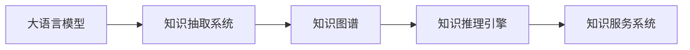

                 

# LLM在智能知识管理中的应用

## 1. 背景介绍

在现代社会，知识的累积和传播效率直接影响着企业的竞争力和创新能力。传统的知识管理方式往往依赖于人工整理和存储，耗时耗力且难以快速响应需求。近年来，随着人工智能技术的迅猛发展，特别是基于大语言模型(LLM)的知识管理方法，为这一问题提供了新的解决方案。

### 1.1 问题由来

随着信息时代的到来，各类文档、报告、书籍等文本数据的爆炸式增长，单纯靠人工处理已难以应对。一方面，企业内部的知识需要及时整理和更新，以便更好地支持业务决策和创新；另一方面，外部海量数据中也蕴含着大量有价值的知识，需要进行收集和整合，以辅助决策分析。传统的知识管理方法，如人工分拣、关键词检索等，存在效率低、覆盖面窄、检索结果不精确等问题，难以满足企业快速响应市场变化的需求。

### 1.2 问题核心关键点

实现基于LLM的知识管理，需要解决以下几个核心问题：
- 如何快速准确地从大量文本数据中提取有价值的知识片段？
- 如何高效地组织和存储提取出的知识，支持快速检索和重用？
- 如何通过自然语言理解技术，实现知识库的智能更新和扩充？
- 如何构建知识图谱，将碎片化的知识关联起来，形成体系化的知识体系？

## 2. 核心概念与联系

### 2.1 核心概念概述

在基于LLM的知识管理系统中，涉及多个关键概念，它们之间通过特定的逻辑流程相互作用。以下是几个核心概念及其联系的概述：

- **大语言模型(LLM)**：如GPT-3、BERT等预训练模型，通过大规模无标签文本数据的自监督训练，掌握了丰富的语言知识和常识。
- **知识抽取与抽取系统**：从大规模文本数据中提取结构化知识，包括实体、关系、事件等。
- **知识图谱**：将抽取出的知识片段进行关联和组织，形成节点和边的结构，便于检索和推理。
- **知识推理引擎**：利用图谱结构和推理规则，自动推导出新的知识。
- **知识服务系统**：将知识图谱和抽取系统集成，提供知识查询、推荐、自动补全等功能，满足用户知识需求。

这些概念之间的联系主要体现在：

1. 知识抽取系统从大规模文本中抽取结构化知识，是知识图谱构建的基础。
2. 知识图谱将抽取出的知识进行组织和关联，为知识推理提供结构化的依据。
3. 知识推理引擎利用图谱结构进行推理，不断扩充和更新知识图谱。
4. 知识服务系统通过与知识抽取和图谱的结合，提供知识检索、推荐等实际应用。

### 2.2 核心概念原理和架构的 Mermaid 流程图



## 3. 核心算法原理 & 具体操作步骤

### 3.1 算法原理概述

基于LLM的知识管理，核心在于利用大模型的语言理解和生成能力，实现知识抽取、图谱构建和推理。其基本原理如下：

1. **知识抽取**：利用LLM的文本理解能力，从大规模文本数据中抽取命名实体、关系、事件等结构化知识。
2. **知识图谱构建**：将抽取出的知识片段进行关联和组织，构建知识图谱。
3. **知识推理**：在图谱结构上，利用LLM的生成能力，自动推导出新的知识。
4. **知识服务**：集成抽取、图谱、推理功能，提供知识检索、推荐等应用。

### 3.2 算法步骤详解

#### 步骤一：知识抽取

知识抽取系统利用LLM对文本进行理解，识别出其中的实体、关系、事件等结构化信息。具体步骤如下：

1. 对输入的文本进行分词和词性标注。
2. 使用预训练的命名实体识别模型，对文本进行实体识别。
3. 根据实体间的上下文关系，推断实体间的关系。
4. 利用时间信息或其他线索，抽取时间事件等动态信息。

#### 步骤二：知识图谱构建

知识图谱通过节点和边，将抽取出的知识片段进行组织和关联。构建步骤如下：

1. 定义实体类型和关系类型。
2. 将抽取的实体按照类型进行分类，建立实体节点。
3. 根据实体之间的关系，建立边连接，形成知识图谱。
4. 对图谱进行周期性更新和维护，确保其及时性和准确性。

#### 步骤三：知识推理

知识推理引擎利用图谱结构和LLM的生成能力，自动推导出新的知识。具体步骤如下：

1. 将抽取的实体和关系信息加载到图谱中。
2. 定义推理规则和逻辑，如因果关系、时序关系等。
3. 根据已有的知识和推理规则，使用LLM生成新的知识节点和边。
4. 将推理结果更新到图谱中，形成动态的知识图谱。

#### 步骤四：知识服务

知识服务系统将抽取、图谱和推理功能集成，提供用户所需的知识查询、推荐等服务。具体步骤如下：

1. 集成抽取系统，将新的知识片段添加到图谱中。
2. 提供知识查询API，支持用户通过自然语言进行知识检索。
3. 利用图谱结构和推理结果，进行知识推荐和自动补全。
4. 对查询结果进行展示，并提供相关的上下文信息。

### 3.3 算法优缺点

#### 优点

1. **高效抽取**：利用LLM的自然语言理解能力，能够快速从大规模文本中抽取结构化知识，减少人工工作量。
2. **丰富图谱**：通过知识抽取和推理，构建动态的知识图谱，知识量丰富且更新迅速。
3. **灵活应用**：知识服务系统提供灵活的API接口，支持多种知识应用场景。
4. **智能推理**：利用LLM的生成能力，进行知识推理，提升知识图谱的准确性和完备性。

#### 缺点

1. **数据依赖**：需要大量的高质量文本数据进行预训练和知识抽取，数据获取和处理成本较高。
2. **资源消耗**：大模型的计算资源消耗较大，需要高性能的硬件支持。
3. **推理复杂度**：知识推理的逻辑和规则复杂，需要不断优化和维护。
4. **模型偏见**：预训练模型可能存在偏见和有害信息，需要额外处理和校验。

## 4. 数学模型和公式 & 详细讲解 & 举例说明

### 4.1 数学模型构建

在本节中，我们将构建一个简单的知识抽取数学模型。假设文本为 $X$，抽取出的实体为 $E$，实体之间的关系为 $R$。模型目标是从文本 $X$ 中识别出实体 $E$，并将其与已知关系 $R$ 进行匹配。

模型定义如下：

$$
\min_{\theta} \mathcal{L}(E(X), R)
$$

其中，$\theta$ 为模型参数，$\mathcal{L}$ 为损失函数，$E(X)$ 为从文本 $X$ 中抽取出的实体。

### 4.2 公式推导过程

为了更好地理解上述模型，我们需要对其进行推导。以实体抽取为例，设 $X_i$ 表示第 $i$ 个单词，$E_i$ 表示 $X_i$ 是否为实体。则实体抽取的目标可以表示为：

$$
\min_{\theta} \sum_{i=1}^N \log (\sigma(E_i(X_i))),
$$

其中 $\sigma$ 为sigmoid函数，$E_i(X_i)$ 为第 $i$ 个单词是否为实体的预测结果。

利用softmax函数，可以将上述目标转化为：

$$
\min_{\theta} -\sum_{i=1}^N \log(\frac{\exp(E_i(X_i))}{\sum_{j=1}^N \exp(E_j(X_j))})
$$

### 4.3 案例分析与讲解

假设我们有一篇新闻报道，内容如下：

```
美国总统唐纳德·特朗普发表讲话，宣布对中国的贸易战正式开战。
```

我们希望从这段文本中抽取“美国总统”、“中国”等实体，以及它们之间的关系。具体步骤如下：

1. 对文本进行分词和词性标注。
2. 使用预训练的命名实体识别模型，对文本进行实体识别。
3. 根据上下文信息，推断实体之间的关系。
4. 将抽取出的实体和关系存储到知识图谱中。

例如，对于上述新闻报道，抽取结果可能如下：

- 实体：唐纳德·特朗普、美国总统、中国
- 关系：唐纳德·特朗普是中国的总统

## 5. 项目实践：代码实例和详细解释说明

### 5.1 开发环境搭建

在进行项目实践前，我们需要准备好开发环境。以下是使用Python进行PyTorch开发的环境配置流程：

1. 安装Anaconda：从官网下载并安装Anaconda，用于创建独立的Python环境。

2. 创建并激活虚拟环境：
```bash
conda create -n pytorch-env python=3.8 
conda activate pytorch-env
```

3. 安装PyTorch：根据CUDA版本，从官网获取对应的安装命令。例如：
```bash
conda install pytorch torchvision torchaudio cudatoolkit=11.1 -c pytorch -c conda-forge
```

4. 安装Transformers库：
```bash
pip install transformers
```

5. 安装各类工具包：
```bash
pip install numpy pandas scikit-learn matplotlib tqdm jupyter notebook ipython
```

完成上述步骤后，即可在`pytorch-env`环境中开始项目实践。

### 5.2 源代码详细实现

下面我们以命名实体识别(NER)任务为例，给出使用Transformers库对BERT模型进行知识抽取的PyTorch代码实现。

首先，定义NER任务的数据处理函数：

```python
from transformers import BertTokenizer
from torch.utils.data import Dataset
import torch

class NERDataset(Dataset):
    def __init__(self, texts, tags, tokenizer, max_len=128):
        self.texts = texts
        self.tags = tags
        self.tokenizer = tokenizer
        self.max_len = max_len
        
    def __len__(self):
        return len(self.texts)
    
    def __getitem__(self, item):
        text = self.texts[item]
        tags = self.tags[item]
        
        encoding = self.tokenizer(text, return_tensors='pt', max_length=self.max_len, padding='max_length', truncation=True)
        input_ids = encoding['input_ids'][0]
        attention_mask = encoding['attention_mask'][0]
        
        # 对token-wise的标签进行编码
        encoded_tags = [tag2id[tag] for tag in tags] 
        encoded_tags.extend([tag2id['O']] * (self.max_len - len(encoded_tags)))
        labels = torch.tensor(encoded_tags, dtype=torch.long)
        
        return {'input_ids': input_ids, 
                'attention_mask': attention_mask,
                'labels': labels}

# 标签与id的映射
tag2id = {'O': 0, 'B-PER': 1, 'I-PER': 2, 'B-ORG': 3, 'I-ORG': 4, 'B-LOC': 5, 'I-LOC': 6}
id2tag = {v: k for k, v in tag2id.items()}

# 创建dataset
tokenizer = BertTokenizer.from_pretrained('bert-base-cased')

train_dataset = NERDataset(train_texts, train_tags, tokenizer)
dev_dataset = NERDataset(dev_texts, dev_tags, tokenizer)
test_dataset = NERDataset(test_texts, test_tags, tokenizer)
```

然后，定义模型和优化器：

```python
from transformers import BertForTokenClassification, AdamW

model = BertForTokenClassification.from_pretrained('bert-base-cased', num_labels=len(tag2id))

optimizer = AdamW(model.parameters(), lr=2e-5)
```

接着，定义训练和评估函数：

```python
from torch.utils.data import DataLoader
from tqdm import tqdm
from sklearn.metrics import classification_report

device = torch.device('cuda') if torch.cuda.is_available() else torch.device('cpu')
model.to(device)

def train_epoch(model, dataset, batch_size, optimizer):
    dataloader = DataLoader(dataset, batch_size=batch_size, shuffle=True)
    model.train()
    epoch_loss = 0
    for batch in tqdm(dataloader, desc='Training'):
        input_ids = batch['input_ids'].to(device)
        attention_mask = batch['attention_mask'].to(device)
        labels = batch['labels'].to(device)
        model.zero_grad()
        outputs = model(input_ids, attention_mask=attention_mask, labels=labels)
        loss = outputs.loss
        epoch_loss += loss.item()
        loss.backward()
        optimizer.step()
    return epoch_loss / len(dataloader)

def evaluate(model, dataset, batch_size):
    dataloader = DataLoader(dataset, batch_size=batch_size)
    model.eval()
    preds, labels = [], []
    with torch.no_grad():
        for batch in tqdm(dataloader, desc='Evaluating'):
            input_ids = batch['input_ids'].to(device)
            attention_mask = batch['attention_mask'].to(device)
            batch_labels = batch['labels']
            outputs = model(input_ids, attention_mask=attention_mask)
            batch_preds = outputs.logits.argmax(dim=2).to('cpu').tolist()
            batch_labels = batch_labels.to('cpu').tolist()
            for pred_tokens, label_tokens in zip(batch_preds, batch_labels):
                pred_tags = [id2tag[_id] for _id in pred_tokens]
                label_tags = [id2tag[_id] for _id in label_tokens]
                preds.append(pred_tags[:len(label_tags)])
                labels.append(label_tags)
                
    print(classification_report(labels, preds))
```

最后，启动训练流程并在测试集上评估：

```python
epochs = 5
batch_size = 16

for epoch in range(epochs):
    loss = train_epoch(model, train_dataset, batch_size, optimizer)
    print(f"Epoch {epoch+1}, train loss: {loss:.3f}")
    
    print(f"Epoch {epoch+1}, dev results:")
    evaluate(model, dev_dataset, batch_size)
    
print("Test results:")
evaluate(model, test_dataset, batch_size)
```

以上就是使用PyTorch对BERT进行命名实体识别任务的知识抽取代码实现。可以看到，利用Transformers库的强大封装，我们可以用相对简洁的代码完成BERT模型的加载和知识抽取。

### 5.3 代码解读与分析

让我们再详细解读一下关键代码的实现细节：

**NERDataset类**：
- `__init__`方法：初始化文本、标签、分词器等关键组件。
- `__len__`方法：返回数据集的样本数量。
- `__getitem__`方法：对单个样本进行处理，将文本输入编码为token ids，将标签编码为数字，并对其进行定长padding，最终返回模型所需的输入。

**tag2id和id2tag字典**：
- 定义了标签与数字id之间的映射关系，用于将token-wise的预测结果解码回真实的标签。

**训练和评估函数**：
- 使用PyTorch的DataLoader对数据集进行批次化加载，供模型训练和推理使用。
- 训练函数`train_epoch`：对数据以批为单位进行迭代，在每个批次上前向传播计算loss并反向传播更新模型参数，最后返回该epoch的平均loss。
- 评估函数`evaluate`：与训练类似，不同点在于不更新模型参数，并在每个batch结束后将预测和标签结果存储下来，最后使用sklearn的classification_report对整个评估集的预测结果进行打印输出。

**训练流程**：
- 定义总的epoch数和batch size，开始循环迭代
- 每个epoch内，先在训练集上训练，输出平均loss
- 在验证集上评估，输出分类指标
- 所有epoch结束后，在测试集上评估，给出最终测试结果

可以看到，PyTorch配合Transformers库使得BERT知识抽取的代码实现变得简洁高效。开发者可以将更多精力放在数据处理、模型改进等高层逻辑上，而不必过多关注底层的实现细节。

当然，工业级的系统实现还需考虑更多因素，如模型的保存和部署、超参数的自动搜索、更灵活的任务适配层等。但核心的知识抽取过程基本与此类似。

## 6. 实际应用场景

### 6.1 智能客服系统

基于大语言模型的知识抽取系统，可以广泛应用于智能客服系统的构建。传统客服往往需要配备大量人力，高峰期响应缓慢，且一致性和专业性难以保证。而使用知识抽取系统，可以自动从客户咨询中提取实体和关系，进行分类和推理，生成最佳回复。

在技术实现上，可以收集企业内部的历史客服对话记录，将问题和最佳答复构建成监督数据，在此基础上对BERT等预训练模型进行微调。微调后的模型能够自动理解客户意图，匹配最合适的答案模板进行回复。对于客户提出的新问题，还可以接入检索系统实时搜索相关内容，动态组织生成回答。如此构建的智能客服系统，能大幅提升客户咨询体验和问题解决效率。

### 6.2 金融舆情监测

金融机构需要实时监测市场舆论动向，以便及时应对负面信息传播，规避金融风险。传统的人工监测方式成本高、效率低，难以应对网络时代海量信息爆发的挑战。基于大语言模型的知识抽取系统，可以自动从新闻、报道、评论等文本中抽取实体和关系，构建知识图谱，进行情感分析，判断市场舆情。

具体而言，可以收集金融领域相关的新闻、报道、评论等文本数据，并对其进行主题标注和情感标注。在此基础上对BERT等预训练语言模型进行微调，使其能够自动判断文本属于何种主题，情感倾向是正面、中性还是负面。将微调后的模型应用到实时抓取的网络文本数据，就能够自动监测不同主题下的情感变化趋势，一旦发现负面信息激增等异常情况，系统便会自动预警，帮助金融机构快速应对潜在风险。

### 6.3 个性化推荐系统

当前的推荐系统往往只依赖用户的历史行为数据进行物品推荐，无法深入理解用户的真实兴趣偏好。基于大语言模型的知识抽取系统，可以更好地挖掘用户行为背后的语义信息，从而提供更精准、多样的推荐内容。

在实践中，可以收集用户浏览、点击、评论、分享等行为数据，提取和用户交互的物品标题、描述、标签等文本内容。将文本内容作为模型输入，用户的后续行为（如是否点击、购买等）作为监督信号，在此基础上对BERT等预训练模型进行微调。微调后的模型能够从文本内容中准确把握用户的兴趣点。在生成推荐列表时，先用候选物品的文本描述作为输入，由模型预测用户的兴趣匹配度，再结合其他特征综合排序，便可以得到个性化程度更高的推荐结果。

### 6.4 未来应用展望

随着大语言模型和知识抽取技术的发展，基于知识抽取系统的方法将在更多领域得到应用，为传统行业带来变革性影响。

在智慧医疗领域，基于知识抽取的医疗问答、病历分析、药物研发等应用将提升医疗服务的智能化水平，辅助医生诊疗，加速新药开发进程。

在智能教育领域，知识抽取系统可应用于作业批改、学情分析、知识推荐等方面，因材施教，促进教育公平，提高教学质量。

在智慧城市治理中，知识抽取系统可应用于城市事件监测、舆情分析、应急指挥等环节，提高城市管理的自动化和智能化水平，构建更安全、高效的未来城市。

此外，在企业生产、社会治理、文娱传媒等众多领域，基于大语言模型的知识抽取系统也将不断涌现，为NLP技术带来了全新的突破。相信随着预训练模型和知识抽取方法的不断进步，基于知识抽取系统的NLP技术将在更广阔的应用领域大放异彩。

## 7. 工具和资源推荐

### 7.1 学习资源推荐

为了帮助开发者系统掌握大语言模型知识抽取的理论基础和实践技巧，这里推荐一些优质的学习资源：

1. 《Transformer从原理到实践》系列博文：由大模型技术专家撰写，深入浅出地介绍了Transformer原理、BERT模型、知识抽取技术等前沿话题。

2. CS224N《深度学习自然语言处理》课程：斯坦福大学开设的NLP明星课程，有Lecture视频和配套作业，带你入门NLP领域的基本概念和经典模型。

3. 《Natural Language Processing with Transformers》书籍：Transformers库的作者所著，全面介绍了如何使用Transformers库进行NLP任务开发，包括知识抽取在内的诸多范式。

4. HuggingFace官方文档：Transformers库的官方文档，提供了海量预训练模型和完整的知识抽取样例代码，是上手实践的必备资料。

5. CLUE开源项目：中文语言理解测评基准，涵盖大量不同类型的中文NLP数据集，并提供了基于知识抽取的baseline模型，助力中文NLP技术发展。

通过对这些资源的学习实践，相信你一定能够快速掌握大语言模型知识抽取的精髓，并用于解决实际的NLP问题。
###  7.2 开发工具推荐

高效的开发离不开优秀的工具支持。以下是几款用于大语言模型知识抽取开发的常用工具：

1. PyTorch：基于Python的开源深度学习框架，灵活动态的计算图，适合快速迭代研究。大部分预训练语言模型都有PyTorch版本的实现。

2. TensorFlow：由Google主导开发的开源深度学习框架，生产部署方便，适合大规模工程应用。同样有丰富的预训练语言模型资源。

3. Transformers库：HuggingFace开发的NLP工具库，集成了众多SOTA语言模型，支持PyTorch和TensorFlow，是进行知识抽取任务开发的利器。

4. Weights & Biases：模型训练的实验跟踪工具，可以记录和可视化模型训练过程中的各项指标，方便对比和调优。与主流深度学习框架无缝集成。

5. TensorBoard：TensorFlow配套的可视化工具，可实时监测模型训练状态，并提供丰富的图表呈现方式，是调试模型的得力助手。

6. Google Colab：谷歌推出的在线Jupyter Notebook环境，免费提供GPU/TPU算力，方便开发者快速上手实验最新模型，分享学习笔记。

合理利用这些工具，可以显著提升大语言模型知识抽取任务的开发效率，加快创新迭代的步伐。

### 7.3 相关论文推荐

大语言模型和知识抽取技术的发展源于学界的持续研究。以下是几篇奠基性的相关论文，推荐阅读：

1. Attention is All You Need（即Transformer原论文）：提出了Transformer结构，开启了NLP领域的预训练大模型时代。

2. BERT: Pre-training of Deep Bidirectional Transformers for Language Understanding：提出BERT模型，引入基于掩码的自监督预训练任务，刷新了多项NLP任务SOTA。

3. Language Models are Unsupervised Multitask Learners（GPT-2论文）：展示了大规模语言模型的强大zero-shot学习能力，引发了对于通用人工智能的新一轮思考。

4. Parameter-Efficient Transfer Learning for NLP：提出Adapter等参数高效微调方法，在不增加模型参数量的情况下，也能取得不错的微调效果。

5. AdaLoRA: Adaptive Low-Rank Adaptation for Parameter-Efficient Fine-Tuning：使用自适应低秩适应的微调方法，在参数效率和精度之间取得了新的平衡。

6. Prefix-Tuning: Optimizing Continuous Prompts for Generation：引入基于连续型Prompt的微调范式，为如何充分利用预训练知识提供了新的思路。

这些论文代表了大语言模型知识抽取技术的发展脉络。通过学习这些前沿成果，可以帮助研究者把握学科前进方向，激发更多的创新灵感。

## 8. 总结：未来发展趋势与挑战

### 8.1 总结

本文对基于大语言模型的知识抽取技术进行了全面系统的介绍。首先阐述了知识抽取技术的研究背景和意义，明确了知识抽取在智能知识管理中的重要性。其次，从原理到实践，详细讲解了知识抽取的数学模型和关键步骤，给出了知识抽取任务开发的完整代码实例。同时，本文还广泛探讨了知识抽取方法在智能客服、金融舆情、个性化推荐等多个行业领域的应用前景，展示了知识抽取技术的巨大潜力。此外，本文精选了知识抽取技术的各类学习资源，力求为读者提供全方位的技术指引。

通过本文的系统梳理，可以看到，基于大语言模型的知识抽取技术正在成为NLP领域的重要范式，极大地拓展了预训练语言模型的应用边界，催生了更多的落地场景。受益于大规模语料的预训练，知识抽取模型能够从海量文本数据中高效抽取结构化知识，极大地降低了人工工作量。未来，伴随知识抽取方法的不断演进，基于知识抽取系统的方法必将在更多领域得到应用，为传统行业带来变革性影响。

### 8.2 未来发展趋势

展望未来，基于大语言模型的知识抽取技术将呈现以下几个发展趋势：

1. **高效抽取**：通过不断优化模型结构和训练方法，提高知识抽取的效率和准确性。
2. **多领域适配**：针对不同领域的特定需求，设计更加高效的领域适配模型。
3. **语义理解**：引入更多语义理解技术，如因果推断、上下文建模等，提升抽取结果的语义准确性。
4. **融合多模态信息**：结合文本、图像、语音等多种数据模态，提升知识抽取的全面性和丰富性。
5. **实时抽取**：利用边缘计算和分布式计算技术，实现实时抽取，提升系统的响应速度。
6. **跨语言抽取**：开发多语言抽取系统，支持跨语言的文本处理和知识抽取。

### 8.3 面临的挑战

尽管基于大语言模型的知识抽取技术已经取得了瞩目成就，但在迈向更加智能化、普适化应用的过程中，它仍面临着诸多挑战：

1. **数据依赖**：需要大量的高质量文本数据进行预训练和抽取，数据获取和处理成本较高。
2. **模型鲁棒性不足**：面对域外数据时，抽取模型的泛化性能往往大打折扣。对于测试样本的微小扰动，抽取模型的预测也容易发生波动。
3. **推理复杂度**：知识抽取的逻辑和规则复杂，需要不断优化和维护。
4. **模型偏见**：预训练模型可能存在偏见和有害信息，需要额外处理和校验。
5. **知识动态更新**：随着时间和环境的变化，知识抽取系统需要不断更新，保持知识的及时性和准确性。

### 8.4 研究展望

面对知识抽取面临的挑战，未来的研究需要在以下几个方面寻求新的突破：

1. **无监督和半监督抽取**：摆脱对大规模标注数据的依赖，利用自监督学习、主动学习等无监督和半监督范式，最大限度利用非结构化数据，实现更加灵活高效的抽取。
2. **参数高效抽取**：开发更加参数高效的抽取方法，在固定大部分预训练参数的情况下，只更新极少量的任务相关参数。
3. **因果和对比学习**：引入因果推断和对比学习思想，增强抽取模型建立稳定因果关系的能力，学习更加普适、鲁棒的语言表征。
4. **多模态融合**：结合文本、图像、语音等多种数据模态，提升知识抽取的全面性和丰富性。
5. **知识图谱增强**：将抽取的知识片段进行更深层次的关联和组织，构建更丰富的知识图谱，支持更复杂的推理任务。
6. **跨语言抽取**：开发多语言抽取系统，支持跨语言的文本处理和知识抽取。

这些研究方向的探索，必将引领知识抽取技术迈向更高的台阶，为构建智能知识管理系统铺平道路。面向未来，知识抽取技术还需要与其他人工智能技术进行更深入的融合，如知识表示、因果推理、强化学习等，多路径协同发力，共同推动智能知识管理系统的进步。只有勇于创新、敢于突破，才能不断拓展语言模型的边界，让智能技术更好地造福人类社会。

## 9. 附录：常见问题与解答

**Q1：知识抽取系统是否适用于所有NLP任务？**

A: 知识抽取系统在大多数NLP任务上都能取得不错的效果，特别是对于数据量较小的任务。但对于一些特定领域的任务，如医学、法律等，仅仅依靠通用语料预训练的模型可能难以很好地适应。此时需要在特定领域语料上进一步预训练，再进行抽取，才能获得理想效果。此外，对于一些需要时效性、个性化很强的任务，如对话、推荐等，知识抽取方法也需要针对性的改进优化。

**Q2：如何选择合适的学习率？**

A: 知识抽取的学习率一般要比预训练时小1-2个数量级，如果使用过大的学习率，容易破坏预训练权重，导致过拟合。一般建议从1e-5开始调参，逐步减小学习率，直至收敛。也可以使用warmup策略，在开始阶段使用较小的学习率，再逐渐过渡到预设值。需要注意的是，不同的优化器(如AdamW、Adafactor等)以及不同的学习率调度策略，可能需要设置不同的学习率阈值。

**Q3：知识抽取系统在落地部署时需要注意哪些问题？**

A: 将知识抽取系统转化为实际应用，还需要考虑以下因素：
1. 模型裁剪：去除不必要的层和参数，减小模型尺寸，加快推理速度。
2. 量化加速：将浮点模型转为定点模型，压缩存储空间，提高计算效率。
3. 服务化封装：将模型封装为标准化服务接口，便于集成调用。
4. 弹性伸缩：根据请求流量动态调整资源配置，平衡服务质量和成本。
5. 监控告警：实时采集系统指标，设置异常告警阈值，确保服务稳定性。
6. 安全防护：采用访问鉴权、数据脱敏等措施，保障数据和模型安全。

知识抽取系统能够高效地从大规模文本数据中抽取结构化知识，但如何将抽取结果转换为实用的知识库，构建智能知识管理系统，还需考虑更多因素。相信在技术不断迭代和完善的过程中，知识抽取系统将在更多领域得到应用，为传统行业带来变革性影响。

---

作者：禅与计算机程序设计艺术 / Zen and the Art of Computer Programming

