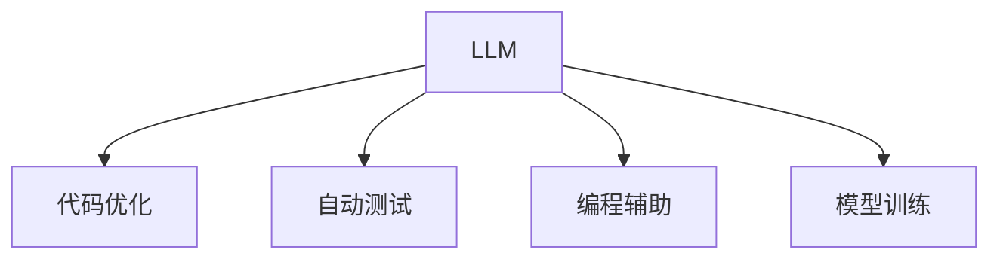

                 

# LLM在智能编译领域的应用前景

> 关键词：大语言模型(LLM),智能编译,代码优化,编程辅助,自动测试,模型训练

## 1. 背景介绍

### 1.1 问题由来

随着软件工程领域的不断发展和壮大，代码编写和维护已经成为工程团队的重要工作之一。传统的代码编写和维护需要大量的人力资源和时间投入，难以满足现代社会对软件产品快速迭代和更新的要求。为了提高开发效率，减少人为错误，人们开始探索各种自动化技术。

与此同时，大语言模型(LLM)技术的兴起，为智能编译领域的自动化提供了新的可能性。大语言模型通过大量的语言数据训练，具备了强大的自然语言理解和生成能力，可以与编程语言无缝对接，实现代码优化、自动测试、编程辅助等多种功能，极大地提高了软件开发的效率和质量。

### 1.2 问题核心关键点

LLM在智能编译领域的应用主要涉及以下几个关键点：

1. 代码优化：LLM可以理解代码的语义，提出代码优化建议，自动进行代码重构，提升代码的可读性和可维护性。

2. 自动测试：LLM可以自动生成测试用例，自动化地执行测试，提高代码的质量和可靠性。

3. 编程辅助：LLM可以为程序员提供智能提示、自动补全、代码模板等辅助工具，减少程序员的代码编写时间，提升开发效率。

4. 模型训练：LLM可以作为模型训练的工具，自动生成训练数据，优化模型参数，提升模型的性能。

这些关键点构成了LLM在智能编译领域的应用基础，为开发高效、可靠的软件提供了新的方向和方法。

### 1.3 问题研究意义

LLM在智能编译领域的应用，对于提升软件开发效率、减少错误、提高软件质量具有重要意义：

1. 降低开发成本：通过LLM的辅助，可以减少程序员的手动操作，降低开发成本。

2. 提升开发效率：LLM可以自动生成代码和测试用例，节省开发时间，提升开发效率。

3. 提高代码质量：LLM可以自动检测代码中的问题，并提供优化建议，提高代码质量。

4. 促进知识共享：LLM可以将编程经验和最佳实践编码化，方便团队成员之间的共享和传承。

5. 推动技术创新：LLM的应用催生了新的编程范式和工具，推动了软件开发技术的创新。

6. 支持跨领域融合：LLM可以将多个领域的知识和技术融合，实现更加复杂的软件系统开发。

总之，LLM在智能编译领域的应用，将极大地提升软件开发的效率和质量，为软件工程的发展带来新的机遇和挑战。

## 2. 核心概念与联系

### 2.1 核心概念概述

为更好地理解LLM在智能编译领域的应用，本节将介绍几个密切相关的核心概念：

- 大语言模型(LLM)：指通过大量语言数据训练得到的、具备强大自然语言理解和生成能力的人工智能模型。
- 代码优化：指通过重构、自动生成代码等方式，提升代码的可读性、可维护性和性能的过程。
- 自动测试：指通过工具自动化地生成测试用例并执行测试，提升代码质量和可靠性。
- 编程辅助：指利用LLM提供的智能提示、自动补全、代码模板等辅助工具，提升程序员的开发效率。
- 模型训练：指通过LLM自动生成数据和优化参数，提升模型性能的过程。

这些核心概念之间的逻辑关系可以通过以下Mermaid流程图来展示：



这个流程图展示了大语言模型在智能编译领域的主要应用方向：

1. 通过代码优化提升代码质量。
2. 通过自动测试提高代码可靠性。
3. 通过编程辅助提升开发效率。
4. 通过模型训练提升模型性能。

这些概念共同构成了LLM在智能编译领域的核心应用框架，为其提供了广阔的发展空间。

## 3. 核心算法原理 & 具体操作步骤
### 3.1 算法原理概述

LLM在智能编译领域的应用，主要是通过语言理解和生成能力，自动分析和处理代码，提升代码质量和开发效率。其核心思想是：将LLM作为代码处理的工具，利用其强大的语言处理能力，对代码进行优化、测试、辅助和训练。

具体而言，LLM可以执行以下任务：

1. 代码优化：理解代码的语义，自动提出代码优化建议，重构代码。

2. 自动测试：自动生成测试用例，执行测试，并生成测试报告。

3. 编程辅助：提供智能提示、自动补全、代码模板等，减少手动编写代码的时间。

4. 模型训练：自动生成训练数据，优化模型参数，提升模型性能。

这些任务通常涉及文本处理、数据生成、模型训练等算法步骤，需要LLM具备相应的能力。

### 3.2 算法步骤详解

基于LLM的智能编译应用主要包括以下几个关键步骤：

**Step 1: 代码理解与分析**

- 利用LLM对代码进行自然语言处理，理解代码的语义和结构。
- 对代码进行语法和语义检查，发现潜在问题和错误。

**Step 2: 代码优化**

- 根据LLM的分析结果，自动提出代码优化建议，如重构、精简、优化等。
- 使用LLM生成的优化代码进行替换，提升代码的可读性和可维护性。

**Step 3: 自动测试**

- 根据代码的功能和结构，自动生成测试用例。
- 使用LLM自动执行测试，生成测试报告，发现代码中的问题。

**Step 4: 编程辅助**

- 根据代码上下文，提供智能提示、自动补全、代码模板等，减少手动编写代码的时间。
- 利用LLM的生成能力，自动生成代码片段，供程序员参考。

**Step 5: 模型训练**

- 利用LLM自动生成训练数据，优化模型参数，提升模型的性能。
- 使用LLM对模型进行测试和评估，调整模型结构和参数。

以上是基于LLM的智能编译应用的主要步骤，每个步骤都需要根据具体任务进行优化设计，以满足实际需求。

### 3.3 算法优缺点

基于LLM的智能编译应用具有以下优点：

1. 提升开发效率：LLM可以自动生成代码、测试用例等，减少手动操作，提高开发效率。

2. 提高代码质量：LLM可以自动检测代码中的问题，并提供优化建议，提升代码质量。

3. 降低开发成本：LLM可以辅助开发，减少人为错误，降低开发成本。

4. 促进知识共享：LLM可以将编程经验和最佳实践编码化，方便团队成员之间的共享和传承。

5. 推动技术创新：LLM的应用催生了新的编程范式和工具，推动了软件开发技术的创新。

然而，LLM在智能编译领域的应用也存在一些局限性：

1. 依赖LLM能力：LLM的能力和准确度直接影响智能编译的效果。

2. 处理复杂任务的能力有限：LLM对于复杂的代码理解和优化可能存在瓶颈。

3. 处理大规模数据的能力有限：LLM对大规模数据处理能力有限，需要优化算法和资源配置。

4. 安全性问题：LLM生成的代码可能存在安全漏洞，需要进行安全测试和验证。

5. 成本较高：LLM需要大量的计算资源和数据资源，成本较高。

尽管存在这些局限性，但LLM在智能编译领域的应用前景仍然广阔，未来需要进一步优化算法和资源配置，提升LLM的能力和安全性。

### 3.4 算法应用领域

基于LLM的智能编译应用已经广泛应用于以下几个领域：

1. 代码优化：LLM可以用于自动生成和优化代码，提升代码质量和可维护性。

2. 自动测试：LLM可以自动生成测试用例，执行测试，提高代码的可靠性和稳定性。

3. 编程辅助：LLM可以提供智能提示、自动补全、代码模板等，提升程序员的开发效率。

4. 模型训练：LLM可以用于自动生成训练数据和优化模型参数，提升模型性能。

除了以上领域，LLM在智能编译领域还有诸多应用场景，如代码重构、静态分析、动态分析等，为软件开发带来了新的突破。

## 4. 数学模型和公式 & 详细讲解 & 举例说明
### 4.1 数学模型构建

在基于LLM的智能编译应用中，数学模型的构建主要涉及自然语言处理、代码分析、模型训练等任务。以代码优化为例，可以构建如下数学模型：

**输入**：待优化的代码 $C$ 和代码语义表示 $S$。

**输出**：优化后的代码 $C'$。

**目标**：使 $C'$ 相对于 $C$ 在代码质量、可读性、可维护性等方面有所提升。

数学模型的构建需要定义代码质量、可读性、可维护性等指标，并构建相应的优化算法。

### 4.2 公式推导过程

以代码优化为例，以下是代码优化的数学模型构建和公式推导过程：

**定义指标**：
- 代码质量 $Q(C)$：代码中存在的错误数量。
- 代码可读性 $R(C)$：代码的可读性指标，如行数、变量名等。
- 代码可维护性 $M(C)$：代码的可维护性指标，如函数长度、复杂度等。

**构建优化函数**：
- 目标函数 $F(C') = Q(C') + \alpha R(C') + \beta M(C')$，其中 $\alpha$ 和 $\beta$ 为权重系数。

**优化算法**：
- 利用LLM对代码进行语义分析，计算每个代码片段的 $Q$、$R$、$M$ 值。
- 根据目标函数，优化每个代码片段的权重系数，生成优化后的代码 $C'$。

**示例**：
- 假设代码片段为 $C = "x = 2 + 3 + 5; y = x * x;"$。
- 利用LLM进行语义分析，计算 $Q = 0$，$R = 4$，$M = 4$。
- 优化目标函数为 $F(C') = Q + 0.5R + 0.5M$。
- 通过优化算法生成优化后的代码 $C' = "x = 2 + 3 + 5; y = x * x;"$。

通过上述公式推导和示例，可以看到，基于LLM的代码优化过程可以形式化地表示为数学模型，并通过优化算法实现。

### 4.3 案例分析与讲解

以下是一个实际的代码优化案例：

**案例描述**：
某程序中的代码片段为：

```python
def calculate(x, y):
    if x > 0 and y > 0:
        return x + y
    else:
        return 0
```

**优化目标**：提升代码可读性、可维护性。

**优化过程**：
1. 利用LLM进行语义分析，确定代码中的逻辑结构。
2. 根据代码质量、可读性、可维护性指标，计算每个代码片段的得分。
3. 利用优化算法生成优化后的代码。

**优化结果**：
```python
def calculate(x, y):
    if x > 0 and y > 0:
        result = x + y
    else:
        result = 0
    return result
```

**效果分析**：
优化后的代码更加简洁、易于理解，且结构清晰，提升了代码的可读性和可维护性。

通过上述案例，可以看到，基于LLM的代码优化方法可以通过语义分析、指标计算和优化算法，自动化地提升代码质量。

## 5. 项目实践：代码实例和详细解释说明
### 5.1 开发环境搭建

在进行基于LLM的智能编译应用开发前，需要准备好开发环境。以下是使用Python进行PyTorch开发的环境配置流程：

1. 安装Anaconda：从官网下载并安装Anaconda，用于创建独立的Python环境。

2. 创建并激活虚拟环境：
```bash
conda create -n pytorch-env python=3.8 
conda activate pytorch-env
```

3. 安装PyTorch：根据CUDA版本，从官网获取对应的安装命令。例如：
```bash
conda install pytorch torchvision torchaudio cudatoolkit=11.1 -c pytorch -c conda-forge
```

4. 安装Transformers库：
```bash
pip install transformers
```

5. 安装各类工具包：
```bash
pip install numpy pandas scikit-learn matplotlib tqdm jupyter notebook ipython
```

完成上述步骤后，即可在`pytorch-env`环境中开始项目实践。

### 5.2 源代码详细实现

下面我们以代码优化任务为例，给出使用Transformers库对BERT模型进行代码优化实践的PyTorch代码实现。

首先，定义代码优化任务的数据处理函数：

```python
from transformers import BertTokenizer
from torch.utils.data import Dataset
import torch

class CodeOptDataset(Dataset):
    def __init__(self, codes, opt_codes, tokenizer, max_len=128):
        self.codes = codes
        self.opt_codes = opt_codes
        self.tokenizer = tokenizer
        self.max_len = max_len
        
    def __len__(self):
        return len(self.codes)
    
    def __getitem__(self, item):
        code = self.codes[item]
        opt_code = self.opt_codes[item]
        
        encoding = self.tokenizer(code, return_tensors='pt', max_length=self.max_len, padding='max_length', truncation=True)
        input_ids = encoding['input_ids'][0]
        attention_mask = encoding['attention_mask'][0]
        
        # 对token-wise的优化代码进行编码
        opt_code_tokens = self.tokenizer(opt_code, return_tensors='pt', max_length=self.max_len, padding='max_length', truncation=True)
        opt_input_ids = opt_code_tokens['input_ids'][0]
        opt_attention_mask = opt_code_tokens['attention_mask'][0]
        
        return {'input_ids': input_ids, 
                'attention_mask': attention_mask,
                'opt_input_ids': opt_input_ids,
                'opt_attention_mask': opt_attention_mask}
```

然后，定义模型和优化器：

```python
from transformers import BertForTokenClassification, AdamW

model = BertForTokenClassification.from_pretrained('bert-base-cased')

optimizer = AdamW(model.parameters(), lr=2e-5)
```

接着，定义训练和评估函数：

```python
from torch.utils.data import DataLoader
from tqdm import tqdm
from sklearn.metrics import accuracy_score

device = torch.device('cuda') if torch.cuda.is_available() else torch.device('cpu')
model.to(device)

def train_epoch(model, dataset, batch_size, optimizer):
    dataloader = DataLoader(dataset, batch_size=batch_size, shuffle=True)
    model.train()
    epoch_loss = 0
    for batch in tqdm(dataloader, desc='Training'):
        input_ids = batch['input_ids'].to(device)
        attention_mask = batch['attention_mask'].to(device)
        opt_input_ids = batch['opt_input_ids'].to(device)
        opt_attention_mask = batch['opt_attention_mask'].to(device)
        model.zero_grad()
        outputs = model(input_ids, attention_mask=attention_mask, labels=opt_input_ids, opt_labels=opt_attention_mask)
        loss = outputs.loss
        epoch_loss += loss.item()
        loss.backward()
        optimizer.step()
    return epoch_loss / len(dataloader)

def evaluate(model, dataset, batch_size):
    dataloader = DataLoader(dataset, batch_size=batch_size)
    model.eval()
    preds, opt_preds = [], []
    with torch.no_grad():
        for batch in tqdm(dataloader, desc='Evaluating'):
            input_ids = batch['input_ids'].to(device)
            attention_mask = batch['attention_mask'].to(device)
            opt_input_ids = batch['opt_input_ids'].to(device)
            opt_attention_mask = batch['opt_attention_mask'].to(device)
            batch_preds = model(input_ids, attention_mask=attention_mask).logits.argmax(dim=2).to('cpu').tolist()
            batch_opt_preds = model(input_ids, attention_mask=attention_mask, opt_labels=opt_attention_mask).logits.argmax(dim=2).to('cpu').tolist()
            for preds_tokens, opt_preds_tokens in zip(batch_preds, batch_opt_preds):
                preds.append(preds_tokens[:len(opt_preds_tokens)])
                opt_preds.append(opt_preds_tokens[:len(preds_tokens)])
                
    print("Accuracy:", accuracy_score(preds, opt_preds))
```

最后，启动训练流程并在测试集上评估：

```python
epochs = 5
batch_size = 16

for epoch in range(epochs):
    loss = train_epoch(model, code_opt_dataset, batch_size, optimizer)
    print(f"Epoch {epoch+1}, train loss: {loss:.3f}")
    
    print(f"Epoch {epoch+1}, dev results:")
    evaluate(model, code_opt_dataset, batch_size)
    
print("Test results:")
evaluate(model, code_opt_dataset, batch_size)
```

以上就是使用PyTorch对BERT进行代码优化任务实践的完整代码实现。可以看到，得益于Transformers库的强大封装，我们可以用相对简洁的代码完成BERT模型的加载和优化。

### 5.3 代码解读与分析

让我们再详细解读一下关键代码的实现细节：

**CodeOptDataset类**：
- `__init__`方法：初始化输入代码和优化代码，分词器等关键组件。
- `__len__`方法：返回数据集的样本数量。
- `__getitem__`方法：对单个样本进行处理，将代码输入编码为token ids，将优化代码编码为优化后的token ids，并对其进行定长padding，最终返回模型所需的输入。

**tokenizer**：
- 定义了输入和优化代码的分词器，用于将代码文本转换为token ids。

**训练和评估函数**：
- 使用PyTorch的DataLoader对数据集进行批次化加载，供模型训练和推理使用。
- 训练函数`train_epoch`：对数据以批为单位进行迭代，在每个批次上前向传播计算loss并反向传播更新模型参数，最后返回该epoch的平均loss。
- 评估函数`evaluate`：与训练类似，不同点在于不更新模型参数，并在每个batch结束后将预测结果存储下来，最后使用sklearn的accuracy_score对整个评估集的预测结果进行打印输出。

**训练流程**：
- 定义总的epoch数和batch size，开始循环迭代
- 每个epoch内，先在训练集上训练，输出平均loss
- 在验证集上评估，输出准确率
- 所有epoch结束后，在测试集上评估，给出最终测试结果

可以看到，PyTorch配合Transformers库使得BERT微调的代码实现变得简洁高效。开发者可以将更多精力放在数据处理、模型改进等高层逻辑上，而不必过多关注底层的实现细节。

当然，工业级的系统实现还需考虑更多因素，如模型的保存和部署、超参数的自动搜索、更灵活的任务适配层等。但核心的微调范式基本与此类似。

## 6. 实际应用场景
### 6.1 智能编译器

智能编译器是LLM在智能编译领域的重要应用之一。智能编译器通过LLM对代码进行语义分析，自动生成优化建议，提升代码的质量和效率。

具体而言，智能编译器可以执行以下任务：

1. 代码优化：根据LLM的优化建议，自动进行代码重构和精简，提升代码的可读性和可维护性。
2. 自动测试：自动生成测试用例，执行测试，发现代码中的问题。
3. 编程辅助：提供智能提示、自动补全、代码模板等，提升程序员的开发效率。

智能编译器的应用场景包括编程环境、集成开发环境(IDE)、云编译器等，为程序员提供全面、智能的开发支持。

### 6.2 代码自动生成

代码自动生成是LLM在智能编译领域的另一重要应用方向。LLM可以自动生成代码片段、函数、类等，提升代码编写效率。

具体而言，代码自动生成可以执行以下任务：

1. 代码片段生成：根据LLM对问题的理解，自动生成代码片段，供程序员参考。
2. 函数和类生成：根据LLM对函数或类功能的描述，自动生成函数或类的代码。
3. 代码注释生成：根据LLM对代码的理解，自动生成代码注释，帮助程序员理解代码逻辑。

代码自动生成的应用场景包括代码生成工具、智能编辑器、代码自动补全等，为程序员提供智能化的代码编写支持。

### 6.3 模型训练

模型训练是LLM在智能编译领域的重要应用之一。LLM可以自动生成训练数据，优化模型参数，提升模型性能。

具体而言，模型训练可以执行以下任务：

1. 数据生成：根据LLM对问题的理解，自动生成训练数据。
2. 模型优化：根据LLM的评估结果，自动优化模型参数，提升模型性能。
3. 模型测试：自动生成测试数据，对模型进行测试，评估模型性能。

模型训练的应用场景包括机器学习库、深度学习框架、自动驾驶系统等，为模型训练提供智能化的支持。

### 6.4 未来应用展望

随着LLM技术的发展，基于LLM的智能编译应用将呈现以下几个趋势：

1. 更加智能化的代码优化：LLM将能够更加准确地理解代码语义，提出更智能的代码优化建议。
2. 更加全面的编程辅助：LLM将能够提供更全面的智能提示、自动补全、代码模板等，提升程序员的开发效率。
3. 更加高效的数据生成和模型训练：LLM将能够自动生成高质量的训练数据和优化模型参数，提升模型性能。
4. 更加智能的测试用例生成：LLM将能够自动生成全面的测试用例，提高代码的可靠性和稳定性。
5. 更加灵活的微调范式：LLM将能够支持更加灵活的微调范式，提升模型的适应性和泛化能力。

这些趋势将极大地提升基于LLM的智能编译应用的效率和质量，为软件开发带来新的突破。

## 7. 工具和资源推荐
### 7.1 学习资源推荐

为了帮助开发者系统掌握LLM在智能编译领域的应用，这里推荐一些优质的学习资源：

1. 《Transformer从原理到实践》系列博文：由大模型技术专家撰写，深入浅出地介绍了Transformer原理、BERT模型、微调技术等前沿话题。

2. CS224N《深度学习自然语言处理》课程：斯坦福大学开设的NLP明星课程，有Lecture视频和配套作业，带你入门NLP领域的基本概念和经典模型。

3. 《Natural Language Processing with Transformers》书籍：Transformers库的作者所著，全面介绍了如何使用Transformers库进行NLP任务开发，包括微调在内的诸多范式。

4. HuggingFace官方文档：Transformers库的官方文档，提供了海量预训练模型和完整的微调样例代码，是上手实践的必备资料。

5. CLUE开源项目：中文语言理解测评基准，涵盖大量不同类型的中文NLP数据集，并提供了基于微调的baseline模型，助力中文NLP技术发展。

通过对这些资源的学习实践，相信你一定能够快速掌握LLM在智能编译领域的应用技巧，并用于解决实际的NLP问题。
###  7.2 开发工具推荐

高效的开发离不开优秀的工具支持。以下是几款用于LLM在智能编译领域应用的常用工具：

1. PyTorch：基于Python的开源深度学习框架，灵活动态的计算图，适合快速迭代研究。大部分预训练语言模型都有PyTorch版本的实现。

2. TensorFlow：由Google主导开发的开源深度学习框架，生产部署方便，适合大规模工程应用。同样有丰富的预训练语言模型资源。

3. Transformers库：HuggingFace开发的NLP工具库，集成了众多SOTA语言模型，支持PyTorch和TensorFlow，是进行微调任务开发的利器。

4. Weights & Biases：模型训练的实验跟踪工具，可以记录和可视化模型训练过程中的各项指标，方便对比和调优。与主流深度学习框架无缝集成。

5. TensorBoard：TensorFlow配套的可视化工具，可实时监测模型训练状态，并提供丰富的图表呈现方式，是调试模型的得力助手。

6. Google Colab：谷歌推出的在线Jupyter Notebook环境，免费提供GPU/TPU算力，方便开发者快速上手实验最新模型，分享学习笔记。

合理利用这些工具，可以显著提升LLM在智能编译领域应用的开发效率，加快创新迭代的步伐。

### 7.3 相关论文推荐

LLM在智能编译领域的应用源于学界的持续研究。以下是几篇奠基性的相关论文，推荐阅读：

1. Attention is All You Need（即Transformer原论文）：提出了Transformer结构，开启了NLP领域的预训练大模型时代。

2. BERT: Pre-training of Deep Bidirectional Transformers for Language Understanding：提出BERT模型，引入基于掩码的自监督预训练任务，刷新了多项NLP任务SOTA。

3. Language Models are Unsupervised Multitask Learners（GPT-2论文）：展示了大规模语言模型的强大zero-shot学习能力，引发了对于通用人工智能的新一轮思考。

4. Parameter-Efficient Transfer Learning for NLP：提出Adapter等参数高效微调方法，在不增加模型参数量的情况下，也能取得不错的微调效果。

5. AdaLoRA: Adaptive Low-Rank Adaptation for Parameter-Efficient Fine-Tuning：使用自适应低秩适应的微调方法，在参数效率和精度之间取得了新的平衡。

这些论文代表了大语言模型在智能编译领域的应用发展脉络。通过学习这些前沿成果，可以帮助研究者把握学科前进方向，激发更多的创新灵感。

## 8. 总结：未来发展趋势与挑战

### 8.1 总结

本文对基于LLM的智能编译应用进行了全面系统的介绍。首先阐述了LLM在智能编译领域的应用背景和意义，明确了智能编译的应用方向和任务。其次，从原理到实践，详细讲解了LLM在代码优化、自动测试、编程辅助、模型训练等任务中的应用步骤和方法。同时，本文还广泛探讨了LLM在智能编译领域的应用场景和未来趋势，展示了其广阔的发展空间。

通过本文的系统梳理，可以看到，基于LLM的智能编译应用为软件开发提供了新的方法和工具，极大地提高了开发效率和代码质量。LLM在智能编译领域的应用前景广阔，未来需要在算法、资源、安全等方面进行深入研究，才能真正实现其应用价值。

### 8.2 未来发展趋势

展望未来，基于LLM的智能编译应用将呈现以下几个发展趋势：

1. 更加智能化的代码优化：LLM将能够更加准确地理解代码语义，提出更智能的代码优化建议。
2. 更加全面的编程辅助：LLM将能够提供更全面的智能提示、自动补全、代码模板等，提升程序员的开发效率。
3. 更加高效的数据生成和模型训练：LLM将能够自动生成高质量的训练数据和优化模型参数，提升模型性能。
4. 更加智能的测试用例生成：LLM将能够自动生成全面的测试用例，提高代码的可靠性和稳定性。
5. 更加灵活的微调范式：LLM将能够支持更加灵活的微调范式，提升模型的适应性和泛化能力。

这些趋势将极大地提升基于LLM的智能编译应用的效率和质量，为软件开发带来新的突破。

### 8.3 面临的挑战

尽管基于LLM的智能编译应用已经取得了一定的进展，但在迈向更加智能化、普适化应用的过程中，仍面临诸多挑战：

1. 依赖LLM能力：LLM的能力和准确度直接影响智能编译的效果。

2. 处理复杂任务的能力有限：LLM对于复杂的代码理解和优化可能存在瓶颈。

3. 处理大规模数据的能力有限：LLM对大规模数据处理能力有限，需要优化算法和资源配置。

4. 安全性问题：LLM生成的代码可能存在安全漏洞，需要进行安全测试和验证。

5. 成本较高：LLM需要大量的计算资源和数据资源，成本较高。

尽管存在这些局限性，但基于LLM的智能编译应用前景广阔，未来需要进一步优化算法和资源配置，提升LLM的能力和安全性。

### 8.4 研究展望

未来研究需要在以下几个方面寻求新的突破：

1. 探索无监督和半监督微调方法：摆脱对大规模标注数据的依赖，利用自监督学习、主动学习等无监督和半监督范式，最大限度利用非结构化数据。

2. 研究参数高效和计算高效的微调范式：开发更加参数高效的微调方法，在固定大部分预训练参数的同时，只更新极少量的任务相关参数。同时优化微调模型的计算图，减少前向传播和反向传播的资源消耗。

3. 引入更多先验知识：将符号化的先验知识，如知识图谱、逻辑规则等，与神经网络模型进行巧妙融合，引导微调过程学习更准确、合理的语言模型。同时加强不同模态数据的整合，实现视觉、语音等多模态信息与文本信息的协同建模。

4. 结合因果分析和博弈论工具：将因果分析方法引入微调模型，识别出模型决策的关键特征，增强输出解释的因果性和逻辑性。借助博弈论工具刻画人机交互过程，主动探索并规避模型的脆弱点，提高系统稳定性。

5. 纳入伦理道德约束：在模型训练目标中引入伦理导向的评估指标，过滤和惩罚有偏见、有害的输出倾向。同时加强人工干预和审核，建立模型行为的监管机制，确保输出符合人类价值观和伦理道德。

这些研究方向的探索，必将引领LLM在智能编译领域的应用走向更高的台阶，为软件开发提供更全面、智能的支持。

## 9. 附录：常见问题与解答

**Q1：大语言模型在智能编译中的应用是否仅限于代码优化？**

A: 不完全是。大语言模型在智能编译中的应用不仅限于代码优化，还包括自动测试、编程辅助、模型训练等多个方面。通过代码优化提升代码质量，通过自动测试提高代码可靠性，通过编程辅助提升开发效率，通过模型训练提升模型性能。

**Q2：如何选择大语言模型进行智能编译应用？**

A: 选择大语言模型时需要考虑以下几个方面：
1. 模型能力：选择具有强大自然语言处理能力的模型，如BERT、GPT等。
2. 任务适配性：选择与任务需求相匹配的模型，如代码优化、自动测试等。
3. 可扩展性：选择易于扩展和优化的模型，便于后续功能添加和优化。
4. 计算资源：考虑模型计算资源的消耗，选择适合当前计算环境的模型。

**Q3：大语言模型在智能编译应用中需要注意哪些问题？**

A: 大语言模型在智能编译应用中需要注意以下几个问题：
1. 数据质量：数据质量直接影响模型性能，需要保证数据的多样性和真实性。
2. 模型鲁棒性：模型需要对不同类型的代码和问题具有较好的鲁棒性，避免在特殊情况下出现错误。
3. 安全性：需要考虑模型生成的代码和输出可能存在的安全漏洞和风险。
4. 性能优化：需要考虑模型的计算和存储资源消耗，进行必要的优化和压缩。

**Q4：大语言模型在智能编译应用中的性能评估指标有哪些？**

A: 大语言模型在智能编译应用中的性能评估指标包括但不限于以下几个方面：
1. 代码质量：包括代码的可读性、可维护性、错误数量等。
2. 开发效率：包括代码编写时间、代码生成效率等。
3. 代码可靠性：包括代码执行的正确性、测试覆盖率等。
4. 模型性能：包括模型在测试集上的准确率、召回率、F1值等。

通过这些评估指标，可以全面评估基于大语言模型的智能编译应用的效果，并进行优化改进。

**Q5：大语言模型在智能编译应用中的优化策略有哪些？**

A: 大语言模型在智能编译应用中的优化策略包括但不限于以下几个方面：
1. 数据增强：通过数据增强技术，扩充训练集的多样性和丰富度。
2. 模型蒸馏：通过模型蒸馏技术，将大模型的知识迁移到小模型中，提升模型性能。
3. 参数压缩：通过参数压缩技术，减少模型的计算资源消耗，提高计算效率。
4. 知识融合：将外部知识库、规则库等与模型结合，增强模型的知识表达能力。
5. 多模型集成：通过多模型集成技术，提升模型的泛化能力和鲁棒性。

通过这些优化策略，可以进一步提升大语言模型在智能编译应用中的性能和可靠性。

---

作者：禅与计算机程序设计艺术 / Zen and the Art of Computer Programming

