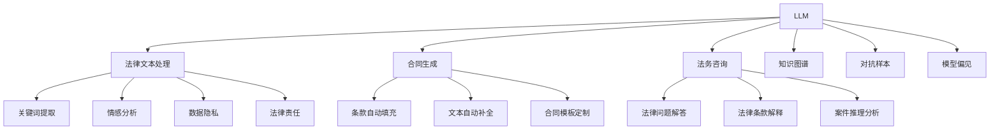

                 

# LLM在法律领域的应用与挑战

> 关键词：大语言模型(LLM),法律文本处理,合同生成,法务咨询,知识图谱

## 1. 背景介绍

### 1.1 问题由来
随着人工智能技术的迅猛发展，大语言模型(LLM)在自然语言处理(NLP)领域取得了显著进展。LLM通过在海量文本数据上进行预训练，学习到了丰富的语言知识，具备了强大的自然语言理解与生成能力。在法律领域，LLM能够用于文本处理、合同生成、法务咨询等多个方面，显著提高了法律工作的效率和准确性。

然而，LLM在法律领域的应用还面临一些挑战。法律文本具有高度专业性、复杂性和多样性，法律领域的特殊性使得LLM在处理法律文本时存在诸多难点。如何克服这些挑战，充分发挥LLM在法律领域的应用潜力，是当前法律与人工智能交叉研究的热点问题。

### 1.2 问题核心关键点
本文聚焦于LLM在法律领域的具体应用场景和面临的挑战。主要讨论以下核心问题：
- LLM在法律文本处理中的应用：包括合同文本分析、法律条款提取、法务咨询等。
- 法律领域的特殊性对LLM带来的挑战：如法律术语的准确理解、法律文本的逻辑结构、法律文本的多样性等。
- LLM在法律领域的潜在风险：如模型偏见、数据隐私、法律责任等。

## 2. 核心概念与联系

### 2.1 核心概念概述

为更好地理解LLM在法律领域的应用，本节将介绍几个密切相关的核心概念：

- 大语言模型(Large Language Model, LLM)：以自回归模型为代表的大规模预训练语言模型。通过在海量文本数据上进行预训练，学习通用的语言表示，具备强大的语言理解和生成能力。

- 法律文本处理：利用NLP技术对法律文本进行自动化处理，包括文本分类、关键词提取、情感分析、实体识别等。

- 合同生成：自动生成合法的合同文本，包括条款自动填充、文本自动补全、合同模板定制等。

- 法务咨询：利用LLM提供法律咨询，包括法律问题解答、法律条款解释、案件推理分析等。

- 知识图谱：通过结构化数据对法律知识进行编码，便于LLM进行推理和应用。

- 对抗样本：针对LLM的恶意输入样本，可能影响模型的推理和决策。

- 模型偏见：由于训练数据集的偏差，LLM可能对特定群体或主题存在偏见。

- 数据隐私：在法律文本处理和分析中，涉及到大量敏感信息，数据隐私保护至关重要。

- 法律责任：LLM在法律领域的应用可能涉及知识产权、数据保护等法律责任问题。

这些核心概念之间的逻辑关系可以通过以下Mermaid流程图来展示：



这个流程图展示了大语言模型在法律领域的应用场景及其关联概念：

1. LLM通过预训练学习到语言知识，在法律文本处理、合同生成和法务咨询中具有广泛应用。
2. 法律文本处理包括关键词提取、情感分析等基础任务，为其他应用场景提供支持。
3. 合同生成涉及条款填充、文本补全、模板定制等，直接为法律实践提供解决方案。
4. 法务咨询包括法律问题解答、条款解释、案件推理分析等，是LLM在法律领域的高级应用。
5. 知识图谱为LLM提供了结构化知识，便于推理和应用。
6. 对抗样本和模型偏见是模型安全性和公平性的关键考量。
7. 数据隐私和法律责任是法律领域数据处理的重要问题。

这些概念共同构成了LLM在法律领域的应用框架，使LLM能够充分发挥其语言处理和生成能力，为法律工作提供支持。

## 3. 核心算法原理 & 具体操作步骤
### 3.1 算法原理概述

LLM在法律领域的应用，核心在于利用其强大的自然语言理解和生成能力，对法律文本进行处理和分析。其核心算法原理包括以下几个方面：

- 预训练：在大规模无标签法律文本数据上进行预训练，学习通用的法律语言知识和模式。
- 微调：在特定法律任务的数据集上，通过有监督学习进行微调，适应法律文本的特定需求。
- 结构化表示：将法律文本结构化为结构化数据，如知识图谱，便于LLM进行推理和应用。
- 对抗训练：在对抗样本上进行训练，增强LLM的鲁棒性和安全性。
- 参数高效微调：在微调过程中，只更新少量参数，保留大部分预训练权重，提高模型效率。

### 3.2 算法步骤详解

以下是LLM在法律领域应用的具体算法步骤：

**Step 1: 准备预训练模型和数据集**
- 选择合适的预训练模型，如GPT-3、BERT等。
- 准备法律文本处理、合同生成、法务咨询等任务的标注数据集。

**Step 2: 添加任务适配层**
- 根据具体任务，设计合适的任务适配层。如合同生成任务，可设计模板填充层；法务咨询任务，可设计问题-答案对生成层。
- 使用Transformer模型作为适配层的基础架构，设计合适的注意力机制。

**Step 3: 设置微调超参数**
- 选择合适的优化器，如AdamW、SGD等，设置学习率、批大小、迭代轮数等。
- 设置正则化技术，如L2正则、Dropout等，防止过拟合。
- 确定冻结预训练参数的策略，如仅微调顶层，或全部参数都参与微调。

**Step 4: 执行梯度训练**
- 将训练集数据分批次输入模型，前向传播计算损失函数。
- 反向传播计算参数梯度，根据设定的优化算法和学习率更新模型参数。
- 周期性在验证集上评估模型性能，根据性能指标决定是否触发Early Stopping。
- 重复上述步骤直至满足预设的迭代轮数或Early Stopping条件。

**Step 5: 测试和部署**
- 在测试集上评估微调后模型的效果，对比微调前后的精度提升。
- 使用微调后的模型对新样本进行推理预测，集成到实际的应用系统中。
- 持续收集新的法律文本数据，定期重新微调模型，以适应法律领域数据分布的变化。

### 3.3 算法优缺点

LLM在法律领域应用的优势：
- 自动化处理：自动化处理大量法律文本，减轻法律从业者的工作负担。
- 高效性：通过预训练-微调范式，快速适应特定法律任务，提升处理效率。
- 高精度：在大规模法律数据集上进行微调，模型精度高，性能稳定。

LLM在法律领域应用的劣势：
- 依赖标注数据：微调效果受标注数据质量影响较大，标注成本高。
- 模型泛化性：预训练模型对特定法律领域的数据泛化能力有限，需要特定领域数据集进行微调。
- 模型偏见：预训练模型可能存在系统性偏见，需要额外技术手段消除。
- 法律责任：模型应用涉及的法律责任问题复杂，需要明确责任归属。

### 3.4 算法应用领域

LLM在法律领域的应用主要涵盖以下几个方面：

1. **合同生成**：自动生成符合法律规范的合同文本，包括条款填充、文本补全、合同模板定制等。
2. **法律文本处理**：自动化处理法律文本，包括文本分类、关键词提取、情感分析、实体识别等。
3. **法务咨询**：利用LLM提供法律咨询，包括法律问题解答、法律条款解释、案件推理分析等。
4. **知识图谱构建**：通过结构化数据对法律知识进行编码，便于LLM进行推理和应用。

这些应用场景展示了LLM在法律领域的多样性和潜力，为法律工作的各个环节提供了强有力的支持。

## 4. 数学模型和公式 & 详细讲解  
### 4.1 数学模型构建

本节将使用数学语言对LLM在法律领域的微调过程进行更加严格的刻画。

记预训练语言模型为 $M_{\theta}$，其中 $\theta$ 为模型参数。假设法律任务 $T$ 的训练集为 $D=\{(x_i,y_i)\}_{i=1}^N, x_i \in \mathcal{X}, y_i \in \mathcal{Y}$，其中 $x_i$ 表示法律文本，$y_i$ 表示任务标签。

定义模型 $M_{\theta}$ 在输入 $x$ 上的损失函数为 $\ell(M_{\theta}(x),y)$，则在数据集 $D$ 上的经验风险为：

$$
\mathcal{L}(\theta) = \frac{1}{N} \sum_{i=1}^N \ell(M_{\theta}(x_i),y_i)
$$

微调的优化目标是最小化经验风险，即找到最优参数：

$$
\theta^* = \mathop{\arg\min}_{\theta} \mathcal{L}(\theta)
$$

在实践中，我们通常使用基于梯度的优化算法（如SGD、Adam等）来近似求解上述最优化问题。设 $\eta$ 为学习率，$\lambda$ 为正则化系数，则参数的更新公式为：

$$
\theta \leftarrow \theta - \eta \nabla_{\theta}\mathcal{L}(\theta) - \eta\lambda\theta
$$

其中 $\nabla_{\theta}\mathcal{L}(\theta)$ 为损失函数对参数 $\theta$ 的梯度，可通过反向传播算法高效计算。

### 4.2 公式推导过程

以下我们以合同生成任务为例，推导LLM的微调过程。

假设模型 $M_{\theta}$ 在输入 $x$ 上的输出为 $\hat{y}=M_{\theta}(x)$，表示生成的合同文本。真实标签 $y$ 表示合同文本的合法性，如是否为有效合同、是否满足法律条款等。则合同生成任务的二分类交叉熵损失函数定义为：

$$
\ell(M_{\theta}(x),y) = -[y\log M_{\theta}(x) + (1-y)\log (1-M_{\theta}(x))]
$$

将其代入经验风险公式，得：

$$
\mathcal{L}(\theta) = -\frac{1}{N}\sum_{i=1}^N [y_i\log M_{\theta}(x_i)+(1-y_i)\log(1-M_{\theta}(x_i))]
$$

根据链式法则，损失函数对参数 $\theta_k$ 的梯度为：

$$
\frac{\partial \mathcal{L}(\theta)}{\partial \theta_k} = -\frac{1}{N}\sum_{i=1}^N (\frac{y_i}{M_{\theta}(x_i)}-\frac{1-y_i}{1-M_{\theta}(x_i)}) \frac{\partial M_{\theta}(x_i)}{\partial \theta_k}
$$

其中 $\frac{\partial M_{\theta}(x_i)}{\partial \theta_k}$ 可进一步递归展开，利用自动微分技术完成计算。

在得到损失函数的梯度后，即可带入参数更新公式，完成模型的迭代优化。重复上述过程直至收敛，最终得到适应合同生成任务的最优模型参数 $\theta^*$。

## 5. 项目实践：代码实例和详细解释说明
### 5.1 开发环境搭建

在进行LLM微调实践前，我们需要准备好开发环境。以下是使用Python进行PyTorch开发的环境配置流程：

1. 安装Anaconda：从官网下载并安装Anaconda，用于创建独立的Python环境。

2. 创建并激活虚拟环境：
```bash
conda create -n pytorch-env python=3.8 
conda activate pytorch-env
```

3. 安装PyTorch：根据CUDA版本，从官网获取对应的安装命令。例如：
```bash
conda install pytorch torchvision torchaudio cudatoolkit=11.1 -c pytorch -c conda-forge
```

4. 安装Transformers库：
```bash
pip install transformers
```

5. 安装各类工具包：
```bash
pip install numpy pandas scikit-learn matplotlib tqdm jupyter notebook ipython
```

完成上述步骤后，即可在`pytorch-env`环境中开始微调实践。

### 5.2 源代码详细实现

这里我们以合同生成任务为例，给出使用Transformers库对GPT模型进行微调的PyTorch代码实现。

首先，定义合同生成任务的数据处理函数：

```python
from transformers import GPT2Tokenizer, GPT2ForCausalLM
from torch.utils.data import Dataset
import torch

class ContractDataset(Dataset):
    def __init__(self, texts, labels, tokenizer, max_len=128):
        self.texts = texts
        self.labels = labels
        self.tokenizer = tokenizer
        self.max_len = max_len
        
    def __len__(self):
        return len(self.texts)
    
    def __getitem__(self, item):
        text = self.texts[item]
        label = self.labels[item]
        
        encoding = self.tokenizer(text, return_tensors='pt', max_length=self.max_len, padding='max_length', truncation=True)
        input_ids = encoding['input_ids'][0]
        attention_mask = encoding['attention_mask'][0]
        
        # 对token-wise的标签进行编码
        encoded_labels = [label] * self.max_len
        labels = torch.tensor(encoded_labels, dtype=torch.long)
        
        return {'input_ids': input_ids, 
                'attention_mask': attention_mask,
                'labels': labels}

# 标签与id的映射
label2id = {'valid': 0, 'invalid': 1}
id2label = {v: k for k, v in label2id.items()}

# 创建dataset
tokenizer = GPT2Tokenizer.from_pretrained('gpt2')

train_dataset = ContractDataset(train_texts, train_labels, tokenizer)
dev_dataset = ContractDataset(dev_texts, dev_labels, tokenizer)
test_dataset = ContractDataset(test_texts, test_labels, tokenizer)
```

然后，定义模型和优化器：

```python
from transformers import GPT2ForCausalLM, AdamW

model = GPT2ForCausalLM.from_pretrained('gpt2')
optimizer = AdamW(model.parameters(), lr=2e-5)
```

接着，定义训练和评估函数：

```python
from torch.utils.data import DataLoader
from tqdm import tqdm
from sklearn.metrics import classification_report

device = torch.device('cuda') if torch.cuda.is_available() else torch.device('cpu')
model.to(device)

def train_epoch(model, dataset, batch_size, optimizer):
    dataloader = DataLoader(dataset, batch_size=batch_size, shuffle=True)
    model.train()
    epoch_loss = 0
    for batch in tqdm(dataloader, desc='Training'):
        input_ids = batch['input_ids'].to(device)
        attention_mask = batch['attention_mask'].to(device)
        labels = batch['labels'].to(device)
        model.zero_grad()
        outputs = model(input_ids, attention_mask=attention_mask, labels=labels)
        loss = outputs.loss
        epoch_loss += loss.item()
        loss.backward()
        optimizer.step()
    return epoch_loss / len(dataloader)

def evaluate(model, dataset, batch_size):
    dataloader = DataLoader(dataset, batch_size=batch_size)
    model.eval()
    preds, labels = [], []
    with torch.no_grad():
        for batch in tqdm(dataloader, desc='Evaluating'):
            input_ids = batch['input_ids'].to(device)
            attention_mask = batch['attention_mask'].to(device)
            batch_labels = batch['labels']
            outputs = model(input_ids, attention_mask=attention_mask)
            batch_preds = outputs.logits.argmax(dim=2).to('cpu').tolist()
            batch_labels = batch_labels.to('cpu').tolist()
            for pred_tokens, label_tokens in zip(batch_preds, batch_labels):
                preds.append(pred_tokens[:len(label_tokens)])
                labels.append(label_tokens)
                
    print(classification_report(labels, preds))
```

最后，启动训练流程并在测试集上评估：

```python
epochs = 5
batch_size = 16

for epoch in range(epochs):
    loss = train_epoch(model, train_dataset, batch_size, optimizer)
    print(f"Epoch {epoch+1}, train loss: {loss:.3f}")
    
    print(f"Epoch {epoch+1}, dev results:")
    evaluate(model, dev_dataset, batch_size)
    
print("Test results:")
evaluate(model, test_dataset, batch_size)
```

以上就是使用PyTorch对GPT模型进行合同生成任务微调的完整代码实现。可以看到，得益于Transformers库的强大封装，我们可以用相对简洁的代码完成GPT模型的加载和微调。

### 5.3 代码解读与分析

让我们再详细解读一下关键代码的实现细节：

**ContractDataset类**：
- `__init__`方法：初始化文本、标签、分词器等关键组件。
- `__len__`方法：返回数据集的样本数量。
- `__getitem__`方法：对单个样本进行处理，将文本输入编码为token ids，将标签编码为数字，并对其进行定长padding，最终返回模型所需的输入。

**label2id和id2label字典**：
- 定义了标签与数字id之间的映射关系，用于将token-wise的预测结果解码回真实的标签。

**训练和评估函数**：
- 使用PyTorch的DataLoader对数据集进行批次化加载，供模型训练和推理使用。
- 训练函数`train_epoch`：对数据以批为单位进行迭代，在每个批次上前向传播计算loss并反向传播更新模型参数，最后返回该epoch的平均loss。
- 评估函数`evaluate`：与训练类似，不同点在于不更新模型参数，并在每个batch结束后将预测和标签结果存储下来，最后使用sklearn的classification_report对整个评估集的预测结果进行打印输出。

**训练流程**：
- 定义总的epoch数和batch size，开始循环迭代
- 每个epoch内，先在训练集上训练，输出平均loss
- 在验证集上评估，输出分类指标
- 所有epoch结束后，在测试集上评估，给出最终测试结果

可以看到，PyTorch配合Transformers库使得GPT微调的代码实现变得简洁高效。开发者可以将更多精力放在数据处理、模型改进等高层逻辑上，而不必过多关注底层的实现细节。

当然，工业级的系统实现还需考虑更多因素，如模型的保存和部署、超参数的自动搜索、更灵活的任务适配层等。但核心的微调范式基本与此类似。

## 6. 实际应用场景
### 6.1 智能合同审核

基于LLM的合同生成技术，可以应用于智能合同审核系统。传统的合同审核流程往往需要大量律师参与，且易受主观因素影响，效率低且结果不统一。智能合同审核系统通过自动生成合同文本，并对合同内容进行合规性审查，能够快速识别合同中的潜在问题，提升合同审核的准确性和效率。

在技术实现上，可以收集历史合同样本，将其作为监督数据，在此基础上对预训练模型进行微调。微调后的模型能够自动理解合同条款，检测合同中的法律问题，如条款缺失、表述不清、权利义务不明确等。对于合同中的争议点，系统还可进一步通过对比其他合同模板，提供修改建议。如此构建的智能合同审核系统，能大幅提升合同审核的效率和准确性。

### 6.2 法律案件分析

法律案件分析是法务咨询的重要应用场景，LLM可以用于案件的文本分析、证据推理、法律适用等环节。通过对案件描述进行理解和分析，LLM能够自动提取关键事实、识别法律适用依据，提供案件分析报告。在证据推理方面，LLM可以识别证据的真实性、关联性，辅助法官进行证据评估。在法律适用方面，LLM可以自动检索相关的法律条文，提供法律适用的建议。

在具体实现中，可以收集大量的法律案例，将其作为监督数据，对预训练模型进行微调。微调后的模型能够自动分析案件文本，提取关键事实和证据，识别法律适用依据，生成案件分析报告。同时，还可以结合自然语言推理技术，辅助法官进行案件推理。

### 6.3 法律问答系统

法律问答系统能够自动回答用户的法律问题，提供法律咨询和指导。基于LLM的法律问答系统，能够处理复杂多变的法律问题，提供精准的法律解答。用户可以通过自然语言描述问题，系统自动抽取关键词，匹配最合适的答案模板，生成回复。LLM通过微调，能够学习法律问题的常见表述和解答方式，逐步提升系统回答的准确性和智能化水平。

在技术实现上，可以收集法律领域的常见问答对，将问题-答案对作为监督数据，对预训练模型进行微调。微调后的模型能够自动抽取关键词，匹配最合适的答案模板，生成回复。系统还可以结合知识图谱技术，增强模型的知识推理能力。

### 6.4 法律文本处理

法律文本处理包括文本分类、关键词提取、情感分析、实体识别等基础任务。LLM可以用于法律文本的自动化处理，提升法律文本处理的工作效率。通过微调，LLM能够自动分类法律文本，提取关键信息，进行情感分析，识别法律实体等。

在具体实现中，可以收集法律领域的文本数据，将其作为监督数据，对预训练模型进行微调。微调后的模型能够自动处理法律文本，提取关键信息，生成文本摘要，辅助法律工作。

## 7. 工具和资源推荐
### 7.1 学习资源推荐

为了帮助开发者系统掌握LLM在法律领域的应用，这里推荐一些优质的学习资源：

1. 《深度学习在法律领域的应用》系列博文：深度学习在法律领域的最新研究与应用，涵盖合同生成、法律问答、法律文本处理等多个方面。

2. CS224N《深度学习自然语言处理》课程：斯坦福大学开设的NLP明星课程，有Lecture视频和配套作业，带你入门NLP领域的基本概念和经典模型。

3. 《Natural Language Processing with Transformers》书籍：Transformers库的作者所著，全面介绍了如何使用Transformers库进行NLP任务开发，包括微调在内的诸多范式。

4. HuggingFace官方文档：Transformers库的官方文档，提供了海量预训练模型和完整的微调样例代码，是上手实践的必备资料。

5. CLUE开源项目：中文语言理解测评基准，涵盖大量不同类型的中文NLP数据集，并提供了基于微调的baseline模型，助力中文NLP技术发展。

通过对这些资源的学习实践，相信你一定能够快速掌握LLM在法律领域的应用方法和技术要点。

### 7.2 开发工具推荐

高效的开发离不开优秀的工具支持。以下是几款用于LLM微调开发的常用工具：

1. PyTorch：基于Python的开源深度学习框架，灵活动态的计算图，适合快速迭代研究。大部分预训练语言模型都有PyTorch版本的实现。

2. TensorFlow：由Google主导开发的开源深度学习框架，生产部署方便，适合大规模工程应用。同样有丰富的预训练语言模型资源。

3. Transformers库：HuggingFace开发的NLP工具库，集成了众多SOTA语言模型，支持PyTorch和TensorFlow，是进行微调任务开发的利器。

4. Weights & Biases：模型训练的实验跟踪工具，可以记录和可视化模型训练过程中的各项指标，方便对比和调优。与主流深度学习框架无缝集成。

5. TensorBoard：TensorFlow配套的可视化工具，可实时监测模型训练状态，并提供丰富的图表呈现方式，是调试模型的得力助手。

6. Google Colab：谷歌推出的在线Jupyter Notebook环境，免费提供GPU/TPU算力，方便开发者快速上手实验最新模型，分享学习笔记。

合理利用这些工具，可以显著提升LLM微调任务的开发效率，加快创新迭代的步伐。

### 7.3 相关论文推荐

LLM在法律领域的应用源于学界的持续研究。以下是几篇奠基性的相关论文，推荐阅读：

1. Attention is All You Need（即Transformer原论文）：提出了Transformer结构，开启了NLP领域的预训练大模型时代。

2. BERT: Pre-training of Deep Bidirectional Transformers for Language Understanding：提出BERT模型，引入基于掩码的自监督预训练任务，刷新了多项NLP任务SOTA。

3. Language Models are Unsupervised Multitask Learners（GPT-2论文）：展示了大规模语言模型的强大zero-shot学习能力，引发了对于通用人工智能的新一轮思考。

4. Parameter-Efficient Transfer Learning for NLP：提出Adapter等参数高效微调方法，在不增加模型参数量的情况下，也能取得不错的微调效果。

5. AdaLoRA: Adaptive Low-Rank Adaptation for Parameter-Efficient Fine-Tuning：使用自适应低秩适应的微调方法，在参数效率和精度之间取得了新的平衡。

这些论文代表了大语言模型微调技术的发展脉络。通过学习这些前沿成果，可以帮助研究者把握学科前进方向，激发更多的创新灵感。

## 8. 总结：未来发展趋势与挑战

### 8.1 总结

本文对LLM在法律领域的具体应用场景和面临的挑战进行了全面系统的介绍。首先阐述了LLM在法律文本处理、合同生成、法务咨询等任务中的重要应用，展示了LLM在法律领域的强大潜力。其次，从原理到实践，详细讲解了LLM在法律领域的应用流程和技术要点，给出了微调任务开发的完整代码实例。最后，我们探讨了LLM在法律领域面临的数据质量、模型偏见、法律责任等挑战，提出了一些针对性的解决方案。

通过本文的系统梳理，可以看到，LLM在法律领域的应用前景广阔，但同时也面临着许多实际问题和挑战。如何在保证应用效果的同时，更好地应对这些挑战，还需要更多的研究实践和探索。

### 8.2 未来发展趋势

展望未来，LLM在法律领域的应用将呈现以下几个发展趋势：

1. 法律知识图谱的构建：通过知识图谱技术，将法律知识进行结构化表示，增强LLM的知识推理能力。
2. 参数高效微调方法的探索：开发更加参数高效的微调方法，在固定大部分预训练参数的同时，只更新少量任务相关参数，提升微调效率。
3. 多模态融合技术的引入：结合法律文本、图像、语音等多种数据模态，提升LLM在法律领域的理解和应用能力。
4. 法律领域的特定训练数据集：收集更多法律领域的特定训练数据集，提升LLM在法律领域的泛化能力。
5. 对抗训练和鲁棒性增强：通过对抗训练等技术，提升LLM在法律领域的鲁棒性和安全性。

以上趋势凸显了LLM在法律领域的应用前景。这些方向的探索发展，必将进一步提升LLM在法律领域的性能和应用范围，为法律工作提供更强大、更可靠的智能支持。

### 8.3 面临的挑战

尽管LLM在法律领域的应用取得了一定进展，但在迈向更加智能化、普适化应用的过程中，仍然面临诸多挑战：

1. 数据质量和标注成本：法律文本的复杂性和多样性导致数据标注成本高、质量难以保证，影响了微调效果。
2. 法律领域的特殊性：法律术语的准确理解、法律文本的逻辑结构、法律文本的多样性等，使得LLM在法律领域的应用效果受到限制。
3. 模型偏见和公平性：预训练模型可能存在系统性偏见，需要额外技术手段消除。
4. 法律责任和安全：模型应用涉及的法律责任问题复杂，需要明确责任归属，同时确保数据和模型的安全性。

这些挑战需要学界和产业界共同努力，通过更多的研究实践和实践探索，才能进一步推动LLM在法律领域的应用。

### 8.4 研究展望

未来，LLM在法律领域的研究方向可以从以下几个方面进行探索：

1. 法律知识图谱的构建和应用：通过知识图谱技术，将法律知识进行结构化表示，增强LLM的知识推理能力。
2. 多模态融合技术的引入：结合法律文本、图像、语音等多种数据模态，提升LLM在法律领域的理解和应用能力。
3. 参数高效微调方法的探索：开发更加参数高效的微调方法，在固定大部分预训练参数的同时，只更新少量任务相关参数，提升微调效率。
4. 对抗训练和鲁棒性增强：通过对抗训练等技术，提升LLM在法律领域的鲁棒性和安全性。
5. 数据质量和标注成本的优化：利用无监督学习、主动学习等技术，降低微调对标注数据的需求。
6. 法律领域的特定训练数据集：收集更多法律领域的特定训练数据集，提升LLM在法律领域的泛化能力。
7. 法律领域的特定任务：针对法律领域的特定任务，如合同生成、法律问答、法律文本处理等，开发专门的微调模型和应用。

这些研究方向将进一步推动LLM在法律领域的应用，为法律工作提供更强大、更可靠的智能支持。

## 9. 附录：常见问题与解答

**Q1：如何构建法律知识图谱？**

A: 法律知识图谱的构建需要从数据收集、图谱构建、图谱应用等多个环节进行。首先，需要收集法律领域的各类数据，如法律条文、司法判例、法律解释等。然后，将这些数据进行结构化处理，构建法律知识图谱。最后，将法律知识图谱应用于LLM，增强其推理和应用能力。

**Q2：如何提升法律文本的处理效果？**

A: 提升法律文本的处理效果需要从数据预处理、模型训练、后处理等多个环节进行。首先，需要对法律文本进行分词、词性标注等基础处理。然后，选择合适的模型和任务适配层进行微调，增强模型对法律文本的理解能力。最后，通过后处理技术，如文本摘要、命名实体识别等，进一步提升处理效果。

**Q3：如何降低微调对标注数据的依赖？**

A: 降低微调对标注数据的依赖需要从多个方面进行。首先，可以利用无监督学习、主动学习等技术，从非标注数据中学习更多的知识。其次，可以利用少样本学习技术，通过少量标注数据快速适应新任务。最后，可以引入对抗训练等技术，增强模型对数据分布变化的适应能力。

**Q4：如何避免LLM在法律领域的应用偏见？**

A: 避免LLM在法律领域的应用偏见需要从数据收集、模型训练、后处理等多个环节进行。首先，需要收集多样化的数据，避免数据偏见。其次，可以通过正则化、对抗训练等技术，消除模型系统性偏见。最后，可以通过后处理技术，如算法监控、人工审核等，进一步避免偏见。

**Q5：如何确保LLM在法律领域的应用安全？**

A: 确保LLM在法律领域的应用安全需要从数据安全、模型安全、应用安全等多个环节进行。首先，需要确保数据的安全存储和传输。其次，需要对模型进行安全评估，发现潜在的安全漏洞。最后，需要确保应用的安全性，避免恶意攻击和滥用。

---

作者：禅与计算机程序设计艺术 / Zen and the Art of Computer Programming

