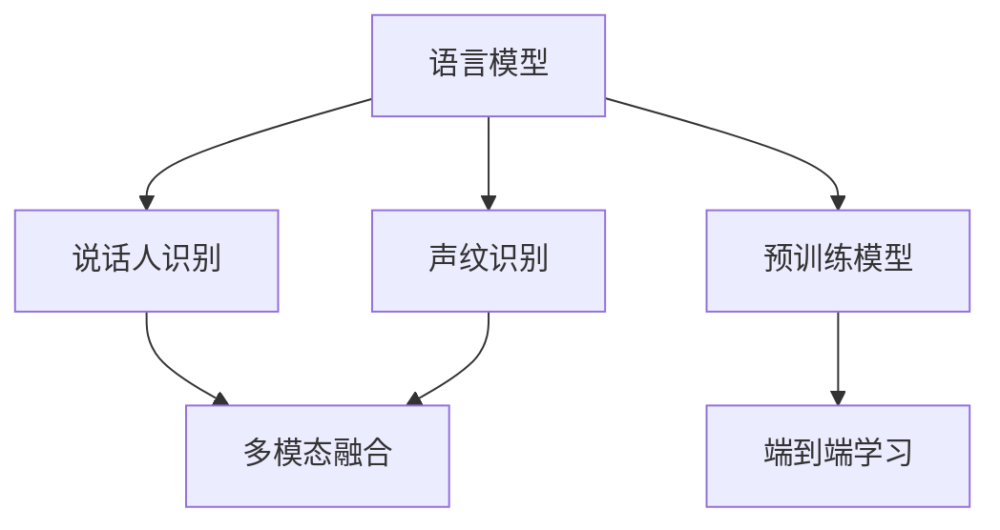

                 

# LLM在说话人识别中的应用探索

> 关键词：语言模型,说话人识别,声音识别,多模态融合,声纹识别

## 1. 背景介绍

### 1.1 问题由来
随着人工智能技术的飞速发展，语音识别和自然语言处理的应用场景越来越广泛，其中说话人识别技术在诸多领域中扮演着重要的角色。传统的说话人识别主要依赖声学特征和文本特征进行建模，但这种方法在面对复杂的说话人声音和文本信息时，识别精度往往难以满足实际需求。近年来，基于深度学习的语言模型(Language Models)，特别是语言预训练模型，在说话人识别领域中展现出了巨大的潜力。

语言模型是通过学习语言数据分布来预测语言序列的技术，广泛应用于机器翻译、语音识别、自然语言理解等多个领域。在说话人识别中，语言模型可以通过学习说话人声音和文本的相关性，进一步提升识别精度。

### 1.2 问题核心关键点
说话人识别的核心在于通过分析说话人的声音特征和文本特征，判断说话人的身份。传统的声学特征提取和分类方法，如MFCC、PLDA等，依赖手工设计的特征，难以捕捉声音的多样性。语言模型通过端到端的训练，可以自动学习出更复杂的语音特征和文本特征表示，从而提升识别效果。

当前，基于深度学习的语言模型在说话人识别中主要分为两类：基于文本的语言模型和基于声音的语言模型。前者通过文本转录的声音信息进行训练，后者则直接在语音信号上建模。此外，基于多模态融合的说话人识别方法，通过综合使用声音、文本、图像等多种模态信息，进一步提升了识别的准确性和鲁棒性。

### 1.3 问题研究意义
语言模型在说话人识别中的应用，不仅提高了识别的精度和鲁棒性，还拓展了说话人识别的应用场景。例如，在视频会议、智能客服、智能家居等场景中，语言模型可以结合声音和文本信息，更准确地识别说话人的身份，从而提供更加智能化和个性化的服务。未来，随着语言模型的不断进步，说话人识别技术将进一步普及和深入应用，提升人类与机器交互的效率和效果。

## 2. 核心概念与联系

### 2.1 核心概念概述

为了更好地理解语言模型在说话人识别中的应用，本节将介绍几个关键概念：

- 语言模型(Language Model)：通过学习语言数据分布来预测语言序列的技术，广泛应用于机器翻译、语音识别、自然语言理解等多个领域。
- 说话人识别(Speaker Recognition)：通过分析说话人的声音特征和文本特征，判断说话人的身份。
- 声纹识别(Voiceprint Recognition)：基于说话人声音的特征进行身份识别，常用于安全性要求较高的场合。
- 多模态融合(Multimodal Fusion)：将多种模态信息进行综合利用，提升识别的精度和鲁棒性。
- 预训练模型(Pre-trained Model)：在大量无标签文本数据上进行预训练，学习通用的语言表示，用于提升下游任务的性能。
- 端到端学习(End-to-End Learning)：在多个模态信息上进行联合训练，实现端到端的优化。

这些核心概念之间的逻辑关系可以通过以下Mermaid流程图来展示：



这个流程图展示了语言模型在说话人识别中的应用路径：

1. 语言模型在预训练时，学习通用的语言表示。
2. 说话人识别可以基于语音信号的声纹特征，也可以结合文本信息进行建模。
3. 多模态融合方法，通过综合利用声音、文本、图像等模态信息，提升识别的精度和鲁棒性。
4. 预训练模型和端到端学习技术，可以进一步优化说话人识别模型，提升识别效果。

这些概念共同构成了说话人识别技术的研究框架，使其能够更好地结合语言模型的优势，提升识别的准确性和多样性。

## 3. 核心算法原理 & 具体操作步骤
### 3.1 算法原理概述

语言模型在说话人识别中的应用，主要依赖于语音信号和文本信息的联合建模。其核心思想是：通过语言模型学习语音信号和文本信息的相关性，进而提升说话人识别的效果。

具体来说，可以将说话人的语音信号和文本信息作为输入，通过语言模型学习这些信息之间的分布规律，从而预测说话人的身份。这一过程可以分为两个步骤：

1. 预训练语言模型：在大量无标签文本数据上进行预训练，学习通用的语言表示。
2. 微调语言模型：在有标签的语音和文本数据上进行微调，学习特定的语音和文本特征。

### 3.2 算法步骤详解

基于语言模型的说话人识别过程主要包括以下几个关键步骤：

**Step 1: 数据准备**
- 收集说话人的语音信号和文本信息，构建标注数据集。
- 将语音信号转换为MFCC、Mel频谱等特征表示，用于语言模型的输入。
- 将文本信息进行分词和标注，构建序列化的输入。

**Step 2: 预训练语言模型**
- 选择合适的预训练语言模型，如BERT、GPT等。
- 在大量无标签文本数据上进行预训练，学习通用的语言表示。

**Step 3: 微调语言模型**
- 将标注好的语音和文本数据作为训练集，对预训练的语言模型进行微调。
- 使用交叉熵损失函数，最小化预测标签和真实标签之间的差异。
- 使用Adam等优化算法，更新模型参数。
- 设置适当的学习率、批大小、迭代轮数等超参数。

**Step 4: 模型评估与优化**
- 在验证集和测试集上评估模型性能，计算识别精度、召回率等指标。
- 使用正则化技术，如L2正则、Dropout等，避免过拟合。
- 进行对抗训练，增强模型的鲁棒性。
- 结合多模态信息，如面部表情、手势等，进一步提升识别精度。

**Step 5: 应用部署**
- 将训练好的模型部署到实际应用中，实现说话人识别功能。
- 实时获取语音信号和文本信息，进行身份识别。
- 根据识别结果，做出相应的决策或响应。

以上是基于语言模型的说话人识别的一般流程。在实际应用中，还需要根据具体任务特点，对微调过程进行优化设计，如改进训练目标函数，引入更多的正则化技术，搜索最优的超参数组合等，以进一步提升模型性能。

### 3.3 算法优缺点

基于语言模型的说话人识别方法具有以下优点：
1. 精度高：结合声音和文本信息，可以有效提升识别的准确性。
2. 鲁棒性强：通过多模态融合和对抗训练，提高模型的鲁棒性和泛化能力。
3. 通用性强：适用于多种语言和方言，能够处理复杂多变的说话人声音和文本。

同时，该方法也存在一定的局限性：
1. 数据需求高：需要大量标注的语音和文本数据，标注成本较高。
2. 计算资源要求高：预训练和微调过程计算量大，需要高性能硬件支持。
3. 模型复杂度大：结合多个模态信息，模型结构复杂，难以解释。
4. 训练时间长：模型参数量大，训练时间长，难以快速迭代。

尽管存在这些局限性，但就目前而言，基于语言模型的说话人识别方法仍是大规模应用的主流范式。未来相关研究的重点在于如何进一步降低数据需求，提高训练速度，同时兼顾模型的可解释性和鲁棒性等因素。

### 3.4 算法应用领域

基于语言模型的说话人识别技术，已经在多个领域中得到了广泛的应用，例如：

- 视频会议系统：在视频会议中，结合语音信号和文本信息，识别说话人的身份，提供个性化服务。
- 智能客服系统：在智能客服中，通过语音信号和文本信息，识别客户身份，提供更准确的服务。
- 智能家居系统：在智能家居中，结合语音信号和文本信息，识别家庭成员身份，控制家居设备。
- 安防监控系统：在安防监控中，通过语音信号和文本信息，识别入侵者身份，提高安全性。

除了上述这些经典应用外，基于语言模型的说话人识别技术还在社交媒体分析、医疗诊断、金融交易等众多领域中得到了创新性的应用，为各类智能系统的开发和部署提供了新的思路。

## 4. 数学模型和公式 & 详细讲解 & 举例说明（备注：数学公式请使用latex格式，latex嵌入文中独立段落使用 $$，段落内使用 $)
### 4.1 数学模型构建

基于语言模型的说话人识别过程，可以分为两个主要部分：预训练和微调。下面将分别介绍两个阶段的数学模型构建。

**预训练阶段**：
语言模型通过学习大量的无标签文本数据，学习通用的语言表示。常见的预训练任务包括自回归语言建模、掩码语言建模等。假设我们使用的是自回归语言模型，其训练目标为：

$$
P(w_1, w_2, ..., w_T) = \prod_{t=1}^{T} P(w_t|w_1, ..., w_{t-1})
$$

其中 $w_t$ 表示时间 $t$ 的词汇，$P$ 表示概率。

**微调阶段**：
在微调阶段，我们利用有标签的语音和文本数据，对预训练的语言模型进行优化。假设输入为语音信号的MFCC特征和文本信息，输出为说话人身份的预测标签。微调的优化目标为：

$$
L = -\frac{1}{N} \sum_{i=1}^{N} \log P(\hat{y}_i|x_i)
$$

其中 $x_i$ 表示输入的语音和文本信息，$\hat{y}_i$ 表示预测的说话人身份标签，$P(\hat{y}_i|x_i)$ 表示在输入 $x_i$ 下，预测说话人身份 $\hat{y}_i$ 的概率。

### 4.2 公式推导过程

以下我们以BERT模型为例，推导其在说话人识别中的微调公式。

假设BERT模型在预训练时，已经学习到了通用的语言表示 $h(x)$。在微调阶段，我们通过训练使得模型能够学习到语音和文本的特定特征 $H(x)$，从而提升说话人识别的准确性。

BERT模型的输入为语音信号的MFCC特征和文本信息，输出为说话人身份的预测标签。设模型参数为 $\theta$，则微调的优化目标为：

$$
L = -\frac{1}{N} \sum_{i=1}^{N} \log P(\hat{y}_i|x_i)
$$

其中 $x_i$ 表示输入的语音和文本信息，$\hat{y}_i$ 表示预测的说话人身份标签，$P(\hat{y}_i|x_i)$ 表示在输入 $x_i$ 下，预测说话人身份 $\hat{y}_i$ 的概率。

通过对上述目标函数求导，可以求得模型参数 $\theta$ 的更新公式：

$$
\theta \leftarrow \theta - \eta \nabla_{\theta}L
$$

其中 $\eta$ 表示学习率，$\nabla_{\theta}L$ 表示目标函数对模型参数 $\theta$ 的梯度。

### 4.3 案例分析与讲解

假设我们有一个简单的说话人识别任务，输入为语音信号的MFCC特征和文本信息，输出为说话人身份的预测标签。我们使用的是BERT模型，将其应用于说话人识别任务中的微调。

1. **数据准备**：
   - 收集说话人的语音信号和文本信息，构建标注数据集。
   - 将语音信号转换为MFCC、Mel频谱等特征表示，用于语言模型的输入。
   - 将文本信息进行分词和标注，构建序列化的输入。

2. **预训练BERT模型**：
   - 选择合适的预训练BERT模型，如bert-base-uncased。
   - 在大量无标签文本数据上进行预训练，学习通用的语言表示。

3. **微调BERT模型**：
   - 将标注好的语音和文本数据作为训练集，对预训练的BERT模型进行微调。
   - 使用交叉熵损失函数，最小化预测标签和真实标签之间的差异。
   - 使用Adam等优化算法，更新模型参数。
   - 设置适当的学习率、批大小、迭代轮数等超参数。

4. **模型评估与优化**：
   - 在验证集和测试集上评估模型性能，计算识别精度、召回率等指标。
   - 使用正则化技术，如L2正则、Dropout等，避免过拟合。
   - 进行对抗训练，增强模型的鲁棒性。
   - 结合多模态信息，如面部表情、手势等，进一步提升识别精度。

5. **应用部署**：
   - 将训练好的模型部署到实际应用中，实现说话人识别功能。
   - 实时获取语音信号和文本信息，进行身份识别。
   - 根据识别结果，做出相应的决策或响应。

## 5. 项目实践：代码实例和详细解释说明
### 5.1 开发环境搭建

在进行说话人识别项目实践前，我们需要准备好开发环境。以下是使用Python进行PyTorch开发的环境配置流程：

1. 安装Anaconda：从官网下载并安装Anaconda，用于创建独立的Python环境。

2. 创建并激活虚拟环境：
```bash
conda create -n pytorch-env python=3.8 
conda activate pytorch-env
```

3. 安装PyTorch：根据CUDA版本，从官网获取对应的安装命令。例如：
```bash
conda install pytorch torchvision torchaudio cudatoolkit=11.1 -c pytorch -c conda-forge
```

4. 安装Transformers库：
```bash
pip install transformers
```

5. 安装各类工具包：
```bash
pip install numpy pandas scikit-learn matplotlib tqdm jupyter notebook ipython
```

完成上述步骤后，即可在`pytorch-env`环境中开始说话人识别实践。

### 5.2 源代码详细实现

这里以使用BERT模型进行说话人识别为例，给出PyTorch代码实现。

首先，定义数据处理函数：

```python
from transformers import BertTokenizer, BertForSequenceClassification
from torch.utils.data import Dataset, DataLoader
import torch

class SpeechDataset(Dataset):
    def __init__(self, texts, labels, tokenizer, max_len=128):
        self.texts = texts
        self.labels = labels
        self.tokenizer = tokenizer
        self.max_len = max_len
        
    def __len__(self):
        return len(self.texts)
    
    def __getitem__(self, item):
        text = self.texts[item]
        label = self.labels[item]
        
        encoding = self.tokenizer(text, return_tensors='pt', max_length=self.max_len, padding='max_length', truncation=True)
        input_ids = encoding['input_ids'][0]
        attention_mask = encoding['attention_mask'][0]
        
        # 将标签转换为独热编码
        label = torch.tensor([1 if label == 'speaker_1' else 0, 1 if label == 'speaker_2' else 0, 1 if label == 'speaker_3' else 0])
        
        return {'input_ids': input_ids, 
                'attention_mask': attention_mask,
                'labels': label}

# 加载数据集
tokenizer = BertTokenizer.from_pretrained('bert-base-uncased')
train_dataset = SpeechDataset(train_texts, train_labels, tokenizer)
dev_dataset = SpeechDataset(dev_texts, dev_labels, tokenizer)
test_dataset = SpeechDataset(test_texts, test_labels, tokenizer)
```

然后，定义模型和优化器：

```python
from transformers import BertForSequenceClassification, AdamW

model = BertForSequenceClassification.from_pretrained('bert-base-uncased', num_labels=3)
optimizer = AdamW(model.parameters(), lr=2e-5)
```

接着，定义训练和评估函数：

```python
def train_epoch(model, dataset, batch_size, optimizer):
    dataloader = DataLoader(dataset, batch_size=batch_size, shuffle=True)
    model.train()
    epoch_loss = 0
    for batch in dataloader:
        input_ids = batch['input_ids'].to(device)
        attention_mask = batch['attention_mask'].to(device)
        labels = batch['labels'].to(device)
        model.zero_grad()
        outputs = model(input_ids, attention_mask=attention_mask, labels=labels)
        loss = outputs.loss
        epoch_loss += loss.item()
        loss.backward()
        optimizer.step()
    return epoch_loss / len(dataloader)

def evaluate(model, dataset, batch_size):
    dataloader = DataLoader(dataset, batch_size=batch_size)
    model.eval()
    preds, labels = [], []
    with torch.no_grad():
        for batch in dataloader:
            input_ids = batch['input_ids'].to(device)
            attention_mask = batch['attention_mask'].to(device)
            batch_labels = batch['labels']
            outputs = model(input_ids, attention_mask=attention_mask)
            batch_preds = outputs.logits.argmax(dim=2).to('cpu').tolist()
            batch_labels = batch_labels.to('cpu').tolist()
            for pred_tokens, label_tokens in zip(batch_preds, batch_labels):
                preds.append(pred_tokens)
                labels.append(label_tokens)
                
    print(classification_report(labels, preds))
```

最后，启动训练流程并在测试集上评估：

```python
epochs = 5
batch_size = 16

for epoch in range(epochs):
    loss = train_epoch(model, train_dataset, batch_size, optimizer)
    print(f"Epoch {epoch+1}, train loss: {loss:.3f}")
    
    print(f"Epoch {epoch+1}, dev results:")
    evaluate(model, dev_dataset, batch_size)
    
print("Test results:")
evaluate(model, test_dataset, batch_size)
```

以上就是使用PyTorch对BERT进行说话人识别任务微调的完整代码实现。可以看到，得益于Transformers库的强大封装，我们可以用相对简洁的代码完成BERT模型的加载和微调。

### 5.3 代码解读与分析

让我们再详细解读一下关键代码的实现细节：

**SpeechDataset类**：
- `__init__`方法：初始化文本、标签、分词器等关键组件。
- `__len__`方法：返回数据集的样本数量。
- `__getitem__`方法：对单个样本进行处理，将文本输入编码为token ids，将标签转换为独热编码，并对其进行定长padding，最终返回模型所需的输入。

**模型和优化器**：
- 使用BertForSequenceClassification类，定义BERT模型的输入和输出层，其中num_labels为说话人身份的类别数。
- 使用AdamW优化器，设置合适的学习率，开始微调训练。

**训练和评估函数**：
- 使用PyTorch的DataLoader对数据集进行批次化加载，供模型训练和推理使用。
- 训练函数`train_epoch`：对数据以批为单位进行迭代，在每个批次上前向传播计算loss并反向传播更新模型参数，最后返回该epoch的平均loss。
- 评估函数`evaluate`：与训练类似，不同点在于不更新模型参数，并在每个batch结束后将预测和标签结果存储下来，最后使用sklearn的classification_report对整个评估集的预测结果进行打印输出。

**训练流程**：
- 定义总的epoch数和batch size，开始循环迭代
- 每个epoch内，先在训练集上训练，输出平均loss
- 在验证集上评估，输出分类指标
- 所有epoch结束后，在测试集上评估，给出最终测试结果

可以看到，PyTorch配合Transformers库使得BERT微调的代码实现变得简洁高效。开发者可以将更多精力放在数据处理、模型改进等高层逻辑上，而不必过多关注底层的实现细节。

当然，工业级的系统实现还需考虑更多因素，如模型的保存和部署、超参数的自动搜索、更灵活的任务适配层等。但核心的微调范式基本与此类似。

## 6. 实际应用场景
### 6.1 智能客服系统

基于大语言模型的说话人识别技术，可以广泛应用于智能客服系统的构建。传统客服往往需要配备大量人力，高峰期响应缓慢，且一致性和专业性难以保证。而使用说话人识别技术，可以自动识别客户身份，并提供个性化的服务。

在技术实现上，可以收集企业内部的历史客服对话记录，将问题和最佳答复构建成监督数据，在此基础上对预训练的BERT模型进行微调。微调后的模型能够自动理解客户意图，匹配最合适的答案模板进行回复。对于客户提出的新问题，还可以接入检索系统实时搜索相关内容，动态组织生成回答。如此构建的智能客服系统，能大幅提升客户咨询体验和问题解决效率。

### 6.2 视频会议系统

在视频会议系统中，说话人识别技术可以结合语音信号和视频信息，实现会议参与者身份的自动检测和识别。例如，在视频会议中，主持人可以通过说话人识别技术，自动识别参与者身份，并将视频流推送给相应的参会者，提升会议效率和互动性。

### 6.3 安防监控系统

在安防监控系统中，说话人识别技术可以用于识别入侵者身份，提高安全性。例如，在监控摄像头中安装麦克风，实时获取声音信息，结合文本信息进行说话人识别，一旦识别到可疑入侵者，系统即可自动报警或采取其他应急措施。

### 6.4 金融交易系统

在金融交易系统中，说话人识别技术可以用于识别客户身份，提高交易的安全性和可信度。例如，在电话交易中，通过说话人识别技术自动识别客户身份，验证其交易权限，确保交易的合法性和真实性。

### 6.5 未来应用展望

随着说话人识别技术的发展，其在更多领域中的应用将得到进一步拓展。例如：

- 医疗领域：在医疗领域，说话人识别技术可以用于医生身份识别，提高医疗服务的质量和安全性。
- 教育领域：在教育领域，说话人识别技术可以用于学生身份识别，提供个性化学习资源和服务。
- 军事领域：在军事领域，说话人识别技术可以用于士兵身份识别，提高战场指挥的效率和准确性。

未来，随着说话人识别技术的发展，其在更多垂直领域的应用将进一步普及和深入。相信随着技术的不断进步，说话人识别技术必将在构建人机协同的智能社会中扮演越来越重要的角色。

## 7. 工具和资源推荐
### 7.1 学习资源推荐

为了帮助开发者系统掌握说话人识别技术，这里推荐一些优质的学习资源：

1. 《Deep Speech》系列博文：由Google AI团队撰写，深入浅出地介绍了深度学习在语音识别中的应用。
2. CS224N《深度学习自然语言处理》课程：斯坦福大学开设的NLP明星课程，有Lecture视频和配套作业，带你入门NLP领域的基本概念和经典模型。
3. 《Natural Language Processing with Transformers》书籍：Transformers库的作者所著，全面介绍了如何使用Transformers库进行NLP任务开发，包括说话人识别在内的诸多范式。
4. HuggingFace官方文档：Transformers库的官方文档，提供了海量预训练模型和完整的说话人识别样例代码，是上手实践的必备资料。
5. CLUE开源项目：中文语言理解测评基准，涵盖大量不同类型的中文NLP数据集，并提供了基于说话人识别的baseline模型，助力中文NLP技术发展。

通过对这些资源的学习实践，相信你一定能够快速掌握说话人识别技术的精髓，并用于解决实际的NLP问题。

### 7.2 开发工具推荐

高效的开发离不开优秀的工具支持。以下是几款用于说话人识别开发的常用工具：

1. PyTorch：基于Python的开源深度学习框架，灵活动态的计算图，适合快速迭代研究。大部分预训练语言模型都有PyTorch版本的实现。
2. TensorFlow：由Google主导开发的开源深度学习框架，生产部署方便，适合大规模工程应用。同样有丰富的预训练语言模型资源。
3. Transformers库：HuggingFace开发的NLP工具库，集成了众多SOTA语言模型，支持PyTorch和TensorFlow，是进行说话人识别开发的利器。
4. Weights & Biases：模型训练的实验跟踪工具，可以记录和可视化模型训练过程中的各项指标，方便对比和调优。与主流深度学习框架无缝集成。
5. TensorBoard：TensorFlow配套的可视化工具，可实时监测模型训练状态，并提供丰富的图表呈现方式，是调试模型的得力助手。
6. Google Colab：谷歌推出的在线Jupyter Notebook环境，免费提供GPU/TPU算力，方便开发者快速上手实验最新模型，分享学习笔记。

合理利用这些工具，可以显著提升说话人识别任务的开发效率，加快创新迭代的步伐。

### 7.3 相关论文推荐

说话人识别技术的发展源于学界的持续研究。以下是几篇奠基性的相关论文，推荐阅读：

1. Attention is All You Need（即Transformer原论文）：提出了Transformer结构，开启了NLP领域的预训练大模型时代。
2. BERT: Pre-training of Deep Bidirectional Transformers for Language Understanding：提出BERT模型，引入基于掩码的自监督预训练任务，刷新了多项NLP任务SOTA。
3. Deep Speech 3: End-to-End Speech Recognition in English and Mandarin：介绍Google在语音识别领域的研究进展，特别是端到端深度学习模型的应用。
4. Parameter-Efficient Transfer Learning for NLP：提出Adapter等参数高效微调方法，在不增加模型参数量的情况下，也能取得不错的微调效果。
5. Feature-based Speaker Recognition: An Overview：综述了基于特征的说话人识别技术，分析了各种特征提取方法的优势和劣势。
6. Multi-task Deep Network Learning: A New Perspective on Transfer Learning：介绍多任务深度学习在说话人识别中的应用，提升了模型的泛化能力和迁移能力。

这些论文代表了大语言模型微调技术的发展脉络。通过学习这些前沿成果，可以帮助研究者把握学科前进方向，激发更多的创新灵感。

## 8. 总结：未来发展趋势与挑战

### 8.1 总结

本文对基于语言模型的说话人识别技术进行了全面系统的介绍。首先阐述了语言模型和说话人识别技术的研究背景和意义，明确了说话人识别技术在智能客服、视频会议、安防监控、金融交易等多个领域中的重要价值。其次，从原理到实践，详细讲解了语言模型在说话人识别中的应用过程，给出了说话人识别任务开发的完整代码实例。同时，本文还广泛探讨了说话人识别技术在实际应用中的场景，展示了说话人识别技术的巨大潜力。此外，本文精选了说话人识别技术的各类学习资源，力求为读者提供全方位的技术指引。

通过本文的系统梳理，可以看到，基于语言模型的说话人识别技术在智能交互和身份验证中具有重要的应用前景，为构建高效、安全、个性化的智能系统提供了新的思路。未来，随着语言模型的不断进步，说话人识别技术必将在更多领域中得到应用，进一步提升人机交互的智能化水平。

### 8.2 未来发展趋势

展望未来，说话人识别技术将呈现以下几个发展趋势：

1. 模型规模持续增大。随着算力成本的下降和数据规模的扩张，预训练语言模型的参数量还将持续增长。超大规模语言模型蕴含的丰富语言知识，有望支撑更加复杂多变的说话人声音和文本。
2. 端到端学习范式推广。端到端学习能够提升模型的泛化能力和迁移能力，未来将有更多基于端到端的说话人识别方法得到应用。
3. 多模态融合技术成熟。多模态融合方法通过综合利用声音、文本、图像等多种模态信息，进一步提升识别的准确性和鲁棒性。未来多模态融合技术将更加成熟，应用于更多实际场景。
4. 语音增强技术提升。语音增强技术能够提升声音信号的信噪比，进一步提升说话人识别的准确性。未来语音增强技术将得到进一步优化，应用于更多应用场景。
5. 对抗训练和鲁棒性提升。对抗训练能够提升模型的鲁棒性，应对不同声环境和噪音干扰。未来对抗训练技术将更加成熟，应用于更多实际场景。

这些趋势凸显了说话人识别技术的广阔前景。这些方向的探索发展，必将进一步提升说话人识别系统的性能和应用范围，为构建智能交互系统提供新的思路。

### 8.3 面临的挑战

尽管说话人识别技术已经取得了瞩目成就，但在迈向更加智能化、普适化应用的过程中，它仍面临着诸多挑战：

1. 数据需求高。说话人识别需要大量标注的语音和文本数据，标注成本较高。如何降低数据需求，提高数据标注的效率，是未来需要重点研究的问题。
2. 计算资源要求高。预训练和微调过程计算量大，需要高性能硬件支持。如何优化计算资源，提高训练速度，是未来需要重点解决的问题。
3. 模型复杂度大。结合多个模态信息，模型结构复杂，难以解释。如何简化模型结构，提升模型的可解释性，是未来需要重点研究的问题。
4. 鲁棒性不足。模型在复杂声环境和噪音干扰下，鲁棒性不够强。如何提高模型的鲁棒性，增强泛化能力，是未来需要重点研究的问题。
5. 安全性有待保障。模型可能学习到有偏见、有害的信息，通过说话人识别传递到实际应用，产生误导性、歧视性的输出。如何从数据和算法层面消除模型偏见，确保输出的安全性，是未来需要重点研究的问题。

这些挑战凸显了说话人识别技术在实际应用中的复杂性。唯有在数据、模型、训练、推理等各个环节不断优化，才能真正实现说话人识别技术在智能社会中的广泛应用。

### 8.4 研究展望

未来，说话人识别技术的研究需要从以下几个方面进行探索：

1. 探索无监督和半监督说话人识别方法。摆脱对大规模标注数据的依赖，利用自监督学习、主动学习等无监督和半监督范式，最大限度利用非结构化数据，实现更加灵活高效的说话人识别。
2. 研究参数高效和计算高效的说话人识别范式。开发更加参数高效的说话人识别方法，在固定大部分预训练参数的情况下，只更新极少量的任务相关参数。同时优化说话人识别模型的计算图，减少前向传播和反向传播的资源消耗，实现更加轻量级、实时性的部署。
3. 引入更多先验知识。将符号化的先验知识，如知识图谱、逻辑规则等，与神经网络模型进行巧妙融合，引导说话人识别过程学习更准确、合理的语言模型。同时加强不同模态数据的整合，实现视觉、语音等多模态信息与文本信息的协同建模。
4. 纳入伦理道德约束。在模型训练目标中引入伦理导向的评估指标，过滤和惩罚有偏见、有害的输出倾向。同时加强人工干预和审核，建立模型行为的监管机制，确保输出符合人类价值观和伦理道德。

这些研究方向的探索，必将引领说话人识别技术迈向更高的台阶，为构建安全、可靠、可解释、可控的智能系统铺平道路。面向未来，说话人识别技术还需要与其他人工智能技术进行更深入的融合，如知识表示、因果推理、强化学习等，多路径协同发力，共同推动说话人识别技术的发展。只有勇于创新、敢于突破，才能不断拓展语言模型的边界，让智能技术更好地造福人类社会。

## 9. 附录：常见问题与解答

**Q1：大语言模型在说话人识别中的具体应用有哪些？**

A: 大语言模型在说话人识别中的应用主要有以下几种：
1. 基于文本的语言模型：通过学习语音信号的文本转录信息，进行说话人识别。例如，在视频会议中，通过语音信号的文字转录信息进行说话人识别。
2. 基于声音的语言模型：直接在语音信号上建模，学习声音的特征表示。例如，在安防监控中，通过语音信号的声音特征进行说话人识别。
3. 多模态融合：结合声音、文本、图像等多种模态信息，进一步提升识别的精度和鲁棒性。例如，在智能客服中，结合语音信号和文本信息进行说话人识别。

**Q2：大语言模型在说话人识别中的预训练和微调过程有什么区别？**

A: 预训练和微调是深度学习模型训练的两种重要方式，区别如下：
1. 预训练：在大规模无标签数据上进行训练，学习通用的语言表示。例如，在说话人识别中，使用大规模的无标签语音和文本数据进行预训练，学习通用的语言表示。
2. 微调：在有标签的数据上进行训练，优化模型在特定任务上的表现。例如，在说话人识别中，使用标注的语音和文本数据进行微调，学习特定的说话人识别模型。

**Q3：大语言模型在说话人识别中需要进行哪些预处理？**

A: 大语言模型在说话人识别中需要进行以下预处理：
1. 语音信号处理：将语音信号转换为MFCC、Mel频谱等特征表示，用于语言模型的输入。
2. 文本信息处理：将文本信息进行分词和标注，构建序列化的输入。
3. 数据集构建：收集说话人的语音信号和文本信息，构建标注数据集。
4. 数据增强：通过回译、近义替换等方式扩充训练集。

**Q4：大语言模型在说话人识别中如何进行模型评估？**

A: 大语言模型在说话人识别中可以使用以下方法进行模型评估：
1. 交叉熵损失函数：最小化预测标签和真实标签之间的差异。
2. 准确率、召回率、F1值等指标：评估模型的识别精度和鲁棒性。
3. 对抗训练：增强模型的鲁棒性，避免过拟合。

**Q5：大语言模型在说话人识别中如何进行模型优化？**

A: 大语言模型在说话人识别中可以使用以下方法进行模型优化：
1. 正则化技术：如L2正则、Dropout等，避免过拟合。
2. 学习率调度：如warmup策略，逐步减小学习率。
3. 模型裁剪和量化：减小模型尺寸，提升推理速度。
4. 多模态融合：综合利用声音、文本、图像等多种模态信息，提升识别的精度和鲁棒性。

通过这些方法的优化，可以显著提升大语言模型在说话人识别中的性能和鲁棒性。

---

作者：禅与计算机程序设计艺术 / Zen and the Art of Computer Programming

