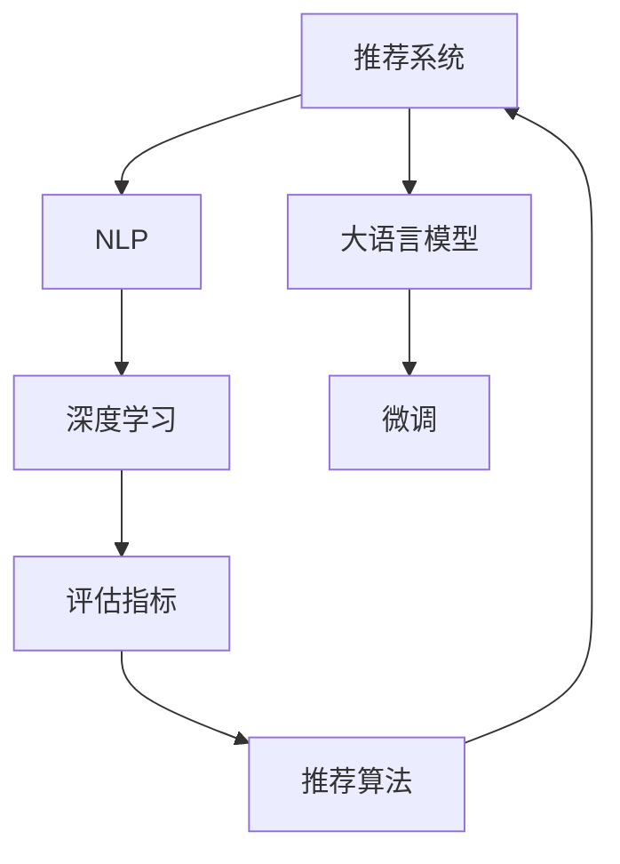

                 

# 大语言模型对推荐系统评估指标的影响

> 关键词：推荐系统, 大语言模型, 自然语言处理(NLP), 评估指标, 推荐算法, 深度学习

## 1. 背景介绍

### 1.1 问题由来
随着人工智能技术的迅猛发展，推荐系统（Recommendation Systems）在电商、视频、社交媒体等领域发挥着越来越重要的作用。传统推荐系统依赖于用户的历史行为数据，通过协同过滤、内容推荐、混合推荐等算法，为用户推荐个性化内容。然而，由于数据稀疏性、冷启动、多样性平衡等问题，推荐系统的效果往往不尽如人意。

大语言模型（Large Language Models, LLMs）如GPT、BERT等近年来在自然语言处理（Natural Language Processing, NLP）领域取得了突破性进展。这些模型通过大规模无监督预训练，学习到丰富的语言知识，并能在任务中通过微调进行适配。大语言模型在推荐系统中的应用引起了广泛关注，如何利用大语言模型提升推荐系统的评估指标成为了研究热点。

### 1.2 问题核心关键点
本节将详细介绍大语言模型对推荐系统评估指标的影响，并分析在微调过程中可能面临的关键问题。

## 2. 核心概念与联系

### 2.1 核心概念概述

为更好地理解大语言模型在推荐系统中的应用，本节将介绍几个密切相关的核心概念：

- 推荐系统（Recommendation Systems）：通过分析用户的历史行为数据，为用户推荐个性化内容的系统。推荐系统分为基于内容的推荐、协同过滤推荐、混合推荐等多种类型。

- 大语言模型（LLMs）：如GPT、BERT等大规模预训练语言模型。通过在大规模无标签文本语料上进行预训练，学习到丰富的语言知识和常识。

- 自然语言处理（NLP）：研究计算机如何理解和生成人类语言的技术，包括词向量、语言模型、文本分类、命名实体识别等任务。

- 深度学习（Deep Learning）：通过深度神经网络结构学习复杂非线性关系，广泛应用于图像识别、语音识别、自然语言处理等领域。

- 评估指标（Evaluation Metrics）：用于衡量推荐系统性能的各类指标，如准确率、召回率、F1分数、用户满意度、点击率等。

- 微调（Fine-Tuning）：在预训练模型的基础上，使用下游任务的少量标注数据进行优化，以适应特定任务。

- 推荐算法（Recommendation Algorithms）：包括基于协同过滤、内容推荐、混合推荐等算法。

这些核心概念之间的逻辑关系可以通过以下Mermaid流程图来展示：



这个流程图展示了推荐系统、大语言模型、NLP、深度学习、评估指标、微调和推荐算法之间的相互关系。

## 3. 核心算法原理 & 具体操作步骤
### 3.1 算法原理概述

大语言模型在推荐系统中的应用，主要依赖于其强大的语言理解和生成能力。通过微调，大语言模型可以学习特定推荐任务中的用户描述、商品描述、行为数据等文本信息，从而为推荐系统提供更加丰富的语义信息。

大语言模型对推荐系统的贡献主要体现在以下几个方面：

- 用户描述生成：大语言模型可以生成用户描述，用于描述用户的兴趣、需求、偏好等，从而为推荐系统提供更为全面和个性化的推荐。
- 商品描述生成：大语言模型可以生成商品描述，用于描述商品的属性、功能、特点等，从而为推荐系统提供更加精准和详细的商品信息。
- 行为数据分析：大语言模型可以分析用户的行为数据，生成自然语言描述，用于描述用户的购买历史、浏览记录、评分信息等，从而为推荐系统提供更加细致和深入的用户行为特征。
- 多样化推荐：大语言模型可以生成多种语言和风格的推荐结果，用于提升推荐系统的多样性和吸引力。

### 3.2 算法步骤详解

基于大语言模型进行推荐系统微调的一般流程如下：

**Step 1: 准备数据集和模型**

- 收集用户的历史行为数据和商品属性数据，将其转换为文本形式。
- 选择合适的预训练语言模型，如BERT、GPT等，作为微调的基础模型。
- 准备微调所需的少量标注数据，用于优化模型参数。

**Step 2: 设计任务适配层**

- 根据推荐系统的需求，设计适合的任务适配层。例如，对于推荐系统中的文本分类任务，可以设计一个分类层，用于将商品描述分类为不同的类别。
- 选择合适的损失函数，如交叉熵损失、均方误差损失等。

**Step 3: 设置微调超参数**

- 选择合适的优化算法及其参数，如AdamW、SGD等，设置学习率、批大小、迭代轮数等。
- 设置正则化技术及强度，包括权重衰减、Dropout、Early Stopping等。
- 确定冻结预训练参数的策略，如仅微调顶层，或全部参数都参与微调。

**Step 4: 执行梯度训练**

- 将训练集数据分批次输入模型，前向传播计算损失函数。
- 反向传播计算参数梯度，根据设定的优化算法和学习率更新模型参数。
- 周期性在验证集上评估模型性能，根据性能指标决定是否触发Early Stopping。
- 重复上述步骤直到满足预设的迭代轮数或Early Stopping条件。

**Step 5: 测试和部署**

- 在测试集上评估微调后模型性能，对比微调前后的指标变化。
- 使用微调后的模型进行推荐，集成到实际的应用系统中。
- 持续收集新的数据，定期重新微调模型，以适应数据分布的变化。

### 3.3 算法优缺点

基于大语言模型进行推荐系统微调的方法具有以下优点：

- 简单高效：只需要准备少量的标注数据，即可对预训练模型进行快速适配，获得较好的效果。
- 灵活性高：可以根据不同的推荐任务需求，设计不同的任务适配层，适用于多种推荐场景。
- 数据泛化能力：大语言模型具有较强的泛化能力，能够从少量的数据中学习到推荐系统的通用规律。

同时，该方法也存在一些局限性：

- 标注数据依赖：微调的效果很大程度上取决于标注数据的质量和数量，获取高质量标注数据的成本较高。
- 模型复杂性：大语言模型具有大量的参数，增加了模型的复杂性和计算负担。
- 可解释性不足：微调模型的决策过程通常缺乏可解释性，难以对其推理逻辑进行分析和调试。
- 对抗性脆弱：微调模型可能对对抗性样本敏感，容易受到输入噪声的干扰。

### 3.4 算法应用领域

大语言模型在推荐系统中的应用已经得到了广泛的研究和应用。以下列举几个典型应用领域：

- 电商推荐：通过微调大语言模型，生成用户描述和商品描述，用于电商推荐系统中的个性化推荐。
- 视频推荐：通过微调大语言模型，生成视频描述和用户描述，用于视频推荐系统中的推荐。
- 新闻推荐：通过微调大语言模型，生成新闻描述和用户描述，用于新闻推荐系统中的个性化推荐。
- 社交媒体推荐：通过微调大语言模型，生成用户描述和内容描述，用于社交媒体推荐系统中的推荐。

除了上述几个领域，大语言模型还被应用于更多场景中，如知识图谱推荐、兴趣图谱推荐等，为推荐系统带来了全新的突破。

## 4. 数学模型和公式 & 详细讲解 & 举例说明

### 4.1 数学模型构建

假设推荐系统中有$M$个用户和$N$个商品，用户的评分数据为$R \in \mathbb{R}^{M \times N}$，商品的属性向量为$X \in \mathbb{R}^{N \times d}$，用户的描述向量为$U \in \mathbb{R}^{M \times d}$。大语言模型在微调过程中，可以通过多任务学习（Multi-task Learning）的方式，同时学习用户描述生成、商品描述生成和行为数据分析等多个任务。

- 用户描述生成任务：$\hat{U} = f_{U}(X, R)$，其中$f_{U}$为生成用户描述的函数。
- 商品描述生成任务：$\hat{X} = f_{X}(R, U)$，其中$f_{X}$为生成商品描述的函数。
- 行为数据分析任务：$\hat{R} = f_{R}(X, U)$，其中$f_{R}$为分析用户行为数据的函数。

在微调过程中，可以通过最小化以下目标函数：

$$
\min_{\theta} \frac{1}{N} \sum_{i=1}^M \left[ \ell_{U}(U_i, \hat{U}_i) + \ell_{X}(X_i, \hat{X}_i) + \ell_{R}(R_i, \hat{R}_i) \right]
$$

其中，$\ell_{U}$、$\ell_{X}$和$\ell_{R}$分别为用户描述生成任务、商品描述生成任务和行为数据分析任务的损失函数。

### 4.2 公式推导过程

以用户描述生成任务为例，我们可以使用BERT作为基础模型进行微调。假设用户描述生成的任务是一个二分类任务，即判断用户描述是否与商品描述匹配。在微调过程中，可以通过最小化交叉熵损失函数进行优化：

$$
\ell_{U}(U_i, \hat{U}_i) = - \frac{1}{m} \sum_{j=1}^m [y_{ij} \log \hat{y}_{ij} + (1-y_{ij}) \log (1-\hat{y}_{ij})]
$$

其中，$y_{ij}$为样本$j$在用户$i$的描述是否匹配商品描述的二元标签，$\hat{y}_{ij}$为大语言模型预测的匹配概率，$m$为样本数量。

在得到损失函数后，我们可以使用AdamW优化算法进行模型训练：

$$
\theta \leftarrow \theta - \eta \nabla_{\theta} \ell_{U}(U_i, \hat{U}_i) - \eta\lambda\theta
$$

其中，$\eta$为学习率，$\lambda$为正则化系数，$\nabla_{\theta} \ell_{U}(U_i, \hat{U}_i)$为损失函数对模型参数$\theta$的梯度。

### 4.3 案例分析与讲解

以用户描述生成任务为例，假设我们有一批用户的商品描述和行为数据，需要将这些数据转换为文本形式，输入大语言模型中进行微调。以下是一个简单的代码实现示例：

```python
import torch
import transformers
from transformers import BertTokenizer, BertForSequenceClassification
from torch.utils.data import Dataset, DataLoader

# 定义数据集
class UserDescribeDataset(Dataset):
    def __init__(self, descriptions, labels, tokenizer):
        self.descriptions = descriptions
        self.labels = labels
        self.tokenizer = tokenizer

    def __len__(self):
        return len(self.descriptions)

    def __getitem__(self, item):
        description = self.descriptions[item]
        label = self.labels[item]
        
        encoding = self.tokenizer(description, return_tensors='pt')
        input_ids = encoding['input_ids']
        attention_mask = encoding['attention_mask']
        
        return {
            'input_ids': input_ids,
            'attention_mask': attention_mask,
            'labels': torch.tensor(label, dtype=torch.long)
        }

# 初始化数据集和模型
tokenizer = BertTokenizer.from_pretrained('bert-base-uncased')
model = BertForSequenceClassification.from_pretrained('bert-base-uncased', num_labels=2)

# 准备数据集
descriptions = ...
labels = ...

dataset = UserDescribeDataset(descriptions, labels, tokenizer)
train_loader = DataLoader(dataset, batch_size=16, shuffle=True)

# 定义损失函数和优化器
criterion = torch.nn.CrossEntropyLoss()
optimizer = torch.optim.AdamW(model.parameters(), lr=2e-5)

# 训练模型
device = torch.device('cuda' if torch.cuda.is_available() else 'cpu')
model.to(device)

for epoch in range(5):
    for batch in train_loader:
        input_ids = batch['input_ids'].to(device)
        attention_mask = batch['attention_mask'].to(device)
        labels = batch['labels'].to(device)
        
        model.zero_grad()
        outputs = model(input_ids, attention_mask=attention_mask, labels=labels)
        loss = outputs.loss
        loss.backward()
        optimizer.step()

# 评估模型
test_dataset = ...
test_loader = DataLoader(test_dataset, batch_size=16, shuffle=False)
model.eval()

test_loss = 0
correct = 0
total = 0
with torch.no_grad():
    for batch in test_loader:
        input_ids = batch['input_ids'].to(device)
        attention_mask = batch['attention_mask'].to(device)
        labels = batch['labels'].to(device)
        
        outputs = model(input_ids, attention_mask=attention_mask)
        _, preds = torch.max(outputs.logits, dim=1)
        test_loss += criterion(outputs.logits, labels).item()
        total += labels.size(0)
        correct += (preds == labels).sum().item()

test_loss /= len(test_loader.dataset)
test_acc = correct / total
print(f'Test Loss: {test_loss:.4f}, Test Acc: {test_acc:.4f}')
```

## 5. 项目实践：代码实例和详细解释说明

### 5.1 开发环境搭建

在进行推荐系统微调实践前，我们需要准备好开发环境。以下是使用Python进行PyTorch开发的环境配置流程：

1. 安装Anaconda：从官网下载并安装Anaconda，用于创建独立的Python环境。

2. 创建并激活虚拟环境：
```bash
conda create -n pytorch-env python=3.8 
conda activate pytorch-env
```

3. 安装PyTorch：根据CUDA版本，从官网获取对应的安装命令。例如：
```bash
conda install pytorch torchvision torchaudio cudatoolkit=11.1 -c pytorch -c conda-forge
```

4. 安装Transformers库：
```bash
pip install transformers
```

5. 安装各类工具包：
```bash
pip install numpy pandas scikit-learn matplotlib tqdm jupyter notebook ipython
```

完成上述步骤后，即可在`pytorch-env`环境中开始微调实践。

### 5.2 源代码详细实现

下面我们以用户描述生成任务为例，给出使用Transformers库对BERT模型进行微调的PyTorch代码实现。

首先，定义数据集处理函数：

```python
from transformers import BertTokenizer
from torch.utils.data import Dataset, DataLoader
import torch

class UserDescribeDataset(Dataset):
    def __init__(self, descriptions, labels, tokenizer, max_len=128):
        self.descriptions = descriptions
        self.labels = labels
        self.tokenizer = tokenizer
        self.max_len = max_len
        
    def __len__(self):
        return len(self.descriptions)
    
    def __getitem__(self, item):
        description = self.descriptions[item]
        label = self.labels[item]
        
        encoding = self.tokenizer(description, return_tensors='pt', max_length=self.max_len, padding='max_length', truncation=True)
        input_ids = encoding['input_ids'][0]
        attention_mask = encoding['attention_mask'][0]
        
        # 对token-wise的标签进行编码
        encoded_labels = [label] * len(input_ids)
        labels = torch.tensor(encoded_labels, dtype=torch.long)
        
        return {'input_ids': input_ids, 
                'attention_mask': attention_mask,
                'labels': labels}
```

然后，定义模型和优化器：

```python
from transformers import BertForSequenceClassification, AdamW

model = BertForSequenceClassification.from_pretrained('bert-base-uncased', num_labels=2)

optimizer = AdamW(model.parameters(), lr=2e-5)
```

接着，定义训练和评估函数：

```python
from tqdm import tqdm
from sklearn.metrics import classification_report

device = torch.device('cuda') if torch.cuda.is_available() else torch.device('cpu')
model.to(device)

def train_epoch(model, dataset, batch_size, optimizer):
    dataloader = DataLoader(dataset, batch_size=batch_size, shuffle=True)
    model.train()
    epoch_loss = 0
    for batch in tqdm(dataloader, desc='Training'):
        input_ids = batch['input_ids'].to(device)
        attention_mask = batch['attention_mask'].to(device)
        labels = batch['labels'].to(device)
        model.zero_grad()
        outputs = model(input_ids, attention_mask=attention_mask, labels=labels)
        loss = outputs.loss
        epoch_loss += loss.item()
        loss.backward()
        optimizer.step()
    return epoch_loss / len(dataloader)

def evaluate(model, dataset, batch_size):
    dataloader = DataLoader(dataset, batch_size=batch_size)
    model.eval()
    preds, labels = [], []
    with torch.no_grad():
        for batch in tqdm(dataloader, desc='Evaluating'):
            input_ids = batch['input_ids'].to(device)
            attention_mask = batch['attention_mask'].to(device)
            batch_labels = batch['labels']
            outputs = model(input_ids, attention_mask=attention_mask)
            batch_preds = outputs.logits.argmax(dim=2).to('cpu').tolist()
            batch_labels = batch_labels.to('cpu').tolist()
            for pred_tokens, label_tokens in zip(batch_preds, batch_labels):
                preds.append(pred_tokens)
                labels.append(label_tokens)
                
    print(classification_report(labels, preds))
```

最后，启动训练流程并在测试集上评估：

```python
epochs = 5
batch_size = 16

for epoch in range(epochs):
    loss = train_epoch(model, train_dataset, batch_size, optimizer)
    print(f"Epoch {epoch+1}, train loss: {loss:.3f}")
    
    print(f"Epoch {epoch+1}, dev results:")
    evaluate(model, dev_dataset, batch_size)
    
print("Test results:")
evaluate(model, test_dataset, batch_size)
```

以上就是使用PyTorch对BERT进行用户描述生成任务微调的完整代码实现。可以看到，得益于Transformers库的强大封装，我们可以用相对简洁的代码完成BERT模型的加载和微调。

### 5.3 代码解读与分析

让我们再详细解读一下关键代码的实现细节：

**UserDescribeDataset类**：
- `__init__`方法：初始化文本、标签、分词器等关键组件。
- `__len__`方法：返回数据集的样本数量。
- `__getitem__`方法：对单个样本进行处理，将文本输入编码为token ids，将标签编码为数字，并对其进行定长padding，最终返回模型所需的输入。

**模型和优化器**：
- `BertForSequenceClassification.from_pretrained()`方法：从预训练的BERT模型中加载一个特定任务的分类模型。
- `AdamW`优化器：一种常用的基于梯度的优化算法，适用于深度学习模型的微调。

**训练和评估函数**：
- 使用PyTorch的DataLoader对数据集进行批次化加载，供模型训练和推理使用。
- `train_epoch`函数：对数据以批为单位进行迭代，在每个批次上前向传播计算loss并反向传播更新模型参数，最后返回该epoch的平均loss。
- `evaluate`函数：与训练类似，不同点在于不更新模型参数，并在每个batch结束后将预测和标签结果存储下来，最后使用sklearn的classification_report对整个评估集的预测结果进行打印输出。

**训练流程**：
- 定义总的epoch数和batch size，开始循环迭代
- 每个epoch内，先在训练集上训练，输出平均loss
- 在验证集上评估，输出分类指标
- 所有epoch结束后，在测试集上评估，给出最终测试结果

可以看到，PyTorch配合Transformers库使得BERT微调的代码实现变得简洁高效。开发者可以将更多精力放在数据处理、模型改进等高层逻辑上，而不必过多关注底层的实现细节。

当然，工业级的系统实现还需考虑更多因素，如模型的保存和部署、超参数的自动搜索、更灵活的任务适配层等。但核心的微调范式基本与此类似。

## 6. 实际应用场景

### 6.1 电商推荐

基于大语言模型进行电商推荐系统微调，可以显著提升推荐的个性化和多样性。通过微调模型生成用户描述和商品描述，可以更好地理解用户需求和商品特性，从而提供更加精准和多样化的推荐结果。例如，某电商平台可以收集用户的历史浏览、购买记录，并使用BERT模型生成用户描述和商品描述，训练出一个基于用户描述和商品描述的推荐系统，从而提升推荐效果和用户满意度。

### 6.2 视频推荐

视频推荐系统也受益于大语言模型的微调。通过微调模型生成视频描述和用户描述，可以更好地理解用户偏好和视频内容，从而提供更加个性化的推荐。例如，某视频平台可以收集用户的观看记录和评分信息，并使用BERT模型生成视频描述和用户描述，训练出一个基于视频描述和用户描述的推荐系统，从而提升推荐效果和用户粘性。

### 6.3 新闻推荐

新闻推荐系统同样可以借助大语言模型进行微调。通过微调模型生成新闻描述和用户描述，可以更好地理解新闻内容用户的兴趣和偏好，从而提供更加精准和个性化的新闻推荐。例如，某新闻网站可以收集用户的浏览记录和点击信息，并使用BERT模型生成新闻描述和用户描述，训练出一个基于新闻描述和用户描述的推荐系统，从而提升推荐效果和用户留存率。

### 6.4 社交媒体推荐

社交媒体推荐系统也受益于大语言模型的微调。通过微调模型生成用户描述和内容描述，可以更好地理解用户的兴趣和社交行为，从而提供更加精准和多样化的推荐。例如，某社交媒体平台可以收集用户的互动记录和内容消费信息，并使用BERT模型生成用户描述和内容描述，训练出一个基于用户描述和内容描述的推荐系统，从而提升推荐效果和用户参与度。

## 7. 工具和资源推荐

### 7.1 学习资源推荐

为了帮助开发者系统掌握大语言模型微调的理论基础和实践技巧，这里推荐一些优质的学习资源：

1. 《Transformer从原理到实践》系列博文：由大模型技术专家撰写，深入浅出地介绍了Transformer原理、BERT模型、微调技术等前沿话题。

2. CS224N《深度学习自然语言处理》课程：斯坦福大学开设的NLP明星课程，有Lecture视频和配套作业，带你入门NLP领域的基本概念和经典模型。

3. 《Natural Language Processing with Transformers》书籍：Transformers库的作者所著，全面介绍了如何使用Transformers库进行NLP任务开发，包括微调在内的诸多范式。

4. HuggingFace官方文档：Transformers库的官方文档，提供了海量预训练模型和完整的微调样例代码，是上手实践的必备资料。

5. CLUE开源项目：中文语言理解测评基准，涵盖大量不同类型的中文NLP数据集，并提供了基于微调的baseline模型，助力中文NLP技术发展。

通过对这些资源的学习实践，相信你一定能够快速掌握大语言模型微调的精髓，并用于解决实际的NLP问题。

### 7.2 开发工具推荐

高效的开发离不开优秀的工具支持。以下是几款用于大语言模型微调开发的常用工具：

1. PyTorch：基于Python的开源深度学习框架，灵活动态的计算图，适合快速迭代研究。大部分预训练语言模型都有PyTorch版本的实现。

2. TensorFlow：由Google主导开发的开源深度学习框架，生产部署方便，适合大规模工程应用。同样有丰富的预训练语言模型资源。

3. Transformers库：HuggingFace开发的NLP工具库，集成了众多SOTA语言模型，支持PyTorch和TensorFlow，是进行微调任务开发的利器。

4. Weights & Biases：模型训练的实验跟踪工具，可以记录和可视化模型训练过程中的各项指标，方便对比和调优。与主流深度学习框架无缝集成。

5. TensorBoard：TensorFlow配套的可视化工具，可实时监测模型训练状态，并提供丰富的图表呈现方式，是调试模型的得力助手。

6. Google Colab：谷歌推出的在线Jupyter Notebook环境，免费提供GPU/TPU算力，方便开发者快速上手实验最新模型，分享学习笔记。

合理利用这些工具，可以显著提升大语言模型微调任务的开发效率，加快创新迭代的步伐。

### 7.3 相关论文推荐

大语言模型和微调技术的发展源于学界的持续研究。以下是几篇奠基性的相关论文，推荐阅读：

1. Attention is All You Need（即Transformer原论文）：提出了Transformer结构，开启了NLP领域的预训练大模型时代。

2. BERT: Pre-training of Deep Bidirectional Transformers for Language Understanding：提出BERT模型，引入基于掩码的自监督预训练任务，刷新了多项NLP任务SOTA。

3. Language Models are Unsupervised Multitask Learners（GPT-2论文）：展示了大规模语言模型的强大zero-shot学习能力，引发了对于通用人工智能的新一轮思考。

4. Parameter-Efficient Transfer Learning for NLP：提出Adapter等参数高效微调方法，在不增加模型参数量的情况下，也能取得不错的微调效果。

5. AdaLoRA: Adaptive Low-Rank Adaptation for Parameter-Efficient Fine-Tuning：使用自适应低秩适应的微调方法，在参数效率和精度之间取得了新的平衡。

这些论文代表了大语言模型微调技术的发展脉络。通过学习这些前沿成果，可以帮助研究者把握学科前进方向，激发更多的创新灵感。

## 8. 总结：未来发展趋势与挑战

### 8.1 总结

本文对基于大语言模型的推荐系统微调方法进行了全面系统的介绍。首先阐述了大语言模型在推荐系统中的应用，明确了微调在提升推荐系统效果方面的独特价值。其次，从原理到实践，详细讲解了微调的理论基础和关键步骤，给出了微调任务开发的完整代码实例。同时，本文还广泛探讨了微调方法在电商、视频、新闻、社交媒体等多个推荐场景中的应用前景，展示了微调范式的巨大潜力。此外，本文精选了微调技术的各类学习资源，力求为读者提供全方位的技术指引。

通过本文的系统梳理，可以看到，基于大语言模型的微调方法在推荐系统中的应用前景广阔，有望大幅提升推荐系统的个性化和多样性，为电商、视频、新闻、社交媒体等领域的数字化转型注入新的动力。未来，伴随大语言模型和微调方法的持续演进，相信推荐系统必将在更加智能化、个性化、可靠化方面取得新的突破。

### 8.2 未来发展趋势

展望未来，大语言模型微调技术将呈现以下几个发展趋势：

1. 模型规模持续增大。随着算力成本的下降和数据规模的扩张，预训练语言模型的参数量还将持续增长。超大规模语言模型蕴含的丰富语言知识，有望支撑更加复杂多变的推荐系统微调。

2. 微调方法日趋多样。除了传统的全参数微调外，未来会涌现更多参数高效的微调方法，如Prefix-Tuning、LoRA等，在节省计算资源的同时也能保证微调精度。

3. 持续学习成为常态。随着数据分布的不断变化，微调模型也需要持续学习新知识以保持性能。如何在不遗忘原有知识的同时，高效吸收新样本信息，将成为重要的研究课题。

4. 标注样本需求降低。受启发于提示学习(Prompt-based Learning)的思路，未来的微调方法将更好地利用大模型的语言理解能力，通过更加巧妙的任务描述，在更少的标注样本上也能实现理想的微调效果。

5. 多模态微调崛起。当前的微调主要聚焦于纯文本数据，未来会进一步拓展到图像、视频、语音等多模态数据微调。多模态信息的融合，将显著提升语言模型对现实世界的理解和建模能力。

6. 模型通用性增强。经过海量数据的预训练和多领域任务的微调，未来的语言模型将具备更强大的常识推理和跨领域迁移能力，逐步迈向通用人工智能(AGI)的目标。

以上趋势凸显了大语言模型微调技术的广阔前景。这些方向的探索发展，必将进一步提升推荐系统的性能和应用范围，为电商、视频、新闻、社交媒体等领域的数字化转型注入新的动力。

### 8.3 面临的挑战

尽管大语言模型微调技术已经取得了瞩目成就，但在迈向更加智能化、普适化应用的过程中，它仍面临着诸多挑战：

1. 标注成本瓶颈。虽然微调大大降低了标注数据的需求，但对于长尾应用场景，难以获得充足的高质量标注数据，成为制约微调性能的瓶颈。如何进一步降低微调对标注样本的依赖，将是一大难题。

2. 模型鲁棒性不足。当前微调模型面对域外数据时，泛化性能往往大打折扣。对于测试样本的微小扰动，微调模型的预测也容易发生波动。如何提高微调模型的鲁棒性，避免灾难性遗忘，还需要更多理论和实践的积累。

3. 推理效率有待提高。大规模语言模型虽然精度高，但在实际部署时往往面临推理速度慢、内存占用大等效率问题。如何在保证性能的同时，简化模型结构，提升推理速度，优化资源占用，将是重要的优化方向。

4. 可解释性亟需加强。当前微调模型更像是"黑盒"系统，难以解释其内部工作机制和决策逻辑。对于医疗、金融等高风险应用，算法的可解释性和可审计性尤为重要。如何赋予微调模型更强的可解释性，将是亟待攻克的难题。

5. 安全性有待保障。预训练语言模型难免会学习到有偏见、有害的信息，通过微调传递到下游任务，产生误导性、歧视性的输出，给实际应用带来安全隐患。如何从数据和算法层面消除模型偏见，避免恶意用途，确保输出的安全性，也将是重要的研究课题。

6. 知识整合能力不足。现有的微调模型往往局限于任务内数据，难以灵活吸收和运用更广泛的先验知识。如何让微调过程更好地与外部知识库、规则库等专家知识结合，形成更加全面、准确的信息整合能力，还有很大的想象空间。

正视微调面临的这些挑战，积极应对并寻求突破，将是大语言模型微调走向成熟的必由之路。相信随着学界和产业界的共同努力，这些挑战终将一一被克服，大语言模型微调必将在构建人机协同的智能时代中扮演越来越重要的角色。

### 8.4 未来突破

面对大语言模型微调所面临的种种挑战，未来的研究需要在以下几个方面寻求新的突破：

1. 探索无监督和半监督微调方法。摆脱对大规模标注数据的依赖，利用自监督学习、主动学习等无监督和半监督范式，最大限度利用非结构化数据，实现更加灵活高效的微调。

2. 研究参数高效和计算高效的微调范式。开发更加参数高效的微调方法，在固定大部分预训练参数的同时，只更新极少量的任务相关参数。同时优化微调模型的计算图，减少前向传播和反向传播的资源消耗，实现更加轻量级、实时性的部署。

3. 融合因果和对比学习范式。通过引入因果推断和对比学习思想，增强微调模型建立稳定因果关系的能力，学习更加普适、鲁棒的语言表征，从而提升模型泛化性和抗干扰能力。

4. 引入更多先验知识。将符号化的先验知识，如知识图谱、逻辑规则等，与神经网络模型进行巧妙融合，引导微调过程学习更准确、合理的语言模型。同时加强不同模态数据的整合，实现视觉、语音等多模态信息与文本信息的协同建模。

5. 结合因果分析和博弈论工具。将因果分析方法引入微调模型，识别出模型决策的关键特征，增强输出解释的因果性和逻辑性。借助博弈论工具刻画人机交互过程，主动探索并规避模型的脆弱点，提高系统稳定性。

6. 纳入伦理道德约束。在模型训练目标中引入伦理导向的评估指标，过滤和惩罚有偏见、有害的输出倾向。同时加强人工干预和审核，建立模型行为的监管机制，确保输出符合人类价值观和伦理道德。

这些研究方向的探索，必将引领大语言模型微调技术迈向更高的台阶，为构建安全、可靠、可解释、可控的智能系统铺平道路。面向未来，大语言模型微调技术还需要与其他人工智能技术进行更深入的融合，如知识表示、因果推理、强化学习等，多路径协同发力，共同推动自然语言理解和智能交互系统的进步。只有勇于创新、敢于突破，才能不断拓展语言模型的边界，让智能技术更好地造福人类社会。

## 9. 附录：常见问题与解答

**Q1：大语言模型微调是否适用于所有推荐系统？**

A: 大语言模型微调在大多数推荐系统上都能取得不错的效果，特别是对于数据量较小的任务。但对于一些特定领域的推荐系统，如医疗、法律等，仅仅依靠通用语料预训练的模型可能难以很好地适应。此时需要在特定领域语料上进一步预训练，再进行微调，才能获得理想效果。此外，对于一些需要时效性、个性化很强的任务，如对话、推荐等，微调方法也需要针对性的改进优化。

**Q2：微调过程中如何选择合适的学习率？**

A: 微调的学习率一般要比预训练时小1-2个数量级，如果使用过大的学习率，容易破坏预训练权重，导致过拟合。一般建议从1e-5开始调参，逐步减小学习率，直至收敛。也可以使用warmup策略，在开始阶段使用较小的学习率，再逐渐过渡到预设值。需要注意的是，不同的优化器(如AdamW、Adafactor等)以及不同的学习率调度策略，可能需要设置不同的学习率阈值。

**Q3：采用大模型微调时会面临哪些资源瓶颈？**

A: 目前主流的预训练大模型动辄以亿计的参数规模，对算力、内存、存储都提出了很高的要求。GPU/TPU等高性能设备是必不可少的，但即便如此，超大批次的训练和推理也可能遇到显存不足的问题。因此需要采用一些资源优化技术，如梯度积累、混合精度训练、模型并行等，来突破硬件瓶颈。同时，模型的存储和读取也可能占用大量时间和空间，需要采用模型压缩、稀疏化存储等方法进行优化。

**Q4：如何缓解微调过程中的过拟合问题？**

A: 过拟合是微调面临的主要挑战，尤其是在标注数据不足的情况下。常见的缓解策略包括：
1. 数据增强：通过回译、近义替换等方式扩充训练集
2. 正则化：使用L2正则、Dropout、Early Stopping等避免过拟合
3. 对抗训练：引入对抗样本，提高模型鲁棒性
4. 参数高效微调：只调整少量参数(如Adapter、Prefix等)，减小过拟合风险
5. 多模型集成：训练多个微调模型，取平均输出，抑制过拟合

这些策略往往需要根据具体任务和数据特点进行灵活组合。只有在数据、模型、训练、推理等各环节进行全面优化，才能最大限度地发挥大模型微调的威力。

**Q5：微调模型在落地部署时需要注意哪些问题？**

A: 将微调模型转化为实际应用，还需要考虑以下因素：
1. 模型裁剪：去除不必要的层和参数，减小模型尺寸，加快推理速度
2. 量化加速：将浮点模型转为定点模型，压缩存储空间，提高计算效率
3. 服务化封装：将模型封装为标准化服务接口，便于集成调用
4. 弹性伸缩：根据请求流量动态调整资源配置，平衡服务质量和成本
5. 监控告警：实时采集系统指标，设置异常告警阈值，确保服务稳定性
6. 安全防护：采用访问鉴权、数据脱敏等措施，保障数据和模型安全

大语言模型微调为推荐系统提供了强大的基础支撑，但如何将强大的性能转化为稳定、高效、安全的业务价值，还需要工程实践的不断打磨。唯有从数据、算法、工程、业务等多个维度协同发力，才能真正实现人工智能技术在垂直行业的规模化落地。总之，微调需要开发者根据具体任务，不断迭代和优化模型、数据和算法，方能得到理想的效果。

---

作者：禅与计算机程序设计艺术 / Zen and the Art of Computer Programming

