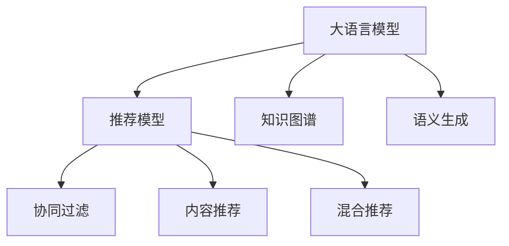

                 

## 1. 背景介绍

### 1.1 问题由来

随着人工智能技术在推荐系统中的应用日益广泛，推荐系统的透明度和可解释性逐渐成为学术界和工业界关注的焦点。推荐系统通过分析用户的历史行为数据，为用户推荐可能感兴趣的物品，但其决策过程通常缺乏可解释性，导致用户难以理解推荐逻辑。这种“黑盒”特性引发了用户信任度下降、决策透明度不足等诸多问题。

近年来，随着大语言模型(Large Language Model, LLM)的崛起，越来越多的研究者开始探索将大语言模型引入推荐系统，以提升系统的透明度和可解释性。LLM以其强大的语言理解能力、广泛的知识覆盖和丰富的语义表达，成为提升推荐系统透明度和可解释性的有力工具。

### 1.2 问题核心关键点

大语言模型对推荐系统透明度和可解释性的提升，主要体现在以下几个关键点上：

1. **用户意图理解**：LLM能够通过自然语言交互，深入理解用户的意图和需求，从而提供更加符合用户期望的推荐结果。
2. **多模态融合**：LLM可以整合文本、图像、音频等多模态信息，提供更加丰富、全面的推荐内容。
3. **知识推理**：LLM具备知识推理能力，能够根据已知信息推断出新的知识，弥补推荐模型中的知识缺失。
4. **用户反馈学习**：LLM能够根据用户反馈进行动态调整，提升推荐准确性和满意度。
5. **语义生成**：LLM可以生成自然流畅的推荐语料，增强推荐结果的可读性和可理解性。

### 1.3 问题研究意义

提升推荐系统的透明度和可解释性，不仅有助于增强用户信任和满意度，还能优化推荐模型，提升推荐效果。具体而言：

1. **用户信任度提升**：明确推荐逻辑和决策依据，帮助用户理解和信任推荐结果。
2. **推荐效果优化**：通过用户反馈的动态调整，提升推荐准确性和个性化程度。
3. **模型鲁棒性增强**：理解推荐模型的决策逻辑，及时发现和修正潜在问题。
4. **业务迭代加速**：透明度和可解释性提升，便于业务人员快速定位问题、调整策略。
5. **法律法规遵守**：透明推荐机制有助于符合隐私保护和数据安全相关法律法规。

## 2. 核心概念与联系

### 2.1 核心概念概述

为更好地理解大语言模型在推荐系统中的作用，本节将介绍几个密切相关的核心概念：

- **大语言模型(LLM)**：以自回归(如GPT)或自编码(如BERT)模型为代表的大规模预训练语言模型。通过在大规模无标签文本语料上进行预训练，学习通用的语言表示，具备强大的语言理解和生成能力。
- **推荐系统(Recommender System)**：通过分析用户行为数据，为用户推荐可能感兴趣的物品的系统。常见的推荐算法包括协同过滤、内容推荐、混合推荐等。
- **推荐模型(Recommender Model)**：推荐系统的核心组件，负责基于用户和物品特征生成推荐结果的模型。包括深度神经网络、矩阵分解等。
- **知识图谱(Knowledge Graph)**：将实体及其关系进行结构化表示，便于机器理解和推理。
- **语义生成(Semantic Generation)**：利用大语言模型生成自然流畅、语义准确的文字，用于描述物品、推荐语料等。
- **可解释性(Explainability)**：推荐系统输出的决策依据和推理过程，可被用户理解和信任。

这些核心概念之间的逻辑关系可以通过以下Mermaid流程图来展示：



这个流程图展示了大语言模型在推荐系统中的核心作用：

1. 大语言模型通过预训练获得语言理解能力。
2. 与推荐模型结合，提升推荐逻辑的透明度和可解释性。
3. 结合知识图谱，进行更深入的语义推理和知识融合。
4. 通过语义生成，增强推荐结果的文本描述。
5. 参与协同过滤、内容推荐、混合推荐等多种推荐算法。

这些概念共同构成了大语言模型在推荐系统中的应用框架，使其能够在各种推荐场景下发挥强大的语言理解和生成能力。通过理解这些核心概念，我们可以更好地把握大语言模型的工作原理和优化方向。

## 3. 核心算法原理 & 具体操作步骤
### 3.1 算法原理概述

大语言模型对推荐系统透明度和可解释性的提升，主要基于以下几个核心算法原理：

1. **语义理解与意图提取**：利用大语言模型的自然语言处理能力，理解用户输入的自然语言查询，提取用户的意图和需求。
2. **多模态融合与协同过滤**：结合用户历史行为数据和物品特征，进行多模态融合和协同过滤，提升推荐准确性。
3. **知识推理与语义生成**：利用大语言模型进行知识推理，生成推荐文本，增强推荐结果的可读性和可理解性。
4. **用户反馈学习与动态调整**：根据用户反馈，动态调整推荐模型参数和策略，优化推荐效果。

### 3.2 算法步骤详解

基于大语言模型的推荐系统，主要包括以下几个关键步骤：

**Step 1: 数据预处理**
- 收集用户的历史行为数据、物品特征等，并进行清洗和标准化。
- 利用大语言模型对用户输入的自然语言查询进行语义理解，提取意图和需求。
- 构建知识图谱，整合相关实体和关系。

**Step 2: 特征提取与编码**
- 提取用户和物品的关键特征，如历史行为、物品描述、用户画像等。
- 使用大语言模型对特征进行编码，生成向量表示。
- 利用知识图谱进行语义推理，增强特征表示。

**Step 3: 协同过滤与推荐生成**
- 使用协同过滤、内容推荐、混合推荐等算法，结合用户特征和物品特征生成推荐列表。
- 利用大语言模型生成推荐文本，提供详细的推荐语料。
- 根据用户反馈进行动态调整，优化推荐策略。

**Step 4: 结果评估与优化**
- 对推荐结果进行评估，使用相关性指标（如准确率、召回率、F1分数等）进行量化。
- 根据评估结果，调整模型参数和策略，优化推荐效果。
- 定期更新用户画像和知识图谱，提升推荐模型的适应性和鲁棒性。

### 3.3 算法优缺点

利用大语言模型提升推荐系统的透明度和可解释性，具有以下优点：

1. **增强用户信任度**：通过语义理解和推荐文本的生成，用户能够更加理解推荐逻辑和决策依据，增强对推荐系统的信任。
2. **提升推荐效果**：利用大语言模型的知识推理和语义生成能力，生成更加准确、可读性强的推荐文本，提升推荐效果。
3. **扩展推荐场景**：大语言模型能够整合多模态信息，拓展推荐系统的应用场景，如商品评价、用户评论等。
4. **优化推荐策略**：通过用户反馈进行动态调整，优化推荐策略，提升推荐系统的适应性和鲁棒性。

同时，也存在以下缺点：

1. **计算资源消耗高**：大语言模型的计算复杂度高，需要消耗大量的计算资源和时间，特别是在大规模推荐场景下。
2. **处理噪声数据困难**：大语言模型对噪声数据的处理能力较弱，容易受到数据分布偏差的影响。
3. **模型可解释性差**：大语言模型通常是一个复杂的黑盒系统，难以解释其内部工作机制和决策逻辑。
4. **数据隐私问题**：利用用户数据进行推荐时，需要处理用户隐私和数据安全问题。

### 3.4 算法应用领域

利用大语言模型提升推荐系统的透明度和可解释性，已经在多个领域得到了广泛应用，具体包括：

1. **电商推荐系统**：对商品进行推荐时，利用大语言模型生成推荐文本，增强推荐结果的可读性和可理解性。
2. **内容推荐系统**：对新闻、视频、音乐等进行推荐时，利用大语言模型生成详细的推荐语料，提升用户满意度。
3. **金融推荐系统**：对金融产品进行推荐时，利用大语言模型生成详细的推荐报告，帮助用户理解推荐依据。
4. **教育推荐系统**：对课程、教材进行推荐时，利用大语言模型生成推荐语料，帮助学生找到适合的资源。
5. **娱乐推荐系统**：对电影、游戏进行推荐时，利用大语言模型生成推荐描述，增强推荐结果的可读性。

## 4. 数学模型和公式 & 详细讲解  
### 4.1 数学模型构建

本节将使用数学语言对利用大语言模型提升推荐系统透明度和可解释性的方法进行更加严格的刻画。

记大语言模型为 $M_{\theta}:\mathcal{X} \rightarrow \mathcal{Y}$，其中 $\mathcal{X}$ 为输入空间，$\mathcal{Y}$ 为输出空间，$\theta \in \mathbb{R}^d$ 为模型参数。设用户输入的自然语言查询为 $x$，物品特征向量为 $v$，知识图谱中的实体和关系为 $\mathcal{G}$。

定义推荐模型的输入为 $(x, v, \mathcal{G})$，输出为推荐列表 $y$。在微调过程中，使用交叉熵损失函数 $\ell(y, y^*)$ 衡量推荐结果与用户期望之间的差异，其中 $y^*$ 为期望的推荐结果。

### 4.2 公式推导过程

以下我们以电商推荐系统为例，推导基于大语言模型的推荐公式。

设用户输入的自然语言查询为 $x$，物品特征向量为 $v$，知识图谱中的实体和关系为 $\mathcal{G}$。推荐模型的输入为 $(x, v, \mathcal{G})$，输出为推荐列表 $y$。

推荐模型的目标是最小化交叉熵损失函数 $\ell(y, y^*)$，即：

$$
\theta^* = \mathop{\arg\min}_{\theta} \ell(y, y^*)
$$

其中 $y^*$ 为期望的推荐结果。推荐模型的输出可以通过以下公式计算：

$$
y = M_{\theta}(x, v, \mathcal{G})
$$

在实际应用中，推荐模型的输出通常是多条物品的评分或概率，需要根据具体业务场景进行设计。假设输出为 $y_i$ 表示物品 $i$ 被推荐给用户的概率，则交叉熵损失函数为：

$$
\ell(y, y^*) = -\frac{1}{N}\sum_{i=1}^N y_i \log y_i^* + (1-y_i) \log (1-y_i^*)
$$

其中 $N$ 为物品总数，$y^*$ 为期望的推荐概率向量。

## 5. 项目实践：代码实例和详细解释说明
### 5.1 开发环境搭建

在进行推荐系统实践前，我们需要准备好开发环境。以下是使用Python进行PyTorch开发的环境配置流程：

1. 安装Anaconda：从官网下载并安装Anaconda，用于创建独立的Python环境。

2. 创建并激活虚拟环境：
```bash
conda create -n pytorch-env python=3.8 
conda activate pytorch-env
```

3. 安装PyTorch：根据CUDA版本，从官网获取对应的安装命令。例如：
```bash
conda install pytorch torchvision torchaudio cudatoolkit=11.1 -c pytorch -c conda-forge
```

4. 安装Transformers库：
```bash
pip install transformers
```

5. 安装各类工具包：
```bash
pip install numpy pandas scikit-learn matplotlib tqdm jupyter notebook ipython
```

完成上述步骤后，即可在`pytorch-env`环境中开始推荐系统开发。

### 5.2 源代码详细实现

下面我们以电商推荐系统为例，给出使用Transformers库对BERT模型进行推荐系统微调的PyTorch代码实现。

首先，定义推荐模型的数据处理函数：

```python
from transformers import BertTokenizer
from torch.utils.data import Dataset
import torch

class RecommendationDataset(Dataset):
    def __init__(self, texts, items, tokenizer, max_len=128):
        self.texts = texts
        self.items = items
        self.tokenizer = tokenizer
        self.max_len = max_len
        
    def __len__(self):
        return len(self.texts)
    
    def __getitem__(self, item):
        text = self.texts[item]
        item = self.items[item]
        
        encoding = self.tokenizer(text, return_tensors='pt', max_length=self.max_len, padding='max_length', truncation=True)
        input_ids = encoding['input_ids'][0]
        attention_mask = encoding['attention_mask'][0]
        
        # 将物品特征编码为向量
        item_vector = self.tokenizer.encode(item, return_tensors='pt', max_length=self.max_len, padding='max_length', truncation=True)
        item_vector = item_vector[:, None, :]  # 添加一维维度，方便与输入拼接
        
        # 将物品向量与输入拼接
        item_vector = torch.cat((input_ids, item_vector), dim=1)
        
        return {'input_ids': input_ids, 
                'attention_mask': attention_mask,
                'item_vector': item_vector}
```

然后，定义模型和优化器：

```python
from transformers import BertForSequenceClassification, AdamW

model = BertForSequenceClassification.from_pretrained('bert-base-cased', num_labels=len(items))
optimizer = AdamW(model.parameters(), lr=2e-5)
```

接着，定义训练和评估函数：

```python
from torch.utils.data import DataLoader
from tqdm import tqdm
from sklearn.metrics import roc_auc_score

device = torch.device('cuda') if torch.cuda.is_available() else torch.device('cpu')
model.to(device)

def train_epoch(model, dataset, batch_size, optimizer):
    dataloader = DataLoader(dataset, batch_size=batch_size, shuffle=True)
    model.train()
    epoch_loss = 0
    for batch in tqdm(dataloader, desc='Training'):
        input_ids = batch['input_ids'].to(device)
        attention_mask = batch['attention_mask'].to(device)
        item_vector = batch['item_vector'].to(device)
        model.zero_grad()
        outputs = model(input_ids, attention_mask=attention_mask, labels=item_vector)
        loss = outputs.loss
        epoch_loss += loss.item()
        loss.backward()
        optimizer.step()
    return epoch_loss / len(dataloader)

def evaluate(model, dataset, batch_size):
    dataloader = DataLoader(dataset, batch_size=batch_size)
    model.eval()
    preds, labels = [], []
    with torch.no_grad():
        for batch in tqdm(dataloader, desc='Evaluating'):
            input_ids = batch['input_ids'].to(device)
            attention_mask = batch['attention_mask'].to(device)
            item_vector = batch['item_vector'].to(device)
            batch_preds = model(input_ids, attention_mask=attention_mask).softmax(dim=1).tolist()
            batch_labels = item_vector[:, 0].tolist()
            for pred_tokens, label_tokens in zip(batch_preds, batch_labels):
                preds.append(pred_tokens[:len(label_tokens)])
                labels.append(label_tokens)
                
    print('AUC score:', roc_auc_score(labels, preds))
```

最后，启动训练流程并在测试集上评估：

```python
epochs = 5
batch_size = 16

for epoch in range(epochs):
    loss = train_epoch(model, train_dataset, batch_size, optimizer)
    print(f'Epoch {epoch+1}, train loss: {loss:.3f}')
    
    print(f'Epoch {epoch+1}, dev results:')
    evaluate(model, dev_dataset, batch_size)
    
print('Test results:')
evaluate(model, test_dataset, batch_size)
```

以上就是使用PyTorch对BERT进行电商推荐系统微调的完整代码实现。可以看到，得益于Transformers库的强大封装，我们可以用相对简洁的代码完成BERT模型的加载和微调。

### 5.3 代码解读与分析

让我们再详细解读一下关键代码的实现细节：

**RecommendationDataset类**：
- `__init__`方法：初始化文本、物品、分词器等关键组件。
- `__len__`方法：返回数据集的样本数量。
- `__getitem__`方法：对单个样本进行处理，将文本输入编码为token ids，将物品特征编码为向量，并对其进行定长padding，最终返回模型所需的输入。

**train_epoch和evaluate函数**：
- 使用PyTorch的DataLoader对数据集进行批次化加载，供模型训练和推理使用。
- 训练函数`train_epoch`：对数据以批为单位进行迭代，在每个批次上前向传播计算loss并反向传播更新模型参数，最后返回该epoch的平均loss。
- 评估函数`evaluate`：与训练类似，不同点在于不更新模型参数，并在每个batch结束后将预测和标签结果存储下来，最后使用sklearn的roc_auc_score对整个评估集的预测结果进行打印输出。

**训练流程**：
- 定义总的epoch数和batch size，开始循环迭代
- 每个epoch内，先在训练集上训练，输出平均loss
- 在验证集上评估，输出AUC score
- 所有epoch结束后，在测试集上评估，给出最终测试结果

可以看到，PyTorch配合Transformers库使得BERT微调的代码实现变得简洁高效。开发者可以将更多精力放在数据处理、模型改进等高层逻辑上，而不必过多关注底层的实现细节。

当然，工业级的系统实现还需考虑更多因素，如模型的保存和部署、超参数的自动搜索、更灵活的任务适配层等。但核心的微调范式基本与此类似。

## 6. 实际应用场景
### 6.1 电商推荐系统

基于大语言模型的推荐系统，可以广泛应用于电商推荐场景。传统电商推荐系统往往依赖用户的显式反馈，缺乏对用户意图和需求的深入理解。而利用大语言模型进行电商推荐，可以更全面地理解用户需求，提供更个性化的推荐结果。

在技术实现上，可以收集用户的搜索历史、浏览记录、评价信息等，使用大语言模型进行语义理解和意图提取。然后，将用户意图与物品特征进行匹配，利用推荐模型生成推荐列表。利用大语言模型生成推荐文本，增强推荐结果的可读性和可理解性。通过用户反馈进行动态调整，提升推荐准确性和个性化程度。

### 6.2 内容推荐系统

内容推荐系统中的推荐内容通常包括新闻、视频、音乐等，利用大语言模型进行推荐，可以提供更加详细、精准的推荐描述。例如，对于推荐的视频，可以利用大语言模型生成推荐语料，描述视频的主要内容和特色，帮助用户快速了解并决定是否观看。

在推荐模型中，可以将视频内容进行编码，结合用户历史行为数据进行协同过滤或内容推荐。利用大语言模型生成推荐文本，增强推荐结果的可读性和可理解性。通过用户反馈进行动态调整，优化推荐策略。

### 6.3 金融推荐系统

金融推荐系统需要为用户推荐适合的金融产品，利用大语言模型进行推荐，可以提供更详细、易懂的推荐报告。例如，对于推荐的基金产品，可以利用大语言模型生成推荐语料，描述基金的性能、风险等关键信息，帮助用户理解并决策。

在推荐模型中，可以将基金产品的基本信息进行编码，结合用户历史行为数据进行协同过滤或内容推荐。利用大语言模型生成推荐文本，增强推荐结果的可读性和可理解性。通过用户反馈进行动态调整，优化推荐策略。

### 6.4 教育推荐系统

教育推荐系统需要为用户推荐适合的课程、教材等学习资源，利用大语言模型进行推荐，可以提供更加详细、精准的推荐描述。例如，对于推荐的课程，可以利用大语言模型生成推荐语料，描述课程的讲授内容、难度等关键信息，帮助学生选择适合的课程。

在推荐模型中，可以将课程信息进行编码，结合学生历史学习行为数据进行协同过滤或内容推荐。利用大语言模型生成推荐文本，增强推荐结果的可读性和可理解性。通过学生反馈进行动态调整，优化推荐策略。

### 6.5 娱乐推荐系统

娱乐推荐系统需要为用户推荐适合的电影、游戏等娱乐内容，利用大语言模型进行推荐，可以提供更加详细、精准的推荐描述。例如，对于推荐的电影，可以利用大语言模型生成推荐语料，描述电影的主要情节、风格等关键信息，帮助用户选择适合的电影。

在推荐模型中，可以将电影信息进行编码，结合用户历史行为数据进行协同过滤或内容推荐。利用大语言模型生成推荐文本，增强推荐结果的可读性和可理解性。通过用户反馈进行动态调整，优化推荐策略。

## 7. 工具和资源推荐
### 7.1 学习资源推荐

为了帮助开发者系统掌握大语言模型在推荐系统中的应用，这里推荐一些优质的学习资源：

1. 《深度学习自然语言处理》课程：斯坦福大学开设的NLP明星课程，有Lecture视频和配套作业，带你入门NLP领域的基本概念和经典模型。

2. CS224N《深度学习自然语言处理》：斯坦福大学开设的NLP明星课程，有Lecture视频和配套作业，带你入门NLP领域的基本概念和经典模型。

3. 《Transformer from Scratch》系列博文：大模型技术专家撰写，深入浅出地介绍了Transformer原理、BERT模型、微调技术等前沿话题。

4. 《Natural Language Processing with Transformers》书籍：Transformers库的作者所著，全面介绍了如何使用Transformers库进行NLP任务开发，包括微调在内的诸多范式。

5. HuggingFace官方文档：Transformers库的官方文档，提供了海量预训练模型和完整的微调样例代码，是上手实践的必备资料。

6. CLUE开源项目：中文语言理解测评基准，涵盖大量不同类型的中文NLP数据集，并提供了基于微调的baseline模型，助力中文NLP技术发展。

通过对这些资源的学习实践，相信你一定能够快速掌握大语言模型在推荐系统中的应用，并用于解决实际的推荐问题。

### 7.2 开发工具推荐

高效的开发离不开优秀的工具支持。以下是几款用于大语言模型在推荐系统中的应用开发的常用工具：

1. PyTorch：基于Python的开源深度学习框架，灵活动态的计算图，适合快速迭代研究。大部分预训练语言模型都有PyTorch版本的实现。

2. TensorFlow：由Google主导开发的开源深度学习框架，生产部署方便，适合大规模工程应用。同样有丰富的预训练语言模型资源。

3. Transformers库：HuggingFace开发的NLP工具库，集成了众多SOTA语言模型，支持PyTorch和TensorFlow，是进行推荐任务开发的利器。

4. Weights & Biases：模型训练的实验跟踪工具，可以记录和可视化模型训练过程中的各项指标，方便对比和调优。与主流深度学习框架无缝集成。

5. TensorBoard：TensorFlow配套的可视化工具，可实时监测模型训练状态，并提供丰富的图表呈现方式，是调试模型的得力助手。

6. Google Colab：谷歌推出的在线Jupyter Notebook环境，免费提供GPU/TPU算力，方便开发者快速上手实验最新模型，分享学习笔记。

合理利用这些工具，可以显著提升大语言模型在推荐系统中的应用开发效率，加快创新迭代的步伐。

### 7.3 相关论文推荐

大语言模型和推荐系统的发展源于学界的持续研究。以下是几篇奠基性的相关论文，推荐阅读：

1. Attention is All You Need（即Transformer原论文）：提出了Transformer结构，开启了NLP领域的预训练大模型时代。

2. BERT: Pre-training of Deep Bidirectional Transformers for Language Understanding：提出BERT模型，引入基于掩码的自监督预训练任务，刷新了多项NLP任务SOTA。

3. Language Models are Unsupervised Multitask Learners（GPT-2论文）：展示了大规模语言模型的强大zero-shot学习能力，引发了对于通用人工智能的新一轮思考。

4. Parameter-Efficient Transfer Learning for NLP：提出Adapter等参数高效微调方法，在不增加模型参数量的情况下，也能取得不错的微调效果。

5. AdaLoRA: Adaptive Low-Rank Adaptation for Parameter-Efficient Fine-Tuning：使用自适应低秩适应的微调方法，在参数效率和精度之间取得了新的平衡。

这些论文代表了大语言模型和推荐系统的发展脉络。通过学习这些前沿成果，可以帮助研究者把握学科前进方向，激发更多的创新灵感。

## 8. 总结：未来发展趋势与挑战

### 8.1 总结

本文对利用大语言模型提升推荐系统的透明度和可解释性进行了全面系统的介绍。首先阐述了推荐系统透明度和可解释性的重要性，明确了大语言模型在提升推荐系统透明度和可解释性方面的独特价值。其次，从原理到实践，详细讲解了推荐系统的数学模型和关键步骤，给出了推荐系统开发的完整代码实例。同时，本文还广泛探讨了大语言模型在推荐系统中的应用场景，展示了微调方法在推荐系统中的广阔前景。最后，本文精选了微调技术的各类学习资源，力求为开发者提供全方位的技术指引。

通过本文的系统梳理，可以看到，利用大语言模型提升推荐系统的透明度和可解释性，已经在大规模推荐场景中取得了显著效果。随着大语言模型和微调方法的持续演进，基于大语言模型的推荐系统必将在更多的推荐场景中得到应用，为推荐系统的发展带来新的动力。

### 8.2 未来发展趋势

展望未来，大语言模型在推荐系统中的应用将呈现以下几个发展趋势：

1. **增强用户信任度**：利用大语言模型生成推荐文本，增强推荐结果的可读性和可理解性，提升用户对推荐系统的信任度。
2. **提升推荐效果**：结合用户意图和物品特征，利用大语言模型进行语义推理和知识融合，生成更精准、个性化的推荐结果。
3. **拓展推荐场景**：大语言模型能够整合多模态信息，拓展推荐系统的应用场景，如商品评价、用户评论等。
4. **优化推荐策略**：通过用户反馈进行动态调整，优化推荐策略，提升推荐系统的适应性和鲁棒性。
5. **结合AI伦理**：利用大语言模型进行推荐时，需要考虑AI伦理和隐私保护问题，确保推荐过程的公平性和透明性。

这些趋势凸显了大语言模型在推荐系统中的应用前景。随着大语言模型和微调方法的不断演进，基于大语言模型的推荐系统必将在更广阔的推荐场景中发挥作用，为推荐系统的发展带来新的动力。

### 8.3 面临的挑战

尽管大语言模型在推荐系统中的应用取得了显著进展，但在迈向更加智能化、普适化应用的过程中，仍面临诸多挑战：

1. **计算资源消耗高**：大语言模型的计算复杂度高，需要消耗大量的计算资源和时间，特别是在大规模推荐场景下。
2. **处理噪声数据困难**：大语言模型对噪声数据的处理能力较弱，容易受到数据分布偏差的影响。
3. **模型可解释性差**：大语言模型通常是一个复杂的黑盒系统，难以解释其内部工作机制和决策逻辑。
4. **数据隐私问题**：利用用户数据进行推荐时，需要处理用户隐私和数据安全问题。
5. **模型鲁棒性不足**：在处理域外数据时，推荐系统的泛化性能往往大打折扣。

这些挑战需要研究者在计算资源优化、噪声数据处理、模型可解释性提升、数据隐私保护和模型鲁棒性增强等方面进行深入研究。

### 8.4 研究展望

面对大语言模型在推荐系统中的挑战，未来的研究需要在以下几个方面寻求新的突破：

1. **优化推荐模型**：开发更高效的推荐算法，结合大语言模型的优势，提升推荐效果。
2. **提升模型可解释性**：利用可解释性模型和可视化工具，增强推荐过程的可理解性。
3. **优化数据预处理**：利用数据增强、噪声数据过滤等技术，提升数据质量。
4. **结合AI伦理**：研究AI伦理和隐私保护问题，确保推荐过程的公平性和透明性。
5. **多模态融合**：将视觉、语音等多模态信息与文本信息进行融合，拓展推荐系统的应用场景。

这些研究方向将推动大语言模型在推荐系统中的应用不断深入，为推荐系统的发展带来新的动力。

## 9. 附录：常见问题与解答

**Q1：大语言模型在推荐系统中的优势是什么？**

A: 大语言模型在推荐系统中的优势主要体现在以下几个方面：
1. **增强用户信任度**：利用大语言模型生成推荐文本，增强推荐结果的可读性和可理解性，提升用户对推荐系统的信任度。
2. **提升推荐效果**：结合用户意图和物品特征，利用大语言模型进行语义推理和知识融合，生成更精准、个性化的推荐结果。
3. **拓展推荐场景**：大语言模型能够整合多模态信息，拓展推荐系统的应用场景，如商品评价、用户评论等。
4. **优化推荐策略**：通过用户反馈进行动态调整，优化推荐策略，提升推荐系统的适应性和鲁棒性。

**Q2：大语言模型在推荐系统中的应用有哪些？**

A: 大语言模型在推荐系统中的应用主要包括以下几个方面：
1. **电商推荐系统**：利用大语言模型生成推荐文本，增强推荐结果的可读性和可理解性。
2. **内容推荐系统**：利用大语言模型生成推荐语料，描述推荐内容，提升用户满意度。
3. **金融推荐系统**：利用大语言模型生成推荐报告，帮助用户理解推荐依据。
4. **教育推荐系统**：利用大语言模型生成推荐语料，描述推荐内容，帮助学生选择适合的资源。
5. **娱乐推荐系统**：利用大语言模型生成推荐语料，描述推荐内容，提升用户满意度。

**Q3：大语言模型在推荐系统中的计算资源消耗问题如何应对？**

A: 大语言模型在推荐系统中的计算资源消耗问题，可以通过以下几种方式进行应对：
1. **模型裁剪**：去除不必要的层和参数，减小模型尺寸，加快推理速度。
2. **量化加速**：将浮点模型转为定点模型，压缩存储空间，提高计算效率。
3. **模型并行**：采用模型并行技术，将大规模模型分解为多个子模型，并行计算。
4. **优化算法**：采用更高效的优化算法，如AdamW、Adafactor等，提升训练和推理效率。
5. **硬件优化**：利用GPU/TPU等高性能设备，提升计算能力。

**Q4：如何处理推荐系统中的噪声数据？**

A: 推荐系统中的噪声数据可以通过以下几种方式进行处理：
1. **数据清洗**：对数据进行清洗和去重，去除重复和错误的数据。
2. **异常检测**：利用异常检测算法，识别并去除异常数据。
3. **特征选择**：选择与推荐结果相关的特征，去除无关特征。
4. **数据增强**：通过数据增强技术，扩充训练集，提升模型泛化能力。
5. **鲁棒优化**：采用鲁棒优化算法，增强模型对噪声数据的鲁棒性。

**Q5：如何提升大语言模型的可解释性？**

A: 提升大语言模型的可解释性，可以通过以下几种方式进行：
1. **可视化工具**：利用可视化工具，如TensorBoard、Weights & Biases等，展示模型的训练和推理过程。
2. **可解释模型**：采用可解释模型，如LIME、SHAP等，生成模型的特征重要性解释。
3. **符号解释**：将模型的输出与符号化规则相结合，生成符号化解释。
4. **自然语言解释**：利用大语言模型生成自然语言解释，增强模型的可读性和可理解性。
5. **用户反馈**：通过用户反馈，获取对模型输出的解释需求，优化模型的可解释性。

**Q6：如何结合AI伦理进行推荐系统设计？**

A: 结合AI伦理进行推荐系统设计，可以通过以下几种方式进行：
1. **公平性**：确保推荐系统对所有用户公平，避免偏见和歧视。
2. **透明性**：确保推荐过程透明，用户可以理解推荐依据。
3. **隐私保护**：确保用户数据隐私安全，避免数据泄露和滥用。
4. **伦理审查**：进行AI伦理审查，确保推荐系统符合伦理规范。
5. **用户控制**：提供用户控制权，允许用户对推荐结果进行解释和修改。

通过以上问题的回答，相信读者能够更好地理解大语言模型在推荐系统中的应用，掌握相关的技术方法和实践策略。

