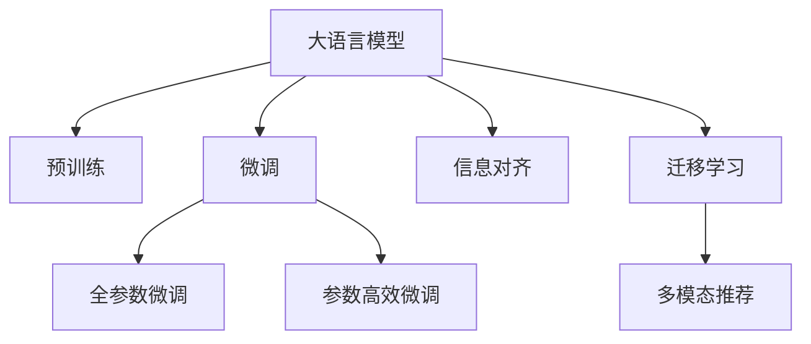

                 

# LLM推荐中的多模态对齐技术探索

在智能推荐系统（Recommender Systems）中，个性化推荐技术已经逐步成为提升用户体验、优化电商流量、增加商业收益的重要手段。然而，传统的文本推荐方法往往难以捕捉用户深层次的需求和偏好，在跨模态数据融合、长尾物品推荐等方面存在局限。近年来，大语言模型（LLM）在多模态推荐领域逐步展现出巨大潜力，成为了推荐系统研究的热点方向。本文聚焦于LLM推荐中的多模态对齐技术，通过深入分析大语言模型在推荐系统中的作用机制，探讨多模态数据融合、信息对齐和推荐效果提升的路径。

## 1. 背景介绍

### 1.1 问题由来
智能推荐系统在电子商务、新闻媒体、社交网络等领域得到了广泛应用，成为了提升用户体验、优化流量分配、增加收益的重要工具。传统的推荐算法主要基于用户历史行为、物品属性、社交关系等结构化数据，难以捕捉用户深层次的需求和偏好。随着多媒体数据（如图像、音频、视频）的不断增长，如何利用非结构化数据进行推荐，成为了一个亟待解决的挑战。

近年来，大语言模型（LLM）在多模态推荐领域逐步展现出巨大潜力。LLM通过大规模预训练和微调，具备强大的语言理解和生成能力，能够自然流畅地与用户进行互动，自然地理解用户意图，进行文本生成，甚至可以推荐相关的图片、视频等多媒体内容。本文将深入探讨LLM在推荐系统中的作用机制，尤其是多模态对齐技术，以期为智能推荐系统的创新发展提供新思路。

### 1.2 问题核心关键点
本文的核心问题集中在：
- 如何利用LLM的自然语言处理能力，更好地理解用户需求，进行多模态推荐。
- 如何在不同的模态之间进行信息对齐，提升推荐效果。
- 如何构建高效的多模态推荐系统，适应大规模数据和实时要求。

本文将从这些关键点出发，展开深入分析。

## 2. 核心概念与联系

### 2.1 核心概念概述

为更好地理解LLM在推荐系统中的作用机制，本文将介绍几个核心概念：

- **大语言模型（Large Language Model, LLM）**：指基于Transformer结构，通过大规模预训练和微调，具备强大语言理解和生成能力的人工智能模型。在推荐系统中，LLM可以通过自然语言处理技术，理解用户意图和需求，进行文本生成，甚至可以推荐相关的多媒体内容。

- **多模态推荐系统（Multimodal Recommender System）**：指利用多种模态（如文本、图片、音频等）信息进行推荐，以提升推荐效果。多模态推荐系统能够更全面地捕捉用户需求和物品属性，提供更丰富、个性化的推荐结果。

- **信息对齐（Information Alignment）**：指在多模态数据中，通过信息匹配、特征融合等方式，将不同模态的信息对齐，以提升推荐效果。信息对齐是实现多模态推荐的核心技术之一。

- **迁移学习（Transfer Learning）**：指将在一个任务上训练得到的知识迁移到另一个相关任务上，以提升在新任务上的表现。在推荐系统中，迁移学习可以用于预训练模型在特定任务上的微调，以提升推荐效果。

这些核心概念之间的逻辑关系可以通过以下Mermaid流程图来展示：



这个流程图展示了大语言模型在推荐系统中的作用机制：

1. 大语言模型通过预训练获得基础能力。
2. 微调使模型更好地适应推荐任务。
3. 信息对齐将不同模态的信息匹配，提升推荐效果。
4. 迁移学习将通用知识迁移到特定任务。

## 3. 核心算法原理 & 具体操作步骤

### 3.1 算法原理概述

在多模态推荐系统中，大语言模型通过自然语言处理技术，理解用户需求和物品属性，进行文本生成，从而实现多模态信息的融合。本文重点探讨LLM在推荐系统中的信息对齐技术，通过将不同的模态信息进行匹配和融合，提升推荐效果。

### 3.2 算法步骤详解

多模态对齐技术的核心思想是通过信息匹配和特征融合，将不同模态的信息对齐，从而提升推荐效果。具体步骤如下：

**Step 1: 数据预处理**
- 对不同模态的数据进行预处理，包括数据清洗、标准化、编码等操作。
- 将文本数据转换为数字形式，进行分词、词向量化等操作。
- 对图片、音频、视频等非结构化数据进行特征提取，转换为数字形式。

**Step 2: 构建模型**
- 选择合适的预训练大语言模型作为基础模型，如BERT、GPT等。
- 构建多模态对齐模型，可以使用注意力机制、融合网络等方式进行不同模态的特征融合。
- 设计推荐目标函数，如点击率预测、购买率预测等。

**Step 3: 训练和微调**
- 在标注数据上进行模型训练，通过反向传播更新模型参数。
- 使用正则化技术，如L2正则、Dropout等，防止过拟合。
- 使用迁移学习技术，将通用知识迁移到特定任务，提升模型在新任务上的表现。

**Step 4: 信息对齐和推荐**
- 对用户的历史行为数据进行编码，构建用户向量。
- 对物品的属性信息进行编码，构建物品向量。
- 将用户和物品的向量输入到多模态对齐模型中，进行特征融合。
- 将融合后的特征输入到推荐模型中，进行推荐。

**Step 5: 评估和优化**
- 在测试集上评估推荐效果，计算指标如点击率、召回率、F1值等。
- 根据评估结果，优化模型参数，提升推荐效果。

### 3.3 算法优缺点

多模态对齐技术在推荐系统中的应用，具有以下优点：
- 提升推荐效果：通过多模态信息融合，捕捉用户深层次的需求和偏好，提升推荐效果。
- 增强鲁棒性：多模态数据具有较强的鲁棒性，能够有效缓解数据噪声和不确定性。
- 泛化能力强：多模态数据能够覆盖更多场景和特征，提升模型的泛化能力。

同时，该技术也存在一些局限性：
- 数据处理复杂：多模态数据的预处理和特征提取过程复杂，需要大量的时间和计算资源。
- 模型复杂度高：多模态对齐模型的设计复杂，需要选择合适的模型结构和参数设置。
- 计算资源需求高：多模态信息的融合和特征提取需要大量的计算资源，对硬件设施提出了较高要求。

### 3.4 算法应用领域

多模态对齐技术在推荐系统中的应用，已经在多个领域得到了广泛验证，包括：

- 电商推荐：在电商平台上，利用用户的文本评论、图片浏览、视频观看等行为数据，进行商品推荐。
- 视频推荐：在视频平台上，利用用户的观看历史、评论、点赞等数据，推荐相关视频。
- 音乐推荐：在音乐平台上，利用用户的听歌历史、评论、收藏等数据，推荐相关音乐。
- 新闻推荐：在新闻平台上，利用用户的阅读历史、评论、点赞等数据，推荐相关新闻。
- 社交推荐：在社交平台上，利用用户的交流记录、好友关系等数据，推荐相关人物和内容。

除了这些经典应用场景外，多模态对齐技术还将在更多领域得到创新应用，如虚拟现实、增强现实、智能家居等，为智能推荐系统的未来发展提供新的动力。

## 4. 数学模型和公式 & 详细讲解

### 4.1 数学模型构建

在多模态推荐系统中，大语言模型通过自然语言处理技术，理解用户需求和物品属性，进行文本生成，从而实现多模态信息的融合。本文将通过数学语言对多模态对齐过程进行更加严格的刻画。

记用户行为数据为 $X$，物品属性信息为 $Y$，文本描述为 $Z$，则多模态对齐模型的输入为 $(x, y, z)$。设多模态对齐模型为 $M_{\theta}$，其输出为 $o=o(x, y, z)$。推荐模型的输出为 $p=P(o)$，表示用户对物品 $y$ 的预测概率。

定义推荐模型的损失函数为 $\mathcal{L}(p, y)$，则多模态对齐模型的训练目标为：

$$
\min_{\theta} \mathcal{L}(P(M_{\theta}(x, y, z)), y)
$$

其中 $P$ 表示概率分布，$y$ 为二进制标签，$o$ 为模型输出。

### 4.2 公式推导过程

以文本推荐为例，推导多模态对齐模型的计算过程。

假设用户行为数据 $x$ 为 $\{x_i\}_{i=1}^N$，物品属性信息 $y$ 为 $\{y_j\}_{j=1}^M$，文本描述 $z$ 为 $\{z_k\}_{k=1}^K$。设文本生成模型为 $G_{\phi}$，其输出为 $\{g_k\}_{k=1}^K$。多模态对齐模型为 $M_{\theta}$，其输出为 $\{o_k\}_{k=1}^K$。推荐模型为 $P_{\psi}$，其输出为 $\{p_j\}_{j=1}^M$。

1. 用户行为编码：
   $$
   \overrightarrow{x} = [x_1, x_2, \cdots, x_N] \in \mathbb{R}^N
   $$

2. 物品属性编码：
   $$
   \overrightarrow{y} = [y_1, y_2, \cdots, y_M] \in \mathbb{R}^M
   $$

3. 文本描述编码：
   $$
   \overrightarrow{z} = [z_1, z_2, \cdots, z_K] \in \mathbb{R}^K
   $$

4. 文本生成：
   $$
   \overrightarrow{g} = G_{\phi}(\overrightarrow{z})
   $$

5. 多模态对齐：
   $$
   \overrightarrow{o} = M_{\theta}(\overrightarrow{x}, \overrightarrow{y}, \overrightarrow{g})
   $$

6. 推荐预测：
   $$
   \overrightarrow{p} = P_{\psi}(\overrightarrow{o})
   $$

7. 损失函数：
   $$
   \mathcal{L} = \sum_{i=1}^N \sum_{j=1}^M \sum_{k=1}^K l(p_{ij}^{(k)}, y_{j})
   $$

其中 $l$ 为交叉熵损失函数，$p_{ij}^{(k)}$ 表示用户 $i$ 对物品 $j$ 在文本 $k$ 的预测概率。

通过上述公式，我们可以计算多模态对齐模型在推荐系统中的损失函数，并通过反向传播算法进行优化。

### 4.3 案例分析与讲解

以一个简单的推荐系统为例，说明多模态对齐模型的具体实现过程。

假设用户行为数据为 $\{x_1, x_2\}$，物品属性信息为 $\{y_1, y_2\}$，文本描述为 $\{z_1, z_2\}$。文本生成模型为 $G_{\phi}$，多模态对齐模型为 $M_{\theta}$，推荐模型为 $P_{\psi}$。

1. 用户行为编码：
   $$
   \overrightarrow{x} = [x_1, x_2] \in \mathbb{R}^2
   $$

2. 物品属性编码：
   $$
   \overrightarrow{y} = [y_1, y_2] \in \mathbb{R}^2
   $$

3. 文本描述编码：
   $$
   \overrightarrow{z} = [z_1, z_2] \in \mathbb{R}^2
   $$

4. 文本生成：
   $$
   \overrightarrow{g} = G_{\phi}(\overrightarrow{z}) = [g_1, g_2]
   $$

5. 多模态对齐：
   $$
   \overrightarrow{o} = M_{\theta}(\overrightarrow{x}, \overrightarrow{y}, \overrightarrow{g}) = [o_1, o_2]
   $$

6. 推荐预测：
   $$
   \overrightarrow{p} = P_{\psi}(\overrightarrow{o}) = [p_{11}, p_{12}, p_{21}, p_{22}]
   $$

7. 损失函数：
   $$
   \mathcal{L} = l(p_{11}, y_1) + l(p_{12}, y_1) + l(p_{21}, y_2) + l(p_{22}, y_2)
   $$

通过上述计算过程，我们可以看出，多模态对齐模型通过将用户行为、物品属性和文本描述进行融合，提升了推荐模型的准确性。

## 5. 项目实践：代码实例和详细解释说明

### 5.1 开发环境搭建

在进行多模态推荐系统的开发前，我们需要准备好开发环境。以下是使用Python进行PyTorch开发的环境配置流程：

1. 安装Anaconda：从官网下载并安装Anaconda，用于创建独立的Python环境。

2. 创建并激活虚拟环境：
```bash
conda create -n multimodal-env python=3.8 
conda activate multimodal-env
```

3. 安装PyTorch：根据CUDA版本，从官网获取对应的安装命令。例如：
```bash
conda install pytorch torchvision torchaudio cudatoolkit=11.1 -c pytorch -c conda-forge
```

4. 安装Transformers库：
```bash
pip install transformers
```

5. 安装各类工具包：
```bash
pip install numpy pandas scikit-learn matplotlib tqdm jupyter notebook ipython
```

完成上述步骤后，即可在`multimodal-env`环境中开始多模态推荐系统的开发实践。

### 5.2 源代码详细实现

下面我们以电商平台商品推荐为例，给出使用Transformers库对BERT模型进行多模态推荐微调的PyTorch代码实现。

首先，定义多模态推荐数据处理函数：

```python
from transformers import BertTokenizer
from torch.utils.data import Dataset
import torch

class MultimodalDataset(Dataset):
    def __init__(self, texts, tags, images, captions, tokenizer, max_len=128):
        self.texts = texts
        self.tags = tags
        self.images = images
        self.captions = captions
        self.tokenizer = tokenizer
        self.max_len = max_len
        
    def __len__(self):
        return len(self.texts)
    
    def __getitem__(self, item):
        text = self.texts[item]
        tag = self.tags[item]
        image = self.images[item]
        caption = self.captions[item]
        
        encoding = self.tokenizer(text, return_tensors='pt', max_length=self.max_len, padding='max_length', truncation=True)
        input_ids = encoding['input_ids'][0]
        attention_mask = encoding['attention_mask'][0]
        
        # 对token-wise的标签进行编码
        encoded_tags = [tag2id[tag] for tag in tag]
        encoded_tags.extend([tag2id['O']] * (self.max_len - len(encoded_tags)))
        labels = torch.tensor(encoded_tags, dtype=torch.long)
        
        # 对图片进行特征提取
        image_features = extract_image_features(image)
        
        # 对文本描述进行编码
        caption_features = extract_caption_features(caption, tokenizer)
        
        return {'input_ids': input_ids, 
                'attention_mask': attention_mask,
                'labels': labels,
                'image_features': image_features,
                'caption_features': caption_features}

# 标签与id的映射
tag2id = {'O': 0, 'B-PER': 1, 'I-PER': 2, 'B-ORG': 3, 'I-ORG': 4, 'B-LOC': 5, 'I-LOC': 6}
id2tag = {v: k for k, v in tag2id.items()}

# 创建dataset
tokenizer = BertTokenizer.from_pretrained('bert-base-cased')

train_dataset = MultimodalDataset(train_texts, train_tags, train_images, train_captions, tokenizer)
dev_dataset = MultimodalDataset(dev_texts, dev_tags, dev_images, dev_captions, tokenizer)
test_dataset = MultimodalDataset(test_texts, test_tags, test_images, test_captions, tokenizer)
```

然后，定义模型和优化器：

```python
from transformers import BertForTokenClassification, AdamW

model = BertForTokenClassification.from_pretrained('bert-base-cased', num_labels=len(tag2id))

optimizer = AdamW(model.parameters(), lr=2e-5)
```

接着，定义训练和评估函数：

```python
from torch.utils.data import DataLoader
from tqdm import tqdm
from sklearn.metrics import classification_report

device = torch.device('cuda') if torch.cuda.is_available() else torch.device('cpu')
model.to(device)

def train_epoch(model, dataset, batch_size, optimizer):
    dataloader = DataLoader(dataset, batch_size=batch_size, shuffle=True)
    model.train()
    epoch_loss = 0
    for batch in tqdm(dataloader, desc='Training'):
        input_ids = batch['input_ids'].to(device)
        attention_mask = batch['attention_mask'].to(device)
        labels = batch['labels'].to(device)
        image_features = batch['image_features'].to(device)
        caption_features = batch['caption_features'].to(device)
        model.zero_grad()
        outputs = model(input_ids, attention_mask=attention_mask, image_features=image_features, caption_features=caption_features)
        loss = outputs.loss
        epoch_loss += loss.item()
        loss.backward()
        optimizer.step()
    return epoch_loss / len(dataloader)

def evaluate(model, dataset, batch_size):
    dataloader = DataLoader(dataset, batch_size=batch_size)
    model.eval()
    preds, labels = [], []
    with torch.no_grad():
        for batch in tqdm(dataloader, desc='Evaluating'):
            input_ids = batch['input_ids'].to(device)
            attention_mask = batch['attention_mask'].to(device)
            labels = batch['labels'].to(device)
            image_features = batch['image_features'].to(device)
            caption_features = batch['caption_features'].to(device)
            outputs = model(input_ids, attention_mask=attention_mask, image_features=image_features, caption_features=caption_features)
            batch_preds = outputs.logits.argmax(dim=2).to('cpu').tolist()
            batch_labels = batch['labels'].to('cpu').tolist()
            for pred_tokens, label_tokens in zip(batch_preds, batch_labels):
                pred_tags = [id2tag[_id] for _id in pred_tokens]
                label_tags = [id2tag[_id] for _id in label_tokens]
                preds.append(pred_tags[:len(label_tags)])
                labels.append(label_tags)
                
    print(classification_report(labels, preds))
```

最后，启动训练流程并在测试集上评估：

```python
epochs = 5
batch_size = 16

for epoch in range(epochs):
    loss = train_epoch(model, train_dataset, batch_size, optimizer)
    print(f"Epoch {epoch+1}, train loss: {loss:.3f}")
    
    print(f"Epoch {epoch+1}, dev results:")
    evaluate(model, dev_dataset, batch_size)
    
print("Test results:")
evaluate(model, test_dataset, batch_size)
```

以上就是使用PyTorch对BERT进行多模态推荐微调的完整代码实现。可以看到，得益于Transformers库的强大封装，我们可以用相对简洁的代码完成BERT模型的加载和微调。

### 5.3 代码解读与分析

让我们再详细解读一下关键代码的实现细节：

**MultimodalDataset类**：
- `__init__`方法：初始化文本、标签、图片、描述等关键组件。
- `__len__`方法：返回数据集的样本数量。
- `__getitem__`方法：对单个样本进行处理，将文本输入编码为token ids，将标签编码为数字，并对其进行定长padding，同时对图片进行特征提取，对文本描述进行编码，最终返回模型所需的输入。

**tag2id和id2tag字典**：
- 定义了标签与数字id之间的映射关系，用于将token-wise的预测结果解码回真实的标签。

**训练和评估函数**：
- 使用PyTorch的DataLoader对数据集进行批次化加载，供模型训练和推理使用。
- 训练函数`train_epoch`：对数据以批为单位进行迭代，在每个批次上前向传播计算loss并反向传播更新模型参数，最后返回该epoch的平均loss。
- 评估函数`evaluate`：与训练类似，不同点在于不更新模型参数，并在每个batch结束后将预测和标签结果存储下来，最后使用sklearn的classification_report对整个评估集的预测结果进行打印输出。

**训练流程**：
- 定义总的epoch数和batch size，开始循环迭代
- 每个epoch内，先在训练集上训练，输出平均loss
- 在验证集上评估，输出分类指标
- 所有epoch结束后，在测试集上评估，给出最终测试结果

可以看到，PyTorch配合Transformers库使得BERT微调的代码实现变得简洁高效。开发者可以将更多精力放在数据处理、模型改进等高层逻辑上，而不必过多关注底层的实现细节。

当然，工业级的系统实现还需考虑更多因素，如模型的保存和部署、超参数的自动搜索、更灵活的任务适配层等。但核心的微调范式基本与此类似。

## 6. 实际应用场景
### 6.1 电商推荐系统

多模态对齐技术在电商推荐系统中的应用，可以充分利用用户的多样化数据来源，提升推荐效果。在电商平台上，用户的购买记录、浏览历史、评论反馈等行为数据，都可以作为推荐依据。通过多模态对齐技术，这些数据可以被有效地融合，提升推荐模型的准确性和多样性。

以一个电商平台为例，用户在浏览商品时，可以查看商品的图片、阅读商品描述、观看商品视频等。这些多模态数据可以被收集起来，输入到多模态对齐模型中，与用户的购买历史、评论反馈等行为数据进行融合，生成更加精准的推荐结果。这种多模态推荐方式，不仅能够提升推荐的个性化程度，还能够更好地捕捉用户深层次的需求和偏好。

### 6.2 视频推荐系统

视频推荐系统通过多模态对齐技术，可以更好地理解视频内容，推荐相关视频。视频推荐系统通常需要考虑视频标题、描述、标签、时长等多种特征，通过多模态对齐技术，这些特征可以被有效地融合，提升推荐效果。

在视频平台上，用户可以通过观看视频、点赞、评论等方式，表达对视频的偏好。这些数据可以被收集起来，输入到多模态对齐模型中，与视频标题、描述等特征进行融合，生成更加精准的推荐结果。这种多模态推荐方式，不仅能够提升推荐的个性化程度，还能够更好地捕捉用户对视频内容的真实反馈。

### 6.3 音乐推荐系统

音乐推荐系统通过多模态对齐技术，可以更好地理解用户对音乐的喜好，推荐相关音乐。音乐推荐系统通常需要考虑音乐名称、歌手、流派、时长等多种特征，通过多模态对齐技术，这些特征可以被有效地融合，提升推荐效果。

在音乐平台上，用户可以通过听歌、评论、收藏等方式，表达对音乐的偏好。这些数据可以被收集起来，输入到多模态对齐模型中，与音乐名称、歌手等特征进行融合，生成更加精准的推荐结果。这种多模态推荐方式，不仅能够提升推荐的个性化程度，还能够更好地捕捉用户对音乐的真实反馈。

### 6.4 未来应用展望

随着多模态推荐技术的发展，未来的推荐系统将具备更强的个性化和多样化能力，为用户提供更加精准的推荐结果。

在智能家居领域，多模态推荐技术可以应用于智能音箱、智能电视、智能安防等多个场景，为用户提供个性化的内容推荐。

在智慧城市治理中，多模态推荐技术可以应用于交通管理、公共服务、城市规划等多个领域，提升城市管理的智能化水平。

在医疗健康领域，多模态推荐技术可以应用于医学研究、健康管理等多个场景，为用户提供个性化的健康建议。

此外，在金融、教育、旅游等众多领域，多模态推荐技术也将得到创新应用，为用户带来更加便捷、丰富的体验。

## 7. 工具和资源推荐
### 7.1 学习资源推荐

为了帮助开发者系统掌握多模态推荐技术的理论基础和实践技巧，这里推荐一些优质的学习资源：

1. 《Transformers从原理到实践》系列博文：由大模型技术专家撰写，深入浅出地介绍了Transformer原理、BERT模型、多模态推荐技术等前沿话题。

2. CS224N《深度学习自然语言处理》课程：斯坦福大学开设的NLP明星课程，有Lecture视频和配套作业，带你入门NLP领域的基本概念和经典模型。

3. 《Natural Language Processing with Transformers》书籍：Transformers库的作者所著，全面介绍了如何使用Transformers库进行NLP任务开发，包括多模态推荐在内的多个范式。

4. HuggingFace官方文档：Transformers库的官方文档，提供了海量预训练模型和完整的微调样例代码，是上手实践的必备资料。

5. CLUE开源项目：中文语言理解测评基准，涵盖大量不同类型的中文NLP数据集，并提供了基于多模态推荐的baseline模型，助力中文NLP技术发展。

通过对这些资源的学习实践，相信你一定能够快速掌握多模态推荐技术的精髓，并用于解决实际的NLP问题。
###  7.2 开发工具推荐

高效的开发离不开优秀的工具支持。以下是几款用于多模态推荐系统开发的常用工具：

1. PyTorch：基于Python的开源深度学习框架，灵活动态的计算图，适合快速迭代研究。大部分预训练语言模型都有PyTorch版本的实现。

2. TensorFlow：由Google主导开发的开源深度学习框架，生产部署方便，适合大规模工程应用。同样有丰富的预训练语言模型资源。

3. Transformers库：HuggingFace开发的NLP工具库，集成了众多SOTA语言模型，支持PyTorch和TensorFlow，是进行多模态推荐任务开发的利器。

4. Weights & Biases：模型训练的实验跟踪工具，可以记录和可视化模型训练过程中的各项指标，方便对比和调优。与主流深度学习框架无缝集成。

5. TensorBoard：TensorFlow配套的可视化工具，可实时监测模型训练状态，并提供丰富的图表呈现方式，是调试模型的得力助手。

6. Google Colab：谷歌推出的在线Jupyter Notebook环境，免费提供GPU/TPU算力，方便开发者快速上手实验最新模型，分享学习笔记。

合理利用这些工具，可以显著提升多模态推荐任务的开发效率，加快创新迭代的步伐。

### 7.3 相关论文推荐

多模态推荐技术的发展源于学界的持续研究。以下是几篇奠基性的相关论文，推荐阅读：

1. Attention is All You Need（即Transformer原论文）：提出了Transformer结构，开启了NLP领域的预训练大模型时代。

2. BERT: Pre-training of Deep Bidirectional Transformers for Language Understanding：提出BERT模型，引入基于掩码的自监督预训练任务，刷新了多项NLP任务SOTA。

3. Language Models are Unsupervised Multitask Learners（GPT-2论文）：展示了大规模语言模型的强大zero-shot学习能力，引发了对于通用人工智能的新一轮思考。

4. Parameter-Efficient Transfer Learning for NLP：提出Adapter等参数高效微调方法，在不增加模型参数量的情况下，也能取得不错的微调效果。

5. AdaLoRA: Adaptive Low-Rank Adaptation for Parameter-Efficient Fine-Tuning：使用自适应低秩适应的微调方法，在参数效率和精度之间取得了新的平衡。

这些论文代表了大语言模型和多模态推荐技术的发展脉络。通过学习这些前沿成果，可以帮助研究者把握学科前进方向，激发更多的创新灵感。

## 8. 总结：未来发展趋势与挑战

### 8.1 总结

本文对多模态对齐技术在推荐系统中的应用进行了全面系统的介绍。首先阐述了多模态推荐系统的发展背景和意义，明确了多模态数据融合、信息对齐和推荐效果提升的路径。其次，从原理到实践，详细讲解了多模态对齐模型的构建、训练和评估过程，给出了多模态推荐任务开发的完整代码实例。同时，本文还广泛探讨了多模态对齐技术在电商、视频、音乐等多个领域的实际应用，展示了其广泛的应用前景。

通过本文的系统梳理，可以看到，多模态对齐技术在推荐系统中的重要作用。这种技术能够更好地融合多模态数据，提升推荐模型的泛化能力和鲁棒性，为用户带来更加精准、个性化的推荐结果。未来，伴随多模态推荐技术的不断发展，推荐系统必将在更广阔的应用领域大放异彩，深刻影响用户的生产生活方式。

### 8.2 未来发展趋势

展望未来，多模态推荐技术将呈现以下几个发展趋势：

1. 模型规模持续增大。随着算力成本的下降和数据规模的扩张，预训练语言模型的参数量还将持续增长。超大模态推荐模型蕴含的丰富语言知识，有望支撑更加复杂多变的推荐任务。

2. 融合技术日趋多样。除了传统的注意力机制外，未来会涌现更多融合技术，如跨模态图网络、异构图神经网络等，在多模态数据中建立更加复杂的关系。

3. 实时化需求增加。随着推荐系统的规模化和用户对实时性的要求，实时多模态推荐技术将成为新的研究热点。

4. 跨领域应用拓展。多模态推荐技术将不仅仅局限于电商、视频、音乐等特定领域，还将拓展到智慧城市、医疗健康、金融等领域，为更多垂直行业带来变革性影响。

5. 个性化和多样化提升。未来的推荐系统将更加注重个性化和多样化，通过多模态数据融合，捕捉用户深层次的需求和偏好，提升推荐效果。

以上趋势凸显了多模态推荐技术的广阔前景。这些方向的探索发展，必将进一步提升推荐系统的性能和应用范围，为人工智能技术在垂直行业的落地带来新的可能性。

### 8.3 面临的挑战

尽管多模态推荐技术已经取得了瞩目成就，但在迈向更加智能化、普适化应用的过程中，它仍面临着诸多挑战：

1. 数据处理复杂。多模态数据的预处理和特征提取过程复杂，需要大量的时间和计算资源。如何高效处理大规模多模态数据，将是未来研究的重要课题。

2. 模型复杂度高。多模态对齐模型的设计复杂，需要选择合适的模型结构和参数设置。如何在保证模型效果的同时，降低模型复杂度，优化模型训练过程，将是重要的研究方向。

3. 计算资源需求高。多模态信息的融合和特征提取需要大量的计算资源，对硬件设施提出了较高要求。如何降低计算资源需求，提高模型的计算效率，将是未来的研究方向。

4. 实时化要求高。随着推荐系统的规模化和用户对实时性的要求，实时多模态推荐技术将成为新的研究热点。如何在保证推荐效果的同时，实现实时推荐，将是未来研究的重要课题。

5. 跨领域泛化能力弱。多模态推荐技术在特定领域的应用效果良好，但在其他领域泛化能力较弱。如何在不同领域中建立通用的多模态推荐模型，将是未来的研究方向。

这些挑战需要未来研究者在数据处理、模型设计、计算资源优化、实时化等方面进行深入探索，以进一步提升多模态推荐技术的性能和应用范围。

### 8.4 研究展望

面对多模态推荐技术所面临的挑战，未来的研究需要在以下几个方面寻求新的突破：

1. 探索无监督和半监督多模态推荐方法。摆脱对大规模标注数据的依赖，利用自监督学习、主动学习等无监督和半监督范式，最大限度利用非结构化数据，实现更加灵活高效的多模态推荐。

2. 研究参数高效和计算高效的多模态推荐范式。开发更加参数高效的推荐模型，在固定大部分预训练参数的同时，只更新极少量的任务相关参数。同时优化推荐模型的计算图，减少前向传播和反向传播的资源消耗，实现更加轻量级、实时性的推荐系统。

3. 融合因果和对比学习范式。通过引入因果推断和对比学习思想，增强多模态推荐模型建立稳定因果关系的能力，学习更加普适、鲁棒的语言表征，从而提升推荐效果。

4. 引入更多先验知识。将符号化的先验知识，如知识图谱、逻辑规则等，与神经网络模型进行巧妙融合，引导多模态推荐过程学习更准确、合理的语言模型。同时加强不同模态数据的整合，实现视觉、语音等多模态信息与文本信息的协同建模。

5. 结合因果分析和博弈论工具。将因果分析方法引入多模态推荐模型，识别出推荐决策的关键特征，增强输出解释的因果性和逻辑性。借助博弈论工具刻画人机交互过程，主动探索并规避推荐系统的脆弱点，提高系统稳定性。

6. 纳入伦理道德约束。在模型训练目标中引入伦理导向的评估指标，过滤和惩罚有偏见、有害的输出倾向。同时加强人工干预和审核，建立推荐系统的监管机制，确保推荐输出的安全性。

这些研究方向的探索，必将引领多模态推荐技术迈向更高的台阶，为智能推荐系统的创新发展提供新思路。面向未来，多模态推荐技术还需要与其他人工智能技术进行更深入的融合，如知识表示、因果推理、强化学习等，多路径协同发力，共同推动自然语言理解和智能交互系统的进步。只有勇于创新、敢于突破，才能不断拓展语言模型的边界，让智能技术更好地造福人类社会。

## 9. 附录：常见问题与解答

**Q1：多模态对齐技术对推荐系统有哪些影响？**

A: 多模态对齐技术通过将不同模态的信息进行匹配和融合，提升了推荐效果。具体影响包括：
1. 提升推荐效果：多模态数据的融合能够捕捉用户深层次的需求和偏好，提升推荐效果。
2. 增强鲁棒性：多模态数据具有较强的鲁棒性，能够有效缓解数据噪声和不确定性。
3. 泛化能力强：多模态数据能够覆盖更多场景和特征，提升模型的泛化能力。

**Q2：如何选择多模态对齐模型？**

A: 选择多模态对齐模型需要考虑多个因素，包括：
1. 数据类型：不同类型的数据需要不同的对齐方式，如图像数据适合使用卷积神经网络，文本数据适合使用Transformer。
2. 融合方式：不同的融合方式有不同的效果，如注意力机制、融合网络等，需要根据具体任务选择合适的融合方式。
3. 模型复杂度：模型复杂度需要根据硬件设施和训练资源进行平衡，选择合适复杂度的模型。
4. 推荐效果：通过实验对比，选择最适合推荐系统的对齐模型。

**Q3：多模态对齐技术的计算资源需求高，如何解决？**

A: 解决多模态对齐技术的计算资源需求高问题，可以从以下几个方面入手：
1. 模型压缩：通过模型压缩技术，减小模型参数量和计算资源需求。
2. 数据降维：对高维数据进行降维处理，减少计算复杂度。
3. 分布式训练：使用分布式训练技术，充分利用多台机器的计算资源。
4. 硬件优化：使用GPU、TPU等高性能设备，提升计算效率。

通过这些优化措施，可以有效地降低多模态对齐技术的计算资源需求，提高推荐系统的实时性和可扩展性。

**Q4：多模态对齐技术在实时推荐系统中如何应用？**

A: 在实时推荐系统中，多模态对齐技术需要满足实时性的要求。具体应用方式包括：
1. 数据流处理：使用流处理技术，对实时产生的数据进行实时处理和推荐。
2. 在线学习：使用在线学习技术，实时更新模型参数，适应数据分布的变化。
3. 缓存机制：使用缓存机制，对高频访问数据进行缓存，减少计算时间。
4. 轻量级模型：使用轻量级模型，提高推荐系统的响应速度。

通过这些技术手段，可以实现实时多模态推荐，提升推荐系统的用户体验。

**Q5：多模态对齐技术在推荐系统中的作用是什么？**

A: 多模态对齐技术在推荐系统中的作用主要体现在以下几个方面：
1. 提升推荐效果：通过多模态数据的融合，捕捉用户深层次的需求和偏好，提升推荐效果。
2. 增强鲁棒性：多模态数据具有较强的鲁棒性，能够有效缓解数据噪声和不确定性。
3. 泛化能力强：多模态数据能够覆盖更多场景和特征，提升模型的泛化能力。
4. 支持多样化的推荐：通过融合多种模态数据，支持多样化的推荐，提升用户体验。

通过多模态对齐技术，推荐系统能够更好地理解用户需求和物品属性，提升推荐效果，为用户带来更加精准、个性化的推荐结果。

---

作者：禅与计算机程序设计艺术 / Zen and the Art of Computer Programming

