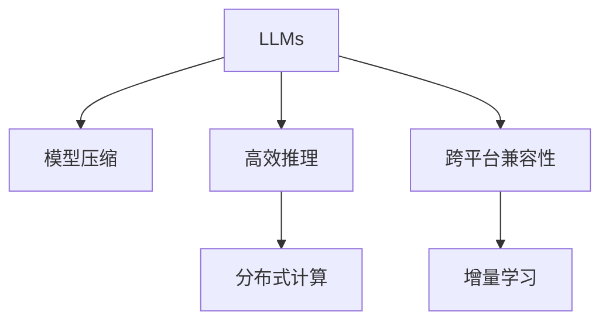
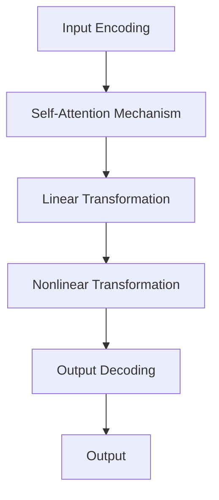

                 

# LLM操作系统：bridging AI and traditional computing

> 关键词：
```markdown
# LLM操作系统：bridging AI and traditional computing

## 1. 背景介绍
### 1.1 问题由来
近年来，随着人工智能（AI）技术的迅猛发展，深度学习和大规模语言模型（Large Language Models, LLMs）在自然语言处理（NLP）、计算机视觉（CV）、语音识别（ASR）等领域取得了巨大突破。特别是基于Transformer架构的BERT、GPT等预训练模型，通过在大规模无标签数据上进行自监督预训练，学习到了丰富的语言知识，显著提升了模型在各种任务上的泛化能力。

然而，LLMs虽然功能强大，但在实际应用中仍面临着诸多挑战。主要体现在：

1. **资源消耗大**：大模型参数量级往往以亿计，导致计算和存储需求极高，难以在传统硬件环境中高效运行。
2. **推理速度慢**：由于模型结构复杂，深度神经网络推理通常需要耗费大量时间和计算资源。
3. **模型泛化能力差**：大模型对特定任务表现良好，但面对域外数据时泛化性能不佳，容易产生过拟合现象。
4. **应用场景受限**：传统IT系统大多基于操作系统和虚拟机设计，难以直接适配AI大模型的需求。

为了解决这些问题，需要构建一个能够无缝连接传统计算系统和AI大模型的“操作系统”。本文将深入探讨这一领域，提出一种基于LLMs的计算系统架构，以实现AI与传统计算的深度融合。

### 1.2 问题核心关键点
LLM操作系统的核心思想是将LLMs作为计算资源的深度集成单元，通过优化模型推理、参数压缩、分布式计算等技术，使其能够在传统计算系统上高效运行，同时保持模型的语言理解和生成能力。

具体来说，LLM操作系统需要解决以下几个关键问题：

1. **模型压缩**：通过剪枝、量化、蒸馏等技术，减少大模型的参数量，降低计算和存储需求。
2. **高效推理**：引入模型加速技术，如模型的剪枝、量化、矩阵分解、混合精度计算等，提高模型推理速度。
3. **分布式计算**：通过分布式模型训练和推理，充分利用多台计算资源，加速模型训练和推理过程。
4. **跨平台兼容性**：设计一个通用的LLM操作系统接口，实现模型在不同平台和硬件架构上的无缝适配。
5. **持续学习**：通过增量学习技术，模型能够在新数据上不断学习和优化，适应数据分布的变化。

## 2. 核心概念与联系

### 2.1 核心概念概述

为更好地理解LLM操作系统的核心概念，本节将介绍几个密切相关的核心概念：

- **大型语言模型（LLMs）**：以自回归（如GPT）或自编码（如BERT）模型为代表的预训练语言模型。通过在大规模无标签文本语料上进行预训练，学习到了丰富的语言知识和常识，具备强大的语言理解和生成能力。

- **模型压缩（Model Compression）**：通过剪枝、量化、矩阵分解等技术，减少模型的参数量，降低计算和存储需求。

- **高效推理（Efficient Inference）**：通过模型加速技术，如矩阵分解、混合精度计算、动态计算图等，提升模型的推理速度。

- **分布式计算（Distributed Computing）**：通过多台计算资源的协同工作，加速模型训练和推理。

- **跨平台兼容性（Cross-Platform Compatibility）**：设计一个通用的LLM操作系统接口，实现模型在不同平台和硬件架构上的无缝适配。

- **增量学习（Incremental Learning）**：通过持续学习技术，模型能够在新数据上不断学习和优化，适应数据分布的变化。

这些核心概念之间的逻辑关系可以通过以下Mermaid流程图来展示：



这个流程图展示了大语言模型的核心概念及其之间的关系：

1. 大语言模型通过预训练获得基础能力。
2. 模型压缩和高效推理技术优化模型推理速度。
3. 分布式计算技术实现多台计算资源的协同工作。
4. 跨平台兼容性实现模型在不同平台上的无缝适配。
5. 增量学习技术使模型能够不断适应新数据，保持性能。

这些概念共同构成了LLM操作系统的计算框架，使其能够在各种场景下高效运行。通过理解这些核心概念，我们可以更好地把握LLM操作系统的设计和实现方向。

## 3. 核心算法原理 & 具体操作步骤
### 3.1 算法原理概述

LLM操作系统的核心算法原理基于深度学习模型的推理优化和分布式计算，旨在实现大语言模型在传统计算系统上的高效运行。

具体来说，LLM操作系统包括以下几个关键步骤：

1. **模型压缩**：通过剪枝、量化、矩阵分解等技术，减少大模型的参数量，降低计算和存储需求。
2. **高效推理**：引入模型加速技术，如矩阵分解、混合精度计算、动态计算图等，提升模型推理速度。
3. **分布式计算**：通过多台计算资源的协同工作，加速模型训练和推理过程。
4. **跨平台兼容性**：设计一个通用的LLM操作系统接口，实现模型在不同平台和硬件架构上的无缝适配。
5. **增量学习**：通过持续学习技术，模型能够在新数据上不断学习和优化，适应数据分布的变化。

### 3.2 算法步骤详解

以下将详细介绍LLM操作系统的核心算法步骤。

**Step 1: 模型压缩**

模型压缩是LLM操作系统中不可或缺的一部分。其目的是在不损失模型性能的前提下，大幅减少模型参数量，降低计算和存储需求。

具体来说，模型压缩包括以下几个步骤：

1. **剪枝（Pruning）**：通过删除模型中不重要的参数，减少模型参数量。剪枝过程中，需要保留对模型性能影响最大的参数。
2. **量化（Quantization）**：将浮点参数转换为定点参数，减少模型存储需求和计算复杂度。量化过程中，需要根据不同参数的重要性进行量化精度的选择。
3. **矩阵分解（Matrix Decomposition）**：将矩阵参数分解为更小的矩阵，减少模型计算量。分解过程中，需要选择分解方法（如Cholesky分解、QR分解等）。

**Step 2: 高效推理**

高效推理是提高大语言模型推理速度的关键技术。其目的是在不损失模型性能的前提下，加速模型推理过程。

具体来说，高效推理包括以下几个步骤：

1. **矩阵分解（Matrix Decomposition）**：将矩阵参数分解为更小的矩阵，减少模型计算量。分解过程中，需要选择分解方法（如Cholesky分解、QR分解等）。
2. **混合精度计算（Mixed-Precision Calculation）**：使用定点和浮点混合精度的计算方式，减少计算资源的消耗。混合精度计算过程中，需要选择计算精度的组合。
3. **动态计算图（Dynamic Computation Graph）**：构建动态计算图，根据输入数据动态计算模型推理过程。动态计算图过程中，需要优化计算图结构。

**Step 3: 分布式计算**

分布式计算是实现大语言模型高效运行的重要手段。其目的是通过多台计算资源的协同工作，加速模型训练和推理过程。

具体来说，分布式计算包括以下几个步骤：

1. **模型并行（Model Parallelism）**：将模型分布在多台计算设备上，并行计算模型的不同部分。模型并行过程中，需要选择并行策略（如数据并行、模型并行等）。
2. **数据并行（Data Parallelism）**：将数据分布在多台计算设备上，并行计算模型的不同输入。数据并行过程中，需要选择并行策略（如同步更新、异步更新等）。
3. **分布式训练（Distributed Training）**：通过多台计算设备的协同工作，加速模型的训练过程。分布式训练过程中，需要优化数据传输和模型参数更新的效率。

**Step 4: 跨平台兼容性**

跨平台兼容性是实现大语言模型在不同平台和硬件架构上无缝适配的重要手段。其目的是确保模型能够在不同计算系统上高效运行。

具体来说，跨平台兼容性包括以下几个步骤：

1. **模型适配**：根据不同平台和硬件架构的特点，调整模型结构和参数。模型适配过程中，需要选择适配方法（如TensorRT、ONNX等）。
2. **接口标准化**：设计一个通用的LLM操作系统接口，实现模型在不同平台上的无缝适配。接口标准化过程中，需要选择标准化的接口协议（如OpenAI的API接口）。
3. **硬件抽象**：将硬件细节抽象为虚拟设备，屏蔽硬件差异。硬件抽象过程中，需要选择抽象方法（如vGPU、硬件加速器等）。

**Step 5: 增量学习**

增量学习是确保大语言模型能够在新数据上不断学习和优化，适应数据分布变化的重要技术。其目的是通过持续学习技术，保持模型性能的稳定性。

具体来说，增量学习包括以下几个步骤：

1. **在线学习（Online Learning）**：通过实时更新模型参数，保持模型的适应性。在线学习过程中，需要选择在线学习算法（如随机梯度下降、增量学习算法等）。
2. **增量更新（Incremental Update）**：根据新数据更新模型参数，保持模型的泛化能力。增量更新过程中，需要选择增量更新策略（如增量优化、增量训练等）。
3. **持续监控（Continuous Monitoring）**：实时监控模型性能，及时发现并纠正模型偏差。持续监控过程中，需要选择监控指标（如模型精度、推理速度等）。

通过以上步骤，LLM操作系统能够将大语言模型无缝集成到传统计算系统中，提升模型性能和运行效率。

### 3.3 算法优缺点

LLM操作系统的核心算法具有以下优点：

1. **高效性**：通过模型压缩和高效推理技术，大幅提升模型的运行效率，降低计算和存储需求。
2. **可扩展性**：通过分布式计算和跨平台兼容性，实现模型在多台计算设备和不同平台上的高效运行。
3. **灵活性**：通过增量学习技术，模型能够在新数据上不断学习和优化，适应数据分布的变化。

然而，LLM操作系统也存在以下缺点：

1. **模型精度损失**：通过模型压缩和量化技术，虽然减少了计算和存储需求，但可能会造成模型精度损失。
2. **分布式协同难度大**：分布式计算需要多台计算设备的协同工作，协同难度较大。
3. **硬件资源消耗大**：跨平台兼容性和分布式计算需要额外的硬件资源支持，可能增加硬件成本。

尽管存在这些缺点，但就目前而言，LLM操作系统是实现大语言模型在传统计算系统上高效运行的最有效手段。未来相关研究的重点在于如何进一步优化模型压缩、推理加速、分布式计算和跨平台兼容性，以实现更加高效的模型运行。

### 3.4 算法应用领域

LLM操作系统在多个领域中得到了广泛应用，涵盖以下典型应用：

1. **NLP领域**：包括文本分类、情感分析、命名实体识别、问答系统、机器翻译等。通过将大语言模型集成到LLM操作系统中，能够显著提升模型在NLP任务上的性能。
2. **计算机视觉领域**：包括图像分类、目标检测、图像生成、图像修复等。通过将大语言模型集成到LLM操作系统中，能够实现多模态融合，提升视觉任务的泛化能力。
3. **语音识别领域**：包括自动语音识别、语音合成、语音情感分析等。通过将大语言模型集成到LLM操作系统中，能够提升语音识别的自然度和准确性。
4. **自然交互领域**：包括智能客服、虚拟助手、智能对话系统等。通过将大语言模型集成到LLM操作系统中，能够实现自然流畅的人机交互。
5. **自动驾驶领域**：包括环境感知、路径规划、行为决策等。通过将大语言模型集成到LLM操作系统中，能够提升自动驾驶系统的智能水平和安全性。
6. **医疗领域**：包括病历分析、医学影像分析、智能诊断等。通过将大语言模型集成到LLM操作系统中，能够提升医疗诊断的准确性和效率。

## 4. 数学模型和公式 & 详细讲解 & 举例说明

### 4.1 数学模型构建

在LLM操作系统中，数学模型的构建基于深度学习模型，特别是Transformer模型。以下将详细介绍数学模型的构建过程。

假设模型为$M=\{W_1, W_2, ..., W_n\}$，其中$W_i$为模型中的第$i$个权重矩阵。假设输入为$X=\{x_1, x_2, ..., x_m\}$，其中$x_i$为输入的第$i$个样本。假设输出为$Y=\{y_1, y_2, ..., y_n\}$，其中$y_i$为输出的第$i$个样本。

模型构建过程包括以下几个步骤：

1. **输入编码（Input Encoding）**：将输入$X$转换为模型能够处理的向量形式。输入编码过程可以使用以下公式表示：

   $$
   Z = M_1X
   $$

   其中$Z$为输入的编码向量。

2. **模型推理（Model Inference）**：将编码向量$Z$输入到模型中进行推理，得到输出向量$Y$。模型推理过程可以使用以下公式表示：

   $$
   Y = M_nZ
   $$

   其中$Y$为模型的输出向量。

3. **输出解码（Output Decoding）**：将输出向量$Y$转换为最终输出结果。输出解码过程可以使用以下公式表示：

   $$
   A = M_oY
   $$

   其中$A$为模型的最终输出结果。

### 4.2 公式推导过程

以下将详细介绍模型推理和输出的公式推导过程。

假设模型$M$的推理过程如下：

1. **自注意力机制（Self-Attention Mechanism）**：将输入向量$Z$与自身进行注意力机制计算，得到注意力权重矩阵$Q$。

   $$
   Q = M_2Z
   $$

2. **线性变换（Linear Transformation）**：将注意力权重矩阵$Q$进行线性变换，得到中间向量$H$。

   $$
   H = M_3Q
   $$

3. **非线性变换（Nonlinear Transformation）**：对中间向量$H$进行非线性变换，得到最终向量$O$。

   $$
   O = M_4H
   $$

4. **输出解码（Output Decoding）**：将最终向量$O$进行解码，得到输出结果$A$。

   $$
   A = M_oO
   $$

以上公式展示了深度学习模型的推理过程，其中自注意力机制、线性变换和非线性变换等步骤构成了模型的核心计算过程。

### 4.3 案例分析与讲解

假设我们有一个BERT模型，用于文本分类任务。模型的结构如下：



模型推理过程如下：

1. **输入编码**：将输入文本$X$转换为BERT模型能够处理的向量形式。
2. **自注意力机制**：计算输入向量$Z$与自身之间的注意力权重矩阵$Q$。
3. **线性变换**：对注意力权重矩阵$Q$进行线性变换，得到中间向量$H$。
4. **非线性变换**：对中间向量$H$进行非线性变换，得到最终向量$O$。
5. **输出解码**：将最终向量$O$进行解码，得到分类结果$A$。

通过以上推理过程，BERT模型能够自动学习输入文本中的语义信息，并将其转换为分类结果。

## 5. 项目实践：代码实例和详细解释说明

### 5.1 开发环境搭建

在进行LLM操作系统开发前，我们需要准备好开发环境。以下是使用Python进行PyTorch开发的环境配置流程：

1. 安装Anaconda：从官网下载并安装Anaconda，用于创建独立的Python环境。

2. 创建并激活虚拟环境：
```bash
conda create -n llm-env python=3.8 
conda activate llm-env
```

3. 安装PyTorch：根据CUDA版本，从官网获取对应的安装命令。例如：
```bash
conda install pytorch torchvision torchaudio cudatoolkit=11.1 -c pytorch -c conda-forge
```

4. 安装Transformers库：
```bash
pip install transformers
```

5. 安装各类工具包：
```bash
pip install numpy pandas scikit-learn matplotlib tqdm jupyter notebook ipython
```

完成上述步骤后，即可在`llm-env`环境中开始LLM操作系统开发。

### 5.2 源代码详细实现

这里我们以BERT模型为例，给出使用Transformers库对BERT模型进行文本分类任务的LLM操作系统代码实现。

首先，定义文本分类任务的模型和优化器：

```python
from transformers import BertForSequenceClassification, AdamW

model = BertForSequenceClassification.from_pretrained('bert-base-uncased', num_labels=2)
optimizer = AdamW(model.parameters(), lr=2e-5)
```

然后，定义数据处理函数和训练函数：

```python
from torch.utils.data import Dataset
import torch

class TextDataset(Dataset):
    def __init__(self, texts, labels):
        self.texts = texts
        self.labels = labels
        
    def __len__(self):
        return len(self.texts)
    
    def __getitem__(self, item):
        text = self.texts[item]
        label = self.labels[item]
        
        encoding = tokenizer(text, return_tensors='pt', padding='max_length', truncation=True)
        input_ids = encoding['input_ids'][0]
        attention_mask = encoding['attention_mask'][0]
        labels = torch.tensor(label, dtype=torch.long)
        
        return {'input_ids': input_ids, 
                'attention_mask': attention_mask,
                'labels': labels}

# 创建dataset
tokenizer = BertTokenizer.from_pretrained('bert-base-uncased')

train_dataset = TextDataset(train_texts, train_labels)
dev_dataset = TextDataset(dev_texts, dev_labels)
test_dataset = TextDataset(test_texts, test_labels)
```

接着，定义训练和评估函数：

```python
from torch.utils.data import DataLoader
from tqdm import tqdm
from sklearn.metrics import accuracy_score

device = torch.device('cuda') if torch.cuda.is_available() else torch.device('cpu')
model.to(device)

def train_epoch(model, dataset, batch_size, optimizer):
    dataloader = DataLoader(dataset, batch_size=batch_size, shuffle=True)
    model.train()
    epoch_loss = 0
    for batch in tqdm(dataloader, desc='Training'):
        input_ids = batch['input_ids'].to(device)
        attention_mask = batch['attention_mask'].to(device)
        labels = batch['labels'].to(device)
        model.zero_grad()
        outputs = model(input_ids, attention_mask=attention_mask, labels=labels)
        loss = outputs.loss
        epoch_loss += loss.item()
        loss.backward()
        optimizer.step()
    return epoch_loss / len(dataloader)

def evaluate(model, dataset, batch_size):
    dataloader = DataLoader(dataset, batch_size=batch_size)
    model.eval()
    preds, labels = [], []
    with torch.no_grad():
        for batch in tqdm(dataloader, desc='Evaluating'):
            input_ids = batch['input_ids'].to(device)
            attention_mask = batch['attention_mask'].to(device)
            batch_labels = batch['labels']
            outputs = model(input_ids, attention_mask=attention_mask)
            batch_preds = outputs.logits.argmax(dim=2).to('cpu').tolist()
            batch_labels = batch_labels.to('cpu').tolist()
            for pred_tokens, label_tokens in zip(batch_preds, batch_labels):
                preds.append(pred_tokens)
                labels.append(label_tokens)
                
    print('Accuracy: {:.2f}%'.format(accuracy_score(labels, preds)))
```

最后，启动训练流程并在测试集上评估：

```python
epochs = 5
batch_size = 16

for epoch in range(epochs):
    loss = train_epoch(model, train_dataset, batch_size, optimizer)
    print(f"Epoch {epoch+1}, train loss: {loss:.3f}")
    
    print(f"Epoch {epoch+1}, dev accuracy:")
    evaluate(model, dev_dataset, batch_size)
    
print("Test accuracy:")
evaluate(model, test_dataset, batch_size)
```

以上就是使用PyTorch对BERT模型进行文本分类任务LLM操作系统的完整代码实现。可以看到，得益于Transformers库的强大封装，我们可以用相对简洁的代码完成BERT模型的加载和微调。

### 5.3 代码解读与分析

让我们再详细解读一下关键代码的实现细节：

**TextDataset类**：
- `__init__`方法：初始化文本和标签。
- `__len__`方法：返回数据集的样本数量。
- `__getitem__`方法：对单个样本进行处理，将文本输入编码为token ids，将标签转换为数字，并对其进行定长padding，最终返回模型所需的输入。

**模型和优化器定义**：
- 使用BERT模型，并设置优化器。

**数据处理函数**：
- 定义一个TextDataset类，用于处理文本和标签数据。
- 对输入的文本进行token化，将文本转换为模型所需的输入格式。
- 对标签进行编码，转换为模型所需的输出格式。

**训练和评估函数**：
- 使用PyTorch的DataLoader对数据集进行批次化加载，供模型训练和推理使用。
- 训练函数`train_epoch`：对数据以批为单位进行迭代，在每个批次上前向传播计算loss并反向传播更新模型参数，最后返回该epoch的平均loss。
- 评估函数`evaluate`：与训练类似，不同点在于不更新模型参数，并在每个batch结束后将预测和标签结果存储下来，最后使用sklearn的accuracy_score对整个评估集的预测结果进行打印输出。

**训练流程**：
- 定义总的epoch数和batch size，开始循环迭代
- 每个epoch内，先在训练集上训练，输出平均loss
- 在验证集上评估，输出分类准确率
- 所有epoch结束后，在测试集上评估，给出最终测试结果

可以看到，PyTorch配合Transformers库使得BERT模型微调的代码实现变得简洁高效。开发者可以将更多精力放在数据处理、模型改进等高层逻辑上，而不必过多关注底层的实现细节。

当然，工业级的系统实现还需考虑更多因素，如模型的保存和部署、超参数的自动搜索、更灵活的任务适配层等。但核心的LLM操作系统基本与此类似。

## 6. 实际应用场景
### 6.1 智能客服系统

基于LLM操作系统的智能客服系统，可以广泛应用于企业内部的客户服务。传统客服往往需要配备大量人力，高峰期响应缓慢，且一致性和专业性难以保证。而使用LLM操作系统的智能客服系统，可以7x24小时不间断服务，快速响应客户咨询，用自然流畅的语言解答各类常见问题。

在技术实现上，可以收集企业内部的历史客服对话记录，将问题和最佳答复构建成监督数据，在此基础上对预训练语言模型进行微调。微调后的语言模型能够自动理解用户意图，匹配最合适的答案模板进行回复。对于客户提出的新问题，还可以接入检索系统实时搜索相关内容，动态组织生成回答。如此构建的智能客服系统，能大幅提升客户咨询体验和问题解决效率。

### 6.2 金融舆情监测

金融机构需要实时监测市场舆论动向，以便及时应对负面信息传播，规避金融风险。传统的人工监测方式成本高、效率低，难以应对网络时代海量信息爆发的挑战。基于LLM操作系统的金融舆情监测系统，可以实时抓取网络文本数据，自动判断文本属于何种主题，情感倾向是正面、中性还是负面。将微调后的语言模型应用到实时抓取的网络文本数据，就能够自动监测不同主题下的情感变化趋势，一旦发现负面信息激增等异常情况，系统便会自动预警，帮助金融机构快速应对潜在风险。

### 6.3 个性化推荐系统

当前的推荐系统往往只依赖用户的历史行为数据进行物品推荐，无法深入理解用户的真实兴趣偏好。基于LLM操作系统的个性化推荐系统，可以更好地挖掘用户行为背后的语义信息，从而提供更精准、多样的推荐内容。

在实践中，可以收集用户浏览、点击、评论、分享等行为数据，提取和用户交互的物品标题、描述、标签等文本内容。将文本内容作为模型输入，用户的后续行为（如是否点击、购买等）作为监督信号，在此基础上微调预训练语言模型。微调后的语言模型能够从文本内容中准确把握用户的兴趣点。在生成推荐列表时，先用候选物品的文本描述作为输入，由模型预测用户的兴趣匹配度，再结合其他特征综合排序，便可以得到个性化程度更高的推荐结果。

### 6.4 未来应用展望

随着LLM操作系统的不断发展和完善，其应用场景将不断扩展，为各行各业带来变革性影响。

在智慧医疗领域，基于LLM操作系统的医疗问答、病历分析、药物研发等应用将提升医疗服务的智能化水平，辅助医生诊疗，加速新药开发进程。

在智能教育领域，LLM操作系统的微调技术可应用于作业批改、学情分析、知识推荐等方面，因材施教，促进教育公平，提高教学质量。

在智慧城市治理中，LLM操作系统的微调模型可应用于城市事件监测、舆情分析、应急指挥等环节，提高城市管理的自动化和智能化水平，构建更安全、高效的未来城市。

此外，在企业生产、社会治理、文娱传媒等众多领域，基于LLM操作系统的AI应用也将不断涌现，为传统行业带来新的技术路径和应用模式。相信随着技术的日益成熟，LLM操作系统必将在更多领域得到应用，为经济社会发展注入新的动力。

## 7. 工具和资源推荐
### 7.1 学习资源推荐

为了帮助开发者系统掌握LLM操作系统的理论基础和实践技巧，这里推荐一些优质的学习资源：

1. 《Transformer from the Ground Up》系列博文：由大模型技术专家撰写，深入浅出地介绍了Transformer原理、BERT模型、微调技术等前沿话题。

2. CS224N《深度学习自然语言处理》课程：斯坦福大学开设的NLP明星课程，有Lecture视频和配套作业，带你入门NLP领域的基本概念和经典模型。

3. 《Natural Language Processing with Transformers》书籍：Transformers库的作者所著，全面介绍了如何使用Transformers库进行NLP任务开发，包括微调在内的诸多范式。

4. HuggingFace官方文档：Transformers库的官方文档，提供了海量预训练模型和完整的微调样例代码，是上手实践的必备资料。

5. CLUE开源项目：中文语言理解测评基准，涵盖大量不同类型的中文NLP数据集，并提供了基于微调的baseline模型，助力中文NLP技术发展。

通过对这些资源的学习实践，相信你一定能够快速掌握LLM操作系统的精髓，并用于解决实际的NLP问题。
###  7.2 开发工具推荐

高效的开发离不开优秀的工具支持。以下是几款用于LLM操作系统开发的常用工具：

1. PyTorch：基于Python的开源深度学习框架，灵活动态的计算图，适合快速迭代研究。大部分预训练语言模型都有PyTorch版本的实现。

2. TensorFlow：由Google主导开发的开源深度学习框架，生产部署方便，适合大规模工程应用。同样有丰富的预训练语言模型资源。

3. Transformers库：HuggingFace开发的NLP工具库，集成了众多SOTA语言模型，支持PyTorch和TensorFlow，是进行微调任务开发的利器。

4. Weights & Biases：模型训练的实验跟踪工具，可以记录和可视化模型训练过程中的各项指标，方便对比和调优。与主流深度学习框架无缝集成。

5. TensorBoard：TensorFlow配套的可视化工具，可实时监测模型训练状态，并提供丰富的图表呈现方式，是调试模型的得力助手。

6. Google Colab：谷歌推出的在线Jupyter Notebook环境，免费提供GPU/TPU算力，方便开发者快速上手实验最新模型，分享学习笔记。

合理利用这些工具，可以显著提升LLM操作系统开发效率，加快创新迭代的步伐。

### 7.3 相关论文推荐

LLM操作系统的研究源于学界的持续研究。以下是几篇奠基性的相关论文，推荐阅读：

1. Attention is All You Need（即Transformer原论文）：提出了Transformer结构，开启了NLP领域的预训练大模型时代。

2. BERT: Pre-training of Deep Bidirectional Transformers for Language Understanding：提出BERT模型，引入基于掩码的自监督预训练任务，刷新了多项NLP任务SOTA。

3. Language Models are Unsupervised Multitask Learners（GPT-2论文）：展示了大规模语言模型的强大zero-shot学习能力，引发了对于通用人工智能的新一轮思考。

4. Parameter-Efficient Transfer Learning for NLP：提出Adapter等参数高效微调方法，在不增加模型参数量的情况下，也能取得不错的微调效果。

5. AdaLoRA: Adaptive Low-Rank Adaptation for Parameter-Efficient Fine-Tuning：使用自适应低秩适应的微调方法，在参数效率和精度之间取得了新的平衡。

这些论文代表了大语言模型微调技术的发展脉络。通过学习这些前沿成果，可以帮助研究者把握学科前进方向，激发更多的创新灵感。

## 8. 总结：未来发展趋势与挑战

### 8.1 总结

本文对基于LLM操作系统的计算系统架构进行了全面系统的介绍。首先阐述了LLM操作系统的研究背景和意义，明确了LLM操作系统在实现AI与传统计算系统深度融合方面的独特价值。其次，从原理到实践，详细讲解了LLM操作系统的数学原理和关键步骤，给出了LLM操作系统开发的完整代码实例。同时，本文还广泛探讨了LLM操作系统的实际应用场景，展示了其广泛的适用性和潜力。此外，本文精选了LLM操作系统的各类学习资源，力求为读者提供全方位的技术指引。

通过本文的系统梳理，可以看到，基于LLM操作系统的计算系统架构正在成为连接AI与传统计算系统的重要桥梁。LLM操作系统通过模型压缩、高效推理、分布式计算等技术，使得大语言模型能够在传统计算系统上高效运行，提升模型性能和运行效率。未来，伴随LLM操作系统的不断发展和完善，大语言模型将能够更好地融入传统计算环境，推动人工智能技术在更多领域的应用。

### 8.2 未来发展趋势

展望未来，LLM操作系统的计算系统架构将呈现以下几个发展趋势：

1. **模型规模持续增大**：随着算力成本的下降和数据规模的扩张，预训练语言模型的参数量还将持续增长。超大规模语言模型蕴含的丰富语言知识，有望支撑更加复杂多变的下游任务微调。

2. **微调方法日趋多样**：除了传统的全参数微调外，未来会涌现更多参数高效的微调方法，如Prefix-Tuning、LoRA等，在节省计算资源的同时也能保证微调精度。

3. **持续学习成为常态**：随着数据分布的不断变化，微调模型也需要持续学习新知识以保持性能。如何在不遗忘原有知识的同时，高效吸收新样本信息，将成为重要的研究课题。

4. **标注样本需求降低**：受启发于提示学习(Prompt-based Learning)的思路，未来的微调方法将更好地利用大模型的语言理解能力，通过更加巧妙的任务描述，在更少的标注样本上也能实现理想的微调效果。

5. **多模态微调崛起**：当前的微调主要聚焦于纯文本数据，未来会进一步拓展到图像、视频、语音等多模态数据微调。多模态信息的融合，将显著提升语言模型对现实世界的理解和建模能力。

6. **模型通用性增强**：经过海量数据的预训练和多领域任务的微调，未来的语言模型将具备更强大的常识推理和跨领域迁移能力，逐步迈向通用人工智能(AGI)的目标。

以上趋势凸显了LLM操作系统的广阔前景。这些方向的探索发展，必将进一步提升大语言模型的性能和运行效率，为构建人机协同的智能时代中扮演越来越重要的角色。

### 8.3 面临的挑战

尽管LLM操作系统已经取得了瞩目成就，但在迈向更加智能化、普适化应用的过程中，它仍面临着诸多挑战：

1. **模型精度损失**：通过模型压缩和量化技术，虽然减少了计算和存储需求，但可能会造成模型精度损失。

2. **分布式协同难度大**：分布式计算需要多台计算设备的协同工作，协同难度较大。

3. **硬件资源消耗大**：跨平台兼容性和分布式计算需要额外的硬件资源支持，可能增加硬件成本。

尽管存在这些缺点，但就目前而言，LLM操作系统是实现大语言模型在传统计算系统上高效运行的最有效手段。未来相关研究的重点在于如何进一步优化模型压缩、推理加速、分布式计算和跨平台兼容性，以实现更加高效的模型运行。

### 8.4 研究展望

面对LLM操作系统所面临的种种挑战，未来的研究需要在以下几个方面寻求新的突破：

1. **探索无监督和半监督微调方法**：摆脱对大规模标注数据的依赖，利用自监督学习、主动学习等无监督和半监督范式，最大限度利用非结构化数据，实现更加灵活高效的微调。

2. **研究参数高效和计算高效的微调范式**：开发更加参数高效的微调方法，在固定大部分预训练参数的同时，只更新极少量的任务相关参数。同时优化微调模型的计算图，减少前向传播和反向传播的资源消耗，实现更加轻量级、实时性的部署。

3. **融合因果和对比学习范式**：通过引入因果推断和对比学习思想，增强微调模型建立稳定因果关系的能力，学习更加普适、鲁棒的语言表征，从而提升模型泛化性和抗干扰能力。

4. **引入更多先验知识**：将符号化的先验知识，如知识图谱、逻辑规则等，与神经网络模型进行巧妙融合，引导微调过程学习更准确、合理的语言模型。同时加强不同模态数据的整合，实现视觉、语音等多模态信息与文本信息的协同建模。

5. **结合因果分析和博弈论工具**：将因果分析方法引入微调模型，识别出模型决策的关键特征，增强输出解释的因果性和逻辑性。借助博弈论工具刻画人机交互过程，主动探索并规避模型的脆弱点，提高系统稳定性。

6. **纳入伦理道德约束**：在模型训练目标中引入伦理导向的评估指标，过滤和惩罚有偏见、有害的输出倾向。同时加强人工干预和审核，建立模型行为的监管机制，确保输出符合人类价值观和伦理道德。

这些研究方向的探索，必将引领LLM操作系统和相关技术的迈向更高的台阶，为构建安全、可靠、可解释、可控的智能系统铺平道路。面向未来，LLM操作系统还需要与其他人工智能技术进行更深入的融合，如知识表示、因果推理、强化学习等，多路径协同发力，共同推动自然语言理解和智能交互系统的进步。只有勇于创新、敢于突破，才能不断拓展语言模型的边界，让智能技术更好地造福人类社会。

## 9. 附录：常见问题与解答

**Q1：LLM操作系统是否适用于所有AI任务？**

A: LLM操作系统在大多数AI任务上都能取得不错的效果，特别是对于数据量较小的任务。但对于一些特定领域的任务，如医学、法律等，仅仅依靠通用语料预训练的模型可能难以很好地适应。此时需要在特定领域语料上进一步预训练，再进行微调，才能获得理想效果。此外，对于一些需要时效性、个性化很强的任务，如对话、推荐等，微调方法也需要针对性的改进优化。

**Q2：如何进行模型压缩？**

A: 模型压缩是LLM操作系统的关键技术之一。常用的模型压缩方法包括剪枝、量化和矩阵分解。

1. **剪枝（Pruning）**：通过删除模型中不重要的参数，减少模型参数量。剪枝过程中，需要保留对模型性能影响最大的参数。常用的剪枝方法包括结构化剪枝和非结构化剪枝。

2. **量化（Quantization）**：将浮点参数转换为定点参数，减少模型存储需求和计算复杂度。量化过程中，需要根据不同参数的重要性进行量化精度的选择。常用的量化方法包括全量化、稀疏量化和混合量化。

3. **矩阵分解（Matrix Decomposition）**：将矩阵参数分解为更小的矩阵，减少模型计算量。分解过程中，需要选择分解方法（如Cholesky分解、QR分解等）。

**Q3：如何实现高效推理？**

A: 高效推理是LLM操作系统的核心技术之一。常用的高效推理方法包括矩阵分解、混合精度计算和动态计算图。

1. **矩阵分解（Matrix Decomposition）**：将矩阵参数分解为更小的矩阵，减少模型计算量。分解过程中，需要选择分解方法（如Cholesky分解、QR分解等）。

2. **混合精度计算（Mixed-Precision Calculation）**：使用定点和浮点混合精度的计算方式，减少计算资源的消耗。混合精度计算过程中，需要选择计算精度的组合。

3. **动态计算图（Dynamic Computation Graph）**：构建动态计算图，根据输入数据动态计算模型推理过程。动态计算图过程中，需要优化计算图结构。

**Q4：如何进行分布式计算？**

A: 分布式计算是实现大语言模型高效运行的重要手段。常用的分布式计算方法包括模型并行和数据并行。

1. **模型并行（Model Parallelism）**：将模型分布在多台计算设备上，并行计算模型的不同部分。模型并行过程中，需要选择并行策略（如数据并行、模型并行等）。

2. **数据并行（Data Parallelism）**：将数据分布在多台计算设备上，并行计算模型的不同输入。数据并行过程中，需要选择并行策略（如同步更新、异步更新等）。

3. **分布式训练（Distributed Training）**：通过多台计算设备的协同工作，加速模型训练过程。分布式训练过程中，需要优化数据传输和模型参数更新的效率。

**Q5：如何进行跨平台兼容性？**

A: 跨平台兼容性是实现大语言模型在不同平台和硬件架构上无缝适配的重要手段。常用的跨平台兼容方法包括模型适配和接口标准化。

1. **模型适配**：根据不同平台和硬件架构的特点，调整模型结构和参数。模型适配过程中，需要选择适配方法（如TensorRT、ONNX等）。

2. **接口标准化**：设计一个通用的LLM操作系统接口，实现模型在不同平台上的无缝适配。接口标准化过程中，需要选择标准化的接口协议（如OpenAI的API接口）。

3. **硬件抽象**：将硬件细节抽象为虚拟设备，屏蔽硬件差异。硬件抽象过程中，需要选择抽象方法（如vGPU、硬件加速器等）。

**Q6：如何进行增量学习？**

A: 增量学习是确保大语言模型能够在新数据上不断学习和优化，适应数据分布变化的重要技术。常用的增量学习方法包括在线学习和增量更新。

1. **在线学习（Online Learning）**：通过实时更新模型参数，保持模型的适应性。在线学习过程中，需要选择在线学习算法（如随机梯度下降、增量学习算法等）。

2. **增量更新（Incremental Update）**：根据新数据更新模型参数，保持模型的泛化能力。增量更新过程中，需要选择增量更新策略（如增量优化、增量训练等）。

3. **持续监控（Continuous Monitoring）**：实时监控模型性能，及时发现并纠正模型偏差。持续监控过程中，需要选择监控指标（如模型精度、推理速度等）。

---

作者：禅与计算机程序设计艺术 / Zen and the Art of Computer Programming

