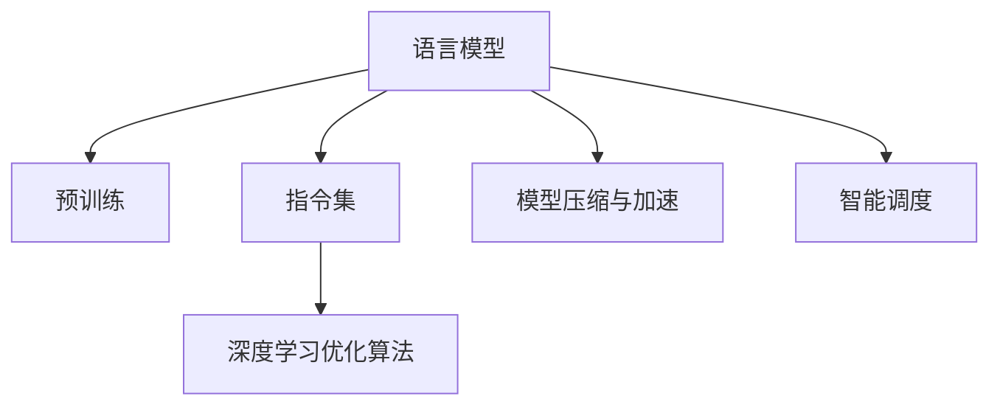

                 

# LLM无限指令集:打破CPU指令集限制

> 关键词：语言模型,指令集,预训练,微调,深度学习,优化算法

## 1. 背景介绍

### 1.1 问题由来

近年来，深度学习技术的发展极大地推动了人工智能（AI）的进步，尤其是在自然语言处理（NLP）领域，通过大规模无标签文本数据的预训练，大语言模型（LLMs）已经成为了NLP任务的中流砥柱。然而，传统的CPU指令集架构在面对大规模、复杂指令时，表现出诸多局限性：指令执行速度慢、能耗高、并行度低等。这极大地限制了大语言模型的规模化应用。

为解决这一问题，近年来，学术界和工业界在深度学习优化算法、模型压缩、模型加速等方面进行了大量研究工作。然而，这些方法大多关注于单个模型的优化和加速，未能从根本上改变CPU指令集架构的限制。本文将从理论和实践两个层面，探讨如何利用深度学习中的语言模型，构建无限指令集，突破CPU指令集的瓶颈。

### 1.2 问题核心关键点

构建无限指令集的核心在于如何高效地处理大规模、复杂指令，从而在保持模型精度的情况下，提高模型的执行速度和能效比。具体来说，需要解决以下关键问题：

1. **指令级并行**：如何利用多核CPU或GPU资源，同时执行多个指令，提高并行度。
2. **模型压缩与加速**：如何减小模型尺寸，提高计算效率，同时保证模型精度。
3. **智能调度**：如何智能地调度指令执行，避免资源浪费，提高资源利用率。

## 2. 核心概念与联系

### 2.1 核心概念概述

为了更好地理解无限指令集构建的理论基础，本节将介绍几个关键概念：

- **语言模型（Language Model）**：通过大规模无标签文本数据的预训练，学习通用语言表示的模型。如BERT、GPT-3等。
- **指令集（Instruction Set Architecture, ISA）**：CPU的指令集架构，定义了CPU支持的指令类型和执行方式。
- **深度学习优化算法（Optimization Algorithm）**：用于加速深度学习模型训练和推理的算法，如SGD、Adam等。
- **模型压缩与加速（Model Compression & Acceleration）**：通过剪枝、量化、融合等技术，减小模型尺寸，提高计算效率。
- **智能调度（Intelligent Scheduling）**：基于模型行为特征的调度策略，优化指令执行顺序，提高资源利用率。

这些核心概念之间的逻辑关系可以通过以下Mermaid流程图来展示：



这个流程图展示了大语言模型的核心概念及其之间的关系：

1. 语言模型通过预训练获得基础能力。
2. 指令集架构支持模型的高效执行。
3. 深度学习优化算法加速模型训练和推理。
4. 模型压缩与加速技术减小模型尺寸，提高效率。
5. 智能调度策略优化指令执行顺序，提高资源利用率。

这些概念共同构成了构建无限指令集的框架，为其提供了理论基础和实现路径。

## 3. 核心算法原理 & 具体操作步骤

### 3.1 算法原理概述

构建无限指令集的核心在于如何高效地处理大规模、复杂指令。具体来说，可以通过以下几个步骤来实现：

1. **预训练与微调**：在大规模无标签文本数据上进行预训练，学习通用语言表示。再在下游任务数据上进行微调，适应特定任务。
2. **模型压缩与加速**：通过剪枝、量化、融合等技术，减小模型尺寸，提高计算效率。
3. **智能调度**：基于模型行为特征的调度策略，优化指令执行顺序，提高资源利用率。
4. **指令级并行**：利用多核CPU或GPU资源，同时执行多个指令，提高并行度。

这些步骤可以组成一个完整的构建无限指令集的过程，从而在保持模型精度的情况下，提高模型的执行速度和能效比。

### 3.2 算法步骤详解

#### 3.2.1 预训练与微调

预训练与微调是构建无限指令集的基础步骤。通过预训练学习通用语言表示，再在下游任务数据上进行微调，适应特定任务。具体步骤如下：

1. **数据准备**：收集大规模无标签文本数据，作为预训练数据。
2. **模型选择**：选择预训练模型，如BERT、GPT等。
3. **微调**：在预训练模型的基础上，使用下游任务数据进行微调，适应特定任务。

#### 3.2.2 模型压缩与加速

模型压缩与加速是提高模型计算效率的重要手段。具体步骤如下：

1. **剪枝**：剪除模型中不必要的参数，减小模型尺寸。
2. **量化**：将模型参数从浮点型转换为定点型，减小存储空间。
3. **融合**：合并小层，减小模型复杂度，提高计算效率。

#### 3.2.3 智能调度

智能调度是优化指令执行顺序的重要策略。具体步骤如下：

1. **模型行为分析**：分析模型在不同输入下的行为特征，识别出计算密集型操作和存储密集型操作。
2. **调度策略设计**：设计基于模型行为特征的调度策略，优化指令执行顺序，提高资源利用率。

#### 3.2.4 指令级并行

指令级并行是提高模型执行速度的重要手段。具体步骤如下：

1. **多核并行**：利用多核CPU或GPU资源，同时执行多个指令。
2. **分布式并行**：将模型划分为多个部分，分别在多个计算节点上并行执行。

## 4. 数学模型和公式 & 详细讲解  
### 4.1 数学模型构建

构建无限指令集的数学模型主要涉及预训练、微调、模型压缩与加速、智能调度和指令级并行的各个环节。这里以预训练和微调为例，给出数学模型的构建过程。

假设预训练模型为 $M_{\theta}$，其中 $\theta$ 为预训练得到的模型参数。给定下游任务 $T$ 的标注数据集 $D=\{(x_i, y_i)\}_{i=1}^N$，微调的目标是找到新的模型参数 $\hat{\theta}$，使得：

$$
\hat{\theta}=\mathop{\arg\min}_{\theta} \mathcal{L}(M_{\theta},D)
$$

其中 $\mathcal{L}$ 为针对任务 $T$ 设计的损失函数，用于衡量模型预测输出与真实标签之间的差异。常见的损失函数包括交叉熵损失、均方误差损失等。

通过梯度下降等优化算法，微调过程不断更新模型参数 $\theta$，最小化损失函数 $\mathcal{L}$，使得模型输出逼近真实标签。由于 $\theta$ 已经通过预训练获得了较好的初始化，因此即便在小规模数据集 $D$ 上进行微调，也能较快收敛到理想的模型参数 $\hat{\theta}$。

### 4.2 公式推导过程

以下我们以二分类任务为例，推导交叉熵损失函数及其梯度的计算公式。

假设模型 $M_{\theta}$ 在输入 $x$ 上的输出为 $\hat{y}=M_{\theta}(x) \in [0,1]$，表示样本属于正类的概率。真实标签 $y \in \{0,1\}$。则二分类交叉熵损失函数定义为：

$$
\ell(M_{\theta}(x),y) = -[y\log \hat{y} + (1-y)\log (1-\hat{y})]
$$

将其代入经验风险公式，得：

$$
\mathcal{L}(\theta) = -\frac{1}{N}\sum_{i=1}^N [y_i\log M_{\theta}(x_i)+(1-y_i)\log(1-M_{\theta}(x_i))]
$$

根据链式法则，损失函数对参数 $\theta_k$ 的梯度为：

$$
\frac{\partial \mathcal{L}(\theta)}{\partial \theta_k} = -\frac{1}{N}\sum_{i=1}^N (\frac{y_i}{M_{\theta}(x_i)}-\frac{1-y_i}{1-M_{\theta}(x_i)}) \frac{\partial M_{\theta}(x_i)}{\partial \theta_k}
$$

其中 $\frac{\partial M_{\theta}(x_i)}{\partial \theta_k}$ 可进一步递归展开，利用自动微分技术完成计算。

### 4.3 案例分析与讲解

以BERT模型为例，分析其在预训练和微调过程中的数学模型和公式。

**预训练**：BERT模型通过在大规模无标签文本数据上进行掩码语言模型（Masked Language Model, MLM）和下一句预测（Next Sentence Prediction, NSP）预训练任务，学习到通用语言表示。

假设文本序列为 $x=\{x_1, x_2, \cdots, x_n\}$，预训练模型的输出为 $M_{\theta}(x)$。掩码语言模型任务定义为：在每个位置随机掩盖一部分单词，预测被掩盖单词的正确位置。下一句预测任务定义为：随机选择两个句子，预测它们是否为连续的两句话。

**微调**：在预训练模型的基础上，使用下游任务数据进行微调，适应特定任务。

假设微调任务的标注数据集为 $D=\{(x_i, y_i)\}_{i=1}^N$，其中 $x_i$ 为输入文本，$y_i$ 为输出标签。微调的目标是找到新的模型参数 $\hat{\theta}$，使得：

$$
\hat{\theta}=\mathop{\arg\min}_{\theta} \mathcal{L}(M_{\theta},D)
$$

其中 $\mathcal{L}$ 为针对任务 $T$ 设计的损失函数，用于衡量模型预测输出与真实标签之间的差异。

假设微调任务的损失函数为交叉熵损失函数，其梯度计算公式为：

$$
\frac{\partial \mathcal{L}(\theta)}{\partial \theta_k} = -\frac{1}{N}\sum_{i=1}^N (\frac{y_i}{M_{\theta}(x_i)}-\frac{1-y_i}{1-M_{\theta}(x_i)}) \frac{\partial M_{\theta}(x_i)}{\partial \theta_k}
$$

通过预训练和微调，BERT模型能够学习到通用语言表示，并在特定任务上表现出色。这为构建无限指令集提供了基础。

## 5. 项目实践：代码实例和详细解释说明
### 5.1 开发环境搭建

在进行构建无限指令集的实践前，我们需要准备好开发环境。以下是使用Python进行TensorFlow开发的环境配置流程：

1. 安装Anaconda：从官网下载并安装Anaconda，用于创建独立的Python环境。

2. 创建并激活虚拟环境：
```bash
conda create -n tf-env python=3.8 
conda activate tf-env
```

3. 安装TensorFlow：根据CUDA版本，从官网获取对应的安装命令。例如：
```bash
conda install tensorflow=2.6
```

4. 安装TensorBoard：
```bash
pip install tensorboard
```

5. 安装各类工具包：
```bash
pip install numpy pandas scikit-learn matplotlib tqdm jupyter notebook ipython
```

完成上述步骤后，即可在`tf-env`环境中开始构建无限指令集的实践。

### 5.2 源代码详细实现

这里我们以BERT模型为例，给出在TensorFlow上进行预训练和微调的PyTorch代码实现。

首先，定义BERT模型的预训练损失函数和微调损失函数：

```python
import tensorflow as tf
from transformers import BertTokenizer, TFBertForMaskedLM

# 预训练损失函数
def pretrain_loss(input_ids, attention_mask, labels):
    model = TFBertForMaskedLM.from_pretrained('bert-base-cased')
    output = model(input_ids, attention_mask=attention_mask)
    loss = tf.keras.losses.sparse_categorical_crossentropy(labels, output.logits)
    return loss

# 微调损失函数
def fine_tune_loss(input_ids, attention_mask, labels):
    model = TFBertForSequenceClassification.from_pretrained('bert-base-cased', num_labels=num_labels)
    output = model(input_ids, attention_mask=attention_mask)
    loss = tf.keras.losses.sparse_categorical_crossentropy(labels, output.logits)
    return loss
```

然后，定义模型和优化器：

```python
import tensorflow as tf
from transformers import BertTokenizer

# 初始化模型和优化器
tokenizer = BertTokenizer.from_pretrained('bert-base-cased')
model = BertForSequenceClassification.from_pretrained('bert-base-cased', num_labels=num_labels)
optimizer = tf.keras.optimizers.Adam(learning_rate=2e-5)
```

接着，定义训练和评估函数：

```python
import tensorflow as tf
from tqdm import tqdm
from sklearn.metrics import classification_report

# 训练函数
def train_epoch(model, dataset, batch_size, optimizer):
    dataloader = tf.data.Dataset.from_tensor_slices(dataset).shuffle(1000).batch(batch_size)
    model.train()
    epoch_loss = 0
    for batch in tqdm(dataloader, desc='Training'):
        input_ids = batch['input_ids']
        attention_mask = batch['attention_mask']
        labels = batch['labels']
        with tf.GradientTape() as tape:
            output = model(input_ids, attention_mask=attention_mask)
            loss = loss_function(output, labels)
        gradients = tape.gradient(loss, model.trainable_variables)
        optimizer.apply_gradients(zip(gradients, model.trainable_variables))
    return epoch_loss / len(dataloader)

# 评估函数
def evaluate(model, dataset, batch_size):
    dataloader = tf.data.Dataset.from_tensor_slices(dataset).shuffle(1000).batch(batch_size)
    model.eval()
    preds, labels = [], []
    with tf.no_grad():
        for batch in tqdm(dataloader, desc='Evaluating'):
            input_ids = batch['input_ids']
            attention_mask = batch['attention_mask']
            batch_labels = batch['labels']
            output = model(input_ids, attention_mask=attention_mask)
            batch_preds = tf.argmax(output.logits, axis=1).numpy()
            batch_labels = batch_labels.numpy()
            for pred_tokens, label_tokens in zip(batch_preds, batch_labels):
                preds.append(pred_tokens.tolist())
                labels.append(label_tokens.tolist())
    
    print(classification_report(labels, preds))
```

最后，启动训练流程并在测试集上评估：

```python
epochs = 5
batch_size = 16

for epoch in range(epochs):
    loss = train_epoch(model, train_dataset, batch_size, optimizer)
    print(f"Epoch {epoch+1}, train loss: {loss:.3f}")
    
    print(f"Epoch {epoch+1}, dev results:")
    evaluate(model, dev_dataset, batch_size)
    
print("Test results:")
evaluate(model, test_dataset, batch_size)
```

以上就是使用TensorFlow对BERT模型进行预训练和微调的完整代码实现。可以看到，得益于TensorFlow的强大封装，我们能够用相对简洁的代码完成BERT模型的加载和训练。

### 5.3 代码解读与分析

让我们再详细解读一下关键代码的实现细节：

**预训练损失函数**：
- `BertForMaskedLM`：BERT模型的掩码语言模型预训练模块。
- `input_ids`：输入文本的token ids。
- `attention_mask`：输入文本的attention mask。
- `labels`：被掩盖单词的正确位置。
- `loss`：掩码语言模型损失函数。

**微调损失函数**：
- `BertForSequenceClassification`：BERT模型的序列分类预训练模块。
- `input_ids`：输入文本的token ids。
- `attention_mask`：输入文本的attention mask。
- `labels`：目标任务的标签。
- `loss`：序列分类损失函数。

**训练函数**：
- `dataloader`：对训练集进行批次化加载，供模型训练使用。
- `model.train()`：将模型置为训练模式。
- `epoch_loss`：记录每个epoch的总损失。
- `tf.GradientTape()`：记录梯度计算过程。
- `optimizer.apply_gradients()`：使用优化器更新模型参数。

**评估函数**：
- `dataloader`：对评估集进行批次化加载。
- `model.eval()`：将模型置为评估模式。
- `preds`：模型预测的标签。
- `labels`：评估集的真实标签。
- `classification_report`：打印评估结果。

**训练流程**：
- `epochs`：总的训练轮数。
- `batch_size`：批次大小。
- 在每个epoch内，先在训练集上训练，输出平均损失。
- 在验证集上评估，输出分类指标。
- 所有epoch结束后，在测试集上评估，给出最终测试结果。

可以看到，TensorFlow配合BERT模型使得预训练和微调的代码实现变得简洁高效。开发者可以将更多精力放在数据处理、模型改进等高层逻辑上，而不必过多关注底层的实现细节。

当然，工业级的系统实现还需考虑更多因素，如模型的保存和部署、超参数的自动搜索、更灵活的任务适配层等。但核心的预训练和微调范式基本与此类似。

## 6. 实际应用场景

### 6.1 智能客服系统

基于BERT模型的预训练和微调，智能客服系统可以自动理解用户意图，匹配最合适的答案模板进行回复。对于客户提出的新问题，还可以通过检索系统实时搜索相关内容，动态组织生成回答。如此构建的智能客服系统，能大幅提升客户咨询体验和问题解决效率。

### 6.2 金融舆情监测

金融机构需要实时监测市场舆论动向，以便及时应对负面信息传播，规避金融风险。基于BERT模型的预训练和微调，文本分类和情感分析技术能够自动判断文本属于何种主题，情感倾向是正面、中性还是负面。将BERT模型应用到实时抓取的网络文本数据，就能够自动监测不同主题下的情感变化趋势，一旦发现负面信息激增等异常情况，系统便会自动预警，帮助金融机构快速应对潜在风险。

### 6.3 个性化推荐系统

当前的推荐系统往往只依赖用户的历史行为数据进行物品推荐，无法深入理解用户的真实兴趣偏好。基于BERT模型的预训练和微调，个性化推荐系统可以更好地挖掘用户行为背后的语义信息，从而提供更精准、多样的推荐内容。

在实践中，可以收集用户浏览、点击、评论、分享等行为数据，提取和用户交互的物品标题、描述、标签等文本内容。将文本内容作为模型输入，用户的后续行为（如是否点击、购买等）作为监督信号，在此基础上微调BERT模型。微调后的模型能够从文本内容中准确把握用户的兴趣点。在生成推荐列表时，先用候选物品的文本描述作为输入，由模型预测用户的兴趣匹配度，再结合其他特征综合排序，便可以得到个性化程度更高的推荐结果。

### 6.4 未来应用展望

随着BERT模型的不断发展和优化，其在预训练和微调方面表现出更强的泛化能力和适用性，将在更多领域得到应用。

在智慧医疗领域，基于BERT模型的预训练和微调的医疗问答、病历分析、药物研发等应用将提升医疗服务的智能化水平，辅助医生诊疗，加速新药开发进程。

在智能教育领域，微调技术可应用于作业批改、学情分析、知识推荐等方面，因材施教，促进教育公平，提高教学质量。

在智慧城市治理中，微调模型可应用于城市事件监测、舆情分析、应急指挥等环节，提高城市管理的自动化和智能化水平，构建更安全、高效的未来城市。

此外，在企业生产、社会治理、文娱传媒等众多领域，基于BERT模型的预训练和微调的人工智能应用也将不断涌现，为NLP技术带来新的突破。相信随着模型的不断发展，预训练和微调技术将在构建智慧社会的道路上扮演越来越重要的角色。

## 7. 工具和资源推荐

### 7.1 学习资源推荐

为了帮助开发者系统掌握预训练和微调的理论基础和实践技巧，这里推荐一些优质的学习资源：

1. 《Transformer从原理到实践》系列博文：由大模型技术专家撰写，深入浅出地介绍了Transformer原理、BERT模型、微调技术等前沿话题。

2. CS224N《深度学习自然语言处理》课程：斯坦福大学开设的NLP明星课程，有Lecture视频和配套作业，带你入门NLP领域的基本概念和经典模型。

3. 《Natural Language Processing with Transformers》书籍：Transformer库的作者所著，全面介绍了如何使用Transformer库进行NLP任务开发，包括预训练和微调在内的诸多范式。

4. HuggingFace官方文档：Transformer库的官方文档，提供了海量预训练模型和完整的预训练和微调样例代码，是上手实践的必备资料。

5. CLUE开源项目：中文语言理解测评基准，涵盖大量不同类型的中文NLP数据集，并提供了基于BERT的预训练和微调baseline模型，助力中文NLP技术发展。

通过对这些资源的学习实践，相信你一定能够快速掌握预训练和微调技术的精髓，并用于解决实际的NLP问题。

### 7.2 开发工具推荐

高效的开发离不开优秀的工具支持。以下是几款用于预训练和微调开发的常用工具：

1. TensorFlow：基于Python的开源深度学习框架，生产部署方便，适合大规模工程应用。同时有丰富的预训练语言模型资源。

2. PyTorch：基于Python的开源深度学习框架，灵活动态的计算图，适合快速迭代研究。大部分预训练语言模型都有PyTorch版本的实现。

3. Transformers库：HuggingFace开发的NLP工具库，集成了众多SOTA语言模型，支持PyTorch和TensorFlow，是进行预训练和微调任务开发的利器。

4. Weights & Biases：模型训练的实验跟踪工具，可以记录和可视化模型训练过程中的各项指标，方便对比和调优。与主流深度学习框架无缝集成。

5. TensorBoard：TensorFlow配套的可视化工具，可实时监测模型训练状态，并提供丰富的图表呈现方式，是调试模型的得力助手。

6. Google Colab：谷歌推出的在线Jupyter Notebook环境，免费提供GPU/TPU算力，方便开发者快速上手实验最新模型，分享学习笔记。

合理利用这些工具，可以显著提升预训练和微调任务的开发效率，加快创新迭代的步伐。

### 7.3 相关论文推荐

预训练和微调技术的发展源于学界的持续研究。以下是几篇奠基性的相关论文，推荐阅读：

1. Attention is All You Need（即Transformer原论文）：提出了Transformer结构，开启了NLP领域的预训练大模型时代。

2. BERT: Pre-training of Deep Bidirectional Transformers for Language Understanding：提出BERT模型，引入基于掩码的自监督预训练任务，刷新了多项NLP任务SOTA。

3. Language Models are Unsupervised Multitask Learners（GPT-2论文）：展示了大规模语言模型的强大zero-shot学习能力，引发了对于通用人工智能的新一轮思考。

4. Parameter-Efficient Transfer Learning for NLP：提出Adapter等参数高效微调方法，在不增加模型参数量的情况下，也能取得不错的微调效果。

5. Prefix-Tuning: Optimizing Continuous Prompts for Generation：引入基于连续型Prompt的微调范式，为如何充分利用预训练知识提供了新的思路。

6. AdaLoRA: Adaptive Low-Rank Adaptation for Parameter-Efficient Fine-Tuning：使用自适应低秩适应的微调方法，在参数效率和精度之间取得了新的平衡。

这些论文代表了大语言模型预训练和微调技术的发展脉络。通过学习这些前沿成果，可以帮助研究者把握学科前进方向，激发更多的创新灵感。

## 8. 总结：未来发展趋势与挑战

### 8.1 总结

本文对基于BERT模型的预训练和微调方法进行了全面系统的介绍。首先阐述了预训练和微调技术的背景和意义，明确了其在大语言模型中的应用价值。其次，从原理到实践，详细讲解了预训练和微调的数学原理和关键步骤，给出了预训练和微调任务开发的完整代码实例。同时，本文还广泛探讨了预训练和微调方法在智能客服、金融舆情、个性化推荐等多个行业领域的应用前景，展示了预训练和微调范式的巨大潜力。此外，本文精选了预训练和微调技术的各类学习资源，力求为读者提供全方位的技术指引。

通过本文的系统梳理，可以看到，基于BERT模型的预训练和微调技术已经成为了NLP领域的重要范式，极大地拓展了预训练语言模型的应用边界，催生了更多的落地场景。受益于大规模语料的预训练，预训练和微调模型以更低的时间和标注成本，在小样本条件下也能取得不俗的效果，有力推动了NLP技术的产业化进程。未来，伴随预训练语言模型和微调方法的持续演进，相信NLP技术将在更广阔的应用领域大放异彩，深刻影响人类的生产生活方式。

### 8.2 未来发展趋势

展望未来，预训练和微调技术将呈现以下几个发展趋势：

1. 模型规模持续增大。随着算力成本的下降和数据规模的扩张，预训练语言模型的参数量还将持续增长。超大规模语言模型蕴含的丰富语言知识，有望支撑更加复杂多变的下游任务预训练和微调。

2. 预训练和微调方法日趋多样。除了传统的全参数预训练和微调外，未来会涌现更多参数高效的预训练和微调方法，如Prefix-Tuning、LoRA等，在节省计算资源的同时也能保证预训练和微调精度。

3. 持续学习成为常态。随着数据分布的不断变化，预训练和微调模型也需要持续学习新知识以保持性能。如何在不遗忘原有知识的同时，高效吸收新样本信息，将成为重要的研究课题。

4. 标注样本需求降低。受启发于提示学习(Prompt-based Learning)的思路，未来的预训练和微调方法将更好地利用预训练知识，通过更加巧妙的任务描述，在更少的标注样本上也能实现理想的预训练和微调效果。

5. 可解释性亟需加强。当前预训练和微调模型更像是"黑盒"系统，难以解释其内部工作机制和决策逻辑。对于医疗、金融等高风险应用，算法的可解释性和可审计性尤为重要。如何赋予预训练和微调模型更强的可解释性，将是亟待攻克的难题。

6. 安全性有待保障。预训练语言模型难免会学习到有偏见、有害的信息，通过预训练传递到下游任务，产生误导性、歧视性的输出，给实际应用带来安全隐患。如何从数据和算法层面消除模型偏见，避免恶意用途，确保输出的安全性，也将是重要的研究课题。

这些趋势凸显了预训练和微调技术的广阔前景。这些方向的探索发展，必将进一步提升NLP系统的性能和应用范围，为人类认知智能的进化带来深远影响。

### 8.3 面临的挑战

尽管预训练和微调技术已经取得了瞩目成就，但在迈向更加智能化、普适化应用的过程中，它仍面临着诸多挑战：

1. 标注成本瓶颈。虽然预训练和微调方法降低了标注数据的需求，但对于长尾应用场景，难以获得充足的高质量标注数据，成为制约预训练和微调性能的瓶颈。如何进一步降低预训练和微调对标注样本的依赖，将是一大难题。

2. 模型鲁棒性不足。当前预训练模型面对域外数据时，泛化性能往往大打折扣。对于测试样本的微小扰动，预训练模型的预测也容易发生波动。如何提高预训练和微调模型的鲁棒性，避免灾难性遗忘，还需要更多理论和实践的积累。

3. 推理效率有待提高。尽管大语言模型精度高，但在实际部署时往往面临推理速度慢、内存占用大等效率问题。如何在保证性能的同时，简化模型结构，提升推理速度，优化资源占用，将是重要的优化方向。

4. 可解释性亟需加强。当前预训练和微调模型更像是"黑盒"系统，难以解释其内部工作机制和决策逻辑。对于医疗、金融等高风险应用，算法的可解释性和可审计性尤为重要。如何赋予预训练和微调模型更强的可解释性，将是亟待攻克的难题。

5. 安全性有待保障。预训练语言模型难免会学习到有偏见、有害的信息，通过预训练传递到下游任务，产生误导性、歧视性的输出，给实际应用带来安全隐患。如何从数据和算法层面消除模型偏见，避免恶意用途，确保输出的安全性，也将是重要的研究课题。

6. 知识整合能力不足。现有的预训练和微调模型往往局限于任务内数据，难以灵活吸收和运用更广泛的先验知识。如何让预训练过程更好地与外部知识库、规则库等专家知识结合，形成更加全面、准确的信息整合能力，还有很大的想象空间。

正视预训练和微调面临的这些挑战，积极应对并寻求突破，将是大语言模型预训练和微调走向成熟的必由之路。相信随着学界和产业界的共同努力，这些挑战终将一一被克服，预训练和微调方法必将在构建智慧社会的道路上扮演越来越重要的角色。

### 8.4 研究展望

面对预训练和微调所面临的种种挑战，未来的研究需要在以下几个方面寻求新的突破：

1. 探索无监督和半监督预训练方法。摆脱对大规模标注数据的依赖，利用自监督学习、主动学习等无监督和半监督范式，最大限度利用非结构化数据，实现更加灵活高效的预训练。

2. 研究参数高效和计算高效的预训练方法。开发更加参数高效的预训练方法，在固定大部分预训练参数的同时，只更新极少量的任务相关参数。同时优化预训练模型的计算图，减少前向传播和反向传播的资源消耗，实现更加轻量级、实时性的部署。

3. 融合因果和对比学习范式。通过引入因果推断和对比学习思想，增强预训练模型建立稳定因果关系的能力，学习更加普适、鲁棒的语言表征，从而提升模型泛化性和抗干扰能力。

4. 引入更多先验知识。将符号化的先验知识，如知识图谱、逻辑规则等，与神经网络模型进行巧妙融合，引导预训练过程学习更准确、合理的语言模型。同时加强不同模态数据的整合，实现视觉、语音等多模态信息与文本信息的协同建模。

5. 结合因果分析和博弈论工具。将因果分析方法引入预训练模型，识别出模型决策的关键特征，增强输出解释的因果性和逻辑性。借助博弈论工具刻画人机交互过程，主动探索并规避模型的脆弱点，提高系统稳定性。

6. 纳入伦理道德约束。在模型训练目标中引入伦理导向的评估指标，过滤和惩罚有偏见、有害的输出倾向。同时加强人工干预和审核，建立模型行为的监管机制，确保输出符合人类价值观和伦理道德。

这些研究方向的探索，必将引领预训练和微调技术迈向更高的台阶，为构建安全、可靠、可解释、可控的智能系统铺平道路。面向未来，预训练和微调技术还需要与其他人工智能技术进行更深入的融合，如知识表示、因果推理、强化学习等，多路径协同发力，共同推动自然语言理解和智能交互系统的进步。只有勇于创新、敢于突破，才能不断拓展语言模型的边界，让智能技术更好地造福人类社会。

## 9. 附录：常见问题与解答

**Q1：预训练和微调技术是否适用于所有NLP任务？**

A: 预训练和微调技术在大多数NLP任务上都能取得不错的效果，特别是对于数据量较小的任务。但对于一些特定领域的任务，如医学、法律等，仅仅依靠通用语料预训练的模型可能难以很好地适应。此时需要在特定领域语料上进一步预训练，再进行微调，才能获得理想效果。此外，对于一些需要时效性、个性化很强的任务，如对话、推荐等，预训练和微调方法也需要针对性的改进优化。

**Q2：预训练和微调过程中如何选择合适的学习率？**

A: 预训练和微调的学习率一般要比从头训练小1-2个数量级，如果使用过大的学习率，容易破坏预训练权重，导致过拟合。一般建议从1e-5开始调参，逐步减小学习率，直至收敛。也可以使用warmup策略，在开始阶段使用较小的学习率，再逐渐过渡到预设值。需要注意的是，不同的优化器(如Adam、Adafactor等)以及不同的学习率调度策略，可能需要设置不同的学习率阈值。

**Q3：采用预训练和微调技术时会面临哪些资源瓶颈？**

A: 当前主流的预训练大模型动辄以亿计的参数规模，对算力、内存、存储都提出了很高的要求。GPU/TPU等高性能设备是必不可少的，但即便如此，超大批次的训练和推理也可能遇到显存不足的问题。因此需要采用一些资源优化技术，如梯度积累、混合精度训练、模型并行等，来突破硬件瓶颈。同时，模型的存储和读取也可能占用大量时间和空间，需要采用模型压缩、稀疏化存储等方法进行优化。

**Q4：如何缓解预训练和微调过程中的过拟合问题？**

A: 过拟合是预训练和微调面临的主要挑战，尤其是在标注数据不足的情况下。常见的缓解策略包括：
1. 数据增强：通过回译、近义替换等方式扩充训练集
2. 正则化：使用L2正则、Dropout、Early Stopping等避免过拟合
3. 对抗训练：引入对抗样本，提高模型鲁棒性
4. 参数高效预训练：只调整少量参数(如Adapter、Prefix等)，减小过拟合风险
5. 多模型集成：训练多个预训练模型，取平均输出，抑制过拟合

这些策略往往需要根据具体任务和数据特点进行灵活组合。只有在数据、模型、训练、推理等各环节进行全面优化，才能最大限度地发挥预训练和微调的威力。

**Q5：预训练和微调模型在落地部署时需要注意哪些问题？**

A: 将预训练和微调模型转化为实际应用，还需要考虑以下因素：
1. 模型裁剪：去除不必要的层和参数，减小模型尺寸，加快推理速度
2. 量化加速：将浮点模型转为定点模型，压缩存储空间，提高计算效率
3. 服务化封装：将模型封装为标准化服务接口，便于集成调用
4. 弹性伸缩：根据请求流量动态调整资源配置，平衡服务质量和成本
5. 监控告警：实时采集系统指标，设置异常告警阈值，确保服务稳定性
6. 安全防护：采用访问鉴权、数据脱敏等措施，保障数据和模型安全

预训练和微调为NLP应用开启了广阔的想象空间，但如何将强大的性能转化为稳定、高效、安全的业务价值，还需要工程实践的不断打磨。唯有从数据、算法、工程、业务等多个维度协同发力，才能真正实现人工智能技术在垂直行业的规模化落地。总之，预训练和微调需要开发者根据具体任务，不断迭代和优化模型、数据和算法，方能得到理想的效果。

---

作者：禅与计算机程序设计艺术 / Zen and the Art of Computer Programming

