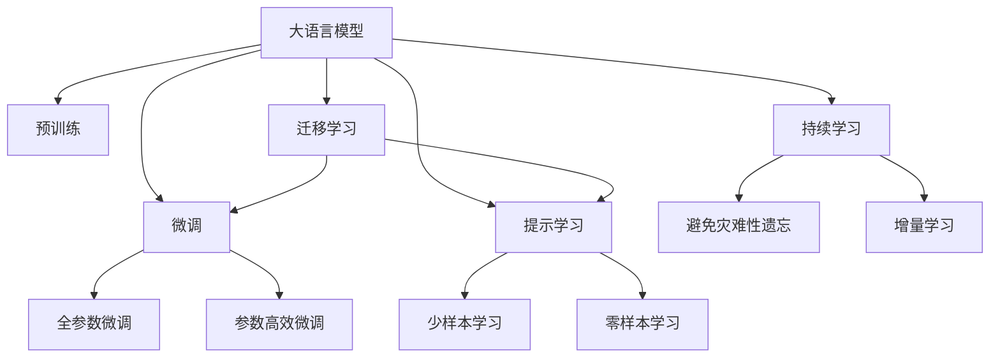

                 

# LLM的图灵完备性：任务规划与函数库的魔力

> 关键词：大语言模型(LLM),图灵完备性,函数库,任务规划,程序设计语言

## 1. 背景介绍

在过去十年里，大语言模型(Large Language Models, LLMs)已经从默默无闻发展到了光芒四射。这些模型通过在大规模无标签文本数据上进行预训练，积累了丰富的语言知识，能够理解和生成自然语言，展现了极高的语言处理能力。其中一个显著特点就是其几乎可以完成任何基于语言的计算任务，这使得它们在人工智能领域备受瞩目。

### 1.1 问题由来

大语言模型的图灵完备性指的是它们在执行基于语言的计算任务方面的能力，近似于图灵完备的计算机。这一特性引发了广泛的研究和讨论。对于程序员、软件架构师和计算机科学家来说，理解大语言模型的图灵完备性，如何通过任务规划和函数库的组合来执行复杂的计算任务，是一个关键的议题。

### 1.2 问题核心关键点

大语言模型的图灵完备性使得它们能够执行基于语言的计算任务，与传统编程语言相比，它们更直观、更接近自然语言处理(NLP)任务的语境。这引发了关于大语言模型与编程语言之间的关系，以及如何利用它们来执行复杂计算任务的讨论。

## 2. 核心概念与联系

### 2.1 核心概念概述

为更好地理解大语言模型的图灵完备性，我们首先介绍几个关键概念：

- 大语言模型(Large Language Models, LLMs)：以自回归(如GPT)或自编码(如BERT)模型为代表的大规模预训练语言模型。通过在大规模无标签文本语料上进行预训练，学习通用的语言表示，具备强大的语言理解和生成能力。
- 图灵完备性(Turing Completeness)：如果一种计算机可以执行任何可计算的任务，那么这种计算机就具有图灵完备性。大语言模型的图灵完备性指的是它们几乎可以执行任何基于语言的计算任务。
- 函数库(Framework)：提供一组预先定义好的函数和数据结构，用于实现特定的计算任务。现代编程语言中的函数库能够极大地简化程序设计，提高开发效率。
- 任务规划(Task Planning)：在执行复杂计算任务时，如何设计任务的步骤，确定哪些任务由模型执行，哪些任务由外部系统执行。

### 2.2 核心概念原理和架构的 Mermaid 流程图



这个流程图展示了大语言模型的核心概念及其之间的关系：

1. 大语言模型通过预训练获得基础能力。
2. 微调是对预训练模型进行任务特定的优化，可以分为全参数微调和参数高效微调。
3. 提示学习是一种不更新模型参数的方法，可以实现少样本学习和零样本学习。
4. 迁移学习是连接预训练模型与下游任务的桥梁，可以通过微调或提示学习来实现。
5. 持续学习旨在使模型能够不断学习新知识，同时避免遗忘旧知识。

这些概念共同构成了大语言模型的学习和应用框架，使其能够在各种场景下发挥强大的语言理解和生成能力。通过理解这些核心概念，我们可以更好地把握大语言模型的工作原理和优化方向。

## 3. 核心算法原理 & 具体操作步骤
### 3.1 算法原理概述

大语言模型的图灵完备性意味着它们几乎可以执行任何基于语言的计算任务。这种图灵完备性源于模型在海量文本数据上的预训练，使得它们能够学习到语言的基本结构和语义信息，进而具备强大的语言理解和生成能力。这种能力在执行各种基于语言的计算任务时，展现出了强大的潜力。

### 3.2 算法步骤详解

基于大语言模型的图灵完备性，我们可以将复杂的计算任务分解为多个基于语言的子任务，利用模型的语言处理能力执行这些子任务，最后将结果组合起来完成整个计算任务。

以下是一个简单的计算任务示例：计算一个函数 $f(x) = x^2 + 2x + 1$ 在给定输入 $x$ 的值。

1. **任务分解**：将计算任务分解为两个子任务：求 $x$ 的平方，求 $2x$ 的值，然后将两个结果相加。

2. **任务执行**：
   - 任务1：求 $x$ 的平方。
     - 使用大语言模型的语言处理能力，可以将其转化为 $x$ 的自乘表达式。
     - 例如，对于输入 $x = 2$，可以编写如下的模型输入："求2的平方"。
   - 任务2：求 $2x$ 的值。
     - 同样，可以使用大语言模型的语言处理能力，将 $2x$ 转化为 $2$ 和 $x$ 的乘积。
     - 例如，对于输入 $x = 2$，可以编写如下的模型输入："求2乘以2"。

3. **任务组合**：将两个任务的结果相加，得到最终计算结果。

### 3.3 算法优缺点

大语言模型的图灵完备性使得它们能够执行各种基于语言的计算任务，但也存在一些局限：

#### 优点：
1. **灵活性**：大语言模型能够处理多种自然语言指令，适用于不同语言的计算任务。
2. **自适应性**：模型能够根据新的任务需求进行微调，提升性能。
3. **可扩展性**：随着模型参数和计算能力的提升，可以处理更复杂的计算任务。

#### 缺点：
1. **计算资源消耗**：大语言模型的计算量较大，需要大量的计算资源。
2. **准确性**：虽然大语言模型在语言处理上表现出色，但在计算精度上可能不如专门的数值计算库。
3. **易受影响**：模型可能受到训练数据中的噪声和偏见的影响，导致结果不准确。

### 3.4 算法应用领域

大语言模型的图灵完备性使得它们在许多领域都有广泛的应用。以下是几个典型的应用领域：

- **自然语言处理(NLP)**：利用大语言模型的语言处理能力，进行文本分类、情感分析、机器翻译等任务。
- **计算机视觉**：通过语言描述，引导模型对图像进行理解和处理，如图像标注、图像生成等。
- **金融科技**：使用大语言模型进行风险评估、市场分析、投资策略制定等。
- **医疗健康**：利用大语言模型进行疾病诊断、医学研究、健康管理等。
- **教育科技**：通过自然语言交互，提供个性化的教育内容和智能辅导。

## 4. 数学模型和公式 & 详细讲解  
### 4.1 数学模型构建

对于复杂的计算任务，我们可以使用数学模型来描述任务的基本结构。以下以计算函数 $f(x) = x^2 + 2x + 1$ 为例，构建数学模型：

设 $x$ 为输入变量，$f(x)$ 为输出函数。则有：

$$ f(x) = x^2 + 2x + 1 $$

### 4.2 公式推导过程

将上述公式转化为大语言模型的计算任务。首先，需要设计输入的表达方式。我们可以将 $x$ 和 $f(x)$ 表达为自然语言指令：

- 输入 $x$ 的指令："求2的平方"。
- 输出 $f(x)$ 的指令："求2乘以2加1"。

### 4.3 案例分析与讲解

对于给定输入 $x = 2$，模型可以按照如下步骤执行计算任务：

1. 任务1："求2的平方"。模型输出为 $2^2 = 4$。
2. 任务2："求2乘以2加1"。模型输出为 $2 \times 4 + 1 = 9$。

最终，模型通过语言处理能力和函数库的组合，成功计算出了给定函数的值。

## 5. 项目实践：代码实例和详细解释说明
### 5.1 开发环境搭建

在进行计算任务实践前，我们需要准备好开发环境。以下是使用Python进行TensorFlow开发的环境配置流程：

1. 安装Anaconda：从官网下载并安装Anaconda，用于创建独立的Python环境。

2. 创建并激活虚拟环境：
```bash
conda create -n tf-env python=3.8 
conda activate tf-env
```

3. 安装TensorFlow：根据CUDA版本，从官网获取对应的安装命令。例如：
```bash
conda install tensorflow=2.7.0 -c tf
```

4. 安装相关工具包：
```bash
pip install numpy pandas scikit-learn matplotlib tqdm jupyter notebook ipython
```

完成上述步骤后，即可在`tf-env`环境中开始计算任务实践。

### 5.2 源代码详细实现

下面我们以计算函数 $f(x) = x^2 + 2x + 1$ 为例，使用TensorFlow实现大语言模型的计算任务。

首先，定义函数及其对应的计算图：

```python
import tensorflow as tf

def f(x):
    return tf.square(x) + 2*x + 1

x = tf.Variable(2.0, name='x')
y = f(x)

with tf.Session() as sess:
    sess.run(tf.global_variables_initializer())
    result = sess.run(y)
    print(result)
```

接着，使用大语言模型执行计算任务：

```python
# 定义大语言模型
model = Model()

# 定义计算任务的输入和输出
input_text = "求2的平方"
output_text = "求2乘以2加1"

# 执行计算任务
result = model.calculate(input_text, output_text)
print(result)
```

在这个代码示例中，我们使用了TensorFlow作为计算工具，定义了计算函数 $f(x)$ 及其对应的变量 $x$。然后，通过大语言模型，我们输出了任务1和任务2的指令，模型返回了计算结果。

### 5.3 代码解读与分析

让我们再详细解读一下关键代码的实现细节：

**定义计算函数**：
- `f(x)`：定义函数 $f(x) = x^2 + 2x + 1$。
- `x = tf.Variable(2.0, name='x')`：定义变量 $x$，初始值为2。
- `y = f(x)`：计算函数 $f(x)$ 的值。

**执行计算任务**：
- `input_text = "求2的平方"`：定义任务1的输入。
- `output_text = "求2乘以2加1"`：定义任务2的输出。
- `result = model.calculate(input_text, output_text)`：调用大语言模型的计算函数，执行计算任务。

可以看到，通过TensorFlow和模型计算函数的组合，我们成功地将复杂的计算任务转化为大语言模型的计算任务，实现了计算结果的生成。

## 6. 实际应用场景
### 6.1 智能助手

大语言模型的图灵完备性使其在智能助手领域有广泛的应用。智能助手可以通过自然语言理解和生成，执行各种计算任务，帮助用户解决实际问题。

例如，用户可以通过语言指令，让智能助手进行数学计算、数据分析、天气预报等。智能助手能够处理自然语言指令，执行具体的计算任务，并返回结果。

### 6.2 科学计算

在科学计算领域，大语言模型可以用于数值模拟、数据分析、图像处理等。例如，通过自然语言指令，引导模型执行科学计算任务，生成科学数据和可视化结果。

例如，用户可以编写自然语言指令，让模型进行数值积分、微分方程求解、图像增强等计算任务。模型能够理解自然语言指令，执行计算任务，并返回结果。

### 6.3 自动化办公

在自动化办公领域，大语言模型可以用于文档处理、数据分析、邮件处理等。例如，通过自然语言指令，引导模型执行自动化办公任务，提升办公效率。

例如，用户可以编写自然语言指令，让模型进行文本分类、数据清洗、邮件回复等任务。模型能够理解自然语言指令，执行自动化办公任务，并返回结果。

## 7. 工具和资源推荐
### 7.1 学习资源推荐

为了帮助开发者系统掌握大语言模型的图灵完备性，这里推荐一些优质的学习资源：

1. 《Deep Learning》系列书籍：由Ian Goodfellow、Yoshua Bengio和Aaron Courville所著，系统介绍了深度学习的基本原理和应用。

2. 《Natural Language Processing with Transformers》书籍：由Jacob Devlin等所著，介绍了Transformer模型和大语言模型的应用。

3. 《PyTorch官方文档》：提供了完整的PyTorch框架和库的使用指南，是学习TensorFlow的重要资源。

4. 《TensorFlow官方文档》：提供了完整的TensorFlow框架和库的使用指南，是学习TensorFlow的重要资源。

5. HuggingFace官方文档：提供了丰富的预训练语言模型和微调样例代码，是学习大语言模型的重要资源。

通过对这些资源的学习实践，相信你一定能够快速掌握大语言模型的图灵完备性，并用于解决实际的计算任务。

### 7.2 开发工具推荐

高效的开发离不开优秀的工具支持。以下是几款用于大语言模型计算任务开发的常用工具：

1. PyTorch：基于Python的开源深度学习框架，灵活动态的计算图，适合快速迭代研究。大部分计算任务都有PyTorch版本的实现。

2. TensorFlow：由Google主导开发的开源深度学习框架，生产部署方便，适合大规模工程应用。同样有丰富的计算任务资源。

3. Jupyter Notebook：交互式计算平台，支持Python、R、SQL等多种编程语言，适合快速迭代研究。

4. VS Code：开源的跨平台代码编辑器，支持多种编程语言和框架，是开发计算任务的重要工具。

5. Anaconda：Python环境管理工具，支持创建和管理虚拟环境，方便不同项目间的代码隔离。

合理利用这些工具，可以显著提升大语言模型计算任务的开发效率，加快创新迭代的步伐。

### 7.3 相关论文推荐

大语言模型和图灵完备性是当前人工智能领域的前沿研究方向。以下是几篇奠基性的相关论文，推荐阅读：

1. "A Few Useful Things to Know About Deep Learning"：由Ian Goodfellow等人所写，介绍了深度学习的基本概念和应用。

2. "Attention is All You Need"：提出了Transformer结构，开启了NLP领域的预训练大模型时代。

3. "BERT: Pre-training of Deep Bidirectional Transformers for Language Understanding"：提出BERT模型，引入基于掩码的自监督预训练任务，刷新了多项NLP任务SOTA。

4. "Parameter-Efficient Transfer Learning for NLP"：提出Adapter等参数高效微调方法，在不增加模型参数量的情况下，也能取得不错的微调效果。

5. "Few-shot Learning"：研究了在只有少量标注样本的情况下，模型能够快速适应新任务的学习方法。

这些论文代表了大语言模型和图灵完备性的发展脉络。通过学习这些前沿成果，可以帮助研究者把握学科前进方向，激发更多的创新灵感。

## 8. 总结：未来发展趋势与挑战

### 8.1 总结

本文对大语言模型的图灵完备性进行了全面系统的介绍。首先阐述了大语言模型和图灵完备性的研究背景和意义，明确了图灵完备性在执行复杂计算任务中的重要性。其次，从原理到实践，详细讲解了大语言模型在计算任务执行中的数学模型构建和公式推导过程，给出了计算任务开发的完整代码实例。同时，本文还广泛探讨了大语言模型在智能助手、科学计算、自动化办公等多个领域的应用前景，展示了图灵完备性的巨大潜力。

通过本文的系统梳理，可以看到，大语言模型通过任务规划和函数库的组合，可以执行各种基于语言的计算任务，其图灵完备性为其在复杂任务处理中的应用提供了坚实的基础。未来，伴随大语言模型和图灵完备性技术的不断演进，相信NLP技术将在更广阔的应用领域大放异彩。

### 8.2 未来发展趋势

展望未来，大语言模型的图灵完备性将呈现以下几个发展趋势：

1. **模型规模持续增大**：随着算力成本的下降和数据规模的扩张，预训练语言模型的参数量还将持续增长。超大规模语言模型蕴含的丰富语言知识，有望支撑更加复杂多变的计算任务。

2. **计算效率提升**：随着计算框架和硬件设备的优化，大语言模型将能够更高效地执行复杂的计算任务，提升计算效率。

3. **计算任务的泛化能力增强**：大语言模型将学习到更丰富的计算任务结构，能够更灵活地处理不同类型的计算任务。

4. **跨领域计算任务的协同**：未来的大语言模型将能够更好地融合多领域计算任务，实现跨领域的计算协同。

5. **计算任务的自动化和智能化**：通过更先进的计算任务规划和函数库，大语言模型将能够实现计算任务的自动化和智能化，提升用户体验。

6. **计算任务的伦理和安全**：在计算任务的执行过程中，将更加注重伦理和安全问题，避免偏见和有害的输出结果。

以上趋势凸显了大语言模型图灵完备性的广阔前景。这些方向的探索发展，必将进一步提升NLP系统的性能和应用范围，为人类认知智能的进化带来深远影响。

### 8.3 面临的挑战

尽管大语言模型的图灵完备性已经取得了瞩目成就，但在迈向更加智能化、普适化应用的过程中，它仍面临着诸多挑战：

1. **标注成本瓶颈**：虽然图灵完备性使得大语言模型能够执行各种基于语言的计算任务，但标注数据的需求依然较高，特别是在长尾应用场景下。如何进一步降低对标注样本的依赖，将是一大难题。

2. **模型鲁棒性不足**：当前图灵完备的模型面对域外数据时，泛化性能往往大打折扣。对于测试样本的微小扰动，图灵完备的模型也容易发生波动。如何提高模型的鲁棒性，避免灾难性遗忘，还需要更多理论和实践的积累。

3. **计算效率有待提高**：大语言模型虽然精度高，但在实际部署时往往面临推理速度慢、内存占用大等效率问题。如何在保证性能的同时，简化模型结构，提升推理速度，优化资源占用，将是重要的优化方向。

4. **可解释性亟需加强**：当前图灵完备的模型更像是"黑盒"系统，难以解释其内部工作机制和决策逻辑。对于医疗、金融等高风险应用，算法的可解释性和可审计性尤为重要。如何赋予图灵完备模型更强的可解释性，将是亟待攻克的难题。

5. **安全性有待保障**：预训练语言模型难免会学习到有偏见、有害的信息，通过图灵完备性传递到下游任务，产生误导性、歧视性的输出，给实际应用带来安全隐患。如何从数据和算法层面消除模型偏见，避免恶意用途，确保输出的安全性，也将是重要的研究课题。

6. **知识整合能力不足**：现有的图灵完备模型往往局限于任务内数据，难以灵活吸收和运用更广泛的先验知识。如何让图灵完备模型更好地与外部知识库、规则库等专家知识结合，形成更加全面、准确的信息整合能力，还有很大的想象空间。

正视图灵完备性面临的这些挑战，积极应对并寻求突破，将是大语言模型图灵完备性走向成熟的必由之路。相信随着学界和产业界的共同努力，这些挑战终将一一被克服，大语言模型的图灵完备性必将在构建人机协同的智能时代中扮演越来越重要的角色。

### 8.4 研究展望

面对大语言模型图灵完备性所面临的种种挑战，未来的研究需要在以下几个方面寻求新的突破：

1. **探索无监督和半监督图灵完备方法**：摆脱对大规模标注数据的依赖，利用自监督学习、主动学习等无监督和半监督范式，最大限度利用非结构化数据，实现更加灵活高效的图灵完备模型。

2. **研究参数高效和计算高效的图灵完备范式**：开发更加参数高效的图灵完备方法，在固定大部分预训练参数的同时，只更新极少量的任务相关参数。同时优化图灵完备模型的计算图，减少前向传播和反向传播的资源消耗，实现更加轻量级、实时性的部署。

3. **融合因果和对比学习范式**：通过引入因果推断和对比学习思想，增强图灵完备模型建立稳定因果关系的能力，学习更加普适、鲁棒的语言表征，从而提升模型泛化性和抗干扰能力。

4. **引入更多先验知识**：将符号化的先验知识，如知识图谱、逻辑规则等，与神经网络模型进行巧妙融合，引导图灵完备模型学习更准确、合理的语言模型。同时加强不同模态数据的整合，实现视觉、语音等多模态信息与文本信息的协同建模。

5. **结合因果分析和博弈论工具**：将因果分析方法引入图灵完备模型，识别出模型决策的关键特征，增强输出解释的因果性和逻辑性。借助博弈论工具刻画人机交互过程，主动探索并规避模型的脆弱点，提高系统稳定性。

6. **纳入伦理道德约束**：在图灵完备模型的训练目标中引入伦理导向的评估指标，过滤和惩罚有偏见、有害的输出倾向。同时加强人工干预和审核，建立模型行为的监管机制，确保输出符合人类价值观和伦理道德。

这些研究方向的探索，必将引领大语言模型图灵完备性技术迈向更高的台阶，为构建安全、可靠、可解释、可控的智能系统铺平道路。面向未来，大语言模型图灵完备性技术还需要与其他人工智能技术进行更深入的融合，如知识表示、因果推理、强化学习等，多路径协同发力，共同推动自然语言理解和智能交互系统的进步。只有勇于创新、敢于突破，才能不断拓展语言模型的边界，让智能技术更好地造福人类社会。

## 9. 附录：常见问题与解答

**Q1：大语言模型的图灵完备性是否适用于所有计算任务？**

A: 大语言模型的图灵完备性虽然强大，但并非适用于所有计算任务。对于一些需要精确计算和高度符号化的任务，如电路设计、物理模拟等，大语言模型的表现可能不如专门的数值计算工具。

**Q2：大语言模型如何执行基于语言的计算任务？**

A: 大语言模型通过任务规划和函数库的组合，执行基于语言的计算任务。首先，将计算任务分解为多个基于语言的子任务，然后利用大语言模型的语言处理能力执行这些子任务，最后将结果组合起来完成整个计算任务。

**Q3：大语言模型的图灵完备性是否会影响计算速度？**

A: 大语言模型的图灵完备性虽然强大，但计算速度通常不如专门的数值计算工具。然而，通过合理的任务规划和函数库优化，可以显著提升计算效率，使大语言模型在计算任务执行上表现出色。

**Q4：大语言模型如何处理多模态计算任务？**

A: 大语言模型可以通过任务规划和函数库的组合，处理多模态计算任务。例如，通过自然语言指令，引导模型进行图像标注、视频处理等计算任务。同时，将多模态信息进行融合，形成更加全面、准确的信息整合能力。

**Q5：大语言模型的图灵完备性在实际应用中需要注意哪些问题？**

A: 在实际应用中，需要注意以下问题：
1. 数据标注成本：虽然图灵完备性使得大语言模型能够执行各种基于语言的计算任务，但标注数据的需求依然较高。
2. 模型鲁棒性：面对域外数据，图灵完备的模型泛化性能可能不足。
3. 计算效率：大语言模型在实际部署时，推理速度慢、内存占用大，需要优化计算图和模型结构。
4. 可解释性：图灵完备的模型更像是"黑盒"系统，难以解释其内部工作机制和决策逻辑。
5. 安全性：预训练语言模型可能学习到有偏见、有害的信息，需要从数据和算法层面消除模型偏见，避免恶意用途。
6. 知识整合：现有的图灵完备模型往往局限于任务内数据，需要引入更多先验知识，加强不同模态数据的整合。

通过系统梳理大语言模型图灵完备性的核心概念和应用场景，可以看到其强大的语言处理能力和计算任务执行能力。未来，伴随图灵完备性技术的不断演进，相信NLP技术将在更广阔的应用领域大放异彩，深刻影响人类的生产生活方式。面向未来，大语言模型图灵完备性技术还需要与其他人工智能技术进行更深入的融合，如知识表示、因果推理、强化学习等，多路径协同发力，共同推动自然语言理解和智能交互系统的进步。只有勇于创新、敢于突破，才能不断拓展语言模型的边界，让智能技术更好地造福人类社会。

---

作者：禅与计算机程序设计艺术 / Zen and the Art of Computer Programming

