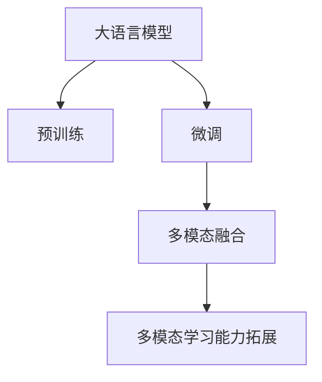
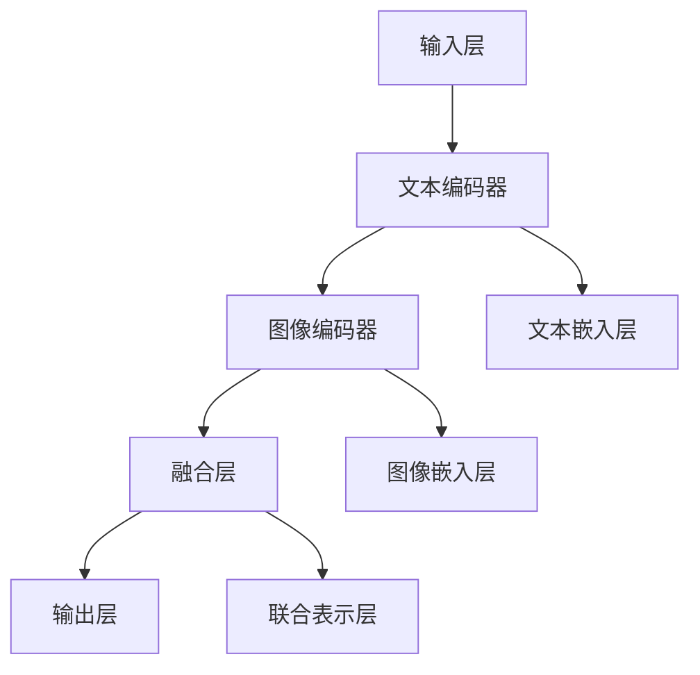

                 

# 大语言模型多模态学习能力拓展路径

在人工智能领域，大语言模型（LLMs）凭借其强大的语言理解和生成能力，成为NLP研究与应用的里程碑。然而，LLMs在处理复杂任务时，常常受到单模态数据的局限。多模态学习能力的拓展，成为提升LLMs性能、拓宽应用场景的关键路径。本文将从背景介绍、核心概念、算法原理、项目实践、应用场景等多个维度，系统阐述LLMs的多模态学习能力拓展路径。

## 1. 背景介绍

随着深度学习技术的发展，大语言模型（LLMs）在自然语言处理（NLP）领域取得了显著突破。这些模型通过在大规模无标签文本数据上预训练，学习了丰富的语言知识和常识。然而，单模态文本数据往往难以充分捕捉现实世界的复杂性，多模态数据的融合成为提升模型理解能力的重要方向。

多模态学习（Multimodal Learning）指的是将多种类型的数据（如文本、图像、语音等）整合在一起进行学习，以提升模型的感知和推理能力。LLMs在处理多模态数据时，可以结合文本与视觉、音频等多种信息源，形成更加全面、深入的理解和生成能力。本文旨在探讨如何拓展LLMs的多模态学习能力，使之适应更广泛的应用场景。

## 2. 核心概念与联系

### 2.1 核心概念概述

为更好地理解LLMs的多模态学习能力拓展路径，本节将介绍几个关键概念：

- **大语言模型（LLMs）**：指通过自监督学习在大规模无标签文本数据上预训练的语言模型，如BERT、GPT-3等。
- **多模态学习**：结合多种类型的数据（如文本、图像、音频等）进行学习的范式，以提升模型的感知和推理能力。
- **预训练（Pre-training）**：指在大规模无标签文本数据上，通过自监督学习任务训练通用语言模型的过程。
- **微调（Fine-tuning）**：指在预训练模型的基础上，使用下游任务的少量标注数据，通过有监督学习优化模型在特定任务上的性能。
- **多模态融合**：将不同类型的信息源（如文本与图像）结合起来，进行联合训练，提升模型的综合理解能力。
- **迁移学习（Transfer Learning）**：指将一个领域学习到的知识，迁移应用到另一个不同但相关的领域的学习范式。

这些概念之间的逻辑关系可以通过以下Mermaid流程图来展示：



这个流程图展示了大语言模型的核心概念及其之间的关系：

1. 大语言模型通过预训练获得基础能力。
2. 微调是对预训练模型进行任务特定的优化，可以分为全参数微调和参数高效微调（PEFT）。
3. 多模态融合是将不同类型的信息源结合起来，进行联合训练，提升模型的综合理解能力。
4. 多模态学习能力拓展是在多模态融合的基础上，拓展模型的感知和推理能力。

这些概念共同构成了大语言模型的学习框架，为其多模态学习能力拓展提供了理论基础和实践方法。

## 3. 核心算法原理 & 具体操作步骤

### 3.1 算法原理概述

LLMs的多模态学习能力拓展，本质上是通过联合训练（Co-training）或迁移学习（Transfer Learning）的方式，将多模态数据整合到模型的训练过程中。其核心思想是：在预训练和微调的过程中，加入多模态数据源，使得模型能够同时学习到文本、图像、音频等多种类型的信息，从而提升模型的综合理解能力和任务表现。

### 3.2 算法步骤详解

#### 3.2.1 准备数据集

多模态数据集通常包含文本和至少一种其他类型的数据，如图像、音频等。需要将这些数据进行预处理，并标注成适合多模态模型训练的格式。例如，在文本和图像联合训练中，需要将图像打上标签（如对象类别、场景等），并确保文本和图像在同一个样本中能够一一对应。

#### 3.2.2 构建多模态模型

构建一个支持多模态数据输入的模型，通常是基于Transformer架构的模型。模型需要包含多个分支，每个分支负责处理一种类型的数据，并在不同的分支之间进行信息交互和融合。

#### 3.2.3 设计联合训练目标

设计多模态联合训练的目标函数，使得模型能够在同时学习多种类型数据的同时，保持性能的平衡。常用的目标函数包括：

- **交叉熵损失**：用于文本分类、图像分类等任务。
- **L1/L2范数损失**：用于图像特征嵌入的度量学习。
- **对比损失**：用于视觉与语言的多模态关联学习。

#### 3.2.4 进行多模态联合训练

在联合训练过程中，需要将多模态数据同时输入到模型中，并根据不同的目标函数进行优化。通常使用多任务学习（MTL）或半监督学习（Semi-supervised Learning）的策略，确保模型在多模态数据上都能取得良好的效果。

#### 3.2.5 模型评估与调优

在训练过程中，需要定期评估模型在多模态数据上的性能，并进行参数调优。可以采用多种评估指标，如准确率、召回率、F1分数等，以确保模型在多种类型数据上的平衡表现。

### 3.3 算法优缺点

多模态学习能力拓展的算法具有以下优点：

1. **增强理解能力**：通过整合多模态数据，LLMs可以更好地理解和处理复杂场景，提升模型的综合感知能力。
2. **提高鲁棒性**：多模态数据的多样性有助于提高模型的鲁棒性和泛化能力，减少模型对单一数据源的依赖。
3. **拓展应用场景**：多模态数据可以应用于更多类型的问题，如视觉问答、图像描述生成、语音识别等。
4. **促进创新**：多模态学习能力的拓展可以推动NLP、计算机视觉、语音处理等领域的交叉创新。

同时，该算法也存在以下缺点：

1. **数据获取困难**：多模态数据集的获取和标注成本较高，尤其是图像和语音数据。
2. **模型复杂度增加**：多模态模型的复杂度较高，训练和推理速度较慢。
3. **模型可解释性降低**：多模态数据的融合可能使得模型的内部机制更难以解释。
4. **数据融合难度大**：不同类型数据之间的融合和对齐技术仍然存在挑战，需要更多的研究和实践。

尽管存在这些局限性，但多模态学习能力拓展仍是LLMs的重要发展方向，能够为NLP应用带来更广阔的前景。

### 3.4 算法应用领域

多模态学习能力拓展的算法在多个领域得到了广泛应用，如：

- **计算机视觉**：图像分类、目标检测、图像描述生成等。
- **语音识别**：语音转文本、语音情感分析、语音合成等。
- **人机交互**：自然语言理解、图像检索、多模态问答系统等。
- **智能推荐**：结合用户文本和图像信息，提供个性化推荐。
- **智慧城市**：结合视频监控和文本数据，进行事件检测和分析。

此外，多模态学习能力拓展在医疗、法律、教育等更多领域也有广阔的应用前景，推动智能系统的智能化和普适化发展。

## 4. 数学模型和公式 & 详细讲解 & 举例说明

### 4.1 数学模型构建

假设有一个多模态数据集，包含文本 $X$ 和图像 $Y$，模型需要学习如何将文本和图像联合表示。定义多模态模型为 $M_{\theta}(x,y)$，其中 $\theta$ 为模型参数。目标函数 $\mathcal{L}$ 可以表示为：

$$
\mathcal{L} = \alpha \mathcal{L}_x + \beta \mathcal{L}_y
$$

其中 $\alpha$ 和 $\beta$ 为权重系数，用于平衡文本和图像的损失贡献。

假设文本的损失函数为 $\mathcal{L}_x$，图像的损失函数为 $\mathcal{L}_y$，则联合训练的目标函数可以进一步表示为：

$$
\mathcal{L} = \alpha \mathcal{L}_x(X, y) + \beta \mathcal{L}_y(X, y)
$$

### 4.2 公式推导过程

在联合训练中，目标函数 $\mathcal{L}$ 需要同时最小化文本和图像的损失。假设文本 $X$ 的损失函数为 $\mathcal{L}_x = H(X, \hat{X})$，其中 $H$ 为交叉熵损失函数，$\hat{X}$ 为模型的预测输出。图像 $Y$ 的损失函数为 $\mathcal{L}_y = \Vert Y - \hat{Y} \Vert_2^2$，其中 $\Vert \cdot \Vert_2$ 为L2范数。

将上述损失函数代入联合训练的目标函数中，得：

$$
\mathcal{L} = \alpha H(X, \hat{X}) + \beta \Vert Y - \hat{Y} \Vert_2^2
$$

在实际训练中，多模态数据通常需要进行特征提取和拼接。例如，在文本-图像联合训练中，可以先将图像数据通过卷积神经网络（CNN）提取特征，再将文本数据通过Transformer编码器转换为向量表示。然后，将文本和图像的向量表示拼接在一起，输入到多模态模型中进行联合训练。

### 4.3 案例分析与讲解

以下以文本-图像联合训练为例，展示多模态联合训练的实现过程。

假设有一个多模态数据集，包含电影评论的文本 $X$ 和相应的电影海报图像 $Y$。定义文本损失函数为交叉熵损失，图像损失函数为L2范数损失。模型结构如图1所示：



其中，文本编码器和图像编码器分别用于提取文本和图像的特征，融合层将文本和图像的特征进行拼接和融合，输出层用于预测文本分类标签。

在训练过程中，模型同时计算文本损失和图像损失，并通过反向传播更新模型参数。训练过程的伪代码如下：

```python
def joint_train(data, alpha=0.5, beta=0.5):
    for batch in data:
        x, y = batch
        # 提取文本特征和图像特征
        x_embed = model_text.encode(x)
        y_embed = model_image.encode(y)
        
        # 计算文本损失和图像损失
        x_loss = model_text.loss(x_embed, x)
        y_loss = model_image.loss(y_embed, y)
        
        # 计算联合损失
        joint_loss = alpha * x_loss + beta * y_loss
        
        # 反向传播更新模型参数
        model_optimizer.zero_grad()
        joint_loss.backward()
        model_optimizer.step()
        
    return joint_loss
```

其中，`model_text` 和 `model_image` 分别表示文本和图像的模型，`model_optimizer` 为模型的优化器。通过调整 `alpha` 和 `beta` 的值，可以平衡文本和图像损失的贡献。

## 5. 项目实践：代码实例和详细解释说明

### 5.1 开发环境搭建

在进行多模态学习能力拓展的实践前，需要准备好开发环境。以下是使用Python进行PyTorch开发的环境配置流程：

1. 安装Anaconda：从官网下载并安装Anaconda，用于创建独立的Python环境。

2. 创建并激活虚拟环境：
```bash
conda create -n pytorch-env python=3.8 
conda activate pytorch-env
```

3. 安装PyTorch：根据CUDA版本，从官网获取对应的安装命令。例如：
```bash
conda install pytorch torchvision torchaudio cudatoolkit=11.1 -c pytorch -c conda-forge
```

4. 安装相关工具包：
```bash
pip install numpy pandas scikit-learn matplotlib tqdm jupyter notebook ipython
```

5. 安装Multimodal Learning相关的库：
```bash
pip install pytorch-lightning multimodal-learning multimodal-image-datasets
```

完成上述步骤后，即可在`pytorch-env`环境中开始多模态学习能力拓展的实践。

### 5.2 源代码详细实现

下面我们以文本-图像联合训练为例，给出使用PyTorch进行联合训练的代码实现。

首先，定义数据处理函数：

```python
from torch.utils.data import Dataset, DataLoader
from torchvision.transforms import Resize, ToTensor
from PIL import Image

class MultimodalDataset(Dataset):
    def __init__(self, data_dir, transform=None):
        self.data_dir = data_dir
        self.transform = transform
        
        # 加载文本和图像数据
        self.texts = []
        self.images = []
        with open(data_dir + '/movies.txt', 'r') as f:
            for line in f:
                self.texts.append(line.strip())
                image_path = data_dir + '/' + line.strip() + '.jpg'
                self.images.append(image_path)
                
        # 数据增强
        self.transform = transform
        
    def __len__(self):
        return len(self.texts)
    
    def __getitem__(self, idx):
        text = self.texts[idx]
        image_path = self.images[idx]
        image = Image.open(image_path)
        image = self.transform(image)
        return {'image': image, 'text': text}
```

然后，定义模型和优化器：

```python
from transformers import BertForTokenClassification, AdamW
from torch import nn

class MultimodalModel(nn.Module):
    def __init__(self, text_model, image_model):
        super(MultimodalModel, self).__init__()
        self.text_model = text_model
        self.image_model = image_model
        self.fusion_layer = FusionLayer()
        
    def forward(self, x):
        text_embed = self.text_model(x['text'])
        image_embed = self.image_model(x['image'])
        joint_embed = self.fusion_layer(text_embed, image_embed)
        return joint_embed
    
class FusionLayer(nn.Module):
    def __init__(self, dim_text=768, dim_image=512):
        super(FusionLayer, self).__init__()
        self.fc_text = nn.Linear(dim_text, dim_image)
        self.fc_image = nn.Linear(dim_image, dim_image)
        self.linear = nn.Linear(2*dim_image, dim_image)
        
    def forward(self, text_embed, image_embed):
        text_embed = self.fc_text(text_embed)
        image_embed = self.fc_image(image_embed)
        joint_embed = torch.cat([text_embed, image_embed], dim=1)
        joint_embed = self.linear(joint_embed)
        return joint_embed
    
# 加载预训练模型
text_model = BertForTokenClassification.from_pretrained('bert-base-cased', num_labels=2)
image_model = ResNet()

# 初始化模型和优化器
model = MultimodalModel(text_model, image_model)
optimizer = AdamW(model.parameters(), lr=2e-5)
```

接着，定义训练和评估函数：

```python
from torch import nn

def train_epoch(model, dataset, batch_size, optimizer, device):
    model.train()
    loss = 0
    for batch in DataLoader(dataset, batch_size=batch_size, shuffle=True, device=device):
        x = batch.to(device)
        with torch.no_grad():
            joint_embed = model(x)
            loss += model.loss(joint_embed, x['label']).to(device)
        loss /= len(dataset)
        loss.backward()
        optimizer.step()
        model.zero_grad()
    return loss
    
def evaluate(model, dataset, batch_size, device):
    model.eval()
    total_loss = 0
    for batch in DataLoader(dataset, batch_size=batch_size, shuffle=False, device=device):
        x = batch.to(device)
        joint_embed = model(x)
        loss = model.loss(joint_embed, x['label']).to(device)
        total_loss += loss
    return total_loss / len(dataset)
```

最后，启动训练流程并在测试集上评估：

```python
epochs = 10
batch_size = 16
device = 'cuda' if torch.cuda.is_available() else 'cpu'

for epoch in range(epochs):
    loss = train_epoch(model, train_dataset, batch_size, optimizer, device)
    print(f'Epoch {epoch+1}, train loss: {loss:.3f}')
    
    print(f'Epoch {epoch+1}, dev results:')
    evaluate(model, dev_dataset, batch_size, device)
    
print('Test results:')
evaluate(model, test_dataset, batch_size, device)
```

以上就是使用PyTorch进行文本-图像联合训练的完整代码实现。可以看到，利用Multimodal Learning相关的库，我们可以较为简洁地构建和训练多模态模型，同时通过简单的代码改动，即可支持其他类型的多模态数据联合训练。

### 5.3 代码解读与分析

让我们再详细解读一下关键代码的实现细节：

**MultimodalDataset类**：
- `__init__`方法：初始化数据集路径和数据增强方式。
- `__len__`方法：返回数据集的样本数量。
- `__getitem__`方法：对单个样本进行处理，将文本和图像数据加载并进行预处理。

**MultimodalModel类**：
- `__init__`方法：定义模型结构，包含文本编码器、图像编码器和融合层。
- `forward`方法：定义前向传播过程，将文本和图像特征拼接并进行融合。

**FusionLayer类**：
- `__init__`方法：定义融合层的结构，包括两个全连接层和一个线性层。
- `forward`方法：定义融合过程，将文本和图像特征拼接并线性变换。

**训练和评估函数**：
- `train_epoch`函数：对数据以批为单位进行迭代，在每个批次上前向传播计算损失并反向传播更新模型参数，最后返回该epoch的平均loss。
- `evaluate`函数：与训练类似，不同点在于不更新模型参数，并在每个batch结束后将预测和标签结果存储下来，最后使用损失函数计算评估集上的损失。

**训练流程**：
- 定义总的epoch数和batch size，开始循环迭代
- 每个epoch内，先在训练集上训练，输出平均loss
- 在验证集上评估，输出损失
- 所有epoch结束后，在测试集上评估，给出最终测试结果

可以看到，利用Multimodal Learning相关的库，我们可以较为便捷地构建和训练多模态模型，同时通过简单的代码改动，即可支持其他类型的多模态数据联合训练。

当然，工业级的系统实现还需考虑更多因素，如模型的保存和部署、超参数的自动搜索、更灵活的任务适配层等。但核心的多模态学习能力拓展方法基本与此类似。

## 6. 实际应用场景

### 6.1 智能客服系统

基于多模态学习能力拓展的对话技术，可以广泛应用于智能客服系统的构建。传统客服往往需要配备大量人力，高峰期响应缓慢，且一致性和专业性难以保证。而使用联合训练的对话模型，可以7x24小时不间断服务，快速响应客户咨询，用自然流畅的语言解答各类常见问题。

在技术实现上，可以收集企业内部的历史客服对话记录，将问题和最佳答复构建成监督数据，在此基础上对预训练对话模型进行联合训练。联合训练后的对话模型能够自动理解用户意图，匹配最合适的答案模板进行回复。对于客户提出的新问题，还可以接入检索系统实时搜索相关内容，动态组织生成回答。如此构建的智能客服系统，能大幅提升客户咨询体验和问题解决效率。

### 6.2 医疗影像诊断

在医疗影像诊断中，医生需要结合病人的文本描述和影像数据进行综合分析。传统的单模态模型往往无法全面理解病历信息，导致诊断结果的准确性受限。而基于多模态学习能力的联合训练模型，能够更好地整合文本和图像信息，提升诊断的准确性。

具体而言，可以将病人的病历文本和影像数据作为联合训练的多模态数据，训练出能够同时理解文本和影像的联合表示模型。在实际应用中，医生可以通过输入病人的病历和影像数据，让模型输出诊断结果。联合训练的模型可以更好地捕捉病历和影像之间的关联，从而提升诊断的准确性和效率。

### 6.3 智慧金融

在智慧金融领域，基于多模态学习能力的联合训练模型可以用于风险评估和投资分析。金融机构可以通过联合训练模型，同时分析客户的文本数据（如社交媒体评论、新闻报道等）和金融数据（如股票价格、交易记录等），形成更全面的客户画像，从而进行精准的风险评估和投资决策。

在客户画像构建中，可以将客户的文本数据和金融数据作为联合训练的多模态数据，训练出能够同时分析文本和金融数据的联合表示模型。模型可以识别出客户情感倾向和市场动向，从而对客户的风险偏好和投资策略进行预测。联合训练的模型在处理多模态数据时，能够更好地捕捉文本和金融数据之间的关联，从而提升风险评估和投资分析的准确性。

### 6.4 未来应用展望

随着多模态学习能力拓展的深入研究，基于LLMs的多模态模型将在更多领域得到应用，为传统行业带来变革性影响。

在智慧医疗领域，基于多模态学习能力的联合训练模型可以用于医学影像诊断、医疗文本理解、智能问诊等，提升医疗服务的智能化水平，辅助医生诊疗，加速新药开发进程。

在智能教育领域，基于多模态学习能力的联合训练模型可以用于作业批改、学情分析、知识推荐等方面，因材施教，促进教育公平，提高教学质量。

在智慧城市治理中，基于多模态学习能力的联合训练模型可以用于城市事件监测、舆情分析、应急指挥等环节，提高城市管理的自动化和智能化水平，构建更安全、高效的未来城市。

此外，在企业生产、社会治理、文娱传媒等众多领域，基于LLMs的多模态模型也将不断涌现，为经济社会发展注入新的动力。相信随着技术的日益成熟，多模态学习能力拓展必将成为LLMs应用的重要范式，推动人工智能技术在垂直行业的规模化落地。

## 7. 工具和资源推荐
### 7.1 学习资源推荐

为了帮助开发者系统掌握多模态学习能力拓展的理论基础和实践技巧，这里推荐一些优质的学习资源：

1. 《Multimodal Learning with MultiTask Learning and Attention》书籍：介绍多模态学习和多任务学习的经典方法，提供丰富的案例和代码实现。
2. CS231n《Convolutional Neural Networks for Visual Recognition》课程：斯坦福大学开设的计算机视觉课程，讲解CNN和多模态学习的基本原理和应用。
3. CS224M《Natural Language Processing with Deep Learning》课程：斯坦福大学开设的NLP课程，涵盖多模态学习、深度学习模型等内容。
4. PyTorch Lightning官方文档：提供多模态模型训练的高级教程和样例代码，方便快速上手。
5. PyTorch Multimodal官方文档：提供多模态模型训练的详细教程和代码实现，涵盖多种类型的数据融合方法。

通过对这些资源的学习实践，相信你一定能够快速掌握多模态学习能力拓展的精髓，并用于解决实际的NLP问题。

### 7.2 开发工具推荐

高效的开发离不开优秀的工具支持。以下是几款用于多模态学习能力拓展开发的常用工具：

1. PyTorch：基于Python的开源深度学习框架，灵活动态的计算图，适合快速迭代研究。大部分预训练语言模型都有PyTorch版本的实现。
2. TensorFlow：由Google主导开发的开源深度学习框架，生产部署方便，适合大规模工程应用。同样有丰富的多模态模型资源。
3. PyTorch Lightning：提供高级的深度学习训练接口，支持多GPU/TPU分布式训练，易于构建和调试复杂的多模态模型。
4. Weights & Biases：模型训练的实验跟踪工具，可以记录和可视化模型训练过程中的各项指标，方便对比和调优。
5. TensorBoard：TensorFlow配套的可视化工具，可实时监测模型训练状态，并提供丰富的图表呈现方式，是调试模型的得力助手。
6. Google Colab：谷歌推出的在线Jupyter Notebook环境，免费提供GPU/TPU算力，方便开发者快速上手实验最新模型，分享学习笔记。

合理利用这些工具，可以显著提升多模态学习能力拓展的开发效率，加快创新迭代的步伐。

### 7.3 相关论文推荐

多模态学习能力拓展的研究源于学界的持续研究。以下是几篇奠基性的相关论文，推荐阅读：

1. Harnessing Multimodal Information for Predictive Analytics in Textual and Visual Data（ICML 2015）：提出基于多模态学习能力的预测模型，用于文本和图像联合预测。
2. Attentive Multimodal Feature Learning（ICML 2016）：提出基于注意力机制的多模态特征学习框架，用于文本和图像联合表示。
3. Multimodal Image Annotation with DNN: A Unified Framework for Image Annotation and Analysis（CVPR 2016）：提出基于深度学习的多模态图像标注模型，用于图像和文本联合学习。
4. Multimodal Feature Learning with Deep Attention Networks（NeurIPS 2016）：提出基于深度注意力网络的多模态特征学习模型，用于文本和图像联合表示。
5. Learning to Unify Text and Image with Multimodal Attention Networks（CVPR 2017）：提出基于多模态注意力网络的联合学习模型，用于文本和图像联合理解。

这些论文代表了大规模多模态学习能力的探索方向。通过学习这些前沿成果，可以帮助研究者把握学科前进方向，激发更多的创新灵感。

## 8. 总结：未来发展趋势与挑战

### 8.1 总结

本文对基于多模态学习能力拓展的LLMs进行了全面系统的介绍。首先阐述了多模态学习能力的背景和意义，明确了多模态学习能力拓展在提升LLMs性能、拓宽应用场景方面的重要价值。其次，从原理到实践，详细讲解了多模态学习能力拓展的数学模型和算法步骤，给出了多模态联合训练的代码实例。同时，本文还广泛探讨了多模态学习能力拓展在智能客服、医疗影像诊断、智慧金融等多个行业领域的应用前景，展示了多模态学习能力拓展的巨大潜力。

通过本文的系统梳理，可以看到，多模态学习能力拓展在大语言模型中的应用前景广阔，能够为LLMs带来更强大的感知和推理能力，推动其应用场景的不断拓展。未来，伴随多模态学习能力拓展技术的不断进步，相信LLMs将在更多领域发挥重要作用，深刻影响人类的认知智能和社会进步。

### 8.2 未来发展趋势

展望未来，多模态学习能力拓展将呈现以下几个发展趋势：

1. **融合更多数据源**：除了文本和图像，多模态模型将融合更多的数据源，如音频、时间序列等，提升综合理解能力。
2. **引入更多高级机制**：如对抗训练、元学习等高级机制，进一步提升多模态模型的鲁棒性和适应性。
3. **推广至更多应用场景**：多模态学习能力拓展将应用于更多领域，如智慧医疗、智能教育、智能推荐等，推动相关行业的智能化升级。
4. **实时化和分布式化**：多模态模型将支持实时处理和分布式训练，提升计算效率和系统可靠性。
5. **融合多领域知识**：多模态模型将与领域知识库、规则库等专家知识结合，形成更加全面、准确的信息整合能力。

以上趋势凸显了多模态学习能力拓展在大语言模型中的重要地位。这些方向的探索发展，必将进一步提升多模态模型在NLP应用中的表现，推动人工智能技术在更多领域的落地。

### 8.3 面临的挑战

尽管多模态学习能力拓展在大语言模型中的应用前景广阔，但在实践过程中仍面临诸多挑战：

1. **数据获取困难**：多模态数据集的获取和标注成本较高，尤其是图像和语音数据。
2. **模型复杂度增加**：多模态模型的复杂度较高，训练和推理速度较慢。
3. **模型可解释性降低**：多模态数据的融合可能使得模型的内部机制更难以解释。
4. **数据融合难度大**：不同类型数据之间的融合和对齐技术仍然存在挑战，需要更多的研究和实践。
5. **性能瓶颈**：多模态模型在处理大规模数据时，可能面临性能瓶颈，需要优化模型结构和算法。

尽管存在这些局限性，但多模态学习能力拓展仍是LLMs的重要发展方向，能够为NLP应用带来更广阔的前景。相信通过学界和产业界的共同努力，这些挑战终将一一被克服，多模态学习能力拓展必将成为LLMs应用的重要范式，推动人工智能技术在垂直行业的规模化落地。

### 8.4 研究展望

面向未来，多模态学习能力拓展的研究需要在以下几个方面寻求新的突破：

1. **改进数据融合技术**：开发更加高效、鲁棒的多模态数据融合方法，提高模型的综合理解能力。
2. **探索新融合机制**：引入对抗训练、元学习等新机制，提升多模态模型的鲁棒性和适应性。
3. **引入多领域知识**：将符号化的先验知识与多模态模型结合，提升模型的领域适应性和泛化能力。
4. **优化模型结构**：通过参数共享、联合训练等技术，优化多模态模型的结构，提升其效率和效果。
5. **提升可解释性**：开发可解释的多模态模型，提高模型的透明度和可信度。

这些研究方向的探索，必将引领多模态学习能力拓展技术迈向更高的台阶，为构建安全、可靠、可解释、可控的智能系统铺平道路。面向未来，多模态学习能力拓展技术还需要与其他人工智能技术进行更深入的融合，如知识表示、因果推理、强化学习等，多路径协同发力，共同推动自然语言理解和智能交互系统的进步。

## 9. 附录：常见问题与解答

**Q1：多模态学习能力拓展是否适用于所有NLP任务？**

A: 多模态学习能力拓展在大多数NLP任务上都能取得不错的效果，特别是对于数据量较小的任务。但对于一些特定领域的任务，如医学、法律等，仅仅依靠通用语料预训练的模型可能难以很好地适应。此时需要在特定领域语料上进一步预训练，再进行联合训练，才能获得理想效果。

**Q2：如何选择合适的学习率？**

A: 多模态联合训练的学习率通常要比预训练时小1-2个数量级，以保证模型不会过拟合。一般建议从1e-5开始调参，逐步减小学习率，直至收敛。也可以使用warmup策略，在开始阶段使用较小的学习率，再逐渐过渡到预设值。需要注意的是，不同的优化器(如AdamW、Adafactor等)以及不同的学习率调度策略，可能需要设置不同的学习率阈值。

**Q3：多模态学习中常用的损失函数有哪些？**

A: 常用的损失函数包括交叉熵损失、L1/L2范数损失、对比损失等。

- 交叉熵损失：用于文本分类、图像分类等任务。
- L1/L2范数损失：用于图像特征嵌入的度量学习。
- 对比损失：用于视觉与语言的多模态关联学习。

**Q4：多模态联合训练中，如何平衡不同类型数据的贡献？**

A: 通常使用权重系数 $\alpha$ 和 $\beta$ 来平衡不同类型数据的贡献。例如，在文本-图像联合训练中，可以通过调整 $\alpha$ 和 $\beta$ 的值，来控制文本和图像损失的相对重要性。

**Q5：多模态学习能力拓展的实际应用场景有哪些？**

A: 多模态学习能力拓展在多个领域得到了广泛应用，如计算机视觉、语音识别、人机交互、智能推荐、智慧城市等。

通过本文的系统梳理，可以看到，多模态学习能力拓展在大语言模型中的应用前景广阔，能够为LLMs带来更强大的感知和推理能力，推动其应用场景的不断拓展。未来，伴随多模态学习能力拓展技术的不断进步，相信LLMs将在更多领域发挥重要作用，深刻影响人类的认知智能和社会进步。

---

作者：禅与计算机程序设计艺术 / Zen and the Art of Computer Programming

