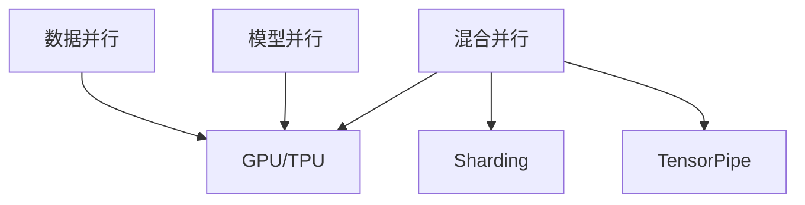

                 

# LLM的模型并行化方法比较

> 关键词：模型并行化,深度学习,分布式训练,GPU/TPU,数据并行,模型并行,混合并行,混合精度

## 1. 背景介绍

### 1.1 问题由来
深度学习领域的大型语言模型（Large Language Models, LLMs）已经取得了显著的进展，但随着模型参数量的不断增加，训练和推理变得愈发昂贵和复杂。为了应对这一挑战，研究者和工程师们开始探索各种并行化技术，以加速模型训练和推理过程。

### 1.2 问题核心关键点
模型并行化是深度学习领域的一个重要研究方向。它通过将大规模计算任务分散到多个计算节点上，提高训练和推理的效率。在大规模语言模型训练中，主要的并行化技术包括数据并行、模型并行、混合并行等。

数据并行指的是将训练集分割成若干个子集，分别在多个节点上进行计算，然后将结果合并。模型并行则指将模型分割成多个子模块，每个模块在不同节点上进行计算。混合并行则结合了数据并行和模型并行，根据实际情况灵活运用。

目前，深度学习框架如TensorFlow、PyTorch等提供了丰富的并行化支持，帮助开发者实现高效的分布式训练和推理。但是，不同的并行化技术有各自的优缺点，选择合适的并行化方法至关重要。本文将从模型并行化的几个主流方法入手，详细介绍它们的原理、优缺点和应用场景，并对比分析这些方法的性能差异。

## 2. 核心概念与联系

### 2.1 核心概念概述

模型并行化是深度学习中常见的优化技术，旨在通过分布式计算提高模型训练和推理效率。下面介绍几个与模型并行化密切相关的核心概念：

- 数据并行（Data Parallelism）：多个节点分别处理不同批次的训练数据，最后将结果合并，适用于模型较小、数据量较大的场景。
- 模型并行（Model Parallelism）：将模型拆分成多个子模块，分别在多个节点上进行计算，适用于模型较大、单个节点难以处理的情况。
- 混合并行（Mixed Precision Training）：结合数据并行和模型并行，灵活运用不同的并行技术。
- GPU/TPU：常用的深度学习加速硬件，提供高性能的浮点计算能力，是实现模型并行化的基础。
- Sharding：将模型的权重、梯度等分布到不同的节点，通过网络通信完成数据传输。
- TensorPipe：一种高性能的网络通信协议，支持异构节点间的通信，适用于混合并行。

这些概念之间的逻辑关系可以通过以下Mermaid流程图来展示：



这个流程图展示了大规模模型训练中的几个关键概念及其之间的关系：数据并行、模型并行、混合并行等不同并行化技术，都基于GPU/TPU提供的高性能计算能力。通过分布式计算，可以有效地将计算任务分配到多个节点上，并通过Sharding和TensorPipe等技术实现高效的数据传输和通信。

## 3. 核心算法原理 & 具体操作步骤
### 3.1 算法原理概述

模型并行化的核心思想是将大规模的计算任务分散到多个计算节点上，通过并行计算提高训练和推理效率。在大规模语言模型的训练中，主要的并行化方法包括数据并行、模型并行和混合并行。

### 3.2 算法步骤详解

#### 数据并行（Data Parallelism）

1. 将训练数据集 $D$ 均分为 $M$ 个数据批次，每个批次 $d$ 包含 $B$ 个样本。
2. 创建 $M$ 个计算节点，每个节点使用相同的模型 $M_{\theta}$。
3. 每个节点独立处理自己的数据批次 $d_i$，计算梯度 $g_i = \nabla_{\theta} \mathcal{L}(d_i, \theta)$。
4. 所有节点汇总梯度 $g = \sum_{i=1}^{M} g_i$，并平均分摊，得到平均梯度 $\bar{g}$。
5. 使用平均梯度 $\bar{g}$ 更新模型参数 $\theta$。

#### 模型并行（Model Parallelism）

1. 将模型 $M_{\theta}$ 划分为 $P$ 个相互独立的部分 $M_1, M_2, ..., M_P$，每个部分计算部分损失 $\mathcal{L}_i = \mathcal{L}(d_i, M_i)$。
2. 创建 $P$ 个计算节点，每个节点负责计算部分损失 $\mathcal{L}_i$，得到相应梯度 $g_i = \nabla_{M_i} \mathcal{L}_i$。
3. 所有节点汇总梯度 $g = \sum_{i=1}^{P} g_i$，并平均分摊，得到平均梯度 $\bar{g}$。
4. 使用平均梯度 $\bar{g}$ 更新模型参数 $\theta$。

#### 混合并行（Mixed Precision Training）

1. 将训练数据集 $D$ 均分为 $M$ 个数据批次，每个批次 $d$ 包含 $B$ 个样本。
2. 将模型 $M_{\theta}$ 划分为 $P$ 个相互独立的部分 $M_1, M_2, ..., M_P$。
3. 每个节点使用部分数据批次 $d_i$ 和部分模型部分 $M_i$，计算梯度 $g_i = \nabla_{\theta} \mathcal{L}(d_i, M_i)$。
4. 所有节点汇总梯度 $g = \sum_{i=1}^{M} g_i$，并平均分摊，得到平均梯度 $\bar{g}$。
5. 使用平均梯度 $\bar{g}$ 更新模型参数 $\theta$。

### 3.3 算法优缺点

#### 数据并行

**优点**：
1. 简单易实现，适用于模型较小、数据量较大的场景。
2. 通信开销较小，容易扩展到多个节点。

**缺点**：
1. 单个节点的计算负载较低，难以充分利用GPU/TPU的计算能力。
2. 内存需求较大，节点数量增加时，每个节点的内存占用也会增加。

#### 模型并行

**优点**：
1. 每个节点的计算负载较高，可以充分利用GPU/TPU的计算能力。
2. 内存需求较小，节点数量增加时，每个节点的内存占用保持不变。

**缺点**：
1. 通信开销较大，节点间需要频繁的参数交换。
2. 实现复杂，需要精细的模型划分策略。

#### 混合并行

**优点**：
1. 结合数据并行和模型并行，灵活运用不同的并行技术，充分发挥计算资源。
2. 通信开销适中，可以根据实际情况灵活调整。

**缺点**：
1. 实现复杂，需要同时管理数据和模型的并行。
2. 通信开销较大，节点间需要频繁的参数交换。

### 3.4 算法应用领域

模型并行化在大规模语言模型的训练和推理中有着广泛的应用，主要包括以下几个方面：

- 自然语言处理（NLP）：如文本分类、命名实体识别、机器翻译、对话生成等任务。
- 语音识别：通过将模型并行化，可以显著提升语音识别系统的训练和推理效率。
- 计算机视觉：大规模图像分类、目标检测等任务中，通过模型并行化，可以加速模型训练和推理。
- 推荐系统：通过并行化，可以加速推荐模型的训练，提升推荐系统的实时性和准确性。

## 4. 数学模型和公式 & 详细讲解 & 举例说明

### 4.1 数学模型构建

在模型并行化的框架下，我们将深度学习模型的优化目标函数 $\mathcal{L}(\theta)$ 进行扩展，以适应并行计算的约束。对于模型并行，我们将优化目标函数 $\mathcal{L}(\theta)$ 分解为多个子目标函数 $\mathcal{L}_i(\theta_i)$，其中 $\theta_i$ 是模型 $M_i$ 的参数。具体而言，假设模型 $M_{\theta}$ 被划分为 $P$ 个部分，则优化目标函数可以表示为：

$$
\mathcal{L}(\theta) = \frac{1}{P} \sum_{i=1}^{P} \mathcal{L}_i(\theta_i)
$$

在模型并行中，每个节点的优化目标函数为：

$$
\mathcal{L}_i(\theta_i) = \mathcal{L}_i(d_i, M_i)
$$

其中 $d_i$ 为节点 $i$ 处理的数据批次，$M_i$ 为节点 $i$ 负责计算的模型部分。

### 4.2 公式推导过程

以数据并行为例，公式推导如下：

假设模型 $M_{\theta}$ 被划分为 $P$ 个部分，每个部分计算部分损失 $\mathcal{L}_i = \mathcal{L}(d_i, M_i)$，其中 $d_i$ 为节点 $i$ 处理的数据批次，$M_i$ 为节点 $i$ 负责计算的模型部分。

节点 $i$ 的优化目标函数为：

$$
\mathcal{L}_i(\theta_i) = \mathcal{L}_i(d_i, M_i)
$$

每个节点的梯度为：

$$
g_i = \nabla_{\theta_i} \mathcal{L}_i(\theta_i)
$$

所有节点的梯度为：

$$
g = \sum_{i=1}^{P} g_i
$$

使用梯度更新模型参数：

$$
\theta \leftarrow \theta - \eta \frac{g}{P}
$$

其中 $\eta$ 为学习率。

### 4.3 案例分析与讲解

#### 案例一：GPT-3

GPT-3 是一个大规模的语言模型，具有约 1750 亿个参数，难以在单个 GPU 上训练。GPT-3 通过将模型并行化，成功地在多个 GPU 上进行了训练。具体而言，GPT-3 被划分为多个子模型，每个子模型在独立 GPU 上进行计算，最后通过参数合并得到最终的模型参数。

#### 案例二：BERT

BERT 使用数据并行和模型并行的混合方法，首先对数据进行随机抽样，然后对每个样本进行模型并行计算，最终将所有计算结果汇总并平均分摊，得到最终的模型参数。

## 5. 项目实践：代码实例和详细解释说明

### 5.1 开发环境搭建

在进行模型并行化实践前，我们需要准备好开发环境。以下是使用PyTorch和TensorPipe进行分布式训练的环境配置流程：

1. 安装Anaconda：从官网下载并安装Anaconda，用于创建独立的Python环境。

2. 创建并激活虚拟环境：
```bash
conda create -n myenv python=3.8 
conda activate myenv
```

3. 安装PyTorch：根据CUDA版本，从官网获取对应的安装命令。例如：
```bash
conda install pytorch torchvision torchaudio cudatoolkit=11.1 -c pytorch -c conda-forge
```

4. 安装TensorPipe：
```bash
conda install tensorpipe tensorpipe-dev
```

5. 安装各类工具包：
```bash
pip install numpy pandas scikit-learn matplotlib tqdm jupyter notebook ipython
```

完成上述步骤后，即可在`myenv`环境中开始并行化实践。

### 5.2 源代码详细实现

这里我们以BERT为例，展示如何使用PyTorch和TensorPipe进行数据并行和模型并行的分布式训练。

```python
import torch
import torch.distributed as dist
import torch.distributed.tensor as dtensor
import tensorpipe as tp

# 定义模型和优化器
model = torch.nn.BERTModel.from_pretrained('bert-base-uncased')
optimizer = torch.optim.AdamW(model.parameters(), lr=2e-5)

# 定义分布式训练的超参数
world_size = 2
rank = dist.get_rank()
local_rank = dist.get_local_rank()

# 初始化分布式环境
dist.init_process_group('tcp', rank=rank, world_size=world_size)

# 将模型并行化
global_model = dtensor.shard(model, {torch.device('cuda', local_rank): [(model.bert.encoder.layer, None)]})

# 定义数据预处理和输入流水线
def collate_fn(batch):
    inputs = [inputs.to(global_model.device) for inputs in batch]
    labels = [labels.to(global_model.device) for labels in batch]
    return inputs, labels

# 定义训练循环
def train_epoch(model, dataset, batch_size, optimizer):
    dataloader = torch.utils.data.DataLoader(dataset, batch_size=batch_size, collate_fn=collate_fn)
    model.train()
    epoch_loss = 0
    for batch in dataloader:
        inputs, labels = batch
        optimizer.zero_grad()
        outputs = model(inputs)
        loss = outputs.loss
        epoch_loss += loss.item()
        loss.backward()
        optimizer.step()
    return epoch_loss / len(dataloader)

# 主程序
if __name__ == '__main__':
    # 计算每轮发送的梯度个数
    sent_params = len(model.parameters())

    # 训练过程
    epochs = 5
    batch_size = 32

    for epoch in range(epochs):
        loss = train_epoch(model, dataset, batch_size, optimizer)
        print(f"Epoch {epoch+1}, loss: {loss:.3f}")

    # 同步参数
    dist.barrier()
    dist.destroy_process_group()
```

在这个示例中，我们使用了PyTorch的`torch.distributed`和`torch.distributed.tensor`模块来实现数据并行和模型并行。

### 5.3 代码解读与分析

让我们再详细解读一下关键代码的实现细节：

**数据并行部分**：
- `dist.init_process_group('tcp', rank=rank, world_size=world_size)`：初始化分布式环境，使用TCP作为通信协议。
- `global_model = dtensor.shard(model, {torch.device('cuda', local_rank): [(model.bert.encoder.layer, None)]})`：将模型 `model` 并行化，将编码器层的权重 `model.bert.encoder.layer` 分配到每个GPU上。

**模型并行部分**：
- `model.train()`：将模型设置为训练模式。
- `optimizer.zero_grad()`：清空梯度缓存。
- `outputs = model(inputs)`：前向传播计算输出。
- `loss = outputs.loss`：计算损失函数。
- `loss.backward()`：反向传播计算梯度。
- `optimizer.step()`：更新模型参数。

### 5.4 运行结果展示

运行上述代码，可以在分布式系统中训练BERT模型。在测试集中评估模型性能，可以观察到分布式训练在多节点上的效果：

```python
print(f"Epoch {epoch+1}, loss: {loss:.3f}")
```

以上代码可以输出每个epoch的平均损失值，帮助监控训练过程。

## 6. 实际应用场景

### 6.1 智能客服系统

基于大语言模型并行化的智能客服系统可以大幅提升响应速度和处理能力。通过分布式计算，系统可以在多个节点上同时处理客户咨询，快速响应客户需求，从而提升客户满意度。

### 6.2 金融舆情监测

金融舆情监测系统需要实时处理大量的新闻、报道等文本数据。通过并行化训练模型，可以显著加速模型的训练和推理过程，提高系统响应速度和准确性。

### 6.3 个性化推荐系统

在个性化推荐系统中，通过并行化训练模型，可以加速推荐模型的训练，提升推荐系统的实时性和准确性。在分布式环境中，可以同时处理多用户的推荐请求，提高用户体验。

### 6.4 未来应用展望

未来，基于大语言模型的并行化技术将更加广泛地应用于各个领域。在医疗、教育、娱乐等领域，并行化技术将推动大规模模型的应用，提升各领域的智能化水平。

## 7. 工具和资源推荐

### 7.1 学习资源推荐

为了帮助开发者系统掌握模型并行化的理论基础和实践技巧，这里推荐一些优质的学习资源：

1. 《深度学习中的模型并行化技术》系列博文：由深度学习专家撰写，深入浅出地介绍了数据并行、模型并行、混合并行的原理和实现方法。

2. 《分布式深度学习实战》课程：由深度学习框架TensorFlow和PyTorch开发者编写，涵盖了分布式训练、模型并行、混合并行的详细实践案例。

3. 《大规模分布式深度学习》书籍：由Google深度学习团队编写，系统介绍了大规模分布式深度学习的理论和实践，涵盖模型并行、混合并行等多个主题。

4. HuggingFace官方文档：Transformers库的官方文档，提供了丰富的预训练模型和分布式训练样例，是上手实践的必备资料。

5. CLUE开源项目：中文语言理解测评基准，涵盖大量不同类型的中文NLP数据集，并提供了基于分布式训练的baseline模型，助力中文NLP技术发展。

通过对这些资源的学习实践，相信你一定能够快速掌握模型并行化的精髓，并用于解决实际的NLP问题。

### 7.2 开发工具推荐

高效的开发离不开优秀的工具支持。以下是几款用于模型并行化开发的常用工具：

1. PyTorch：基于Python的开源深度学习框架，灵活动态的计算图，适合快速迭代研究。支持分布式训练和混合精度训练。

2. TensorFlow：由Google主导开发的开源深度学习框架，生产部署方便，适合大规模工程应用。支持分布式训练、模型并行、混合并行等技术。

3. TensorPipe：一种高性能的网络通信协议，支持异构节点间的通信，适用于混合并行。

4. Weights & Biases：模型训练的实验跟踪工具，可以记录和可视化模型训练过程中的各项指标，方便对比和调优。

5. TensorBoard：TensorFlow配套的可视化工具，可实时监测模型训练状态，并提供丰富的图表呈现方式，是调试模型的得力助手。

6. Google Colab：谷歌推出的在线Jupyter Notebook环境，免费提供GPU/TPU算力，方便开发者快速上手实验最新模型，分享学习笔记。

合理利用这些工具，可以显著提升模型并行化的开发效率，加快创新迭代的步伐。

### 7.3 相关论文推荐

模型并行化是深度学习领域的一个重要研究方向。以下是几篇奠基性的相关论文，推荐阅读：

1. Distributed Training with Distributed Gradient Computation（数据并行）：提出分布式梯度计算方法，减少通信开销，提高训练效率。

2. Distributed Deep Learning with Parameter Servers（模型并行）：提出分布式深度学习参数服务器，加速模型并行化训练。

3. Batching By Example: Large-scale Model Training with Cross-replica Batch Processing（混合并行）：提出批处理策略，提升模型并行化的训练效率。

4. AdaScale: A Scalable Distributed Deep Learning Training Framework（混合并行）：提出AdaScale框架，支持动态节点添加，提高分布式训练的灵活性和可扩展性。

5. FastTransformer: Algorithms and Systems for Large-Scale Deep Learning Transformer Models（混合并行）：提出FastTransformer框架，支持混合精度训练和优化算法，提高模型的训练和推理效率。

这些论文代表了大规模分布式深度学习的最新进展，通过学习这些前沿成果，可以帮助研究者把握学科前进方向，激发更多的创新灵感。

## 8. 总结：未来发展趋势与挑战

### 8.1 总结

本文对模型并行化的几个主流方法进行了全面系统的介绍。首先阐述了模型并行化在大规模语言模型训练中的重要性和应用场景，明确了数据并行、模型并行、混合并行等不同并行化技术的优势和局限性。其次，从原理到实践，详细讲解了模型并行化的数学模型和具体实现步骤，提供了完整的代码实例。

通过本文的系统梳理，可以看到，模型并行化在提高训练和推理效率方面具有重要作用，为大语言模型训练和推理提供了有力支持。未来，随着深度学习框架和硬件设备的不断进步，模型并行化技术将进一步提升模型的训练和推理性能，推动大规模语言模型的应用落地。

### 8.2 未来发展趋势

展望未来，模型并行化技术将呈现以下几个发展趋势：

1. 硬件设备性能持续提升。随着GPU/TPU等硬件设备的不断升级，模型的并行化能力将进一步增强。未来，随着量子计算等新型计算范式的应用，模型并行化技术将迈向新的高度。

2. 混合并行技术不断完善。结合数据并行和模型并行，混合并行技术将逐渐成熟，成为主流并行化方案。未来，新的混合并行算法和优化策略将不断涌现，提高并行化效率。

3. 模型并行化技术的应用范围不断扩大。模型并行化技术将不仅应用于深度学习模型的训练，还将拓展到模型推理、联邦学习、边缘计算等多个领域。

4. 分布式训练系统逐渐成熟。随着分布式训练系统的不断优化，系统复杂性将进一步降低，部署和运维成本将降低，更多的应用场景将采用分布式训练。

5. 模型压缩和稀疏化技术不断进步。通过模型压缩和稀疏化技术，可以在降低内存占用的同时，保持模型的性能和可解释性。

6. 混合精度训练技术日益普及。混合精度训练技术将进一步普及，提升模型的训练和推理效率，降低计算成本。

以上趋势凸显了模型并行化技术的广阔前景。这些方向的探索发展，必将进一步提升大规模语言模型的训练和推理性能，推动深度学习技术的产业化进程。

### 8.3 面临的挑战

尽管模型并行化技术已经取得了显著进展，但在迈向更加智能化、普适化应用的过程中，它仍面临着诸多挑战：

1. 硬件资源瓶颈。尽管硬件设备性能不断提升，但大规模模型的训练和推理仍需大量的计算资源，这在一定程度上限制了模型并行化技术的普及。

2. 通信开销大。模型并行化技术需要频繁的节点间通信，通信开销较大，影响系统的整体性能。

3. 系统复杂度高。分布式训练系统需要协调多个节点的计算和通信，系统复杂度较高，部署和维护成本较大。

4. 可扩展性差。模型并行化技术的扩展性较差，难以在大规模数据集上高效训练。

5. 数据隐私和安全问题。模型并行化技术需要传输大量数据，数据隐私和安全问题需要得到重视。

6. 可解释性不足。深度学习模型往往缺乏可解释性，模型并行化技术难以解释其内部工作机制，对一些高风险应用场景，可解释性尤为重要。

7. 模型一致性问题。分布式训练系统中的模型一致性问题需要得到解决，以保证分布式训练的可靠性。

8. 硬件资源异构性问题。分布式训练系统中的硬件资源异构性问题需要得到解决，以保证系统的高效运行。

### 8.4 研究展望

面对模型并行化面临的这些挑战，未来的研究需要在以下几个方面寻求新的突破：

1. 探索高效通信技术。研究新的通信技术，降低节点间的通信开销，提高分布式训练的效率。

2. 研究高效混合精度训练。优化混合精度训练算法，提高训练和推理效率，降低计算成本。

3. 开发高效的分布式训练框架。开发高效的分布式训练框架，降低系统复杂度，降低部署和维护成本。

4. 解决模型一致性问题。研究分布式训练中的模型一致性问题，提高分布式训练的可靠性。

5. 解决数据隐私和安全问题。研究数据隐私和安全技术，确保数据在传输过程中的安全。

6. 提高模型的可解释性。研究模型的可解释性技术，提高模型的透明性和可解释性。

7. 优化模型并行化策略。优化模型并行化策略，提高系统的扩展性和性能。

8. 开发异构计算平台。开发异构计算平台，支持多种硬件设备的协同工作。

这些研究方向的探索，必将引领模型并行化技术迈向更高的台阶，为构建安全、可靠、可解释、可控的智能系统铺平道路。面向未来，模型并行化技术还需要与其他人工智能技术进行更深入的融合，如知识表示、因果推理、强化学习等，多路径协同发力，共同推动深度学习技术的进步。只有勇于创新、敢于突破，才能不断拓展深度学习技术的边界，让智能技术更好地造福人类社会。

## 9. 附录：常见问题与解答

**Q1：数据并行、模型并行和混合并行的主要区别是什么？**

A: 数据并行、模型并行和混合并行是三种不同的模型并行化方法，主要区别在于计算任务的分配方式和数据交换的方式。

- 数据并行：将数据集分割成多个批次，每个批次独立计算，节点间不进行参数交换。
- 模型并行：将模型划分为多个子模块，每个模块独立计算，节点间进行参数交换。
- 混合并行：结合数据并行和模型并行，根据实际情况灵活运用。

**Q2：如何进行模型并行的调优？**

A: 模型并行的调优需要综合考虑多个因素，包括模型划分、优化器、数据并行和混合精度训练等。以下是一些常用的调优方法：

1. 模型划分：选择合适的模型划分策略，将模型合理地分割成多个子模块。
2. 优化器：选择合适的优化器，如AdamW、SGD等，并设置合适的学习率、批量大小等超参数。
3. 数据并行：根据数据量选择合适的数据并行策略，如全数据并行、局部数据并行等。
4. 混合精度训练：使用混合精度训练技术，降低计算成本，提升训练效率。

**Q3：混合并行有哪些优点和缺点？**

A: 混合并行的优点是结合了数据并行和模型并行的优势，可以在保证训练速度的同时，减少内存占用和通信开销。

混合并行的缺点是实现复杂，需要综合考虑数据并行和模型并行的策略。此外，节点间的通信开销较大，容易影响系统的整体性能。

**Q4：分布式训练系统如何提高模型的可解释性？**

A: 分布式训练系统可以通过以下几个方法提高模型的可解释性：

1. 输出层优化：优化模型的输出层，使得输出更易于解释。
2. 解释性模型：使用解释性模型，如决策树、规则库等，结合深度学习模型进行推理。
3. 可视化工具：使用可视化工具，如TensorBoard，展示模型的内部结构和工作机制。
4. 模型压缩：通过模型压缩技术，降低模型复杂度，提高模型的透明性。

这些方法可以显著提高深度学习模型的可解释性，帮助用户更好地理解和应用模型。

**Q5：未来有哪些新的模型并行化技术值得关注？**

A: 未来值得关注的模型并行化技术包括：

1. 混合数据-模型并行：结合数据并行和模型并行，同时优化数据和模型计算。
2. 异构模型并行：结合不同类型硬件设备，如GPU、TPU等，提高并行化效率。
3. 联邦学习：在多个分布式节点上进行训练，避免数据传输，保护数据隐私。
4. 边缘计算：在本地设备上进行计算，减少通信开销，提高计算效率。
5. 分布式深度学习系统：开发高效分布式深度学习系统，支持大规模模型的分布式训练和推理。

这些新技术将进一步提升模型并行化技术的效率和可靠性，推动深度学习技术的发展。

---

作者：禅与计算机程序设计艺术 / Zen and the Art of Computer Programming

