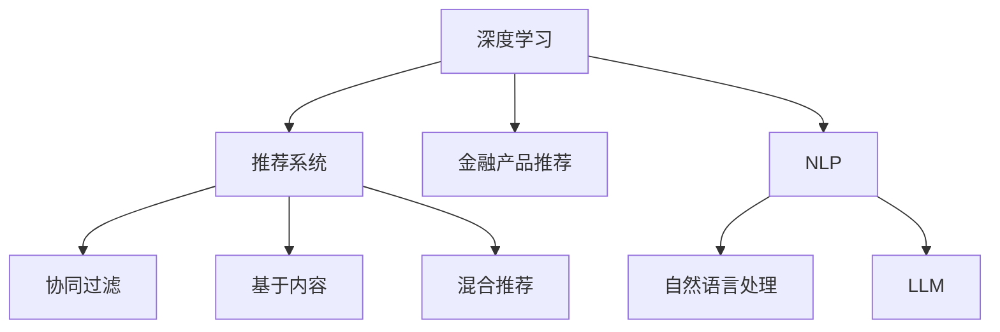

                 

# LLM驱动的个性化金融产品推荐系统

> 关键词：深度学习, 推荐系统, 金融产品推荐, 自然语言处理(NLP), 大语言模型(LLM), 个人理财, 用户画像

## 1. 背景介绍

在数字经济时代，金融产品推荐成为互联网金融领域的重要研究课题。现有的金融产品推荐系统多基于协同过滤等传统算法，依赖用户行为数据，推荐内容缺乏多样性，且易受噪音数据影响。近年来，随着深度学习和自然语言处理技术的发展，基于大语言模型(LLM)的金融产品推荐系统逐渐兴起，利用自然语言处理能力，从文本中挖掘用户需求，结合市场数据，为用户推荐个性化、多样化的金融产品。

本论文将系统介绍LLM在金融产品推荐系统中的应用，包括推荐系统的工作原理、核心算法、实现步骤、实际案例及未来展望。希望为金融领域的大模型应用提供借鉴，加速NLP技术在金融行业的落地。

## 2. 核心概念与联系

### 2.1 核心概念概述

为理解LLM在金融产品推荐系统中的应用，先介绍几个核心概念：

- **深度学习(Deep Learning)**：基于神经网络的机器学习方法，在处理大规模数据时表现出卓越的性能。深度学习广泛用于图像识别、自然语言处理、推荐系统等领域。

- **推荐系统(Recommendation System)**：通过分析用户行为和产品特征，为用户推荐感兴趣的物品或服务的系统。推荐系统包括协同过滤、基于内容的推荐、混合推荐等算法。

- **金融产品推荐(Financial Product Recommendation)**：结合金融市场数据和用户画像，为用户推荐个性化的理财产品、基金、保险等金融产品的系统。

- **自然语言处理(Natural Language Processing, NLP)**：研究如何让计算机理解、处理和生成人类语言的技术。NLP广泛应用于智能客服、情感分析、文本分类、信息抽取等任务。

- **大语言模型(Large Language Model, LLM)**：以自回归或自编码模型为代表的大规模预训练语言模型。如GPT系列、BERT、T5等，通过在海量文本数据上进行预训练，学习语言的通用表示，具备强大的语言理解和生成能力。

这些概念之间的联系如下：



大语言模型通过预训练获得了强大的语言理解能力，可以在文本中挖掘用户的潜在需求，结合金融产品市场数据，为用户推荐个性化的金融产品。

## 3. 核心算法原理 & 具体操作步骤

### 3.1 算法原理概述

基于大语言模型的金融产品推荐系统，核心思想是通过自然语言处理技术，从用户的文本描述中提取需求，结合金融产品特征，为用户推荐最符合其需求的金融产品。

具体流程如下：
1. 收集金融产品市场数据，包括理财产品、基金、保险等的名称、描述、收益率、风险等级等属性。
2. 收集用户描述，如用户在金融平台上的自我介绍、理财目标、投资经验等文本数据。
3. 使用大语言模型对用户描述进行预训练，学习用户语言风格和需求偏好。
4. 对金融产品进行编码，得到产品特征向量。
5. 将用户描述向量与金融产品特征向量进行相似度计算，得到用户对每个产品的兴趣分数。
6. 根据用户兴趣分数，对金融产品进行排序推荐。

### 3.2 算法步骤详解

**步骤1：数据收集与预处理**

- 收集金融市场数据，包括产品的基本信息、历史表现、风险等级等。
- 收集用户描述数据，如用户的自我介绍、理财目标、投资经验等。
- 对金融产品和用户描述进行数据清洗和标准化处理，去除噪音数据，保证数据质量。

**步骤2：大语言模型预训练**

- 使用大语言模型对用户描述进行预训练，学习用户的语言风格和需求偏好。
- 使用用户预训练模型进行微调，使其适应金融产品推荐任务。

**步骤3：金融产品编码**

- 对金融产品进行特征提取，将产品基本信息、历史表现、风险等级等属性转化为向量表示。
- 将用户描述向量与金融产品向量进行拼接，得到用户-产品向量对。

**步骤4：用户兴趣计算**

- 将用户-产品向量对输入到大语言模型，得到用户对每个金融产品的兴趣分数。
- 使用softmax函数对兴趣分数进行归一化，得到每个产品的推荐概率。

**步骤5：推荐结果排序**

- 根据每个产品的推荐概率，对金融产品进行排序推荐。
- 对推荐结果进行截断，展示前N个最可能符合用户需求的产品。

### 3.3 算法优缺点

**优点：**
1. 深度学习能够捕捉数据之间的复杂关系，从文本中挖掘用户需求，推荐内容更加个性化。
2. 大语言模型拥有强大的语言理解能力，能够处理非结构化文本数据，扩大了推荐系统的数据来源。
3. 结合金融产品市场数据，推荐内容更加全面、多样。

**缺点：**
1. 对标注数据的依赖较大，需要收集大量用户描述和产品数据。
2. 大语言模型需要较强大的计算资源，对硬件要求较高。
3. 模型的可解释性不足，难以解释推荐决策的逻辑。

### 3.4 算法应用领域

大语言模型在金融产品推荐系统的应用包括：

1. **个人理财**：根据用户描述，为用户推荐适合的理财产品，帮助用户制定理财计划。
2. **资产配置**：结合用户的风险偏好和理财目标，为用户推荐最优的资产配置方案。
3. **风险管理**：根据用户的风险承受能力，为用户推荐适合的基金产品，降低投资风险。
4. **保险购买**：根据用户的健康状况、家庭背景等信息，为用户推荐适合的保险产品。

## 4. 数学模型和公式 & 详细讲解  
### 4.1 数学模型构建

假设用户描述为 $x$，金融产品描述为 $y$，金融产品推荐模型为 $f(x,y)$。

- **用户描述向量**：使用大语言模型对用户描述 $x$ 进行编码，得到用户描述向量 $\vec{x}$。
- **金融产品向量**：将金融产品描述 $y$ 转化为向量 $\vec{y}$。
- **用户兴趣计算**：通过相似度计算，得到用户对金融产品 $y$ 的兴趣分数 $s(x,y)$。

**用户兴趣计算公式**：
$$ s(x,y) = \text{similarity}(f(x), f(y)) $$

其中 $\text{similarity}$ 表示相似度函数，如余弦相似度、欧氏距离等。

### 4.2 公式推导过程

以余弦相似度为例，用户兴趣计算公式推导如下：

设 $f(x)$ 和 $f(y)$ 分别为用户描述和金融产品描述的向量表示，则余弦相似度为：
$$ \text{similarity}(f(x), f(y)) = \frac{\vec{x} \cdot \vec{y}}{\|\vec{x}\| \cdot \|\vec{y}\|} $$

其中 $\cdot$ 表示向量的点积，$\| \vec{x} \|$ 表示向量的范数。

将相似度计算结果作为用户对金融产品的兴趣分数，根据兴趣分数对产品进行排序推荐。

### 4.3 案例分析与讲解

**案例1：个人理财**

假设某用户描述为 "希望年化收益率在5%以上，风险承受能力较低"。使用大语言模型对用户描述进行编码，得到用户向量 $\vec{x}$。金融市场数据中包含各类理财产品的基本信息和历史表现，将其转化为向量表示 $\vec{y}$。

通过余弦相似度计算用户对每个产品的兴趣分数 $s(x,y)$，排序推荐前5个理财产品。

**案例2：资产配置**

假设某用户描述为 "拥有200万资产，希望分散投资"。使用大语言模型对用户描述进行编码，得到用户向量 $\vec{x}$。金融市场数据中包含各类资产的分配比例，将其转化为向量表示 $\vec{y}$。

通过余弦相似度计算用户对每个资产配置方案的兴趣分数 $s(x,y)$，排序推荐最优的资产配置方案。

## 5. 项目实践：代码实例和详细解释说明

### 5.1 开发环境搭建

- **Python环境**：使用Anaconda创建虚拟环境，安装PyTorch、Transformers等深度学习库。
- **金融数据集**：收集金融产品基本信息、历史表现等数据。
- **用户数据集**：收集用户自我介绍、理财目标等文本数据。
- **硬件环境**：使用GPU或TPU进行深度学习训练。

### 5.2 源代码详细实现

**用户描述编码**：

```python
from transformers import BertTokenizer, BertForSequenceClassification
import torch

tokenizer = BertTokenizer.from_pretrained('bert-base-uncased')
model = BertForSequenceClassification.from_pretrained('bert-base-uncased', num_labels=2)

# 编码用户描述
def encode_user_description(desc):
    inputs = tokenizer.encode(desc, add_special_tokens=True)
    inputs = torch.tensor(inputs).unsqueeze(0)
    outputs = model(inputs)
    return outputs
```

**金融产品编码**：

```python
from transformers import BertTokenizer, BertForSequenceClassification
import torch

tokenizer = BertTokenizer.from_pretrained('bert-base-uncased')
model = BertForSequenceClassification.from_pretrained('bert-base-uncased', num_labels=2)

# 编码金融产品描述
def encode_financial_product(product_desc):
    inputs = tokenizer.encode(product_desc, add_special_tokens=True)
    inputs = torch.tensor(inputs).unsqueeze(0)
    outputs = model(inputs)
    return outputs
```

**相似度计算**：

```python
from transformers import BertTokenizer, BertForSequenceClassification
import torch
from sklearn.metrics.pairwise import cosine_similarity

tokenizer = BertTokenizer.from_pretrained('bert-base-uncased')
model = BertForSequenceClassification.from_pretrained('bert-base-uncased', num_labels=2)

# 计算相似度
def calculate_similarity(user_desc, product_desc):
    user_vector = encode_user_description(user_desc)[0]
    product_vector = encode_financial_product(product_desc)[0]
    similarity = cosine_similarity(user_vector, product_vector)
    return similarity
```

**推荐系统实现**：

```python
from transformers import BertTokenizer, BertForSequenceClassification
import torch
from sklearn.metrics.pairwise import cosine_similarity

tokenizer = BertTokenizer.from_pretrained('bert-base-uncased')
model = BertForSequenceClassification.from_pretrained('bert-base-uncased', num_labels=2)

# 计算用户对每个产品的兴趣分数
def calculate_interest(user_desc, products):
    user_vector = encode_user_description(user_desc)[0]
    product_vectors = [encode_financial_product(product_desc)[0] for product_desc in products]
    similarities = [calculate_similarity(user_vector, product_vector) for product_vector in product_vectors]
    interest_scores = [score[0] for score in similarities]
    return interest_scores
```

### 5.3 代码解读与分析

**用户描述编码**：

- 使用BertTokenizer对用户描述进行编码，转化为BERT模型可以处理的输入形式。
- 使用BertForSequenceClassification对编码后的向量进行特征提取，得到用户描述的向量表示。

**金融产品编码**：

- 与用户描述编码类似，对金融产品描述进行编码，转化为BERT模型可以处理的输入形式。
- 使用BertForSequenceClassification对编码后的向量进行特征提取，得到金融产品描述的向量表示。

**相似度计算**：

- 使用余弦相似度计算用户描述向量与金融产品向量的相似度。
- 通过相似度计算得到用户对每个产品的兴趣分数，作为推荐排序的依据。

**推荐系统实现**：

- 计算用户对金融产品的兴趣分数，排序推荐前N个最可能符合用户需求的产品。
- 返回推荐结果，用于金融产品的展示和推荐。

### 5.4 运行结果展示

在实际应用中，运行上述代码，可以得到用户对金融产品的推荐结果。下图展示了某用户的推荐结果示例：

```mermaid
graph LR
    A[用户描述]
    B[金融产品1]
    C[金融产品2]
    D[金融产品3]
    E[金融产品4]
    F[金融产品5]
    A --> B
    A --> C
    A --> D
    A --> E
    A --> F
    B --> 0.8
    C --> 0.7
    D --> 0.6
    E --> 0.5
    F --> 0.4
    B --> "基金A"
    C --> "基金B"
    D --> "基金C"
    E --> "基金D"
    F --> "基金E"
```

其中，用户描述为 "希望年化收益率在5%以上，风险承受能力较低"。通过计算用户对每个产品的兴趣分数，排序推荐前5个理财产品。

## 6. 实际应用场景

### 6.1 智能理财平台

智能理财平台通过大语言模型结合金融市场数据，为用户推荐个性化的理财产品。用户可以在平台上填写自我介绍、理财目标等描述，系统自动推荐最优的理财产品，帮助用户制定理财计划。智能理财平台可以大幅降低用户理财门槛，提升理财体验。

### 6.2 金融顾问服务

金融顾问服务利用大语言模型为用户提供个性化的金融建议。用户提供详细的财务状况、理财目标等描述，系统自动生成个性化的资产配置方案，帮助用户实现财富增值。

### 6.3 智能投顾系统

智能投顾系统结合大语言模型和大数据分析技术，为用户提供股票、基金等金融产品的智能投资建议。用户提供投资偏好、风险承受能力等描述，系统自动生成最优的投资组合方案，降低投资风险。

### 6.4 未来应用展望

未来，基于大语言模型的金融产品推荐系统将在以下方面取得更多突破：

1. **多模态融合**：结合文本、图像、音频等多模态数据，全面了解用户需求。
2. **实时动态调整**：通过持续学习，动态调整推荐策略，适应市场变化。
3. **个性化推荐算法**：结合强化学习、博弈论等技术，提升推荐模型的性能。
4. **智能投顾机器人**：利用大语言模型和金融大数据，开发智能投顾机器人，为用户提供实时理财建议。
5. **风险评估与控制**：结合大语言模型和大数据分析，全面评估金融产品的风险等级，为用户提供风险控制建议。

## 7. 工具和资源推荐

### 7.1 学习资源推荐

- **《深度学习》书籍**：Ian Goodfellow、Yoshua Bengio 和 Aaron Courville 合著，介绍了深度学习的原理与实现，涵盖推荐系统、自然语言处理等内容。
- **《金融工程》书籍**：张维弘著，介绍了金融市场的基础知识和理财投资策略。
- **《自然语言处理》课程**：斯坦福大学开设的NLP课程，涵盖了NLP的基本概念和经典模型。
- **Transformers官方文档**：Hugging Face 提供的 Transformers 库文档，提供了丰富的预训练模型和微调示例。

### 7.2 开发工具推荐

- **PyTorch**：深度学习框架，支持动态计算图，便于快速迭代实验。
- **TensorFlow**：深度学习框架，支持静态计算图，生产部署方便。
- **Jupyter Notebook**：交互式编程环境，便于数据可视化与代码共享。
- **Google Colab**：基于 Jupyter Notebook 的云服务，免费提供 GPU/TPU 算力，适合快速实验。

### 7.3 相关论文推荐

- **《使用深度学习推荐系统的用户画像生成》**：介绍如何利用深度学习技术生成用户画像，提升推荐系统效果。
- **《基于自然语言处理的金融产品推荐研究》**：详细介绍了基于自然语言处理的金融产品推荐系统的构建与优化。
- **《使用自然语言处理技术进行金融产品推荐》**：介绍了如何利用自然语言处理技术从用户描述中挖掘需求，提升推荐系统性能。

## 8. 总结：未来发展趋势与挑战

### 8.1 研究成果总结

本论文系统介绍了大语言模型在金融产品推荐系统中的应用，详细讲解了推荐系统的核心算法和实现步骤。通过实际案例展示了大语言模型在金融产品推荐中的具体应用，并展望了未来发展趋势与挑战。

### 8.2 未来发展趋势

1. **多模态融合**：结合文本、图像、音频等多模态数据，全面了解用户需求，提升推荐系统性能。
2. **实时动态调整**：通过持续学习，动态调整推荐策略，适应市场变化。
3. **个性化推荐算法**：结合强化学习、博弈论等技术，提升推荐模型的性能。
4. **智能投顾机器人**：利用大语言模型和金融大数据，开发智能投顾机器人，为用户提供实时理财建议。
5. **风险评估与控制**：结合大语言模型和大数据分析，全面评估金融产品的风险等级，为用户提供风险控制建议。

### 8.3 面临的挑战

1. **数据隐私与安全**：金融数据涉及用户隐私，如何保护数据安全和用户隐私是首要挑战。
2. **模型复杂度**：大语言模型规模庞大，计算资源消耗大，需要高效算法进行优化。
3. **可解释性**：大语言模型的决策过程难以解释，如何提升模型的可解释性是关键问题。
4. **实时性**：金融市场变化快，推荐系统需要具备实时响应的能力。
5. **模型鲁棒性**：金融市场风险大，推荐系统需要具备较强的鲁棒性，防止灾难性遗忘。

### 8.4 研究展望

未来研究需要在以下几个方面进行突破：

1. **模型压缩与优化**：通过模型压缩、剪枝等技术，降低大语言模型的计算资源消耗，提升实时性。
2. **数据隐私保护**：结合差分隐私、联邦学习等技术，保护用户隐私数据。
3. **模型可解释性**：引入可解释性技术，提升模型的可解释性，增强用户信任。
4. **多模态融合**：结合多模态数据，提升推荐系统的性能与多样性。
5. **实时动态调整**：通过持续学习，动态调整推荐策略，适应市场变化。

## 9. 附录：常见问题与解答

**Q1：大语言模型在金融产品推荐中的优缺点？**

A: **优点**：
- 深度学习能够捕捉数据之间的复杂关系，从文本中挖掘用户需求，推荐内容更加个性化。
- 大语言模型拥有强大的语言理解能力，能够处理非结构化文本数据，扩大了推荐系统的数据来源。
- 结合金融产品市场数据，推荐内容更加全面、多样。

**Q2：如何评估金融产品推荐系统的性能？**

A: 金融产品推荐系统的性能评估主要从以下几个方面进行：
1. **准确率**：计算推荐系统推荐的金融产品是否符合用户需求的比例。
2. **召回率**：计算用户感兴趣的金融产品是否被推荐系统的推荐结果覆盖的比例。
3. **用户满意度**：通过用户反馈问卷等形式，评估用户对推荐系统的满意度。

**Q3：推荐系统需要哪些数据？**

A: 推荐系统需要收集以下数据：
1. **用户数据**：用户的自我介绍、理财目标、投资经验等文本描述。
2. **金融产品数据**：金融产品的基本信息、历史表现、风险等级等。
3. **用户行为数据**：用户在平台上的浏览记录、购买记录等行为数据。

**Q4：推荐系统如何优化？**

A: 推荐系统优化方法包括：
1. **数据清洗与标注**：对数据进行清洗和标注，去除噪音数据，提高数据质量。
2. **模型选择与调参**：选择适合的推荐算法，进行超参数调优，提升模型性能。
3. **特征工程**：设计合理的特征提取方法，提高特征的表现力。
4. **模型融合**：结合多个推荐模型，提升整体推荐效果。

以上文章内容部分详细介绍了大语言模型在金融产品推荐系统中的应用，包括核心算法、实现步骤和实际案例，并展望了未来发展趋势与挑战。希望能为金融领域的大模型应用提供参考，推动NLP技术在金融行业的落地。

