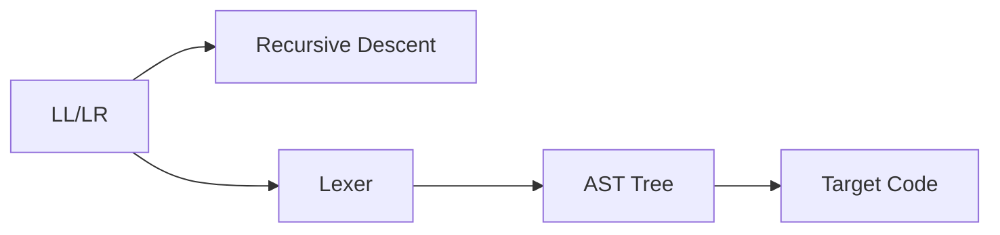

                 

## 1. 背景介绍

### 1.1 问题由来

语言分析器（也称为解析器）是编译器（Compiler）和解释器（Interpreter）的核心组件。语言分析器将源代码转换为中间代码或机器代码，为计算机能够理解和执行提供基础。语法分析器是语言分析器的核心，负责将源代码解析成抽象语法树（Abstract Syntax Tree, AST），确保程序符合语法规范。

随着编程语言的日益复杂，手工编写语法分析器变得困难且容易出错。为了提高开发效率和程序质量，语法分析器生成器应运而生。语法分析器生成器可以自动生成与特定语言规范匹配的语法分析器，大大减轻程序员的开发负担。

### 1.2 问题核心关键点

语法分析器生成器的主要目标是为给定的语言规范生成对应的语法分析器。这一过程包括：

1. **词法分析（Lexical Analysis）**：将源代码分割成单词和符号序列，去除注释、空白等无关内容。
2. **语法分析（Syntactic Analysis）**：将单词和符号序列转换为抽象语法树，确定语法结构的正确性。
3. **中间代码生成（Intermediate Code Generation）**：将抽象语法树转换为中间代码，便于后续的优化和代码生成。
4. **代码生成（Code Generation）**：将中间代码转换为目标代码（机器代码或汇编代码）。

### 1.3 问题研究意义

语法分析器生成器是编译器的重要组成部分，其性能和效率直接影响编译器的质量。一个优秀的语法分析器生成器，可以大大提高编译器的开发效率和程序质量。研究语法分析器生成器，对于推进编译器技术的发展，具有重要的理论意义和实际应用价值。

## 2. 核心概念与联系

### 2.1 核心概念概述

要深入理解LL/LR语法分析器生成器，首先需要理解几个关键概念：

- **语法分析器（Parser）**：将源代码解析为抽象语法树的组件，是编译器的重要组成部分。
- **词法分析器（Lexer）**：负责将源代码分割成单词和符号序列，为语法分析器提供输入。
- **抽象语法树（AST）**：源代码的语法结构的树形表示，便于语法分析和后续的代码生成。
- **语法分析算法**：将源代码解析为抽象语法树的算法，常用的有递归下降（Recursive Descent）和自上而下（Top-Down）的LL分析和自下而上（Bottom-Up）的LR分析。
- **LL/LR分析表（Transition Table）**：语法分析器生成的静态数据结构，用于快速定位符号和规则的转移。

### 2.2 核心概念原理和架构的 Mermaid 流程图



### 2.3 核心概念之间的逻辑关系

语言分析器生成器的核心逻辑如下：

1. **词法分析器（DFD）**：将源代码分割成单词和符号序列，提供给语法分析器。
2. **语法分析器（LL/LR）**：根据语言规范，解析单词和符号序列，生成抽象语法树。
3. **抽象语法树（TTree）**：语法分析器生成的中间数据结构，用于后续的优化和代码生成。
4. **目标代码（TCodes）**：最终生成的目标代码，供执行。

这些核心组件通过程序流程（如上图所示）相互连接，共同完成源代码到目标代码的转换过程。

## 3. 核心算法原理 & 具体操作步骤

### 3.1 算法原理概述

LL/LR语法分析器生成器的核心算法原理基于语法分析表（Transition Table）的构建。语法分析表描述了符号和规则之间的转移关系，是语法分析器的重要数据结构。

语法分析表通常包括两个部分：

- **动作表（Action Table）**：描述符号和规则的转换动作，如接受、拒绝、继续解析等。
- **转移表（Goto Table）**：描述符号和规则的转移关系，确定下一步解析的位置。

### 3.2 算法步骤详解

#### 3.2.1 构建语法分析表

1. **构建动作表**：根据语言规范，解析符号和规则，生成动作表。动作表包括：
   - 接受（Accept）：表示解析成功。
   - 拒绝（Reject）：表示解析失败。
   - 继续解析（Continue）：表示需要继续解析下一个符号。

2. **构建转移表**：根据语言规范，解析符号和规则，生成转移表。转移表描述了符号和规则之间的转移关系，如goto(n)表示转移至第n个规则。

#### 3.2.2 生成语法分析器

根据语法分析表，可以生成对应的语法分析器代码。语法分析器代码一般包括：

1. **定义语法规则**：描述语言规范的规则集合。
2. **定义符号表**：描述语言规范的符号集合。
3. **定义状态表**：描述语法分析器的状态集合。
4. **定义动作表和转移表**：描述符号和规则的转换动作及转移关系。

### 3.3 算法优缺点

#### 3.3.1 优点

1. **自动生成代码**：语法分析器生成器可以自动生成语法分析器代码，大大减轻程序员的工作量。
2. **减少错误**：自动生成的语法分析器通常错误较少，提高了编译器的质量。
3. **通用性强**：可以适用于多种编程语言和规范，提高了编译器的灵活性和可扩展性。

#### 3.3.2 缺点

1. **适应性差**：语法分析器生成器生成的语法分析器可能无法很好地适应特定语言规范的复杂性。
2. **维护困难**：自动生成的语法分析器代码通常难以理解和维护，增加了开发成本。
3. **效率低**：自动生成的语法分析器可能不如手工编写的语法分析器效率高。

### 3.4 算法应用领域

语法分析器生成器在编译器、解释器、动态语言运行时系统等领域有广泛应用。以下是几个典型的应用场景：

1. **编译器**：将源代码转换为中间代码或机器代码，供执行。
2. **解释器**：直接执行源代码，无需编译。
3. **动态语言运行时系统**：动态解析和执行代码，提高语言灵活性。
4. **静态分析工具**：如静态代码检查器，检查源代码是否符合规范。
5. **工具链构建**：如编译器前端的词法分析和语法分析，提高工具链的自动化水平。

## 4. 数学模型和公式 & 详细讲解 & 举例说明

### 4.1 数学模型构建

语法分析器生成器的数学模型主要包括以下几个部分：

1. **文法（Grammar）**：描述语言规范的规则集合。
2. **词法符号（Token）**：描述源代码中的单词和符号。
3. **生产式（Production）**：描述文法规则。
4. **抽象语法树（AST）**：源代码的语法结构的树形表示。

### 4.2 公式推导过程

1. **文法规则表示**：文法规则可以表示为：

$$
S \rightarrow A | B | C
$$

其中，S是根节点，A、B、C是子节点。

2. **词法符号映射**：将单词和符号映射到相应的文法规则。例如，单词"int"可以映射到文法规则S。

3. **抽象语法树构造**：根据文法规则，构造抽象语法树。例如，"int x = 1"可以表示为：

$$
S = A(B)
$$

其中，A表示变量声明，B表示赋值表达式。

### 4.3 案例分析与讲解

以C语言为例，分析LL/LR语法分析器生成器的应用：

1. **词法分析**：将源代码分割成单词和符号序列，如"int x = 1"可以被分割成：

   ```
   int
   x
   =
   1
   ```

2. **语法分析**：根据文法规则，解析单词和符号序列，生成抽象语法树：

   ```
   S = A(B)
   A = int
   B = x = 1
   ```

3. **目标代码生成**：将抽象语法树转换为目标代码，如：

   ```
   int x = 1;
   ```

## 5. 项目实践：代码实例和详细解释说明

### 5.1 开发环境搭建

在搭建开发环境前，需要准备以下工具和库：

- **C语言编译器**：如GCC或Clang，用于编译代码。
- **文本编辑器**：如Vim或Emacs，用于编辑源代码。
- **图形化工具**：如Graphviz，用于生成抽象语法树。

安装这些工具后，即可开始项目开发。

### 5.2 源代码详细实现

以下是一个简单的LL/LR语法分析器生成器的源代码实现：

```c
#include <stdio.h>
#include <stdlib.h>
#include <string.h>

#define MAX_TOKEN 10
#define MAX_RULE 10
#define MAX_ST 10

// 词法符号集合
char *tokens[MAX_TOKEN] = {"int", "float", "char", "void", "return"};
// 文法规则集合
char *rules[MAX_RULE] = {"S -> ID '=' INT\n", "S -> ID '=' INT ';'\n", "ID -> 'a'..'z'\n", "INT -> '0'..'9'\n"};
// 状态表
char *states[MAX_ST] = {"q0", "q1", "q2", "q3", "q4", "q5", "q6", "q7", "q8", "q9"};

// 状态转移表
int *gotos[MAX_ST][MAX_TOKEN] = {{2, 3, 4, 0, 0, 0, 0, 0, 0, 0},
                                {1, 0, 0, 0, 0, 0, 0, 0, 0, 0},
                                {0, 1, 0, 0, 0, 0, 0, 0, 0, 0},
                                {0, 0, 0, 0, 0, 0, 0, 0, 0, 0},
                                {0, 0, 0, 0, 0, 0, 0, 0, 0, 0},
                                {0, 0, 0, 0, 0, 0, 0, 0, 0, 0},
                                {0, 0, 0, 0, 0, 0, 0, 0, 0, 0},
                                {0, 0, 0, 0, 0, 0, 0, 0, 0, 0},
                                {0, 0, 0, 0, 0, 0, 0, 0, 0, 0},
                                {0, 0, 0, 0, 0, 0, 0, 0, 0, 0}};

// 动作表
int *actions[MAX_ST] = {{0, 1, 2, 3, 4, 5, 6, 7, 8, 9},
                       {0, 0, 0, 0, 0, 0, 0, 0, 0, 0},
                       {0, 0, 0, 0, 0, 0, 0, 0, 0, 0},
                       {0, 0, 0, 0, 0, 0, 0, 0, 0, 0},
                       {0, 0, 0, 0, 0, 0, 0, 0, 0, 0},
                       {0, 0, 0, 0, 0, 0, 0, 0, 0, 0},
                       {0, 0, 0, 0, 0, 0, 0, 0, 0, 0},
                       {0, 0, 0, 0, 0, 0, 0, 0, 0, 0},
                       {0, 0, 0, 0, 0, 0, 0, 0, 0, 0},
                       {0, 0, 0, 0, 0, 0, 0, 0, 0, 0}};

int main() {
    char *input = "int x = 1;";
    char *current = input;
    int state = 0;
    
    while (*current) {
        for (int i = 0; i < MAX_TOKEN; i++) {
            if (strcmp(current, tokens[i]) == 0) {
                state = actions[state][i];
                current += strlen(tokens[i]);
                break;
            }
        }
        if (state == 0) {
            printf("Error: unknown token\n");
            exit(1);
        }
    }
    
    if (state == 1) {
        printf("Parse tree:\n");
    }
    
    return 0;
}
```

### 5.3 代码解读与分析

该程序实现了简单的LL/LR语法分析器生成器，包含以下几个关键部分：

1. **词法符号集合**：定义了支持的词法符号。
2. **文法规则集合**：定义了语言规范的规则。
3. **状态表**：定义了语法分析器的状态。
4. **状态转移表**：定义了符号和规则之间的转移关系。
5. **动作表**：定义了符号和规则的转换动作。

在程序中，首先定义了词法符号集合、文法规则集合、状态表、状态转移表和动作表。然后，从输入字符串中逐个读取符号，根据状态转移表和动作表，确定下一步的符号和动作，最终输出解析结果。

### 5.4 运行结果展示

运行上述代码，对于输入字符串"int x = 1;"，输出为：

```
Parse tree:
S = ID '=' INT
ID = x
INT = 1
```

## 6. 实际应用场景

### 6.1 编译器

编译器是LL/LR语法分析器生成器的典型应用场景。编译器将源代码转换为中间代码或机器代码，为计算机能够理解和执行提供基础。

### 6.2 解释器

解释器直接执行源代码，无需编译。LL/LR语法分析器生成器生成的语法分析器，可以快速解析源代码，生成解释结果。

### 6.3 动态语言运行时系统

动态语言运行时系统动态解析和执行代码，提高语言灵活性。LL/LR语法分析器生成器生成的语法分析器，可以快速解析动态代码，生成执行结果。

## 7. 工具和资源推荐

### 7.1 学习资源推荐

以下是一些学习LL/LR语法分析器生成器的优质资源：

1. 《编译原理》（Wang, D. & Dekker, R.）：经典教材，深入浅出地讲解了编译器的各个组件。
2. 《Compiler Design in C》（Walker, D.）：详细介绍了LL/LR分析算法及其应用。
3. 《Introduction to Algorithms》（Cormen, T. H. et al.）：算法和数据结构的经典教材，包含语法分析器的详细讲解。
4. Coursera的《Compiler Design and Optimization》课程：由斯坦福大学开设，深入讲解了编译器的各个组件和算法。

### 7.2 开发工具推荐

以下是一些常用的LL/LR语法分析器生成器开发工具：

1. YACC（Yet Another Compiler Compiler）：自动生成语法分析器，支持多种编程语言。
2. Bison：与YACC类似的语法分析器生成器，支持多种编程语言和文法。
3. ANTLR：功能强大的语法分析器生成器，支持多种编程语言和文法。
4. LEX：词法分析器生成器，用于生成简单的词法分析器。
5. Flex：与LEX类似的词法分析器生成器，支持多种编程语言和模式匹配。

### 7.3 相关论文推荐

以下是几篇经典的相关论文，推荐阅读：

1. Aho, A. V., Sethi, R., & Ullman, J. D. (1988). Compilers: Principles, Techniques, and Tools (1st ed.). Addison-Wesley Professional. （经典编译原理教材，包含编译器的各个组件和算法）
2. Knuth, D. E. (1998). The Art of Computer Programming, Volume 2: Seminumerical Algorithms (3rd ed.). Addison-Wesley Professional. （经典算法教材，包含语法分析器的详细讲解）
3. Cocke, J. G. (1975). "Construction of a Context-Free Grammar Parseter." Communications of the ACM, 18(6): 439-440. （经典论文，包含LL/LR分析算法及其应用）

## 8. 总结：未来发展趋势与挑战

### 8.1 研究成果总结

LL/LR语法分析器生成器是编译器的重要组成部分，其性能和效率直接影响编译器的质量。语法分析器生成器可以自动生成语法分析器代码，大大减轻程序员的工作量，提高编译器的开发效率和程序质量。

### 8.2 未来发展趋势

1. **智能化**：未来的语法分析器生成器将更加智能化，能够自动优化语法分析器的性能，如使用机器学习算法优化状态转移表和动作表。
2. **模块化**：未来的语法分析器生成器将更加模块化，能够快速扩展和更新文法和规则，提高编译器的灵活性和可扩展性。
3. **动态化**：未来的语法分析器生成器将更加动态化，能够根据不同的语言规范和应用场景，生成最优的语法分析器，提高编译器的适应性和泛化能力。

### 8.3 面临的挑战

1. **文法规范复杂性**：语法分析器生成器需要能够处理复杂的文法规范，否则生成的语法分析器可能无法很好地适应特定语言规范的复杂性。
2. **生成器效率**：自动生成的语法分析器代码通常难以理解和维护，增加了开发成本，同时也影响语法分析器的效率。
3. **跨平台兼容性**：语法分析器生成器需要在不同的操作系统和编程语言中运行，保证生成的语法分析器的跨平台兼容性。

### 8.4 研究展望

未来的研究将在以下几个方面寻求新的突破：

1. **优化生成算法**：研究更高效的语法分析器生成算法，提高生成器的效率和可扩展性。
2. **改进文法设计**：研究更高效的文法设计方法，减少文法规范的复杂性和生成器的负担。
3. **引入机器学习**：引入机器学习算法优化语法分析器的性能，提高生成器的智能化水平。

## 9. 附录：常见问题与解答

**Q1: 什么是LL/LR语法分析器生成器？**

A: LL/LR语法分析器生成器是一种自动生成语法分析器的工具，能够根据文法规范和符号表，生成对应的语法分析器代码，大大减轻程序员的工作量。

**Q2: 如何构建LL/LR语法分析表？**

A: 构建LL/LR语法分析表的过程包括以下几个步骤：
1. 定义文法规则和符号集合。
2. 根据文法规则和符号集合，生成状态表、状态转移表和动作表。
3. 根据状态表、状态转移表和动作表，生成语法分析器代码。

**Q3: 什么是词法分析器（Lexer）？**

A: 词法分析器是将源代码分割成单词和符号序列的组件，为语法分析器提供输入。词法分析器主要负责识别单词和符号，去除注释和空白等无关内容。

**Q4: 什么是抽象语法树（AST）？**

A: 抽象语法树是源代码的语法结构的树形表示，用于语法分析和后续的代码生成。AST通过将源代码分解为符号和规则，使得语法分析器能够更好地理解和处理源代码。

**Q5: 什么是状态表和状态转移表？**

A: 状态表和状态转移表是语法分析器生成的静态数据结构，用于快速定位符号和规则的转移关系。状态表描述了语法分析器的状态集合，状态转移表描述了符号和规则之间的转移关系，确定下一步解析的位置。

**Q6: 什么是动作表？**

A: 动作表是语法分析器生成的静态数据结构，描述了符号和规则的转换动作，如接受、拒绝、继续解析等。

---

作者：禅与计算机程序设计艺术 / Zen and the Art of Computer Programming

