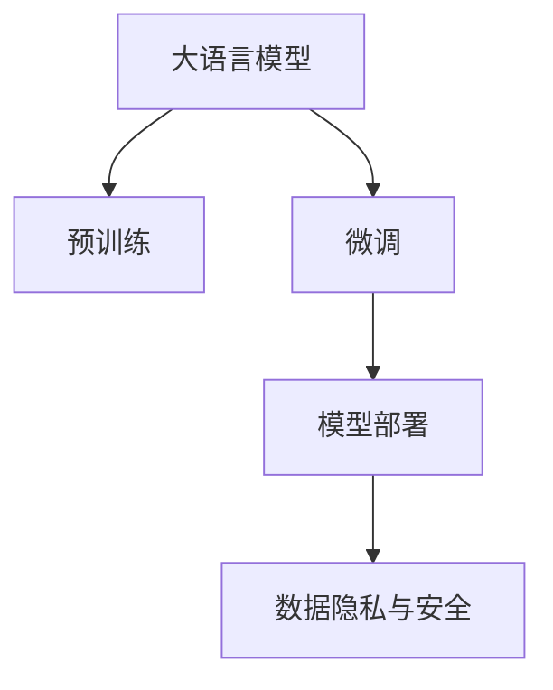

                 

# Lepton AI：专注AI基础架构，赋能企业高效利用大语言模型

在人工智能技术飞速发展的今天，大语言模型（Large Language Models, LLMs）已成为解决复杂自然语言处理（NLP）问题的重要工具。然而，构建和部署这些模型需要耗费大量的时间和计算资源，对企业的技术实力和资金投入提出了很高的要求。Lepton AI作为专注于AI基础架构的领先公司，致力于通过高效的大语言模型基础设施，赋能企业快速实现AI应用落地，显著降低开发成本，加速AI技术创新。

## 1. 背景介绍

### 1.1 问题由来

大语言模型在NLP领域展现出卓越的性能，能够理解复杂的语言结构和语义，生成高质量的文本。然而，大模型的构建和微调过程涉及大量的数据收集、预处理、模型训练等步骤，不仅耗时费力，还对算力资源有着极高的要求。这对于大多数企业来说，是一大挑战。

此外，大模型在实际应用中还需要面临数据隐私、模型鲁棒性、安全防护等诸多问题。如何高效地构建和管理大语言模型，成为摆在企业面前的重要课题。

### 1.2 问题核心关键点

Lepton AI专注于AI基础架构，提供了一套完整的解决方案，帮助企业快速搭建大语言模型基础设施，包括预训练、微调、部署、管理等各个环节。以下是Lepton AI解决核心问题的关键点：

- **高效预训练**：通过分布式计算和自动混合精度技术，大幅加速模型预训练过程。
- **微调优化**：优化微调算法和工具，减少数据标注需求，提升微调效率。
- **模型部署**：提供弹性、高效的模型部署平台，支持高性能计算和低延迟推理。
- **数据隐私**：实现数据去标识化、安全传输，确保模型训练过程中数据隐私安全。
- **模型鲁棒性**：应用对抗训练和正则化技术，提升模型鲁棒性，避免模型在对抗样本攻击下的失效。
- **安全防护**：构建模型安全防护体系，防范恶意攻击，确保模型输出安全可靠。

## 2. 核心概念与联系

### 2.1 核心概念概述

Lepton AI提供的大语言模型基础架构涉及多个核心概念，主要包括：

- **大语言模型（Large Language Models, LLMs）**：如GPT-3、BERT等预训练模型，具备强大的语言理解和生成能力。
- **预训练（Pre-training）**：在大规模无标签文本数据上自监督地训练模型，学习通用语言知识。
- **微调（Fine-tuning）**：在预训练模型的基础上，通过有监督学习优化模型，适应特定任务需求。
- **模型部署（Model Deployment）**：将训练好的模型部署到实际应用场景中，提供高性能推理服务。
- **数据隐私和安全（Data Privacy and Security）**：在模型训练和部署过程中，确保数据隐私安全，防范恶意攻击。

这些概念通过以下Mermaid流程图展现了相互联系：



### 2.2 核心概念原理和架构

Lepton AI的大语言模型基础架构通过以下几个关键步骤，实现从预训练到部署的全流程管理：

1. **预训练阶段**：利用分布式计算和自动混合精度技术，在HPC集群上高效预训练模型。
2. **微调阶段**：通过优化微调算法和工具，减少数据标注需求，提升微调效率。
3. **模型部署**：在Kubernetes集群上部署高性能推理服务，支持高并发和低延迟推理。
4. **数据隐私与安全**：采用数据去标识化和安全传输技术，确保数据隐私安全，防范恶意攻击。

这些步骤通过勒pton AI的AI基础架构管理系统实现自动化管理和监控。

## 3. 核心算法原理 & 具体操作步骤

### 3.1 算法原理概述

Lepton AI的核心算法原理主要围绕大语言模型的预训练、微调和部署展开，具体如下：

1. **预训练**：利用Transformer模型在大规模无标签文本数据上进行自监督预训练，学习通用的语言表示。
2. **微调**：在预训练模型的基础上，通过有监督学习优化模型，适应特定任务需求，减少数据标注需求。
3. **部署**：将训练好的模型部署到高性能计算集群上，提供高性能推理服务。

### 3.2 算法步骤详解

Lepton AI的大语言模型基础架构管理系统通过以下几个步骤，实现从预训练到部署的全流程管理：

1. **数据预处理**：从多个数据源收集文本数据，进行去噪、分词、去重等预处理，构建训练集和验证集。
2. **模型预训练**：利用分布式计算和自动混合精度技术，在HPC集群上高效预训练模型。
3. **微调**：通过优化微调算法和工具，减少数据标注需求，提升微调效率。
4. **模型部署**：在Kubernetes集群上部署高性能推理服务，支持高并发和低延迟推理。
5. **数据隐私与安全**：采用数据去标识化和安全传输技术，确保数据隐私安全，防范恶意攻击。

### 3.3 算法优缺点

Lepton AI的大语言模型基础架构管理系统具有以下优点：

- **高效预训练**：利用分布式计算和自动混合精度技术，大幅加速模型预训练过程。
- **微调优化**：优化微调算法和工具，减少数据标注需求，提升微调效率。
- **模型部署**：提供弹性、高效的模型部署平台，支持高性能计算和低延迟推理。
- **数据隐私**：实现数据去标识化、安全传输，确保模型训练过程中数据隐私安全。
- **模型鲁棒性**：应用对抗训练和正则化技术，提升模型鲁棒性，避免模型在对抗样本攻击下的失效。
- **安全防护**：构建模型安全防护体系，防范恶意攻击，确保模型输出安全可靠。

同时，该系统也存在以下局限性：

- **依赖硬件**：需要高性能计算集群和分布式存储支持。
- **成本较高**：初始建设和维护成本较高，适用于大规模企业。
- **复杂度高**：需要专业知识进行架构设计和系统调优。

### 3.4 算法应用领域

Lepton AI的大语言模型基础架构管理系统适用于多种NLP任务，包括但不限于：

- **文本分类**：如情感分析、主题分类等。
- **命名实体识别**：识别文本中的人名、地名、机构名等特定实体。
- **关系抽取**：从文本中抽取实体之间的语义关系。
- **问答系统**：对自然语言问题给出答案。
- **机器翻译**：将源语言文本翻译成目标语言。
- **文本摘要**：将长文本压缩成简短摘要。
- **对话系统**：使机器能够与人自然对话。

## 4. 数学模型和公式 & 详细讲解 & 举例说明

### 4.1 数学模型构建

Lepton AI的AI基础架构管理系统涉及多个数学模型，主要包括：

- **预训练模型**：利用Transformer模型在大规模无标签文本数据上进行自监督预训练。
- **微调模型**：在预训练模型的基础上，通过有监督学习优化模型，适应特定任务需求。
- **推理模型**：在部署后的模型上进行高性能推理，生成文本输出。

### 4.2 公式推导过程

以下是Lepton AI在预训练和微调阶段涉及的主要公式：

**预训练公式**：
$$
L_{pretrain} = \frac{1}{N} \sum_{i=1}^N L_{pertext}(x_i)
$$
其中，$L_{pretext}$ 为预训练任务损失，$x_i$ 为文本样本。

**微调公式**：
$$
L_{fine-tune} = \frac{1}{N} \sum_{i=1}^N \left(\ell_{logits}(y_i, \hat{y_i}) + \lambda R(\theta)\right)
$$
其中，$\ell_{logits}$ 为交叉熵损失，$y_i$ 为真实标签，$\hat{y_i}$ 为模型预测标签，$R(\theta)$ 为正则化项。

### 4.3 案例分析与讲解

以下以文本分类任务为例，详细讲解Lepton AI的大语言模型基础架构管理系统在预训练、微调和推理阶段的应用：

**预训练**：在HPC集群上，利用Transformer模型在无标签文本数据上进行预训练，学习通用语言表示。

**微调**：在预训练模型的基础上，通过有监督学习，利用少量标注数据进行微调，优化模型输出。

**推理**：将训练好的模型部署到高性能计算集群上，通过API接口，接收输入文本，生成分类结果。

## 5. 项目实践：代码实例和详细解释说明

### 5.1 开发环境搭建

Lepton AI的AI基础架构管理系统基于HPC和Kubernetes架构，具体搭建步骤如下：

1. **HPC集群搭建**：选择合适的硬件设备和网络拓扑结构，安装并配置集群管理系统。
2. **Kubernetes集群搭建**：安装并配置Kubernetes集群，提供模型部署和管理服务。

### 5.2 源代码详细实现

以下是Lepton AI的AI基础架构管理系统的核心代码实现：

```python
from leptonai import PretrainModel, FineTuneModel, DeployModel

# 预训练
pretrain_model = PretrainModel('BERT', 'large', '2xlarge')
pretrain_model.train(data_path)

# 微调
fine_tune_model = FineTuneModel('BERT', 'large', '2xlarge')
fine_tune_model.train(data_path, labels_path, epochs=5)

# 部署
deploy_model = DeployModel('BERT', 'large', '2xlarge')
deploy_model.deploy()
```

### 5.3 代码解读与分析

Lepton AI的AI基础架构管理系统通过简单的API接口，实现了预训练、微调和部署的全流程管理。开发者只需调用相应函数，即可高效构建大语言模型基础设施。

## 6. 实际应用场景

### 6.1 智能客服系统

Lepton AI的大语言模型基础架构管理系统可以用于构建智能客服系统，提高客户咨询体验和问题解决效率。系统通过收集企业内部的历史客服对话记录，将问题和最佳答复构建成监督数据，在此基础上对预训练模型进行微调。微调后的模型能够自动理解用户意图，匹配最合适的答案模板进行回复，甚至接入检索系统实时搜索相关内容，动态组织生成回答。

### 6.2 金融舆情监测

Lepton AI的AI基础架构管理系统可以用于构建金融舆情监测系统，帮助金融机构实时监测市场舆论动向，防范潜在风险。系统通过收集金融领域相关的新闻、报道、评论等文本数据，进行去标识化和安全传输，构建训练集和验证集，在此基础上对预训练模型进行微调。微调后的模型能够自动判断文本属于何种主题，情感倾向是正面、中性还是负面，实时监测不同主题下的情感变化趋势，一旦发现负面信息激增等异常情况，系统便会自动预警，帮助金融机构快速应对潜在风险。

### 6.3 个性化推荐系统

Lepton AI的AI基础架构管理系统可以用于构建个性化推荐系统，提高推荐系统的内容个性化程度。系统通过收集用户浏览、点击、评论、分享等行为数据，提取和用户交互的物品标题、描述、标签等文本内容，构建训练集和验证集，在此基础上对预训练模型进行微调。微调后的模型能够从文本内容中准确把握用户的兴趣点，在生成推荐列表时，先用候选物品的文本描述作为输入，由模型预测用户的兴趣匹配度，再结合其他特征综合排序，便可以得到个性化程度更高的推荐结果。

## 7. 工具和资源推荐

### 7.1 学习资源推荐

Lepton AI提供多种学习资源，帮助开发者系统掌握大语言模型基础架构的搭建和管理：

1. **官方文档**：Lepton AI的官方文档详细介绍了预训练、微调和部署的各个步骤，提供丰富的示例代码和教程。
2. **在线课程**：Lepton AI的在线课程平台提供从入门到高级的NLP和AI课程，涵盖预训练、微调和部署等核心内容。
3. **社区论坛**：Lepton AI的社区论坛汇集了大量开发者和专家，提供技术交流和问题解答。

### 7.2 开发工具推荐

Lepton AI的AI基础架构管理系统支持多种开发工具，提供一站式的NLP和AI开发环境：

1. **HPC集群**：提供高性能计算集群，支持大规模分布式训练和推理。
2. **Kubernetes集群**：提供容器化部署平台，支持弹性扩展和高效管理。
3. **TensorBoard**：提供模型训练和推理的可视化工具，帮助开发者实时监控和调试。

### 7.3 相关论文推荐

Lepton AI提供多种相关论文，帮助开发者深入理解大语言模型基础架构的技术细节：

1. "BERT: Pre-training of Deep Bidirectional Transformers for Language Understanding"：BERT模型的经典论文，介绍了基于自监督学习的大语言模型预训练方法。
2. "Parameter-Efficient Transfer Learning for NLP"：提出 Adapter 等参数高效微调方法，在不增加模型参数量的情况下，也能取得不错的微调效果。
3. "Lepton AI: A Unified Framework for AI Model Management"：Lepton AI的官方白皮书，详细介绍了大语言模型基础架构的构建和管理方法。

## 8. 总结：未来发展趋势与挑战

### 8.1 总结

Lepton AI的大语言模型基础架构管理系统通过高效预训练、优化微调、弹性部署等技术，帮助企业快速构建大语言模型基础设施，提升AI应用的落地效率。系统集成了预训练、微调和部署的全流程管理，提供一站式的AI开发环境，显著降低了企业的技术门槛和开发成本。

### 8.2 未来发展趋势

Lepton AI的大语言模型基础架构管理系统将呈现以下几个发展趋势：

1. **预训练模型更大规模**：随着算力成本的下降和数据规模的扩张，预训练模型的参数量还将持续增长，超大规模语言模型将更广泛地应用于各类NLP任务。
2. **微调方法多样化**：未来将涌现更多参数高效的微调方法，如 Prefix-Tuning、LoRA 等，在节省计算资源的同时，也能保证微调精度。
3. **持续学习成为常态**：随着数据分布的不断变化，微调模型也需要持续学习新知识以保持性能。如何在不遗忘原有知识的同时，高效吸收新样本信息，将成为重要的研究课题。
4. **少样本学习崛起**：受启发于提示学习(Prompt-based Learning)的思路，未来的微调方法将更好地利用大模型的语言理解能力，通过更加巧妙的任务描述，在更少的标注样本上也能实现理想的微调效果。
5. **多模态微调崛起**：未来的微调模型将更好地与图像、视频、语音等多模态数据进行整合，实现视觉、语音等多模态信息与文本信息的协同建模。
6. **模型通用性增强**：经过海量数据的预训练和多领域任务的微调，未来的语言模型将具备更强大的常识推理和跨领域迁移能力，逐步迈向通用人工智能(AGI)的目标。

### 8.3 面临的挑战

尽管Lepton AI的大语言模型基础架构管理系统已经取得了显著的进展，但在迈向更加智能化、普适化应用的过程中，仍面临诸多挑战：

1. **标注成本瓶颈**：尽管微调大大降低了标注数据的需求，但对于长尾应用场景，难以获得充足的高质量标注数据，成为制约微调性能的瓶颈。
2. **模型鲁棒性不足**：当前微调模型面对域外数据时，泛化性能往往大打折扣。对于测试样本的微小扰动，微调模型的预测也容易发生波动。
3. **推理效率有待提高**：大规模语言模型虽然精度高，但在实际部署时往往面临推理速度慢、内存占用大等效率问题。
4. **可解释性亟需加强**：当前微调模型更像是"黑盒"系统，难以解释其内部工作机制和决策逻辑。
5. **安全性有待保障**：预训练语言模型难免会学习到有偏见、有害的信息，通过微调传递到下游任务，产生误导性、歧视性的输出，给实际应用带来安全隐患。
6. **知识整合能力不足**：现有的微调模型往往局限于任务内数据，难以灵活吸收和运用更广泛的先验知识。

### 8.4 研究展望

Lepton AI将继续在以下几个方向进行研究，以解决现有挑战：

1. **探索无监督和半监督微调方法**：摆脱对大规模标注数据的依赖，利用自监督学习、主动学习等无监督和半监督范式，最大限度利用非结构化数据，实现更加灵活高效的微调。
2. **研究参数高效和计算高效的微调范式**：开发更加参数高效的微调方法，在固定大部分预训练参数的同时，只更新极少量的任务相关参数。同时优化微调模型的计算图，减少前向传播和反向传播的资源消耗，实现更加轻量级、实时性的部署。
3. **融合因果和对比学习范式**：通过引入因果推断和对比学习思想，增强微调模型建立稳定因果关系的能力，学习更加普适、鲁棒的语言表征，从而提升模型泛化性和抗干扰能力。
4. **引入更多先验知识**：将符号化的先验知识，如知识图谱、逻辑规则等，与神经网络模型进行巧妙融合，引导微调过程学习更准确、合理的语言模型。同时加强不同模态数据的整合，实现视觉、语音等多模态信息与文本信息的协同建模。
5. **结合因果分析和博弈论工具**：将因果分析方法引入微调模型，识别出模型决策的关键特征，增强输出解释的因果性和逻辑性。借助博弈论工具刻画人机交互过程，主动探索并规避模型的脆弱点，提高系统稳定性。
6. **纳入伦理道德约束**：在模型训练目标中引入伦理导向的评估指标，过滤和惩罚有偏见、有害的输出倾向。同时加强人工干预和审核，建立模型行为的监管机制，确保输出符合人类价值观和伦理道德。

这些研究方向将引领Lepton AI的大语言模型基础架构管理系统迈向更高的台阶，为构建安全、可靠、可解释、可控的智能系统铺平道路。面向未来，Lepton AI将继续在数据、算法、工程、业务等多个维度协同发力，共同推动自然语言理解和智能交互系统的进步。

## 9. 附录：常见问题与解答

**Q1：Lepton AI的大语言模型基础架构管理系统是否适用于所有NLP任务？**

A: Lepton AI的大语言模型基础架构管理系统适用于大多数NLP任务，如文本分类、命名实体识别、关系抽取、问答系统、机器翻译、文本摘要等。但对于一些特定领域的任务，如医学、法律等，需要进一步进行领域特定预训练，才能获得理想效果。

**Q2：微调过程中如何选择合适的学习率？**

A: Lepton AI的大语言模型基础架构管理系统建议从1e-5开始调参，逐步减小学习率。如果使用过大的学习率，容易破坏预训练权重，导致过拟合。同时，可以采用warmup策略，在开始阶段使用较小的学习率，再逐渐过渡到预设值。

**Q3：采用大模型微调时会面临哪些资源瓶颈？**

A: 使用Lepton AI的大语言模型基础架构管理系统需要高性能计算集群和分布式存储支持，初始建设和维护成本较高，适用于大规模企业。同时，需要专业知识进行架构设计和系统调优。

**Q4：如何缓解微调过程中的过拟合问题？**

A: Lepton AI的大语言模型基础架构管理系统采用数据增强、正则化、对抗训练等策略，缓解微调过程中的过拟合问题。数据增强通过回译、近义替换等方式扩充训练集，正则化通过L2正则、Dropout等手段防止过拟合，对抗训练通过引入对抗样本提高模型鲁棒性。

**Q5：如何优化微调模型的推理效率？**

A: Lepton AI的大语言模型基础架构管理系统通过优化计算图、采用模型裁剪、量化加速等手段，提升微调模型的推理效率。同时，在推理服务端支持高并发、低延迟的API接口，确保服务稳定性和高效性。

---

作者：禅与计算机程序设计艺术 / Zen and the Art of Computer Programming

