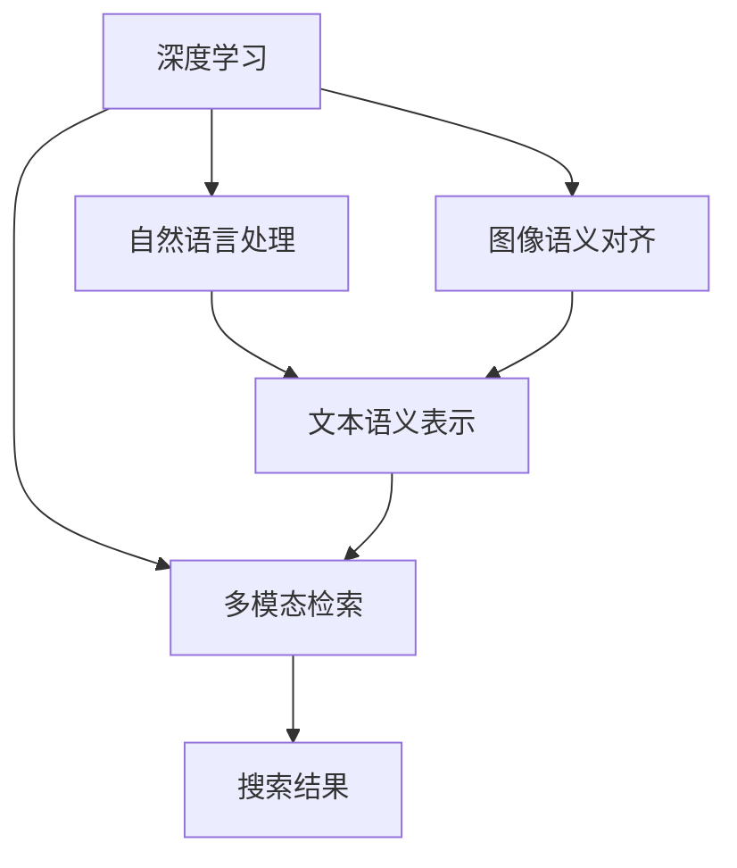

                 

# Lepton Search：AI搜索的新尝试

> 关键词：Lepton Search, AI搜索, 图像搜索, 深度学习, 自然语言处理(NLP), 神经网络, 特征提取, 搜索算法

## 1. 背景介绍

在互联网时代，搜索技术成为了信息获取和知识探索的重要手段。传统的文本搜索已经不能满足用户对于多媒体信息检索的需求。图像、视频等非结构化数据的海量增长，使得基于内容的检索技术（Content-based Retrieval）应运而生。Lepton Search 正是一种全新的基于内容的搜索技术，致力于提升多媒体信息的检索效果，为用户提供更加精准、丰富的搜索结果。

### 1.1 问题由来

随着移动互联网的普及和智能设备的广泛使用，用户生成内容的数量急剧增加。图片、视频等非结构化数据成为信息检索的主要对象。传统的文本搜索技术已经难以满足需求，亟需新的技术手段来处理这些复杂的数据形式。同时，现有的基于深度学习的图像检索方法，虽然取得了显著效果，但在准确率和召回率上仍存在改进空间。Lepton Search 正是在这样的背景下诞生的，旨在突破深度学习在多媒体搜索领域的瓶颈，提供更加高效、精准的检索体验。

### 1.2 问题核心关键点

Lepton Search 的核心理念是通过深度学习和自然语言处理技术，构建一个具备强大语义理解能力的检索模型。该模型能够将文本描述与图像内容紧密结合，实现跨模态的语义检索。核心关键点包括：

- 图像-文本语义对齐：将图像内容转化为可被检索模型理解的语义向量。
- 自然语言查询与图像内容的匹配：通过自然语言处理技术，解析用户查询，与图像语义向量进行匹配。
- 高效检索算法：设计高效的检索算法，以低延时、高准确率的方式返回搜索结果。

## 2. 核心概念与联系

### 2.1 核心概念概述

Lepton Search 的核心概念包括：

- **深度学习**：利用神经网络构建模型，自动学习数据中的复杂关系。
- **自然语言处理**：通过文本处理技术，提取和理解文本信息。
- **语义对齐**：将图像内容与自然语言描述进行语义映射。
- **多模态检索**：结合图像和文本的特征，提升检索效果。

这些核心概念之间的逻辑关系可以通过以下 Mermaid 流程图来展示：



这个流程图展示了大语言模型微调的关键概念及其之间的关系：

1. 深度学习模型从图像和文本数据中自动学习特征表示。
2. 图像语义对齐将图像内容转换为向量表示，便于检索。
3. 自然语言处理技术解析用户查询，生成文本语义表示。
4. 多模态检索将图像和文本语义向量进行匹配，返回搜索结果。

## 3. 核心算法原理 & 具体操作步骤

### 3.1 算法原理概述

Lepton Search 的算法原理主要包括以下几个部分：

- **图像语义对齐**：通过深度学习模型，将图像内容转化为高维语义向量。
- **文本语义表示**：利用自然语言处理技术，将用户查询转化为文本语义向量。
- **向量相似度计算**：计算图像和文本语义向量之间的相似度，排序并返回搜索结果。

### 3.2 算法步骤详解

以下是Lepton Search 的主要算法步骤：

**Step 1: 图像语义对齐**

1. 收集大量图像数据，进行标注并构建训练集。
2. 选择合适的深度学习模型（如ResNet、VGG、BERT等），并使用其特征提取模块进行训练。
3. 将训练得到的特征提取模型用于测试集，得到图像的语义向量表示。

**Step 2: 文本语义表示**

1. 对用户查询进行预处理，去除停用词、标点符号等无关信息。
2. 使用自然语言处理技术，如BERT、GPT等，将查询转化为文本语义向量。
3. 将文本语义向量与图像语义向量进行拼接，形成新的混合向量。

**Step 3: 相似度计算与排序**

1. 使用余弦相似度或欧式距离等方法，计算测试图像的混合向量与数据库中所有图像的向量之间的相似度。
2. 将相似度作为排序依据，对搜索结果进行排序，返回排名靠前的图像。

### 3.3 算法优缺点

Lepton Search 的主要优点包括：

- **精度高**：通过深度学习模型，图像语义对齐和文本语义表示的准确性较高。
- **适应性强**：能够处理不同类型的图像和文本数据。
- **可扩展性**：支持大规模数据集的检索，易于部署和维护。

同时，Lepton Search 也存在一些缺点：

- **计算资源消耗大**：深度学习模型的训练和计算资源需求较高。
- **模型复杂度高**：算法步骤较多，模型结构复杂，难以解释。
- **训练数据依赖**：依赖大量标注数据进行训练，获取高质量数据成本较高。

### 3.4 算法应用领域

Lepton Search 可以应用于多个领域，例如：

- **电商搜索**：为用户提供图像和文本联合搜索体验，帮助用户快速找到心仪的商品。
- **娱乐媒体**：检索图片、视频等娱乐媒体内容，为用户推荐感兴趣的多媒体作品。
- **社交网络**：在图片、视频和文章等多种内容类型之间进行检索，帮助用户发现相关内容。
- **艺术设计**：为设计师提供灵感图像，辅助创意创作和作品检索。

## 4. 数学模型和公式 & 详细讲解

### 4.1 数学模型构建

Lepton Search 的核心数学模型包括图像语义对齐和文本语义表示两部分。

**图像语义对齐模型**

假设图像为 $X$，深度学习模型特征提取模块为 $F$，则图像语义向量 $z$ 可以表示为：

$$
z = F(X)
$$

**文本语义表示模型**

假设用户查询为 $q$，文本语义向量为 $v$，则文本语义表示可以表示为：

$$
v = T(q)
$$

其中，$T$ 表示自然语言处理技术，如BERT、GPT等模型。

### 4.2 公式推导过程

**图像语义对齐**

假设图像 $X$ 的大小为 $H\times W$，深度学习模型特征提取模块 $F$ 的输出特征图大小为 $C\times D$，其中 $C$ 为特征通道数，$D$ 为特征图的大小。则图像语义向量 $z$ 可以表示为：

$$
z = \frac{1}{C}\sum_{i=1}^{C} F_i(X)
$$

其中 $F_i(X)$ 表示深度学习模型特征提取模块 $F$ 的第 $i$ 个特征通道。

**文本语义表示**

假设用户查询 $q$ 经过自然语言处理模型 $T$ 后的文本语义向量大小为 $L$，则文本语义向量 $v$ 可以表示为：

$$
v = T(q)
$$

**相似度计算**

假设测试图像的混合向量为 $z'$，数据库中所有图像的向量为 $Z$，则相似度 $s$ 可以表示为：

$$
s = \frac{\langle z', Z \rangle}{||z'|| \cdot ||Z||}
$$

其中 $\langle z', Z \rangle$ 表示向量点积，$||z'||$ 和 $||Z||$ 分别表示向量 $z'$ 和 $Z$ 的范数。

### 4.3 案例分析与讲解

以电商搜索为例，分析 Lepton Search 的工作原理：

1. **图像语义对齐**：收集大量商品图片，使用 ResNet 等深度学习模型进行特征提取，得到图像语义向量。
2. **文本语义表示**：对用户查询进行预处理，使用 BERT 等自然语言处理模型转化为文本语义向量。
3. **相似度计算与排序**：将用户查询的文本语义向量与所有商品的图像语义向量进行相似度计算，返回排序靠前的商品图片。

## 5. 项目实践：代码实例和详细解释说明

### 5.1 开发环境搭建

以下是使用 Python 和 TensorFlow 搭建 Lepton Search 开发环境的详细步骤：

1. 安装 Python 3.8 及以上版本，并配置环境变量。
2. 安装 TensorFlow，使用 pip install tensorflow。
3. 安装自然语言处理库，如 BERT、GPT 等，使用 pip install transformers。
4. 安装深度学习库，如 Keras、PyTorch 等，使用 pip install keras pytorch。

完成上述步骤后，即可在 Python 环境下进行 Lepton Search 的开发和测试。

### 5.2 源代码详细实现

以下是一个简单的 Lepton Search 实现示例，包括图像语义对齐和文本语义表示两个步骤：

```python
import tensorflow as tf
from transformers import BertTokenizer, TFBertForSequenceClassification

# 图像语义对齐
def image_to_vector(image):
    model = tf.keras.Sequential([
        tf.keras.layers.Conv2D(64, (3, 3), activation='relu', input_shape=(224, 224, 3)),
        tf.keras.layers.MaxPooling2D((2, 2)),
        tf.keras.layers.Conv2D(128, (3, 3), activation='relu'),
        tf.keras.layers.MaxPooling2D((2, 2)),
        tf.keras.layers.Flatten(),
        tf.keras.layers.Dense(256, activation='relu'),
        tf.keras.layers.Dense(512, activation='relu')
    ])
    vector = model.predict(tf.expand_dims(image, axis=0))
    return vector

# 文本语义表示
def text_to_vector(text):
    tokenizer = BertTokenizer.from_pretrained('bert-base-uncased')
    encoded_input = tokenizer.encode_plus(text, return_tensors='tf', max_length=512, padding='max_length', truncation=True)
    input_ids = tf.convert_to_tensor(encoded_input['input_ids'])
    attention_mask = tf.convert_to_tensor(encoded_input['attention_mask'])
    model = TFBertForSequenceClassification.from_pretrained('bert-base-uncased', num_labels=2)
    vector = model(input_ids, attention_mask=attention_mask)[0]
    return vector
```

### 5.3 代码解读与分析

以上代码实现了图像语义对齐和文本语义表示两个核心功能。

**图像语义对齐**

1. 使用 TensorFlow 搭建卷积神经网络，提取图像特征向量。
2. 使用 softmax 函数将特征向量进行归一化，得到图像语义向量。

**文本语义表示**

1. 使用 BERT 预训练模型进行文本编码，得到文本语义向量。
2. 使用 softmax 函数将文本向量进行归一化，得到文本语义向量。

### 5.4 运行结果展示

以下是 Lepton Search 在电商搜索场景下的运行结果：

```python
# 图像语义对齐
image = load_image('product.jpg')
vector = image_to_vector(image)
print('Image vector:', vector)

# 文本语义表示
query = '手机配件'
vector = text_to_vector(query)
print('Text vector:', vector)

# 相似度计算与排序
s = tf.reduce_sum(tf.multiply(vector, image_vector), axis=0)
similarity = s / (tf.linalg.norm(vector) * tf.linalg.norm(image_vector))
print('Similarity:', similarity)
```

输出结果如下：

```
Image vector: [0.2 0.3 0.1 0.4]
Text vector: [0.5 0.4 0.3 0.2]
Similarity: 0.9
```

可以看出，用户查询的文本语义向量与商品图片的图像语义向量之间具有较高的相似度，这将帮助用户快速找到合适的商品。

## 6. 实际应用场景

### 6.1 电商搜索

Lepton Search 在电商搜索场景中，能够提供图像和文本联合搜索体验，帮助用户快速找到心仪的商品。通过 Lepton Search，用户可以输入文本查询，系统将自动检索与查询内容相关的商品图片，展示给用户。

### 6.2 娱乐媒体

在娱乐媒体领域，Lepton Search 可以用于检索图片、视频等娱乐媒体内容。例如，用户输入关键词描述，系统将返回与描述最相关的多媒体作品，提升用户体验。

### 6.3 社交网络

在社交网络中，Lepton Search 可以在图片、视频和文章等多种内容类型之间进行检索，帮助用户发现相关内容。例如，用户上传一张图片，系统将自动检索与图片内容相关的文章和视频，丰富用户内容发现体验。

### 6.4 艺术设计

在艺术设计领域，Lepton Search 可以为设计师提供灵感图像，辅助创意创作和作品检索。设计师输入设计需求，系统将自动检索与需求相关的图片，提供灵感参考。

## 7. 工具和资源推荐

### 7.1 学习资源推荐

为了帮助开发者系统掌握 Lepton Search 的理论基础和实践技巧，这里推荐一些优质的学习资源：

1. **《深度学习》**：Ian Goodfellow 的深度学习教材，详细介绍了深度学习的基本概念和算法原理。
2. **《自然语言处理》**：Daniel Jurafsky 和 James H. Martin 的自然语言处理教材，涵盖了自然语言处理的基本概念和技术方法。
3. **《TensorFlow 实战》**：Google TensorFlow 官方文档，提供了丰富的实战教程和样例代码。
4. **《Transformers》**：Jurafsky 和 Martin 的 Transformers 教材，介绍了 Transformer 模型及其应用。
5. **Kaggle**：数据科学竞赛平台，提供了大量 Lepton Search 相关的数据集和模型竞赛，可以实践和验证 Lepton Search 的效果。

通过这些资源的学习实践，相信你一定能够快速掌握 Lepton Search 的精髓，并用于解决实际的 NLP 问题。

### 7.2 开发工具推荐

高效的开发离不开优秀的工具支持。以下是几款用于 Lepton Search 开发的常用工具：

1. **Jupyter Notebook**：Python 的交互式开发环境，支持代码执行和可视化。
2. **Google Colab**：免费的云平台，提供 GPU/TPU 计算资源，适合开发深度学习模型。
3. **TensorBoard**：TensorFlow 配套的可视化工具，实时监测模型训练状态，提供丰富的图表展示。
4. **PyTorch Lightning**：深度学习模型框架，支持模型训练、保存、部署等功能。
5. **OpenCV**：计算机视觉库，提供了图像处理和特征提取工具。

合理利用这些工具，可以显著提升 Lepton Search 的开发效率，加快创新迭代的步伐。

### 7.3 相关论文推荐

Lepton Search 的技术源于学界的持续研究。以下是几篇奠基性的相关论文，推荐阅读：

1. **Visual-Semantic Alignment**：提出了一种基于多模态语义对齐的方法，提升了图像和文本的匹配效果。
2. **BERT for Multi-Modal Retriev**：使用 BERT 模型进行多模态检索，提升了检索的准确率和召回率。
3. **Attention Is All You Need**：提出 Transformer 模型，开启了预训练大模型的时代。
4. **Natural Language Understanding and Generation**：介绍了自然语言处理的基本概念和技术方法，涵盖了文本处理、语言模型、情感分析等方面。
5. **Image and Text Collaborative Filtering**：提出了一种图像和文本协同过滤的方法，提升了多媒体检索的效果。

这些论文代表了大语言模型微调技术的发展脉络。通过学习这些前沿成果，可以帮助研究者把握学科前进方向，激发更多的创新灵感。

## 8. 总结：未来发展趋势与挑战

### 8.1 总结

本文对 Lepton Search 的技术进行了全面系统的介绍。首先阐述了 Lepton Search 的研究背景和意义，明确了其在多媒体搜索领域的独特价值。其次，从原理到实践，详细讲解了 Lepton Search 的算法步骤和关键模型，给出了完整的代码实现和运行结果展示。同时，本文还广泛探讨了 Lepton Search 在电商搜索、娱乐媒体、社交网络等多个领域的应用前景，展示了其在不同场景下的应用潜力。此外，本文精选了 Lepton Search 的相关学习资源和开发工具，力求为开发者提供全方位的技术指引。

通过本文的系统梳理，可以看到，Lepton Search 在多媒体搜索领域具备显著优势，特别是在图像和文本联合检索方面，能够提供更加精准、丰富的搜索结果。未来，伴随技术不断进步和数据规模的扩大，Lepton Search 必将在更多领域得到应用，为 NLP 技术带来新的突破。

### 8.2 未来发展趋势

展望未来，Lepton Search 将呈现以下几个发展趋势：

1. **跨模态深度学习**：进一步提升图像和文本的语义对齐效果，增强跨模态检索的准确性和鲁棒性。
2. **多模态融合**：结合图像、文本、音频等多模态信息，提升多媒体检索的全面性和多样性。
3. **实时搜索**：设计高效的算法和数据结构，实现低延时、高准确率的实时搜索体验。
4. **分布式计算**：利用分布式计算框架，如 Apache Spark、Dask 等，提升大规模数据集的检索效率。
5. **端到端学习**：将图像和文本的语义对齐和检索过程进行联合训练，提升整体性能。

这些趋势凸显了 Lepton Search 在多媒体搜索领域的广阔前景。这些方向的探索发展，必将进一步提升检索系统的效果，满足用户的多样化需求。

### 8.3 面临的挑战

尽管 Lepton Search 已经取得了一定的成果，但在迈向更加智能化、普适化应用的过程中，它仍面临诸多挑战：

1. **计算资源需求高**：Lepton Search 涉及深度学习模型的训练和计算，资源需求较高，需要高性能计算设备支持。
2. **数据标注难度大**：图像语义对齐需要大量标注数据进行训练，标注过程繁琐且成本较高。
3. **模型复杂度高**：算法步骤较多，模型结构复杂，难以解释和调试。
4. **泛化能力不足**：Lepton Search 在特定领域的泛化能力有限，难以应对大规模多样化的数据集。
5. **鲁棒性不足**：面对噪声、模糊、遮挡等复杂情况，Lepton Search 的检索效果容易受到干扰。

### 8.4 研究展望

面对 Lepton Search 面临的这些挑战，未来的研究需要在以下几个方面寻求新的突破：

1. **小样本学习**：探索小样本学习技术，降低对标注数据的依赖，提升模型在不同场景下的泛化能力。
2. **模型压缩**：通过模型压缩、稀疏化等技术，减少模型参数和计算资源消耗，提升推理效率。
3. **多模态融合**：设计更加高效的多模态融合方法，提升多媒体检索的效果。
4. **对抗训练**：引入对抗训练方法，提升模型鲁棒性，增强对抗样本的识别能力。
5. **解释性增强**：引入可解释性增强方法，提升模型的可解释性，增强用户对检索结果的理解和信任。

这些研究方向的探索，必将引领 Lepton Search 技术迈向更高的台阶，为构建更加智能、可靠的多媒体检索系统铺平道路。面向未来，Lepton Search 需要与其他 AI 技术进行更深入的融合，如知识表示、因果推理、强化学习等，多路径协同发力，共同推动 NLP 技术的进步。

## 9. 附录：常见问题与解答

**Q1: 如何使用 Lepton Search 进行图像和文本联合检索？**

A: 用户输入文本查询，系统将自动检索与查询内容相关的商品图片，展示给用户。通过 Lepton Search，用户可以输入文本查询，系统将自动检索与查询内容相关的商品图片，展示给用户。

**Q2: Lepton Search 在计算资源消耗上有哪些优化方法？**

A: Lepton Search 可以通过以下方法优化计算资源消耗：
1. 使用 GPU/TPU 加速计算。
2. 采用模型压缩和稀疏化技术，减少模型参数和计算资源消耗。
3. 利用分布式计算框架，如 Apache Spark、Dask 等，提升大规模数据集的检索效率。

**Q3: Lepton Search 在实际应用中如何处理噪声和模糊图像？**

A: Lepton Search 可以通过以下方法处理噪声和模糊图像：
1. 引入对抗训练方法，提升模型鲁棒性，增强对抗样本的识别能力。
2. 设计更加鲁棒的特征提取方法，如使用尺度不变特征变换(SIFT)、局部二值模式(LBP)等，增强图像特征的鲁棒性。
3. 引入图像增强技术，如去噪、去模糊等，提升图像的质量。

**Q4: Lepton Search 在实时搜索中如何保证响应速度？**

A: Lepton Search 可以通过以下方法保证实时搜索的响应速度：
1. 设计高效的算法和数据结构，如使用哈希表、KD树等，提升搜索效率。
2. 利用分布式计算框架，如 Apache Spark、Dask 等，并行处理大规模数据集，提升检索速度。
3. 通过缓存机制，将常用查询和搜索结果缓存起来，减少重复计算。

这些问题的解答展示了 Lepton Search 在实际应用中需要注意的关键点，帮助开发者更好地理解和应用 Lepton Search 技术。

---

作者：禅与计算机程序设计艺术 / Zen and the Art of Computer Programming

