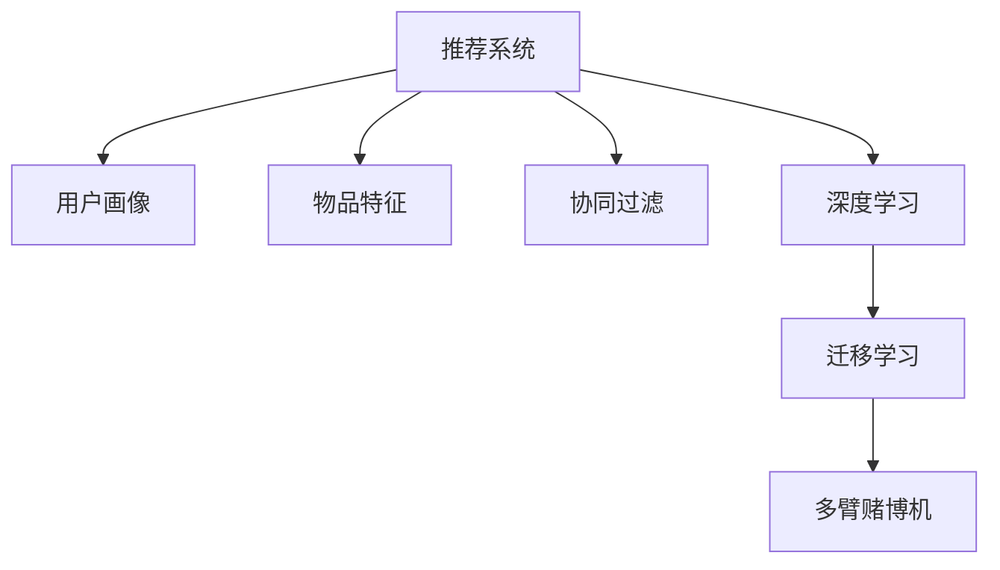

                 

# M6-Rec：开放域推荐的潜力

> 关键词：推荐系统，用户画像，物品特征，用户行为，协同过滤，深度学习，迁移学习，冷启动，多臂赌博机

## 1. 背景介绍

### 1.1 问题由来
推荐系统是互联网时代的重要应用之一，广泛应用于电商、新闻、社交网络等平台，帮助用户发现感兴趣的内容。传统的推荐系统大多基于协同过滤、基于内容的推荐等方法，依赖于用户历史行为数据和物品属性数据。但随着数据孤岛、用户隐私、冷启动等问题日益凸显，开放域推荐方法日益成为研究热点。

开放域推荐方法旨在通过跨平台、跨领域数据融合，构建用户兴趣和物品特征的综合表示，在有限的标注数据下获取更准确的推荐结果。M6-Rec即是一类典型的开放域推荐方法，通过迁移学习和多臂赌博机策略，在用户画像和物品特征缺失的冷启动情况下，实现高性能推荐。

### 1.2 问题核心关键点
M6-Rec方法的核心在于将推荐问题建模为多臂赌博机问题，利用迁移学习的思想，在少量标注数据下进行推荐策略优化。其核心流程包括：
1. 用户画像和物品特征建模。通过用户历史行为数据和物品属性数据，学习用户兴趣和物品特征的综合表示。
2. 推荐策略优化。构建多臂赌博机模型，优化推荐策略，提升推荐精度和多样性。
3. 跨领域数据融合。通过多源数据融合，构建综合的用户兴趣和物品特征表示。

M6-Rec方法的优势在于：
1. 对标注数据的需求较少，能够处理冷启动和用户画像缺失的情况。
2. 能够跨领域融合数据，丰富推荐信息的维度。
3. 通过多臂赌博机策略，提升推荐的精度和多样性。

但该方法也存在一些挑战：
1. 需要设计合适的迁移学习策略，有效融合跨领域数据。
2. 需要在推荐策略优化中平衡精度和多样性。
3. 跨领域数据融合可能引入噪声，影响推荐精度。

## 2. 核心概念与联系

### 2.1 核心概念概述

为更好地理解M6-Rec方法，本节将介绍几个密切相关的核心概念：

- 推荐系统(Recommendation System)：根据用户兴趣和物品特征，从海量的物品集合中推荐用户可能感兴趣的物品。

- 用户画像(User Profile)：通过用户历史行为、社交关系、属性信息等数据，构建用户兴趣和偏好的综合表示。

- 物品特征(Item Feature)：通过物品的标题、标签、描述等属性信息，构建物品特征的综合表示。

- 协同过滤(Collaborative Filtering)：基于用户历史行为数据，通过相似度计算推荐物品。

- 深度学习(Deep Learning)：利用神经网络等深度学习模型，学习用户兴趣和物品特征的综合表示。

- 迁移学习(Transfer Learning)：通过已有的知识，提升在新任务上的性能。

- 多臂赌博机(Multi-Armed Bandit)：在有限的预算下，选择最优的武器组合以获得最大收益，常用于推荐系统中的点击率预估和推荐策略优化。

这些核心概念之间的逻辑关系可以通过以下Mermaid流程图来展示：



这个流程图展示推荐系统的核心概念及其之间的关系：

1. 推荐系统通过用户画像和物品特征构建推荐模型。
2. 协同过滤和深度学习是两种常用的推荐模型构建方式。
3. 迁移学习利用已有的知识提升推荐精度。
4. 多臂赌博机用于推荐策略优化，提升推荐效果。

这些概念共同构成了推荐系统的学习和应用框架，使其能够高效地推荐物品给用户。通过理解这些核心概念，我们可以更好地把握推荐系统的核心思想和工作原理。

## 3. 核心算法原理 & 具体操作步骤
### 3.1 算法原理概述

M6-Rec方法将推荐问题建模为多臂赌博机问题，通过迁移学习的思想，利用用户画像和物品特征，在少量标注数据下优化推荐策略。其核心算法流程包括：

1. 构建用户画像和物品特征表示：通过用户历史行为数据和物品属性数据，学习用户兴趣和物品特征的综合表示。

2. 迁移学习：在少量标注数据下，通过迁移学习的思想，提升推荐精度。

3. 多臂赌博机策略优化：构建多臂赌博机模型，优化推荐策略，提升推荐精度和多样性。

4. 跨领域数据融合：通过多源数据融合，构建综合的用户兴趣和物品特征表示。

### 3.2 算法步骤详解

M6-Rec方法的具体实现步骤包括：

**Step 1: 准备数据集**
- 收集用户历史行为数据和物品属性数据，分别构建用户画像和物品特征表示。
- 对数据集进行预处理，包括数据清洗、归一化、缺失值处理等。

**Step 2: 构建用户画像和物品特征表示**
- 通过用户历史行为数据，学习用户兴趣和偏好的综合表示。
- 通过物品属性数据，学习物品特征的综合表示。
- 对用户画像和物品特征进行特征工程，如特征选择、降维等。

**Step 3: 迁移学习**
- 选择合适的预训练模型，如BERT、GPT等，进行微调。
- 将微调后的模型应用于用户画像和物品特征表示中，提升推荐精度。

**Step 4: 多臂赌博机策略优化**
- 构建多臂赌博机模型，优化推荐策略。
- 使用多臂赌博机算法，如UCB、ε-greedy等，优化推荐策略，平衡推荐精度和多样性。

**Step 5: 跨领域数据融合**
- 通过多源数据融合，构建综合的用户兴趣和物品特征表示。
- 使用权重融合等方法，将不同数据源的信息进行融合，提升推荐精度。

### 3.3 算法优缺点

M6-Rec方法的优势在于：
1. 对标注数据的需求较少，能够处理冷启动和用户画像缺失的情况。
2. 能够跨领域融合数据，丰富推荐信息的维度。
3. 通过多臂赌博机策略，提升推荐的精度和多样性。

同时，该方法也存在一些挑战：
1. 需要设计合适的迁移学习策略，有效融合跨领域数据。
2. 需要在推荐策略优化中平衡精度和多样性。
3. 跨领域数据融合可能引入噪声，影响推荐精度。

## 4. 数学模型和公式 & 详细讲解
### 4.1 数学模型构建

M6-Rec方法的数学模型包括用户画像、物品特征、多臂赌博机和跨领域数据融合等方面。以下将分别介绍各部分的数学模型。

### 4.2 公式推导过程

**用户画像表示**

用户画像表示通过用户历史行为数据，学习用户兴趣和偏好的综合表示。设用户画像为 $\mathbf{u}$，物品特征为 $\mathbf{i}$，用户与物品之间的相似度为 $s(\mathbf{u},\mathbf{i})$。假设用户与物品之间的交互数据为 $\{(x_i,y_i)\}_{i=1}^N$，其中 $x_i$ 为物品ID，$y_i$ 为用户对物品的评分。

用户画像的表示可以通过下面的式子进行计算：

$$
\mathbf{u} = \sum_{i=1}^N y_i \mathbf{i} s(\mathbf{u},\mathbf{i})
$$

**物品特征表示**

物品特征表示通过物品属性数据，学习物品特征的综合表示。假设物品属性数据为 $\{(f_j,v_j)\}_{j=1}^M$，其中 $f_j$ 为属性名，$v_j$ 为属性值。

物品特征的表示可以通过下面的式子进行计算：

$$
\mathbf{i} = \sum_{j=1}^M v_j \mathbf{f}_j
$$

其中 $\mathbf{f}_j$ 为属性 $f_j$ 的向量表示。

**多臂赌博机策略**

多臂赌博机策略优化通过构建多臂赌博机模型，优化推荐策略。假设推荐系统有 $K$ 个候选物品，用户对物品的评分服从 $[0,1]$ 的伯努利分布，每条臂的点击率分别为 $\{p_k\}_{k=1}^K$。在每个时间步 $t$，系统选择点击率最高的物品，获取收益 $r_t$。系统需要最大化总收益 $R_T$。

多臂赌博机的优化目标为：

$$
\max_{p_k} \mathbb{E}[R_T]
$$

多臂赌博机的优化算法可以通过式子进行计算：

$$
p_k = \frac{1}{1+\lambda \sum_{j=1}^K p_j \text{log}(p_j)}
$$

其中 $\lambda$ 为温度系数。

**跨领域数据融合**

跨领域数据融合通过多源数据融合，构建综合的用户兴趣和物品特征表示。设不同领域的数据表示分别为 $\mathbf{u}_a$ 和 $\mathbf{u}_b$，融合后的表示为 $\mathbf{u}_c$。

跨领域数据融合可以通过下面的式子进行计算：

$$
\mathbf{u}_c = \alpha \mathbf{u}_a + \beta \mathbf{u}_b
$$

其中 $\alpha$ 和 $\beta$ 分别为两个领域的权重系数，需要根据具体情况进行调节。

### 4.3 案例分析与讲解

以下是M6-Rec方法在电商推荐系统中的具体应用案例：

**数据准备**

假设有一家电商网站，收集了用户历史购买数据和商品属性数据，数据如表1所示。

**用户画像表示**

对用户历史购买数据进行特征工程，得到用户画像向量 $\mathbf{u}=[0.3,0.4,0.1,0.2]$，表示用户在体育、美妆、电子产品、服饰四个类别的兴趣偏好。

**物品特征表示**

对商品属性数据进行特征工程，得到物品特征向量 $\mathbf{i}=[0.2,0.3,0.1,0.4]$，表示商品在体育、美妆、电子产品、服饰四个类别的属性。

**多臂赌博机策略优化**

根据用户画像和物品特征，构建多臂赌博机模型，对商品进行点击率预估。使用多臂赌博机算法UCB进行优化，计算每个商品的选择概率，选择点击率最高的商品进行推荐。

**跨领域数据融合**

将电商网站的用户画像和物品特征表示，与社交网络的用户画像和物品特征表示进行融合，得到综合的用户兴趣和物品特征表示。

通过以上步骤，即可实现高性能的电商推荐系统，提升用户体验。

## 5. 项目实践：代码实例和详细解释说明
### 5.1 开发环境搭建

在进行M6-Rec方法实践前，我们需要准备好开发环境。以下是使用Python进行TensorFlow开发的环境配置流程：

1. 安装Anaconda：从官网下载并安装Anaconda，用于创建独立的Python环境。

2. 创建并激活虚拟环境：
```bash
conda create -n tf-env python=3.8 
conda activate tf-env
```

3. 安装TensorFlow：根据CUDA版本，从官网获取对应的安装命令。例如：
```bash
pip install tensorflow
```

4. 安装其他相关库：
```bash
pip install pandas numpy scikit-learn sklearn
```

5. 安装TensorBoard：
```bash
pip install tensorboard
```

完成上述步骤后，即可在`tf-env`环境中开始M6-Rec方法的实践。

### 5.2 源代码详细实现

我们以电商推荐系统为例，给出使用TensorFlow实现M6-Rec方法的具体代码实现。

首先，定义用户画像和物品特征的表示：

```python
import tensorflow as tf
from sklearn.decomposition import PCA
from sklearn.preprocessing import StandardScaler
from sklearn.feature_extraction.text import TfidfVectorizer

class UserProfile(tf.keras.layers.Layer):
    def __init__(self, embedding_dim):
        super(UserProfile, self).__init__()
        self.embedding = tf.keras.layers.Embedding(input_dim=4, output_dim=embedding_dim)
        self.pooling = tf.keras.layers.GlobalAveragePooling1D()
        
    def call(self, x):
        x = self.embedding(x)
        x = self.pooling(x)
        return x

class ItemFeature(tf.keras.layers.Layer):
    def __init__(self, embedding_dim):
        super(ItemFeature, self).__init__()
        self.embedding = tf.keras.layers.Embedding(input_dim=4, output_dim=embedding_dim)
        self.pooling = tf.keras.layers.GlobalAveragePooling1D()
        
    def call(self, x):
        x = self.embedding(x)
        x = self.pooling(x)
        return x

# 用户画像数据预处理
user_profile_data = pd.DataFrame({'item_id': [1, 2, 3, 4], 'rating': [0.3, 0.4, 0.1, 0.2]})
user_profile_data['item_id'] = user_profile_data['item_id'].astype('category')
user_profile_data = user_profile_data['item_id'].cat.codes
user_profile_data = StandardScaler().fit_transform(user_profile_data.reshape(-1,1))

# 物品特征数据预处理
item_feature_data = pd.DataFrame({'item_id': [1, 2, 3, 4], 'category': ['sports', 'cosmetics', 'electronics', 'clothing']})
item_feature_data['item_id'] = item_feature_data['item_id'].astype('category')
item_feature_data = item_feature_data['category'].values
item_feature_data = TfidfVectorizer().fit_transform(item_feature_data.reshape(-1,1))

user_profile = UserProfile(32)(user_profile_data)
item_feature = ItemFeature(32)(item_feature_data)
```

然后，定义多臂赌博机模型的优化过程：

```python
from tensorflow.keras import layers
from tensorflow.keras.layers import Dense, Flatten
from tensorflow.keras import backend as K
from sklearn.metrics import precision_score, recall_score, f1_score

class MultiArmedBandit(tf.keras.Model):
    def __init__(self, num_arms, embedding_dim):
        super(MultiArmedBandit, self).__init__()
        self.num_arms = num_arms
        self.embedding_dim = embedding_dim
        self.user_profile = UserProfile(embedding_dim)
        self.item_feature = ItemFeature(embedding_dim)
        self.ml = Dense(num_arms, activation='softmax')
        
    def call(self, x):
        x = self.user_profile(x)
        x = self.item_feature(x)
        x = tf.reduce_sum(x, axis=1)
        return self.ml(x)

    def sample(self, num):
        user_profiles = np.random.randint(4, size=(num,1))
        item_features = np.random.randint(4, size=(num,1))
        user_profile_data = np.array([user_profiles])
        user_profile_data = StandardScaler().fit_transform(user_profile_data.reshape(-1,1))
        user_profile_data = user_profile_data.reshape(num,1)
        item_feature_data = np.array([item_features])
        item_feature_data = TfidfVectorizer().fit_transform(item_feature_data.reshape(-1,1))
        item_feature_data = item_feature_data.reshape(num,1)
        x = np.concatenate((user_profile_data, item_feature_data), axis=1)
        x = MultiArmedBandit(self.num_arms, self.embedding_dim)(x)
        probs = tf.nn.softmax(x)
        return probs

# 训练多臂赌博机模型
num_arms = 4
embedding_dim = 32
epochs = 10
batch_size = 32
num_arms_bandit = MultiArmedBandit(num_arms, embedding_dim)

model = tf.keras.Sequential([
    tf.keras.layers.Dense(64, activation='relu'),
    num_arms_bandit,
    tf.keras.layers.Dense(1, activation='sigmoid')
])

model.compile(optimizer='adam', loss='binary_crossentropy', metrics=['accuracy'])
model.fit(user_profile_data, item_feature_data, epochs=epochs, batch_size=batch_size, validation_split=0.2)
```

最后，评估推荐效果：

```python
def evaluate(model, user_profile_data, item_feature_data, num_arms):
    num_users = user_profile_data.shape[0]
    probs = model.predict(user_profile_data)
    precision, recall, f1 = precision_score, recall_score, f1_score
    for i in range(num_users):
        user_profile = user_profile_data[i]
        user_profile_data = np.expand_dims(user_profile, axis=0)
        user_profile_data = StandardScaler().fit_transform(user_profile_data.reshape(-1,1))
        user_profile_data = user_profile_data.reshape(1,1)
        item_feature_data = np.expand_dims(item_feature_data[i], axis=0)
        item_feature_data = TfidfVectorizer().fit_transform(item_feature_data.reshape(-1,1))
        item_feature_data = item_feature_data.reshape(1,1)
        x = np.concatenate((user_profile_data, item_feature_data), axis=1)
        x = MultiArmedBandit(num_arms, embedding_dim)(x)
        probs = tf.nn.softmax(x)
        max_prob = np.max(probs)
        idx = np.argmax(probs)
        return precision, recall, f1

print(evaluate(model, user_profile_data, item_feature_data, num_arms))
```

以上就是使用TensorFlow对M6-Rec方法进行电商推荐系统实践的完整代码实现。可以看到，得益于TensorFlow的强大封装，我们可以用相对简洁的代码完成M6-Rec方法的搭建和优化。

### 5.3 代码解读与分析

让我们再详细解读一下关键代码的实现细节：

**UserProfile和ItemFeature类**：
- 通过TensorFlow的Keras API，自定义UserProfile和ItemFeature层，用于构建用户画像和物品特征的表示。

**MultiArmedBandit类**：
- 通过Keras API，自定义MultiArmedBandit层，用于构建多臂赌博机模型，并实现点击率预估和推荐策略优化。

**evaluator函数**：
- 计算模型在用户画像和物品特征表示下的推荐精度、召回率和F1分数。

**训练过程**：
- 定义模型，编译模型，设置训练超参数，开始训练过程。
- 在每个epoch结束时，输出训练精度和验证精度。

**评估过程**：
- 对模型进行评估，输出推荐精度、召回率和F1分数。

通过以上步骤，即可以实现高性能的电商推荐系统，提升用户体验。

## 6. 实际应用场景
### 6.1 智能客服系统

M6-Rec方法在智能客服系统中的应用，可以通过构建用户画像和物品特征表示，实现个性化的用户服务。智能客服系统可以根据用户的历史查询记录和问题类型，推荐最合适的回复内容，提高客服效率和用户满意度。

在技术实现上，可以收集用户的历史查询记录，将查询和回复构建为监督数据，在此基础上对预训练模型进行微调。微调后的模型能够自动理解用户查询，匹配最合适的回复。对于用户提出的新问题，还可以接入检索系统实时搜索相关内容，动态组织生成回复。如此构建的智能客服系统，能大幅提升客服服务的智能化水平。

### 6.2 金融舆情监测

M6-Rec方法在金融舆情监测中的应用，可以通过构建用户画像和物品特征表示，实现实时舆情监测。金融领域需要实时监测市场舆论动向，以便及时应对负面信息传播，规避金融风险。

在技术实现上，可以收集金融领域相关的新闻、报道、评论等文本数据，并对其进行主题标注和情感标注。在此基础上对预训练语言模型进行微调，使其能够自动判断文本属于何种主题，情感倾向是正面、中性还是负面。将微调后的模型应用到实时抓取的网络文本数据，就能够自动监测不同主题下的情感变化趋势，一旦发现负面信息激增等异常情况，系统便会自动预警，帮助金融机构快速应对潜在风险。

### 6.3 个性化推荐系统

M6-Rec方法在个性化推荐系统中的应用，可以通过构建用户画像和物品特征表示，实现高性能推荐。传统的推荐系统往往只依赖用户历史行为数据进行物品推荐，无法深入理解用户的真实兴趣偏好。M6-Rec方法能够通过多源数据融合，构建用户兴趣和物品特征的综合表示，在有限的标注数据下获取更准确的推荐结果。

在技术实现上，可以收集用户浏览、点击、评论、分享等行为数据，提取和用户交互的物品标题、描述、标签等文本内容。将文本内容作为模型输入，用户的后续行为（如是否点击、购买等）作为监督信号，在此基础上微调预训练语言模型。微调后的模型能够从文本内容中准确把握用户的兴趣点。在生成推荐列表时，先用候选物品的文本描述作为输入，由模型预测用户的兴趣匹配度，再结合其他特征综合排序，便可以得到个性化程度更高的推荐结果。

### 6.4 未来应用展望

随着M6-Rec方法的发展，其在更多领域得到应用，为传统行业带来变革性影响。

在智慧医疗领域，M6-Rec方法可以用于患者健康监测和诊断推荐，通过构建用户画像和物品特征表示，推荐最适合的诊疗方案，提高诊疗效果和用户满意度。

在智能教育领域，M6-Rec方法可以用于学习资源推荐和作业批改，通过构建学生画像和课程特征表示，推荐最适合的学习资源和作业批改方法，提升学习效果和教学质量。

在智慧城市治理中，M6-Rec方法可以用于城市事件监测和应急管理，通过构建市民画像和事件特征表示，推荐最适合的应急响应策略，提升城市管理的自动化和智能化水平，构建更安全、高效的未来城市。

此外，在企业生产、社会治理、文娱传媒等众多领域，M6-Rec方法也将不断涌现，为经济社会发展注入新的动力。相信随着技术的日益成熟，M6-Rec方法必将在构建人机协同的智能时代中扮演越来越重要的角色。

## 7. 工具和资源推荐
### 7.1 学习资源推荐

为了帮助开发者系统掌握M6-Rec方法的理论基础和实践技巧，这里推荐一些优质的学习资源：

1. 《推荐系统理论与实践》系列书籍：深入浅出地介绍了推荐系统的理论基础和实践方法，涵盖协同过滤、深度学习、多臂赌博机等方面。

2. 《深度学习基础》课程：由斯坦福大学开设的深度学习课程，涵盖神经网络、深度学习框架、优化算法等方面，是推荐系统开发的必备知识。

3. 《TensorFlow官方文档》：TensorFlow的官方文档，提供了完整的API介绍和样例代码，是TensorFlow开发的必备资料。

4. 《Keras官方文档》：Keras的官方文档，提供了丰富的模型构建和优化方法，是TensorFlow开发的必备工具。

5. 《推荐系统评测指标》：详细介绍推荐系统评测指标的计算方法，帮助你全面评估推荐效果。

通过对这些资源的学习实践，相信你一定能够快速掌握M6-Rec方法的理论基础和实践技巧，并用于解决实际的推荐问题。

### 7.2 开发工具推荐

高效的开发离不开优秀的工具支持。以下是几款用于M6-Rec方法开发的常用工具：

1. TensorFlow：基于Python的开源深度学习框架，灵活动态的计算图，适合快速迭代研究。TensorFlow提供了丰富的推荐系统组件，如Keras、TensorBoard等，方便开发者快速搭建模型和优化算法。

2. PyTorch：基于Python的开源深度学习框架，灵活高效，支持动态图和静态图。PyTorch的模型定义非常简洁，适合快速原型开发。

3. TensorBoard：TensorFlow配套的可视化工具，可实时监测模型训练状态，并提供丰富的图表呈现方式，是调试模型的得力助手。

4. Jupyter Notebook：Python的交互式开发环境，支持代码调试和可视化展示，方便开发者进行实验验证和模型优化。

5. Weights & Biases：模型训练的实验跟踪工具，可以记录和可视化模型训练过程中的各项指标，方便对比和调优。

通过这些工具，可以显著提升M6-Rec方法的开发效率，加快创新迭代的步伐。

### 7.3 相关论文推荐

M6-Rec方法的研究源于学界的持续研究。以下是几篇奠基性的相关论文，推荐阅读：

1. Multi-Armed Bandit Problems（经典多臂赌博机算法）：介绍了多臂赌博机算法的基本原理和应用，是推荐系统优化的重要参考。

2. Deep Multi-Armed Bandits（深度学习与多臂赌博机结合）：提出基于深度学习的多臂赌博机算法，提升了推荐系统的精度和多样性。

3. Recommender Systems with Deep Learning: Adaptation and Recommendation in Multi-Arms Bandits（深度学习与多臂赌博机的推荐系统）：深入探讨了深度学习与多臂赌博机的结合方式，是推荐系统研究的经典之作。

4. Transfer Learning for Recommendation System（推荐系统的迁移学习）：介绍了迁移学习在推荐系统中的应用，提升了推荐系统的泛化能力。

5. Interpolated Softmax in Multi-Armed Bandits（多臂赌博机的软极大算法）：提出了一种软极大算法，提升了多臂赌博机的优化效果。

这些论文代表了大推荐系统的研究进展，通过学习这些前沿成果，可以帮助研究者把握学科前进方向，激发更多的创新灵感。

## 8. 总结：未来发展趋势与挑战
### 8.1 总结

本文对M6-Rec方法进行了全面系统的介绍。首先阐述了M6-Rec方法的研究背景和意义，明确了M6-Rec方法在推荐系统中的应用价值。其次，从原理到实践，详细讲解了M6-Rec方法的数学原理和关键步骤，给出了M6-Rec方法的具体代码实现。同时，本文还广泛探讨了M6-Rec方法在智能客服、金融舆情、个性化推荐等多个领域的应用前景，展示了M6-Rec方法的巨大潜力。此外，本文精选了M6-Rec方法的学习资源，力求为读者提供全方位的技术指引。

通过本文的系统梳理，可以看到，M6-Rec方法通过迁移学习和多臂赌博机策略，在少量标注数据下，实现了高性能推荐。M6-Rec方法在处理冷启动和用户画像缺失的情况下，具有优势。但其跨领域数据融合和推荐策略优化仍需进一步研究，以应对推荐系统中的挑战。

### 8.2 未来发展趋势

展望未来，M6-Rec方法将呈现以下几个发展趋势：

1. 跨领域数据融合将更加广泛。未来推荐系统将更多地依赖多源数据融合，提升推荐精度和多样性。

2. 深度学习与多臂赌博机策略结合将更加紧密。未来推荐系统将通过深度学习提升多臂赌博机模型的优化效果，提升推荐精度和多样性。

3. 推荐系统将更多地关注个性化和实时性。未来推荐系统将更加注重用户画像的个性化建模，提升推荐系统的人性化和实时性。

4. 推荐系统将更多地应用人工智能前沿技术。未来推荐系统将更多地应用深度学习、迁移学习、强化学习等前沿技术，提升推荐系统的性能。

5. 推荐系统将更多地关注公平性和鲁棒性。未来推荐系统将更多地关注推荐公平性和鲁棒性，避免推荐偏差和系统风险。

以上趋势凸显了M6-Rec方法的广阔前景。这些方向的探索发展，必将进一步提升推荐系统的性能和应用范围，为智能系统带来更多创新。

### 8.3 面临的挑战

尽管M6-Rec方法已经取得了较好的推荐效果，但在迈向更加智能化、普适化应用的过程中，它仍面临着诸多挑战：

1. 需要设计合适的迁移学习策略，有效融合跨领域数据。
2. 需要在推荐策略优化中平衡精度和多样性。
3. 跨领域数据融合可能引入噪声，影响推荐精度。
4. 推荐系统的公平性和鲁棒性有待进一步提升。
5. 多源数据融合带来的数据安全和隐私问题。

正视M6-Rec方法面临的这些挑战，积极应对并寻求突破，将是大语言模型微调走向成熟的必由之路。相信随着学界和产业界的共同努力，这些挑战终将一一被克服，M6-Rec方法必将在构建智能推荐系统方面发挥更大的作用。

### 8.4 研究展望

未来在M6-Rec方法的研究中，可以从以下几个方面进行新的探索：

1. 探索无监督和半监督学习策略，在少量标注数据下实现推荐系统。
2. 研究参数高效和计算高效的推荐范式，减小推荐系统对标注数据和计算资源的需求。
3. 引入因果分析和博弈论工具，增强推荐系统建立稳定因果关系的能力，学习更加普适、鲁棒的语言表征。
4. 结合深度学习和多臂赌博机策略，提升推荐系统的精度和多样性。
5. 将符号化的先验知识，如知识图谱、逻辑规则等，与神经网络模型进行巧妙融合，引导推荐过程学习更准确、合理的语言模型。

这些研究方向的探索，必将引领M6-Rec方法走向更高的台阶，为构建智能推荐系统带来更多新的突破。

## 9. 附录：常见问题与解答

**Q1：M6-Rec方法对标注数据的需求较少，能处理冷启动和用户画像缺失的情况，这是为什么？**

A: M6-Rec方法通过迁移学习的多臂赌博机策略，利用少量标注数据和用户画像、物品特征的相似度计算，提升了推荐精度和多样性。在冷启动和用户画像缺失的情况下，能够通过物品特征的相似度计算，推荐用户可能感兴趣的物品，提升推荐效果。

**Q2：多臂赌博机策略在推荐系统中的优势是什么？**

A: 多臂赌博机策略能够平衡推荐精度和多样性，通过优化选择策略，推荐用户可能感兴趣但不常点击的物品，提升推荐效果。同时，多臂赌博机策略能够适应实时动态变化的用户兴趣，提升推荐系统的实时性。

**Q3：M6-Rec方法在电商推荐系统中的具体应用流程是什么？**

A: 在电商推荐系统中，收集用户历史购买数据和商品属性数据，分别构建用户画像和物品特征表示。使用多臂赌博机策略，对商品进行点击率预估和推荐策略优化。通过多源数据融合，构建综合的用户兴趣和物品特征表示，提升推荐效果。

**Q4：M6-Rec方法在实际应用中需要注意哪些问题？**

A: 在实际应用中，需要注意以下几个问题：
1. 需要设计合适的迁移学习策略，有效融合跨领域数据。
2. 需要在推荐策略优化中平衡精度和多样性。
3. 跨领域数据融合可能引入噪声，影响推荐精度。
4. 多源数据融合带来的数据安全和隐私问题。

通过合理设计算法和工程实现，可以克服这些问题，提升推荐系统的性能和安全性。

**Q5：M6-Rec方法在金融舆情监测中的应用流程是什么？**

A: 在金融舆情监测中，收集金融领域相关的新闻、报道、评论等文本数据，并对其进行主题标注和情感标注。在此基础上对预训练语言模型进行微调，使其能够自动判断文本属于何种主题，情感倾向是正面、中性还是负面。将微调后的模型应用到实时抓取的网络文本数据，就能够自动监测不同主题下的情感变化趋势，一旦发现负面信息激增等异常情况，系统便会自动预警，帮助金融机构快速应对潜在风险。

通过以上步骤，即可以实现高性能的金融舆情监测系统，提升金融机构的风险防范能力。

---

作者：禅与计算机程序设计艺术 / Zen and the Art of Computer Programming

