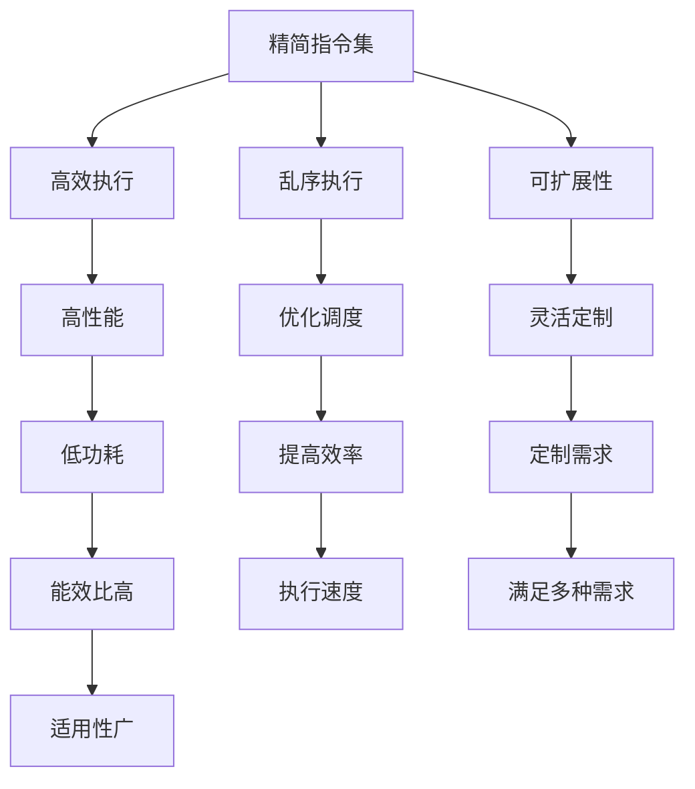

                 

# MIPS架构：嵌入式系统的选择

> 关键词：MIPS架构,嵌入式系统,计算性能,能效,开源,定制,软件支持

## 1. 背景介绍

### 1.1 问题由来
在现代计算机系统中，嵌入式系统因其灵活性、资源受限和性能需求多样性，成为应用最广泛的计算平台之一。这些系统在工业控制、物联网、消费电子、汽车电子等多个领域有着广泛的应用。选择合适的处理器架构对于保证嵌入式系统的性能、安全性和成本效益至关重要。

其中，MIPS架构作为一款经典的RISC架构，因其计算性能高、能效比优和丰富的开源资源，成为了嵌入式系统开发的一个热门选择。然而，随着微处理器技术的发展，RISC-V架构的兴起，以及ARM架构的广泛应用，MIPS架构的适用性和未来发展方向引起了广泛关注。

### 1.2 问题核心关键点
本节将详细介绍MIPS架构的基本概念，并分析其在嵌入式系统中的适用性和优劣势。同时，我们也将探讨MIPS架构与ARM和RISC-V架构的对比，从而帮助开发者根据具体需求选择合适的处理器架构。

## 2. 核心概念与联系

### 2.1 核心概念概述

MIPS（Microprocessor without Interlocked Pipelined Stages）架构是一种基于精简指令集计算的架构，以其高效能、低功耗和灵活性著称。MIPS架构的核心特点包括：

- **精简指令集**：MIPS指令集设计精简，指令数量少，执行速度快。
- **乱序执行**：支持乱序执行和动态调度，提高指令执行效率。
- **可扩展性**：支持模块化设计和定制化扩展。
- **性能与能效**：计算性能高，且功耗低，适用于资源受限的嵌入式系统。

### 2.2 核心概念原理和架构的 Mermaid 流程图



MIPS架构通过精简指令集、乱序执行、可扩展性和高效性能，实现了低功耗和高计算性能，使其在嵌入式系统中具有独特的优势。

### 2.3 核心概念之间的联系

MIPS架构的各个核心概念相互关联，共同构成了其独特的优势：

- 精简指令集使得MIPS架构在执行简单任务时具有高效性能。
- 乱序执行和动态调度优化了指令执行顺序，提高了执行效率。
- 可扩展性使得MIPS架构可以根据实际需求进行定制和优化。
- 低功耗和高效性能使得MIPS架构适合资源受限的嵌入式系统。

## 3. 核心算法原理 & 具体操作步骤

### 3.1 算法原理概述

在嵌入式系统中，MIPS架构的性能和能效是核心关注点。其算法原理主要基于精简指令集和乱序执行，以实现高效能、低功耗的计算。

### 3.2 算法步骤详解

MIPS架构的微处理器设计流程通常包括以下几个关键步骤：

1. **设计精简指令集**：根据系统需求设计精简的指令集，减少指令数量，提高执行效率。
2. **实现乱序执行**：在处理器内部实现乱序执行单元，优化指令调度，提高执行效率。
3. **进行模块化设计**：设计可扩展的模块，便于后期添加新功能或优化性能。
4. **优化能效比**：在设计和实现过程中，注重功耗控制，提高能效比。
5. **测试与验证**：通过测试和验证，确保设计的正确性和性能。

### 3.3 算法优缺点

MIPS架构的优点包括：

- **高效能**：精简指令集和乱序执行使得MIPS架构具有较高的执行效率。
- **低功耗**：通过优化设计和控制功耗，MIPS架构在能效比上具有明显优势。
- **灵活性**：模块化设计和可扩展性使其能够满足多种应用需求。
- **开放性**：开源资源丰富，社区支持良好。

同时，MIPS架构也存在以下缺点：

- **市场份额小**：相比ARM和RISC-V，MIPS架构在嵌入式系统中的市场份额较小。
- **生态系统不完善**：开源资源虽丰富，但硬件支持和服务生态相对薄弱。
- **定制复杂**：模块化设计虽然灵活，但也意味着定制化工作量大，成本高。

### 3.4 算法应用领域

MIPS架构在嵌入式系统中的应用领域主要包括：

- **工业控制**：如自动化生产线、智能工厂等。
- **物联网设备**：如智能家居、物联网传感器等。
- **消费电子**：如智能电视、游戏机等。
- **汽车电子**：如车载系统、电子驾驶等。

此外，MIPS架构在网络设备、医疗设备、能源管理等嵌入式系统应用中也有一定的市场份额。

## 4. 数学模型和公式 & 详细讲解 & 举例说明

### 4.1 数学模型构建

MIPS架构的性能评估通常基于计算性能和能效比。假设MIPS架构的处理器为 $P$，其时钟频率为 $f$，指令周期为 $C$，每条指令所需的晶体管数量为 $M$，则其计算性能 $P_{\text{MIPS}}$ 和能效比 $E_{\text{power}}$ 的计算公式如下：

$$ P_{\text{MIPS}} = \frac{f}{C \cdot M} $$

$$ E_{\text{power}} = \frac{P}{f \cdot E_{\text{computational}}} $$

其中，$E_{\text{computational}}$ 为处理器在执行计算任务时的能量消耗。

### 4.2 公式推导过程

对于MIPS架构的计算性能，假设某任务 $T$ 包含 $N$ 条指令，每条指令执行时间为 $T_{\text{instruction}}$，则执行任务 $T$ 所需的总时间为：

$$ T_{\text{total}} = N \cdot T_{\text{instruction}} $$

假设处理器时钟频率为 $f$，每条指令所需的晶体管数量为 $M$，则处理器在单位时间内能够执行的指令数量为：

$$ N_{\text{executed}} = f \cdot \frac{1}{T_{\text{instruction}}} = \frac{f}{C \cdot M} $$

因此，MIPS架构的计算性能可以表示为：

$$ P_{\text{MIPS}} = N_{\text{executed}} = \frac{f}{C \cdot M} $$

对于能效比，假设处理器在执行任务 $T$ 时的功耗为 $P_{\text{power}}$，则其计算性能和能效比的关系可以表示为：

$$ E_{\text{power}} = \frac{P}{f \cdot E_{\text{computational}}} $$

### 4.3 案例分析与讲解

以MIPS架构的R4000处理器为例，假设其时钟频率为200MHz，每条指令所需的晶体管数量为10000，每条指令的执行时间为1纳秒，则在单位时间内，R4000处理器能够执行的指令数量为：

$$ N_{\text{executed}} = \frac{200 \cdot 10^6}{1 \cdot 10^{-9} \cdot 10000} = 2 \cdot 10^9 $$

因此，R4000处理器的计算性能为：

$$ P_{\text{MIPS}} = 2 \cdot 10^9 = 2 \cdot 10^9 \div 1,000,000 = 20,000 \text{ MIPS} $$

假设R4000处理器在执行任务时的功耗为2瓦，则其能效比为：

$$ E_{\text{power}} = \frac{2}{200 \cdot 10^6 \cdot 2 \cdot 10^{-3}} = 1 \text{ MIPS/W} $$

这表明R4000处理器在执行任务时具有较高的能效比。

## 5. 项目实践：代码实例和详细解释说明

### 5.1 开发环境搭建

要进行MIPS架构的嵌入式系统开发，需要搭建相应的开发环境。以下是搭建开发环境的详细步骤：

1. **安装开发工具链**：
   - 安装GCC编译器：`sudo apt-get install build-essential`
   - 安装MIPS汇编器：`sudo apt-get install mips-linux-gnu-tools`
   - 安装MIPS交叉编译工具链：`sudo apt-get install mips-linux-gnu-toolchain`

2. **配置开发环境**：
   - 设置环境变量：在~/.bashrc文件中添加如下内容：
     ```bash
     export PATH=$PATH:$HOME/.mips工具链路径:$HOME/.mips工具链路径/bin
     ```

3. **测试工具链**：
   - 通过编译简单的C程序测试工具链是否安装成功：
     ```bash
     gcc -mips -o hello hello.c
     ./hello
     ```

### 5.2 源代码详细实现

以下是使用MIPS汇编语言编写的一个简单的Hello World程序：

```assembly
.data
hello: .asciiz "Hello, world!"
.text
main:
    la     $a0, hello
    li     $v0, 4
    syscall
    j     $ra
```

编译该程序需要使用MIPS汇编器，例如：

```bash
mips-linux-gnu-asm hello.asm -o hello.s
gcc -mips -o hello hello.s
./hello
```

### 5.3 代码解读与分析

上述代码的执行流程如下：

1. 将字符串“Hello, world!”的地址赋值给寄存器 $a0$。
2. 将系统调用号4（表示输出字符串）赋值给寄存器 $v0$。
3. 执行系统调用，输出字符串。
4. 跳转到返回地址。

该程序简洁明了，展示了MIPS汇编语言的基本使用。

### 5.4 运行结果展示

运行上述程序，输出结果为：

```
Hello, world!
```

## 6. 实际应用场景

### 6.1 工业控制

MIPS架构在工业控制领域有着广泛的应用，其高效能和低功耗特性使其成为自动化生产线的首选处理器。例如，在汽车生产线上，MIPS架构的处理器可以实时控制生产设备的运行状态，确保生产线的稳定性和可靠性。

### 6.2 物联网设备

MIPS架构的处理器功耗低，适合作为物联网设备的计算核心。例如，在智能家居设备中，MIPS架构的处理器可以处理家庭安防、智能控制等任务，确保设备的智能性和可靠性。

### 6.3 消费电子

MIPS架构的处理器在消费电子领域也有广泛应用，例如在智能电视、游戏机等设备中，MIPS架构的处理器可以处理高帧率图像、声音处理等任务，提供流畅的用户体验。

### 6.4 汽车电子

在汽车电子领域，MIPS架构的处理器可以用于车载信息系统、智能驾驶等任务，确保汽车系统的稳定性和安全性。

## 7. 工具和资源推荐

### 7.1 学习资源推荐

要深入学习MIPS架构，可以参考以下资源：

1. **《MIPS 32-bit Architecture and Assembly Language Programming》**：该书详细介绍了MIPS架构的基本原理和汇编语言编程技巧。
2. **MIPS 32-bit Assembly Language Programming Tutorial**：该教程提供了丰富的MIPS汇编语言编程实例，适合初学者入门。
3. **MIPS Assembly Language Programming Guide**：该指南介绍了MIPS汇编语言的基本概念和编程技巧。
4. **MIPS Hardware-Software Interface**：该课程介绍了MIPS架构的硬件-软件接口设计，适合深入了解MIPS架构的实现细节。
5. **MIPS Computing Guide**：该指南提供了MIPS架构的全面介绍，包括指令集、系统调用、中断处理等。

### 7.2 开发工具推荐

以下是一些常用的MIPS开发工具：

1. **QEMU**：用于模拟MIPS处理器的开源软件，适合在开发过程中进行调试和测试。
2. **Eclipse**：支持MIPS汇编语言编程的IDE，提供了丰富的开发工具和调试功能。
3. **GDB**：开源的调试器，支持MIPS汇编语言的调试。
4. **Ninja**：轻量级的构建系统，适用于MIPS汇编语言编程。
5. **Visual Studio Code**：支持MIPS汇编语言编程的代码编辑器，提供了丰富的插件和调试功能。

### 7.3 相关论文推荐

以下是几篇关于MIPS架构的最新研究论文：

1. **"Enhancing MIPS Architecture with Advanced Vector Extension"**：该论文介绍了如何通过增强MIPS架构的向量扩展，提高计算性能和能效比。
2. **"Optimizing MIPS Assembly Code for Embedded Systems"**：该论文介绍了如何优化MIPS汇编代码，提高嵌入式系统的性能和能效比。
3. **"New MIPS Instruction Set Architecture"**：该论文介绍了MIPS架构的新指令集设计，包括扩展的向量指令和更高效的计算单元。
4. **"Performance Evaluation of MIPS Processors in Embedded Systems"**：该论文评估了MIPS处理器在嵌入式系统中的性能和能效比。
5. **"MIPS Assembly Language Programming Best Practices"**：该论文介绍了MIPS汇编语言编程的最佳实践，包括代码优化和调试技巧。

## 8. 总结：未来发展趋势与挑战

### 8.1 研究成果总结

MIPS架构在嵌入式系统中的应用已经取得了显著成果，其高效能、低功耗和灵活性使其在工业控制、物联网、消费电子和汽车电子等领域具有独特的优势。通过精简指令集、乱序执行和模块化设计，MIPS架构实现了高效能和低功耗，成为嵌入式系统开发的一个热门选择。

### 8.2 未来发展趋势

MIPS架构的未来发展趋势主要包括以下几个方面：

1. **增强向量扩展**：通过增强MIPS架构的向量扩展，提高计算性能和能效比。
2. **低功耗优化**：通过优化设计和功耗控制，进一步降低MIPS架构的功耗。
3. **定制化设计**：根据实际需求进行模块化设计和定制化扩展，满足多样化应用需求。
4. **多核支持**：引入多核设计，提高MIPS架构的处理能力和性能。
5. **人工智能应用**：将MIPS架构应用于人工智能领域，提高处理能力和能效比。

### 8.3 面临的挑战

MIPS架构在未来发展过程中也面临一些挑战：

1. **生态系统不完善**：开源资源虽丰富，但硬件支持和软件生态相对薄弱。
2. **市场份额小**：相比ARM和RISC-V，MIPS架构在嵌入式系统中的市场份额较小。
3. **定制复杂**：模块化设计虽然灵活，但也意味着定制化工作量大，成本高。
4. **能效比提升难度大**：随着工艺和设计的改进，MIPS架构的能效比提升难度逐渐增加。

### 8.4 研究展望

未来，MIPS架构需要在以下方面进行更多研究：

1. **优化编译器**：提高MIPS汇编语言的编译效率和代码质量。
2. **增强编程工具**：提供更丰富的编程工具和调试功能，降低开发难度。
3. **硬件支持**：增加MIPS架构的硬件支持，提高市场竞争力。
4. **应用场景拓展**：探索更多应用场景，如智能家居、智能驾驶等。

## 9. 附录：常见问题与解答

**Q1：MIPS架构和ARM架构相比，有哪些优势和劣势？**

A: MIPS架构和ARM架构各有优劣势：

- **优势**：
  - MIPS架构的高效能和低功耗使得其在能效比上具有明显优势。
  - MIPS架构的精简指令集和乱序执行优化了指令执行效率。
  - MIPS架构的模块化设计和可扩展性使得其能够满足多种应用需求。
  - MIPS架构的开源资源丰富，社区支持良好。
  
- **劣势**：
  - MIPS架构的市场份额较小，硬件支持和软件生态相对薄弱。
  - MIPS架构的定制化工作量大，成本高。
  - MIPS架构的生态系统不完善，开发工具和调试工具相对较少。

**Q2：MIPS架构的优劣与RISC-V架构相比，有哪些不同？**

A: MIPS架构和RISC-V架构在优劣势上有所不同：

- **优势**：
  - MIPS架构的高效能和低功耗使得其在能效比上具有明显优势。
  - MIPS架构的精简指令集和乱序执行优化了指令执行效率。
  - MIPS架构的模块化设计和可扩展性使得其能够满足多种应用需求。
  - MIPS架构的开源资源丰富，社区支持良好。

- **劣势**：
  - RISC-V架构的指令集更加精简，指令数量更少，执行效率更高。
  - RISC-V架构的生态系统更加完善，硬件支持更加丰富。
  - RISC-V架构的社区支持和开发工具更加丰富。

**Q3：在嵌入式系统中，如何选择MIPS架构的处理器？**

A: 在嵌入式系统中，选择MIPS架构的处理器需要考虑以下几个因素：

- **计算性能**：根据实际需求选择计算性能合适的MIPS处理器。
- **功耗**：根据功耗预算选择合适的处理器，优先选择低功耗设计。
- **定制化需求**：根据实际需求选择支持模块化设计和可扩展性的处理器。
- **生态系统**：选择具有丰富开源资源和社区支持的处理器。
- **硬件支持**：选择具有良好硬件支持和开发工具的处理器。

**Q4：MIPS架构的编译器有哪些特点？**

A: MIPS架构的编译器有以下几个特点：

- **优化能力强**：MIPS架构的编译器具有较强的代码优化能力，能够在保证代码质量的同时提高执行效率。
- **支持多种编程语言**：MIPS架构的编译器支持C、C++、assembly等多种编程语言。
- **交叉编译支持**：MIPS架构的编译器支持交叉编译，可以在不同平台下编译和调试MIPS代码。
- **丰富的工具链支持**：MIPS架构的编译器支持GCC、LLVM等多种工具链，方便开发者选择和使用。

**Q5：MIPS架构的未来发展方向是什么？**

A: MIPS架构的未来发展方向主要包括以下几个方面：

- **增强向量扩展**：通过增强MIPS架构的向量扩展，提高计算性能和能效比。
- **低功耗优化**：通过优化设计和功耗控制，进一步降低MIPS架构的功耗。
- **定制化设计**：根据实际需求进行模块化设计和定制化扩展，满足多样化应用需求。
- **多核支持**：引入多核设计，提高MIPS架构的处理能力和性能。
- **人工智能应用**：将MIPS架构应用于人工智能领域，提高处理能力和能效比。

---

作者：禅与计算机程序设计艺术 / Zen and the Art of Computer Programming

