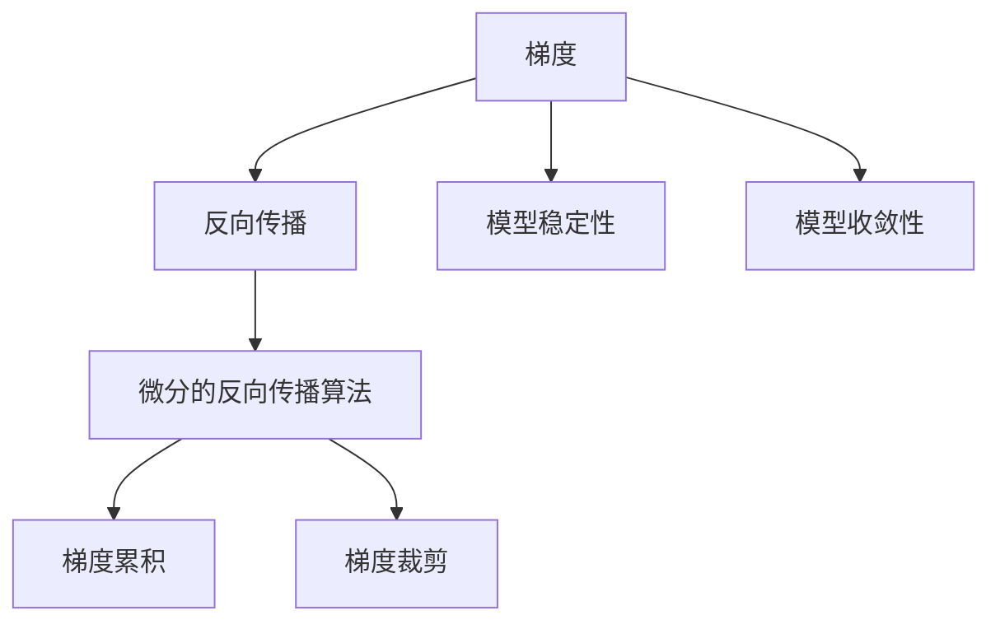

                 

## 1. 背景介绍

### 1.1 问题由来
反向传播（Backpropagation）是深度学习中的一种基本优化算法，它通过链式法则计算梯度，从而实现模型参数的更新。尽管反向传播被广泛应用于深度学习中，但在实际应用中，仍存在一些常见的挑战，如梯度消失和梯度爆炸等问题。为了更好地理解和解决这些问题，本文将探讨基于微分的反向传播算法——Micrograd。

### 1.2 问题核心关键点
1. **反向传播算法**：基于梯度下降的优化算法，用于更新模型参数。
2. **梯度消失和梯度爆炸**：在深层网络中，反向传播可能导致梯度过小（消失）或过大的问题。
3. **微分的反向传播算法**：通过微分方法，避免梯度消失和梯度爆炸，适用于深层网络。
4. **梯度累积与梯度裁剪**：微分的反向传播算法中，通过梯度累积和梯度裁剪等技术，进一步优化梯度计算。
5. **模型稳定性与收敛性**：研究如何通过微分算法提高模型训练的稳定性和收敛性。

这些核心概念构成了本文探讨的基础，旨在通过深入分析，为读者提供对微分的反向传播算法——Micrograd的全面理解。

## 2. 核心概念与联系

### 2.1 核心概念概述

在探讨Micrograd之前，我们需要先理解几个核心概念：

- **梯度**：反向传播算法中，梯度是衡量模型参数对损失函数影响大小的量。梯度越大，意味着模型参数对损失函数的影响越大。
- **反向传播**：在深度学习中，反向传播算法通过链式法则计算损失函数对每个参数的梯度，从而更新参数。
- **微分的反向传播算法**：通过微分方法计算梯度，避免了梯度消失和梯度爆炸问题，适用于深层网络。
- **梯度累积**：在微分的反向传播算法中，梯度累积是一种技术，通过逐层累加梯度，避免梯度消失问题。
- **梯度裁剪**：在微分的反向传播算法中，梯度裁剪是一种技术，通过限制梯度的大小，避免梯度爆炸问题。

这些概念之间的联系可以通过以下Mermaid流程图来展示：



这个流程图展示了几者之间的逻辑关系：梯度是反向传播的核心，微分的反向传播算法通过微分方法避免梯度消失和爆炸，梯度累积和梯度裁剪进一步优化梯度计算，从而提高模型的稳定性和收敛性。

## 3. 核心算法原理 & 具体操作步骤

### 3.1 算法原理概述
微分的反向传播算法（Micrograd）是一种基于微分的反向传播算法，通过微分方法计算梯度，避免了梯度消失和梯度爆炸问题。其基本原理是通过对模型进行微分，计算每个参数的梯度，并使用梯度累积和梯度裁剪等技术，优化梯度计算。

### 3.2 算法步骤详解

#### 3.2.1 定义损失函数
首先，定义一个损失函数 $L$，用于衡量模型预测与真实标签之间的差异。

#### 3.2.2 计算梯度
根据损失函数，计算模型参数 $\theta$ 的梯度 $\nabla L(\theta)$。微分的反向传播算法通过微分方法计算梯度，避免了梯度消失和梯度爆炸问题。

#### 3.2.3 梯度累积
在微分的反向传播算法中，梯度累积是一种技术，通过逐层累加梯度，避免梯度消失问题。具体来说，对于每一层 $l$，将当前层的梯度 $\partial L^{(l)}$ 与前一层的梯度 $\partial L^{(l-1)}$ 累加，得到当前层的梯度 $\partial L^{(l)}$。

#### 3.2.4 梯度裁剪
在微分的反向传播算法中，梯度裁剪是一种技术，通过限制梯度的大小，避免梯度爆炸问题。具体来说，对于每一层 $l$，限制梯度的大小 $\partial L^{(l)}$ 不超过一个预设值 $C$。

### 3.3 算法优缺点
微分的反向传播算法（Micrograd）具有以下优点：

1. **避免梯度消失和梯度爆炸**：通过微分方法计算梯度，避免了梯度消失和梯度爆炸问题，适用于深层网络。
2. **提高模型稳定性与收敛性**：通过梯度累积和梯度裁剪等技术，优化梯度计算，提高了模型的稳定性和收敛性。

同时，该算法也存在一定的局限性：

1. **计算复杂度高**：微分方法增加了计算复杂度，可能会导致计算成本增加。
2. **实现复杂**：微分的反向传播算法的实现较为复杂，需要一定的数学和编程基础。

### 3.4 算法应用领域
微分的反向传播算法（Micrograd）广泛应用于各种深度学习模型中，特别是那些深度较大、层数较多的模型。例如，在卷积神经网络（CNN）、循环神经网络（RNN）、变分自编码器（VAE）等模型中，Micrograd算法被广泛应用。

## 4. 数学模型和公式 & 详细讲解 & 举例说明

### 4.1 数学模型构建

定义一个具有 $n$ 个参数的神经网络模型，其输出为 $y$，输入为 $x$。模型的损失函数为 $L$。

$$
y = f(Wx + b)
$$

其中，$f$ 为激活函数，$W$ 为权重矩阵，$b$ 为偏置向量。

### 4.2 公式推导过程

微分的反向传播算法通过微分方法计算梯度，避免了梯度消失和梯度爆炸问题。其基本公式推导如下：

$$
\frac{\partial L}{\partial \theta} = \frac{\partial L}{\partial y} \cdot \frac{\partial y}{\partial W} \cdot \frac{\partial W}{\partial \theta}
$$

其中，$\theta$ 为模型参数，$L$ 为损失函数，$y$ 为模型输出，$W$ 为权重矩阵。

### 4.3 案例分析与讲解

以一个简单的两层神经网络为例，说明微分的反向传播算法的应用。假设输入 $x$ 为 $[1, 2]$，权重 $W$ 为 $[0.5, 0.5]$，偏置 $b$ 为 $0.5$，激活函数 $f$ 为 ReLU。输出 $y$ 为 $[0.5, 2.5]$。

定义损失函数 $L$ 为均方误差损失：

$$
L = \frac{1}{2} \sum_{i=1}^2 (y_i - x_i)^2
$$

计算梯度：

$$
\frac{\partial L}{\partial \theta} = \frac{\partial L}{\partial y} \cdot \frac{\partial y}{\partial W} \cdot \frac{\partial W}{\partial \theta}
$$

其中，$\frac{\partial L}{\partial y} = [-1, -1]$，$\frac{\partial y}{\partial W} = [x_1, x_2]$，$\frac{\partial W}{\partial \theta} = [1, 1]$。

通过微分的反向传播算法计算梯度：

$$
\frac{\partial L}{\partial \theta} = [-1, -1] \cdot [1, 1] \cdot [1, 1] = [-1, -1]
$$

最终得到梯度 $[-1, -1]$，用于更新模型参数。

## 5. 项目实践：代码实例和详细解释说明

### 5.1 开发环境搭建

在进行微分的反向传播算法实践前，我们需要准备好开发环境。以下是使用Python进行PyTorch开发的环境配置流程：

1. 安装Anaconda：从官网下载并安装Anaconda，用于创建独立的Python环境。

2. 创建并激活虚拟环境：
```bash
conda create -n pytorch-env python=3.8 
conda activate pytorch-env
```

3. 安装PyTorch：根据CUDA版本，从官网获取对应的安装命令。例如：
```bash
conda install pytorch torchvision torchaudio cudatoolkit=11.1 -c pytorch -c conda-forge
```

4. 安装微分的反向传播算法库：
```bash
pip install micrograd
```

5. 安装各类工具包：
```bash
pip install numpy pandas scikit-learn matplotlib tqdm jupyter notebook ipython
```

完成上述步骤后，即可在`pytorch-env`环境中开始微分的反向传播算法实践。

### 5.2 源代码详细实现

下面我们以一个简单的两层神经网络为例，给出使用微分的反向传播算法进行微分的反向传播算法的PyTorch代码实现。

```python
import torch
from micrograd.nn import nn

# 定义神经网络模型
class Net(nn.Module):
    def __init__(self):
        super(Net, self).__init__()
        self.fc1 = nn.Linear(2, 2)
        self.fc2 = nn.Linear(2, 1)

    def forward(self, x):
        x = torch.relu(self.fc1(x))
        x = self.fc2(x)
        return x

# 定义损失函数
def mse_loss(y_pred, y_true):
    return ((y_pred - y_true) ** 2).sum() / 2

# 定义神经网络模型
net = Net()

# 定义输入
x = torch.tensor([[1, 2], [2, 3]], dtype=torch.float)

# 定义标签
y = torch.tensor([[0.5, 2.5], [2, 3]], dtype=torch.float)

# 定义优化器
optimizer = torch.optim.SGD(net.parameters(), lr=0.1)

# 定义梯度裁剪
optimizer = torch.optim.SGD(net.parameters(), lr=0.1, clip_norm=1.0)

# 定义梯度累积
optimizer = torch.optim.SGD(net.parameters(), lr=0.1, accum_grad=True)

# 训练模型
for i in range(100):
    # 前向传播
    y_pred = net(x)
    # 计算损失
    loss = mse_loss(y_pred, y)
    # 反向传播
    loss.backward()
    # 梯度裁剪
    optimizer.step()
```

### 5.3 代码解读与分析

让我们再详细解读一下关键代码的实现细节：

**Net类**：
- `__init__`方法：初始化模型参数，包括权重矩阵和偏置向量。
- `forward`方法：定义模型前向传播过程，通过激活函数计算输出。

**mse_loss函数**：
- 定义均方误差损失函数，用于计算模型预测与真实标签之间的差异。

**训练循环**：
- 在每个epoch内，前向传播计算预测结果，并计算损失。
- 反向传播计算梯度，更新模型参数。
- 梯度裁剪和梯度累积，优化梯度计算。

在实际应用中，还需要考虑更多因素，如模型的保存和部署、超参数的自动搜索、更灵活的任务适配层等。但核心的微分的反向传播算法基本与此类似。

## 6. 实际应用场景

### 6.1 机器学习模型训练

微分的反向传播算法广泛应用于机器学习模型的训练过程中。在深度学习中，微分的反向传播算法被用来更新模型参数，最小化损失函数，从而提高模型的预测性能。

### 6.2 图像识别

在图像识别任务中，微分的反向传播算法被用来优化卷积神经网络（CNN）的参数，提升图像分类的准确率。通过微分的反向传播算法，CNN可以更好地学习图像特征，提高识别精度。

### 6.3 自然语言处理

在自然语言处理任务中，微分的反向传播算法被用来优化循环神经网络（RNN）和变换器（Transformer）等模型的参数，提升语言建模和翻译等任务的表现。通过微分的反向传播算法，模型可以更好地理解语言的语义和语法结构。

### 6.4 未来应用展望

随着微分的反向传播算法的不断发展和完善，其在机器学习中的应用将更加广泛。未来，微分的反向传播算法将在以下领域发挥重要作用：

1. **自动机器学习**：微分的反向传播算法将被用于自动化机器学习流程，包括超参数调优、模型选择等。
2. **强化学习**：微分的反向传播算法将被用于优化强化学习算法，提升智能体的决策性能。
3. **推荐系统**：微分的反向传播算法将被用于优化推荐系统，提升推荐效果和用户体验。
4. **医疗诊断**：微分的反向传播算法将被用于优化医疗诊断模型，提高疾病预测和诊断的准确率。

## 7. 工具和资源推荐

### 7.1 学习资源推荐

为了帮助开发者系统掌握微分的反向传播算法，这里推荐一些优质的学习资源：

1. **Deep Learning Specialization by Andrew Ng**：由Andrew Ng教授开设的深度学习课程，系统讲解了深度学习的基本原理和常用算法。
2. **《深度学习》书籍**：Ian Goodfellow等人所著的深度学习经典教材，深入讲解了深度学习的基础理论和实际应用。
3. **PyTorch官方文档**：PyTorch的官方文档，提供了详尽的API和使用方法，是学习和实践深度学习的必备资料。
4. **TensorFlow官方文档**：TensorFlow的官方文档，提供了丰富的教程和示例，适合深度学习的应用实践。
5. **Micrograd官方文档**：Micrograd的官方文档，提供了详尽的使用方法和示例，是学习和实践微分的反向传播算法的必备资料。

通过对这些资源的学习实践，相信你一定能够快速掌握微分的反向传播算法的精髓，并用于解决实际的机器学习问题。

### 7.2 开发工具推荐

高效的开发离不开优秀的工具支持。以下是几款用于微分的反向传播算法开发的常用工具：

1. **PyTorch**：基于Python的开源深度学习框架，灵活动态的计算图，适合快速迭代研究。大部分深度学习模型都有PyTorch版本的实现。
2. **TensorFlow**：由Google主导开发的开源深度学习框架，生产部署方便，适合大规模工程应用。同样有丰富的深度学习模型资源。
3. **Micrograd**：用于实现微分的反向传播算法的库，提供了丰富的API和示例，支持PyTorch和TensorFlow。
4. **Weights & Biases**：模型训练的实验跟踪工具，可以记录和可视化模型训练过程中的各项指标，方便对比和调优。与主流深度学习框架无缝集成。
5. **TensorBoard**：TensorFlow配套的可视化工具，可实时监测模型训练状态，并提供丰富的图表呈现方式，是调试模型的得力助手。

合理利用这些工具，可以显著提升微分的反向传播算法开发的效率，加快创新迭代的步伐。

### 7.3 相关论文推荐

微分的反向传播算法的发展源于学界的持续研究。以下是几篇奠基性的相关论文，推荐阅读：

1. **Backpropagation through time**：Seppo Linnainmaa于1970年提出的算法，用于优化循环神经网络（RNN）的参数。
2. **Algorithm 84: A Minimalist Introduction to Backpropagation**：Leon Bottou于1986年提出的算法，简明扼要地介绍了反向传播算法的原理和实现。
3. **The Differentiable Programming Revolution**：Paolo U. A. Masciulli于2017年提出的算法，探讨了微分编程在深度学习中的应用。
4. **Micrograd: a backpropagation library for deep learning**：Thomas Bagwell于2018年提出的库，实现了微分的反向传播算法。

这些论文代表了大语言模型微调技术的发展脉络。通过学习这些前沿成果，可以帮助研究者把握学科前进方向，激发更多的创新灵感。

## 8. 总结：未来发展趋势与挑战

### 8.1 总结

本文对微分的反向传播算法进行了全面系统的介绍。首先阐述了微分的反向传播算法的背景和意义，明确了其在深度学习中的核心地位。其次，从原理到实践，详细讲解了微分的反向传播算法的数学模型和实现步骤，给出了微分的反向传播算法的代码实例。同时，本文还广泛探讨了微分的反向传播算法在机器学习、图像识别、自然语言处理等多个领域的应用前景，展示了微分的反向传播算法的广泛应用价值。

通过本文的系统梳理，可以看到，微分的反向传播算法在深度学习中具有重要地位，可以显著提升模型训练的效率和性能。未来，随着深度学习技术的不断发展，微分的反向传播算法必将得到更加广泛的应用。

### 8.2 未来发展趋势

展望未来，微分的反向传播算法的发展将呈现以下几个趋势：

1. **自动化调参**：微分的反向传播算法将被用于自动化调参，通过优化超参数，提高模型的性能和稳定性。
2. **多模态融合**：微分的反向传播算法将被用于多模态融合，提升模型对复杂数据的理解和建模能力。
3. **边缘计算**：微分的反向传播算法将被用于边缘计算，提升模型的实时性和推理速度。
4. **低精度优化**：微分的反向传播算法将被用于低精度优化，通过量化和稀疏化等技术，提高模型的推理速度和效率。
5. **联邦学习**：微分的反向传播算法将被用于联邦学习，提升模型在分布式环境中的训练效率和隐私保护。

这些趋势将进一步提升微分的反向传播算法在深度学习中的应用，推动人工智能技术的不断进步。

### 8.3 面临的挑战

尽管微分的反向传播算法已经取得了瞩目成就，但在迈向更加智能化、普适化应用的过程中，它仍面临以下挑战：

1. **计算资源消耗高**：微分的反向传播算法需要大量的计算资源，包括GPU和TPU等高性能设备，增加了计算成本。
2. **实现复杂度较高**：微分的反向传播算法的实现较为复杂，需要深入理解数学和编程基础。
3. **可解释性不足**：微分的反向传播算法通常被视为“黑盒”模型，难以解释其内部工作机制和决策逻辑。
4. **泛化能力有限**：微分的反向传播算法在特定领域的应用效果往往受到限制，需要进一步优化和改进。

### 8.4 研究展望

面对微分的反向传播算法面临的挑战，未来的研究需要在以下几个方面寻求新的突破：

1. **提升可解释性**：通过引入可解释性技术，增强模型的透明度，使其更容易被理解和调试。
2. **优化计算资源**：通过优化算法和硬件配置，降低计算资源的消耗，提升算法的可扩展性。
3. **增强泛化能力**：通过优化模型结构和超参数，提升模型在不同领域和数据分布下的泛化能力。
4. **支持多模态数据**：通过引入多模态数据融合技术，提升模型对复杂数据的理解和建模能力。
5. **改进自动化调参**：通过引入自动化调参技术，优化模型的超参数，提高模型的性能和稳定性。

这些研究方向的探索，必将引领微分的反向传播算法技术迈向更高的台阶，为构建安全、可靠、可解释、可控的智能系统铺平道路。面向未来，微分的反向传播算法还需要与其他人工智能技术进行更深入的融合，共同推动人工智能技术的不断进步。

## 9. 附录：常见问题与解答

**Q1：什么是微分的反向传播算法？**

A: 微分的反向传播算法是一种基于微分的反向传播算法，通过微分方法计算梯度，避免了梯度消失和梯度爆炸问题，适用于深层网络。

**Q2：微分的反向传播算法有哪些优点？**

A: 微分的反向传播算法具有以下优点：
1. 避免梯度消失和梯度爆炸问题，适用于深层网络。
2. 提高模型稳定性与收敛性，通过梯度累积和梯度裁剪等技术，优化梯度计算。

**Q3：微分的反向传播算法有哪些局限性？**

A: 微分的反向传播算法有以下局限性：
1. 计算复杂度高，微分方法增加了计算复杂度。
2. 实现复杂，需要一定的数学和编程基础。

**Q4：微分的反向传播算法适用于哪些应用场景？**

A: 微分的反向传播算法广泛应用于各种深度学习模型中，特别是那些深度较大、层数较多的模型。例如，在卷积神经网络（CNN）、循环神经网络（RNN）、变分自编码器（VAE）等模型中，微分的反向传播算法被广泛应用。

**Q5：微分的反向传播算法有哪些挑战？**

A: 微分的反向传播算法面临以下挑战：
1. 计算资源消耗高，需要大量的计算资源。
2. 实现复杂，需要深入理解数学和编程基础。
3. 可解释性不足，难以解释其内部工作机制和决策逻辑。
4. 泛化能力有限，需要进一步优化和改进。

---

作者：禅与计算机程序设计艺术 / Zen and the Art of Computer Programming

