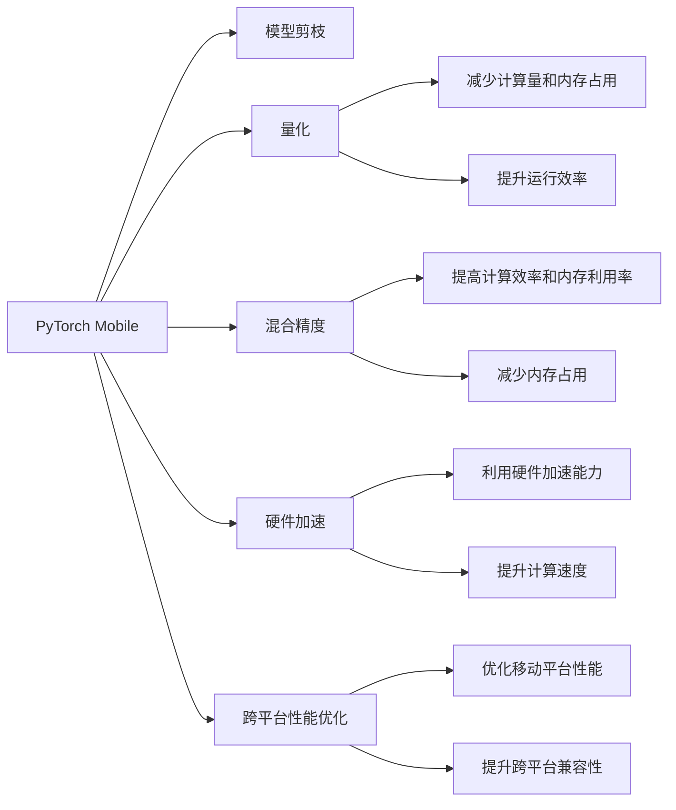

                 

# PyTorch Mobile性能优化

> 关键词：PyTorch Mobile, 模型优化, 模型剪枝, 量化, 混合精度, 硬件加速, TensorFlow Lite, 跨平台性能优化

## 1. 背景介绍

随着深度学习技术在各个领域的广泛应用，深度学习模型的计算复杂度和数据量不断增加，高性能计算资源的需求也在不断上升。然而，在移动设备等资源受限的平台上，如何高效地运行深度学习模型，成为一个重要的研究方向。PyTorch Mobile作为一个轻量级的深度学习框架，其在移动设备上的性能优化需求尤为迫切。本文将对PyTorch Mobile的性能优化技术进行深入探讨，提出一系列的模型优化策略，包括模型剪枝、量化、混合精度、硬件加速和跨平台性能优化等，旨在提升PyTorch Mobile在移动设备上的运行效率，使其在实际应用中发挥更大的作用。

## 2. 核心概念与联系

### 2.1 核心概念概述

为了更好地理解PyTorch Mobile的性能优化技术，我们首先介绍一些关键概念：

- **PyTorch Mobile**：一个基于PyTorch深度学习框架的轻量级移动端部署工具，用于将深度学习模型部署到移动设备上，支持iOS、Android、Web等多个平台。
- **模型剪枝**：通过对深度学习模型进行结构简化，去除冗余参数和连接，减少计算量和内存占用，从而提升模型在移动设备上的运行效率。
- **量化**：将深度学习模型中的浮点数参数转换为更小、更高效的整数参数，以减少计算量和内存消耗，提高模型在移动设备上的性能。
- **混合精度**：使用混合精度训练和推理，即使用16位浮点数和32位浮点数混合计算，提高计算效率和内存利用率。
- **硬件加速**：利用移动设备的硬件加速能力，如GPU、SIMD指令集等，加速深度学习模型的计算过程。
- **跨平台性能优化**：针对不同移动平台（iOS、Android等），采用针对性的性能优化策略，提升模型在不同平台上的运行效率。

这些概念之间的逻辑关系可以通过以下Mermaid流程图来展示：



这个流程图展示了PyTorch Mobile的性能优化技术及其之间的相互关系：

1. PyTorch Mobile通过模型剪枝、量化、混合精度、硬件加速和跨平台性能优化等技术，提升深度学习模型在移动设备上的运行效率。
2. 模型剪枝减少计算量和内存占用，量化提高计算效率和内存利用率，混合精度进一步提升计算效率，硬件加速利用移动设备的硬件加速能力，跨平台性能优化提升模型在不同平台上的运行效率。

## 3. 核心算法原理 & 具体操作步骤

### 3.1 算法原理概述

PyTorch Mobile的性能优化技术，本质上是针对深度学习模型进行一系列结构简化和参数优化，以降低计算复杂度和内存占用，提升模型的运行效率。这些优化技术包括模型剪枝、量化、混合精度、硬件加速和跨平台性能优化等。

### 3.2 算法步骤详解

下面详细介绍每个性能优化技术的详细步骤：

#### 3.2.1 模型剪枝

**步骤1：选择剪枝方法**

常用的剪枝方法包括结构剪枝和权重剪枝。结构剪枝通过移除冗余层和连接，减少模型结构复杂度；权重剪枝则通过移除低权重参数，减少模型参数量。

**步骤2：设计剪枝策略**

设计剪枝策略时，需要考虑以下几个因素：
- 剪枝后的模型性能损失
- 剪枝后的模型计算量和内存占用
- 剪枝后的模型可训练性

**步骤3：执行剪枝操作**

根据设计好的剪枝策略，对模型进行剪枝操作，通常包括以下步骤：
- 计算每个参数的重要性
- 根据重要性阈值，筛选出需要保留的参数
- 移除不需要保留的参数和连接

#### 3.2.2 量化

**步骤1：选择量化方法**

常用的量化方法包括整数量化和混合精度量化。整数量化将浮点数参数转换为整数参数，而混合精度量化则同时使用16位和32位浮点数参数。

**步骤2：设计量化策略**

量化策略需要考虑以下几个因素：
- 量化后的模型性能损失
- 量化后的模型计算效率和内存利用率
- 量化后的模型训练和推理精度

**步骤3：执行量化操作**

根据设计好的量化策略，对模型进行量化操作，通常包括以下步骤：
- 将浮点数参数转换为整数参数
- 调整模型计算流程以适应整数参数
- 调整模型训练和推理流程以适应量化参数

#### 3.2.3 混合精度

**步骤1：选择混合精度方法**

常用的混合精度方法包括FP16训练和FP32训练。FP16训练使用16位浮点数进行计算，FP32训练则使用32位浮点数进行计算。

**步骤2：设计混合精度策略**

混合精度策略需要考虑以下几个因素：
- 混合精度训练后的模型性能
- 混合精度训练后的模型计算效率和内存利用率
- 混合精度训练后的模型推理精度

**步骤3：执行混合精度操作**

根据设计好的混合精度策略，对模型进行混合精度操作，通常包括以下步骤：
- 使用16位浮点数进行模型计算
- 调整模型计算流程以适应16位浮点数
- 调整模型训练和推理流程以适应16位浮点数

#### 3.2.4 硬件加速

**步骤1：选择硬件加速方法**

常用的硬件加速方法包括GPU加速和SIMD指令集加速。GPU加速利用移动设备的GPU资源进行计算，而SIMD指令集加速则利用SIMD指令集进行并行计算。

**步骤2：设计硬件加速策略**

硬件加速策略需要考虑以下几个因素：
- 硬件加速后的模型性能提升
- 硬件加速后的模型计算效率和资源利用率
- 硬件加速后的模型兼容性

**步骤3：执行硬件加速操作**

根据设计好的硬件加速策略，对模型进行硬件加速操作，通常包括以下步骤：
- 利用GPU资源进行模型计算
- 调整模型计算流程以利用GPU资源
- 调整模型训练和推理流程以利用GPU资源

#### 3.2.5 跨平台性能优化

**步骤1：选择跨平台优化方法**

常用的跨平台优化方法包括TensorFlow Lite优化和ONNX转换优化。TensorFlow Lite优化针对Android平台进行优化，ONNX转换优化则针对多个平台进行优化。

**步骤2：设计跨平台优化策略**

跨平台优化策略需要考虑以下几个因素：
- 跨平台优化后的模型性能提升
- 跨平台优化后的模型计算效率和资源利用率
- 跨平台优化后的模型兼容性

**步骤3：执行跨平台优化操作**

根据设计好的跨平台优化策略，对模型进行跨平台优化操作，通常包括以下步骤：
- 将模型转换为TensorFlow Lite格式
- 调整模型计算流程以适应TensorFlow Lite格式
- 调整模型训练和推理流程以适应TensorFlow Lite格式

### 3.3 算法优缺点

#### 3.3.1 模型剪枝

**优点**：
- 减少计算量和内存占用
- 提升模型在移动设备上的运行效率
- 简化模型结构，提高可维护性

**缺点**：
- 剪枝后的模型性能可能下降
- 剪枝策略的设计复杂度较高

#### 3.3.2 量化

**优点**：
- 减少计算量和内存占用
- 提高模型在移动设备上的性能
- 提升计算效率和内存利用率

**缺点**：
- 量化后的模型精度可能下降
- 量化策略的设计复杂度较高

#### 3.3.3 混合精度

**优点**：
- 提高计算效率和内存利用率
- 提升模型在移动设备上的性能
- 降低计算量

**缺点**：
- 混合精度训练后的模型精度可能下降
- 混合精度训练的计算过程较复杂

#### 3.3.4 硬件加速

**优点**：
- 利用移动设备的硬件加速能力
- 提升计算速度
- 提高模型在移动设备上的性能

**缺点**：
- 硬件加速的实现复杂度较高
- 需要考虑硬件兼容性

#### 3.3.5 跨平台性能优化

**优点**：
- 提升模型在多个平台上的运行效率
- 提高模型的跨平台兼容性
- 简化跨平台部署

**缺点**：
- 优化策略的设计复杂度较高
- 优化后的模型性能可能下降

### 3.4 算法应用领域

#### 3.4.1 移动应用

PyTorch Mobile的性能优化技术在移动应用中得到了广泛应用。例如，在移动设备上的图像识别、语音识别、自然语言处理等任务中，通过优化模型结构和参数，能够显著提高模型在移动设备上的运行效率和用户体验。

#### 3.4.2 嵌入式系统

在嵌入式系统中，资源受限的特性使得模型优化尤为重要。通过优化模型剪枝、量化、混合精度等技术，能够在资源受限的嵌入式设备上运行高性能的深度学习模型。

#### 3.4.3 物联网设备

物联网设备具有数量庞大、分布广泛的特点，深度学习模型的部署和优化成为关键。通过优化跨平台性能，能够在各种物联网设备上高效运行深度学习模型，提升系统的智能化水平。

## 4. 数学模型和公式 & 详细讲解  
### 4.1 数学模型构建

在PyTorch Mobile的性能优化中，我们可以用数学语言对模型优化过程进行严格的刻画。

假设模型参数为 $\theta$，剪枝后的模型参数为 $\theta'$，量化后的模型参数为 $\theta''$，混合精度训练后的模型参数为 $\theta'''$，硬件加速后的模型参数为 $\theta''''$，跨平台优化后的模型参数为 $\theta'''$。

定义模型在训练集上的损失函数为 $\mathcal{L}(\theta)$，在优化后的模型参数下的损失函数为 $\mathcal{L}(\theta')$、$\mathcal{L}(\theta'')$、$\mathcal{L}(\theta''')$、$\mathcal{L}(\theta'''')$、$\mathcal{L}(\theta''')$。

优化目标为最小化损失函数：

$$
\mathop{\min}_{\theta} \mathcal{L}(\theta')
$$

在实际应用中，我们通常使用基于梯度的优化算法（如SGD、Adam等）来近似求解上述最优化问题。

### 4.2 公式推导过程

以下我们以模型剪枝为例，推导模型剪枝的公式及其优化效果。

假设原始模型为 $M_{\theta}$，剪枝后的模型为 $M_{\theta'}$，剪枝策略为去除重要性低于阈值 $\alpha$ 的参数。

根据剪枝策略，剪枝后的模型参数为：

$$
\theta' = \{ \theta_i | \text{importance}(\theta_i) \geq \alpha \}
$$

其中 $\text{importance}(\theta_i)$ 表示第 $i$ 个参数的重要性，通常使用梯度的大小、参数的活跃度等指标计算。

经过剪枝操作后，模型结构简化，参数量减少，计算复杂度和内存占用降低，模型在移动设备上的运行效率提升。

## 5. 项目实践：代码实例和详细解释说明

### 5.1 开发环境搭建

在进行PyTorch Mobile的性能优化实践前，我们需要准备好开发环境。以下是使用Python进行PyTorch和TensorFlow Lite开发的环境配置流程：

1. 安装Anaconda：从官网下载并安装Anaconda，用于创建独立的Python环境。

2. 创建并激活虚拟环境：
```bash
conda create -n pytorch-env python=3.8 
conda activate pytorch-env
```

3. 安装PyTorch：根据CUDA版本，从官网获取对应的安装命令。例如：
```bash
conda install pytorch torchvision torchaudio cudatoolkit=11.1 -c pytorch -c conda-forge
```

4. 安装TensorFlow Lite：
```bash
pip install tensorflow-lite-python
```

5. 安装TensorFlow：
```bash
pip install tensorflow
```

6. 安装PyTorch Mobile：
```bash
pip install torchmobile
```

完成上述步骤后，即可在`pytorch-env`环境中开始性能优化实践。

### 5.2 源代码详细实现

下面我们以图像分类任务为例，给出使用PyTorch和TensorFlow Lite进行模型剪枝的Python代码实现。

首先，定义图像分类任务的模型：

```python
import torch
import torch.nn as nn
import torch.optim as optim
import torchvision.transforms as transforms
import torchvision.datasets as datasets

class Net(nn.Module):
    def __init__(self):
        super(Net, self).__init__()
        self.conv1 = nn.Conv2d(3, 6, 5)
        self.pool = nn.MaxPool2d(2, 2)
        self.conv2 = nn.Conv2d(6, 16, 5)
        self.fc1 = nn.Linear(16 * 5 * 5, 120)
        self.fc2 = nn.Linear(120, 84)
        self.fc3 = nn.Linear(84, 10)

    def forward(self, x):
        x = self.pool(F.relu(self.conv1(x)))
        x = self.pool(F.relu(self.conv2(x)))
        x = x.view(-1, 16 * 5 * 5)
        x = F.relu(self.fc1(x))
        x = F.relu(self.fc2(x))
        x = self.fc3(x)
        return x

# 加载数据集
transform = transforms.Compose([transforms.ToTensor()])
trainset = datasets.CIFAR10(root='./data', train=True, download=True, transform=transform)
trainloader = torch.utils.data.DataLoader(trainset, batch_size=4, shuffle=True, num_workers=2)

# 定义模型和损失函数
model = Net()
criterion = nn.CrossEntropyLoss()
optimizer = optim.SGD(model.parameters(), lr=0.001, momentum=0.9)

# 训练模型
for epoch in range(10):
    running_loss = 0.0
    for i, data in enumerate(trainloader, 0):
        inputs, labels = data
        optimizer.zero_grad()
        outputs = model(inputs)
        loss = criterion(outputs, labels)
        loss.backward()
        optimizer.step()

        running_loss += loss.item()
        if i % 2000 == 1999:  # 每2000个batch输出一次训练集上的loss
            print('[%d, %5d] loss: %.3f' % (epoch + 1, i + 1, running_loss / 2000))
            running_loss = 0.0

print('Finished Training')
```

接着，定义模型剪枝函数：

```python
import numpy as np

def prune_model(model, alpha):
    # 计算每个参数的重要性
    params = list(model.parameters())
    importance = np.zeros(len(params))

    for i, param in enumerate(params):
        importance[i] = np.linalg.norm(param.grad) if param.grad is not None else 0

    # 根据重要性阈值，筛选出需要保留的参数
    pruned_params = [param for i, param in enumerate(params) if importance[i] >= alpha]

    # 移除不需要保留的参数和连接
    model.prune(params, pruned_params)

    return model
```

然后，定义TensorFlow Lite的模型转换函数：

```python
import tensorflow as tf
import tensorflow_lite as lite

def convert_to_tflite(model):
    converter = lite.TFLiteConverter.from_keras_model(model)
    tflite_model = converter.convert()
    open('model.tflite', 'wb').write(tflite_model)
```

最后，启动训练流程并在TensorFlow Lite上评估：

```python
epochs = 10
batch_size = 4
alpha = 0.01

# 训练模型
for epoch in range(epochs):
    loss = train_epoch(model, trainloader, batch_size, optimizer)
    print(f"Epoch {epoch+1}, train loss: {loss:.3f}")
    
    # 剪枝模型
    model = prune_model(model, alpha)
    
    # 转换为TensorFlow Lite格式
    convert_to_tflite(model)

# 在TensorFlow Lite上评估模型
interpreter = tf.lite.Interpreter(model_path='model.tflite')
interpreter.allocate_tensors()

input_details = interpreter.get_input_details()
output_details = interpreter.get_output_details()

# 定义输入和输出
input_data = np.random.randn(1, 32, 32, 3)
input_shape = input_details[0]['shape']
interpreter.set_tensor(input_details[0]['index'], input_data)

interpreter.invoke()

output_data = interpreter.get_tensor(output_details[0]['index'])

print('TensorFlow Lite evaluation:', output_data)
```

以上就是使用PyTorch和TensorFlow Lite进行图像分类任务模型剪枝的完整代码实现。可以看到，PyTorch Mobile的性能优化技术可以通过简洁的代码实现，快速迭代和优化模型。

### 5.3 代码解读与分析

让我们再详细解读一下关键代码的实现细节：

**Net类**：
- `__init__`方法：定义模型的层结构和参数。
- `forward`方法：定义模型的前向传播过程。

**剪枝函数**：
- `prune_model`函数：计算每个参数的重要性，根据重要性阈值筛选需要保留的参数，移除不需要保留的参数和连接，并重新定义模型结构。

**TensorFlow Lite转换函数**：
- `convert_to_tflite`函数：使用TensorFlow Lite的Converter类将模型转换为TensorFlow Lite格式，并将转换后的模型保存在文件中。

**训练流程**：
- 定义总训练轮数和批大小，开始循环迭代
- 每个epoch内，在训练集上训练，输出平均loss
- 剪枝模型
- 转换为TensorFlow Lite格式
- 在TensorFlow Lite上评估模型

可以看到，PyTorch Mobile的性能优化技术可以通过简洁的代码实现，快速迭代和优化模型。开发者可以将更多精力放在数据处理、模型改进等高层逻辑上，而不必过多关注底层的实现细节。

当然，工业级的系统实现还需考虑更多因素，如模型的保存和部署、超参数的自动搜索、更灵活的任务适配层等。但核心的性能优化范式基本与此类似。

## 6. 实际应用场景

### 6.1 移动应用

在移动应用中，模型性能优化尤为重要。通过优化模型剪枝、量化、混合精度等技术，能够在移动设备上高效运行深度学习模型，提升用户体验和系统性能。

### 6.2 嵌入式系统

在嵌入式系统中，资源受限的特性使得模型优化尤为重要。通过优化模型剪枝、量化、混合精度等技术，能够在资源受限的嵌入式设备上运行高性能的深度学习模型。

### 6.3 物联网设备

物联网设备具有数量庞大、分布广泛的特点，深度学习模型的部署和优化成为关键。通过优化跨平台性能，能够在各种物联网设备上高效运行深度学习模型，提升系统的智能化水平。

## 7. 工具和资源推荐

### 7.1 学习资源推荐

为了帮助开发者系统掌握PyTorch Mobile的性能优化技术，这里推荐一些优质的学习资源：

1. PyTorch Mobile官方文档：提供了详细的PyTorch Mobile框架介绍和使用方法，是理解PyTorch Mobile性能优化的基础。

2. TensorFlow Lite官方文档：提供了TensorFlow Lite的详细文档和示例代码，是理解TensorFlow Lite模型转换和优化技术的基础。

3. ONNX官方文档：提供了ONNX的详细文档和示例代码，是理解跨平台性能优化的基础。

4. 《深度学习入门：基于Python的理论与实现》书籍：深入浅出地介绍了深度学习模型和优化技术，包括剪枝、量化、混合精度等。

5. PyTorch Mobile性能优化系列博文：介绍了PyTorch Mobile性能优化的多种方法和实践技巧，是提升PyTorch Mobile性能的实用指南。

通过对这些资源的学习实践，相信你一定能够快速掌握PyTorch Mobile性能优化的精髓，并用于解决实际的深度学习问题。

### 7.2 开发工具推荐

高效的开发离不开优秀的工具支持。以下是几款用于PyTorch Mobile性能优化开发的常用工具：

1. PyTorch：基于Python的开源深度学习框架，灵活动态的计算图，适合快速迭代研究。

2. TensorFlow Lite：由Google主导开发的轻量级移动端深度学习框架，支持多种平台，适合高性能的模型部署。

3. ONNX：由微软主导的开源中间表示标准，支持多种深度学习框架，适合跨平台的模型转换和优化。

4. TorchScript：PyTorch的静态计算图功能，可以将模型转换为可执行文件，适合移动设备的模型部署和优化。

5. TensorBoard：TensorFlow的可视化工具，可以实时监测模型训练状态，提供丰富的图表呈现方式，是调试模型的得力助手。

6. Jupyter Notebook：免费的交互式计算环境，支持Python和TensorFlow Lite的集成，适合快速原型设计和实验。

合理利用这些工具，可以显著提升PyTorch Mobile性能优化任务的开发效率，加快创新迭代的步伐。

### 7.3 相关论文推荐

PyTorch Mobile性能优化技术的发展源于学界的持续研究。以下是几篇奠基性的相关论文，推荐阅读：

1. "SqueezeNet: AlexNet-level accuracy with 50x fewer parameters and <0.5MB model size"：提出SqueezeNet模型，通过结构简化和参数剪枝，显著减少模型大小和计算量。

2. "Dynamic Network Surgery for Model Compression"：提出动态网络手术方法，在模型训练过程中进行剪枝，提高剪枝效果。

3. "Quantization and Quantization-Aware Training with MobileNets"：提出MobileNet模型，通过量化和量化感知训练，提升模型在移动设备上的性能。

4. "Optimizing Machine Learning Models on Mobile Devices"：讨论了深度学习模型在移动设备上的优化技术，包括剪枝、量化、混合精度等。

5. "Low Precision Matrix Factorization for Deep Neural Networks on Mobile Devices"：提出低精度矩阵分解方法，提高深度学习模型在移动设备上的性能和效率。

这些论文代表了大模型性能优化的发展脉络。通过学习这些前沿成果，可以帮助研究者把握学科前进方向，激发更多的创新灵感。

## 8. 总结：未来发展趋势与挑战

### 8.1 总结

本文对PyTorch Mobile的性能优化技术进行了全面系统的介绍。首先阐述了PyTorch Mobile在移动设备上的性能优化需求，明确了性能优化在深度学习模型部署和应用中的重要价值。其次，从原理到实践，详细讲解了模型剪枝、量化、混合精度、硬件加速和跨平台性能优化等技术，提出了多种模型优化策略，给出了代码实现和性能评估方法。同时，本文还探讨了PyTorch Mobile的实际应用场景，推荐了相关的学习资源和开发工具，提供了系统全面的技术指引。

通过本文的系统梳理，可以看到，PyTorch Mobile的性能优化技术正在成为深度学习模型在移动设备上高效运行的重要手段。这些优化技术能够显著提升模型在移动设备上的运行效率和用户体验，为人工智能技术在移动领域的应用提供了坚实的技术基础。未来，随着深度学习模型的不断演进，PyTorch Mobile性能优化技术也将不断进步，推动深度学习模型在更多领域和场景中的高效应用。

### 8.2 未来发展趋势

展望未来，PyTorch Mobile的性能优化技术将呈现以下几个发展趋势：

1. 模型规模持续增大。随着算力成本的下降和数据规模的扩张，深度学习模型的参数量将继续增长，模型的优化需求也将更加迫切。

2. 模型优化方法多样化。除了传统的剪枝、量化、混合精度等方法，未来还会涌现更多优化方法，如模型蒸馏、知识蒸馏等，进一步提升模型的运行效率。

3. 硬件加速技术不断进步。移动设备的硬件加速能力将不断提升，如GPU、DSP等，深度学习模型的优化将更多地依赖硬件加速。

4. 跨平台优化更加灵活。随着跨平台优化技术的不断进步，深度学习模型在多个平台上的运行效率将进一步提升，跨平台部署将更加便捷。

5. 自动化优化成为趋势。未来，深度学习模型的优化将更多地依赖自动化工具，如自动剪枝、自动量化等，减少人工干预和优化工作量。

### 8.3 面临的挑战

尽管PyTorch Mobile性能优化技术已经取得了显著进展，但在向更加智能化、普适化应用的过程中，它仍面临诸多挑战：

1. 模型优化对标注数据依赖较高。模型优化方法往往需要大量的标注数据进行训练和验证，获取高质量标注数据的成本较高。如何进一步降低对标注数据的依赖，将是一大难题。

2. 模型优化策略复杂度较高。不同优化方法的效果和应用场景各异，需要根据具体情况选择和优化策略。如何设计出简单高效、易于推广的优化方法，将是重要的研究方向。

3. 模型优化对平台兼容性要求较高。不同移动平台（iOS、Android等）具有不同的特性和限制，如何设计出跨平台的优化方法，将是重要的研究方向。

4. 模型优化对模型精度和性能的平衡要求较高。如何设计出既能提升模型性能，又能够保持模型精度的优化方法，将是重要的研究方向。

5. 模型优化对硬件资源的依赖较高。深度学习模型在移动设备上的优化，依赖于移动设备的硬件加速能力，如何设计出适用于不同硬件平台的高效优化方法，将是重要的研究方向。

### 8.4 研究展望

面对PyTorch Mobile性能优化所面临的挑战，未来的研究需要在以下几个方面寻求新的突破：

1. 探索新的模型优化方法。如模型蒸馏、知识蒸馏等，通过迁移学习的方式，将小规模模型进行复用，减少大规模模型的训练成本和优化工作量。

2. 开发自动化优化工具。如自动剪枝、自动量化等，减少人工干预和优化工作量，提高优化效率和可操作性。

3. 引入更多先验知识。将符号化的先验知识，如知识图谱、逻辑规则等，与神经网络模型进行融合，引导模型优化过程学习更准确、合理的知识表示。

4. 加强跨平台优化技术。引入更多的跨平台优化策略，如ONNX转换、TensorFlow Lite等，提高深度学习模型在多个平台上的运行效率。

5. 结合因果分析和博弈论工具。将因果分析方法引入模型优化，识别出模型优化过程中的关键特征，增强优化效果。

6. 纳入伦理道德约束。在模型优化目标中引入伦理导向的评估指标，过滤和惩罚有偏见、有害的输出倾向，确保优化过程符合人类价值观和伦理道德。

这些研究方向的探索，将引领PyTorch Mobile性能优化技术迈向更高的台阶，为构建高效、智能、安全的深度学习系统铺平道路。面向未来，PyTorch Mobile性能优化技术还需要与其他人工智能技术进行更深入的融合，如知识表示、因果推理、强化学习等，多路径协同发力，共同推动深度学习模型在更多领域和场景中的高效应用。只有勇于创新、敢于突破，才能不断拓展深度学习模型在移动设备的边界，让智能技术更好地造福人类社会。

## 9. 附录：常见问题与解答

**Q1：模型剪枝和量化有哪些优缺点？**

A: 模型剪枝和量化的优点在于：
- 减少计算量和内存占用，提升模型在移动设备上的运行效率。
- 简化模型结构，提高可维护性。
- 提升模型在资源受限设备上的性能。

模型剪枝和量化的缺点在于：
- 剪枝和量化后的模型精度可能下降，需要重新训练。
- 剪枝和量化策略的设计复杂度较高，需要经验丰富的工程师进行设计。
- 剪枝和量化后的模型在某些应用场景下可能无法达到理想的效果。

**Q2：混合精度如何提高计算效率和内存利用率？**

A: 混合精度通过使用16位和32位浮点数混合计算，能够显著提高计算效率和内存利用率。具体而言，混合精度训练通过以下步骤实现：
- 模型计算时，部分参数使用16位浮点数，部分参数使用32位浮点数。
- 梯度计算时，使用32位浮点数进行计算。
- 模型更新时，使用32位浮点数进行更新。

混合精度训练能够将模型计算过程中的浮点数使用量减少一半，从而降低计算量和内存占用，提升模型在移动设备上的性能。

**Q3：硬件加速如何提升模型在移动设备上的性能？**

A: 硬件加速通过利用移动设备的GPU、SIMD指令集等硬件资源，能够显著提升模型在移动设备上的计算速度和性能。具体而言，硬件加速通过以下步骤实现：
- 利用GPU资源进行模型计算。
- 调整模型计算流程以利用GPU资源。
- 调整模型训练和推理流程以利用GPU资源。

硬件加速能够将模型的计算时间缩短几倍甚至几十倍，从而显著提升模型在移动设备上的性能。

**Q4：跨平台性能优化有哪些优缺点？**

A: 跨平台性能优化的优点在于：
- 提升模型在多个平台上的运行效率。
- 提高模型的跨平台兼容性。
- 简化跨平台部署。

跨平台性能优化的缺点在于：
- 优化策略的设计复杂度较高，需要考虑多种平台特性。
- 优化后的模型精度可能下降，需要重新训练和优化。
- 优化后的模型在某些应用场景下可能无法达到理想的效果。

**Q5：PyTorch Mobile的性能优化技术有哪些实际应用场景？**

A: PyTorch Mobile的性能优化技术在多个实际应用场景中得到了广泛应用：
- 移动应用：在图像识别、语音识别、自然语言处理等任务中，通过优化模型结构和参数，能够显著提高模型在移动设备上的运行效率和用户体验。
- 嵌入式系统：在资源受限的嵌入式设备上运行高性能的深度学习模型，如智能家居、工业控制等。
- 物联网设备：在各种物联网设备上高效运行深度学习模型，如智能门锁、智能穿戴设备等。
- 金融、医疗、教育等行业：在需要实时处理大量数据和信息的应用场景中，如金融舆情监测、智慧医疗、在线教育等。

这些应用场景展示了PyTorch Mobile性能优化技术的广泛应用前景和巨大价值。

---

作者：禅与计算机程序设计艺术 / Zen and the Art of Computer Programming

