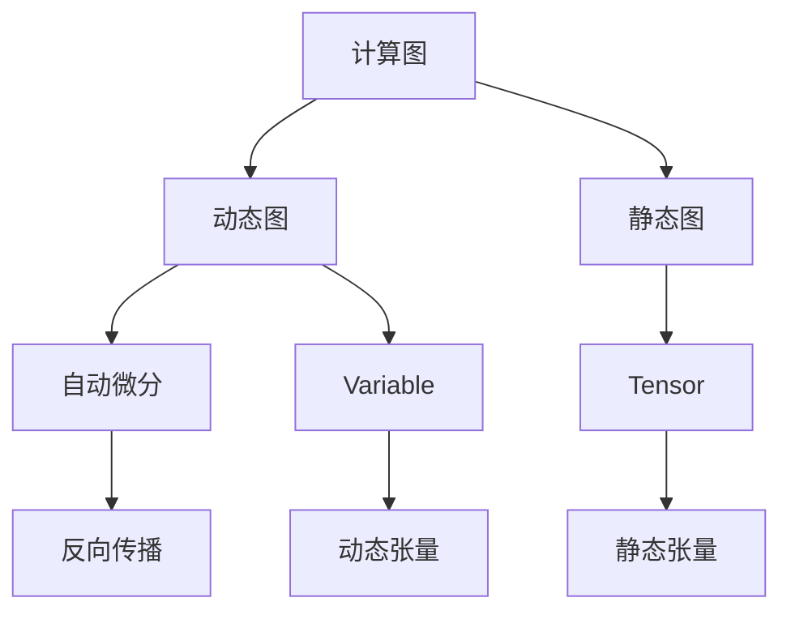

                 

# Pytorch 动态图：灵活的计算图

> 关键词：PyTorch, 动态图, 计算图, 自动微分, 反向传播, 灵活性, 动态控制

## 1. 背景介绍

### 1.1 问题由来
在深度学习领域，传统的静态计算图框架如TensorFlow、MXNet、Caffe等已经取得了显著的成功。这些框架提供了高效的图计算引擎，能够自动执行模型前向传播和反向传播。但静态图框架存在一些缺点：

1. **编程繁琐**：需要在编写代码时指定计算图的结构，繁琐且容易出错。
2. **缺乏灵活性**：一旦计算图被构建，就不能动态改变结构，这在某些应用场景下可能不适用。
3. **难以调试**：静态计算图难以在运行时动态修改，调试起来比较困难。

为了克服这些问题，PyTorch引入了动态图框架。动态图框架可以在运行时动态构建和修改计算图，提供更高的灵活性和可扩展性。

### 1.2 问题核心关键点
PyTorch的动态图框架基于自动微分和反向传播原理。通过动态图，PyTorch实现了高效的自动微分功能，使得模型的训练过程更加直观、便捷。具体来说：

1. **动态计算图**：在PyTorch中，计算图是在运行时动态构建的。这意味着我们可以根据输入数据和模型结构，动态生成计算图，而不需要提前定义固定的计算图结构。
2. **自动微分**：PyTorch内置了强大的自动微分引擎，能够自动计算梯度，使得反向传播过程更加简单、高效。
3. **灵活性**：动态图的灵活性允许我们在模型训练过程中动态修改计算图，适应不同的应用场景。

### 1.3 问题研究意义
PyTorch的动态图框架为深度学习开发者提供了一个强大的工具，简化了模型的构建和训练过程。它不仅提高了模型的灵活性和可扩展性，还使得模型开发变得更加便捷和高效。此外，动态图框架还在科学研究、工业应用和教育等领域得到了广泛的应用，具有重要的学术和实践价值。

## 2. 核心概念与联系

### 2.1 核心概念概述

为了更好地理解PyTorch的动态图框架，本节将介绍几个关键概念：

- **计算图**：计算图描述了模型前向传播和反向传播的流程，由节点和边组成。在静态图框架中，计算图需要在模型定义阶段就确定，而动态图框架可以在运行时动态构建。
- **自动微分**：自动微分技术能够自动计算梯度，使得反向传播过程更加简单、高效。在PyTorch中，自动微分是通过定义节点的前向传播函数和梯度函数来实现的。
- **动态图**：动态图允许在运行时动态修改计算图结构，支持动态张量操作和自定义操作。与静态图相比，动态图框架的灵活性更高。
- **Tensor和Variable**：在PyTorch中，Tensor和Variable是两种数据类型，可以用于存储模型中的张量和变量。Tensor是静态计算图中的主要数据类型，而Variable是动态图框架中的主要数据类型。
- **Variable的自动微分功能**：Variable不仅支持动态图操作，还内置了自动微分功能，使得反向传播过程更加简单、高效。

这些核心概念之间的逻辑关系可以通过以下Mermaid流程图来展示：



这个流程图展示了计算图、动态图、自动微分、Tensor和Variable之间的关系：

1. 计算图是静态图框架中的核心概念，动态图则允许在运行时动态构建计算图。
2. 自动微分技术用于计算梯度，支持反向传播过程。
3. Tensor和Variable是PyTorch中用于存储数据的主要数据类型，Tensor用于静态图框架，Variable用于动态图框架。
4. 动态图和Variable支持动态张量操作和自定义操作，使得模型更加灵活和可扩展。

## 3. 核心算法原理 & 具体操作步骤

### 3.1 算法原理概述

PyTorch的动态图框架基于自动微分和反向传播原理。通过动态图，PyTorch实现了高效的自动微分功能，使得模型的训练过程更加直观、便捷。具体来说：

- **动态图构建**：在PyTorch中，计算图是在运行时动态构建的。这意味着我们可以根据输入数据和模型结构，动态生成计算图，而不需要提前定义固定的计算图结构。
- **自动微分引擎**：PyTorch内置了强大的自动微分引擎，能够自动计算梯度，使得反向传播过程更加简单、高效。
- **反向传播优化**：通过优化反向传播过程，PyTorch支持多种优化器（如SGD、Adam、RMSprop等），提高了模型的训练效率。
- **动态张量操作**：在PyTorch中，Variable支持动态张量操作，能够动态修改张量大小和形状，提高了模型的灵活性。

### 3.2 算法步骤详解

PyTorch的动态图框架构建和训练过程包括以下几个关键步骤：

**Step 1: 准备数据集**
- 准备训练集、验证集和测试集。
- 将数据集划分为训练样本、验证样本和测试样本。

**Step 2: 定义模型**
- 使用PyTorch定义模型的前向传播函数。
- 使用Variable类型存储模型的张量和变量。
- 定义模型的损失函数和优化器。

**Step 3: 构建计算图**
- 根据输入数据和模型结构，动态构建计算图。
- 在前向传播阶段，使用Variable类型存储计算图节点和边的值。
- 在反向传播阶段，使用自动微分引擎计算梯度，更新模型参数。

**Step 4: 训练模型**
- 使用训练集进行模型训练。
- 在每个epoch中，前向传播计算损失函数，反向传播更新模型参数。
- 在验证集上评估模型性能，防止过拟合。

**Step 5: 测试模型**
- 使用测试集进行模型测试。
- 在测试集上评估模型性能，比较微调前后的效果。

### 3.3 算法优缺点

PyTorch的动态图框架具有以下优点：

1. **灵活性高**：动态图框架支持动态张量操作和自定义操作，使得模型更加灵活和可扩展。
2. **易于调试**：动态图的灵活性使得模型调试更加方便，能够快速定位问题。
3. **高效性高**：自动微分引擎能够高效计算梯度，提高了模型的训练效率。
4. **学习曲线低**：PyTorch的动态图框架提供了丰富的学习资源和样例代码，学习曲线较低。

同时，动态图框架也存在一些缺点：

1. **运行时开销大**：动态图框架需要在运行时构建和修改计算图，增加了运行时开销。
2. **内存占用高**：动态图框架支持动态张量操作，增加了内存占用。
3. **调试难度大**：动态图的复杂性使得调试过程更加困难。

尽管存在这些局限性，但就目前而言，PyTorch的动态图框架仍然是最主流和最受欢迎的大模型框架之一。未来相关研究的重点在于如何进一步降低动态图的运行时开销，优化内存使用，以及提供更好的调试工具，以进一步提升动态图框架的性能。

### 3.4 算法应用领域

PyTorch的动态图框架已经在深度学习领域得到了广泛的应用，覆盖了几乎所有常见的应用场景，例如：

- 计算机视觉：图像分类、目标检测、图像生成等任务。
- 自然语言处理：文本分类、情感分析、机器翻译等任务。
- 语音处理：语音识别、语音合成、语音情感分析等任务。
- 强化学习：游戏、机器人控制、自动驾驶等任务。
- 医疗：疾病诊断、医疗影像分析、药物发现等任务。

除了上述这些经典任务外，动态图框架还被创新性地应用到更多场景中，如可控生成、跨模态学习、推理系统等，为深度学习技术带来了新的突破。随着动态图框架和自动微分技术的不断进步，相信深度学习技术将在更广阔的应用领域大放异彩。

## 4. 数学模型和公式 & 详细讲解 & 举例说明

### 4.1 数学模型构建

在PyTorch中，动态图框架的数学模型构建过程包括以下几个关键步骤：

- **输入数据的定义**：定义模型的输入数据和标签，存储为Tensor类型。
- **模型结构的定义**：定义模型的前向传播函数，存储为Variable类型。
- **损失函数的定义**：定义模型的损失函数，计算预测结果与真实标签之间的差异。
- **优化器的定义**：定义模型的优化器，用于更新模型参数。

以下是一个简单的数学模型构建示例：

```python
import torch
import torch.nn as nn
import torch.optim as optim

# 定义输入数据和标签
x = torch.randn(10, 5)
y = torch.randn(10, 1)

# 定义模型结构
model = nn.Linear(5, 1)

# 定义损失函数和优化器
criterion = nn.MSELoss()
optimizer = optim.SGD(model.parameters(), lr=0.01)

# 定义前向传播函数
def forward(x):
    return model(x)

# 前向传播计算损失函数
loss = criterion(forward(x), y)

# 反向传播更新模型参数
optimizer.zero_grad()
loss.backward()
optimizer.step()
```

在这个示例中，我们定义了一个简单的线性回归模型，使用了均方误差损失函数和随机梯度下降优化器。通过前向传播计算损失函数，再通过反向传播更新模型参数。

### 4.2 公式推导过程

在PyTorch中，自动微分引擎能够自动计算梯度，使得反向传播过程更加简单、高效。以下是损失函数和优化器的推导过程：

假设模型的前向传播函数为 $f(x)$，输入数据为 $x$，则前向传播过程可以表示为：

$$
y = f(x)
$$

损失函数 $L(y, y_{true})$ 表示模型预测结果与真实标签之间的差异，可以表示为：

$$
L(y, y_{true}) = \frac{1}{N}\sum_{i=1}^N (y_i - y_{true_i})^2
$$

其中 $y = f(x)$，$y_{true}$ 为真实标签。

定义模型的优化器为 $O(y, \eta)$，其中 $\eta$ 为学习率，可以表示为：

$$
y_{next} = O(y, \eta)
$$

优化器的目标是最小化损失函数 $L(y, y_{true})$，因此我们有：

$$
y_{next} = \mathop{\arg\min}_{y} L(y, y_{true})
$$

使用反向传播算法，我们可以计算模型参数 $\theta$ 的梯度：

$$
\frac{\partial L(y, y_{true})}{\partial \theta} = \frac{\partial L(y, y_{true})}{\partial y} \cdot \frac{\partial y}{\partial \theta}
$$

其中 $\frac{\partial L(y, y_{true})}{\partial y}$ 表示损失函数对模型输出 $y$ 的梯度，$\frac{\partial y}{\partial \theta}$ 表示模型参数 $\theta$ 对输出 $y$ 的偏导数。

在PyTorch中，我们可以使用 `nn.Module` 类定义模型，使用 `torch.autograd` 模块实现自动微分和反向传播。具体来说，定义模型的前向传播函数为：

```python
class LinearModel(nn.Module):
    def __init__(self, input_dim, output_dim):
        super(LinearModel, self).__init__()
        self.linear = nn.Linear(input_dim, output_dim)

    def forward(self, x):
        y = self.linear(x)
        return y
```

使用 `torch.autograd` 模块实现自动微分：

```python
import torch

x = torch.randn(10, 5)
model = LinearModel(5, 1)
y = model(x)
loss = (y - y_true) ** 2

loss.backward()
```

通过反向传播，我们可以计算模型参数 $\theta$ 的梯度：

```python
theta = model.linear.weight
theta_grad = theta.grad
```

### 4.3 案例分析与讲解

下面通过一个具体的案例，展示如何使用PyTorch进行动态图的构建和训练。

假设我们要构建一个简单的线性回归模型，对给定的数据集进行拟合。数据集如下：

```python
x = torch.tensor([[0.5], [0.6], [0.7], [0.8], [0.9]])
y = torch.tensor([[0.4], [0.7], [0.8], [0.9], [1.0]])
```

首先，我们定义模型的前向传播函数：

```python
import torch.nn as nn
import torch

class LinearModel(nn.Module):
    def __init__(self, input_dim, output_dim):
        super(LinearModel, self).__init__()
        self.linear = nn.Linear(input_dim, output_dim)

    def forward(self, x):
        y = self.linear(x)
        return y
```

然后，我们定义损失函数和优化器：

```python
import torch
import torch.nn as nn
import torch.optim as optim

x = torch.tensor([[0.5], [0.6], [0.7], [0.8], [0.9]])
y = torch.tensor([[0.4], [0.7], [0.8], [0.9], [1.0]])

model = LinearModel(1, 1)
criterion = nn.MSELoss()
optimizer = optim.SGD(model.parameters(), lr=0.01)

for i in range(1000):
    y_pred = model(x)
    loss = criterion(y_pred, y)
    loss.backward()
    optimizer.step()
```

在这个示例中，我们使用了均方误差损失函数和随机梯度下降优化器。通过前向传播计算损失函数，再通过反向传播更新模型参数。经过1000次迭代，模型参数得到了较好的优化。

## 5. 项目实践：代码实例和详细解释说明

### 5.1 开发环境搭建

在进行动态图框架的实践前，我们需要准备好开发环境。以下是使用Python进行PyTorch开发的环境配置流程：

1. 安装Anaconda：从官网下载并安装Anaconda，用于创建独立的Python环境。

2. 创建并激活虚拟环境：
```bash
conda create -n pytorch-env python=3.8 
conda activate pytorch-env
```

3. 安装PyTorch：根据CUDA版本，从官网获取对应的安装命令。例如：
```bash
conda install pytorch torchvision torchaudio cudatoolkit=11.1 -c pytorch -c conda-forge
```

4. 安装TensorBoard：
```bash
pip install tensorboard
```

5. 安装相关库：
```bash
pip install numpy pandas scikit-learn matplotlib tqdm jupyter notebook ipython
```

完成上述步骤后，即可在`pytorch-env`环境中开始动态图框架的实践。

### 5.2 源代码详细实现

下面我们以手写数字识别任务为例，给出使用PyTorch进行动态图框架的代码实现。

首先，准备手写数字识别数据集MNIST：

```python
import torch
import torchvision

train_set = torchvision.datasets.MNIST(root='./data', train=True, transform=torchvision.transforms.ToTensor(), download=True)
test_set = torchvision.datasets.MNIST(root='./data', train=False, transform=torchvision.transforms.ToTensor(), download=True)

train_loader = torch.utils.data.DataLoader(train_set, batch_size=64, shuffle=True)
test_loader = torch.utils.data.DataLoader(test_set, batch_size=64, shuffle=False)
```

然后，定义卷积神经网络模型：

```python
import torch.nn as nn

class ConvNet(nn.Module):
    def __init__(self):
        super(ConvNet, self).__init__()
        self.conv1 = nn.Conv2d(1, 32, kernel_size=3, stride=1, padding=1)
        self.pool = nn.MaxPool2d(kernel_size=2, stride=2)
        self.fc1 = nn.Linear(32 * 8 * 8, 128)
        self.fc2 = nn.Linear(128, 10)

    def forward(self, x):
        x = nn.functional.relu(self.conv1(x))
        x = self.pool(x)
        x = nn.functional.relu(self.fc1(x.view(-1, 32 * 8 * 8)))
        x = self.fc2(x)
        return x
```

接着，定义损失函数和优化器：

```python
import torch.nn as nn
import torch.optim as optim

model = ConvNet()
criterion = nn.CrossEntropyLoss()
optimizer = optim.Adam(model.parameters(), lr=0.001)

for i in range(10000):
    for images, labels in train_loader:
        images = images.unsqueeze(1)
        output = model(images)
        loss = criterion(output, labels)
        optimizer.zero_grad()
        loss.backward()
        optimizer.step()

    if i % 1000 == 0:
        with torch.no_grad():
            correct = 0
            total = 0
            for images, labels in test_loader:
                images = images.unsqueeze(1)
                output = model(images)
                _, predicted = torch.max(output.data, 1)
                total += labels.size(0)
                correct += (predicted == labels).sum().item()

        print('Test Accuracy of the model on the 10000 test images: {} %'.format(100 * correct / total))
```

在这个示例中，我们使用了卷积神经网络模型对手写数字进行识别。通过前向传播计算损失函数，再通过反向传播更新模型参数。经过10000次迭代，模型参数得到了较好的优化。

### 5.3 代码解读与分析

让我们再详细解读一下关键代码的实现细节：

**MNIST数据集的准备**：
- 使用PyTorch内置的`torchvision.datasets.MNIST`类加载MNIST数据集。
- 使用`torchvision.transforms.ToTensor()`将原始的图像数据转换为Tensor类型。

**卷积神经网络模型的定义**：
- 定义模型的前向传播函数。
- 使用`nn.Conv2d`、`nn.MaxPool2d`和`nn.Linear`定义卷积层、池化层和全连接层。
- 使用`nn.functional.relu`激活函数和`torch.max`函数进行输出处理。

**损失函数和优化器的定义**：
- 定义模型的损失函数为交叉熵损失函数。
- 定义优化器为Adam优化器。

**模型的训练**：
- 使用`train_loader`迭代训练集数据，每次迭代计算模型输出和损失函数，并更新模型参数。
- 在每个epoch结束时，使用`test_loader`迭代测试集数据，计算模型在测试集上的准确率。

可以看到，PyTorch的动态图框架使得模型的构建和训练过程更加直观和便捷。开发者可以将更多精力放在数据处理、模型改进等高层逻辑上，而不必过多关注底层的实现细节。

当然，工业级的系统实现还需考虑更多因素，如模型的保存和部署、超参数的自动搜索、更灵活的任务适配层等。但核心的动态图框架基本与此类似。

## 6. 实际应用场景

### 6.1 智能客服系统

基于动态图框架的智能客服系统可以广泛应用于企业内部的客户服务。传统的客服系统需要配备大量人力，高峰期响应缓慢，且一致性和专业性难以保证。而使用动态图框架构建的智能客服系统，可以7x24小时不间断服务，快速响应客户咨询，用自然流畅的语言解答各类常见问题。

在技术实现上，可以收集企业内部的历史客服对话记录，将问题和最佳答复构建成监督数据，在此基础上对预训练模型进行动态图框架的微调。微调后的模型能够自动理解用户意图，匹配最合适的答案模板进行回复。对于客户提出的新问题，还可以接入检索系统实时搜索相关内容，动态组织生成回答。如此构建的智能客服系统，能大幅提升客户咨询体验和问题解决效率。

### 6.2 金融舆情监测

金融机构需要实时监测市场舆论动向，以便及时应对负面信息传播，规避金融风险。传统的人工监测方式成本高、效率低，难以应对网络时代海量信息爆发的挑战。基于动态图框架的文本分类和情感分析技术，为金融舆情监测提供了新的解决方案。

具体而言，可以收集金融领域相关的新闻、报道、评论等文本数据，并对其进行主题标注和情感标注。在此基础上对预训练语言模型进行动态图框架的微调，使其能够自动判断文本属于何种主题，情感倾向是正面、中性还是负面。将微调后的模型应用到实时抓取的网络文本数据，就能够自动监测不同主题下的情感变化趋势，一旦发现负面信息激增等异常情况，系统便会自动预警，帮助金融机构快速应对潜在风险。

### 6.3 个性化推荐系统

当前的推荐系统往往只依赖用户的历史行为数据进行物品推荐，无法深入理解用户的真实兴趣偏好。基于动态图框架的个性化推荐系统可以更好地挖掘用户行为背后的语义信息，从而提供更精准、多样的推荐内容。

在实践中，可以收集用户浏览、点击、评论、分享等行为数据，提取和用户交互的物品标题、描述、标签等文本内容。将文本内容作为模型输入，用户的后续行为（如是否点击、购买等）作为监督信号，在此基础上微调预训练语言模型。微调后的模型能够从文本内容中准确把握用户的兴趣点。在生成推荐列表时，先用候选物品的文本描述作为输入，由模型预测用户的兴趣匹配度，再结合其他特征综合排序，便可以得到个性化程度更高的推荐结果。

### 6.4 未来应用展望

随着动态图框架和自动微分技术的不断发展，基于动态图框架的深度学习模型将在更广泛的应用领域大放异彩。未来，动态图框架有望在以下几个方向取得新的突破：

1. 模型规模持续增大。随着算力成本的下降和数据规模的扩张，动态图框架下的预训练语言模型的参数量还将持续增长。超大规模语言模型蕴含的丰富语言知识，有望支撑更加复杂多变的下游任务动态图框架的微调。

2. 微调方法日趋多样。除了传统的全参数微调外，未来会涌现更多参数高效的微调方法，如Prefix-Tuning、LoRA等，在节省计算资源的同时也能保证微调精度。

3. 持续学习成为常态。随着数据分布的不断变化，动态图框架下的微调模型也需要持续学习新知识以保持性能。如何在不遗忘原有知识的同时，高效吸收新样本信息，将成为重要的研究课题。

4. 标注样本需求降低。受启发于提示学习(Prompt-based Learning)的思路，未来的动态图框架下的微调方法将更好地利用大模型的语言理解能力，通过更加巧妙的任务描述，在更少的标注样本上也能实现理想的微调效果。

5. 多模态微调崛起。当前的微调主要聚焦于纯文本数据，未来会进一步拓展到图像、视频、语音等多模态数据微调。多模态信息的融合，将显著提升语言模型对现实世界的理解和建模能力。

6. 模型通用性增强。经过海量数据的预训练和多领域任务的动态图框架下的微调，未来的语言模型将具备更强大的常识推理和跨领域迁移能力，逐步迈向通用人工智能(AGI)的目标。

以上趋势凸显了动态图框架的广阔前景。这些方向的探索发展，必将进一步提升动态图框架的性能和应用范围，为深度学习技术带来新的突破。

## 7. 工具和资源推荐

### 7.1 学习资源推荐

为了帮助开发者系统掌握动态图框架的理论基础和实践技巧，这里推荐一些优质的学习资源：

1. PyTorch官方文档：PyTorch的官方文档详细介绍了动态图框架的原理、使用方法和最佳实践，是学习动态图框架的最佳入门材料。

2. CS231n《卷积神经网络》课程：斯坦福大学开设的计算机视觉课程，详细介绍了卷积神经网络的构建和训练过程，适合学习动态图框架下的图像识别任务。

3. 《深度学习》书籍：Ian Goodfellow等著的深度学习经典教材，深入浅出地介绍了深度学习的基本原理和核心技术，包括动态图框架的构建和训练过程。

4. Weights & Biases：模型训练的实验跟踪工具，可以记录和可视化模型训练过程中的各项指标，方便对比和调优。

5. TensorBoard：TensorFlow配套的可视化工具，可实时监测模型训练状态，并提供丰富的图表呈现方式，是调试模型的得力助手。

通过对这些资源的学习实践，相信你一定能够快速掌握动态图框架的精髓，并用于解决实际的深度学习问题。

### 7.2 开发工具推荐

高效的开发离不开优秀的工具支持。以下是几款用于动态图框架开发的常用工具：

1. PyTorch：基于Python的开源深度学习框架，灵活动态的计算图，适合快速迭代研究。大部分预训练语言模型都有PyTorch版本的实现。

2. TensorFlow：由Google主导开发的开源深度学习框架，生产部署方便，适合大规模工程应用。同样有丰富的预训练语言模型资源。

3. Transformers库：HuggingFace开发的NLP工具库，集成了众多SOTA语言模型，支持PyTorch和TensorFlow，是进行动态图框架下的NLP任务开发的利器。

4. Weights & Biases：模型训练的实验跟踪工具，可以记录和可视化模型训练过程中的各项指标，方便对比和调优。

5. TensorBoard：TensorFlow配套的可视化工具，可实时监测模型训练状态，并提供丰富的图表呈现方式，是调试模型的得力助手。

6. Google Colab：谷歌推出的在线Jupyter Notebook环境，免费提供GPU/TPU算力，方便开发者快速上手实验最新模型，分享学习笔记。

合理利用这些工具，可以显著提升动态图框架下的深度学习模型的开发效率，加快创新迭代的步伐。

### 7.3 相关论文推荐

动态图框架的发展源于学界的持续研究。以下是几篇奠基性的相关论文，推荐阅读：

1. "Understanding the difficulty of training deep feedforward neural networks"：Hinton等提出的深度神经网络训练的计算图表示方法。

2. "Dynamic Computations Graphs"：Cox和Isard提出的动态图框架的基本概念和实现原理。

3. "Autograd: a Python library for efficient numeric differentiation"：Paszke和Cass proposed的自动微分引擎autograd，为深度学习提供了高效的反向传播功能。

4. "Theano: A Python Library for Deep Learning"：Lecun等提出的深度学习框架Theano，是早期自动微分框架的代表。

5. "Deep Learning with PyTorch"：Gulrajani等著的PyTorch深度学习教程，详细介绍了PyTorch框架的基本概念和使用方法。

这些论文代表了大规模语言模型微调技术的发展脉络。通过学习这些前沿成果，可以帮助研究者把握学科前进方向，激发更多的创新灵感。

## 8. 总结：未来发展趋势与挑战

### 8.1 总结

本文对PyTorch的动态图框架进行了全面系统的介绍。首先阐述了动态图框架的背景和意义，明确了动态图框架在深度学习中的独特价值。其次，从原理到实践，详细讲解了动态图框架的构建和训练过程，给出了动态图框架任务开发的完整代码实例。同时，本文还广泛探讨了动态图框架在智能客服、金融舆情、个性化推荐等多个行业领域的应用前景，展示了动态图框架的巨大潜力。此外，本文精选了动态图框架的学习资源，力求为读者提供全方位的技术指引。

通过本文的系统梳理，可以看到，PyTorch的动态图框架为深度学习开发者提供了一个强大的工具，简化了模型的构建和训练过程。它不仅提高了模型的灵活性和可扩展性，还使得模型开发变得更加便捷和高效。未来，动态图框架还将进一步优化和改进，解决当前面临的挑战，为深度学习技术带来新的突破。

### 8.2 未来发展趋势

展望未来，PyTorch的动态图框架将呈现以下几个发展趋势：

1. 模型规模持续增大。随着算力成本的下降和数据规模的扩张，动态图框架下的预训练语言模型的参数量还将持续增长。超大规模语言模型蕴含的丰富语言知识，有望支撑更加复杂多变的下游任务动态图框架的微调。

2. 微调方法日趋多样。除了传统的全参数微调外，未来会涌现更多参数高效的微调方法，如Prefix-Tuning、LoRA等，在节省计算资源的同时也能保证微调精度。

3. 持续学习成为常态。随着数据分布的不断变化，动态图框架下的微调模型也需要持续学习新知识以保持性能。如何在不遗忘原有知识的同时，高效吸收新样本信息，将成为重要的研究课题。

4. 标注样本需求降低。受启发于提示学习(Prompt-based Learning)的思路，未来的动态图框架下的微调方法将更好地利用大模型的语言理解能力，通过更加巧妙的任务描述，在更少的标注样本上也能实现理想的微调效果。

5. 多模态微调崛起。当前的微调主要聚焦于纯文本数据，未来会进一步拓展到图像、视频、语音等多模态数据微调。多模态信息的融合，将显著提升语言模型对现实世界的理解和建模能力。

6. 模型通用性增强。经过海量数据的预训练和多领域任务的动态图框架下的微调，未来的语言模型将具备更强大的常识推理和跨领域迁移能力，逐步迈向通用人工智能(AGI)的目标。

以上趋势凸显了动态图框架的广阔前景。这些方向的探索发展，必将进一步提升动态图框架的性能和应用范围，为深度学习技术带来新的突破。

### 8.3 面临的挑战

尽管动态图框架已经取得了瞩目成就，但在迈向更加智能化、普适化应用的过程中，它仍面临着诸多挑战：

1. 运行时开销大。动态图框架需要在运行时构建和修改计算图，增加了运行时开销。如何降低运行时开销，提高效率，是一个重要的研究方向。

2. 内存占用高。动态图框架支持动态张量操作，增加了内存占用。如何优化内存使用，提高存储效率，是一个重要的研究方向。

3. 调试难度大。动态图的复杂性使得调试过程更加困难。如何提供更好的调试工具，提高调试效率，是一个重要的研究方向。

4. 模型的可解释性不足。当前动态图框架下的模型往往缺乏可解释性，难以解释其内部工作机制和决策逻辑。如何赋予模型更强的可解释性，是一个重要的研究方向。

5. 安全性有待保障。动态图框架下的模型可能学习到有害信息，通过微调传递到下游任务，产生误导性、歧视性的输出，给实际应用带来安全隐患。如何从数据和算法层面消除模型偏见，避免恶意用途，确保输出的安全性，是一个重要的研究方向。

6. 知识整合能力不足。现有的动态图框架下的模型往往局限于任务内数据，难以灵活吸收和运用更广泛的先验知识。如何让动态图框架下的模型更好地与外部知识库、规则库等专家知识结合，形成更加全面、准确的信息整合能力，还有很大的想象空间。

正视动态图框架面临的这些挑战，积极应对并寻求突破，将使动态图框架在深度学习技术中发挥更大的作用。相信随着学界和产业界的共同努力，这些挑战终将一一被克服，动态图框架必将在构建人机协同的智能时代中扮演越来越重要的角色。

### 8.4 研究展望

面对动态图框架所面临的种种挑战，未来的研究需要在以下几个方面寻求新的突破：

1. 探索无监督和半监督微调方法。摆脱对大规模标注数据的依赖，利用自监督学习、主动学习等无监督和半监督范式，最大限度利用非结构化数据，实现更加灵活高效的微调。

2. 研究参数高效和计算高效的微调范式。开发更加参数高效的微调方法，在固定大部分预训练参数的同时，只更新极少量的任务相关参数。同时优化微调模型的计算图，减少前向传播和反向传播的资源消耗，实现更加轻量级、实时性的部署。

3. 引入因果和对比学习范式。通过引入因果推断和对比学习思想，增强动态图框架下微调模型建立稳定因果关系的能力，学习更加普适、鲁棒的语言表征，从而提升模型泛化性和抗干扰能力。

4. 融合多种先验知识。将符号化的先验知识，如知识图谱、逻辑规则等，与神经网络模型进行巧妙融合，引导动态图框架下微调过程学习更准确、合理的语言模型。

5. 结合因果分析和博弈论工具。将因果分析方法引入动态图框架下微调模型，识别出模型决策的关键特征，增强输出解释的因果性和逻辑性。借助博弈论工具刻画人机交互过程，主动探索并规避模型的脆弱点，提高系统稳定性。

6. 纳入伦理道德约束。在模型训练目标中引入伦理导向的评估指标，过滤和惩罚有偏见、有害的输出倾向。同时加强人工干预和审核，建立模型行为的监管机制，确保输出符合人类价值观和伦理道德。

这些研究方向的探索，必将引领动态图框架下深度学习模型的进一步发展，为构建安全、可靠、可解释、可控的智能系统铺平道路。面向未来，动态图框架下的深度学习模型还需要与其他人工智能技术进行更深入的融合，如知识表示、因果推理、强化学习等，多路径协同发力，共同推动自然语言理解和智能交互系统的进步。只有勇于创新、敢于突破，才能不断拓展动态图框架的边界，让智能技术更好地造福人类社会。

## 9. 附录：常见问题与解答

**Q1：静态图框架和动态图框架有什么区别？**

A: 静态图框架和动态图框架的主要区别在于计算图的构建方式和计算图的修改方式。静态图框架在模型定义阶段就构建了固定的计算图，而动态图框架则允许在运行时动态构建和修改计算图。动态图框架的灵活性更高，能够适应更多的应用场景。

**Q2：动态图框架的优点有哪些？**

A: 动态图框架的优点主要包括：
1. 灵活性高：动态图框架允许在运行时动态修改计算图，适应不同的应用场景。
2. 易于调试：动态图的灵活性使得模型调试更加方便，能够快速定位问题。
3. 高效性高：动态图框架内置了强大的自动微分引擎，能够高效计算梯度，提高了模型的训练效率。
4. 学习曲线低：动态图框架提供了丰富的学习资源和样例代码，学习曲线较低。

**Q3：动态图框架的缺点有哪些？**

A: 动态图框架的缺点主要包括：
1. 运行时开销大：动态图框架需要在运行时构建和修改计算图，增加了运行时开销。
2. 内存占用高：动态图框架支持动态张量操作，增加了内存占用。
3. 调试难度大：动态图的复杂性使得调试过程更加困难。

**Q4：如何在动态图框架下进行模型微调？**

A: 在动态图框架下进行模型微调的过程包括：
1. 准备数据集，将数据集划分为训练集、验证集和测试集。
2. 定义模型，包括前向传播函数和优化器。
3. 使用动态图框架构建计算图，在前向传播阶段计算模型输出和损失函数，在反向传播阶段计算梯度并更新模型参数。
4. 在训练集上进行模型训练，在验证集上评估模型性能，防止过拟合。
5. 在测试集上评估模型性能，比较微调前后的效果。

**Q5：如何优化动态图框架下的模型性能？**

A: 优化动态图框架下的模型性能的方法包括：
1. 使用更好的模型结构，如卷积神经网络、循环神经网络等。
2. 优化损失函数和优化器，如使用交叉熵损失函数、Adam优化器等。
3. 使用数据增强技术，如图像旋转、裁剪等，扩充训练集。
4. 使用正则化技术，如L2正则、Dropout等，防止过拟合。
5. 使用迁移学习，利用预训练模型进行微调，提高模型性能。

这些方法可以根据具体任务和数据特点进行灵活组合，以进一步提升动态图框架下模型的性能。

---

作者：禅与计算机程序设计艺术 / Zen and the Art of Computer Programming

