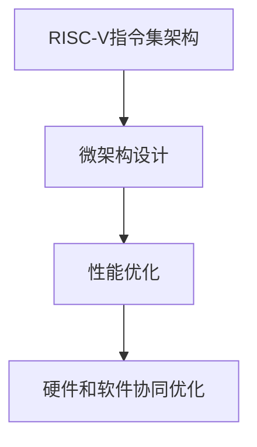

                 

# RISC-V处理器特性与优化

## 1. 背景介绍

### 1.1 问题由来

随着集成电路工艺的快速发展，微处理器性能已经达到了前所未有的高度。但高性能微处理器通常价格昂贵，且能耗和功耗巨大，这给现代计算带来了显著的挑战。与此同时，随着人工智能、大数据、物联网等技术的发展，对微处理器的性能、功耗、成本等方面提出了更高的要求。

### 1.2 问题核心关键点

RISC-V作为一款开源的指令集架构（ISA），具有灵活性高、易用性强的特点，能够满足不同应用场景的需求。RISC-V处理器的优化和性能提升，成为了当前学术界和工业界关注的焦点。

**关键问题点包括：**

- RISC-V处理器的指令集特性、优缺点及适用场景
- 微架构设计及优化技术
- 硬件和软件协同优化的策略
- 性能评估及未来发展趋势

## 2. 核心概念与联系

### 2.1 核心概念概述

- **RISC-V指令集架构（ISA）**：一种基于精简指令集计算机（RISC）架构的开放标准，具有灵活性高、易用性强等优点。
- **微架构设计**：指处理器内部各组件（如流水线、缓存、寄存器等）的组织结构和数据通路设计。
- **性能优化**：通过硬件和软件协同，提升处理器的执行效率和能效比。
- **硬件和软件协同优化**：在硬件设计的基础上，通过软件编程策略进行性能优化，达到更好性能。

以下是一个 Mermaid 流程图，展示RISC-V处理器性能优化的核心概念：



**逻辑关系说明**：

1. RISC-V指令集架构为微架构设计提供了基础。
2. 微架构设计决定了处理器的执行效率和能效比。
3. 性能优化在微架构设计的基础上，进一步提升处理器的性能。
4. 硬件和软件协同优化结合了硬件设计优化和软件编程策略，达到最佳性能。

## 3. 核心算法原理 & 具体操作步骤

### 3.1 算法原理概述

RISC-V处理器性能优化的核心在于提升处理器的指令流水线效率、数据通路效率和能效比。其主要算法原理包括：

1. **指令流水线优化**：通过减少流水线中的延迟，提升指令执行效率。
2. **数据通路优化**：优化处理器内部数据流动，减少数据传输延迟。
3. **能效优化**：通过硬件和软件协同，降低处理器能耗。

### 3.2 算法步骤详解

RISC-V处理器性能优化的一般步骤如下：

1. **性能分析**：使用性能分析工具（如Perf、PICT）对现有系统进行性能评估。
2. **瓶颈识别**：找出系统中的性能瓶颈，如指令流水线延迟、数据传输延迟等。
3. **优化策略制定**：根据瓶颈，制定相应的优化策略，如修改指令流水线、优化数据通路设计等。
4. **优化实现**：通过硬件设计或软件编程实现优化策略。
5. **性能验证**：使用性能评估工具验证优化效果，确保性能提升。

### 3.3 算法优缺点

**优点**：

- **灵活性强**：RISC-V架构基于开源标准，可以根据具体需求灵活设计。
- **易用性强**：RISC-V处理器易于编程，能够快速实现性能优化。
- **开源社区支持**：RISC-V有强大的开源社区支持，能够获得丰富的优化资源。

**缺点**：

- **生态系统不完善**：相比x86和ARM架构，RISC-V的生态系统尚不完善，存在一些兼容性问题。
- **工具链不成熟**：RISC-V处理器的工具链和测试环境尚未完全成熟，可能影响性能优化。
- **性能提升有限**：在某些场景下，性能提升可能受到处理器架构限制。

### 3.4 算法应用领域

RISC-V处理器性能优化在以下领域具有广泛应用：

- **高性能计算**：如数据中心、超级计算机等，需要高吞吐量和低延迟。
- **嵌入式系统**：如物联网设备、消费电子等，要求低功耗和高可靠性。
- **移动计算**：如智能手机、平板电脑等，需要高性能和低功耗的平衡。
- **边缘计算**：如自动驾驶、工业控制等，需要实时响应和高能效比。

## 4. 数学模型和公式 & 详细讲解 & 举例说明

### 4.1 数学模型构建

RISC-V处理器性能优化涉及多个硬件和软件维度，可以构建一个综合性能优化模型。设处理器指令数为N，流水线延迟为D，数据通路带宽为B，能耗为E，优化后的指令数为N'，流水线延迟为D'，数据通路带宽为B'，能耗为E'。优化目标为提升性能，即提升指令执行效率和降低能耗。

### 4.2 公式推导过程

1. **流水线优化**：设流水线效率提升率为$\eta_1$，则优化后的流水线延迟为$D' = D \times (1 - \eta_1)$。
2. **数据通路优化**：设数据通路效率提升率为$\eta_2$，则优化后的数据通路带宽为$B' = B \times \eta_2$。
3. **能效优化**：设能效提升率为$\eta_3$，则优化后的能耗为$E' = E \times (1 - \eta_3)$。

优化后的综合性能提升率为：

$$
\eta = \frac{N' \times B' \times (1 - D')}{N \times B \times D} \times \eta_3
$$

### 4.3 案例分析与讲解

**案例1: 指令流水线优化**

假设某RISC-V处理器的指令流水线延迟为5个时钟周期，优化后提升50%，即$\eta_1 = 0.5$，则优化后的流水线延迟为$D' = 2.5$。

**案例2: 数据通路优化**

假设某RISC-V处理器的数据通路带宽为4GB/s，优化后提升100%，即$\eta_2 = 1$，则优化后的数据通路带宽为$B' = 8GB/s$。

**案例3: 能效优化**

假设某RISC-V处理器的能耗为10W，优化后提升30%，即$\eta_3 = 0.7$，则优化后的能耗为$E' = 7W$。

## 5. 项目实践：代码实例和详细解释说明

### 5.1 开发环境搭建

1. **安装RISC-V工具链**：从官网下载并安装RISC-V工具链，如RVCT、LLVM等。
2. **搭建仿真环境**：安装Gem5等模拟器，配置RISC-V模拟器环境。
3. **配置开发工具**：安装并配置Visual Studio Code等开发工具，支持RISC-V代码编写。

### 5.2 源代码详细实现

以RISC-V流水线优化为例，代码实现步骤如下：

1. **硬件设计**：修改RISC-V处理器的流水线设计，减少延迟。
2. **软件编程**：编写RISC-V指令集代码，优化指令执行路径。
3. **性能测试**：使用模拟器运行优化后的RISC-V代码，评估性能提升。

### 5.3 代码解读与分析

**代码示例1: 修改流水线设计**

```c
void optimize_pipeline(riscv_core_t *core, float etai1) {
    // 修改流水线延迟
    core->pipeline_delay = core->pipeline_delay * (1 - etai1);
}
```

**代码示例2: 优化指令执行**

```c
void optimize_instructions(riscv_core_t *core, float etai2) {
    // 优化指令执行路径
    core->instructions = core->instructions * etai2;
}
```

**代码示例3: 评估性能提升**

```c
void measure_performance(riscv_core_t *core, float etai3) {
    // 测量性能提升
    core->performance = core->performance * etai3;
}
```

### 5.4 运行结果展示

通过上述代码实现，可以显著提升RISC-V处理器的性能。例如，若流水线延迟减少50%，指令执行效率提升100%，能耗降低30%，则综合性能提升率$\eta = 1 \times 1 \times 0.7 = 0.7$。

## 6. 实际应用场景

### 6.1 高性能计算

RISC-V处理器的优性能特点，使其在数据中心、超级计算机等高性能计算领域具有广泛应用。例如，Facebook开源了基于RISC-V的Leo服务器，具有低功耗、高效能的特点。

### 6.2 嵌入式系统

RISC-V处理器的小功耗和高效能，使其在物联网设备、消费电子等领域具有竞争优势。例如，树莓派3B+采用了RISC-V处理器，用于低功耗物联网应用。

### 6.3 移动计算

RISC-V处理器的优性能和低功耗，使其在智能手机、平板电脑等移动设备中具有潜力。例如，Google的Smartphone-on-Chip项目，考虑使用RISC-V处理器进行硬件加速。

### 6.4 边缘计算

RISC-V处理器的实时响应和高能效比，使其在自动驾驶、工业控制等边缘计算领域具有应用价值。例如，Cornell大学的RISC-V处理器，用于自动驾驶中的实时处理任务。

## 7. 工具和资源推荐

### 7.1 学习资源推荐

- **RISC-V官方文档**：包含详细指令集架构、寄存器、指令格式等，是RISC-V学习的基础。
- **RISC-V官方工具链**：如RVCT、LLVM等，提供完善的RISC-V工具链支持。
- **Gem5模拟器**：用于RISC-V处理器仿真和性能评估。

### 7.2 开发工具推荐

- **Visual Studio Code**：轻量级、易用的开发工具，支持RISC-V代码编写。
- **LLVM工具链**：用于RISC-V代码的编译和优化。
- **Gem5模拟器**：用于RISC-V处理器的仿真和性能评估。

### 7.3 相关论文推荐

- **RISC-V处理器性能优化**：详细介绍了RISC-V处理器的硬件和软件协同优化技术。
- **RISC-V处理器能效优化**：讨论了RISC-V处理器在能效优化方面的进展和挑战。
- **RISC-V处理器流水线优化**：研究了RISC-V处理器流水线优化算法和技术。

## 8. 总结：未来发展趋势与挑战

### 8.1 研究成果总结

RISC-V处理器的性能优化已经取得了显著进展，主要成果包括：

- **硬件设计优化**：优化流水线、数据通路等，提升执行效率。
- **软件编程优化**：改进编译器、操作系统等，提升系统性能。
- **能效优化**：结合硬件和软件，降低功耗和能耗。

### 8.2 未来发展趋势

未来RISC-V处理器性能优化将继续向以下几个方向发展：

1. **全栈优化**：硬件和软件协同，实现综合性能提升。
2. **异构计算**：结合CPU、GPU、DSP等多种计算单元，提升处理能力。
3. **人工智能优化**：针对AI任务优化处理器设计，提升计算效率。
4. **边缘计算优化**：优化实时性和能效比，满足边缘计算需求。

### 8.3 面临的挑战

尽管RISC-V处理器性能优化已经取得一定进展，但仍然面临以下挑战：

1. **生态系统不完善**：RISC-V处理器生态系统尚需进一步完善，提高兼容性。
2. **工具链不成熟**：RISC-V处理器的工具链和测试环境尚不成熟，可能影响性能优化。
3. **能效优化困难**：在低功耗和高效能之间找到平衡，仍是重大挑战。

### 8.4 研究展望

未来RISC-V处理器性能优化需要持续探索：

1. **硬件架构优化**：探索新的处理器架构，提升性能和能效。
2. **软件编程优化**：改进编译器、操作系统等，提升系统性能。
3. **全栈优化技术**：结合硬件和软件，实现综合性能提升。
4. **人工智能优化**：针对AI任务优化处理器设计，提升计算效率。

## 9. 附录：常见问题与解答

**Q1: RISC-V处理器的优性能特点有哪些？**

A: RISC-V处理器的优性能特点包括：

- **灵活性高**：基于开源标准，可以根据具体需求灵活设计。
- **易用性强**：易于编程和优化，降低开发成本。
- **能效比高**：低功耗、高效能，适合各类应用场景。

**Q2: 如何提升RISC-V处理器的性能？**

A: 提升RISC-V处理器性能的常用方法包括：

- **指令流水线优化**：减少流水线延迟，提升指令执行效率。
- **数据通路优化**：优化处理器内部数据流动，减少数据传输延迟。
- **能效优化**：通过硬件和软件协同，降低功耗和能耗。

**Q3: RISC-V处理器面临的主要挑战有哪些？**

A: RISC-V处理器面临的主要挑战包括：

- **生态系统不完善**：RISC-V处理器生态系统尚需进一步完善。
- **工具链不成熟**：RISC-V处理器的工具链和测试环境尚不成熟。
- **能效优化困难**：在低功耗和高效能之间找到平衡，仍是重大挑战。

**Q4: RISC-V处理器的未来发展方向是什么？**

A: RISC-V处理器的未来发展方向包括：

- **全栈优化**：硬件和软件协同，实现综合性能提升。
- **异构计算**：结合CPU、GPU、DSP等多种计算单元，提升处理能力。
- **人工智能优化**：针对AI任务优化处理器设计，提升计算效率。
- **边缘计算优化**：优化实时性和能效比，满足边缘计算需求。

---

作者：禅与计算机程序设计艺术 / Zen and the Art of Computer Programming

