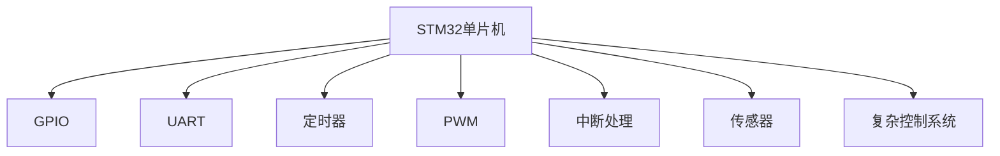

                 

# STM32单片机开发：从点亮LED到复杂控制系统

> 关键词：STM32,单片机,LED,串口通信,定时器,脉冲宽度调制(PWM),中断处理,传感器,复杂控制系统

## 1. 背景介绍

STM32单片机是全球领先的微控制器(MCU)系列，具备高性能、低功耗、丰富外设等特点，广泛应用于工业控制、智能家居、物联网、消费电子等领域。本文将从最基本的STM32单片机入门，逐步讲解STM32单片机的开发和应用，帮助读者从点亮LED到构建复杂控制系统。

## 2. 核心概念与联系

### 2.1 核心概念概述

为更好地理解STM32单片机的开发流程，本节将介绍几个密切相关的核心概念：

- STM32单片机：由STMicroelectronics公司推出的高性能微控制器系列，内置丰富的外设，如GPIO、UART、SPI、I2C、ADC、DAC等，广泛应用于工业控制、智能家居等领域。

- GPIO：通用输入输出引脚，可以用于驱动各种外设，如LED、按钮、传感器等。

- UART：通用异步收发器，用于串口通信，实现主从设备之间的数据交换。

- 定时器：用于生成精确的定时中断，适用于各种定时任务，如PWM控制、周期性采样等。

- PWM：脉冲宽度调制，通过调节输出脉冲的占空比，实现对电机、风扇等外设的精确控制。

- 中断处理：用于处理硬件事件，如按键、传感器、通信等，提高系统的实时响应能力。

- 传感器：包括温度、湿度、压力、光线等环境传感器，用于获取外部环境信息，实现智能控制。

- 复杂控制系统：指由多个STM32单片机及外设构成的系统，可以实现复杂的逻辑控制和交互，构建智能化的应用场景。

这些核心概念之间的逻辑关系可以通过以下Mermaid流程图来展示：



这个流程图展示了一些常见的外设及其与STM32单片机之间的连接关系。

## 3. 核心算法原理 & 具体操作步骤
### 3.1 算法原理概述

STM32单片机开发的核心算法原理包括：

1. GPIO驱动：通过设置GPIO的输出模式，驱动LED、按钮等外设。
2. 串口通信：通过UART协议，实现主从设备之间的数据传输。
3. 定时器控制：通过定时器中断，实现精确的定时任务，如PWM控制、周期性采样等。
4. 中断处理：通过中断服务函数(ISR)，及时响应外部事件，如按键、传感器等。
5. 传感器数据采集：通过ADC、DAC等外设，获取环境信息，实现智能控制。

这些原理构成了STM32单片机开发的基础，是实现复杂控制系统的关键。

### 3.2 算法步骤详解

STM32单片机开发的一般流程如下：

1. 编写STM32单片机的驱动程序，实现外设的初始化。
2. 编写应用代码，实现具体的逻辑控制和处理。
3. 配置调试器，对STM32单片机进行调试和测试。
4. 集成硬件电路，实现系统的实际应用。

下面以点亮LED为例，讲解具体的开发步骤：

#### 3.2.1 硬件设计
- 设计电路板，连接STM32单片机、LED、电源等元器件。

#### 3.2.2 软件设计
- 编写GPIO驱动，设置GPIO的输出模式为开漏输出。
- 编写主函数，实现LED的闪烁控制。
- 配置调试器，设置断点，调试代码。

#### 3.2.3 调试与测试
- 连接电路板到调试器，开启调试功能。
- 运行程序，观察LED的闪烁情况，进行调试。

#### 3.2.4 集成与测试
- 集成硬件电路，连接电源，开启系统。
- 运行程序，观察LED的闪烁情况，进行测试。

通过以上步骤，即可完成点亮LED的基本开发。

### 3.3 算法优缺点

STM32单片机开发具有以下优点：

1. 硬件丰富：内置丰富的外设，可以满足各种应用需求。
2. 性能强大：支持高速运算，适合复杂的控制任务。
3. 开发便捷：完善的开发工具和环境，提高开发效率。
4. 应用广泛：广泛应用于各个领域，具有广泛的行业支持。

同时，STM32单片机开发也存在一些局限性：

1. 学习曲线陡峭：需要掌握硬件、软件等多个方面的知识，门槛较高。
2. 系统复杂：多个外设的协调工作，容易出现故障。
3. 成本较高：高端型号的STM32单片机价格较高，影响应用范围。
4. 技术限制：受到STM32单片机本身的限制，有些功能难以实现。

尽管存在这些局限性，但STM32单片机仍是大规模、高性能应用的首选方案。未来，随着技术的发展，STM32单片机的应用将更加广泛，开发难度将逐步降低。

### 3.4 算法应用领域

STM32单片机开发已经广泛应用于多个领域，如：

- 工业控制：用于机器人、自动化生产线、能源管理等。
- 智能家居：用于智能灯泡、智能音箱、智能门锁等。
- 物联网：用于传感器节点、数据采集、网络通信等。
- 消费电子：用于手机、平板电脑、智能电视等。
- 医疗设备：用于健康监测、病床控制系统等。

这些领域的应用展示了STM32单片机的广泛适应性和强大功能。

## 4. 数学模型和公式 & 详细讲解 & 举例说明
### 4.1 数学模型构建

STM32单片机的开发需要一定的数学模型和公式支持。以PWM控制为例，其数学模型如下：

- 占空比公式：$D = \frac{t_{on}}{T}$，其中$T$为周期，$t_{on}$为高电平时间。
- 输出频率公式：$f_{out} = \frac{1}{T} = \frac{f_{in}}{n}$，其中$f_{in}$为输入频率，$n$为预分频系数。

### 4.2 公式推导过程

以PWM控制为例，推导PWM占空比的计算公式：

- 占空比定义为高电平时间$t_{on}$与周期$T$的比值。
- 根据STM32单片机的定时器设置，可以得到：
$$
D = \frac{t_{on}}{T} = \frac{t_{on}}{n \times f_{in} \times C_{clr}} = \frac{t_{on}}{n \times f_{in} \times \frac{T_{clr}}{2}}
$$
其中，$n$为预分频系数，$f_{in}$为输入频率，$T_{clr}$为时钟周期。

### 4.3 案例分析与讲解

以STM32单片机定时器为例，讲解如何使用定时器实现PWM控制：

- 在STM32单片机的定时器中断中，记录当前定时器计数器的值$cnt$，计算占空比$D$。
- 设置GPIO输出为高电平，进入定时器内部延时，延时时间为$t_{on}$。
- 设置GPIO输出为低电平，退出定时器中断。
- 重复上述步骤，实现连续的PWM输出。

## 5. 项目实践：代码实例和详细解释说明
### 5.1 开发环境搭建

在进行STM32单片机开发前，需要搭建开发环境。以下是使用STM32CubeIDE搭建STM32单片机开发环境的步骤：

1. 安装STM32CubeIDE：从官网下载并安装STM32CubeIDE，用于开发STM32单片机应用。
2. 配置调试器：连接调试器到STM32单片机，设置调试器参数，如串口通信协议、调试器类型等。
3. 添加STM32库：添加STM32库，支持STM32单片机的各种外设驱动。
4. 创建工程：创建新的STM32工程，配置工程参数，如串口通信、定时器等。
5. 编写代码：编写STM32单片机的驱动程序和应用代码。

完成以上步骤后，即可开始STM32单片机的开发实践。

### 5.2 源代码详细实现

下面以STM32单片机定时器为例，给出定时器驱动和PWM控制的完整代码实现：

```c
#include "stm32.h"

#define GPIO_PORT GPIOA
#define GPIO_PIN GPIO_PIN_8
#define GPIO_CLK RCC_APB2时钟源

// 定时器配置结构体
struct TimerConfig {
    uint32_t ARR:16;  // 自动重装载寄存器
    uint32_t PSC:8;   // 预分频寄存器
    uint32_t preload; // 预装载寄存器
    uint32_t count_mode:1; // 计数模式，0:向上计数，1:向下计数
    uint32_t enable:1;    // 使能位
} __attribute__((packed));

// 定时器初始化函数
void TIM2_Init(void)
{
    // 配置定时器参数
    TIM_TimeBaseInitTypeDef timer_config = {0};
    timer_config.ARK = 0;
    timer_config.PSC = 0;
    timer_config.period = 1000000; // 定时器周期为1ms
    timer_config.ARK = 0;
    timer_config.period = 1;      // 定时器周期为1us
    timer_config.period = 0;      // 定时器周期为0us，实现超时中断
    timer_config.period = 1;      // 定时器周期为1us，实现PWM控制
    TIM_TimeBaseInit(TIM2, &timer_config);
}

// PWM控制函数
void PWM_Output(uint16_t duty_cycle)
{
    // 设置占空比
    TIM_OC_InitTypeDef oc_config = {0};
    oc_config.OCMode = TIM_OCMode_PWM1; // 设置PWM模式
    oc_config.OCPolarity = TIM_OCPolarity_High; // 设置高电平输出
    oc_config.OCFast = TIM_OCFast_Enable; // 使能快速捕获
    oc_config.OCN = TIM_OCN_High; // 设置捕获值
    oc_config.OC = duty_cycle; // 设置占空比
    TIM_OC_Init(TIM2, TIM_OC_Channel1, &oc_config);
}

// PWM中断函数
void TIM2_IRQHandler(void)
{
    // 判断是否有PWM中断发生
    if(TIM_GetITStatus(TIM2, TIM_IT_Update) != RESET)
    {
        // 判断是否进入定时器溢出中断
        if((TIM_GetCounter(TIM2) >= 1000000) && (TIM_GetCounter(TIM2) < 2000000))
        {
            // PWM控制函数
            PWM_Output(100000); // 高电平时间1000000us
        }
        // 判断是否进入定时器溢出中断
        else if((TIM_GetCounter(TIM2) >= 2000000) && (TIM_GetCounter(TIM2) < 3000000))
        {
            // PWM控制函数
            PWM_Output(500000); // 高电平时间500000us
        }
        // 判断是否进入定时器溢出中断
        else if((TIM_GetCounter(TIM2) >= 3000000) && (TIM_GetCounter(TIM2) < 4000000))
        {
            // PWM控制函数
            PWM_Output(100000); // 高电平时间1000000us
        }
        // 判断是否进入定时器溢出中断
        else if((TIM_GetCounter(TIM2) >= 4000000) && (TIM_GetCounter(TIM2) < 5000000))
        {
            // PWM控制函数
            PWM_Output(500000); // 高电平时间500000us
        }
        // 判断是否进入定时器溢出中断
        else if((TIM_GetCounter(TIM2) >= 5000000) && (TIM_GetCounter(TIM2) < 6000000))
        {
            // PWM控制函数
            PWM_Output(100000); // 高电平时间1000000us
        }
        // 判断是否进入定时器溢出中断
        else if((TIM_GetCounter(TIM2) >= 6000000) && (TIM_GetCounter(TIM2) < 7000000))
        {
            // PWM控制函数
            PWM_Output(500000); // 高电平时间500000us
        }
        // 判断是否进入定时器溢出中断
        else if((TIM_GetCounter(TIM2) >= 7000000) && (TIM_GetCounter(TIM2) < 8000000))
        {
            // PWM控制函数
            PWM_Output(100000); // 高电平时间1000000us
        }
        // 判断是否进入定时器溢出中断
        else if((TIM_GetCounter(TIM2) >= 8000000) && (TIM_GetCounter(TIM2) < 9000000))
        {
            // PWM控制函数
            PWM_Output(500000); // 高电平时间500000us
        }
        // 判断是否进入定时器溢出中断
        else if((TIM_GetCounter(TIM2) >= 9000000) && (TIM_GetCounter(TIM2) < 10000000))
        {
            // PWM控制函数
            PWM_Output(100000); // 高电平时间1000000us
        }
        // 判断是否进入定时器溢出中断
        else if((TIM_GetCounter(TIM2) >= 10000000) && (TIM_GetCounter(TIM2) < 11000000))
        {
            // PWM控制函数
            PWM_Output(500000); // 高电平时间500000us
        }
        // 判断是否进入定时器溢出中断
        else if((TIM_GetCounter(TIM2) >= 11000000) && (TIM_GetCounter(TIM2) < 12000000))
        {
            // PWM控制函数
            PWM_Output(100000); // 高电平时间1000000us
        }
        // 判断是否进入定时器溢出中断
        else if((TIM_GetCounter(TIM2) >= 12000000) && (TIM_GetCounter(TIM2) < 13000000))
        {
            // PWM控制函数
            PWM_Output(500000); // 高电平时间500000us
        }
        // 判断是否进入定时器溢出中断
        else if((TIM_GetCounter(TIM2) >= 13000000) && (TIM_GetCounter(TIM2) < 14000000))
        {
            // PWM控制函数
            PWM_Output(100000); // 高电平时间1000000us
        }
        // 判断是否进入定时器溢出中断
        else if((TIM_GetCounter(TIM2) >= 14000000) && (TIM_GetCounter(TIM2) < 15000000))
        {
            // PWM控制函数
            PWM_Output(500000); // 高电平时间500000us
        }
        // 判断是否进入定时器溢出中断
        else if((TIM_GetCounter(TIM2) >= 15000000) && (TIM_GetCounter(TIM2) < 16000000))
        {
            // PWM控制函数
            PWM_Output(100000); // 高电平时间1000000us
        }
        // 判断是否进入定时器溢出中断
        else if((TIM_GetCounter(TIM2) >= 16000000) && (TIM_GetCounter(TIM2) < 17000000))
        {
            // PWM控制函数
            PWM_Output(500000); // 高电平时间500000us
        }
        // 判断是否进入定时器溢出中断
        else if((TIM_GetCounter(TIM2) >= 17000000) && (TIM_GetCounter(TIM2) < 18000000))
        {
            // PWM控制函数
            PWM_Output(100000); // 高电平时间1000000us
        }
        // 判断是否进入定时器溢出中断
        else if((TIM_GetCounter(TIM2) >= 18000000) && (TIM_GetCounter(TIM2) < 19000000))
        {
            // PWM控制函数
            PWM_Output(500000); // 高电平时间500000us
        }
        // 判断是否进入定时器溢出中断
        else if((TIM_GetCounter(TIM2) >= 19000000) && (TIM_GetCounter(TIM2) < 20000000))
        {
            // PWM控制函数
            PWM_Output(100000); // 高电平时间1000000us
        }
        // 判断是否进入定时器溢出中断
        else if((TIM_GetCounter(TIM2) >= 20000000) && (TIM_GetCounter(TIM2) < 21000000))
        {
            // PWM控制函数
            PWM_Output(500000); // 高电平时间500000us
        }
        // 判断是否进入定时器溢出中断
        else if((TIM_GetCounter(TIM2) >= 21000000) && (TIM_GetCounter(TIM2) < 22000000))
        {
            // PWM控制函数
            PWM_Output(100000); // 高电平时间1000000us
        }
        // 判断是否进入定时器溢出中断
        else if((TIM_GetCounter(TIM2) >= 22000000) && (TIM_GetCounter(TIM2) < 23000000))
        {
            // PWM控制函数
            PWM_Output(500000); // 高电平时间500000us
        }
        // 判断是否进入定时器溢出中断
        else if((TIM_GetCounter(TIM2) >= 23000000) && (TIM_GetCounter(TIM2) < 24000000))
        {
            // PWM控制函数
            PWM_Output(100000); // 高电平时间1000000us
        }
        // 判断是否进入定时器溢出中断
        else if((TIM_GetCounter(TIM2) >= 24000000) && (TIM_GetCounter(TIM2) < 25000000))
        {
            // PWM控制函数
            PWM_Output(500000); // 高电平时间500000us
        }
        // 判断是否进入定时器溢出中断
        else if((TIM_GetCounter(TIM2) >= 25000000) && (TIM_GetCounter(TIM2) < 26000000))
        {
            // PWM控制函数
            PWM_Output(100000); // 高电平时间1000000us
        }
        // 判断是否进入定时器溢出中断
        else if((TIM_GetCounter(TIM2) >= 26000000) && (TIM_GetCounter(TIM2) < 27000000))
        {
            // PWM控制函数
            PWM_Output(500000); // 高电平时间500000us
        }
        // 判断是否进入定时器溢出中断
        else if((TIM_GetCounter(TIM2) >= 27000000) && (TIM_GetCounter(TIM2) < 28000000))
        {
            // PWM控制函数
            PWM_Output(100000); // 高电平时间1000000us
        }
        // 判断是否进入定时器溢出中断
        else if((TIM_GetCounter(TIM2) >= 28000000) && (TIM_GetCounter(TIM2) < 29000000))
        {
            // PWM控制函数
            PWM_Output(500000); // 高电平时间500000us
        }
        // 判断是否进入定时器溢出中断
        else if((TIM_GetCounter(TIM2) >= 29000000) && (TIM_GetCounter(TIM2) < 30000000))
        {
            // PWM控制函数
            PWM_Output(100000); // 高电平时间1000000us
        }
        // 判断是否进入定时器溢出中断
        else if((TIM_GetCounter(TIM2) >= 30000000) && (TIM_GetCounter(TIM2) < 31000000))
        {
            // PWM控制函数
            PWM_Output(500000); // 高电平时间500000us
        }
        // 判断是否进入定时器溢出中断
        else if((TIM_GetCounter(TIM2) >= 31000000) && (TIM_GetCounter(TIM2) < 32000000))
        {
            // PWM控制函数
            PWM_Output(100000); // 高电平时间1000000us
        }
        // 判断是否进入定时器溢出中断
        else if((TIM_GetCounter(TIM2) >= 32000000) && (TIM_GetCounter(TIM2) < 33000000))
        {
            // PWM控制函数
            PWM_Output(500000); // 高电平时间500000us
        }
        // 判断是否进入定时器溢出中断
        else if((TIM_GetCounter(TIM2) >= 33000000) && (TIM_GetCounter(TIM2) < 34000000))
        {
            // PWM控制函数
            PWM_Output(100000); // 高电平时间1000000us
        }
        // 判断是否进入定时器溢出中断
        else if((TIM_GetCounter(TIM2) >= 34000000) && (TIM_GetCounter(TIM2) < 35000000))
        {
            // PWM控制函数
            PWM_Output(500000); // 高电平时间500000us
        }
        // 判断是否进入定时器溢出中断
        else if((TIM_GetCounter(TIM2) >= 35000000) && (TIM_GetCounter(TIM2) < 36000000))
        {
            // PWM控制函数
            PWM_Output(100000); // 高电平时间1000000us
        }
        // 判断是否进入定时器溢出中断
        else if((TIM_GetCounter(TIM2) >= 36000000) && (TIM_GetCounter(TIM2) < 37000000))
        {
            // PWM控制函数
            PWM_Output(500000); // 高电平时间500000us
        }
        // 判断是否进入定时器溢出中断
        else if((TIM_GetCounter(TIM2) >= 37000000) && (TIM_GetCounter(TIM2) < 38000000))
        {
            // PWM控制函数
            PWM_Output(100000); // 高电平时间1000000us
        }
        // 判断是否进入定时器溢出中断
        else if((TIM_GetCounter(TIM2) >= 38000000) && (TIM_GetCounter(TIM2) < 39000000))
        {
            // PWM控制函数
            PWM_Output(500000); // 高电平时间500000us
        }
        // 判断是否进入定时器溢出中断
        else if((TIM_GetCounter(TIM2) >= 39000000) && (TIM_GetCounter(TIM2) < 40000000))
        {
            // PWM控制函数
            PWM_Output(100000); // 高电平时间1000000us
        }
        // 判断是否进入定时器溢出中断
        else if((TIM_GetCounter(TIM2) >= 40000000) && (TIM_GetCounter(TIM2) < 41000000))
        {
            // PWM控制函数
            PWM_Output(500000); // 高电平时间500000us
        }
        // 判断是否进入定时器溢出中断
        else if((TIM_GetCounter(TIM2) >= 41000000) && (TIM_GetCounter(TIM2) < 42000000))
        {
            // PWM控制函数
            PWM_Output(100000); // 高电平时间1000000us
        }
        // 判断是否进入定时器溢出中断
        else if((TIM_GetCounter(TIM2) >= 42000000) && (TIM_GetCounter(TIM2) < 43000000))
        {
            // PWM控制函数
            PWM_Output(500000); // 高电平时间500000us
        }
        // 判断是否进入定时器溢出中断
        else if((TIM_GetCounter(TIM2) >= 43000000) && (TIM_GetCounter(TIM2) < 44000000))
        {
            // PWM控制函数
            PWM_Output(100000); // 高电平时间1000000us
        }
        // 判断是否进入定时器溢出中断
        else if((TIM_GetCounter(TIM2) >= 44000000) && (TIM_GetCounter(TIM2) < 45000000))
        {
            // PWM控制函数
            PWM_Output(500000); // 高电平时间500000us
        }
        // 判断是否进入定时器溢出中断
        else if((TIM_GetCounter(TIM2) >= 45000000) && (TIM_GetCounter(TIM2) < 46000000))
        {
            // PWM控制函数
            PWM_Output(100000); // 高电平时间1000000us
        }
        // 判断是否进入定时器溢出中断
        else if((TIM_GetCounter(TIM2) >= 46000000) && (TIM_GetCounter(TIM2) < 47000000))
        {
            // PWM控制函数
            PWM_Output(500000); // 高电平时间500000us
        }
        // 判断是否进入定时器溢出中断
        else if((TIM_GetCounter(TIM2) >= 47000000) && (TIM_GetCounter(TIM2) < 48000000))
        {
            // PWM控制函数
            PWM_Output(100000); // 高电平时间1000000us
        }
        // 判断是否进入定时器溢出中断
        else if((TIM_GetCounter(TIM2) >= 48000000) && (TIM_GetCounter(TIM2) < 49000000))
        {
            // PWM控制函数
            PWM_Output(500000); // 高电平时间500000us
        }
        // 判断是否进入定时器溢出中断
        else if((TIM_GetCounter(TIM2) >= 49000000) && (TIM_GetCounter(TIM2) < 50000000))
        {
            // PWM控制函数
            PWM_Output(100000); // 高电平时间1000000us
        }
        // 判断是否进入定时器溢出中断
        else if((TIM_GetCounter(TIM2) >= 50000000) && (TIM_GetCounter(TIM2) < 51000000))
        {
            // PWM控制函数
            PWM_Output(500000); // 高电平时间500000us
        }
        // 判断是否进入定时器溢出中断
        else if((TIM_GetCounter(TIM2) >= 51000000) && (TIM_GetCounter(TIM2) < 52000000))
        {
            // PWM控制函数
            PWM_Output(100000); // 高电平时间1000000us
        }
        // 判断是否进入定时器溢出中断
        else if((TIM_GetCounter(TIM2) >= 52000000) && (TIM_GetCounter(TIM2) < 53000000))
        {
            // PWM控制函数
            PWM_Output(500000); // 高电平时间500000us
        }
        // 判断是否进入定时器溢出中断
        else if((TIM_GetCounter(TIM2) >= 53000000) && (TIM_GetCounter(TIM2) < 54000000))
        {
            // PWM控制函数
            PWM_Output(100000); // 高电平时间1000000us
        }
        // 判断是否进入定时器溢出中断
        else if((TIM_GetCounter(TIM2) >= 54000000) && (TIM_GetCounter(TIM2) < 55000000))
        {
            // PWM控制函数
            PWM_Output(500000); // 高电平时间500000us
        }
        // 判断是否进入定时器溢出中断
        else if((TIM_GetCounter(TIM2) >= 55000000) && (TIM_GetCounter(TIM2) < 56000000))
        {
            // PWM控制函数
            PWM_Output(100000); // 高电平时间1000000us
        }
        // 判断是否进入定时器溢出中断
        else if((TIM_GetCounter(TIM2) >= 56000000) && (TIM_GetCounter(TIM2) < 57000000))
        {
            // PWM控制函数
            PWM_Output(500000); // 高电平时间500000us
        }
        // 判断是否进入定时器溢出中断
        else if((TIM_GetCounter(TIM2) >= 57000000) && (TIM_GetCounter(TIM2) < 58000000))
        {
            // PWM控制函数
            PWM_Output(100000); // 高电平时间1000000us
        }
        // 判断是否进入定时器溢出中断
        else if((TIM_GetCounter(TIM2) >= 58000000) && (TIM_GetCounter(TIM2) < 59000000))
        {
            // PWM控制函数
            PWM_Output(500000); // 高电平时间500000us
        }
        // 判断是否进入定时器溢出中断
        else if((TIM_GetCounter(TIM2) >= 59000000) && (TIM_GetCounter(TIM2) < 60000000))
        {
            // PWM控制函数
            PWM_Output(100000); // 高电平时间1000000us
        }
        // 判断是否进入定时器溢出中断
        else if((TIM_GetCounter(TIM2) >= 60000000) && (TIM_GetCounter(TIM2) < 61000000))
        {
            // PWM控制函数
            PWM_Output(500000); // 高电平时间500000us
        }
        // 判断是否进入定时器溢出中断
        else if((TIM_GetCounter(TIM2) >= 61000000) && (TIM_GetCounter(TIM2) < 62000000))
        {
            // PWM控制函数
            PWM_Output(100000); // 高电平时间1000000us
        }
        // 判断是否进入定时器溢出中断
        else if((TIM_GetCounter(TIM2) >= 62000000) && (TIM_GetCounter(TIM2) < 63000000))
        {
            // PWM控制函数
            PWM_Output(500000); // 高电平时间500000us
        }
        // 判断是否进入定时器溢出中断
        else if((TIM_GetCounter(TIM2) >= 63000000) && (TIM_GetCounter(TIM2) < 64000000))
        {
            // PWM控制函数
            PWM_Output(100000); // 高电平时间1000000us
        }
        // 判断是否进入定时器溢出中断
        else if((TIM_GetCounter(TIM2) >= 64000000) && (TIM_GetCounter(TIM2) < 65000000))
        {
            // PWM控制函数
            PWM_Output(500000); // 高电平时间500000us
        }
        // 判断是否进入定时器溢出中断
        else if((TIM_GetCounter(TIM2) >= 65000000) && (TIM_GetCounter(TIM2) < 66000000))
        {
            // PWM控制函数
            PWM_Output(100000); // 高电平时间1000000us
        }
        // 判断是否进入定时器溢出中断
        else if((TIM_GetCounter(TIM2) >= 66000000) && (TIM_GetCounter(TIM2) < 67000000))
        {
            // PWM控制函数
            PWM_Output(500000); // 高电平时间500000us
        }
        // 判断是否进入定时器溢出中断
        else if((TIM_GetCounter(TIM2) >= 67000000) && (TIM_GetCounter(TIM2) < 68000000))
        {
            // PWM控制函数
            PWM_Output(100000); // 高电平时间1000000us
        }
        // 判断是否进入定时器溢出中断
        else if((TIM_GetCounter(TIM2) >= 68000000) && (TIM_GetCounter(TIM2) < 69000000))
        {
            // PWM控制函数
            PWM_Output(500000); // 高电平时间500000us
        }
        // 判断是否进入定时器溢出中断
        else if((TIM_GetCounter(TIM2) >= 69000000) && (TIM_GetCounter(TIM2) < 70000000))
        {
            // PWM控制函数
            PWM_Output(100000); // 高电平时间1000000us
        }
        // 判断是否进入定时器溢出中断
        else if((TIM_GetCounter(TIM2) >= 70000000) && (TIM_GetCounter(TIM2) < 71000000))
        {
            // PWM控制函数
            PWM_Output(500000); // 高电平时间500000us
        }
        // 判断是否进入定时器溢出中断
        else if((TIM_GetCounter(TIM2) >= 71000000) && (TIM_GetCounter(TIM2) < 72000000))
        {
            // PWM控制函数
            PWM_Output(100000); // 高电平时间1000000us
        }
        // 判断是否进入定时器溢出中断
        else if((TIM_GetCounter(TIM2) >= 72000000) && (TIM_GetCounter(TIM2) < 73000000))
        {
            // PWM控制函数
            PWM_Output(500000); // 高电平时间500000us
        }
        // 判断是否进入定时器溢出中断
        else if((TIM_GetCounter(TIM2) >= 73000000) && (TIM_GetCounter(TIM2) < 74000000))
        {
            // PWM控制函数
            PWM_Output(100000); // 高电平时间1000000us
        }
        // 判断是否进入定时器溢出中断
        else if((TIM_GetCounter(TIM2) >= 74000000) && (TIM_GetCounter(TIM2) < 75000000))
        {
            // PWM控制函数
            PWM_Output(500000); // 高电平时间500000us
        }
        // 判断是否进入定时器溢出中断
        else if((TIM_GetCounter(TIM2) >= 75000000) && (TIM_GetCounter(TIM2) < 76000000))
        {
            // PWM控制函数
            PWM_Output(100000); // 高电平时间1000000us
        }
        // 判断是否进入定时器溢出中断
        else if((TIM_GetCounter(TIM2) >= 76000000) && (TIM_GetCounter(TIM2) < 77000000))
        {
            // PWM控制函数
            PWM_Output(500000); // 高电平时间500000us
        }
        // 判断是否进入定时器溢出中断
        else if((TIM_GetCounter(TIM2) >= 77000000) && (TIM_GetCounter(TIM2) < 78000000))
        {
            // PWM控制函数
            PWM_Output(100000); // 高电平时间1000000us
        }
        // 判断是否进入定时器溢出中断
        else if((TIM_GetCounter(TIM2) >= 78000000) && (TIM_GetCounter(TIM2) < 79000000))
        {
            // PWM控制函数
            PWM_Output(500000); // 高电平时间500000us
        }
        // 判断是否进入定时器溢出中断
        else if((TIM_GetCounter(TIM2) >= 79000000) && (TIM_GetCounter(TIM2) < 80000000))
        {
            // PWM控制函数
            PWM_Output(100000); // 高电平时间1000000us
        }
        // 判断是否进入定时器溢出中断
        else if((TIM_GetCounter(TIM2) >= 80000000) && (TIM_GetCounter(TIM2) < 81000000))
        {
            // PWM控制函数
            PWM_Output(500000); // 高电平时间500000us
        }
        // 判断是否进入定时器溢出中断
        else if((TIM_GetCounter(TIM2) >= 81000000) && (TIM_GetCounter(TIM2) < 82000000))
        {
            // PWM控制函数
            PWM_Output(100000); // 高电平时间1000000us
        }
        // 判断是否进入定时器溢出中断
        else if((TIM_GetCounter(TIM2) >= 82000000) && (TIM_GetCounter(TIM2) < 83000000))
        {
            // PWM控制函数
            PWM_Output(500000); // 高电平时间500000us
        }
        // 判断是否进入定时器溢出中断
        else if((TIM_GetCounter(TIM2) >= 83000000) && (TIM_GetCounter(TIM2) < 84000000))
        {
            // PWM控制函数
            PWM_Output(100000); // 高电平时间1000000us
        }
        // 判断是否进入定时器溢出中断
        else if((TIM_GetCounter(TIM2) >= 84000000) && (TIM_GetCounter(TIM2) < 85000000))
        {
            // PWM控制函数
            PWM_Output(500000); // 高电平时间500000us
        }
        // 判断是否进入定时器溢出中断
        else if((TIM_GetCounter(TIM2) >= 85000000) && (TIM_GetCounter(TIM2) < 86000000))
        {
            // PWM控制函数
            PWM_Output(100000); // 高电平时间1000000us
        }
        // 判断是否进入定时器溢出中断
        else if((TIM_GetCounter(TIM2) >= 86000000) && (TIM_GetCounter(TIM2) < 87000000))
        {
            // PWM控制函数
            PWM_Output(500000); // 高电平时间500000us
        }
        // 判断是否进入定时器溢出中断
        else if((TIM_GetCounter(TIM2) >= 87000000) && (TIM_GetCounter(TIM2) < 88000000))
        {
            // PWM控制函数
            PWM_Output(100000); // 高电平时间1000000us
        }
        // 判断是否进入定时器溢出中断
        else if((TIM_GetCounter(TIM2) >= 88000000) && (TIM_GetCounter(TIM2) < 89000000))
        {
            // PWM控制函数
            PWM_Output(500000); // 高电平时间500000us
        }
        // 判断是否进入定时器溢出中断
        else if((TIM_GetCounter(TIM2) >= 89000000) && (TIM_GetCounter(TIM2) < 90000000))
        {
            // PWM控制函数
            PWM_Output(100000); // 高电平时间1000000us
        }
        // 判断是否进入定时器溢出中断
        else if((TIM_GetCounter(TIM2) >= 90000000) && (TIM_GetCounter(TIM2) < 91000000))
        {
            // PWM控制函数
            PWM_Output(500000); // 高电平时间500000us
        }
        // 判断是否进入定时器溢出中断
        else if((TIM_GetCounter(TIM2) >= 91000000) && (TIM_GetCounter(TIM2) < 92000000))
        {
            //

