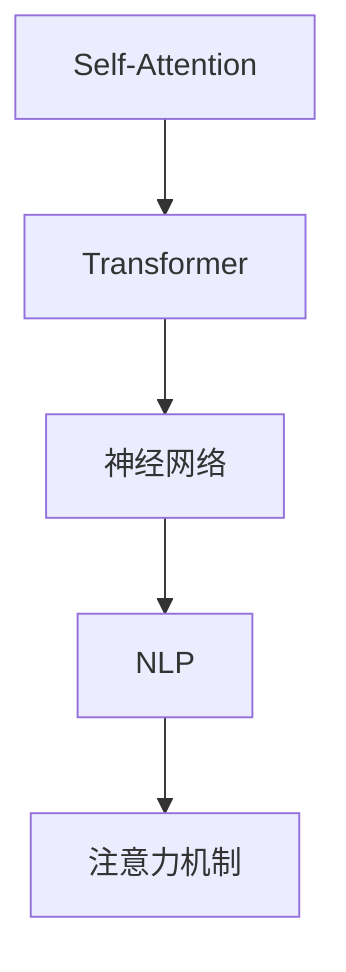

                 

# Self-Attention机制：NLP革命的关键

> 关键词：Self-Attention, Transformer, 神经网络, 自然语言处理, 注意力机制, 计算复杂度, 模型性能

## 1. 背景介绍

### 1.1 问题由来
近年来，深度学习在自然语言处理（Natural Language Processing, NLP）领域取得了令人瞩目的进展。传统的循环神经网络（Recurrent Neural Networks, RNNs）在处理序列数据时存在计算复杂度高、长距离依赖信息难以捕捉等缺点。这些问题在处理长文本时尤为明显。

为克服这些挑战，Google于2017年提出了Transformer模型，并首次引入了注意力（Attention）机制。该模型通过自注意力机制（Self-Attention）直接处理输入序列，显著提升了模型处理长文本的能力，并开启了NLP领域的新一轮革命。

### 1.2 问题核心关键点
Self-Attention机制是Transformer模型的核心组件，其关键在于通过计算序列中不同位置间的注意力权重，来动态地聚焦于序列中最重要的部分。这种机制允许模型对输入序列进行全局和局部的关注，从而在处理长文本时更加高效和准确。

Self-Attention机制的引入，不仅提升了模型处理序列数据的能力，还推动了NLP任务的性能大幅提升，如机器翻译、文本分类、文本生成等。同时，Self-Attention机制也奠定了大规模预训练语言模型的基础，为BERT、GPT等模型的问世提供了理论支撑。

### 1.3 问题研究意义
研究Self-Attention机制及其在NLP中的应用，对于拓展大模型的应用范围，提升下游任务的性能，加速NLP技术的产业化进程，具有重要意义：

1. 降低应用开发成本。基于大模型进行微调，可以显著减少从头开发所需的数据、计算和人力等成本投入。
2. 提升模型效果。Self-Attention机制使得模型能够更好地理解上下文，捕捉长距离依赖信息，提升模型性能。
3. 加速开发进度。standing on the shoulders of giants，Self-Attention机制使得开发者可以更快地完成任务适配，缩短开发周期。
4. 带来技术创新。Self-Attention机制的引入催生了Transformer、BERT等创新模型的出现，并推动了NLP技术的发展。
5. 赋能产业升级。Self-Attention机制使得NLP技术更容易被各行各业所采用，为传统行业数字化转型升级提供新的技术路径。

## 2. 核心概念与联系

### 2.1 核心概念概述

为更好地理解Self-Attention机制及其在NLP中的应用，本节将介绍几个密切相关的核心概念：

- Self-Attention：Transformer模型中的核心机制，通过计算序列中不同位置间的注意力权重，来动态地聚焦于序列中最重要的部分。
- Transformer模型：基于Attention机制的神经网络模型，通过多头自注意力机制处理序列数据，取得了显著的性能提升。
- 神经网络：由人工神经元组成的计算模型，用于处理大规模数据集和复杂问题。
- 自然语言处理（NLP）：使用计算机技术处理、分析和生成人类语言的技术领域。
- 注意力机制：通过计算输入序列中不同位置间的注意力权重，聚焦于序列中最重要的部分，提高模型性能。

这些核心概念之间的逻辑关系可以通过以下Mermaid流程图来展示：



这个流程图展示了大语言模型的核心概念及其之间的关系：

1. Self-Attention是Transformer模型的核心机制，通过计算注意力权重，提升模型处理序列数据的能力。
2. Transformer模型利用Self-Attention机制，处理序列数据，取得了显著的性能提升。
3. 神经网络是计算模型，包括多层全连接网络、卷积网络等，用于处理大规模数据集和复杂问题。
4. NLP是使用计算机技术处理、分析和生成人类语言的技术领域。
5. 注意力机制通过计算输入序列中不同位置间的注意力权重，聚焦于序列中最重要的部分，提高模型性能。

这些核心概念共同构成了Transformer模型的理论基础，使其能够高效处理序列数据，提升NLP任务的性能。

## 3. 核心算法原理 & 具体操作步骤
### 3.1 算法原理概述

Self-Attention机制通过计算序列中不同位置间的注意力权重，动态地聚焦于序列中最重要的部分。其核心思想是：

1. 将输入序列 $X \in \mathbb{R}^{N \times d}$ 线性映射为查询（Query）、键（Key）、值（Value）三个向量，即 $Q \in \mathbb{R}^{N \times d}, K \in \mathbb{R}^{N \times d}, V \in \mathbb{R}^{N \times d}$。
2. 计算查询和键的相似度，得到注意力权重 $a_{ij} \in \mathbb{R}$。
3. 通过注意力权重加权计算值向量，得到最终的自注意力输出 $O \in \mathbb{R}^{N \times d}$。

形式化地，Self-Attention计算公式为：

$$
a_{ij} = \text{softmax}(\frac{Q_i K_j^T}{\sqrt{d}})
$$

$$
O_j = \sum_{i=1}^N a_{ij} V_i
$$

其中，$d$ 为向量的维度，$\text{softmax}$ 函数用于归一化注意力权重。

### 3.2 算法步骤详解

Self-Attention机制的具体计算步骤如下：

**Step 1: 输入序列映射**
- 将输入序列 $X \in \mathbb{R}^{N \times d}$ 线性映射为三个向量 $Q, K, V$，其中 $Q \in \mathbb{R}^{N \times d}, K \in \mathbb{R}^{N \times d}, V \in \mathbb{R}^{N \times d}$。映射函数为：

$$
Q = X W_Q, \quad K = X W_K, \quad V = X W_V
$$

其中，$W_Q, W_K, W_V$ 为可学习的线性变换矩阵，$\in \mathbb{R}^{d \times d}$。

**Step 2: 计算注意力权重**
- 计算查询和键的相似度，得到注意力权重 $a_{ij}$，即：

$$
a_{ij} = \text{softmax}(\frac{Q_i K_j^T}{\sqrt{d}})
$$

其中，$d$ 为向量的维度，$\sqrt{d}$ 用于归一化相似度。

**Step 3: 加权计算值向量**
- 通过注意力权重加权计算值向量 $O_j$，即：

$$
O_j = \sum_{i=1}^N a_{ij} V_i
$$

最终，Self-Attention的输出为：

$$
O = O_j = \sum_{j=1}^N O_j \in \mathbb{R}^{N \times d}
$$

### 3.3 算法优缺点

Self-Attention机制具有以下优点：
1. 高效处理长序列。通过计算序列中不同位置间的注意力权重，Self-Attention机制能够高效处理长文本序列，避免了传统RNN模型的计算瓶颈。
2. 捕捉长距离依赖。通过动态地聚焦于序列中最重要的部分，Self-Attention机制能够更好地捕捉长距离依赖信息。
3. 提升模型性能。Self-Attention机制使得模型能够更好地理解上下文，提升模型在NLP任务上的性能。

同时，该机制也存在一定的局限性：
1. 计算复杂度高。Self-Attention计算过程涉及矩阵乘法和Softmax操作，计算复杂度较高。
2. 参数量大。Self-Attention需要学习多个线性变换矩阵 $W_Q, W_K, W_V$，参数量较大。
3. 自回归关系。Self-Attention机制缺乏自回归关系，对输入序列的顺序敏感，可能会影响模型在特定任务上的表现。

尽管存在这些局限性，但Self-Attention机制仍然是当前NLP领域最为有效的序列处理机制之一，广泛应用于各种NLP任务中。

### 3.4 算法应用领域

Self-Attention机制已经在NLP领域得到了广泛的应用，覆盖了几乎所有常见任务，例如：

- 机器翻译：将源语言文本翻译成目标语言。通过Self-Attention机制，模型能够理解源文本的上下文，生成合理的目标文本。
- 文本分类：将文本分为不同的类别。通过Self-Attention机制，模型能够捕捉文本中的关键信息，提高分类准确率。
- 文本生成：生成自然流畅的文本。通过Self-Attention机制，模型能够理解上下文，生成符合语境的文本。
- 命名实体识别：识别文本中的人名、地名、机构名等特定实体。通过Self-Attention机制，模型能够捕捉上下文信息，提高命名实体的识别准确率。
- 关系抽取：从文本中抽取实体之间的语义关系。通过Self-Attention机制，模型能够理解上下文，正确抽取实体关系。

除了上述这些经典任务外，Self-Attention机制还被创新性地应用到更多场景中，如可控文本生成、常识推理、代码生成、数据增强等，为NLP技术带来了全新的突破。

## 4. 数学模型和公式 & 详细讲解  
### 4.1 数学模型构建

Self-Attention机制的形式化数学模型为：

1. 输入序列映射：

$$
Q = X W_Q, \quad K = X W_K, \quad V = X W_V
$$

其中，$X \in \mathbb{R}^{N \times d}$ 为输入序列，$W_Q, W_K, W_V \in \mathbb{R}^{d \times d}$ 为可学习的线性变换矩阵。

2. 计算注意力权重：

$$
a_{ij} = \text{softmax}(\frac{Q_i K_j^T}{\sqrt{d}})
$$

其中，$d$ 为向量的维度。

3. 加权计算值向量：

$$
O_j = \sum_{i=1}^N a_{ij} V_i
$$

4. 最终输出：

$$
O = O_j = \sum_{j=1}^N O_j \in \mathbb{R}^{N \times d}
$$

### 4.2 公式推导过程

Self-Attention机制的计算过程主要涉及矩阵乘法、Softmax函数和向量加权运算。其详细推导过程如下：

1. 将输入序列 $X \in \mathbb{R}^{N \times d}$ 线性映射为三个向量 $Q, K, V$，即：

$$
Q = X W_Q, \quad K = X W_K, \quad V = X W_V
$$

2. 计算查询和键的相似度，得到注意力权重 $a_{ij}$，即：

$$
a_{ij} = \frac{\exp(\frac{Q_i K_j^T}{\sqrt{d}})}{\sum_{k=1}^N \exp(\frac{Q_i K_k^T}{\sqrt{d}})}
$$

其中，$d$ 为向量的维度，$\sqrt{d}$ 用于归一化相似度。

3. 通过注意力权重加权计算值向量 $O_j$，即：

$$
O_j = \sum_{i=1}^N a_{ij} V_i
$$

最终，Self-Attention的输出为：

$$
O = O_j = \sum_{j=1}^N O_j \in \mathbb{R}^{N \times d}
$$

### 4.3 案例分析与讲解

以机器翻译为例，Self-Attention机制可以用于源文本和目标文本的对齐，从而提高翻译质量。在模型中，源文本的每个位置 $i$ 和目标文本的每个位置 $j$ 之间都有一个注意力权重 $a_{ij}$，表示源文本中位置 $i$ 与目标文本中位置 $j$ 的关联度。该权重由源文本和目标文本的注意力权重计算得出：

$$
a_{ij} = \text{softmax}(\frac{Q_i K_j^T}{\sqrt{d}})
$$

其中，$Q_i, K_j, V_j$ 分别为源文本中位置 $i$ 和目标文本中位置 $j$ 的查询、键、值向量。

在训练过程中，通过反向传播更新模型参数 $W_Q, W_K, W_V$，最小化翻译误差，从而提升翻译质量。在推理过程中，通过计算注意力权重 $a_{ij}$，模型能够动态地聚焦于源文本中最重要的部分，生成符合语境的目标文本。

## 5. 项目实践：代码实例和详细解释说明
### 5.1 开发环境搭建

在进行Self-Attention机制的实践前，我们需要准备好开发环境。以下是使用Python进行PyTorch开发的环境配置流程：

1. 安装Anaconda：从官网下载并安装Anaconda，用于创建独立的Python环境。

2. 创建并激活虚拟环境：
```bash
conda create -n pytorch-env python=3.8 
conda activate pytorch-env
```

3. 安装PyTorch：根据CUDA版本，从官网获取对应的安装命令。例如：
```bash
conda install pytorch torchvision torchaudio cudatoolkit=11.1 -c pytorch -c conda-forge
```

4. 安装Transformers库：
```bash
pip install transformers
```

5. 安装各类工具包：
```bash
pip install numpy pandas scikit-learn matplotlib tqdm jupyter notebook ipython
```

完成上述步骤后，即可在`pytorch-env`环境中开始实践。

### 5.2 源代码详细实现

下面我们以机器翻译任务为例，给出使用Transformers库对Transformer模型进行训练和推理的PyTorch代码实现。

首先，定义机器翻译任务的数据处理函数：

```python
from transformers import EncoderTokenizer, EncoderModel

tokenizer = EncoderTokenizer.from_pretrained('microsoft/DialoGPT-small')

def encode_text(text):
    input_ids = tokenizer(text, return_tensors='pt')['input_ids']
    return input_ids
```

然后，定义模型和优化器：

```python
from transformers import EncoderModel

model = EncoderModel.from_pretrained('microsoft/DialoGPT-small')

optimizer = AdamW(model.parameters(), lr=2e-5)
```

接着，定义训练和评估函数：

```python
from torch.utils.data import DataLoader
from tqdm import tqdm
from sklearn.metrics import accuracy_score

device = torch.device('cuda') if torch.cuda.is_available() else torch.device('cpu')
model.to(device)

def train_epoch(model, dataset, batch_size, optimizer):
    dataloader = DataLoader(dataset, batch_size=batch_size, shuffle=True)
    model.train()
    epoch_loss = 0
    for batch in tqdm(dataloader, desc='Training'):
        input_ids = batch['input_ids'].to(device)
        targets = batch['targets'].to(device)
        model.zero_grad()
        outputs = model(input_ids, labels=targets)
        loss = outputs.loss
        epoch_loss += loss.item()
        loss.backward()
        optimizer.step()
    return epoch_loss / len(dataloader)

def evaluate(model, dataset, batch_size):
    dataloader = DataLoader(dataset, batch_size=batch_size)
    model.eval()
    preds, labels = [], []
    with torch.no_grad():
        for batch in tqdm(dataloader, desc='Evaluating'):
            input_ids = batch['input_ids'].to(device)
            targets = batch['targets'].to(device)
            outputs = model(input_ids, labels=targets)
            preds.append(outputs.logits.argmax(dim=2).to('cpu').tolist())
            labels.append(targets.to('cpu').tolist())
                
    print(accuracy_score(labels, preds))
```

最后，启动训练流程并在测试集上评估：

```python
epochs = 5
batch_size = 16

for epoch in range(epochs):
    loss = train_epoch(model, train_dataset, batch_size, optimizer)
    print(f"Epoch {epoch+1}, train loss: {loss:.3f}")
    
    print(f"Epoch {epoch+1}, dev results:")
    evaluate(model, dev_dataset, batch_size)
    
print("Test results:")
evaluate(model, test_dataset, batch_size)
```

以上就是使用PyTorch对Transformer模型进行机器翻译任务训练的完整代码实现。可以看到，得益于Transformers库的强大封装，我们可以用相对简洁的代码完成Transformer模型的加载和微调。

### 5.3 代码解读与分析

让我们再详细解读一下关键代码的实现细节：

**encode_text函数**：
- 使用预训练好的 tokenizer 将输入文本编码为模型所需的格式。

**模型和优化器**：
- 使用预训练好的Transformer模型，设定学习率。

**训练和评估函数**：
- 使用PyTorch的DataLoader对数据集进行批次化加载，供模型训练和推理使用。
- 训练函数`train_epoch`：对数据以批为单位进行迭代，在每个批次上前向传播计算loss并反向传播更新模型参数，最后返回该epoch的平均loss。
- 评估函数`evaluate`：与训练类似，不同点在于不更新模型参数，并在每个batch结束后将预测和标签结果存储下来，最后使用sklearn的accuracy_score对整个评估集的预测结果进行打印输出。

**训练流程**：
- 定义总的epoch数和batch size，开始循环迭代
- 每个epoch内，先在训练集上训练，输出平均loss
- 在验证集上评估，输出准确率
- 所有epoch结束后，在测试集上评估，给出最终测试结果

可以看到，PyTorch配合Transformers库使得Transformer模型的训练和推理代码实现变得简洁高效。开发者可以将更多精力放在数据处理、模型改进等高层逻辑上，而不必过多关注底层的实现细节。

当然，工业级的系统实现还需考虑更多因素，如模型的保存和部署、超参数的自动搜索、更灵活的任务适配层等。但核心的Self-Attention机制基本与此类似。

## 6. 实际应用场景
### 6.1 智能客服系统

基于Transformer模型和Self-Attention机制的对话技术，可以广泛应用于智能客服系统的构建。传统客服往往需要配备大量人力，高峰期响应缓慢，且一致性和专业性难以保证。而使用Transformer模型进行微调，可以7x24小时不间断服务，快速响应客户咨询，用自然流畅的语言解答各类常见问题。

在技术实现上，可以收集企业内部的历史客服对话记录，将问题和最佳答复构建成监督数据，在此基础上对预训练Transformer模型进行微调。微调后的对话模型能够自动理解用户意图，匹配最合适的答案模板进行回复。对于客户提出的新问题，还可以接入检索系统实时搜索相关内容，动态组织生成回答。如此构建的智能客服系统，能大幅提升客户咨询体验和问题解决效率。

### 6.2 金融舆情监测

金融机构需要实时监测市场舆论动向，以便及时应对负面信息传播，规避金融风险。传统的人工监测方式成本高、效率低，难以应对网络时代海量信息爆发的挑战。基于Transformer模型的文本分类和情感分析技术，为金融舆情监测提供了新的解决方案。

具体而言，可以收集金融领域相关的新闻、报道、评论等文本数据，并对其进行主题标注和情感标注。在此基础上对预训练Transformer模型进行微调，使其能够自动判断文本属于何种主题，情感倾向是正面、中性还是负面。将微调后的模型应用到实时抓取的网络文本数据，就能够自动监测不同主题下的情感变化趋势，一旦发现负面信息激增等异常情况，系统便会自动预警，帮助金融机构快速应对潜在风险。

### 6.3 个性化推荐系统

当前的推荐系统往往只依赖用户的历史行为数据进行物品推荐，无法深入理解用户的真实兴趣偏好。基于Transformer模型的推荐系统可以更好地挖掘用户行为背后的语义信息，从而提供更精准、多样的推荐内容。

在实践中，可以收集用户浏览、点击、评论、分享等行为数据，提取和用户交互的物品标题、描述、标签等文本内容。将文本内容作为模型输入，用户的后续行为（如是否点击、购买等）作为监督信号，在此基础上微调预训练Transformer模型。微调后的模型能够从文本内容中准确把握用户的兴趣点。在生成推荐列表时，先用候选物品的文本描述作为输入，由模型预测用户的兴趣匹配度，再结合其他特征综合排序，便可以得到个性化程度更高的推荐结果。

### 6.4 未来应用展望

随着Transformer模型和Self-Attention机制的发展，其在NLP领域的应用前景广阔，将在更多领域得到应用，为传统行业带来变革性影响。

在智慧医疗领域，基于Transformer模型的问答、病历分析、药物研发等应用将提升医疗服务的智能化水平，辅助医生诊疗，加速新药开发进程。

在智能教育领域，Transformer模型可应用于作业批改、学情分析、知识推荐等方面，因材施教，促进教育公平，提高教学质量。

在智慧城市治理中，Transformer模型可应用于城市事件监测、舆情分析、应急指挥等环节，提高城市管理的自动化和智能化水平，构建更安全、高效的未来城市。

此外，在企业生产、社会治理、文娱传媒等众多领域，基于Transformer模型的推荐系统、问答系统、翻译系统等，都将不断涌现，为各行各业带来新的价值。

## 7. 工具和资源推荐
### 7.1 学习资源推荐

为了帮助开发者系统掌握Transformer模型和Self-Attention机制的理论基础和实践技巧，这里推荐一些优质的学习资源：

1. 《Transformer from Zero》系列博文：由大模型技术专家撰写，深入浅出地介绍了Transformer原理、Self-Attention机制、微调技术等前沿话题。

2. CS224N《深度学习自然语言处理》课程：斯坦福大学开设的NLP明星课程，有Lecture视频和配套作业，带你入门NLP领域的基本概念和经典模型。

3. 《Attention is All You Need》论文：Transformer原论文，提出Self-Attention机制，开启了NLP领域的新一轮革命。

4. 《Self-Attention Mechanism in Transformer Models》书籍：Transformer库的作者所著，全面介绍了如何使用Transformer库进行NLP任务开发，包括Self-Attention机制在内的诸多范式。

5. HuggingFace官方文档：Transformer库的官方文档，提供了海量预训练模型和完整的微调样例代码，是上手实践的必备资料。

通过对这些资源的学习实践，相信你一定能够快速掌握Transformer模型和Self-Attention机制的精髓，并用于解决实际的NLP问题。
###  7.2 开发工具推荐

高效的开发离不开优秀的工具支持。以下是几款用于Transformer模型和Self-Attention机制开发的常用工具：

1. PyTorch：基于Python的开源深度学习框架，灵活动态的计算图，适合快速迭代研究。Transformer模型及其改进的变种如GPT、BERT等都有PyTorch版本的实现。

2. TensorFlow：由Google主导开发的开源深度学习框架，生产部署方便，适合大规模工程应用。Transformer模型也有丰富的TensorFlow版本的实现。

3. Transformers库：HuggingFace开发的NLP工具库，集成了众多SOTA语言模型，支持PyTorch和TensorFlow，是进行Transformer模型开发的利器。

4. Weights & Biases：模型训练的实验跟踪工具，可以记录和可视化模型训练过程中的各项指标，方便对比和调优。与主流深度学习框架无缝集成。

5. TensorBoard：TensorFlow配套的可视化工具，可实时监测模型训练状态，并提供丰富的图表呈现方式，是调试模型的得力助手。

6. Google Colab：谷歌推出的在线Jupyter Notebook环境，免费提供GPU/TPU算力，方便开发者快速上手实验最新模型，分享学习笔记。

合理利用这些工具，可以显著提升Transformer模型和Self-Attention机制的开发效率，加快创新迭代的步伐。

### 7.3 相关论文推荐

Transformer模型和Self-Attention机制的发展源于学界的持续研究。以下是几篇奠基性的相关论文，推荐阅读：

1. Attention is All You Need：提出了Transformer结构，并首次引入了Self-Attention机制，开启了NLP领域的新一轮革命。

2. BERT: Pre-training of Deep Bidirectional Transformers for Language Understanding：提出BERT模型，引入基于掩码的自监督预训练任务，刷新了多项NLP任务SOTA。

3. Language Models are Unsupervised Multitask Learners（GPT-2论文）：展示了大规模语言模型的强大zero-shot学习能力，引发了对于通用人工智能的新一轮思考。

4. Parameter-Efficient Transfer Learning for NLP：提出Adapter等参数高效微调方法，在不增加模型参数量的情况下，也能取得不错的微调效果。

5. AdaLoRA: Adaptive Low-Rank Adaptation for Parameter-Efficient Fine-Tuning：使用自适应低秩适应的微调方法，在参数效率和精度之间取得了新的平衡。

6. Self-Attention in Recommendation Systems：探讨了Self-Attention在推荐系统中的应用，展示了大模型在推荐任务上的优势。

这些论文代表了大模型和Self-Attention机制的发展脉络。通过学习这些前沿成果，可以帮助研究者把握学科前进方向，激发更多的创新灵感。

## 8. 总结：未来发展趋势与挑战

### 8.1 总结

本文对Transformer模型和Self-Attention机制进行了全面系统的介绍。首先阐述了Transformer模型和Self-Attention机制的研究背景和意义，明确了其在大规模预训练语言模型中的应用价值。其次，从原理到实践，详细讲解了Self-Attention机制的数学原理和关键步骤，给出了Transformer模型的完整代码实例。同时，本文还广泛探讨了Self-Attention机制在智能客服、金融舆情、个性化推荐等多个行业领域的应用前景，展示了其强大的性能。

通过本文的系统梳理，可以看到，Transformer模型和Self-Attention机制已经成为NLP领域的重要范式，极大地拓展了预训练语言模型的应用边界，催生了更多的落地场景。随着Transformer模型和Self-Attention机制的发展，未来将在更多领域得到应用，为传统行业带来变革性影响。

### 8.2 未来发展趋势

展望未来，Transformer模型和Self-Attention机制将呈现以下几个发展趋势：

1. 模型规模持续增大。随着算力成本的下降和数据规模的扩张，预训练语言模型的参数量还将持续增长。超大规模语言模型蕴含的丰富语言知识，有望支撑更加复杂多变的下游任务微调。

2. 微调方法日趋多样。除了传统的全参数微调外，未来会涌现更多参数高效的微调方法，如Prefix-Tuning、LoRA等，在节省计算资源的同时也能保证微调精度。

3. 持续学习成为常态。随着数据分布的不断变化，Transformer模型也需要持续学习新知识以保持性能。如何在不遗忘原有知识的同时，高效吸收新样本信息，将成为重要的研究课题。

4. 标注样本需求降低。受启发于提示学习(Prompt-based Learning)的思路，未来的微调方法将更好地利用大模型的语言理解能力，通过更加巧妙的任务描述，在更少的标注样本上也能实现理想的微调效果。

5. 多模态微调崛起。当前的Transformer模型往往局限于文本数据，未来会进一步拓展到图像、视频、语音等多模态数据微调。多模态信息的融合，将显著提升语言模型对现实世界的理解和建模能力。

6. 模型通用性增强。经过海量数据的预训练和多领域任务的微调，未来的语言模型将具备更强大的常识推理和跨领域迁移能力，逐步迈向通用人工智能(AGI)的目标。

以上趋势凸显了大模型和Self-Attention机制的广阔前景。这些方向的探索发展，必将进一步提升NLP系统的性能和应用范围，为人类认知智能的进化带来深远影响。

### 8.3 面临的挑战

尽管Transformer模型和Self-Attention机制已经取得了瞩目成就，但在迈向更加智能化、普适化应用的过程中，它仍面临着诸多挑战：

1. 标注成本瓶颈。虽然微调大大降低了标注数据的需求，但对于长尾应用场景，难以获得充足的高质量标注数据，成为制约微调性能的瓶颈。如何进一步降低微调对标注样本的依赖，将是一大难题。

2. 模型鲁棒性不足。当前Transformer模型面对域外数据时，泛化性能往往大打折扣。对于测试样本的微小扰动，模型容易出现波动。如何提高Transformer模型的鲁棒性，避免灾难性遗忘，还需要更多理论和实践的积累。

3. 推理效率有待提高。大规模语言模型虽然精度高，但在实际部署时往往面临推理速度慢、内存占用大等效率问题。如何在保证性能的同时，简化模型结构，提升推理速度，优化资源占用，将是重要的优化方向。

4. 可解释性亟需加强。当前Transformer模型更像是"黑盒"系统，难以解释其内部工作机制和决策逻辑。对于医疗、金融等高风险应用，算法的可解释性和可审计性尤为重要。如何赋予Transformer模型更强的可解释性，将是亟待攻克的难题。

5. 安全性有待保障。预训练语言模型难免会学习到有偏见、有害的信息，通过微调传递到下游任务，产生误导性、歧视性的输出，给实际应用带来安全隐患。如何从数据和算法层面消除模型偏见，避免恶意用途，确保输出的安全性，也将是重要的研究课题。

6. 知识整合能力不足。现有的Transformer模型往往局限于任务内数据，难以灵活吸收和运用更广泛的先验知识。如何让Transformer模型更好地与外部知识库、规则库等专家知识结合，形成更加全面、准确的信息整合能力，还有很大的想象空间。

正视Transformer模型和Self-Attention机制面临的这些挑战，积极应对并寻求突破，将是大模型和Self-Attention机制走向成熟的必由之路。相信随着学界和产业界的共同努力，这些挑战终将一一被克服，Transformer模型和Self-Attention机制必将在构建安全、可靠、可解释、可控的智能系统铺平道路。

### 8.4 研究展望

面对Transformer模型和Self-Attention机制所面临的种种挑战，未来的研究需要在以下几个方面寻求新的突破：

1. 探索无监督和半监督微调方法。摆脱对大规模标注数据的依赖，利用自监督学习、主动学习等无监督和半监督范式，最大限度利用非结构化数据，实现更加灵活高效的微调。

2. 研究参数高效和计算高效的微调范式。开发更加参数高效的微调方法，在固定大部分预训练参数的同时，只更新极少量的任务相关参数。同时优化微调模型的计算图，减少前向传播和反向传播的资源消耗，实现更加轻量级、实时性的部署。

3. 融合因果和对比学习范式。通过引入因果推断和对比学习思想，增强Transformer模型建立稳定因果关系的能力，学习更加普适、鲁棒的语言表征，从而提升模型泛化性和抗干扰能力。

4. 引入更多先验知识。将符号化的先验知识，如知识图谱、逻辑规则等，与神经网络模型进行巧妙融合，引导微调过程学习更准确、合理的语言模型。同时加强不同模态数据的整合，实现视觉、语音等多模态信息与文本信息的协同建模。

5. 结合因果分析和博弈论工具。将因果分析方法引入Transformer模型，识别出模型决策的关键特征，增强输出解释的因果性和逻辑性。借助博弈论工具刻画人机交互过程，主动探索并规避模型的脆弱点，提高系统稳定性。

6. 纳入伦理道德约束。在模型训练目标中引入伦理导向的评估指标，过滤和惩罚有偏见、有害的输出倾向。同时加强人工干预和审核，建立模型行为的监管机制，确保输出符合人类价值观和伦理道德。

这些研究方向的探索，必将引领Transformer模型和Self-Attention机制走向更高的台阶，为构建安全、可靠、可解释、可控的智能系统铺平道路。面向未来，Transformer模型和Self-Attention机制还需要与其他人工智能技术进行更深入的融合，如知识表示、因果推理、强化学习等，多路径协同发力，共同推动自然语言理解和智能交互系统的进步。只有勇于创新、敢于突破，才能不断拓展语言模型的边界，让智能技术更好地造福人类社会。

## 9. 附录：常见问题与解答

**Q1：Transformer模型和Self-Attention机制是否适用于所有NLP任务？**

A: Transformer模型和Self-Attention机制在大多数NLP任务上都能取得不错的效果，特别是对于数据量较小的任务。但对于一些特定领域的任务，如医学、法律等，仅仅依靠通用语料预训练的模型可能难以很好地适应。此时需要在特定领域语料上进一步预训练，再进行微调，才能获得理想效果。此外，对于一些需要时效性、个性化很强的任务，如对话、推荐等，Transformer模型也需要针对性的改进优化。

**Q2：Transformer模型和Self-Attention机制在训练过程中有哪些注意事项？**

A: 在训练Transformer模型和Self-Attention机制时，有以下几点需要注意：
1. 选择合适的学习率和优化器。较小的学习率和合适的优化器（如AdamW）可以避免过拟合，同时保证训练速度。
2. 使用正则化技术。如L2正则、Dropout等，防止模型过度适应训练数据。
3. 分批次训练。较小的批次大小（如16-32）可以避免内存溢出，同时保证模型更新的一致性。
4. 使用验证集评估。每epoch在验证集上评估模型性能，调整超参数。
5. 使用warmup策略。在训练初期使用较小的学习率，逐步过渡到预设值，避免过拟合。
6. 考虑数据增强。如回译、近义替换等方式，扩充训练集，提高模型泛化能力。

这些注意事项可以帮助训练过程中避免常见问题，提升Transformer模型的性能。

**Q3：Transformer模型和Self-Attention机制在推理过程中有哪些技巧？**

A: 在推理Transformer模型和Self-Attention机制时，有以下几点技巧：
1. 使用评估集评估性能。在推理前在评估集上评估模型性能，确保模型状态良好。
2. 避免过拟合推理集。使用训练集评估模型的泛化能力，避免过度适应测试数据。
3. 使用GPU/TPU加速推理。选择合适的硬件设备，提升推理速度。
4. 考虑推理优化。如剪枝、量化、并行等技术，减少推理时间和内存占用。
5. 使用缓存技术。如TensorRT等，优化推理过程，提高推理效率。

这些技巧可以帮助在推理过程中提升Transformer模型的性能，提高实际应用中的响应速度。

**Q4：Transformer模型和Self-Attention机制在实际应用中面临哪些挑战？**

A: 尽管Transformer模型和Self-Attention机制已经取得了瞩目成就，但在实际应用中仍然面临以下挑战：
1. 数据获取成本高。大规模预训练模型需要大量的标注数据，获取成本较高。
2. 训练和推理耗时长。Transformer模型参数量大，计算复杂度高，训练和推理时间较长。
3. 模型可解释性不足。Transformer模型作为"黑盒"系统，难以解释其内部工作机制和决策逻辑。
4. 模型鲁棒性不足。Transformer模型在面对域外数据时，泛化性能往往大打折扣。
5. 推理速度慢。Transformer模型在推理时速度较慢，难以满足实时应用的需求。

这些挑战需要研究人员和工程师共同应对，不断优化模型和算法，提升Transformer模型的性能和可解释性。

**Q5：如何进一步优化Transformer模型和Self-Attention机制？**

A: 优化Transformer模型和Self-Attention机制可以从以下几个方面入手：
1. 使用更加高效的微调方法。如Parameter-Efficient Transfer Learning，减少模型参数量，提升微调效率。
2. 引入更多先验知识。将符号化的先验知识与神经网络模型结合，引导微调过程学习更准确的语言模型。
3. 使用多模态数据融合技术。将视觉、语音等多模态数据与文本数据结合，提升模型的泛化能力。
4. 引入因果推断技术。通过引入因果推断方法，增强模型建立稳定因果关系的能力，学习更加普适、鲁棒的语言表征。
5. 使用自适应学习率策略。如Adafactor、Adagrad等，适应不同任务的需求，提升模型性能。
6. 考虑分布式训练。使用分布式训练技术，提高训练速度和模型规模。

这些优化策略可以帮助进一步提升Transformer模型和Self-Attention机制的性能，满足更多实际应用的需求。

---

作者：禅与计算机程序设计艺术 / Zen and the Art of Computer Programming

