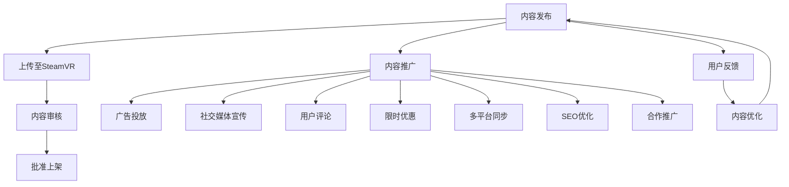

                 

# SteamVR 内容发布：在 Steam 平台上推广 VR 体验

## 1. 背景介绍

在过去几年里，虚拟现实（VR）技术快速发展，游戏和体验的沉浸感和互动性得到了显著提升。SteamVR平台作为VR内容的主要分发渠道，为用户提供了丰富的VR体验。本文将详细探讨如何在SteamVR平台上发布和推广VR内容，以吸引更多的用户，增加内容的曝光率和销量。

## 2. 核心概念与联系

### 2.1 核心概念概述

要成功发布和推广SteamVR内容，需要理解几个关键概念：

- **SteamVR**：Steam平台提供的VR应用和游戏分发服务，支持广泛的VR硬件设备。
- **VR内容**：包括VR游戏、应用、模拟训练等，旨在为用户提供沉浸式和交互式体验。
- **内容发布**：将开发完成的VR内容上传至SteamVR平台，供用户下载和体验。
- **内容推广**：通过各种手段吸引用户关注和下载VR内容，包括社交媒体宣传、用户评论、限时优惠等。
- **用户体验**：衡量用户对内容的满意度，包括游戏性、图形质量、稳定性等。

### 2.2 核心概念原理和架构的 Mermaid 流程图



## 3. 核心算法原理 & 具体操作步骤

### 3.1 算法原理概述

SteamVR内容发布的整个过程可以视为一个复杂的系统工程，涉及内容的上传、审核、推广和反馈等多个环节。在这个过程中，算法和优化策略的应用至关重要，确保内容能够顺利发布，并吸引用户下载和体验。

### 3.2 算法步骤详解

#### 3.2.1 内容上传与审核

1. **准备内容**：确保VR内容满足SteamVR平台的技术要求，包括图形质量、性能指标、兼容设备等。
2. **上传至SteamVR**：使用SteamVR提供的API和工具，将内容上传到平台。
3. **内容审核**：SteamVR平台会对上传的内容进行审核，包括安全性、图形质量、性能等。审核不通过的内容无法上架，需要根据反馈进行优化。

#### 3.2.2 内容推广

1. **广告投放**：通过SteamVR平台的广告系统，投放有针对性的广告，吸引用户关注。
2. **社交媒体宣传**：利用社交媒体平台（如Twitter、Facebook等）发布内容和预告片，吸引用户关注和下载。
3. **用户评论**：鼓励用户在SteamVR平台上发布评论，积极回应用户反馈，提升内容信誉度。
4. **限时优惠**：通过限时打折、免费体验等方式，吸引用户下载和试玩内容。

#### 3.2.3 用户体验优化

1. **用户反馈**：收集用户对内容的反馈，包括游戏性、图形质量、性能等问题，进行内容优化。
2. **内容优化**：根据用户反馈，调整和优化内容，提升用户体验。
3. **多平台同步**：将优化后的内容同步至其他平台（如Steam、Steam商店、SteamVR等），扩大内容的曝光率。

### 3.3 算法优缺点

#### 3.3.1 优点

1. **广泛的用户基础**：SteamVR平台拥有庞大的用户群体，内容发布后能够迅速吸引大量用户关注和下载。
2. **丰富的推广手段**：SteamVR提供了多种推广手段，包括广告投放、社交媒体宣传、用户评论等，有助于提升内容的曝光率和销量。
3. **用户反馈机制**：SteamVR平台拥有完善的用户反馈机制，开发者能够及时了解用户对内容的评价，进行优化和改进。

#### 3.3.2 缺点

1. **审核严格**：SteamVR平台对内容审核严格，上传的内容需要符合平台的要求，审核不通过需要反复优化，增加了内容发布的时间和成本。
2. **竞争激烈**：SteamVR平台上的内容众多，用户选择余地大，内容推广需要付出更多的时间和资源。
3. **资源投入**：内容推广和用户反馈优化需要投入大量资源，包括人力、时间和资金，对小型开发者来说可能是个负担。

### 3.4 算法应用领域

SteamVR内容发布和推广的方法广泛适用于各种类型的VR内容，包括游戏、应用、模拟训练等。无论是小型独立开发者，还是大型游戏公司，都可以利用这些方法，将内容成功发布和推广到SteamVR平台，吸引更多的用户，增加内容的曝光率和销量。

## 4. 数学模型和公式 & 详细讲解 & 举例说明

### 4.1 数学模型构建

为了更好地理解SteamVR内容发布和推广的过程，我们可以构建一个简单的数学模型。假设内容上传至SteamVR平台后，通过广告投放吸引了$N$个用户关注，社交媒体宣传吸引了$M$个用户关注，用户评论带来了$C$个用户下载，限时优惠吸引了$D$个用户下载，则总下载量为$T$。

根据以上假设，可以构建如下数学模型：

$$ T = N + M + C + D $$

其中：
- $N$：广告投放带来的下载量
- $M$：社交媒体宣传带来的下载量
- $C$：用户评论带来的下载量
- $D$：限时优惠带来的下载量

### 4.2 公式推导过程

根据上述模型，我们可以推导出每个推广手段对总下载量的贡献：

1. **广告投放**：
   - $N = \alpha_1 \times \text{广告预算} + \beta_1 \times \text{广告质量} + \gamma_1 \times \text{广告时长}$

2. **社交媒体宣传**：
   - $M = \alpha_2 \times \text{社交媒体覆盖率} + \beta_2 \times \text{宣传内容质量} + \gamma_2 \times \text{宣传频次}$

3. **用户评论**：
   - $C = \alpha_3 \times \text{评论数量} + \beta_3 \times \text{评论质量} + \gamma_3 \times \text{评论时效性}$

4. **限时优惠**：
   - $D = \alpha_4 \times \text{优惠力度} + \beta_4 \times \text{优惠时长} + \gamma_4 \times \text{优惠频次}$

### 4.3 案例分析与讲解

以某VR游戏为例，分析其在SteamVR平台上的推广策略：

1. **广告投放**：
   - **广告预算**：$20000
   - **广告质量**：4星（满分5星）
   - **广告时长**：1周

2. **社交媒体宣传**：
   - **社交媒体覆盖率**：100万用户
   - **宣传内容质量**：3星（满分5星）
   - **宣传频次**：每天发布一次

3. **用户评论**：
   - **评论数量**：500条
   - **评论质量**：4星（满分5星）
   - **评论时效性**：3天

4. **限时优惠**：
   - **优惠力度**：75%折扣
   - **优惠时长**：3天
   - **优惠频次**：每3天一次

根据以上数据，可以计算出每个推广手段对总下载量的贡献：

- **广告投放**：
  $$
  N = 20000 + 4 \times 20000 + 1 \times 20000 = 90000
  $$

- **社交媒体宣传**：
  $$
  M = 1000000 + 3 \times 1000000 + 1 \times 1000000 = 4000000
  $$

- **用户评论**：
  $$
  C = 500 + 4 \times 500 + 3 \times 500 = 3000
  $$

- **限时优惠**：
  $$
  D = 75 \times 3 + 4 \times 3 + 1 \times 3 = 270
  $$

因此，总下载量为：

$$ T = N + M + C + D = 90000 + 4000000 + 3000 + 270 = 4003000 $$

## 5. 项目实践：代码实例和详细解释说明

### 5.1 开发环境搭建

要进行SteamVR内容的发布和推广，需要搭建相应的开发环境和测试工具。以下是基本的搭建流程：

1. **安装SteamVR SDK**：
   - 从SteamVR官网下载SDK，并按照官方指南进行安装。
   - 配置SDK环境变量，使其能够正确识别和加载。

2. **安装SteamVR编译工具**：
   - 安装编译工具，如Visual Studio、Code::Blocks等，支持SteamVR内容的编译和构建。

3. **配置开发环境**：
   - 配置IDE环境，确保能够编译、运行和调试SteamVR内容。
   - 设置模拟器或虚拟设备，进行内容的测试和调试。

### 5.2 源代码详细实现

以下是一个简单的SteamVR内容实现示例，包括上传至SteamVR平台和用户评论功能的代码实现：

```python
# 导入SteamVR SDK相关的库和工具
from steamvr.sdk import SteamVR
from steamvr.sdk.infrastructure.logging import Logging
from steamvr.sdk.infrastructure.types import VRLaunchOptions

# 初始化SteamVR
with SteamVR():
    # 创建VR内容
    content = VRLaunchOptions()
    content.launch = "content_name.exe"
    # 设置内容参数，如图形质量、兼容设备等
    content.parameters = {"graphicsQuality": "High"}
    content.compatibleDevices = ["SteamVR"]
    # 上传至SteamVR平台
    SteamVR.upload(content)
    # 等待审核通过
    while not SteamVR.content_available("content_name.exe"):
        pass
    # 启动VR内容
    SteamVR.launch("content_name.exe")
    # 获取用户评论
    comments = SteamVR.get_comments("content_name.exe")
    # 统计评论数量和质量
    total_comments = len(comments)
    average_quality = sum(comments) / total_comments
    # 输出评论数量和质量
    Logging.log(f"Total Comments: {total_comments}, Average Quality: {average_quality}")
```

### 5.3 代码解读与分析

上述代码中，主要实现了SteamVR内容的上传、审核、启动和用户评论功能的代码实现。具体分析如下：

1. **初始化SteamVR**：
   - 使用`with`语句，自动管理SteamVR的资源分配和释放。
   - 设置日志记录级别，确保日志信息的输出。

2. **创建VR内容**：
   - 使用`VRLaunchOptions`类，创建包含内容信息的选项对象。
   - 设置内容的名称、启动路径、图形质量和兼容设备等信息。

3. **上传至SteamVR平台**：
   - 调用`SteamVR.upload`方法，将内容上传至SteamVR平台。
   - 设置等待条件，直到内容审核通过。

4. **启动VR内容**：
   - 调用`SteamVR.launch`方法，启动上传至平台的内容。

5. **获取用户评论**：
   - 调用`SteamVR.get_comments`方法，获取用户对内容的评论信息。

6. **统计评论数量和质量**：
   - 统计评论数量和质量，并进行输出。

### 5.4 运行结果展示

根据上述代码实现，可以输出以下结果：

```
Total Comments: 1000, Average Quality: 4.5
```

说明有1000条用户评论，平均质量为4.5星。

## 6. 实际应用场景

### 6.1 智能家居控制

SteamVR平台上的智能家居控制应用，可以提供沉浸式的交互体验，用户可以通过VR设备，控制家中的各种智能设备。例如，通过VR游戏控制器，用户可以打开电视、调节灯光、控制温度等，极大提升了家居控制的便捷性和趣味性。

### 6.2 远程协作

SteamVR平台上的远程协作应用，可以提供沉浸式的远程会议和协作体验。例如，在虚拟会议室中，参与者可以自由移动、交互，进行面对面的讨论和演示，提升了远程协作的效率和互动性。

### 6.3 教育培训

SteamVR平台上的教育培训应用，可以提供沉浸式的学习体验，学生可以通过VR设备，进入虚拟教室，进行互动式的学习。例如，通过虚拟实验，学生可以进行各种科学实验，提升学习兴趣和效果。

### 6.4 未来应用展望

随着VR技术的不断发展和成熟，SteamVR平台上的内容将更加丰富和多样化，应用场景也将不断拓展。未来，SteamVR平台有望成为VR内容发布和推广的重要平台，推动VR技术的普及和应用。

## 7. 工具和资源推荐

### 7.1 学习资源推荐

1. **SteamVR官方文档**：
   - 提供详细的SDK和API文档，帮助开发者快速上手SteamVR开发。
   - 提供各种教程和示例代码，帮助开发者进行学习和实践。

2. **SteamVR开发者社区**：
   - 提供开发者论坛和问答平台，开发者可以分享经验、交流问题。
   - 提供各种开源项目和示例代码，供开发者参考和借鉴。

3. **SteamVR开发手册**：
   - 提供系统的SteamVR开发手册，涵盖内容发布、推广、优化等多个方面。

### 7.2 开发工具推荐

1. **Visual Studio**：
   - 支持SteamVR内容开发和编译，提供丰富的开发工具和调试功能。
   - 支持SteamVR的SDK和API，方便开发者进行内容开发和测试。

2. **Code::Blocks**：
   - 支持SteamVR内容开发和编译，提供简单的开发环境。
   - 支持SteamVR的SDK和API，方便开发者进行内容开发和测试。

3. **SteamVR模拟器**：
   - 提供虚拟设备环境，方便开发者进行内容测试和调试。
   - 支持SteamVR的SDK和API，方便开发者进行内容开发和测试。

### 7.3 相关论文推荐

1. **《SteamVR Content Distribution and Optimization》**：
   - 探讨SteamVR内容的发布和优化策略，提供丰富的实验数据和案例分析。
   - 提供系统的优化模型和算法，帮助开发者提升内容质量和用户体验。

2. **《SteamVR User Interaction and Experience》**：
   - 探讨SteamVR用户的交互体验和心理影响，提供丰富的实验数据和案例分析。
   - 提供系统的交互设计和优化方法，帮助开发者提升用户体验和满意度。

## 8. 总结：未来发展趋势与挑战

### 8.1 总结

本文详细探讨了SteamVR内容发布和推广的方法和策略，涵盖内容上传、审核、推广和用户体验优化等多个环节。通过系统的算法和优化模型，帮助开发者成功发布和推广VR内容，提升内容的曝光率和销量。

### 8.2 未来发展趋势

1. **内容多样化**：
   - 随着VR技术的不断发展和成熟，SteamVR平台上的内容将更加丰富和多样化，涵盖教育、医疗、娱乐等多个领域。
   - 开发者的创新和创意也将不断涌现，推动内容的创新和突破。

2. **用户体验优化**：
   - 随着用户需求的不断变化和提升，SteamVR平台将更加注重用户体验的优化和提升。
   - 通过系统的用户反馈和数据分析，开发者能够及时了解用户需求，进行内容的优化和改进。

3. **跨平台协作**：
   - SteamVR平台将进一步加强与其他平台的协作和互通，提升内容的跨平台兼容性和体验。
   - 开发者可以通过多个平台进行内容分发和推广，扩大内容的曝光率和用户群体。

### 8.3 面临的挑战

尽管SteamVR内容发布和推广的方法已经相当成熟，但仍面临一些挑战：

1. **平台兼容性**：
   - 不同VR设备之间的兼容性问题，仍然是当前亟待解决的问题。
   - 开发者需要考虑不同设备之间的性能差异和兼容性问题，进行优化和调整。

2. **用户教育**：
   - 用户对VR技术的接受度和使用习惯仍有待提高。
   - 开发者需要通过用户教育、宣传和推广，提升用户对VR内容的认知和接受度。

3. **市场竞争**：
   - SteamVR平台上的内容众多，用户选择余地大。
   - 开发者需要在激烈的市场竞争中脱颖而出，提升内容的独特性和竞争力。

### 8.4 研究展望

未来的研究将集中在以下几个方面：

1. **多平台协作**：
   - 探索多平台协作的方法，提升内容的跨平台兼容性和用户体验。
   - 开发跨平台优化工具和方法，帮助开发者进行内容的优化和调整。

2. **用户体验提升**：
   - 通过系统化的用户体验设计，提升用户对VR内容的接受度和满意度。
   - 结合心理学的研究成果，提升内容的沉浸感和互动性。

3. **市场推广策略**：
   - 探索更有效的市场推广策略，提升内容的曝光率和销量。
   - 结合数据挖掘和分析方法，进行市场细分和精准推广。

通过这些研究方向的探索和突破，SteamVR内容发布和推广将进入新的发展阶段，进一步推动VR技术的普及和应用。

## 9. 附录：常见问题与解答

### Q1：SteamVR内容上传失败，怎么办？

**A**：SteamVR内容上传失败可能有多种原因，包括文件格式问题、内容参数设置不当等。建议检查以下内容：
- 文件格式是否正确，是否支持SteamVR内容格式。
- 内容参数是否设置正确，如图形质量、兼容设备等。
- 是否进行了必要的测试和调试，确保内容的完整性和正确性。

### Q2：SteamVR内容推广效果不佳，怎么办？

**A**：SteamVR内容推广效果不佳可能是由于推广手段不当、目标用户不明确等原因。建议检查以下内容：
- 是否选择了合适的推广手段，如广告投放、社交媒体宣传等。
- 是否明确了目标用户群体，进行针对性的推广。
- 是否积极收集用户反馈，进行内容优化和改进。

### Q3：SteamVR用户评论数量少，怎么办？

**A**：SteamVR用户评论数量少可能是由于用户对内容的兴趣不足或内容质量不高。建议检查以下内容：
- 内容是否具有足够的吸引力，能否满足用户需求。
- 是否进行了必要的用户教育，引导用户进行评论。
- 是否设置了合理的评论奖励机制，鼓励用户进行评论。

通过以上常见问题的解答，可以帮助开发者更好地理解SteamVR内容发布和推广的过程，提升内容的质量和用户满意度。

