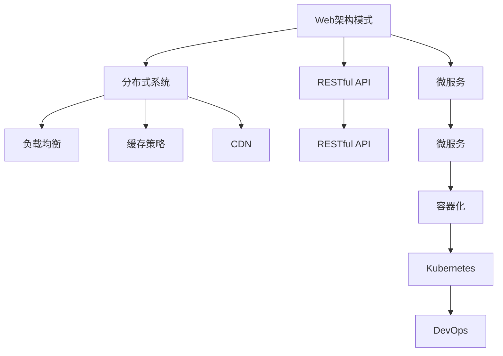

                 

# Web架构设计：可扩展和高性能系统的构建

> 关键词：Web架构, 可扩展性, 高性能, 分布式系统, RESTful API, 微服务, DevOps, 负载均衡, 缓存策略, CDN, 容器化, Kubernetes, DevOps

## 1. 背景介绍

### 1.1 问题由来
随着互联网应用的普及，Web系统的性能和可扩展性问题日益凸显。如何在满足日益增长的用户访问需求的同时，保证系统的高可用性和稳定性，成为Web架构设计的核心挑战。传统的单层应用架构难以应对复杂多变的业务需求，易出现性能瓶颈和扩展困难。分布式系统和大规模并发处理的需要，也使得系统设计面临新的挑战。

### 1.2 问题核心关键点
本文聚焦于Web架构设计，旨在通过系统地分析核心概念和关键技术，构建一个可扩展和高性能的Web系统。核心问题包括：

- 如何选择合适的Web架构模式，构建高效的Web应用。
- 如何设计分布式系统，确保系统的可扩展性和高可用性。
- 如何在系统设计中集成缓存、负载均衡、CDN等优化策略，提升Web系统的性能。
- 如何通过容器化、Kubernetes、DevOps等技术手段，实现Web应用的自动化部署、运维和管理。

### 1.3 问题研究意义
构建可扩展和高性能的Web系统，对于提升互联网应用的性能和用户体验，减少服务中断，降低运维成本，具有重要意义。Web系统的可扩展性、性能、可用性和稳定性，直接关系到企业的核心竞争力。

## 2. 核心概念与联系

### 2.1 核心概念概述

为更好地理解Web架构设计，本节将介绍几个密切相关的核心概念：

- **Web架构模式**：指不同类型Web应用所采用的基本架构设计方法，包括单体应用、微服务、RESTful API等。
- **分布式系统**：指由多个分散的服务器、应用或服务组成的系统，通过网络通信协同工作。
- **RESTful API**：遵循REST架构风格的Web API设计规范，采用统一的接口语义，便于微服务和分布式系统的构建。
- **微服务架构**：将大型应用拆分为多个小服务模块，每个服务独立部署和扩展，便于管理和扩展。
- **DevOps**：涵盖软件开发和运维的整合，通过自动化工具和持续集成、持续交付等实践，提升软件交付效率和质量。
- **负载均衡**：通过将请求分配到多个服务器上，确保系统高可用性，提升性能。
- **缓存策略**：通过缓存技术减少数据库访问，提升系统响应速度。
- **CDN（内容分发网络）**：利用全球分布的服务器，加速静态资源和服务传输。
- **容器化**：将应用和服务打包在容器中，通过Docker等技术实现独立部署和环境一致性。
- **Kubernetes**：用于容器编排和管理的开源平台，支持多节点、大规模集群部署。

这些核心概念之间的逻辑关系可以通过以下Mermaid流程图来展示：



这个流程图展示了一系列Web系统设计的核心概念及其之间的联系：

1. Web架构模式决定了系统的基本设计方法。
2. 分布式系统是实现Web架构模式的基础，通过多个服务器协同工作提高系统可靠性。
3. RESTful API为分布式系统和微服务架构提供了统一接口规范。
4. 微服务架构将应用拆分为小模块，便于独立扩展和部署。
5. DevOps将软件开发和运维整合，提升交付效率。
6. 负载均衡和缓存策略优化系统性能。
7. CDN加速静态资源和服务传输。
8. 容器化实现应用和服务独立部署和环境一致性。
9. Kubernetes用于集群管理和容器编排。

这些概念共同构成了Web系统设计的框架，使其能够灵活应对各种业务需求和系统复杂性。

## 3. 核心算法原理 & 具体操作步骤
### 3.1 算法原理概述

构建可扩展和高性能的Web系统，关键在于选择合理的架构模式，设计分布式系统，并集成高效的性能优化策略。本节将从算法原理层面阐述这些关键点。

**3.1.1 架构模式选择**

Web架构模式主要包括单体应用和微服务两种基本模式：

- **单体应用**：将前后端、数据层、业务逻辑全部集成在一个应用中，易于开发和部署，但难以扩展。适用于小型项目或开发阶段。
- **微服务架构**：将应用拆分为多个独立服务，每个服务独立部署和扩展，便于管理和扩展。适用于大型项目或生产环境。

微服务架构的优势在于：

1. 高可扩展性：每个服务独立部署，可根据业务需求动态扩展。
2. 高可用性：通过负载均衡和冗余设计，提升系统稳定性。
3. 快速迭代：各个服务模块可以独立开发和部署，便于快速迭代。

**3.1.2 分布式系统设计**

分布式系统的设计关键在于服务分片、负载均衡和故障容错：

- **服务分片**：将应用逻辑拆分为多个服务模块，每个模块负责一个独立的功能。
- **负载均衡**：通过负载均衡器将请求分配到多个服务实例上，确保系统高可用性和性能。
- **故障容错**：设计服务间的冗余和容错机制，确保系统在部分服务故障时仍能正常运行。

**3.1.3 性能优化策略**

性能优化策略主要包括缓存、负载均衡和CDN：

- **缓存**：通过缓存技术减少数据库访问，提升系统响应速度。
- **负载均衡**：通过负载均衡器将请求分配到多个服务器上，确保系统高可用性，提升性能。
- **CDN**：利用全球分布的服务器，加速静态资源和服务传输。

### 3.2 算法步骤详解

基于上述算法原理，Web架构设计的基本步骤包括：

**Step 1: 需求分析与架构设计**

- 分析业务需求，确定系统的核心功能和模块。
- 选择适合的Web架构模式，如微服务或RESTful API。
- 设计分布式系统，确定服务分片、负载均衡和故障容错策略。

**Step 2: 服务实现与部署**

- 实现各个服务模块，确保每个模块独立部署和扩展。
- 配置负载均衡器，确保系统高可用性和性能。
- 集成缓存和CDN，提升系统响应速度。

**Step 3: 性能监控与调优**

- 设置性能监控指标，实时监测系统性能。
- 分析性能瓶颈，进行优化调优。

**Step 4: 自动化部署与运维**

- 实现自动化部署和运维流程，提升软件交付效率。
- 集成DevOps工具链，确保系统稳定性。

### 3.3 算法优缺点

**3.3.1 优点**

- **高可扩展性**：微服务架构和分布式系统设计，便于系统扩展。
- **高可用性**：负载均衡和故障容错策略，提升系统稳定性。
- **快速迭代**：独立的服务模块，便于快速开发和部署。
- **高性能**：缓存和CDN优化，提升系统响应速度。
- **自动化部署**：DevOps工具链支持，提升交付效率。

**3.3.2 缺点**

- **复杂性**：分布式系统设计和管理复杂。
- **开发难度**：独立的服务模块需要更高的开发技能。
- **通信开销**：服务间通信可能增加延迟和网络开销。
- **运维成本**：多服务环境下的运维和管理复杂。

### 3.4 算法应用领域

Web架构设计在多个行业领域均有广泛应用：

- **电商**：通过微服务架构和分布式系统设计，提升购物体验和系统稳定性。
- **金融**：通过RESTful API和微服务设计，提供安全的金融服务。
- **教育**：通过微服务架构和DevOps实践，提升在线教育平台的用户体验和运营效率。
- **政府**：通过分布式系统和DevOps实践，构建高效便捷的政务服务系统。
- **医疗**：通过微服务架构和负载均衡策略，提升医疗系统的响应速度和可靠性。

## 4. 数学模型和公式 & 详细讲解 & 举例说明

### 4.1 数学模型构建

为更好地理解Web系统设计的算法原理，本节将使用数学语言对核心算法进行更加严格的刻画。

**4.1.1 系统性能模型**

设系统响应时间为 $T$，服务响应时间为 $T_s$，缓存命中率为 $p_c$，负载均衡器均衡因子为 $\alpha$，则系统响应时间 $T$ 可以表示为：

$$
T = \alpha T_s + (1-\alpha) \frac{p_c T_s + (1-p_c) T_s + T_s}{N}
$$

其中 $N$ 为服务器实例数，$T_s$ 为服务响应时间。

**4.1.2 系统扩展性模型**

设系统初始响应时间为 $T_0$，服务响应时间为 $T_s$，扩展因子为 $k$，则系统扩展后响应时间为：

$$
T_k = T_s \cdot k^2
$$

即系统响应时间与扩展因子平方成正比。

### 4.2 公式推导过程

以下我们以缓存优化为例，推导缓存命中率的计算公式。

假设系统请求率为 $R$，缓存命中率为 $p_c$，则系统响应时间为：

$$
T_c = \frac{R}{p_c}
$$

其中 $T_c$ 为缓存响应时间，$p_c$ 为缓存命中率。当 $p_c = 1$ 时，缓存完全命中，系统响应时间最小。

### 4.3 案例分析与讲解

以电商系统的性能优化为例，分析缓存策略对系统性能的影响：

- **缓存命中率**：系统初始响应时间为 $T_0 = 2s$，服务响应时间为 $T_s = 0.5s$，扩展因子为 $k = 4$。
- **缓存完全命中**：扩展后响应时间为 $T_4 = 0.5s \cdot 4^2 = 8s$。
- **缓存命中率为0.8**：扩展后响应时间为 $T_4 = \frac{2}{0.8} + (1-0.8) \frac{0.5 + 0.5 + 0.5}{4} = 3s$。

可以看出，缓存命中率对系统响应时间有显著影响。通过合理设置缓存策略，可以有效提升系统性能。

## 5. 项目实践：代码实例和详细解释说明
### 5.1 开发环境搭建

在进行Web架构设计实践前，我们需要准备好开发环境。以下是使用Python进行Flask开发的环境配置流程：

1. 安装Anaconda：从官网下载并安装Anaconda，用于创建独立的Python环境。

2. 创建并激活虚拟环境：
```bash
conda create -n flask-env python=3.8 
conda activate flask-env
```

3. 安装Flask：
```bash
pip install flask
```

4. 安装Flask-RESTful：
```bash
pip install flask-restful
```

5. 安装SQLAlchemy：
```bash
pip install sqlalchemy
```

6. 安装Flask-SQLAlchemy：
```bash
pip install flask-sqlalchemy
```

7. 安装Flask-Caching：
```bash
pip install flask-caching
```

完成上述步骤后，即可在`flask-env`环境中开始Web架构设计的实践。

### 5.2 源代码详细实现

这里我们以微服务架构为例，展示使用Flask和Flask-RESTful构建RESTful API的Python代码实现。

首先，定义模型和视图：

```python
from flask import Flask, request, jsonify
from flask_restful import Resource, Api
from sqlalchemy import create_engine, Column, Integer, String
from sqlalchemy.ext.declarative import declarative_base

app = Flask(__name__)
api = Api(app)

Base = declarative_base()

class Product(Base):
    __tablename__ = 'products'
    id = Column(Integer, primary_key=True)
    name = Column(String)
    price = Column(Integer)

class ProductResource(Resource):
    def get(self):
        products = Product.query.all()
        return jsonify([{'id': product.id, 'name': product.name, 'price': product.price} for product in products])

class App(Resource):
    def get(self):
        return {'message': 'Hello, World!'}
```

然后，配置数据库和缓存：

```python
engine = create_engine('sqlite:///products.db')
Base.metadata.create_all(engine)

@app.before_request
def before_request():
    app.config['SQLALCHEMY_DATABASE_URI'] = 'sqlite:///products.db'
    app.config['SQLALCHEMY_TRACK_MODIFICATIONS'] = False
    app.config['CACHE_TYPE'] = 'simple'

@app.errorhandler(404)
def page_not_found(e):
    return jsonify(error=str(e)), 404

@app.errorhandler(500)
def internal_server_error(e):
    return jsonify(error=str(e)), 500
```

最后，启动应用：

```python
if __name__ == '__main__':
    app.run(debug=True)
```

以上代码实现了一个简单的产品管理系统，包含了微服务的基本要素：

- **Flask**：用于构建Web应用。
- **Flask-RESTful**：用于构建RESTful API。
- **SQLAlchemy**：用于数据库操作。
- **Flask-Caching**：用于缓存系统响应。

通过Flask和Flask-RESTful，可以快速搭建RESTful API，通过SQLAlchemy操作数据库，通过Flask-Caching优化系统响应。

### 5.3 代码解读与分析

让我们再详细解读一下关键代码的实现细节：

**Product类**：
- 定义了产品模型的基本属性，包括ID、名称和价格。

**ProductResource类**：
- 定义了API资源，用于获取所有产品的列表。

**App类**：
- 定义了根资源，用于返回Hello World信息。

**before_request装饰器**：
- 在请求处理前执行，配置数据库和缓存。

**错误处理器**：
- 处理404和500错误，返回友好的错误信息。

**run方法**：
- 启动应用，设置debug模式，方便调试和测试。

通过以上代码，可以清晰地看到微服务架构的基本实现方式：通过Flask构建Web应用，通过Flask-RESTful定义API资源，通过SQLAlchemy操作数据库，通过Flask-Caching优化系统响应。

## 6. 实际应用场景

### 6.1 电商系统

电商系统是一个典型的Web应用，具有复杂的业务逻辑和大量的并发请求。通过微服务架构和负载均衡策略，可以构建高效、稳定、可扩展的电商系统。

具体而言，电商系统可以划分为商品管理、订单管理、用户管理等多个微服务模块，每个模块独立部署和扩展。通过负载均衡器将请求分配到多个服务实例上，确保系统高可用性和性能。通过缓存和CDN技术优化系统响应，提升用户体验。

### 6.2 金融服务

金融服务系统对性能和安全性要求极高，需要构建高可用性和高性能的系统。通过微服务架构和负载均衡策略，可以构建可靠、安全的金融服务系统。

具体而言，金融服务系统可以划分为交易服务、账户服务、风控服务等多个微服务模块，每个模块独立部署和扩展。通过负载均衡器和冗余设计，确保系统高可用性和性能。通过微服务治理和安全策略，确保系统安全性和稳定性。

### 6.3 在线教育

在线教育平台需要处理大量的视频上传、在线课程、作业批改等业务，需要构建高效、稳定的系统。通过微服务架构和DevOps实践，可以构建快速、高效、安全的在线教育平台。

具体而言，在线教育平台可以划分为视频服务、课程服务、作业服务等多个微服务模块，每个模块独立部署和扩展。通过负载均衡器和缓存策略，提升系统性能。通过DevOps工具链自动化部署和运维，确保系统稳定性和可靠性。

### 6.4 未来应用展望

随着Web架构设计的不断演进，未来将出现更多前沿技术和应用场景：

1. **Serverless架构**：通过无服务器架构，简化部署和管理，提高系统灵活性。
2. **边缘计算**：在接近用户端的边缘设备上处理请求，提升响应速度。
3. **AI驱动的应用**：通过AI技术优化系统性能，如实时推荐、智能搜索等。
4. **区块链技术**：利用区块链技术提升系统安全性和数据透明性。
5. **实时数据处理**：通过实时数据处理技术，提升系统响应速度和决策能力。
6. **IoT应用**：通过物联网技术，将Web系统与物理世界深度融合。

这些新技术的应用，将进一步提升Web系统的性能和用户体验，推动Web技术向智能化、实时化、安全化方向发展。

## 7. 工具和资源推荐

### 7.1 学习资源推荐

为了帮助开发者系统掌握Web架构设计，这里推荐一些优质的学习资源：

1. **《Web架构设计与开发》系列书籍**：详细介绍了Web架构设计的基本原理和最佳实践，涵盖单体应用、微服务、RESTful API等多个方面。
2. **《分布式系统设计》课程**：由斯坦福大学开设的分布式系统课程，涵盖分布式系统设计、故障容错、负载均衡等核心内容。
3. **《RESTful API设计与实现》教程**：详细介绍了RESTful API的设计原则和实现方法，适合开发RESTful API的开发者。
4. **《微服务架构设计与实践》书籍**：介绍了微服务架构的基本原理和实践方法，涵盖服务分片、负载均衡、DevOps等多个方面。
5. **《缓存技术与优化》课程**：由Coursera提供的缓存技术课程，涵盖缓存机制、缓存策略、缓存应用等多个方面。
6. **《内容分发网络CDN》课程**：由edX提供的CDN课程，详细介绍了CDN的工作原理和优化策略。

通过对这些资源的学习实践，相信你一定能够快速掌握Web架构设计的基本方法，并用于解决实际的Web系统问题。

### 7.2 开发工具推荐

高效的开发离不开优秀的工具支持。以下是几款用于Web架构设计开发的常用工具：

1. **Flask**：轻量级的Web框架，灵活易用，适合快速开发Web应用。
2. **Flask-RESTful**：基于Flask的RESTful API框架，快速构建RESTful API。
3. **SQLAlchemy**：灵活的ORM框架，支持多种数据库操作。
4. **Flask-Caching**：基于Flask的缓存框架，支持多种缓存技术。
5. **Click**：命令行工具生成器，快速生成RESTful API的命令行工具。
6. **Swagger**：API文档工具，自动生成API文档，方便开发者和用户使用。

合理利用这些工具，可以显著提升Web系统开发的效率，加快创新迭代的步伐。

### 7.3 相关论文推荐

Web架构设计的研究源于学界的持续研究。以下是几篇奠基性的相关论文，推荐阅读：

1. **《微服务架构：构建可扩展、高可靠的系统》**：介绍了微服务架构的基本原理和实践方法，涵盖服务分片、负载均衡、DevOps等多个方面。
2. **《分布式系统：原理与设计》**：介绍了分布式系统设计的基本原理和实践方法，涵盖系统设计、故障容错、负载均衡等多个方面。
3. **《RESTful API设计规范》**：详细介绍了RESTful API的设计规范和实现方法，适合开发RESTful API的开发者。
4. **《缓存技术：原理与优化》**：介绍了缓存技术的基本原理和优化方法，涵盖缓存机制、缓存策略、缓存应用等多个方面。
5. **《内容分发网络CDN》**：详细介绍了CDN的工作原理和优化策略，适合构建高性能的Web系统。

这些论文代表了大Web架构设计的研究方向，通过学习这些前沿成果，可以帮助研究者把握学科前进方向，激发更多的创新灵感。

## 8. 总结：未来发展趋势与挑战

### 8.1 总结

本文对Web架构设计的基本概念和核心技术进行了全面系统的介绍。首先阐述了Web架构设计的基本原理和关键技术，明确了微服务架构和分布式系统设计在构建高效Web系统中的重要性。其次，从算法原理层面，详细讲解了缓存策略、负载均衡、CDN等优化策略在提升Web系统性能方面的作用。最后，本文还探讨了Web架构设计在电商、金融、教育等多个行业领域的应用前景，展示了Web架构设计的广阔前景。

通过本文的系统梳理，可以看到，Web架构设计在构建高效、可扩展、高性能的Web系统方面具有重要意义。分布式系统、微服务架构、负载均衡等核心技术的应用，使得Web系统能够更好地应对复杂多变的业务需求和系统复杂性，提升系统性能和用户体验。

### 8.2 未来发展趋势

展望未来，Web架构设计将呈现以下几个发展趋势：

1. **Serverless架构**：无服务器架构简化了部署和管理，提高了系统灵活性和可扩展性。
2. **边缘计算**：边缘计算提升了系统响应速度和数据处理效率。
3. **AI驱动的应用**：AI技术优化了系统性能，提升了用户体验。
4. **区块链技术**：区块链技术提升了系统安全性和数据透明性。
5. **实时数据处理**：实时数据处理提升了系统响应速度和决策能力。
6. **IoT应用**：物联网技术将Web系统与物理世界深度融合，提升了系统智能性和实时性。

这些趋势展示了Web架构设计的未来方向，将使得Web系统更加灵活、智能、安全、实时，进一步提升用户体验和企业竞争力。

### 8.3 面临的挑战

尽管Web架构设计已经取得了显著成就，但在迈向更加智能化、实时化、安全化的Web系统设计的过程中，仍面临诸多挑战：

1. **复杂性增加**：分布式系统设计和管理复杂，微服务架构增加了系统复杂度。
2. **性能瓶颈**：高并发请求下，系统性能可能成为瓶颈，需要通过缓存、负载均衡等技术优化。
3. **安全问题**：微服务架构增加了系统安全风险，需要通过安全策略和DevOps实践保障系统安全。
4. **数据一致性**：分布式系统中的数据一致性问题需要特殊设计和管理。
5. **系统稳定**：高并发请求下，系统稳定性可能受到挑战，需要通过弹性伸缩和故障容错策略保障系统稳定。

这些挑战需要在未来的研究和实践中进行深入探讨和解决。

### 8.4 研究展望

面向未来，Web架构设计需要在以下几个方面寻求新的突破：

1. **自动化部署与运维**：通过DevOps工具链和自动化部署流程，提升系统交付效率和稳定性。
2. **系统优化与调优**：通过性能监控和调优工具，提升系统性能和响应速度。
3. **数据管理与存储**：通过分布式数据库和数据管理策略，提升数据一致性和可靠性。
4. **系统安全与合规**：通过安全策略和合规管理，保障系统安全性和用户隐私。
5. **系统扩展与升级**：通过弹性伸缩和持续集成，提升系统可扩展性和迭代速度。

这些研究方向的探索，将引领Web架构设计迈向更高的台阶，为构建高效、智能、安全、可靠的系统提供有力支持。

## 9. 附录：常见问题与解答

**Q1：Web架构设计中如何处理数据一致性问题？**

A: 数据一致性是分布式系统中常见的问题，需要采取以下策略：

1. 分布式事务：通过分布式事务协议，保证事务的一致性。
2 版本控制：对数据进行版本控制，防止脏数据写入。
3 分布式锁：通过分布式锁机制，防止并发操作导致的数据不一致。
4 最终一致性：采用基于事件驱动的最终一致性模型，保证系统可靠性和性能。

**Q2：Web架构设计中如何提高系统的可用性和稳定性？**

A: 提高系统的可用性和稳定性需要采取以下措施：

1. 负载均衡：通过负载均衡器将请求分配到多个服务实例上，确保系统高可用性和性能。
2 冗余设计：通过冗余设计，确保系统在高并发请求下的稳定性和可靠性。
3 故障容错：设计服务间的冗余和容错机制，确保系统在部分服务故障时仍能正常运行。
4 安全策略：通过安全策略和DevOps实践，保障系统安全性和稳定性。

**Q3：Web架构设计中如何优化系统性能？**

A: 优化系统性能需要采取以下措施：

1 缓存策略：通过缓存技术减少数据库访问，提升系统响应速度。
2 负载均衡：通过负载均衡器将请求分配到多个服务实例上，确保系统高可用性和性能。
3 CDN：利用全球分布的服务器，加速静态资源和服务传输。
4 实时数据处理：通过实时数据处理技术，提升系统响应速度和决策能力。

**Q4：Web架构设计中如何实现微服务治理？**

A: 微服务治理需要采取以下措施：

1 服务注册与发现：通过服务注册中心和发现机制，实现服务间的通信和调用。
2 服务限流与降级：通过限流和降级策略，防止服务过载和系统崩溃。
3 服务监控与报警：通过监控工具和报警机制，实时监测服务性能和健康状态。
4 服务治理平台：通过微服务治理平台，实现服务的自动化部署、运维和管理。

**Q5：Web架构设计中如何实现DevOps自动化部署与运维？**

A: 实现DevOps自动化部署与运维需要采取以下措施：

1 自动化测试：通过自动化测试工具，确保软件质量。
2 持续集成：通过持续集成工具，自动化构建、测试和部署流程。
3 持续交付：通过持续交付工具，自动化部署流程，提升交付效率。
4 自动化运维：通过自动化运维工具，实现系统监控、告警、日志等功能的自动化。

通过对这些问题的解答，可以帮助开发者更好地理解Web架构设计的核心问题，并应用于实际系统设计中。

---

作者：禅与计算机程序设计艺术 / Zen and the Art of Computer Programming

