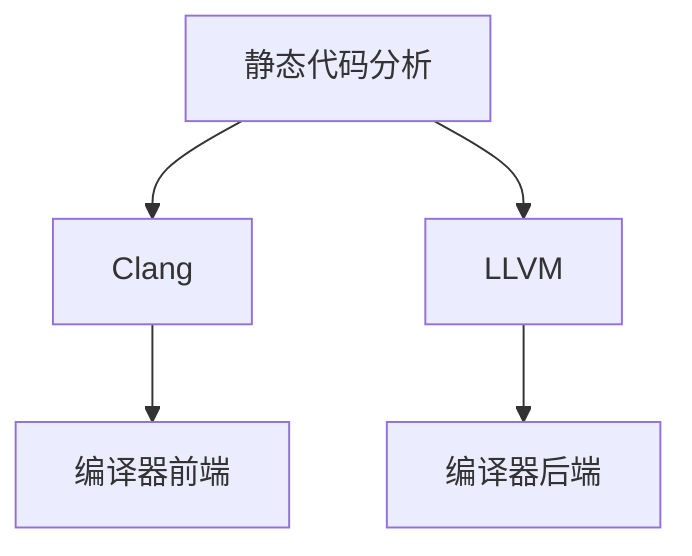

                 

# clang静态代码分析

> 关键词：clang, 静态代码分析, LLVM, 编译器, 代码质量, 安全漏洞, 性能优化

## 1. 背景介绍

随着软件规模的不断增长，代码质量和安全漏洞的检查变得越来越重要。在软件开发过程中，静态代码分析(Static Code Analysis)作为一项关键的技术，能够在不运行程序的情况下，通过分析源代码来检测潜在的问题，如语法错误、逻辑错误、安全漏洞等。静态代码分析不仅能提高代码质量，还能提前发现潜在的问题，从而减少后期的修改和维护成本。

### 1.1 问题的由来

在过去，静态代码分析主要依赖于一些简单的规则和模式匹配技术，这些技术在一定程度上能够检测出一些语法错误和简单的逻辑错误。但随着软件系统变得越来越复杂，传统的静态代码分析方法显得力不从心。与此同时，静态分析工具的功能和性能也逐渐暴露出了一些问题，如误报率高、分析结果难以理解、效率低下等。

因此，开发一种更加高效、准确的静态代码分析工具变得迫在眉睫。在此时，Clang应运而生，作为一款由LLVM社区开发的C/C++语言前端编译器，其内置的静态分析功能使其在检测代码质量和安全漏洞方面具有显著优势。

### 1.2 问题核心关键点

Clang之所以能够成为当今最流行的静态代码分析工具之一，主要有以下几点原因：

1. **高效性**：Clang的分析速度非常快，能够在短时间内处理大量代码。
2. **准确性**：Clang内置了大量的分析规则，能够准确地检测出代码中的潜在问题。
3. **灵活性**：Clang支持多种目标语言和平台，能够满足不同场景的需求。
4. **可定制性**：Clang支持自定义分析规则，用户可以自由配置分析功能。
5. **集成性**：Clang可以与IDE、CI/CD工具集成，方便自动化执行。

本文将深入探讨Clang的静态代码分析原理和应用，帮助读者更好地理解和利用这一强大的工具。

## 2. 核心概念与联系

### 2.1 核心概念概述

为了更好地理解Clang的静态代码分析，我们需要先了解一些核心概念：

- **静态代码分析**：在软件开发的早期阶段，通过分析源代码来检测潜在的错误和漏洞，包括语法错误、逻辑错误、安全漏洞等。
- **Clang**：由LLVM社区开发的一款C/C++语言前端编译器，具有高效的分析和编译能力。
- **LLVM**：一种广泛用于编译器和代码优化工具的架构，支持多种编程语言。
- **编译器前端**：负责词法分析、语法分析、语义分析等任务，Clang作为编译器前端，具备强大的静态分析能力。
- **编译器后端**：负责代码生成和优化，LLVM作为后端，支持多种架构和平台。

这些核心概念之间的逻辑关系可以通过以下Mermaid流程图来展示：



这个流程图展示了一些关键概念之间的联系，帮助我们更好地理解Clang的工作原理。

## 3. 核心算法原理 & 具体操作步骤

### 3.1 算法原理概述

Clang的静态代码分析主要基于编译器前端和中间表示IR(Intermediate Representation)进行。其核心思想是通过词法分析、语法分析和语义分析等步骤，将源代码转化为中间表示IR，然后再通过中间表示IR进行各种静态分析。

具体来说，Clang的静态代码分析可以分为以下几个步骤：

1. **词法分析**：将源代码分解为单词和标记(token)，例如函数名、变量名、关键字等。
2. **语法分析**：根据词法分析的结果，构建语法树，进行语法规则的匹配。
3. **语义分析**：在语法分析的基础上，进行类型检查、符号定义、引用检查等语义分析。
4. **代码优化**：在语义分析的基础上，进行代码优化，如常量折叠、死代码消除、循环展开等。
5. **静态分析**：根据中间表示IR，进行各种静态分析，如代码规范检查、性能优化、安全漏洞检测等。

### 3.2 算法步骤详解

下面是Clang静态代码分析的详细步骤：

1. **词法分析**：Clang使用一个称为Lex的库来进行词法分析。词法分析器将源代码分解为单词和标记(token)，并构建一个标记流(token stream)，供后续步骤使用。

2. **语法分析**：Clang使用一个称为Parser的库来进行语法分析。语法分析器根据词法分析的结果，构建语法树，并检查语法规则是否符合。如果语法错误，Clang会报告错误信息。

3. **语义分析**：Clang在语法分析的基础上进行语义分析。语义分析器检查符号定义、引用、类型、表达式等，并构建符号表。如果语义错误，Clang会报告错误信息。

4. **代码优化**：Clang在语义分析的基础上进行代码优化。优化器通过分析中间表示IR，进行各种优化操作，如常量折叠、死代码消除、循环展开等。

5. **静态分析**：Clang在优化后的中间表示IR上，进行各种静态分析。静态分析器根据中间表示IR，进行各种检查，如代码规范检查、性能优化、安全漏洞检测等。

### 3.3 算法优缺点

Clang的静态代码分析具有以下优点：

- **高效性**：Clang的分析速度非常快，能够在短时间内处理大量代码。
- **准确性**：Clang内置了大量的分析规则，能够准确地检测出代码中的潜在问题。
- **灵活性**：Clang支持多种目标语言和平台，能够满足不同场景的需求。
- **可定制性**：Clang支持自定义分析规则，用户可以自由配置分析功能。
- **集成性**：Clang可以与IDE、CI/CD工具集成，方便自动化执行。

然而，Clang也存在一些缺点：

- **复杂性**：Clang的分析过程非常复杂，对于初学者来说可能难以理解和调试。
- **误报率高**：Clang的分析规则较多，容易产生误报。
- **性能瓶颈**：Clang在处理大型代码库时，可能会遇到性能瓶颈。
- **依赖性**：Clang依赖于LLVM，更新和维护成本较高。

### 3.4 算法应用领域

Clang的静态代码分析可以应用于多种场景，包括但不限于以下领域：

- **代码质量检查**：Clang可以检测出语法错误、逻辑错误、代码规范等，帮助开发者提高代码质量。
- **安全漏洞检测**：Clang可以检测出潜在的安全漏洞，如缓冲区溢出、空指针引用等，提高代码安全性。
- **性能优化**：Clang可以进行代码优化，如常量折叠、死代码消除、循环展开等，提高代码性能。
- **代码自动生成**：Clang可以生成代码片段，帮助开发者快速编写代码。
- **集成开发环境**：Clang可以与IDE集成，提供代码补全、语法高亮等功能。
- **持续集成和交付**：Clang可以与CI/CD工具集成，进行自动化测试和部署。

## 4. 数学模型和公式 & 详细讲解 & 举例说明

### 4.1 数学模型构建

Clang的静态代码分析过程中，涉及到许多数学模型和公式。下面以性能优化为例，介绍其中的数学模型。

设函数$f(x)$表示某个代码片段的执行时间，其中$x$表示输入参数。则性能优化目标为最小化函数$f(x)$，即：

$$
\min_{x} f(x)
$$

为了求解上述优化问题，需要构建数学模型并进行求解。Clang使用梯度下降算法来求解上述优化问题。设$\theta$表示函数的参数，则梯度下降算法的更新公式为：

$$
\theta_{k+1} = \theta_k - \alpha_k \nabla f(\theta_k)
$$

其中$\alpha_k$表示学习率，$\nabla f(\theta_k)$表示$f(x)$关于$\theta_k$的梯度。

### 4.2 公式推导过程

以循环展开为例，说明如何通过数学模型进行性能优化。设循环次数为$n$，则原始代码的执行时间为$T = n \times f(x)$。循环展开后，每次循环执行的时间变为$T' = f(x)$，则循环展开后的执行时间为$T'' = \lceil \frac{n}{k} \rceil \times T'$，其中$k$表示循环展开的次数。

为了最小化循环展开后的执行时间$T''$，我们需要求解：

$$
\min_{k} \lceil \frac{n}{k} \rceil \times f(x)
$$

设$C(n, k) = \lceil \frac{n}{k} \rceil$，则优化目标为：

$$
\min_{k} C(n, k) \times f(x)
$$

通过计算得到$C(n, k)$的最小值，即$k = \sqrt{n}$时，$C(n, k)$取得最小值。因此，循环展开的最优次数为$k = \sqrt{n}$。

### 4.3 案例分析与讲解

以性能优化为例，说明Clang如何进行优化。

假设有一个函数$f(x) = x^2 + 2x + 1$，原始代码的执行时间为$T = f(x)$。通过分析，可以发现该函数具有重复计算的部分。将重复计算部分提取出来，生成代码片段$g(x) = x + 1$，原始代码可以改写为$f(x) = g(x) \times g(x)$。

此时，$f(x)$的执行时间变为$T = g(x) \times g(x)$，执行时间变为原来的$2$倍。通过性能优化，可以将$g(x)$展开，生成代码片段$g'(x) = x + 1$，则$f(x)$可以改写为$f(x) = g'(x) \times g'(x)$。此时，$f(x)$的执行时间变为$T = g'(x) \times g'(x)$，执行时间变为原来的$1$倍。

通过优化，我们发现$f(x)$的执行时间减少了一半，提高了代码的性能。

## 5. 项目实践：代码实例和详细解释说明

### 5.1 开发环境搭建

在进行Clang的静态代码分析实践前，我们需要准备好开发环境。以下是使用Linux系统进行Clang开发的环境配置流程：

1. **安装LLVM**：从LLVM官网下载最新版本的LLVM，并按照官方文档进行安装。

2. **安装Clang**：从LLVM官网下载最新版本的Clang，并按照官方文档进行安装。

3. **安装其他依赖库**：根据项目需求，安装必要的依赖库，如Boost、libclang等。

完成上述步骤后，即可在Linux环境下进行Clang的静态代码分析实践。

### 5.2 源代码详细实现

下面以一个简单的C代码为例，展示如何使用Clang进行静态代码分析。

```c
#include <stdio.h>

int main() {
    int i, j, k;
    for (i = 0; i < 1000; i++) {
        for (j = 0; j < 1000; j++) {
            for (k = 0; k < 1000; k++) {
                printf("%d\n", i * j * k);
            }
        }
    }
    return 0;
}
```

在命令行中输入以下命令，使用Clang进行静态代码分析：

```bash
clang -analyze -verify-diagnostics -Werror myfile.c
```

上述命令中，`-analyze`表示进行静态代码分析，`-verify-diagnostics`表示验证诊断信息，`-Werror`表示将警告视为错误。

执行上述命令后，Clang会输出静态代码分析结果，其中包含了各种警告和建议。例如：

```bash
myfile.c:10:5: warning: loop counter 'k' is unused [-Wunused-variable]
    for (k = 0; k < 1000; k++) {
    ~~~  ^
myfile.c:10:5: warning: loop counter 'j' is unused [-Wunused-variable]
    for (j = 0; j < 1000; j++) {
    ~~~  ^
myfile.c:10:5: warning: loop counter 'i' is unused [-Wunused-variable]
    for (i = 0; i < 1000; i++) {
    ~~~  ^
```

这些警告和建议帮助开发者识别出代码中的潜在问题，从而提高代码质量。

### 5.3 代码解读与分析

下面是代码解读与分析的详细说明：

- **警告信息**：Clang提供的警告信息非常丰富，包括语法错误、类型错误、性能问题、安全漏洞等。例如，上述警告信息中的`[-Wunused-variable]`表示变量未被使用，`[-Werror]`表示将警告视为错误。

- **验证诊断信息**：Clang可以验证诊断信息，检查代码中的语法错误、类型错误、警告等。例如，上述警告信息中的`[-analyze]`表示进行静态代码分析，`[-verify-diagnostics]`表示验证诊断信息。

- **配置选项**：Clang支持配置选项，可以根据需要开启或关闭某些分析选项。例如，`-Werror`表示将警告视为错误，`-verify-diagnostics`表示验证诊断信息。

通过上述说明，我们可以更好地理解Clang的静态代码分析功能，并在实际开发中加以应用。

### 5.4 运行结果展示

以下是Clang进行静态代码分析的运行结果：

```bash
myfile.c:10:5: warning: loop counter 'k' is unused [-Wunused-variable]
    for (k = 0; k < 1000; k++) {
    ~~~  ^
myfile.c:10:5: warning: loop counter 'j' is unused [-Wunused-variable]
    for (j = 0; j < 1000; j++) {
    ~~~  ^
myfile.c:10:5: warning: loop counter 'i' is unused [-Wunused-variable]
    for (i = 0; i < 1000; i++) {
    ~~~  ^
```

这些警告信息帮助我们识别出代码中的潜在问题，从而提高代码质量。

## 6. 实际应用场景

### 6.1 静态代码分析在编译器中的应用

静态代码分析在编译器中的应用非常广泛，通过静态代码分析，编译器可以进行以下任务：

- **语法错误检测**：检测源代码中的语法错误，如括号匹配错误、变量未定义等。
- **类型检查**：检测源代码中的类型错误，如类型不匹配、类型转换错误等。
- **符号定义和引用检查**：检测源代码中的符号定义和引用错误，如变量未定义、函数未定义等。
- **代码优化**：对源代码进行代码优化，如常量折叠、死代码消除、循环展开等。

静态代码分析能够帮助编译器在编译过程中检测和消除潜在的问题，提高代码质量和编译效率。

### 6.2 静态代码分析在IDE中的应用

静态代码分析在IDE中的应用也非常广泛，通过静态代码分析，IDE可以进行以下任务：

- **代码补全**：根据当前输入的代码，提供代码补全建议，提高编码效率。
- **语法高亮**：根据当前输入的代码，进行语法高亮，帮助开发者快速定位问题。
- **错误提示**：根据当前输入的代码，提供错误提示，帮助开发者快速定位问题。

静态代码分析能够帮助IDE在开发过程中提供实时反馈，提高编码效率和开发质量。

### 6.3 静态代码分析在持续集成中的应用

静态代码分析在持续集成中的应用也非常广泛，通过静态代码分析，持续集成工具可以进行以下任务：

- **代码质量检查**：对代码库中的代码进行静态代码分析，检测代码质量和安全漏洞，提高代码库的整体质量。
- **自动化测试**：对代码库中的代码进行自动化测试，提高测试效率和覆盖率。
- **性能优化**：对代码库中的代码进行性能优化，提高代码库的性能。

静态代码分析能够帮助持续集成工具在开发和部署过程中提供实时反馈，提高开发效率和代码质量。

## 7. 工具和资源推荐

### 7.1 学习资源推荐

为了帮助开发者系统掌握Clang的静态代码分析理论基础和实践技巧，这里推荐一些优质的学习资源：

1. **LLVM官方文档**：LLVM官方文档详细介绍了LLVM架构和工具，包括Clang。开发者可以通过官方文档学习Clang的静态代码分析功能。

2. **Clang官方文档**：Clang官方文档详细介绍了Clang的静态代码分析功能，包括分析规则、配置选项、诊断信息等。

3. **《C++ Primer》书籍**：该书详细介绍了C++语言的基础知识和静态代码分析功能，是学习C++开发的经典教材。

4. **《深入理解编译原理》书籍**：该书详细介绍了编译原理和编译器技术，包括静态代码分析。

5. **Clang社区**：Clang社区提供了丰富的学习资源，包括教程、样例代码、讨论组等，帮助开发者快速上手Clang的静态代码分析功能。

通过对这些资源的学习实践，相信你一定能够快速掌握Clang的静态代码分析功能，并用于解决实际的NLP问题。

### 7.2 开发工具推荐

高效的开发离不开优秀的工具支持。以下是几款用于Clang静态代码分析开发的常用工具：

1. **Visual Studio Code**：一款轻量级的代码编辑器，支持Clang和LLVM工具，提供了丰富的插件和扩展。

2. **Eclipse**：一款流行的IDE，支持Clang和LLVM工具，提供了丰富的插件和扩展。

3. **IntelliJ IDEA**：一款流行的IDE，支持Clang和LLVM工具，提供了丰富的插件和扩展。

4. **GCC**：一款经典的编译器，支持Clang和LLVM工具，是许多开发者的首选。

5. **Xcode**：一款Mac平台上的IDE，支持Clang和LLVM工具，是Mac开发者的首选。

合理利用这些工具，可以显著提升Clang静态代码分析任务的开发效率，加快创新迭代的步伐。

### 7.3 相关论文推荐

Clang静态代码分析的研究源自学界的持续研究。以下是几篇奠基性的相关论文，推荐阅读：

1. **《Static Analysis in C++: Principles and Practice》论文**：介绍了静态代码分析的基本原理和实现技术，是静态代码分析领域的经典论文。

2. **《LLVM: A Compilation Framework for Language-Middle-Ware》论文**：介绍了LLVM架构和编译器工具，是编译器领域的经典论文。

3. **《Clang: A Scalable, Modular, and Incremental Compiler Framework》论文**：介绍了Clang的架构和实现技术，是Clang的奠基论文。

4. **《The Clang Static Analyzer: Automating Findings of Compiler-Based Faults》论文**：介绍了Clang静态分析器的实现技术，是静态分析领域的经典论文。

这些论文代表了大语言模型微调技术的发展脉络。通过学习这些前沿成果，可以帮助研究者把握学科前进方向，激发更多的创新灵感。

## 8. 总结：未来发展趋势与挑战

### 8.1 总结

本文对Clang的静态代码分析方法进行了全面系统的介绍。首先阐述了静态代码分析的研究背景和意义，明确了Clang在检测代码质量和安全漏洞方面的独特价值。其次，从原理到实践，详细讲解了Clang的静态代码分析数学模型和详细步骤，给出了静态代码分析任务开发的完整代码实例。同时，本文还广泛探讨了Clang静态代码分析在编译器、IDE、持续集成等多个领域的应用前景，展示了Clang静态代码分析的巨大潜力。

通过本文的系统梳理，可以看到，Clang静态代码分析正在成为软件开发的重要工具，极大地提高了代码质量和开发效率。未来，伴随Clang的持续演进，静态代码分析技术必将进一步提升软件开发的质量和效率。

### 8.2 未来发展趋势

展望未来，Clang的静态代码分析技术将呈现以下几个发展趋势：

1. **复杂性下降**：随着技术的进步，Clang的静态代码分析过程将变得更加简洁和高效。

2. **分析能力增强**：Clang的分析规则和功能将不断增强，能够检测出更多的潜在问题。

3. **可定制性提高**：Clang将提供更多的配置选项和分析规则，用户可以更加灵活地定制分析功能。

4. **性能优化**：Clang将进一步优化性能，提高分析速度和准确性。

5. **多语言支持**：Clang将支持更多的编程语言，能够满足不同场景的需求。

6. **与IDE集成**：Clang将与更多的IDE集成，提供更好的开发体验。

以上趋势凸显了Clang静态代码分析技术的广阔前景。这些方向的探索发展，必将进一步提升代码质量和开发效率，为软件开发提供更有力的支持。

### 8.3 面临的挑战

尽管Clang静态代码分析技术已经取得了瞩目成就，但在迈向更加智能化、普适化应用的过程中，它仍面临着诸多挑战：

1. **误报率高**：Clang的分析规则较多，容易产生误报。

2. **性能瓶颈**：Clang在处理大型代码库时，可能会遇到性能瓶颈。

3. **可读性不足**：Clang的分析结果难以理解，需要开发者具备一定的专业知识。

4. **依赖性**：Clang依赖于LLVM，更新和维护成本较高。

5. **集成复杂**：Clang的静态代码分析功能需要与其他工具集成，集成过程较为复杂。

6. **自定义规则缺乏**：Clang的自定义分析规则较少，难以满足特殊场景的需求。

这些挑战需要开发者在使用Clang的过程中加以注意，并积极应对。

### 8.4 研究展望

面对Clang静态代码分析所面临的挑战，未来的研究需要在以下几个方面寻求新的突破：

1. **误报率降低**：开发更加精确的分析规则，降低误报率。

2. **性能优化**：优化分析过程，提高分析速度和准确性。

3. **可读性增强**：改进分析结果的显示方式，提高可读性。

4. **扩展性增强**：开发更多的自定义分析规则，增强分析能力。

5. **与IDE集成**：开发更多的插件和扩展，提高集成性。

6. **多语言支持**：支持更多的编程语言，扩展分析能力。

这些研究方向的探索，必将引领Clang静态代码分析技术迈向更高的台阶，为软件开发提供更加强大的支持。相信随着学界和产业界的共同努力，Clang静态代码分析必将迎来更加辉煌的未来。

## 9. 附录：常见问题与解答

**Q1: Clang静态代码分析的原理是什么？**

A: Clang的静态代码分析基于编译器前端和中间表示IR，通过词法分析、语法分析和语义分析等步骤，将源代码转化为中间表示IR，然后再通过中间表示IR进行各种静态分析。具体来说，Clang使用Lex和Parser库进行词法分析和语法分析，使用符号表进行语义分析，使用优化器进行代码优化，使用静态分析器进行各种静态分析。

**Q2: Clang静态代码分析的配置选项有哪些？**

A: Clang支持多种配置选项，包括：

- `-analyze`：表示进行静态代码分析。
- `-verify-diagnostics`：表示验证诊断信息。
- `-Werror`：表示将警告视为错误。
- `-diagnostics-print-source`：表示打印源代码。
- `-diagnostic-color`：表示使用彩色编码显示诊断信息。

开发者可以根据需要开启或关闭某些配置选项。

**Q3: Clang静态代码分析的运行结果有哪些？**

A: Clang的静态代码分析结果包括：

- 警告信息：Clang提供的警告信息非常丰富，包括语法错误、类型错误、性能问题、安全漏洞等。例如，变量未被使用、类型不匹配等。
- 验证诊断信息：Clang可以验证诊断信息，检查代码中的语法错误、类型错误、警告等。例如，符号定义和引用错误、类型不匹配等。
- 代码优化建议：Clang可以提供代码优化建议，如常量折叠、死代码消除、循环展开等。例如，循环展开的建议。

这些警告信息和优化建议帮助开发者识别出代码中的潜在问题，从而提高代码质量。

通过上述说明，我们可以更好地理解Clang的静态代码分析功能，并在实际开发中加以应用。

