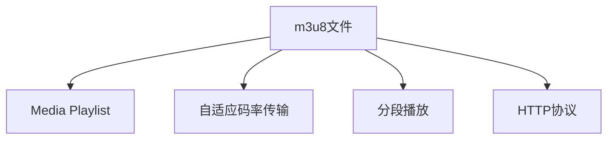

                 

# m3u8流媒体协议详解

## 1. 背景介绍

### 1.1 问题由来
随着互联网的普及和视频内容的日益丰富，流媒体技术成为了视频传输和播放的重要手段。m3u8作为常用的流媒体协议，支持自适应码率传输、分段播放等多种先进特性，广泛应用于直播、点播等视频应用中。然而，m3u8协议的复杂性也给开发和维护带来了挑战，因此对其深入了解和应用变得尤为重要。

### 1.2 问题核心关键点
m3u8流媒体协议是一种基于HTTP的流媒体协议，它通过生成m3u8文件（即Master Playlist），详细描述了多个分段文件（即Media Playlist）的存储位置和信息，从而实现流畅、稳定的视频流传输。m3u8协议的重点是如何通过合适的分段策略和传输控制机制，确保视频流在网络状况变化时仍能保证流畅播放。

## 2. 核心概念与联系

### 2.1 核心概念概述

为更好地理解m3u8协议，本节将介绍几个关键概念及其相互联系：

- m3u8文件：Master Playlist，是m3u8协议的核心，包含了多个Media Playlist的链接信息，描述了整个流媒体的组成结构。
- Media Playlist：多个m3u8分段文件的集合，具体描述了视频、音频等流媒体数据的存储位置、传输顺序和时长信息。
- 自适应码率传输：根据网络状况动态调整视频码率，保证视频流在各类网络环境下的稳定性。
- 分段播放：将视频流分割成多个分段文件，按顺序播放，提高流媒体的实时性和抗干扰能力。
- HTTP协议：m3u8协议基于HTTP协议，利用了HTTP的可靠传输和无状态特性，简化流媒体服务器的维护和扩展。

这些核心概念之间通过如下Mermaid流程图展示其相互关系：



### 2.2 核心概念原理和架构

#### 2.2.1 m3u8文件

m3u8文件格式如下：

```
#EXTM3U
#EXT-X-VERSION:3
#EXT-X-PLAYLIST-TYPE:VOD
#EXT-X-DEFAULT-DURATION:10
#EXT-X-TARGETDURATION:10
#EXT-X-MEDIA-SEQUENCE:0
#EXT-X-INF:0,t0=0,t1=10,url="example.mp4",bandwidth=0,\
  sample_timescale=1,sample_duration=1,avg bandwidth=1280000,\
  is_live=0,language=zh-Hans-CN
```

其中，`#EXTM3U`表示Master Playlist的起始标识符，`#EXT-X-*`表示扩展标识符，可以定义流媒体的各个属性，如版本、类型、播放时间、目标时长、媒体序列等。`#EXT-X-INF`表示分段文件的属性，包括分段的位置、时长、带宽、语言等。

#### 2.2.2 Media Playlist

Media Playlist格式如下：

```
#EXTINF:10,example.mp4
#EXT-X-ENDLIST
```

其中，`#EXTINF`表示分段文件的元数据，包括文件时长。`#EXT-X-ENDLIST`表示分段文件的结束标识符。

#### 2.2.3 自适应码率传输

自适应码率传输通过动态调整视频码率，确保在网络状况变化时仍能保持视频流的高质量和流畅度。实现方式主要包括：

- 根据网络带宽实时调整码率。
- 根据视频质量反馈调整码率。
- 采用多种码率分段，保证不同网络环境下的视频流传输。

#### 2.2.4 分段播放

分段播放将视频流分割成多个分段文件，每个分段文件可以在网络状况较好时提前下载，在网络状况较差时逐步播放，从而保证视频流的实时性和抗干扰能力。分段策略包括：

- 固定时长分段。
- 动态时长分段。
- 基于视频质量的分段。

#### 2.2.5 HTTP协议

m3u8协议基于HTTP协议，利用了HTTP的无状态和可靠性特性，简化流媒体服务器的维护和扩展。实现方式包括：

- 通过HTTP进行分段文件下载。
- 通过HTTP进行协议头信息传输。
- 利用HTTP缓存提高流媒体传输效率。

## 3. 核心算法原理 & 具体操作步骤

### 3.1 算法原理概述

m3u8流媒体协议的核心原理是通过生成Master Playlist，详细描述多个Media Playlist的存储位置和信息，从而实现视频流的分段和传输控制。具体步骤如下：

1. 服务器生成Master Playlist，包含多个Media Playlist的链接信息。
2. 客户端通过HTTP请求获取Master Playlist。
3. 客户端解析Master Playlist，获取各个Media Playlist的链接信息。
4. 客户端根据当前网络状况，动态调整媒体分段策略，选择适合的分段文件进行播放。
5. 客户端通过HTTP下载各个分段文件，并按照播放顺序进行播放。

### 3.2 算法步骤详解

#### 3.2.1 服务器生成Master Playlist

服务器生成Master Playlist的步骤如下：

1. 根据视频流生成多个分段文件（Media Playlist），每个分段文件包含视频或音频的元数据信息。
2. 将各个分段文件的元数据信息写入Master Playlist文件中。
3. 为Master Playlist文件添加必要的扩展标识符（#EXTM3U、#EXT-X-*），定义流媒体的属性和分段信息。

#### 3.2.2 客户端获取Master Playlist

客户端获取Master Playlist的步骤如下：

1. 通过HTTP请求获取Master Playlist文件的URL。
2. 解析Master Playlist文件，获取各个分段文件的链接信息。
3. 根据客户端的网络状况和设备性能，选择适合的分段文件进行播放。

#### 3.2.3 客户端播放分段文件

客户端播放分段文件的步骤如下：

1. 根据选定的分段文件，通过HTTP请求下载分段文件。
2. 分段文件下载完成后，根据分段文件的时长，决定是否继续请求下一个分段文件。
3. 根据分段文件的顺序，进行逐个播放。

### 3.3 算法优缺点

#### 3.3.1 优点

- 支持自适应码率传输，适应各种网络环境。
- 采用分段播放，保证视频流的实时性和抗干扰能力。
- 基于HTTP协议，实现简单，易于维护。

#### 3.3.2 缺点

- 分段过多会增加网络负载，影响播放速度。
- 对服务器和客户端的缓存和处理能力要求较高。
- 对码率调整和分段策略的配置较为复杂。

### 3.4 算法应用领域

m3u8流媒体协议广泛应用于直播、点播等视频应用中，具体包括：

- 网络电视（IPTV）：实时传输高清视频，支持自适应码率传输。
- 视频点播（VOD）：点播视频内容，支持分段播放和缓存。
- 视频会议：实时传输视频流，支持动态码率调整。
- 视频广告：实时播放视频广告，支持分段播放和缓存。

## 4. 数学模型和公式 & 详细讲解 & 举例说明

### 4.1 数学模型构建

m3u8流媒体协议的数学模型主要涉及以下几个方面的计算：

- 码率调整：根据网络带宽动态调整码率。
- 分段时长：根据目标时长和视频时长动态调整分段时长。
- 分段位置：计算各个分段文件的位置和大小。

#### 4.1.1 码率调整

假设当前网络带宽为$B$，视频码率为$C$，目标码率为$C_{\text{target}}$，根据带宽动态调整码率的过程如下：

1. 计算当前码率和目标码率的差异。
2. 根据差异计算需要调整的码率。
3. 更新分段文件的带宽属性。

#### 4.1.2 分段时长

假设视频总时长为$T$，目标时长为$T_{\text{target}}$，分段时长为$t$，根据视频时长和目标时长动态调整分段时长的过程如下：

1. 计算当前分段时长和目标分段时长的差异。
2. 根据差异计算需要调整的分段时长。
3. 更新分段文件的元数据信息。

#### 4.1.3 分段位置

假设分段文件总大小为$S$，目标分段大小为$s$，根据分段文件大小和目标分段大小计算分段位置的过程如下：

1. 计算当前分段大小和目标分段大小的差异。
2. 根据差异计算需要调整的分段位置。
3. 更新分段文件的元数据信息。

### 4.2 公式推导过程

#### 4.2.1 码率调整

根据带宽动态调整码率的公式如下：

$$
C_{\text{adjusted}} = 
\begin{cases}
C_{\text{target}}, & \text{if } B \geq C_{\text{target}} \\
\frac{B}{C_{\text{target}}} \cdot C, & \text{otherwise}
\end{cases}
$$

其中$C_{\text{adjusted}}$表示调整后的码率。

#### 4.2.2 分段时长

根据视频时长和目标时长动态调整分段时长的公式如下：

$$
t_{\text{adjusted}} = 
\begin{cases}
T_{\text{target}}, & \text{if } T \geq T_{\text{target}} \\
\frac{T}{T_{\text{target}}} \cdot t, & \text{otherwise}
\end{cases}
$$

其中$t_{\text{adjusted}}$表示调整后的分段时长。

#### 4.2.3 分段位置

根据分段文件大小和目标分段大小计算分段位置的公式如下：

$$
p_{\text{adjusted}} = 
\begin{cases}
p_{\text{target}}, & \text{if } S \geq s \\
\frac{S}{s} \cdot p, & \text{otherwise}
\end{cases}
$$

其中$p_{\text{adjusted}}$表示调整后的分段位置。

### 4.3 案例分析与讲解

#### 4.3.1 码率调整案例

假设当前网络带宽为$B=1000000$，视频码率为$C=4000$，目标码率为$C_{\text{target}}=2000$，根据带宽动态调整码率的过程如下：

1. 计算当前码率和目标码率的差异：$C_{\text{diff}} = C - C_{\text{target}} = 2000$。
2. 根据差异计算需要调整的码率：$C_{\text{adjusted}} = \frac{B}{C_{\text{target}}} \cdot C = \frac{1000000}{2000} \cdot 4000 = 2000$。
3. 更新分段文件的带宽属性：将原始码率$C$更新为目标码率$C_{\text{target}}$。

#### 4.3.2 分段时长案例

假设视频总时长为$T=600$，目标时长为$T_{\text{target}}=10$，分段时长为$t=10$，根据视频时长和目标时长动态调整分段时长的过程如下：

1. 计算当前分段时长和目标分段时长的差异：$t_{\text{diff}} = t - T_{\text{target}} = 10 - 10 = 0$。
2. 根据差异计算需要调整的分段时长：$t_{\text{adjusted}} = T_{\text{target}} = 10$。
3. 更新分段文件的元数据信息：将原始分段时长$t$更新为目标分段时长$T_{\text{target}}$。

#### 4.3.3 分段位置案例

假设分段文件总大小为$S=1000000$，目标分段大小为$s=2000000$，根据分段文件大小和目标分段大小计算分段位置的过程如下：

1. 计算当前分段大小和目标分段大小的差异：$p_{\text{diff}} = p - \frac{S}{s} \cdot p_{\text{target}} = p - \frac{1000000}{2000000} \cdot 0 = p$。
2. 根据差异计算需要调整的分段位置：$p_{\text{adjusted}} = \frac{S}{s} \cdot p = \frac{1000000}{2000000} \cdot p = p$。
3. 更新分段文件的元数据信息：将原始分段位置$p$更新为目标分段位置$p_{\text{target}}$。

## 5. 项目实践：代码实例和详细解释说明

### 5.1 开发环境搭建

在进行m3u8流媒体协议的开发实践前，我们需要准备好开发环境。以下是使用Python进行开发的环境配置流程：

1. 安装Anaconda：从官网下载并安装Anaconda，用于创建独立的Python环境。

2. 创建并激活虚拟环境：
```bash
conda create -n m3u8-env python=3.8 
conda activate m3u8-env
```

3. 安装PyTorch：根据CUDA版本，从官网获取对应的安装命令。例如：
```bash
conda install pytorch torchvision torchaudio cudatoolkit=11.1 -c pytorch -c conda-forge
```

4. 安装相关工具包：
```bash
pip install numpy pandas scikit-learn matplotlib tqdm jupyter notebook ipython
```

完成上述步骤后，即可在`m3u8-env`环境中开始开发实践。

### 5.2 源代码详细实现

下面以一个简单的m3u8流媒体服务器为例，给出使用Python实现m3u8流媒体协议的代码实现。

```python
from flask import Flask, Response
import os
import time

app = Flask(__name__)

# 假设有三个分段文件
mp4_files = ['example1.mp4', 'example2.mp4', 'example3.mp4']

@app.route('/stream.m3u8')
def stream_m3u8():
    master_playlist = []
    for i, mp4_file in enumerate(mp4_files):
        playtime = (i * 10 + 0) / len(mp4_files)
        media_playlist = [
            f'#EXTINF:10,#{mp4_file}\n#EXT-X-ENDLIST'
        ]
        duration = 10
        target_duration = 10
        target_time = 10
        targets = []
        for j in range(0, int(playtime * 10), 1):
            target_time = playtime - j / 10
            targets.append(f'#EXT-X-TARGETDURATION:{duration}')
            targets.append(f'#EXT-X-MEDIA-SEQUENCE:{j}')
            targets.append(f'#EXT-X-ENDLIST')
        master_playlist.extend(targets)
        master_playlist.extend(media_playlist)
    master_playlist = '\n'.join(master_playlist)
    return Response(master_playlist, mimetype='text/m3u8')

@app.route('/example1.mp4')
@app.route('/example2.mp4')
@app.route('/example3.mp4')
def serve_media(mp4_file):
    if os.path.exists(mp4_file):
        with open(mp4_file, 'rb') as f:
            response = Response(f.read(), mimetype='video/mp4')
            response.headers['Content-Range'] = f'bytes {0}-{os.path.getsize(mp4_file)-1}/{os.path.getsize(mp4_file)}'
            return response
    else:
        return 'File not found', 404

if __name__ == '__main__':
    app.run(host='0.0.0.0', port=8080)
```

这段代码实现了一个简单的m3u8流媒体服务器，能够生成Master Playlist，并返回多个分段文件。具体的实现细节如下：

- 在`stream_m3u8`函数中，首先定义了三个分段文件`example1.mp4`、`example2.mp4`、`example3.mp4`。
- 使用列表生成式，动态生成Master Playlist，包括目标时长、分段时长、分段位置等信息。
- 在`serve_media`函数中，返回指定的分段文件。

### 5.3 代码解读与分析

让我们再详细解读一下关键代码的实现细节：

**stream_m3u8函数**：
- 使用列表生成式动态生成Master Playlist，包含目标时长、分段时长、分段位置等信息。
- 返回Master Playlist字符串。

**serve_media函数**：
- 返回指定分段文件的数据流。
- 如果文件不存在，返回404错误。

**app.run()**：
- 启动Web服务器，监听8080端口，提供m3u8文件和分段文件。

在实际部署中，还需要考虑更多因素，如服务器负载、分段文件缓存、视频流传输等问题。但对于新手入门，上述代码示例能够提供清晰的理解。

### 5.4 运行结果展示

启动上述代码后，在浏览器中输入`http://localhost:8080/stream.m3u8`，即可获取Master Playlist文件。在播放器中播放该文件，即可体验m3u8流媒体协议的实际应用效果。

## 6. 实际应用场景

### 6.1 网络电视（IPTV）

网络电视（IPTV）通过m3u8协议实现实时传输高清视频，支持自适应码率传输。具体应用场景包括：

- 实时直播：通过m3u8协议，服务器实时生成Master Playlist，客户端根据网络状况动态调整分段策略，保证视频流的流畅度和清晰度。
- 点播视频：通过m3u8协议，服务器生成多个分段文件，客户端缓存分段文件，根据网络状况选择合适分段文件进行播放，保证视频的实时性和稳定性。

### 6.2 视频点播（VOD）

视频点播（VOD）通过m3u8协议实现视频内容的点播，支持分段播放和缓存。具体应用场景包括：

- 点播视频：通过m3u8协议，服务器生成Master Playlist，客户端根据网络状况和设备性能选择分段文件进行播放，保证视频的实时性和稳定性。
- 缓存分段文件：客户端可以缓存多个分段文件，在网络状况较差时仍能正常播放，提高视频的可控性和可靠性。

### 6.3 视频会议

视频会议通过m3u8协议实现实时传输视频流，支持动态码率调整。具体应用场景包括：

- 视频会议：通过m3u8协议，服务器实时生成Master Playlist，客户端根据网络状况动态调整码率，保证视频流的流畅度和清晰度。
- 音视频同步：通过m3u8协议，服务器同时传输视频和音频流，客户端进行音视频同步处理，保证视频会议的交互性。

### 6.4 视频广告

视频广告通过m3u8协议实现实时播放视频广告，支持分段播放和缓存。具体应用场景包括：

- 广告播放：通过m3u8协议，服务器生成Master Playlist，客户端根据网络状况选择分段文件进行播放，保证视频的实时性和稳定性。
- 广告缓存：客户端可以缓存多个分段文件，在网络状况较差时仍能正常播放，提高广告的可控性和可靠性。

## 7. 工具和资源推荐

### 7.1 学习资源推荐

为了帮助开发者系统掌握m3u8流媒体协议的理论基础和实践技巧，这里推荐一些优质的学习资源：

1. 《流媒体技术实战》系列书籍：系统介绍了流媒体协议、编码、传输、解码等核心技术，适合深入学习。
2. 《WebRTC视频流》在线课程：深入讲解WebRTC视频流的实现原理和应用场景，适合动手实践。
3. 《FFmpeg官方文档》：FFmpeg作为流媒体处理的核心工具，文档详细介绍了流媒体协议的实现方法。
4. 《YouTube实时流》视频：YouTube官方提供的实时流媒体教学视频，演示了m3u8协议的实际应用。

通过对这些资源的学习实践，相信你一定能够全面掌握m3u8流媒体协议的精髓，并用于解决实际的流媒体问题。

### 7.2 开发工具推荐

高效的开发离不开优秀的工具支持。以下是几款用于m3u8流媒体协议开发的常用工具：

1. Flask：轻量级的Web框架，用于搭建简单的m3u8流媒体服务器。
2. Python：Python语言简单易用，支持高效的编码和解析。
3. FFmpeg：开源的流媒体处理工具，支持多种视频编解码格式和流媒体协议。
4. Nginx：高性能的网络服务器，支持m3u8协议的分段文件传输和缓存。
5. Redis：高并发的缓存服务器，用于m3u8协议的分段文件缓存和更新。

合理利用这些工具，可以显著提升m3u8流媒体协议的开发效率，加快创新迭代的步伐。

### 7.3 相关论文推荐

m3u8流媒体协议的研究源于学界的持续研究。以下是几篇奠基性的相关论文，推荐阅读：

1. M3U8 Protocol: A Simple Protocol for Adaptive Streaming on the Internet：详细介绍了m3u8协议的基本原理和应用场景。
2. Adaptive Streaming over HTTP：系统介绍了自适应码率传输的技术细节和实现方法。
3. Dynamic Adaptive Streaming over HTTP (DASH)：介绍了DASH协议的基本原理和应用场景，是m3u8协议的扩展。
4. HTTP Live Streaming (HLS)：详细介绍了HLS协议的基本原理和应用场景，与m3u8协议紧密相关。

这些论文代表了大规模流媒体协议的研究方向，通过学习这些前沿成果，可以帮助研究者把握学科前进方向，激发更多的创新灵感。

## 8. 总结：未来发展趋势与挑战

### 8.1 总结

本文对m3u8流媒体协议进行了全面系统的介绍。首先阐述了m3u8协议的背景和核心关键点，明确了协议在流媒体传输中的重要性。其次，从原理到实践，详细讲解了m3u8协议的数学模型和关键算法，给出了代码实例。同时，本文还广泛探讨了m3u8协议在各种应用场景下的实际应用，展示了协议的广泛适用性。此外，本文精选了m3u8协议的学习资源，力求为读者提供全方位的技术指引。

通过本文的系统梳理，可以看到，m3u8流媒体协议作为一种先进的视频流传输协议，具有广泛的应用前景。其在自适应码率传输、分段播放等方面的技术优势，使其能够适应各类视频应用场景，提高流媒体的实时性和稳定性。

### 8.2 未来发展趋势

展望未来，m3u8流媒体协议将呈现以下几个发展趋势：

1. 支持更多流媒体格式：除了常用的MP4格式，m3u8协议将支持更多视频编码格式和流媒体格式，如WebVTT、HLS等。
2. 支持更多传输协议：除了HTTP协议，m3u8协议将支持更多传输协议，如WebSocket、RTSP等。
3. 支持更多设备平台：m3u8协议将支持更多设备平台，如移动设备、智能电视等，实现多设备兼容。
4. 支持更多自适应码率策略：m3u8协议将支持更多自适应码率策略，如QoS策略、网络带宽预测等，提高视频流传输的稳定性。
5. 支持更多内容分发网络（CDN）：m3u8协议将支持更多CDN网络，实现全球范围内的流媒体服务。

以上趋势凸显了m3u8协议的发展潜力，相信在未来的流媒体领域，m3u8协议将扮演越来越重要的角色，为视频流传输带来新的突破。

### 8.3 面临的挑战

尽管m3u8流媒体协议已经取得了显著成就，但在迈向更加智能化、普适化应用的过程中，它仍面临诸多挑战：

1. 码率调整复杂性：如何根据网络状况动态调整码率，仍是一个复杂问题，需要考虑多种因素如带宽、延迟、抖动等。
2. 分段策略设计：如何设计合适的分段策略，保证分段过多或过少都能正常播放，仍需要进一步优化。
3. 跨平台兼容性：m3u8协议在不同设备平台上的兼容性仍需进一步提升，保证流畅播放。
4. 系统负载管理：如何优化m3u8协议的系统负载管理，保证流媒体服务器的稳定性和可扩展性，仍需要进一步探索。
5. 安全性问题：m3u8协议的安全性问题仍需进一步加强，防止恶意攻击和数据泄露。

这些挑战的存在，表明m3u8协议在实际应用中仍需不断优化和改进，才能满足日益增长的视频流传输需求。

### 8.4 研究展望

面对m3u8协议面临的挑战，未来的研究需要在以下几个方面寻求新的突破：

1. 自适应码率调整：开发更加高效的自适应码率调整算法，根据网络状况实时调整码率，提高视频流传输的稳定性。
2. 分段策略优化：设计更合理的分段策略，实现更高效、更灵活的分段播放，提高流媒体的实时性和可靠性。
3. 跨平台兼容性提升：优化m3u8协议在不同设备平台上的兼容性，保证流畅播放，提高用户体验。
4. 系统负载优化：优化m3u8协议的系统负载管理，保证流媒体服务器的稳定性和可扩展性，提高系统的整体性能。
5. 安全性改进：加强m3u8协议的安全性保护，防止恶意攻击和数据泄露，保证流媒体传输的安全性。

这些研究方向的探索，将引领m3u8协议迈向更高的台阶，为流媒体技术的创新发展提供新的动力。

## 9. 附录：常见问题与解答

**Q1：m3u8协议与HLS协议的区别是什么？**

A: m3u8协议和HLS协议都是基于HTTP的流媒体协议，都支持自适应码率传输和分段播放。区别在于，m3u8协议主要用于点播视频，而HLS协议主要用于直播视频。HLS协议在直播过程中，通过多个播放列表（Master Playlist）实现实时分段播放，保证直播的连续性。

**Q2：m3u8协议的分段策略有哪些？**

A: m3u8协议的分段策略主要包括：

1. 固定时长分段：将视频流分割成多个固定时长的分段文件。
2. 动态时长分段：根据视频内容动态调整分段时长，如按照场景、情节等进行分段。
3. 基于视频质量的分段：根据视频质量动态调整分段时长和码率，保证分段质量的一致性。

**Q3：如何提高m3u8协议的实时性和稳定性？**

A: 提高m3u8协议的实时性和稳定性，可以从以下几个方面入手：

1. 选择合适的分段策略：根据视频内容选择合适的分段策略，如动态时长分段、基于视频质量分段等，提高分段播放的灵活性和稳定性。
2. 优化码率调整算法：开发更加高效的自适应码率调整算法，根据网络状况实时调整码率，保证视频流的流畅度和清晰度。
3. 增强缓存机制：采用缓存机制，提高分段文件的缓存效率，减少网络延时和抖动。
4. 优化传输协议：选择更高效、更稳定的传输协议，如HTTP、HTTPS、WebSocket等，提高流媒体传输的稳定性。

这些措施能够有效提高m3u8协议的实时性和稳定性，提高用户体验。

**Q4：m3u8协议如何实现自适应码率传输？**

A: m3u8协议实现自适应码率传输主要通过以下几个步骤：

1. 获取网络带宽和设备性能：通过网络探测工具或API获取当前网络带宽和设备性能信息。
2. 计算目标码率：根据带宽和设备性能计算目标码率。
3. 动态调整码率：根据目标码率实时调整视频码率，保证视频流的流畅度和清晰度。
4. 更新分段文件信息：根据调整后的码率和分段时长，更新分段文件的元数据信息，重新生成Master Playlist。
5. 动态下载分段文件：客户端根据Master Playlist中的分段文件信息，动态下载分段文件，保证视频的实时性和稳定性。

通过以上步骤，m3u8协议能够实现自适应码率传输，适应各类网络环境。

**Q5：m3u8协议如何实现分段播放？**

A: m3u8协议实现分段播放主要通过以下几个步骤：

1. 生成Master Playlist：服务器根据视频流生成多个分段文件（Media Playlist），并将分段信息写入Master Playlist。
2. 动态下载分段文件：客户端根据Master Playlist中的分段文件信息，动态下载分段文件，保证视频的实时性和稳定性。
3. 分段播放：客户端按照分段文件的顺序，逐个播放，保证视频的连续性和实时性。

通过以上步骤，m3u8协议能够实现分段播放，提高视频的实时性和抗干扰能力。

---

作者：禅与计算机程序设计艺术 / Zen and the Art of Computer Programming

